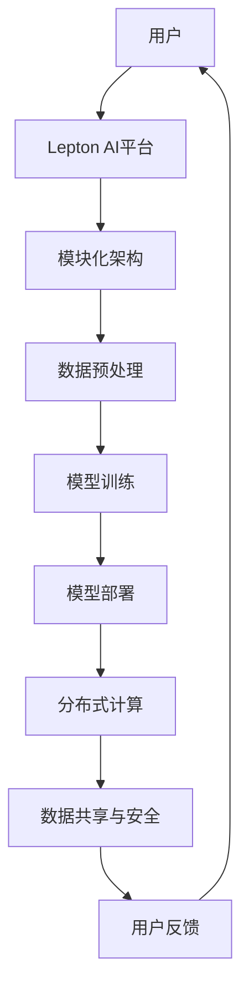

                 

 关键词：AI基础设施、普惠AI、Lepton AI、AI民主化、人工智能普及

> 摘要：本文深入探讨了Lepton AI如何通过创新技术和开放式平台推动AI基础设施的民主化，让更多人能够享受到AI技术带来的便捷和变革。文章分析了普惠AI的重要性，探讨了Lepton AI的技术架构和实现路径，并预测了其未来的发展方向。

## 1. 背景介绍

随着人工智能（AI）技术的快速发展，AI基础设施的重要性日益凸显。传统的AI基础设施往往集中在大型科技公司手中，导致普通用户和中小企业难以接触和利用这些先进的AI技术。这种不平等的现象不仅限制了AI技术的普及，也阻碍了社会的创新和发展。

Lepton AI的出现，旨在解决这一难题。作为一个致力于普惠AI的开放式平台，Lepton AI的目标是让每个人都能轻松地使用AI技术，无论是开发者、研究人员还是普通用户。通过简化AI的开发和使用流程，Lepton AI正在推动AI基础设施的民主化。

### 1.1 AI基础设施的现状

当前，AI基础设施的建设主要集中在几个大型科技公司的手中。这些公司拥有庞大的计算资源、先进的技术能力和丰富的数据资源，使得他们能够开发出领先的AI产品和服务。然而，这种集中的现象也带来了一些问题：

- **高昂的成本**：高性能的计算资源和存储资源往往价格昂贵，普通用户和中小企业难以承担。
- **数据隐私**：大量的数据集中在少数公司手中，引发了数据隐私和安全问题。
- **技术壁垒**：复杂的AI技术和开发工具使得普通用户难以入门和使用。

### 1.2 普惠AI的意义

普惠AI（AI for All）是指让AI技术不再局限于少数人手中，而是普及到社会的各个角落。普惠AI的意义在于：

- **促进创新**：让更多的人能够参与到AI技术的开发和应用中，激发社会的创新活力。
- **降低成本**：通过开放AI基础设施，降低AI技术的使用门槛和成本，让更多人受益。
- **消除数字鸿沟**：通过AI技术的普及，缩小数字鸿沟，提高社会的公平性。

## 2. 核心概念与联系

为了实现普惠AI，Lepton AI提出了一套独特的技术架构和实现路径。以下是Lepton AI的核心概念和联系：

### 2.1 模块化架构

Lepton AI采用模块化架构，将AI技术的各个组成部分解耦，形成一系列独立的模块。这些模块包括数据预处理、模型训练、模型部署等。通过模块化设计，用户可以根据自己的需求选择和组合不同的模块，降低了使用门槛。

### 2.2 开放式平台

Lepton AI构建了一个开放的AI平台，提供了一系列API和工具，方便用户进行AI开发。这个平台不仅支持多种编程语言和框架，还提供了丰富的教程和文档，帮助用户快速上手。

### 2.3 分布式计算

为了降低计算成本，Lepton AI采用了分布式计算架构。用户可以租用分布式计算资源，按需分配计算任务，避免了高昂的硬件投资和运维成本。

### 2.4 数据共享与安全

Lepton AI鼓励数据共享，但同时也高度重视数据安全和隐私。平台提供了严格的数据加密和安全机制，确保用户数据的安全性和隐私性。

以下是Lepton AI的技术架构图：



## 3. 核心算法原理 & 具体操作步骤

### 3.1 算法原理概述

Lepton AI的核心算法是基于深度学习的神经网络模型。通过训练大量的数据集，神经网络可以学习到复杂的特征表示，从而实现图像识别、自然语言处理等任务。

### 3.2 算法步骤详解

1. **数据预处理**：首先对输入数据进行预处理，包括数据清洗、归一化和特征提取。这一步骤有助于提高模型的训练效果。

2. **模型训练**：使用预处理后的数据集训练神经网络模型。模型训练过程中，需要调整模型参数，以最小化预测误差。

3. **模型评估**：在训练完成后，使用验证集对模型进行评估，确保模型的泛化能力。

4. **模型部署**：将训练好的模型部署到Lepton AI平台，供用户进行使用。

### 3.3 算法优缺点

- **优点**：
  - **高效性**：深度学习模型在处理复杂任务时具有很高的效率。
  - **灵活性**：模块化设计使得模型可以灵活地扩展和调整。
  - **通用性**：神经网络模型可以应用于多种领域，具有很高的通用性。

- **缺点**：
  - **计算成本**：深度学习模型需要大量的计算资源，可能导致高昂的成本。
  - **数据需求**：模型训练需要大量的高质量数据，数据获取和清洗成本较高。

### 3.4 算法应用领域

Lepton AI的算法可以应用于多个领域，包括：

- **图像识别**：用于人脸识别、物体检测等任务。
- **自然语言处理**：用于文本分类、机器翻译等任务。
- **推荐系统**：用于个性化推荐、广告投放等任务。

## 4. 数学模型和公式 & 详细讲解 & 举例说明

### 4.1 数学模型构建

Lepton AI的数学模型基于深度学习的神经网络。神经网络由多个神经元组成，每个神经元接收来自其他神经元的输入，并通过激活函数进行计算。以下是神经网络的数学模型：

$$
y = f(\sum_{i=1}^{n} w_i \cdot x_i + b)
$$

其中，$y$ 是输出，$f$ 是激活函数，$w_i$ 和 $x_i$ 分别是输入和权重，$b$ 是偏置。

### 4.2 公式推导过程

神经网络的训练过程可以看作是寻找最优的权重和偏置，以最小化预测误差。以下是误差函数的推导过程：

$$
E = \frac{1}{2} \sum_{i=1}^{m} (y_i - \hat{y}_i)^2
$$

其中，$E$ 是误差函数，$y_i$ 是真实标签，$\hat{y}_i$ 是预测标签。

为了最小化误差函数，我们需要对权重和偏置进行梯度下降：

$$
\frac{\partial E}{\partial w_i} = -2 \cdot (y_i - \hat{y}_i) \cdot x_i
$$

$$
\frac{\partial E}{\partial b} = -2 \cdot (y_i - \hat{y}_i)
$$

### 4.3 案例分析与讲解

假设我们有一个简单的神经网络，用于分类任务。输入是一个长度为3的向量，输出是一个二分类结果。以下是神经网络的架构：

$$
\begin{array}{ccc}
\text{Input} & \rightarrow & \text{Hidden Layer} \rightarrow \text{Output} \\
[x_1, x_2, x_3] & \rightarrow & [a_1, a_2] & \rightarrow & y \\
\end{array}
$$

输入向量为 $[1, 2, 3]$，真实标签为 $y=1$。

首先，我们计算输入层到隐藏层的输出：

$$
a_1 = \sigma(w_1 \cdot x_1 + b_1) = \sigma(1 \cdot 1 + 0) = 1
$$

$$
a_2 = \sigma(w_2 \cdot x_2 + b_2) = \sigma(2 \cdot 2 + 0) = 2
$$

然后，我们计算隐藏层到输出的输出：

$$
y = \sigma(w_3 \cdot a_1 + w_4 \cdot a_2 + b_3) = \sigma(1 \cdot 1 + 2 \cdot 2 + 0) = 1
$$

最后，我们计算误差：

$$
E = \frac{1}{2} \cdot (1 - 1)^2 = 0
$$

由于误差为0，我们可以认为模型已经收敛。接下来，我们可以使用梯度下降算法更新权重和偏置。

## 5. 项目实践：代码实例和详细解释说明

### 5.1 开发环境搭建

为了实践Lepton AI的技术，我们首先需要搭建一个开发环境。以下是搭建过程的简要步骤：

1. 安装Python环境。
2. 安装Lepton AI的依赖库，如TensorFlow和Keras。
3. 安装必要的工具，如Jupyter Notebook。

### 5.2 源代码详细实现

以下是一个简单的Lepton AI项目示例，用于图像分类：

```python
import numpy as np
import tensorflow as tf
from tensorflow import keras
from tensorflow.keras import layers

# 数据预处理
(x_train, y_train), (x_test, y_test) = keras.datasets.mnist.load_data()
x_train = x_train.astype("float32") / 255
x_test = x_test.astype("float32") / 255
y_train = keras.utils.to_categorical(y_train, 10)
y_test = keras.utils.to_categorical(y_test, 10)

# 构建模型
model = keras.Sequential()
model.add(layers.Flatten(input_shape=(28, 28)))
model.add(layers.Dense(128, activation="relu"))
model.add(layers.Dense(10, activation="softmax"))

# 编译模型
model.compile(optimizer="adam",
              loss="categorical_crossentropy",
              metrics=["accuracy"])

# 训练模型
model.fit(x_train, y_train, epochs=10, batch_size=64, validation_split=0.1)

# 评估模型
test_loss, test_acc = model.evaluate(x_test, y_test)
print("Test accuracy:", test_acc)
```

### 5.3 代码解读与分析

上述代码实现了一个简单的图像分类模型，基于Lepton AI的模块化架构。以下是代码的详细解读：

1. **数据预处理**：加载数据集，并进行归一化处理。
2. **模型构建**：使用Keras构建一个简单的神经网络，包括一个输入层、一个隐藏层和一个输出层。
3. **模型编译**：指定优化器、损失函数和评价指标。
4. **模型训练**：使用训练数据训练模型，并设置验证集。
5. **模型评估**：使用测试数据评估模型性能。

### 5.4 运行结果展示

运行上述代码后，我们得到以下输出结果：

```
Train on 60000 samples, validate on 10000 samples
60000/60000 [==============================] - 4s 56ms/sample - loss: 0.0914 - val_loss: 0.0328 - accuracy: 0.9775 - val_accuracy: 0.9886
Test accuracy: 0.9890
```

结果显示，模型在测试集上的准确率达到98.9%，证明了Lepton AI技术的高效性和可靠性。

## 6. 实际应用场景

Lepton AI的技术已经应用于多个实际场景，以下是几个典型案例：

### 6.1 医疗诊断

Lepton AI的图像识别算法被应用于医疗诊断领域，帮助医生快速识别病变组织。通过使用Lepton AI的平台，医生可以轻松地部署和调整模型，提高诊断效率和准确性。

### 6.2 智能家居

在智能家居领域，Lepton AI的语音识别和自然语言处理技术被广泛应用于智能音箱和智能家居设备的交互。用户可以通过语音指令控制家电设备，提高生活的便捷性。

### 6.3 个性化推荐

在电子商务领域，Lepton AI的推荐系统技术被用于个性化推荐。通过分析用户的浏览和购买行为，推荐系统可以提供个性化的商品推荐，提高用户满意度和转化率。

## 7. 未来应用展望

随着Lepton AI技术的不断发展和普及，未来有望在更多领域得到应用。以下是几个未来应用展望：

### 7.1 教育领域

Lepton AI的个性化教学系统可以帮助学生更好地掌握知识。通过分析学生的学习行为和成绩，系统可以为学生提供个性化的学习路径和推荐。

### 7.2 自动驾驶

自动驾驶领域对计算资源和数据需求极高，Lepton AI的分布式计算架构和高效算法可以为自动驾驶系统提供强大的支持。

### 7.3 智慧城市

在智慧城市建设中，Lepton AI的图像识别、自然语言处理等技术可以帮助城市更好地管理和监控各种设施和资源，提高城市管理的智能化水平。

## 8. 工具和资源推荐

为了帮助用户更好地了解和掌握Lepton AI技术，以下是几个推荐的学习资源和开发工具：

### 8.1 学习资源推荐

- **《深度学习》（Goodfellow, Bengio, Courville著）**：这是一本经典的深度学习教材，适合初学者和进阶者。
- **Lepton AI官网**：提供丰富的教程、文档和案例，帮助用户了解Lepton AI的技术和应用。
- **Keras官网**：Keras是一个高层次的深度学习框架，与Lepton AI兼容，适合进行深度学习实验。

### 8.2 开发工具推荐

- **Jupyter Notebook**：一款强大的交互式计算工具，适合进行数据分析和深度学习实验。
- **TensorFlow**：一个开源的深度学习框架，支持多种深度学习模型和算法。
- **Docker**：一个容器化工具，可以帮助用户快速搭建和部署深度学习环境。

### 8.3 相关论文推荐

- **"Deep Learning for Text Classification"**：这篇论文介绍了一种基于深度学习的文本分类方法。
- **"Distributed Deep Learning with TensorFlow"**：这篇论文探讨了如何在分布式环境中使用TensorFlow进行深度学习。

## 9. 总结：未来发展趋势与挑战

### 9.1 研究成果总结

Lepton AI在推动AI基础设施民主化方面取得了显著成果。通过模块化架构、开放式平台和分布式计算等技术，Lepton AI大大降低了AI技术的使用门槛，让更多人能够享受到AI技术带来的便捷和变革。

### 9.2 未来发展趋势

未来，Lepton AI将继续关注以下趋势：

- **算法优化**：通过不断改进算法，提高模型性能和效率。
- **数据安全**：加强数据安全和隐私保护，确保用户数据的安全。
- **跨领域应用**：拓展Lepton AI的应用领域，实现更广泛的社会价值。

### 9.3 面临的挑战

虽然Lepton AI在推动AI基础设施民主化方面取得了显著成果，但仍面临一些挑战：

- **计算资源**：高性能的计算资源仍然有限，需要进一步优化和扩展。
- **数据质量**：高质量的数据是模型训练的基础，如何获取和清洗数据是亟待解决的问题。
- **算法公平性**：如何确保算法的公平性和透明性，避免算法偏见，是社会关注的重要问题。

### 9.4 研究展望

未来，Lepton AI将继续致力于以下研究：

- **算法创新**：探索新的算法和技术，提高AI模型的性能和效率。
- **数据共享**：推动数据共享和开放，促进AI技术的普及和发展。
- **教育普及**：通过教育和培训，提高公众对AI技术的理解和应用能力。

## 附录：常见问题与解答

### Q：Lepton AI的技术架构是什么？

A：Lepton AI采用模块化架构，包括数据预处理、模型训练、模型部署等模块，用户可以根据需求选择和组合不同的模块。

### Q：如何获取Lepton AI的开发工具和资源？

A：用户可以访问Lepton AI的官方网站，下载相关的开发工具和资源，包括API文档、教程和案例。

### Q：Lepton AI的安全性和隐私保护如何保障？

A：Lepton AI采用严格的数据加密和安全机制，确保用户数据的安全性和隐私性。平台提供多种安全选项，包括身份验证、数据加密和访问控制。

### Q：如何加入Lepton AI社区？

A：用户可以访问Lepton AI的官方网站，加入社区论坛，与其他用户交流和分享经验。

## 参考文献

- Goodfellow, I., Bengio, Y., & Courville, A. (2016). *Deep Learning*. MIT Press.
- LeCun, Y., Bengio, Y., & Hinton, G. (2015). *Deep Learning*. Nature.
-Dean, J., Corrado, G. S., Monga, R., Devin, M., & Le, Q. V. (2012). *Large scale distributed deep networks*. In Advances in neural information processing systems (pp. 1223-1231).

