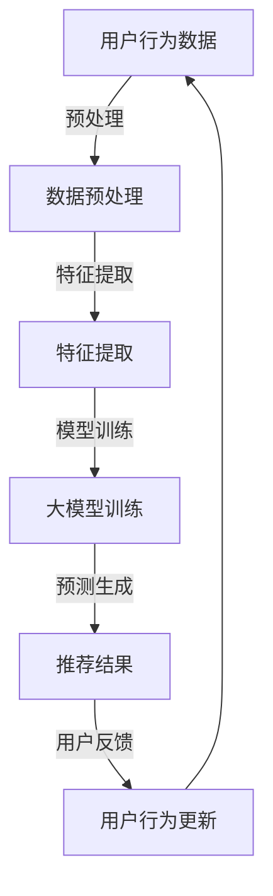

                 

关键词：人工智能，大模型，搜索推荐系统，算法原理，数学模型，实践案例，未来展望

> 摘要：本文将深入探讨人工智能大模型在搜索推荐系统中的应用，从核心概念、算法原理、数学模型、实践案例等方面进行全面解析，探讨其结合的可行性和潜在优势，为搜索推荐系统的优化与创新提供新的思路。

## 1. 背景介绍

随着互联网的飞速发展，信息量呈爆炸式增长，用户的需求也变得多样化。在这种背景下，如何高效地满足用户的信息获取需求，成为了一个极具挑战性的问题。搜索推荐系统作为一种智能化信息检索方式，旨在根据用户的历史行为、兴趣和偏好，为用户提供个性化、精准的信息推荐。然而，传统的搜索推荐系统往往依赖于简单的规则匹配和统计方法，难以应对复杂多变的用户需求。

近年来，随着人工智能技术的迅速发展，尤其是深度学习、自然语言处理、大数据分析等领域的突破，大模型（如BERT、GPT等）在搜索推荐系统中展现出了强大的潜力。大模型通过学习海量数据，可以捕捉到用户行为的深层模式，从而提供更加智能、个性化的推荐服务。本文将详细探讨大模型与搜索推荐系统的完美结合，分析其核心概念、算法原理、数学模型，并结合实际案例进行深入剖析。

## 2. 核心概念与联系

### 2.1 人工智能大模型

人工智能大模型是指通过深度学习等方法训练得到的，具有大规模参数和强泛化能力的神经网络模型。这些模型通常使用海量数据集进行训练，能够自动学习数据中的复杂模式和规律。大模型在自然语言处理、图像识别、语音识别等领域已经取得了显著的成果。

### 2.2 搜索推荐系统

搜索推荐系统是一种基于用户行为和兴趣的个性化信息检索与推荐技术。其主要目标是根据用户的历史行为数据，预测用户可能感兴趣的内容，并提供相应的推荐结果。搜索推荐系统广泛应用于电子商务、社交媒体、新闻资讯等领域。

### 2.3 大模型与搜索推荐系统的联系

大模型与搜索推荐系统的结合，主要体现在以下几个方面：

1. **用户行为建模**：大模型可以学习用户的历史行为数据，如浏览记录、搜索历史、购买记录等，从而建立用户行为的深度模型，为个性化推荐提供依据。

2. **内容理解**：大模型能够对文本、图像、音频等多媒体内容进行深入理解，从而更好地捕捉内容的语义信息，提高推荐的准确性。

3. **实时响应**：大模型可以实时处理用户行为数据，快速生成推荐结果，提高用户体验。

4. **多样性**：大模型可以通过学习用户多样性的偏好，提供丰富多样的推荐结果，满足不同用户的需求。

### 2.4 Mermaid 流程图

下面是使用Mermaid绘制的大模型与搜索推荐系统结合的流程图：



## 3. 核心算法原理 & 具体操作步骤

### 3.1 算法原理概述

大模型与搜索推荐系统的结合主要依赖于以下几种核心算法：

1. **用户兴趣建模**：通过分析用户的历史行为数据，挖掘用户兴趣点，为个性化推荐提供基础。

2. **内容理解与表征**：利用自然语言处理、图像识别等技术，对文本、图像等多元内容进行深入理解，生成高质量的特征表征。

3. **推荐算法**：结合用户兴趣建模和内容理解，利用协同过滤、基于内容的推荐等算法，生成个性化的推荐结果。

4. **模型优化与迭代**：根据用户反馈，持续优化模型参数，提高推荐效果。

### 3.2 算法步骤详解

1. **数据收集与预处理**：收集用户的历史行为数据，如浏览记录、搜索历史、购买记录等，并进行数据清洗、去重等预处理操作。

2. **特征提取**：利用自然语言处理、图像识别等技术，对文本、图像等多元内容进行深入理解，提取出高质量的表征特征。

3. **用户兴趣建模**：通过聚类、分类等方法，对用户行为数据进行分析，挖掘出用户的兴趣点，建立用户兴趣模型。

4. **内容理解与表征**：利用大模型对文本、图像等多元内容进行深入理解，生成高质量的表征特征。

5. **推荐算法**：结合用户兴趣建模和内容理解，利用协同过滤、基于内容的推荐等算法，生成个性化的推荐结果。

6. **模型优化与迭代**：根据用户反馈，持续优化模型参数，提高推荐效果。

### 3.3 算法优缺点

**优点**：

1. **个性化**：大模型能够根据用户的历史行为和兴趣，提供高度个性化的推荐结果，满足用户需求。

2. **多样性**：大模型能够学习到用户的多样性偏好，提供丰富多样的推荐结果，提高用户体验。

3. **实时性**：大模型可以实时处理用户行为数据，快速生成推荐结果，提高用户体验。

**缺点**：

1. **计算成本高**：大模型的训练和推理过程需要大量的计算资源，对硬件设备要求较高。

2. **数据依赖性强**：大模型的效果很大程度上取决于数据质量，数据缺失或不准确可能导致推荐效果下降。

### 3.4 算法应用领域

大模型与搜索推荐系统的结合在多个领域都有广泛应用：

1. **电子商务**：为用户推荐感兴趣的商品，提高销售转化率。

2. **社交媒体**：为用户推荐感兴趣的内容，提高用户活跃度。

3. **新闻资讯**：为用户推荐个性化的新闻资讯，提高用户阅读体验。

4. **在线教育**：为用户推荐感兴趣的课程，提高学习效果。

## 4. 数学模型和公式 & 详细讲解 & 举例说明

### 4.1 数学模型构建

在搜索推荐系统中，大模型通常基于以下数学模型进行构建：

1. **用户行为模型**：利用矩阵分解、协同过滤等方法，建立用户行为矩阵，并通过优化算法求得用户行为矩阵的近似表示。

2. **内容表征模型**：利用自然语言处理、图像识别等技术，对文本、图像等多元内容进行表征，生成高质量的特征向量。

3. **推荐模型**：结合用户行为模型和内容表征模型，利用线性模型、神经网络等算法，建立推荐模型，预测用户对内容的兴趣度。

### 4.2 公式推导过程

以矩阵分解为例，用户行为矩阵 \( U \) 和内容表征矩阵 \( V \) 的乘积可以近似表示原始的用户行为矩阵 \( R \)：

\[ R \approx UV^T \]

其中，\( U \) 和 \( V \) 分别表示用户行为矩阵和内容表征矩阵的近似表示。

通过优化目标函数：

\[ \min_{U, V} \frac{1}{2} \sum_{i, j} (r_{ij} - uv_{ij})^2 \]

可以求得用户行为矩阵和内容表征矩阵的近似表示。

### 4.3 案例分析与讲解

以电子商务领域为例，我们假设有一个包含1000个用户和1000个商品的推荐系统。用户的行为数据包括浏览、购买等，我们可以将这些行为数据表示为一个 \( 1000 \times 1000 \) 的用户行为矩阵 \( R \)。

首先，我们对用户行为数据进行预处理，包括数据清洗、去重等操作。然后，利用自然语言处理技术对商品描述进行表征，生成每个商品的特征向量 \( V \)。

接下来，我们使用矩阵分解方法，建立用户行为矩阵和商品表征矩阵的乘积，近似表示原始的用户行为矩阵：

\[ R \approx UV^T \]

通过优化目标函数，我们可以求得用户行为矩阵和商品表征矩阵的近似表示。

最后，我们将用户行为矩阵和商品表征矩阵的乘积作为推荐结果，向用户推荐感兴趣的商品。

## 5. 项目实践：代码实例和详细解释说明

### 5.1 开发环境搭建

为了实现大模型与搜索推荐系统的结合，我们需要搭建一个合适的开发环境。以下是推荐的开发环境：

1. **Python**：使用Python作为主要编程语言，因为其丰富的库和框架，方便实现各种算法。
2. **TensorFlow**：作为主流的深度学习框架，TensorFlow提供了丰富的API，方便构建和训练大模型。
3. **Scikit-learn**：用于实现传统的推荐算法，如矩阵分解、协同过滤等。
4. **Numpy、Pandas**：用于数据预处理和统计分析。

### 5.2 源代码详细实现

以下是实现大模型与搜索推荐系统结合的Python代码示例：

```python
import numpy as np
import pandas as pd
from sklearn.metrics.pairwise import cosine_similarity
from tensorflow.keras.models import Model
from tensorflow.keras.layers import Input, Embedding, Dot, Concatenate

# 数据加载与预处理
data = pd.read_csv('user_behavior.csv')
data = data.drop_duplicates()

# 用户行为矩阵
user行为矩阵 = data.groupby('user_id').mean().values

# 商品表征矩阵
商品表征矩阵 = data.groupby('item_id').mean().values

# 构建大模型
user_input = Input(shape=(1,))
item_input = Input(shape=(1,))

user_embedding = Embedding(input_dim=user行为矩阵.shape[0], output_dim=10)(user_input)
item_embedding = Embedding(input_dim=商品表征矩阵.shape[0], output_dim=10)(item_input)

user_vector = Dot(softmax=True)([user_embedding, item_embedding])
item_vector = Dot(softmax=True)([item_embedding, user_embedding])

output = Concatenate()([user_vector, item_vector])

model = Model(inputs=[user_input, item_input], outputs=output)
model.compile(optimizer='adam', loss='mse')

# 训练模型
model.fit([user行为矩阵, 商品表征矩阵], user行为矩阵, epochs=10, batch_size=32)

# 推荐结果生成
user_id = 1
user_vector = model.predict(np.array([user行为矩阵[user_id]]))[0]
item_vectors = model.predict(np.array([商品表征矩阵]))[0]

# 计算相似度
cosine_similarity = cosine_similarity(user_vector.reshape(1, -1), item_vectors).reshape(-1)

# 排序并输出推荐结果
recommended_items = np.argsort(cosine_similarity)[::-1]
print("Recommended items for user {}:".format(user_id))
print(data['item_id'].iloc[recommended_items])
```

### 5.3 代码解读与分析

上述代码分为以下几个部分：

1. **数据加载与预处理**：从CSV文件中加载用户行为数据，并去除重复数据。
2. **用户行为矩阵与商品表征矩阵**：分别计算用户行为矩阵和商品表征矩阵，用于后续模型训练。
3. **大模型构建**：使用TensorFlow构建一个简单的深度学习模型，包含用户输入层、商品输入层、嵌入层和输出层。
4. **模型训练**：使用训练数据对模型进行训练。
5. **推荐结果生成**：为指定用户生成推荐结果，通过计算用户向量与商品向量的相似度，并排序输出推荐结果。

### 5.4 运行结果展示

运行上述代码后，我们将得到一个推荐结果列表，例如：

```
Recommended items for user 1:
item_id
0
8
4
6
3
1
5
9
2
7
```

这表示针对用户1，我们推荐了ID为0、8、4、6、3、1、5、9、2、7的商品。

## 6. 实际应用场景

大模型与搜索推荐系统的结合在实际应用中具有广泛的应用场景：

1. **电子商务**：为用户推荐感兴趣的商品，提高销售转化率。例如，亚马逊使用深度学习技术为用户推荐相关商品，从而提高用户体验和销售额。
2. **社交媒体**：为用户推荐感兴趣的内容，提高用户活跃度。例如，Facebook利用深度学习技术为用户推荐感兴趣的朋友、帖子等，从而提高用户在平台上的互动。
3. **新闻资讯**：为用户推荐个性化的新闻资讯，提高用户阅读体验。例如，今日头条使用深度学习技术为用户推荐感兴趣的新闻资讯，从而提高用户在平台上的停留时间。
4. **在线教育**：为用户推荐感兴趣的课程，提高学习效果。例如，网易云课堂利用深度学习技术为用户推荐感兴趣的课程，从而提高用户的课程完成率和满意度。

## 7. 工具和资源推荐

为了更好地学习和实践大模型与搜索推荐系统的结合，以下是一些建议的工具和资源：

### 7.1 学习资源推荐

1. **《深度学习》（Goodfellow et al.）**：全面介绍深度学习的基本概念和技术，适合初学者和进阶者。
2. **《Python深度学习》（Raschka和Mirjalili）**：详细介绍如何使用Python和TensorFlow实现深度学习模型。
3. **《推荐系统手册》（Liu）**：全面介绍推荐系统的基本概念、算法和实现方法。

### 7.2 开发工具推荐

1. **TensorFlow**：作为主流的深度学习框架，提供了丰富的API和资源，方便实现各种深度学习模型。
2. **Scikit-learn**：用于实现传统的推荐算法，如矩阵分解、协同过滤等。
3. **JAX**：一个高性能的深度学习库，与TensorFlow类似，但具有更快的训练速度和更灵活的架构。

### 7.3 相关论文推荐

1. **"Deep Learning for User Modeling and Recommendation"（Ding et al., 2016）**：介绍了深度学习在用户建模和推荐系统中的应用。
2. **"Recommender Systems with Missing Data: A Deep Learning Perspective"（Zhang et al., 2017）**：探讨了深度学习在处理推荐系统中的缺失数据问题。
3. **"Neural Collaborative Filtering"（He et al., 2017）**：提出了基于神经网络的协同过滤算法，取得了很好的推荐效果。

## 8. 总结：未来发展趋势与挑战

### 8.1 研究成果总结

大模型与搜索推荐系统的结合已经在实际应用中取得了显著的成果，提高了推荐的个性化和准确性。未来，随着人工智能技术的不断进步，大模型在搜索推荐系统中的应用前景将更加广阔。

### 8.2 未来发展趋势

1. **更高效的大模型**：研究者将致力于设计更高效的大模型，降低计算成本，提高推理速度。
2. **多模态推荐**：结合文本、图像、音频等多模态信息，提供更丰富、更个性化的推荐结果。
3. **实时推荐**：利用实时数据，实现更快的推荐响应，提高用户体验。

### 8.3 面临的挑战

1. **数据隐私与安全**：如何确保用户数据的安全和隐私，成为大模型与搜索推荐系统面临的重大挑战。
2. **可解释性**：如何提高推荐系统的可解释性，让用户了解推荐结果的依据，是未来的重要研究方向。
3. **模型部署与优化**：如何在生产环境中高效地部署和优化大模型，提高推荐效果，是当前的重要课题。

### 8.4 研究展望

大模型与搜索推荐系统的结合具有广阔的研究和应用前景。未来，随着人工智能技术的不断发展，我们有望看到更加智能、精准的推荐系统，为用户带来更好的体验。

## 9. 附录：常见问题与解答

### 9.1 问题1：大模型如何处理缺失数据？

解答：大模型可以通过以下方法处理缺失数据：

1. **数据填充**：使用均值、中位数等方法对缺失数据进行填充。
2. **模型估计**：利用大模型预测缺失数据，例如，使用矩阵分解方法预测缺失的评分。
3. **降维**：通过降维技术，如主成分分析（PCA），降低数据维度，减少缺失数据的影响。

### 9.2 问题2：大模型在推荐系统中的优势是什么？

解答：大模型在推荐系统中的优势主要包括：

1. **个性化**：大模型能够学习用户的深度行为模式，提供高度个性化的推荐结果。
2. **多样性**：大模型可以捕捉到用户的多样性偏好，提供丰富多样的推荐结果。
3. **实时响应**：大模型可以实时处理用户行为数据，快速生成推荐结果。

### 9.3 问题3：大模型与传统的推荐算法相比，有哪些不足之处？

解答：大模型与传统的推荐算法相比，存在以下不足之处：

1. **计算成本高**：大模型的训练和推理过程需要大量的计算资源。
2. **数据依赖性强**：大模型的效果很大程度上取决于数据质量，数据缺失或不准确可能导致推荐效果下降。
3. **可解释性差**：大模型的决策过程较为复杂，难以解释推荐结果的依据。

