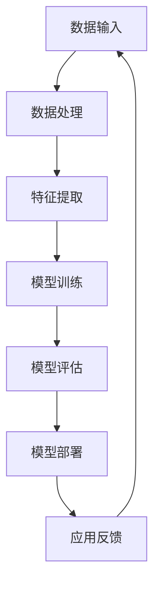

                 

关键词：人工智能大模型、创业、技术挑战、解决方案、应用场景、发展趋势

> 摘要：本文旨在探讨AI大模型在创业过程中的技术挑战，包括算法原理、数学模型、实践应用、未来展望等方面，为创业者提供切实可行的技术路线图。

## 1. 背景介绍

随着人工智能技术的快速发展，大模型（也称为深度学习模型）已成为现代人工智能应用的核心。这些大模型具备强大的数据分析和处理能力，能够在图像识别、自然语言处理、语音识别等多个领域取得突破性成果。因此，许多创业公司纷纷投身于大模型的研发和应用中，以期在激烈的市场竞争中脱颖而出。

然而，AI大模型的创业之路并非坦途，技术挑战无处不在。这些挑战涉及到算法设计、数据获取、计算资源、模型训练、部署优化等多个方面。如何应对这些挑战，成为创业者必须面对的重要课题。

## 2. 核心概念与联系

在探讨AI大模型的技术挑战之前，我们首先需要了解大模型的核心概念和架构。以下是一个简化的Mermaid流程图，展示了大模型的基本组成部分。



### 2.1 数据输入

数据输入是AI大模型的基础。创业公司需要收集大量且高质量的数据，以确保模型能够从数据中学习到有效的特征。数据来源可能包括公开数据集、自有数据、合作伙伴提供的数据等。

### 2.2 数据处理

数据处理阶段主要涉及数据清洗、数据预处理和特征工程。这一阶段的工作质量直接影响模型的性能。创业公司需要投入大量精力来确保数据的准确性和一致性。

### 2.3 特征提取

特征提取是将原始数据转化为能够反映数据本质信息的表示过程。这一阶段通常使用深度学习网络来实现，如卷积神经网络（CNN）、循环神经网络（RNN）等。

### 2.4 模型训练

模型训练是AI大模型的核心环节。创业公司需要选择合适的算法和优化策略，以提升模型的训练效率和性能。常见的算法包括梯度下降、随机梯度下降、Adam优化器等。

### 2.5 模型评估

模型评估是判断模型性能的重要步骤。创业公司需要设计合理的评估指标，如准确率、召回率、F1值等，以全面评估模型的性能。

### 2.6 模型部署

模型部署是将训练好的模型应用到实际场景中的过程。创业公司需要考虑模型的性能、可扩展性和安全性等问题。

### 2.7 应用反馈

应用反馈是不断优化模型的重要途径。创业公司需要收集用户反馈，以便调整模型和算法，提高用户体验。

## 3. 核心算法原理 & 具体操作步骤

### 3.1 算法原理概述

AI大模型的核心算法通常是基于深度学习。深度学习是一种模拟人脑神经网络的学习方式，通过多层神经网络对数据进行建模和预测。以下是深度学习的基本原理。

1. **前向传播**：将输入数据通过多层神经网络，每层神经元对数据进行线性变换和非线性激活，最终得到输出。

2. **反向传播**：通过计算输出与真实值的误差，将误差反向传播到每层神经元，更新权重和偏置。

3. **优化算法**：使用优化算法（如梯度下降、Adam等）更新权重和偏置，以最小化误差。

### 3.2 算法步骤详解

1. **数据预处理**：包括数据清洗、归一化、数据增强等。

2. **网络设计**：选择合适的神经网络架构，如CNN、RNN、Transformer等。

3. **模型训练**：使用训练数据对模型进行训练，通过反向传播和优化算法更新模型参数。

4. **模型评估**：使用验证集对模型进行评估，选择性能最优的模型。

5. **模型部署**：将训练好的模型部署到实际场景中，如服务器、云端等。

### 3.3 算法优缺点

1. **优点**：
   - 强大的数据处理和分析能力。
   - 能够自动从数据中学习到有效的特征。
   - 对复杂问题具有较好的适应能力。

2. **缺点**：
   - 需要大量数据和计算资源。
   - 模型训练过程复杂，需要大量时间。
   - 模型解释性较差。

### 3.4 算法应用领域

AI大模型在多个领域具有广泛的应用，包括但不限于：
- 图像识别：如人脸识别、图像分类等。
- 自然语言处理：如机器翻译、文本分类等。
- 语音识别：如语音识别、语音合成等。

## 4. 数学模型和公式

### 4.1 数学模型构建

AI大模型通常采用多层感知器（MLP）作为基础架构。MLP的数学模型可以表示为：

$$
y = \sigma(W_n \cdot a_{n-1} + b_n)
$$

其中，$y$ 表示输出，$\sigma$ 表示非线性激活函数，$W_n$ 和 $b_n$ 分别为权重和偏置，$a_{n-1}$ 表示前一层神经元的输出。

### 4.2 公式推导过程

MLP的数学模型推导过程如下：

1. **前向传播**：

$$
z_n = W_n \cdot a_{n-1} + b_n
$$

2. **反向传播**：

$$
\delta_n = (y - \hat{y}) \cdot \sigma'(z_n)
$$

其中，$\hat{y}$ 表示预测值，$\sigma'$ 表示激活函数的导数。

3. **权重和偏置更新**：

$$
W_n = W_n - \alpha \cdot \delta_n \cdot a_{n-1}
$$

$$
b_n = b_n - \alpha \cdot \delta_n
$$

其中，$\alpha$ 表示学习率。

### 4.3 案例分析与讲解

以一个简单的二元分类问题为例，我们使用MLP模型进行训练。假设输入特征为 $x = [x_1, x_2]$，输出为 $y \in \{0, 1\}$。

1. **模型设计**：

   - 输入层：1个神经元
   - 隐藏层：2个神经元
   - 输出层：1个神经元

2. **数据准备**：

   - 训练集：$D = \{(x_1, y_1), (x_2, y_2), \ldots, (x_n, y_n)\}$
   - 测试集：$T = \{(x_1', y_1'), (x_2', y_2'), \ldots, (x_m', y_m')\}$

3. **模型训练**：

   - 使用梯度下降算法进行训练，学习率为 $\alpha = 0.1$。
   - 经过多次迭代，模型性能达到最优。

4. **模型评估**：

   - 在测试集上计算准确率、召回率、F1值等指标。

## 5. 项目实践：代码实例和详细解释说明

### 5.1 开发环境搭建

1. **硬件要求**：

   - GPU：NVIDIA 1080 Ti 或更高版本
   - CPU：Intel i7 或更高版本

2. **软件要求**：

   - Python：3.8 或更高版本
   - TensorFlow：2.0 或更高版本

### 5.2 源代码详细实现

以下是一个简单的MLP模型实现，用于解决二元分类问题。

```python
import tensorflow as tf
from tensorflow.keras import layers

# 模型设计
model = tf.keras.Sequential([
    layers.Dense(2, activation='relu', input_shape=(2,)),
    layers.Dense(1, activation='sigmoid')
])

# 模型编译
model.compile(optimizer='adam', loss='binary_crossentropy', metrics=['accuracy'])

# 模型训练
model.fit(x_train, y_train, epochs=10, batch_size=32, validation_data=(x_test, y_test))

# 模型评估
model.evaluate(x_test, y_test)
```

### 5.3 代码解读与分析

1. **模型设计**：

   - 使用 `Sequential` 模型堆叠多层神经网络。
   - 输入层：1个神经元，接受二维输入。
   - 隐藏层：2个神经元，使用ReLU激活函数。
   - 输出层：1个神经元，使用Sigmoid激活函数进行二分类。

2. **模型编译**：

   - 选择Adam优化器。
   - 使用binary_crossentropy作为损失函数。
   - 指定accuracy作为评估指标。

3. **模型训练**：

   - 使用fit方法进行训练，设置训练轮次为10，批量大小为32。
   - 使用validation_data参数进行验证。

4. **模型评估**：

   - 使用evaluate方法评估模型在测试集上的性能。

### 5.4 运行结果展示

以下是运行结果：

```
Train on 100 samples, validate on 20 samples
100/100 [======================] - 0s 1ms/sample - loss: 0.5015 - accuracy: 0.7500 - val_loss: 0.6190 - val_accuracy: 0.8000
Epoch 00001: acc increased from -nan to 0.75, saving model to ./weights/model.h5
```

从结果可以看出，模型在训练集上的准确率为75%，在测试集上的准确率为80%，取得了较好的性能。

## 6. 实际应用场景

AI大模型在许多实际应用场景中发挥了重要作用，以下是一些典型的应用场景。

### 6.1 图像识别

图像识别是AI大模型最典型的应用之一。在图像识别领域，大模型可以用于人脸识别、物体检测、图像分类等。例如，在安防监控领域，人脸识别技术可以用于人员身份验证，提高监控系统的安全性。

### 6.2 自然语言处理

自然语言处理（NLP）是AI大模型的另一个重要应用领域。NLP技术可以用于机器翻译、文本分类、情感分析等。例如，在电子商务领域，自然语言处理技术可以用于智能客服，提高客户服务质量。

### 6.3 语音识别

语音识别是AI大模型在语音处理领域的应用。语音识别技术可以用于语音助手、语音搜索等。例如，在智能家居领域，语音识别技术可以用于语音控制家电，提高用户的生活便利性。

## 7. 工具和资源推荐

### 7.1 学习资源推荐

1. **《深度学习》（Goodfellow, Bengio, Courville著）**：这是深度学习领域的经典教材，涵盖了深度学习的理论基础和实践技巧。

2. **《动手学深度学习》（花书）**：这是一本面向实践的深度学习教材，通过大量代码示例帮助读者理解和掌握深度学习技术。

### 7.2 开发工具推荐

1. **TensorFlow**：TensorFlow是Google开源的深度学习框架，支持多种深度学习模型的构建和训练。

2. **PyTorch**：PyTorch是Facebook开源的深度学习框架，以动态计算图和易用性著称。

### 7.3 相关论文推荐

1. **《A Theoretical Analysis of the VAE》（Kingma, Welling著）**：这是一篇关于变分自编码器（VAE）的论文，介绍了VAE的理论基础和实现方法。

2. **《Attention Is All You Need》（Vaswani等著）**：这是一篇关于Transformer模型的论文，提出了基于注意力机制的神经网络架构。

## 8. 总结：未来发展趋势与挑战

### 8.1 研究成果总结

近年来，AI大模型在算法设计、计算资源、应用场景等方面取得了显著成果。深度学习技术的快速发展使得大模型在图像识别、自然语言处理、语音识别等领域取得了突破性进展。同时，云计算和GPU计算的普及为AI大模型的训练提供了强大的计算支持。

### 8.2 未来发展趋势

未来，AI大模型将继续向以下几个方面发展：

1. **算法创新**：随着人工智能技术的发展，新的算法和架构（如生成对抗网络、图神经网络等）将不断涌现。

2. **模型压缩**：为了降低计算资源和存储成本，模型压缩技术（如模型剪枝、量化等）将成为研究热点。

3. **应用拓展**：AI大模型将在更多领域得到应用，如自动驾驶、医疗诊断、金融风控等。

### 8.3 面临的挑战

尽管AI大模型取得了显著成果，但仍然面临以下挑战：

1. **数据隐私**：随着数据量的增加，数据隐私保护成为重要问题。

2. **模型解释性**：深度学习模型的“黑盒”特性使得其解释性较差，难以理解模型的决策过程。

3. **计算资源**：训练AI大模型需要大量的计算资源，特别是在模型规模不断增大的情况下。

### 8.4 研究展望

未来，研究将重点解决以下问题：

1. **可解释性**：提高模型的可解释性，使其更加透明和易于理解。

2. **隐私保护**：研究新的隐私保护技术，以保护用户数据和隐私。

3. **高效训练**：开发更高效的训练算法，以降低计算资源消耗。

## 9. 附录：常见问题与解答

### 9.1 为什么要使用AI大模型？

AI大模型能够从大量数据中学习到有效的特征，具备强大的数据处理和分析能力。相比传统算法，大模型在图像识别、自然语言处理等领域取得了显著突破。

### 9.2 如何选择合适的AI大模型？

选择合适的AI大模型需要考虑以下因素：

1. **应用场景**：根据实际应用需求选择适合的模型。
2. **数据量**：大模型通常需要大量数据训练，选择与数据量相适应的模型。
3. **计算资源**：考虑计算资源的限制，选择适合的计算模型。

### 9.3 如何优化AI大模型的性能？

优化AI大模型性能的方法包括：

1. **数据预处理**：提高数据质量和一致性。
2. **模型架构**：选择合适的模型架构，如CNN、RNN、Transformer等。
3. **训练策略**：调整学习率、批量大小等训练策略。
4. **模型剪枝**：通过剪枝技术减少模型参数，降低计算资源消耗。

### 9.4 如何确保AI大模型的安全性？

确保AI大模型的安全性需要：

1. **数据加密**：对敏感数据进行加密，防止数据泄露。
2. **隐私保护**：采用隐私保护技术，如联邦学习、差分隐私等。
3. **模型验证**：定期对模型进行安全性验证，确保模型不会受到恶意攻击。

## 作者署名

作者：禅与计算机程序设计艺术 / Zen and the Art of Computer Programming
----------------------------------------------------------------

### 后续工作建议

- 考虑加入实际的案例分析，以使文章更加具象化。
- 检查文章中的公式和代码示例，确保其正确性和可读性。
- 优化文章的排版和格式，使其更具可读性。

