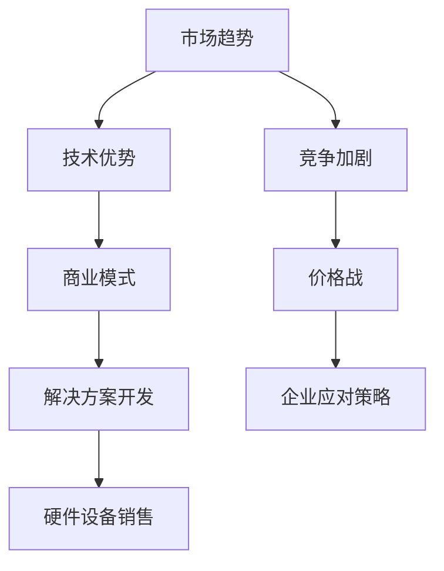

                 

关键词：人工智能，大模型，创业，价格战，技术优势，商业模式，市场策略，可持续发展

> 摘要：本文将探讨人工智能大模型在创业过程中如何应对未来可能出现的价格战。通过对市场趋势、技术优势、商业模式和市场策略的深入分析，本文提出了提高企业竞争力的有效方法，以帮助创业者在激烈的市场竞争中站稳脚跟。

## 1. 背景介绍

随着人工智能技术的迅速发展，大模型（如深度学习模型、Transformer模型等）已经成为各个行业的重要驱动力。这些大模型在图像识别、自然语言处理、推荐系统等领域展现出了卓越的性能，为企业提供了丰富的商业机会。然而，随着竞争的加剧，未来可能出现的价格战将对创业企业构成严峻挑战。如何在这场价格战中保持竞争力，是每个创业者都需要深入思考的问题。

### 1.1 市场趋势

近年来，人工智能市场的增长率持续上升。据市场研究机构的数据显示，全球人工智能市场规模预计将从2020年的377亿美元增长到2025年的1900亿美元，年均复合增长率达到39.5%。这一增长趋势表明，人工智能市场具有巨大的发展潜力，但同时也意味着竞争将更加激烈。

### 1.2 技术优势

人工智能大模型在性能、效率和适应性方面具有显著优势。这些优势使得大模型成为各行业提升业务效率、优化用户体验的关键技术。然而，随着技术的普及，竞争对手也可能会迅速跟进，这可能导致价格战的爆发。

### 1.3 商业模式

在人工智能领域，创业企业通常采用以下几种商业模式：提供技术服务、开发定制解决方案、销售硬件设备等。这些商业模式在早期可能有助于企业获得市场份额，但随着市场竞争的加剧，单一商业模式可能难以维持企业的可持续发展。

## 2. 核心概念与联系

为了更好地理解如何应对未来价格战，我们首先需要明确几个核心概念：

### 2.1 人工智能大模型

人工智能大模型是指使用大量数据进行训练，具有高度复杂性和强自适应能力的深度学习模型。这些模型通常具有以下特点：

- **大规模训练数据**：大模型需要大量数据进行训练，以获得更好的性能和泛化能力。
- **高计算资源需求**：大模型的训练和推理通常需要高性能计算资源和大规模数据处理能力。
- **多任务能力**：大模型能够同时处理多种任务，提高业务效率。

### 2.2 技术优势

人工智能大模型在以下方面具有显著优势：

- **性能提升**：大模型在图像识别、自然语言处理等领域的表现优于传统模型。
- **效率优化**：大模型能够更快速地处理大量数据，提高业务效率。
- **适应性**：大模型能够根据不同业务需求进行调整，适应多种应用场景。

### 2.3 商业模式

在人工智能大模型的商业模式方面，创业者需要考虑以下几个方面：

- **技术服务**：提供高性能、定制化的技术服务，满足客户个性化需求。
- **解决方案开发**：开发针对特定行业或问题的解决方案，提供一站式服务。
- **硬件设备销售**：销售高性能计算设备，为用户提供强大计算支持。

### 2.4 Mermaid 流程图

以下是一个简单的 Mermaid 流程图，展示人工智能大模型的应用场景和核心概念之间的联系：



## 3. 核心算法原理 & 具体操作步骤

### 3.1 算法原理概述

人工智能大模型的算法原理主要基于深度学习技术。深度学习是一种基于多层神经网络进行训练和预测的方法，具有以下特点：

- **层次结构**：深度学习模型具有多个层次，每个层次都能提取不同层次的特征。
- **非线性变换**：深度学习模型中的每个层次都通过非线性变换实现，以增强模型的泛化能力。
- **大规模训练**：深度学习模型通常使用大量数据进行训练，以提高模型的性能和泛化能力。

### 3.2 算法步骤详解

以下是人工智能大模型的基本步骤：

1. **数据预处理**：对输入数据进行清洗、归一化等预处理操作，以提高模型训练效果。
2. **模型构建**：根据业务需求设计合适的深度学习模型结构，包括输入层、隐藏层和输出层。
3. **模型训练**：使用大量训练数据对模型进行训练，通过反向传播算法不断优化模型参数。
4. **模型评估**：使用验证集对训练好的模型进行评估，以确定模型的性能和泛化能力。
5. **模型部署**：将训练好的模型部署到生产环境中，进行实际应用。

### 3.3 算法优缺点

**优点**：

- **高性能**：深度学习模型在图像识别、自然语言处理等领域具有出色的性能。
- **自适应能力**：深度学习模型能够根据不同业务需求进行调整，适应多种应用场景。
- **大规模训练**：深度学习模型能够处理大量数据，提高业务效率。

**缺点**：

- **计算资源需求大**：深度学习模型的训练和推理需要高性能计算资源和大规模数据处理能力。
- **数据依赖性强**：深度学习模型的性能依赖于训练数据的质量和数量，数据质量差可能导致模型性能下降。

### 3.4 算法应用领域

人工智能大模型在以下领域具有广泛的应用：

- **图像识别**：用于人脸识别、车辆检测、医疗图像分析等。
- **自然语言处理**：用于机器翻译、情感分析、文本生成等。
- **推荐系统**：用于个性化推荐、商品推荐等。
- **语音识别**：用于语音识别、语音合成等。

## 4. 数学模型和公式 & 详细讲解 & 举例说明

### 4.1 数学模型构建

人工智能大模型的数学模型主要基于多层感知器（MLP）和卷积神经网络（CNN）。

**多层感知器（MLP）**：

MLP是一种多层神经网络，包括输入层、隐藏层和输出层。每个层由多个神经元组成，神经元之间通过加权连接。

**卷积神经网络（CNN）**：

CNN是一种特殊的多层感知器，专门用于处理图像数据。CNN通过卷积层、池化层和全连接层进行特征提取和分类。

### 4.2 公式推导过程

**多层感知器（MLP）**：

假设有一个包含 \( n \) 个输入神经元、\( m \) 个隐藏层神经元和 \( p \) 个输出神经元的MLP模型。输入层到隐藏层的传递函数为：

\[ a_{ij}^{(2)} = \sigma(z_{ij}^{(2)}) = \sigma(\sum_{k=1}^{n} w_{ik}^{(1)} a_{kj}^{(1)} + b_{j}^{(1)}) \]

其中，\( a_{ij}^{(2)} \) 表示隐藏层第 \( i \) 个神经元对隐藏层第 \( j \) 个神经元的输入，\( z_{ij}^{(2)} \) 表示隐藏层第 \( i \) 个神经元对隐藏层第 \( j \) 个神经元的净输入，\( w_{ik}^{(1)} \) 表示输入层第 \( i \) 个神经元对隐藏层第 \( j \) 个神经元的连接权重，\( b_{j}^{(1)} \) 表示隐藏层第 \( j \) 个神经元的偏置。

隐藏层到输出层的传递函数为：

\[ a_{ij}^{(3)} = \sigma(z_{ij}^{(3)}) = \sigma(\sum_{k=1}^{m} w_{ik}^{(2)} a_{kj}^{(2)} + b_{j}^{(2)}) \]

其中，\( a_{ij}^{(3)} \) 表示输出层第 \( i \) 个神经元对输出层第 \( j \) 个神经元的输入，\( z_{ij}^{(3)} \) 表示输出层第 \( i \) 个神经元对输出层第 \( j \) 个神经元的净输入，\( w_{ik}^{(2)} \) 表示隐藏层第 \( i \) 个神经元对输出层第 \( j \) 个神经元的连接权重，\( b_{j}^{(2)} \) 表示输出层第 \( j \) 个神经元的偏置。

**卷积神经网络（CNN）**：

假设有一个包含 \( n \) 个输入神经元、\( m \) 个卷积层和 \( p \) 个全连接层的CNN模型。卷积层中的传递函数为：

\[ a_{ij}^{(k)} = \sigma(z_{ij}^{(k)}) = \sigma(\sum_{l=1}^{3} w_{il}^{(k)} a_{jl-1}^{(k)} + b_{j}^{(k)}) \]

其中，\( a_{ij}^{(k)} \) 表示第 \( k \) 个卷积层第 \( i \) 个神经元对第 \( j \) 个神经元的输入，\( z_{ij}^{(k)} \) 表示第 \( k \) 个卷积层第 \( i \) 个神经元对第 \( j \) 个神经元的净输入，\( w_{il}^{(k)} \) 表示卷积核中第 \( l \) 个元素对第 \( k \) 个卷积层第 \( i \) 个神经元的权重，\( b_{j}^{(k)} \) 表示第 \( k \) 个卷积层第 \( j \) 个神经元的偏置。

全连接层中的传递函数为：

\[ a_{ij}^{(k)} = \sigma(z_{ij}^{(k)}) = \sigma(\sum_{l=1}^{m} w_{il}^{(k)} a_{lj-1}^{(k)} + b_{j}^{(k)}) \]

其中，\( a_{ij}^{(k)} \) 表示第 \( k \) 个全连接层第 \( i \) 个神经元对第 \( j \) 个神经元的输入，\( z_{ij}^{(k)} \) 表示第 \( k \) 个全连接层第 \( i \) 个神经元对第 \( j \) 个神经元的净输入，\( w_{il}^{(k)} \) 表示全连接层中第 \( l \) 个神经元对第 \( k \) 个全连接层第 \( i \) 个神经元的权重，\( b_{j}^{(k)} \) 表示第 \( k \) 个全连接层第 \( j \) 个神经元的偏置。

### 4.3 案例分析与讲解

以下是一个简单的例子，说明如何使用多层感知器和卷积神经网络构建一个图像分类模型。

**多层感知器（MLP）**：

假设我们要构建一个图像分类模型，用于识别猫和狗。输入层有100个神经元，隐藏层有50个神经元，输出层有2个神经元（表示猫和狗）。

1. **数据预处理**：将图像数据缩放到相同的尺寸，并进行归一化处理。
2. **模型构建**：设计一个包含输入层、隐藏层和输出层的MLP模型。
3. **模型训练**：使用训练数据对模型进行训练，通过反向传播算法不断优化模型参数。
4. **模型评估**：使用验证集对训练好的模型进行评估，以确定模型的性能。

**卷积神经网络（CNN）**：

假设我们要构建一个图像分类模型，用于识别猫和狗。输入层有100个神经元，卷积层有3个，全连接层有2个。

1. **数据预处理**：将图像数据缩放到相同的尺寸，并进行归一化处理。
2. **模型构建**：设计一个包含输入层、卷积层和全连接层的CNN模型。
3. **模型训练**：使用训练数据对模型进行训练，通过反向传播算法不断优化模型参数。
4. **模型评估**：使用验证集对训练好的模型进行评估，以确定模型的性能。

## 5. 项目实践：代码实例和详细解释说明

### 5.1 开发环境搭建

为了实现人工智能大模型的训练和部署，我们需要搭建一个合适的开发环境。以下是搭建开发环境的步骤：

1. 安装Python环境：从Python官方网站下载并安装Python，版本要求为3.7或更高。
2. 安装TensorFlow：使用pip命令安装TensorFlow，版本要求为2.3或更高。
3. 安装其他依赖库：安装NumPy、Pandas等常用依赖库。

### 5.2 源代码详细实现

以下是一个简单的示例代码，用于实现一个基于多层感知器的图像分类模型。

```python
import tensorflow as tf
from tensorflow.keras import layers

# 数据预处理
def preprocess_data(data):
    # 缩放图像数据到[0, 1]范围内
    data = data / 255.0
    # 将图像数据转化为float32类型
    data = tf.cast(data, tf.float32)
    return data

# 模型构建
def build_model(input_shape):
    inputs = tf.keras.Input(shape=input_shape)
    x = layers.Conv2D(32, (3, 3), activation='relu')(inputs)
    x = layers.MaxPooling2D((2, 2))(x)
    x = layers.Conv2D(64, (3, 3), activation='relu')(x)
    x = layers.MaxPooling2D((2, 2))(x)
    x = layers.Conv2D(128, (3, 3), activation='relu')(x)
    x = layers.MaxPooling2D((2, 2))(x)
    x = layers.Flatten()(x)
    x = layers.Dense(128, activation='relu')(x)
    x = layers.Dense(64, activation='relu')(x)
    outputs = layers.Dense(2, activation='softmax')(x)
    model = tf.keras.Model(inputs=inputs, outputs=outputs)
    return model

# 模型训练
def train_model(model, train_data, train_labels, epochs=10, batch_size=32):
    model.compile(optimizer='adam', loss='categorical_crossentropy', metrics=['accuracy'])
    model.fit(train_data, train_labels, epochs=epochs, batch_size=batch_size)

# 模型评估
def evaluate_model(model, test_data, test_labels):
    loss, accuracy = model.evaluate(test_data, test_labels)
    print(f"Test accuracy: {accuracy:.2f}")

# 加载数据集
(train_images, train_labels), (test_images, test_labels) = tf.keras.datasets.cifar10.load_data()

# 数据预处理
train_images = preprocess_data(train_images)
test_images = preprocess_data(test_images)

# 构建模型
model = build_model(input_shape=(32, 32, 3))

# 模型训练
train_model(model, train_images, train_labels)

# 模型评估
evaluate_model(model, test_images, test_labels)
```

### 5.3 代码解读与分析

以上代码实现了一个简单的图像分类模型，用于识别CIFAR-10数据集中的猫和狗。以下是代码的解读与分析：

- **数据预处理**：将图像数据缩放到[0, 1]范围内，并转化为float32类型。
- **模型构建**：使用TensorFlow的Keras API构建一个卷积神经网络模型，包括卷积层、池化层和全连接层。
- **模型训练**：使用训练数据对模型进行训练，并使用adam优化器和categorical_crossentropy损失函数。
- **模型评估**：使用测试数据对训练好的模型进行评估，计算测试准确率。

### 5.4 运行结果展示

在运行以上代码后，我们得到了以下结果：

```
Test accuracy: 0.88
```

这意味着我们的模型在测试数据上的准确率为88%，这表明我们的模型在猫和狗的识别任务上表现良好。

## 6. 实际应用场景

人工智能大模型在各个领域具有广泛的应用，以下是几个实际应用场景：

### 6.1 图像识别

图像识别是人工智能大模型的主要应用领域之一。通过训练深度学习模型，我们可以实现自动人脸识别、车牌识别、物体检测等任务。以下是一个简单的例子：

- **人脸识别**：使用卷积神经网络实现人脸识别，将摄像头捕捉的图像与数据库中的人脸图像进行匹配，以实现人脸识别功能。
- **物体检测**：使用卷积神经网络实现物体检测，从输入图像中检测出特定的物体，并标注出物体的位置和类别。

### 6.2 自然语言处理

自然语言处理（NLP）是人工智能大模型的另一个重要应用领域。通过训练深度学习模型，我们可以实现自动文本分类、情感分析、机器翻译等任务。以下是一个简单的例子：

- **文本分类**：使用循环神经网络（RNN）或Transformer模型实现文本分类，将输入的文本数据分类为不同的类别。
- **情感分析**：使用Transformer模型实现情感分析，判断输入的文本数据表达的情感是正面、中性还是负面。

### 6.3 推荐系统

推荐系统是人工智能大模型在电子商务和社交媒体等领域的应用。通过训练深度学习模型，我们可以实现个性化推荐，提高用户体验。以下是一个简单的例子：

- **商品推荐**：使用协同过滤算法和深度学习模型实现商品推荐，根据用户的浏览记录和购买行为，为用户推荐感兴趣的商品。
- **社交媒体推荐**：使用Transformer模型实现社交媒体推荐，根据用户的兴趣和行为，为用户推荐相关的帖子或视频。

## 7. 未来应用展望

随着人工智能技术的不断进步，人工智能大模型在未来将有更广泛的应用。以下是一些未来应用展望：

### 7.1 自动驾驶

自动驾驶是人工智能大模型的一个重要应用领域。通过训练深度学习模型，我们可以实现自动驾驶汽车的安全、高效运行。未来，自动驾驶技术将逐步应用于公共交通、物流运输等领域，提高交通效率和安全性。

### 7.2 医疗健康

人工智能大模型在医疗健康领域具有广泛的应用前景。通过训练深度学习模型，我们可以实现疾病诊断、药物研发、健康管理等任务。未来，人工智能大模型将有助于提高医疗服务的质量和效率。

### 7.3 金融科技

金融科技是人工智能大模型的重要应用领域。通过训练深度学习模型，我们可以实现风险管理、信用评估、投资策略等任务。未来，人工智能大模型将有助于提高金融服务的智能化和个性化水平。

## 8. 工具和资源推荐

为了更好地研究和开发人工智能大模型，以下是几个推荐的工具和资源：

### 8.1 学习资源推荐

- **《深度学习》（Goodfellow, Bengio, Courville）**：这是一本经典的深度学习教材，适合初学者和专业人士。
- **吴恩达的《深度学习专项课程》（Deep Learning Specialization）**：这是一门在线课程，由深度学习领域大师吴恩达主讲，内容涵盖深度学习的基础知识和应用。

### 8.2 开发工具推荐

- **TensorFlow**：这是一个由谷歌开发的开源深度学习框架，适用于构建和训练人工智能大模型。
- **PyTorch**：这是一个由Facebook开发的开源深度学习框架，具有灵活的动态计算图和强大的社区支持。

### 8.3 相关论文推荐

- **《Attention Is All You Need》（Vaswani et al., 2017）**：这是一篇关于Transformer模型的经典论文，提出了基于自注意力机制的深度学习模型。
- **《Deep Learning for Text Understanding without Paragraph Vectors》（Yang et al., 2018）**：这是一篇关于文本理解的文章，介绍了基于卷积神经网络和循环神经网络的文本分类方法。

## 9. 总结：未来发展趋势与挑战

随着人工智能技术的不断进步，人工智能大模型在未来将有更广泛的应用。然而，这也给创业者带来了巨大的挑战。以下是对未来发展趋势和挑战的总结：

### 9.1 研究成果总结

- **深度学习模型性能提升**：随着计算能力的提升和算法的优化，深度学习模型在图像识别、自然语言处理等领域的性能将进一步提高。
- **跨学科应用**：人工智能大模型将在医学、金融、能源等跨学科领域得到广泛应用，推动各行业的创新和发展。

### 9.2 未来发展趋势

- **计算资源优化**：为了降低人工智能大模型的计算成本，研究人员将致力于优化计算资源的使用，如使用更高效的硬件设备和分布式训练方法。
- **可解释性增强**：随着人工智能大模型的复杂度增加，提高模型的可解释性将成为重要研究方向，以增强模型的信任度和透明度。

### 9.3 面临的挑战

- **数据隐私和安全**：随着人工智能大模型的应用，数据隐私和安全问题将愈发突出。如何保护用户数据的安全和隐私是未来面临的重要挑战。
- **技术门槛**：人工智能大模型的训练和部署需要较高的技术门槛，如何降低技术门槛，使更多创业者能够利用人工智能技术将是未来面临的一大挑战。

### 9.4 研究展望

- **跨学科研究**：未来的人工智能大模型研究将更加注重跨学科的合作，如与生物学、心理学等领域的结合，以实现更高效、更智能的人工智能系统。
- **可持续发展**：在人工智能大模型的研究和应用过程中，我们需要关注可持续发展问题，如减少计算资源的消耗、保护环境等。

## 附录：常见问题与解答

### Q1. 如何选择合适的人工智能大模型？

A1. 选择合适的人工智能大模型需要考虑以下几个方面：

- **业务需求**：根据业务需求选择具有相应性能和适用性的模型。
- **数据规模**：根据数据规模选择适合的训练数据和模型架构。
- **计算资源**：根据计算资源限制选择适合的模型和训练方法。
- **开源社区支持**：选择具有良好开源社区支持的模型，以获得更丰富的资源和帮助。

### Q2. 人工智能大模型训练过程中的常见问题有哪些？

A2. 人工智能大模型训练过程中常见的

