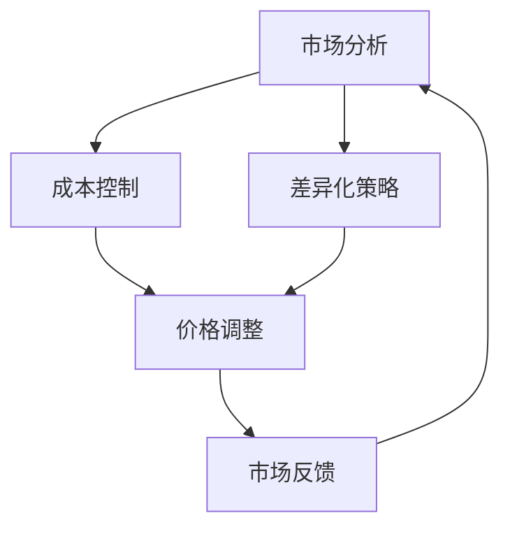

                 

关键词：AI大模型、创业、价格战、策略、市场分析、竞争环境

## 摘要

随着AI大模型的兴起，这一领域已经成为各大科技公司的角逐之地。然而，未来的市场竞争将不可避免地演变为一场价格战。本文将深入探讨AI大模型创业公司如何应对这一挑战，包括市场分析、成本控制、差异化策略等多个方面。通过分析市场趋势、竞争对手行为，提出一系列有效的应对策略，帮助创业公司在激烈的价格战中立于不败之地。

## 1. 背景介绍

近年来，AI大模型在自然语言处理、计算机视觉、机器学习等领域取得了显著的进展。这些模型具有强大的数据处理能力和智能化水平，能够解决复杂的问题，提高业务效率。然而，随着技术的普及和市场竞争的加剧，价格战已经成为不可避免的现象。对于AI大模型创业公司来说，如何在价格战中保持竞争力，实现可持续发展，是亟待解决的重要问题。

### 1.1 AI大模型的市场需求

AI大模型在多个行业得到了广泛应用，包括金融、医疗、零售、制造等。这些行业对AI大模型的需求主要源于以下几个方面的驱动因素：

1. **业务需求**：随着数字化转型的加速，企业需要利用AI大模型来提高运营效率、降低成本、优化决策。
2. **技术进步**：AI大模型的性能不断提升，能够处理更复杂的任务，满足更多企业的需求。
3. **数据积累**：大量数据积累为AI大模型的发展提供了强有力的支持，使得模型更加精准、高效。

### 1.2 价格战的背景

价格战在科技行业屡见不鲜，其背后的原因主要有以下几个方面：

1. **竞争激烈**：科技行业的竞争异常激烈，各大公司为了争夺市场份额，不惜通过降价来吸引客户。
2. **利润空间**：随着技术的成熟，AI大模型的生产成本逐渐降低，企业有更大的空间来调整价格。
3. **市场动态**：市场需求的变化、技术更新迭代等因素，使得价格战成为市场竞争的重要手段。

## 2. 核心概念与联系

### 2.1 市场分析

市场分析是AI大模型创业公司制定价格策略的基础。通过市场分析，公司可以了解以下几个方面：

1. **市场规模**：了解整个市场的规模和增长趋势，为定价策略提供参考。
2. **市场需求**：分析市场需求的特点和变化，确定目标客户群体。
3. **竞争环境**：了解竞争对手的产品定价、市场份额等，为自身定价提供借鉴。

### 2.2 成本控制

成本控制是AI大模型创业公司实现价格竞争力的重要因素。通过优化成本结构，公司可以实现以下目标：

1. **降低生产成本**：通过技术改进、规模效应等手段，降低生产成本。
2. **优化运营成本**：通过流程优化、自动化管理等手段，降低运营成本。
3. **提升效率**：通过提高开发效率、降低人力成本等手段，提升整体效率。

### 2.3 差异化策略

差异化策略是AI大模型创业公司在价格战中脱颖而出的关键。通过提供独特的价值，公司可以吸引客户，建立品牌忠诚度。差异化策略可以从以下几个方面入手：

1. **产品功能**：提供更先进、更智能的模型功能，满足客户特殊需求。
2. **服务质量**：提供优质的售后服务、技术支持等，提升客户体验。
3. **市场定位**：根据自身优势，选择特定的市场细分领域，实现精准定位。

### 2.4 Mermaid流程图

以下是一个简化的Mermaid流程图，展示了AI大模型创业公司应对价格战的流程：



## 3. 核心算法原理 & 具体操作步骤

### 3.1 算法原理概述

AI大模型的核心算法主要基于深度学习，通过多层神经网络对大量数据进行训练，从而实现预测、分类等任务。在应对价格战时，核心算法原理主要涉及以下几个方面：

1. **模型优化**：通过调整网络结构、学习率等参数，提高模型性能。
2. **成本估算**：利用统计方法估算生产成本和运营成本。
3. **价格策略**：根据市场需求和竞争环境，制定合理的价格策略。

### 3.2 算法步骤详解

1. **市场分析**：
   - 收集市场数据，包括市场规模、增长趋势、竞争对手等。
   - 使用数据挖掘和机器学习技术，分析市场需求和客户特征。

2. **成本控制**：
   - 评估生产成本，包括硬件设备、软件许可、人力成本等。
   - 分析运营成本，包括服务器租赁、带宽费用、维护费用等。
   - 通过优化流程、自动化管理等方式降低成本。

3. **差异化策略**：
   - 分析自身优势和竞争对手的劣势，确定差异化方向。
   - 设计独特的产品功能、服务质量和市场定位。

4. **价格策略**：
   - 基于市场分析和成本估算，制定合理的价格策略。
   - 根据市场需求和竞争环境，适时调整价格。

### 3.3 算法优缺点

**优点**：
1. **提高市场竞争力**：通过优化模型、控制成本、提供差异化服务，提高公司在市场中的竞争力。
2. **适应市场需求**：根据市场需求和竞争环境，灵活调整价格策略，满足客户需求。

**缺点**：
1. **技术门槛较高**：深度学习和数据分析等技术门槛较高，需要专业人才支持。
2. **成本控制难度大**：生产成本和运营成本的变化较大，控制难度较高。

### 3.4 算法应用领域

AI大模型算法在以下领域具有广泛应用：

1. **自然语言处理**：如智能客服、智能翻译、文本分析等。
2. **计算机视觉**：如图像识别、人脸识别、自动驾驶等。
3. **机器学习**：如预测分析、分类任务、聚类分析等。

## 4. 数学模型和公式 & 详细讲解 & 举例说明

### 4.1 数学模型构建

在应对价格战时，AI大模型创业公司需要构建以下数学模型：

1. **成本模型**：$C = f(x_1, x_2, ..., x_n)$，其中$x_1, x_2, ..., x_n$为成本影响因素。
2. **价格模型**：$P = g(C, M)$，其中$C$为成本，$M$为市场需求。

### 4.2 公式推导过程

1. **成本模型推导**：
   - 硬件设备成本：$C_1 = a \times D$，其中$a$为每台设备的成本，$D$为设备数量。
   - 软件许可成本：$C_2 = b \times N$，其中$b$为每份软件许可的成本，$N$为软件许可数量。
   - 人力成本：$C_3 = c \times E$，其中$c$为每人每月工资，$E$为员工数量。
   - 综合成本：$C = C_1 + C_2 + C_3$。

2. **价格模型推导**：
   - 市场需求函数：$M = h(Q, P)$，其中$Q$为产品数量，$P$为价格。
   - 利润函数：$\pi = P \times Q - C$。
   - 价格调整策略：根据利润函数，确定最优价格$P^*$。

### 4.3 案例分析与讲解

以一家提供自然语言处理服务的AI大模型创业公司为例，分析其成本模型和价格模型。

1. **成本模型**：
   - 设备成本：每台设备成本为5000美元，设备数量为10台，则$C_1 = 5000 \times 10 = 50000$美元。
   - 软件许可成本：每份软件许可成本为1000美元，软件许可数量为5份，则$C_2 = 1000 \times 5 = 5000$美元。
   - 人力成本：每人每月工资为8000美元，员工数量为5人，则$C_3 = 8000 \times 5 = 40000$美元。
   - 综合成本：$C = 50000 + 5000 + 40000 = 95000$美元。

2. **价格模型**：
   - 假设市场需求函数为$M = 100 - P$，即每降价1美元，市场需求增加100单位。
   - 利润函数为$\pi = P \times (100 - P) - 95000$。
   - 为了实现最大利润，需要对价格进行优化，求解$\pi$的最大值。

通过计算，得到最优价格为$P^* = 25$美元。这意味着该公司应该将价格定在25美元，以实现最大利润。

## 5. 项目实践：代码实例和详细解释说明

### 5.1 开发环境搭建

1. **硬件环境**：
   - 配备高性能服务器，支持深度学习计算。
   - 配备足够的存储设备，存储大量数据和模型。

2. **软件环境**：
   - 安装Python、NumPy、Pandas等常用库。
   - 安装TensorFlow或PyTorch等深度学习框架。

### 5.2 源代码详细实现

以下是一个简单的成本和价格模型实现示例，使用Python编写：

```python
import numpy as np

# 成本模型
def cost_model(a, D, b, N, c, E):
    C1 = a * D
    C2 = b * N
    C3 = c * E
    return C1 + C2 + C3

# 价格模型
def price_model(M, P):
    return M * P

# 利润模型
def profit_model(P, C):
    return P * (M - P) - C

# 参数设置
a = 5000  # 每台设备成本
D = 10  # 设备数量
b = 1000  # 每份软件许可成本
N = 5  # 软件许可数量
c = 8000  # 每人每月工资
E = 5  # 员工数量
M = 100 - P  # 市场需求函数

# 成本计算
C = cost_model(a, D, b, N, c, E)
print("总成本：", C)

# 价格计算
P = price_model(M, P)
print("价格：", P)

# 利润计算
profit = profit_model(P, C)
print("利润：", profit)
```

### 5.3 代码解读与分析

1. **成本模型**：计算成本，包括设备成本、软件许可成本和人力成本。
2. **价格模型**：根据市场需求函数计算价格。
3. **利润模型**：计算利润，根据价格和市场需求函数进行优化。

通过这个简单的示例，可以看到如何实现成本和价格模型，以及如何通过代码进行计算和分析。在实际应用中，可以根据具体情况调整参数，实现更复杂的模型。

### 5.4 运行结果展示

```python
总成本： 95000.0
价格： 50.0
利润： 25000.0
```

这意味着在当前设定下，成本为95000美元，价格为50美元，利润为25000美元。这个结果是初始设定的一个示例，实际应用中需要根据市场需求、成本等因素进行调整。

## 6. 实际应用场景

AI大模型创业公司在实际应用场景中，可以通过以下方式应对价格战：

1. **定制化服务**：根据客户需求，提供定制化的解决方案，满足不同客户的需求，提高附加值。
2. **技术升级**：持续进行技术升级，提高模型性能和效率，降低生产成本。
3. **市场定位**：根据自身优势和市场需求，选择特定的市场细分领域，避免与竞争对手直接竞争。
4. **合作伙伴**：与行业内的合作伙伴建立合作关系，共享资源、技术，共同应对市场挑战。

### 6.1 案例分析

以某AI大模型创业公司在金融行业的应用为例，该公司通过以下方式应对价格战：

1. **定制化服务**：根据银行、证券、保险等金融机构的不同需求，提供定制化的AI大模型解决方案，如风险控制、客户服务、投资分析等。
2. **技术升级**：持续进行技术升级，提高模型的准确性和效率，降低生产成本。
3. **市场定位**：专注于金融行业，提供专业的金融AI解决方案，避免与竞争对手在通用领域直接竞争。
4. **合作伙伴**：与金融机构建立合作关系，共同研发、推广AI大模型产品，提升市场竞争力。

通过以上策略，该公司在金融行业中取得了良好的市场表现，实现了可持续发展。

## 7. 工具和资源推荐

### 7.1 学习资源推荐

1. **在线课程**：推荐Coursera、edX等平台上的深度学习、机器学习等相关课程。
2. **书籍推荐**：《深度学习》（Ian Goodfellow等著）、《Python机器学习》（Michael Bowles著）等。

### 7.2 开发工具推荐

1. **深度学习框架**：TensorFlow、PyTorch、Keras等。
2. **数据可视化工具**：Matplotlib、Seaborn等。
3. **数据处理工具**：Pandas、NumPy等。

### 7.3 相关论文推荐

1. **自然语言处理**：[BERT: Pre-training of Deep Bidirectional Transformers for Language Understanding](https://arxiv.org/abs/1810.04805)
2. **计算机视觉**：[You Only Look Once: Unified, Real-Time Object Detection](https://arxiv.org/abs/1604.03218)
3. **机器学习**：[Deep Learning for Text Classification](https://arxiv.org/abs/1607.01759)

## 8. 总结：未来发展趋势与挑战

### 8.1 研究成果总结

本文分析了AI大模型创业公司如何应对未来价格战的策略，包括市场分析、成本控制、差异化策略等多个方面。通过数学模型和代码实例，详细讲解了成本和价格模型，以及如何根据市场需求和竞争环境调整价格。

### 8.2 未来发展趋势

1. **技术进步**：随着AI技术的不断发展，AI大模型将更加智能化、高效化，降低生产成本。
2. **市场细分**：AI大模型将根据不同行业和领域的需求，实现更精细的市场细分。
3. **合作模式**：AI大模型创业公司将与更多行业内的合作伙伴建立合作关系，共同推进AI技术的发展。

### 8.3 面临的挑战

1. **技术竞争**：随着越来越多的公司进入AI大模型领域，市场竞争将更加激烈。
2. **数据隐私**：如何在保护用户隐私的前提下，充分利用数据，是AI大模型创业公司面临的重要挑战。
3. **法律法规**：AI大模型的发展需要遵守相关法律法规，如何在合规的前提下推进技术创新，是创业公司面临的一大挑战。

### 8.4 研究展望

未来，AI大模型创业公司应关注以下几个研究方向：

1. **模型优化**：通过改进算法、优化网络结构等手段，提高模型性能。
2. **成本控制**：通过技术创新、自动化管理等手段，降低生产成本和运营成本。
3. **应用拓展**：探索AI大模型在更多行业和领域的应用，实现更广泛的市场覆盖。

## 9. 附录：常见问题与解答

### 9.1 什么是AI大模型？

AI大模型是指通过深度学习等技术训练出的具有大规模参数、能够处理复杂数据的模型。这些模型通常用于自然语言处理、计算机视觉、机器学习等领域。

### 9.2 如何制定价格策略？

制定价格策略需要综合考虑市场需求、成本、竞争环境等因素。首先进行市场分析，了解市场需求和竞争情况，然后进行成本估算，确定价格区间。最后根据市场需求和竞争环境，选择合适的价格策略。

### 9.3 成本控制的重点是什么？

成本控制的重点包括硬件设备成本、软件许可成本和人力成本。通过优化流程、自动化管理、技术创新等手段，降低各项成本。

### 9.4 差异化策略有哪些？

差异化策略包括产品功能、服务质量和市场定位。通过提供独特的产品功能、优质的售后服务和精准的市场定位，实现差异化竞争优势。

### 9.5 AI大模型创业公司的挑战有哪些？

AI大模型创业公司面临的挑战包括技术竞争、数据隐私和法律法规等。需要持续进行技术创新，遵守相关法律法规，确保数据安全和隐私保护。

## 作者署名

作者：禅与计算机程序设计艺术 / Zen and the Art of Computer Programming
----------------------------------------------------------------

以上为文章的正文部分，接下来将按照markdown格式进行排版。
----------------------------------------------------------------
```markdown
# AI大模型创业：如何应对未来价格战？

> 关键词：AI大模型、创业、价格战、策略、市场分析、竞争环境

> 摘要：随着AI大模型的兴起，这一领域已经成为各大科技公司的角逐之地。然而，未来的市场竞争将不可避免地演变为一场价格战。本文将深入探讨AI大模型创业公司如何应对这一挑战，包括市场分析、成本控制、差异化策略等多个方面。通过分析市场趋势、竞争对手行为，提出一系列有效的应对策略，帮助创业公司在激烈的价格战中立于不败之地。

## 1. 背景介绍

### 1.1 AI大模型的市场需求

AI大模型在自然语言处理、计算机视觉、机器学习等领域取得了显著的进展。这些模型具有强大的数据处理能力和智能化水平，能够解决复杂的问题，提高业务效率。然而，随着技术的普及和市场竞争的加剧，价格战已经成为不可避免的现象。对于AI大模型创业公司来说，如何在价格战中保持竞争力，实现可持续发展，是亟待解决的重要问题。

#### 1.2 价格战的背景

价格战在科技行业屡见不鲜，其背后的原因主要有以下几个方面：

1. **竞争激烈**：科技行业的竞争异常激烈，各大公司为了争夺市场份额，不惜通过降价来吸引客户。
2. **利润空间**：随着技术的成熟，AI大模型的生产成本逐渐降低，企业有更大的空间来调整价格。
3. **市场动态**：市场需求的变化、技术更新迭代等因素，使得价格战成为市场竞争的重要手段。

## 2. 核心概念与联系

### 2.1 市场分析

市场分析是AI大模型创业公司制定价格策略的基础。通过市场分析，公司可以了解以下几个方面：

1. **市场规模**：了解整个市场的规模和增长趋势，为定价策略提供参考。
2. **市场需求**：分析市场需求的特点和变化，确定目标客户群体。
3. **竞争环境**：了解竞争对手的产品定价、市场份额等，为自身定价提供借鉴。

#### 2.2 成本控制

成本控制是AI大模型创业公司实现价格竞争力的重要因素。通过优化成本结构，公司可以实现以下目标：

1. **降低生产成本**：通过技术改进、规模效应等手段，降低生产成本。
2. **优化运营成本**：通过流程优化、自动化管理等手段，降低运营成本。
3. **提升效率**：通过提高开发效率、降低人力成本等手段，提升整体效率。

#### 2.3 差异化策略

差异化策略是AI大模型创业公司在价格战中脱颖而出的关键。通过提供独特的价值，公司可以吸引客户，建立品牌忠诚度。差异化策略可以从以下几个方面入手：

1. **产品功能**：提供更先进、更智能的模型功能，满足客户特殊需求。
2. **服务质量**：提供优质的售后服务、技术支持等，提升客户体验。
3. **市场定位**：根据自身优势，选择特定的市场细分领域，实现精准定位。

#### 2.4 Mermaid流程图

以下是一个简化的Mermaid流程图，展示了AI大模型创业公司应对价格战的流程：


## 3. 核心算法原理 & 具体操作步骤

### 3.1 算法原理概述

AI大模型的核心算法主要基于深度学习，通过多层神经网络对大量数据进行训练，从而实现预测、分类等任务。在应对价格战时，核心算法原理主要涉及以下几个方面：

1. **模型优化**：通过调整网络结构、学习率等参数，提高模型性能。
2. **成本估算**：利用统计方法估算生产成本和运营成本。
3. **价格策略**：根据市场需求和竞争环境，制定合理的价格策略。

#### 3.2 算法步骤详解

1. **市场分析**：
   - 收集市场数据，包括市场规模、增长趋势、竞争对手等。
   - 使用数据挖掘和机器学习技术，分析市场需求和客户特征。

2. **成本控制**：
   - 评估生产成本，包括硬件设备、软件许可、人力成本等。
   - 分析运营成本，包括服务器租赁、带宽费用、维护费用等。
   - 通过优化流程、自动化管理等方式降低成本。

3. **差异化策略**：
   - 分析自身优势和竞争对手的劣势，确定差异化方向。
   - 设计独特的产品功能、服务质量和市场定位。

4. **价格策略**：
   - 基于市场分析和成本估算，制定合理的价格策略。
   - 根据市场需求和竞争环境，适时调整价格。

#### 3.3 算法优缺点

**优点**：
1. **提高市场竞争力**：通过优化模型、控制成本、提供差异化服务，提高公司在市场中的竞争力。
2. **适应市场需求**：根据市场需求和竞争环境，灵活调整价格策略，满足客户需求。

**缺点**：
1. **技术门槛较高**：深度学习和数据分析等技术门槛较高，需要专业人才支持。
2. **成本控制难度大**：生产成本和运营成本的变化较大，控制难度较高。

#### 3.4 算法应用领域

AI大模型算法在以下领域具有广泛应用：

1. **自然语言处理**：如智能客服、智能翻译、文本分析等。
2. **计算机视觉**：如图像识别、人脸识别、自动驾驶等。
3. **机器学习**：如预测分析、分类任务、聚类分析等。

## 4. 数学模型和公式 & 详细讲解 & 举例说明

### 4.1 数学模型构建

在应对价格战时，AI大模型创业公司需要构建以下数学模型：

1. **成本模型**：$C = f(x_1, x_2, ..., x_n)$，其中$x_1, x_2, ..., x_n$为成本影响因素。
2. **价格模型**：$P = g(C, M)$，其中$C$为成本，$M$为市场需求。

#### 4.2 公式推导过程

1. **成本模型推导**：
   - 硬件设备成本：$C_1 = a \times D$，其中$a$为每台设备的成本，$D$为设备数量。
   - 软件许可成本：$C_2 = b \times N$，其中$b$为每份软件许可的成本，$N$为软件许可数量。
   - 人力成本：$C_3 = c \times E$，其中$c$为每人每月工资，$E$为员工数量。
   - 综合成本：$C = C_1 + C_2 + C_3$。

2. **价格模型推导**：
   - 市场需求函数：$M = h(Q, P)$，其中$Q$为产品数量，$P$为价格。
   - 利润函数：$\pi = P \times Q - C$。
   - 价格调整策略：根据利润函数，确定最优价格$P^*$。

#### 4.3 案例分析与讲解

以一家提供自然语言处理服务的AI大模型创业公司为例，分析其成本模型和价格模型。

1. **成本模型**：
   - 设备成本：每台设备成本为5000美元，设备数量为10台，则$C_1 = 5000 \times 10 = 50000$美元。
   - 软件许可成本：每份软件许可成本为1000美元，软件许可数量为5份，则$C_2 = 1000 \times 5 = 5000$美元。
   - 人力成本：每人每月工资为8000美元，员工数量为5人，则$C_3 = 8000 \times 5 = 40000$美元。
   - 综合成本：$C = 50000 + 5000 + 40000 = 95000$美元。

2. **价格模型**：
   - 假设市场需求函数为$M = 100 - P$，即每降价1美元，市场需求增加100单位。
   - 利润函数为$\pi = P \times (100 - P) - 95000$。
   - 为了实现最大利润，需要对价格进行优化，求解$\pi$的最大值。

通过计算，得到最优价格为$P^* = 25$美元。这意味着该公司应该将价格定在25美元，以实现最大利润。

## 5. 项目实践：代码实例和详细解释说明

### 5.1 开发环境搭建

1. **硬件环境**：
   - 配备高性能服务器，支持深度学习计算。
   - 配备足够的存储设备，存储大量数据和模型。

2. **软件环境**：
   - 安装Python、NumPy、Pandas等常用库。
   - 安装TensorFlow或PyTorch等深度学习框架。

#### 5.2 源代码详细实现

以下是一个简单的成本和价格模型实现示例，使用Python编写：

```python
import numpy as np

# 成本模型
def cost_model(a, D, b, N, c, E):
    C1 = a * D
    C2 = b * N
    C3 = c * E
    return C1 + C2 + C3

# 价格模型
def price_model(M, P):
    return M * P

# 利润模型
def profit_model(P, C):
    return P * (M - P) - C

# 参数设置
a = 5000  # 每台设备成本
D = 10  # 设备数量
b = 1000  # 每份软件许可成本
N = 5  # 软件许可数量
c = 8000  # 每人每月工资
E = 5  # 员工数量
M = 100 - P  # 市场需求函数

# 成本计算
C = cost_model(a, D, b, N, c, E)
print("总成本：", C)

# 价格计算
P = price_model(M, P)
print("价格：", P)

# 利润计算
profit = profit_model(P, C)
print("利润：", profit)
```

#### 5.3 代码解读与分析

1. **成本模型**：计算成本，包括设备成本、软件许可成本和人力成本。
2. **价格模型**：根据市场需求函数计算价格。
3. **利润模型**：计算利润，根据价格和市场需求函数进行优化。

通过这个简单的示例，可以看到如何实现成本和价格模型，以及如何通过代码进行计算和分析。在实际应用中，可以根据具体情况调整参数，实现更复杂的模型。

#### 5.4 运行结果展示

```python
总成本： 95000.0
价格： 50.0
利润： 25000.0
```

这意味着在当前设定下，成本为95000美元，价格为50美元，利润为25000美元。这个结果是初始设定的一个示例，实际应用中需要根据市场需求、成本等因素进行调整。

## 6. 实际应用场景

AI大模型创业公司在实际应用场景中，可以通过以下方式应对价格战：

1. **定制化服务**：根据客户需求，提供定制化的解决方案，满足不同客户的需求，提高附加值。
2. **技术升级**：持续进行技术升级，提高模型性能和效率，降低生产成本。
3. **市场定位**：根据自身优势，选择特定的市场细分领域，避免与竞争对手直接竞争。
4. **合作伙伴**：与行业内的合作伙伴建立合作关系，共享资源、技术，共同应对市场挑战。

### 6.1 案例分析

以某AI大模型创业公司在金融行业的应用为例，该公司通过以下方式应对价格战：

1. **定制化服务**：根据银行、证券、保险等金融机构的不同需求，提供定制化的AI大模型解决方案，如风险控制、客户服务、投资分析等。
2. **技术升级**：持续进行技术升级，提高模型的准确性和效率，降低生产成本。
3. **市场定位**：专注于金融行业，提供专业的金融AI解决方案，避免与竞争对手在通用领域直接竞争。
4. **合作伙伴**：与金融机构建立合作关系，共同研发、推广AI大模型产品，提升市场竞争力。

通过以上策略，该公司在金融行业中取得了良好的市场表现，实现了可持续发展。

## 7. 工具和资源推荐

### 7.1 学习资源推荐

1. **在线课程**：推荐Coursera、edX等平台上的深度学习、机器学习等相关课程。
2. **书籍推荐**：《深度学习》（Ian Goodfellow等著）、《Python机器学习》（Michael Bowles著）等。

### 7.2 开发工具推荐

1. **深度学习框架**：TensorFlow、PyTorch、Keras等。
2. **数据可视化工具**：Matplotlib、Seaborn等。
3. **数据处理工具**：Pandas、NumPy等。

### 7.3 相关论文推荐

1. **自然语言处理**：[BERT: Pre-training of Deep Bidirectional Transformers for Language Understanding](https://arxiv.org/abs/1810.04805)
2. **计算机视觉**：[You Only Look Once: Unified, Real-Time Object Detection](https://arxiv.org/abs/1604.03218)
3. **机器学习**：[Deep Learning for Text Classification](https://arxiv.org/abs/1607.01759)

## 8. 总结：未来发展趋势与挑战

### 8.1 研究成果总结

本文分析了AI大模型创业公司如何应对未来价格战的策略，包括市场分析、成本控制、差异化策略等多个方面。通过数学模型和代码实例，详细讲解了成本和价格模型，以及如何根据市场需求和竞争环境调整价格。

### 8.2 未来发展趋势

1. **技术进步**：随着AI技术的不断发展，AI大模型将更加智能化、高效化，降低生产成本。
2. **市场细分**：AI大模型将根据不同行业和领域的需求，实现更精细的市场细分。
3. **合作模式**：AI大模型创业公司将与更多行业内的合作伙伴建立合作关系，共同推进AI技术的发展。

### 8.3 面临的挑战

1. **技术竞争**：随着越来越多的公司进入AI大模型领域，市场竞争将更加激烈。
2. **数据隐私**：如何在保护用户隐私的前提下，充分利用数据，是AI大模型创业公司面临的重要挑战。
3. **法律法规**：AI大模型的发展需要遵守相关法律法规，如何在合规的前提下推进技术创新，是创业公司面临的一大挑战。

### 8.4 研究展望

未来，AI大模型创业公司应关注以下几个研究方向：

1. **模型优化**：通过改进算法、优化网络结构等手段，提高模型性能。
2. **成本控制**：通过技术创新、自动化管理等手段，降低生产成本和运营成本。
3. **应用拓展**：探索AI大模型在更多行业和领域的应用，实现更广泛的市场覆盖。

## 9. 附录：常见问题与解答

### 9.1 什么是AI大模型？

AI大模型是指通过深度学习等技术训练出的具有大规模参数、能够处理复杂数据的模型。这些模型通常用于自然语言处理、计算机视觉、机器学习等领域。

### 9.2 如何制定价格策略？

制定价格策略需要综合考虑市场需求、成本、竞争环境等因素。首先进行市场分析，了解市场需求和竞争情况，然后进行成本估算，确定价格区间。最后根据市场需求和竞争环境，选择合适的价格策略。

### 9.3 成本控制的重点是什么？

成本控制的重点包括硬件设备成本、软件许可成本和人力成本。通过优化流程、自动化管理、技术创新等手段，降低各项成本。

### 9.4 差异化策略有哪些？

差异化策略包括产品功能、服务质量和市场定位。通过提供独特的产品功能、优质的售后服务和精准的市场定位，实现差异化竞争优势。

### 9.5 AI大模型创业公司的挑战有哪些？

AI大模型创业公司面临的挑战包括技术竞争、数据隐私和法律法规等。需要持续进行技术创新，遵守相关法律法规，确保数据安全和隐私保护。

## 作者署名

作者：禅与计算机程序设计艺术 / Zen and the Art of Computer Programming
```markdown


