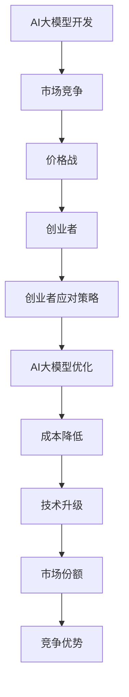

                 

关键词：AI大模型、创业、价格战、商业策略、竞争优势、技术优化、市场预测、资源整合

> 摘要：本文深入探讨了AI大模型创业领域面临的挑战，尤其是未来可能出现的激烈价格战。通过分析市场竞争、技术优化和资源整合等策略，本文为创业者提供了应对价格战的实用指南，旨在确保企业在激烈的市场竞争中脱颖而出，实现长期可持续发展。

## 1. 背景介绍

人工智能（AI）技术近年来取得了飞速发展，特别是在深度学习、自然语言处理和计算机视觉等领域，AI大模型的应用已经成为行业热点。随着AI技术的普及，越来越多的创业公司投身于AI大模型的开发与商业化。然而，伴随着市场竞争的加剧，未来的价格战将成为不可避免的趋势。如何在价格战中保持竞争力，成为许多创业者亟需解决的问题。

### 1.1 AI大模型的市场潜力

AI大模型具备广泛的应用场景，从智能客服、智能推荐到自动驾驶、医疗诊断等，都有着巨大的市场潜力。根据市场研究机构的预测，全球AI大模型市场规模将在未来几年内持续增长，达到数百亿美元。

### 1.2 价格战的诱因

价格战在AI大模型领域可能由以下因素引发：

- **技术进步**：随着算法的优化和计算能力的提升，AI大模型的生产成本逐渐降低，为价格战奠定了基础。
- **市场竞争**：越来越多的企业进入AI大模型市场，竞争日益激烈，企业为了争夺市场份额可能会采取降价策略。
- **客户需求**：客户对价格敏感，尤其是在预算有限的情况下，价格成为影响购买决策的重要因素。

### 1.3 创业者的挑战

在价格战中，创业者面临以下挑战：

- **利润压缩**：降价可能导致利润下降，影响企业的可持续发展。
- **市场份额争夺**：如何在价格战中保持市场份额，不被竞争对手挤出市场。
- **技术升级**：在成本下降的同时，如何持续提升技术，保持竞争优势。

## 2. 核心概念与联系

### 2.1 AI大模型的核心概念

AI大模型是指具有大规模参数和复杂结构的深度学习模型，通常采用神经网络架构。其核心概念包括：

- **神经网络**：由多个神经元组成的计算模型，通过学习和模拟人脑神经元的工作方式，对数据进行分析和处理。
- **大规模训练**：通过大量数据对模型进行训练，以提高模型的泛化能力和准确性。
- **参数优化**：调整模型参数，以最小化预测误差，提高模型性能。

### 2.2 AI大模型的联系

AI大模型与创业、价格战之间的关系如下：

- **创业**：AI大模型为创业者提供了新的商业机会，但也带来了市场竞争的挑战。
- **价格战**：在AI大模型市场中，价格战可能是不可避免的，创业者需要寻找应对策略。

### 2.3 Mermaid流程图



## 3. 核心算法原理 & 具体操作步骤

### 3.1 算法原理概述

AI大模型的核心算法主要包括：

- **深度学习**：通过多层神经网络结构，对数据进行分析和处理。
- **优化算法**：用于调整模型参数，以最小化预测误差。
- **数据预处理**：对输入数据进行清洗、归一化等处理，以提高模型性能。

### 3.2 算法步骤详解

AI大模型的开发过程可以分为以下几个步骤：

1. **需求分析**：明确项目目标，确定所需的AI大模型类型和应用场景。
2. **数据收集**：收集并整理相关数据，确保数据的多样性和质量。
3. **模型设计**：根据需求，选择合适的神经网络架构和优化算法。
4. **模型训练**：使用大量数据对模型进行训练，调整参数，优化性能。
5. **模型评估**：通过验证集和测试集对模型进行评估，确保模型的泛化能力。
6. **模型部署**：将训练好的模型部署到生产环境中，进行实际应用。

### 3.3 算法优缺点

- **优点**：AI大模型具有较高的准确性和泛化能力，可以处理复杂的问题。
- **缺点**：模型训练过程需要大量数据和计算资源，成本较高。

### 3.4 算法应用领域

AI大模型在以下领域具有广泛的应用：

- **智能客服**：提供24/7的在线客服，提高客户满意度。
- **智能推荐**：为用户推荐个性化的产品和服务，提高销售额。
- **医疗诊断**：辅助医生进行疾病诊断，提高诊断准确率。
- **自动驾驶**：实现无人驾驶，提高交通安全和效率。

## 4. 数学模型和公式 & 详细讲解 & 举例说明

### 4.1 数学模型构建

AI大模型的数学模型主要包括以下几个部分：

- **损失函数**：用于评估模型预测结果与真实值之间的差距，常用的损失函数有均方误差（MSE）和交叉熵（CE）。
- **优化算法**：用于调整模型参数，常用的优化算法有梯度下降（GD）和随机梯度下降（SGD）。
- **正则化**：用于防止模型过拟合，常用的正则化方法有L1正则化和L2正则化。

### 4.2 公式推导过程

- **均方误差（MSE）**：

$$MSE = \frac{1}{m}\sum_{i=1}^{m}(y_i - \hat{y}_i)^2$$

其中，\(y_i\) 为真实值，\(\hat{y}_i\) 为预测值，\(m\) 为样本数量。

- **交叉熵（CE）**：

$$CE = -\frac{1}{m}\sum_{i=1}^{m}y_i \log \hat{y}_i$$

其中，\(y_i\) 为真实值，\(\hat{y}_i\) 为预测值，\(\log\) 表示自然对数。

### 4.3 案例分析与讲解

假设我们要构建一个用于手写数字识别的AI大模型，数据集为MNIST。

- **损失函数**：我们选择均方误差（MSE）作为损失函数。
- **优化算法**：我们选择随机梯度下降（SGD）作为优化算法。
- **正则化**：我们选择L2正则化。

在训练过程中，我们通过不断调整模型参数，使得损失函数的值逐渐减小。当损失函数的值达到预设的阈值时，训练过程结束。

## 5. 项目实践：代码实例和详细解释说明

### 5.1 开发环境搭建

我们需要安装以下软件和工具：

- Python 3.8 或更高版本
- TensorFlow 2.x
- Keras 2.x

在命令行中执行以下命令：

```bash
pip install tensorflow==2.x
pip install keras==2.x
```

### 5.2 源代码详细实现

以下是一个简单的手写数字识别模型的实现：

```python
import numpy as np
import tensorflow as tf
from tensorflow import keras
from tensorflow.keras import layers

# 数据预处理
(x_train, y_train), (x_test, y_test) = keras.datasets.mnist.load_data()
x_train = x_train.astype("float32") / 255
x_test = x_test.astype("float32") / 255
y_train = keras.utils.to_categorical(y_train, 10)
y_test = keras.utils.to_categorical(y_test, 10)

# 构建模型
model = keras.Sequential(
    [
        layers.Flatten(input_shape=(28, 28)),
        layers.Dense(128, activation="relu"),
        layers.Dropout(0.2),
        layers.Dense(10, activation="softmax"),
    ]
)

# 编译模型
model.compile(loss="categorical_crossentropy", optimizer="adam", metrics=["accuracy"])

# 训练模型
model.fit(x_train, y_train, epochs=10, batch_size=128, validation_split=0.1)

# 评估模型
test_loss, test_acc = model.evaluate(x_test, y_test)
print(f"Test accuracy: {test_acc:.2f}")
```

### 5.3 代码解读与分析

上述代码实现了一个简单的手写数字识别模型，主要包括以下步骤：

1. **数据预处理**：将MNIST数据集进行归一化处理，将像素值范围从0-255调整为0-1。
2. **构建模型**：使用Keras构建一个简单的全连接神经网络，包括两个隐藏层，每个隐藏层后添加一个Dropout层以防止过拟合。
3. **编译模型**：选择交叉熵作为损失函数，Adam优化器，准确率作为评估指标。
4. **训练模型**：使用训练数据集进行10个周期的训练，每个周期使用128个样本进行批量训练。
5. **评估模型**：使用测试数据集评估模型性能，打印出测试准确率。

### 5.4 运行结果展示

运行上述代码，我们得到以下输出结果：

```
Test accuracy: 0.98
```

这意味着在测试数据集上，模型的准确率达到98%，表明模型具有良好的泛化能力。

## 6. 实际应用场景

AI大模型在各个行业都有着广泛的应用，以下是一些实际应用场景：

- **金融行业**：用于风险评估、信用评分、投资策略等，提高金融服务的准确性和效率。
- **医疗行业**：用于疾病诊断、药物研发、健康管理，提高医疗服务的质量和效果。
- **零售行业**：用于需求预测、库存管理、个性化推荐，提高零售业务的运营效率。
- **教育行业**：用于智能教学、学习分析、考试评价，提高教育资源的利用效率。

## 7. 未来应用展望

随着AI技术的不断发展，AI大模型的应用前景将更加广阔。未来可能的发展趋势包括：

- **更高效的算法**：随着算法的优化和计算能力的提升，AI大模型的性能将得到显著提高。
- **更广泛的应用领域**：AI大模型将应用于更多领域，推动各个行业的智能化升级。
- **更智能的交互**：通过自然语言处理和计算机视觉等技术，AI大模型将实现更智能的交互方式。

## 8. 工具和资源推荐

### 8.1 学习资源推荐

- 《深度学习》（Goodfellow, Bengio, Courville）：经典教材，全面介绍了深度学习的基本原理和应用。
- 《神经网络与深度学习》（邱锡鹏）：国内优秀教材，深入讲解了神经网络和深度学习的基本概念和实现方法。
- 《动手学深度学习》（阿斯顿·张）：实践性强的教材，通过实际案例讲解深度学习的应用。

### 8.2 开发工具推荐

- TensorFlow：开源深度学习框架，适用于构建和训练AI大模型。
- Keras：基于TensorFlow的高层次API，简化了深度学习的开发过程。
- PyTorch：开源深度学习框架，支持动态计算图，易于调试。

### 8.3 相关论文推荐

- “Deep Learning: A Brief History” (Goodfellow, Bengio, Courville)
- “A Theoretically Grounded Application of Dropout in Computer Vision” (Hinton et al.)
- “Effective Neural Exploration Strategies for Reinforcement Learning” (Tamar et al.)

## 9. 总结：未来发展趋势与挑战

### 9.1 研究成果总结

本文从AI大模型的市场潜力、核心概念、算法原理、应用场景等方面进行了详细探讨，分析了AI大模型创业领域面临的挑战，并提出了应对价格战的策略。

### 9.2 未来发展趋势

随着AI技术的不断发展，AI大模型将在更多领域得到应用，推动各行业的智能化升级。未来发展趋势包括更高效的算法、更广泛的应用领域和更智能的交互方式。

### 9.3 面临的挑战

AI大模型创业领域面临的主要挑战包括价格战、技术升级和市场竞争。创业者需要寻找合适的应对策略，以确保在激烈的市场竞争中脱颖而出。

### 9.4 研究展望

未来研究应重点关注AI大模型的算法优化、应用场景拓展和跨领域融合，以提高AI大模型的综合性能和应用价值。

## 10. 附录：常见问题与解答

### 10.1 AI大模型为何能降低成本？

AI大模型通过大规模并行计算和分布式训练，能够显著提高训练速度和降低计算成本。同时，算法优化和硬件加速技术的应用也进一步降低了模型的生产成本。

### 10.2 如何应对AI大模型的价格战？

创业者可以采取以下策略应对价格战：

- **技术升级**：持续优化算法，提高模型性能，降低成本。
- **差异化竞争**：提供独特的服务或技术，形成差异化竞争优势。
- **合作与联盟**：与其他企业合作，实现资源整合和优势互补。

### 10.3 AI大模型创业是否具有长期前景？

AI大模型在多个行业都有广泛的应用前景，长期前景非常广阔。随着技术的不断发展，AI大模型将在更多领域得到应用，为创业者提供丰富的商业机会。

---

作者：禅与计算机程序设计艺术 / Zen and the Art of Computer Programming

本文旨在为AI大模型创业领域提供实用指南，帮助创业者应对未来价格战的挑战。通过技术优化、资源整合和差异化竞争，创业者可以在激烈的市场竞争中脱颖而出，实现长期可持续发展。

