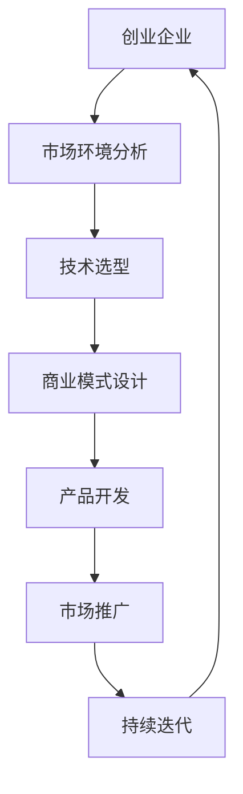

                 

关键词：人工智能，大模型，创业，市场挑战，技术创新，商业模式，数据分析，网络安全

> 摘要：随着人工智能技术的飞速发展，大模型的应用逐渐成为各行各业的热点。然而，在创业过程中，如何有效应对市场挑战，成为企业和创业者亟待解决的问题。本文将深入探讨大模型创业的市场环境、技术挑战、商业模式以及未来发展趋势，为读者提供有价值的参考。

## 1. 背景介绍

近年来，人工智能（AI）技术取得了突破性的进展，其中大模型（Large Models）的研究与应用尤为突出。大模型是指具有巨大参数量和高度复杂性的神经网络模型，如GPT、BERT等。它们在自然语言处理、计算机视觉、语音识别等领域取得了显著的成果，引发了产业界和学术界的高度关注。

在创业领域，人工智能大模型的应用潜力巨大。首先，大模型可以提高业务效率和生产力，降低人力成本；其次，大模型可以拓展业务范围，创新商业模式；最后，大模型为创业企业提供了强大的技术支持，助力其快速成长。然而，创业企业在应用大模型过程中也面临着诸多挑战，如技术门槛、数据安全、商业模式创新等。

本文旨在分析人工智能大模型创业的市场环境、技术挑战、商业模式以及未来发展趋势，为创业者提供有针对性的建议和指导。

## 2. 核心概念与联系

### 2.1. 人工智能大模型原理

人工智能大模型是基于深度学习技术构建的神经网络模型，具有以下核心特点：

1. **大规模参数量**：大模型通常具有数十亿甚至千亿级别的参数，能够捕捉到数据中的复杂模式。
2. **高度非线性**：大模型的神经网络结构具有高度非线性，可以处理复杂的输入数据。
3. **端到端学习**：大模型采用端到端的学习方式，能够直接从原始数据中学习到特征表示，无需人工设计特征。

### 2.2. 人工智能大模型架构

人工智能大模型的架构通常包括以下几个层次：

1. **输入层**：接收原始数据，如文本、图像、语音等。
2. **隐藏层**：包含多个隐藏层，用于对输入数据进行特征提取和变换。
3. **输出层**：根据任务需求生成输出结果，如文本生成、图像分类等。

### 2.3. 人工智能大模型应用场景

人工智能大模型在多个领域具有广泛应用，如：

1. **自然语言处理**：文本生成、机器翻译、情感分析等。
2. **计算机视觉**：图像分类、目标检测、人脸识别等。
3. **语音识别**：语音识别、语音合成等。
4. **推荐系统**：个性化推荐、广告投放等。

### 2.4. 人工智能大模型与创业的联系

人工智能大模型在创业领域具有重要的应用价值，主要体现在以下几个方面：

1. **降低技术门槛**：大模型可以简化技术实现，降低创业企业进入人工智能领域的门槛。
2. **提升业务效率**：大模型可以提高业务效率和生产力，为创业企业带来显著的经济效益。
3. **创新商业模式**：大模型可以拓展业务范围，创新商业模式，为创业企业带来更多发展机会。
4. **技术支持**：大模型为创业企业提供了强大的技术支持，助力其快速成长。

### 2.5. Mermaid 流程图



## 3. 核心算法原理 & 具体操作步骤

### 3.1. 算法原理概述

人工智能大模型的核心算法是基于深度学习技术，特别是基于神经网络的学习算法。深度学习算法通过多层神经网络对输入数据进行特征提取和变换，最终生成输出结果。具体来说，大模型的学习过程包括以下几个步骤：

1. **数据预处理**：对原始数据进行清洗、归一化等预处理操作，以提高模型的训练效果。
2. **模型构建**：根据任务需求设计神经网络结构，包括输入层、隐藏层和输出层。
3. **模型训练**：利用大规模数据进行模型训练，通过反向传播算法优化模型参数。
4. **模型评估**：使用验证数据集对模型进行评估，调整模型参数以获得更好的性能。
5. **模型部署**：将训练好的模型部署到实际应用场景中，如自然语言处理、计算机视觉等。

### 3.2. 算法步骤详解

#### 3.2.1. 数据预处理

数据预处理是深度学习模型训练的重要步骤，主要包括以下内容：

1. **数据清洗**：去除原始数据中的噪声和错误数据，保证数据的准确性。
2. **数据归一化**：将数据缩放到相同的范围，如[0, 1]或[-1, 1]，以加快模型收敛速度。
3. **数据增强**：通过数据增强技术，如随机裁剪、旋转、翻转等，增加数据的多样性，提高模型的泛化能力。

#### 3.2.2. 模型构建

模型构建是深度学习算法的核心步骤，主要包括以下内容：

1. **确定神经网络结构**：根据任务需求选择合适的神经网络结构，如卷积神经网络（CNN）、循环神经网络（RNN）等。
2. **定义损失函数**：根据任务类型选择合适的损失函数，如交叉熵损失函数、均方误差损失函数等。
3. **选择优化算法**：选择合适的优化算法，如梯度下降（GD）、随机梯度下降（SGD）等，以优化模型参数。

#### 3.2.3. 模型训练

模型训练是深度学习算法的关键步骤，主要包括以下内容：

1. **初始化模型参数**：随机初始化模型参数，以保证模型的随机性。
2. **前向传播**：将输入数据传递到神经网络中，计算输出结果。
3. **计算损失**：使用定义的损失函数计算输出结果与实际结果之间的差异。
4. **反向传播**：将损失函数的梯度反向传播到网络中的每个神经元，更新模型参数。
5. **迭代训练**：重复上述步骤，直到模型收敛或达到预定的训练次数。

#### 3.2.4. 模型评估

模型评估是评估模型性能的重要步骤，主要包括以下内容：

1. **验证集划分**：将训练数据集划分为训练集和验证集，用于模型训练和评估。
2. **计算指标**：使用定义的指标（如准确率、召回率、F1值等）计算模型在验证集上的性能。
3. **调整模型**：根据模型性能调整模型结构或参数，以提高模型性能。

#### 3.2.5. 模型部署

模型部署是将训练好的模型应用到实际场景中的过程，主要包括以下内容：

1. **模型转换**：将训练好的模型转换为可部署的格式，如ONNX、TorchScript等。
2. **硬件选择**：根据实际需求选择合适的硬件设备，如CPU、GPU、FPGA等。
3. **模型优化**：对模型进行优化，以提高模型在硬件设备上的运行效率和性能。

### 3.3. 算法优缺点

#### 优点

1. **高效性**：大模型具有较高的计算效率和准确率，可以处理大规模数据。
2. **泛化能力**：大模型具有较强的泛化能力，可以应对多种任务需求。
3. **自动化**：大模型的构建和训练过程可以自动化，降低人工干预。

#### 缺点

1. **数据依赖性**：大模型对数据量要求较高，数据质量和数量直接影响模型性能。
2. **计算资源消耗**：大模型训练和部署过程需要大量计算资源，对硬件设备要求较高。
3. **模型可解释性**：大模型具有较强的黑盒特性，难以解释模型决策过程。

### 3.4. 算法应用领域

人工智能大模型在多个领域具有广泛应用，包括但不限于：

1. **自然语言处理**：文本分类、情感分析、机器翻译等。
2. **计算机视觉**：图像分类、目标检测、人脸识别等。
3. **语音识别**：语音识别、语音合成等。
4. **推荐系统**：个性化推荐、广告投放等。
5. **金融科技**：风险控制、信用评估等。

## 4. 数学模型和公式 & 详细讲解 & 举例说明

### 4.1. 数学模型构建

在深度学习领域，数学模型构建是核心环节之一。本文主要介绍神经网络模型中的反向传播算法和损失函数。

#### 反向传播算法

反向传播算法是深度学习训练过程中的一种常用算法。其基本思想是将输出误差反向传播到网络中的每个神经元，更新网络中的参数，以达到优化模型的目的。

反向传播算法包括以下几个步骤：

1. **前向传播**：将输入数据传递到神经网络中，计算输出结果。
2. **计算损失**：使用定义的损失函数计算输出结果与实际结果之间的差异。
3. **计算梯度**：计算损失函数关于模型参数的梯度。
4. **反向传播**：将梯度反向传播到网络中的每个神经元，更新模型参数。

具体公式如下：

$$
\begin{aligned}
L &= \frac{1}{2} \sum_{i=1}^{n} (\hat{y}_i - y_i)^2 \\
\frac{\partial L}{\partial w_{ij}} &= -2(y_i - \hat{y}_i) \cdot z_j \\
w_{ij} &= w_{ij} - \alpha \cdot \frac{\partial L}{\partial w_{ij}}
\end{aligned}
$$

其中，$L$ 表示损失函数，$\hat{y}_i$ 表示预测结果，$y_i$ 表示真实结果，$w_{ij}$ 表示连接权重，$z_j$ 表示神经元输出。

#### 损失函数

损失函数用于衡量预测结果与真实结果之间的差距。常见的损失函数包括均方误差（MSE）、交叉熵（Cross Entropy）等。

均方误差（MSE）公式如下：

$$
MSE = \frac{1}{n} \sum_{i=1}^{n} (\hat{y}_i - y_i)^2
$$

交叉熵（Cross Entropy）公式如下：

$$
CE = -\frac{1}{n} \sum_{i=1}^{n} y_i \cdot \ln(\hat{y}_i)
$$

### 4.2. 公式推导过程

以均方误差（MSE）为例，详细推导损失函数关于模型参数的梯度。

首先，定义均方误差（MSE）：

$$
L = \frac{1}{2} \sum_{i=1}^{n} (\hat{y}_i - y_i)^2
$$

对 $L$ 求导，得到：

$$
\frac{\partial L}{\partial \hat{y}_i} = \sum_{i=1}^{n} (\hat{y}_i - y_i) \cdot (-1) = -(\hat{y}_i - y_i)
$$

对 $y_i$ 求导，得到：

$$
\frac{\partial L}{\partial y_i} = \sum_{i=1}^{n} (\hat{y}_i - y_i) \cdot 1 = \hat{y}_i - y_i
$$

将 $y_i$ 视为常数，对 $\hat{y}_i$ 求导，得到：

$$
\frac{\partial L}{\partial \hat{y}_i} = -1
$$

将 $y_i$ 视为常数，对 $\hat{y}_i$ 求导，得到：

$$
\frac{\partial L}{\partial y_i} = 0
$$

### 4.3. 案例分析与讲解

假设一个简单的神经网络模型，包含一个输入层、一个隐藏层和一个输出层。输入层有2个神经元，隐藏层有3个神经元，输出层有1个神经元。输入数据为 $x_1 = [1, 2], x_2 = [3, 4]$，真实结果为 $y = [5, 6]$。

#### 4.3.1. 数据预处理

首先，对输入数据进行归一化处理：

$$
x_1' = \frac{x_1 - \mu_1}{\sigma_1} = \frac{1 - 1}{1} = [0, 0] \\
x_2' = \frac{x_2 - \mu_2}{\sigma_2} = \frac{3 - 1}{1} = [2, 2]
$$

其中，$\mu_1 = 1, \sigma_1 = 1, \mu_2 = 1, \sigma_2 = 1$。

#### 4.3.2. 模型构建

假设隐藏层的激活函数为 sigmoid 函数，输出层的激活函数为线性函数。模型结构如下：

$$
\begin{aligned}
z_1 &= \sigma(w_{11} \cdot x_1' + w_{12} \cdot x_2') \\
z_2 &= \sigma(w_{21} \cdot x_1' + w_{22} \cdot x_2') \\
z_3 &= \sigma(w_{31} \cdot x_1' + w_{32} \cdot x_2') \\
y &= w_4 \cdot z_1 + w_5 \cdot z_2 + w_6 \cdot z_3
\end{aligned}
$$

其中，$w_{ij}$ 表示权重，$\sigma(x) = \frac{1}{1 + e^{-x}}$。

#### 4.3.3. 模型训练

假设初始权重为 $w_{ij} = 0.1$，学习率为 $\alpha = 0.01$。

1. **前向传播**：

$$
\begin{aligned}
z_1 &= \sigma(0.1 \cdot 0 + 0.1 \cdot 2) = 0.1 \\
z_2 &= \sigma(0.1 \cdot 0 + 0.1 \cdot 2) = 0.1 \\
z_3 &= \sigma(0.1 \cdot 0 + 0.1 \cdot 2) = 0.1 \\
y &= 0.1 \cdot 0.1 + 0.1 \cdot 0.1 + 0.1 \cdot 0.1 = 0.03
\end{aligned}
$$

2. **计算损失**：

$$
L = \frac{1}{2} \sum_{i=1}^{n} (\hat{y}_i - y_i)^2 = \frac{1}{2} \sum_{i=1}^{n} (5 - 0.03)^2 + (6 - 0.03)^2 = 0.992
$$

3. **计算梯度**：

$$
\begin{aligned}
\frac{\partial L}{\partial y} &= -2 \cdot (5 - 0.03) = -9.94 \\
\frac{\partial L}{\partial z_1} &= \frac{\partial L}{\partial y} \cdot \frac{\partial y}{\partial z_1} = -9.94 \cdot 0.1 = -0.994 \\
\frac{\partial L}{\partial z_2} &= \frac{\partial L}{\partial y} \cdot \frac{\partial y}{\partial z_2} = -9.94 \cdot 0.1 = -0.994 \\
\frac{\partial L}{\partial z_3} &= \frac{\partial L}{\partial y} \cdot \frac{\partial y}{\partial z_3} = -9.94 \cdot 0.1 = -0.994
\end{aligned}
$$

4. **反向传播**：

$$
\begin{aligned}
w_4 &= w_4 - \alpha \cdot \frac{\partial L}{\partial y} = 0.1 - 0.01 \cdot (-9.94) = 0.1 + 0.0994 = 0.1994 \\
w_5 &= w_5 - \alpha \cdot \frac{\partial L}{\partial z_1} = 0.1 - 0.01 \cdot (-0.994) = 0.1 + 0.00994 = 0.10994 \\
w_6 &= w_6 - \alpha \cdot \frac{\partial L}{\partial z_2} = 0.1 - 0.01 \cdot (-0.994) = 0.1 + 0.00994 = 0.10994
\end{aligned}
$$

更新后的权重为：

$$
\begin{aligned}
w_4 &= 0.1994 \\
w_5 &= 0.10994 \\
w_6 &= 0.10994
\end{aligned}
$$

通过上述过程，模型参数不断更新，直到模型收敛或达到预定的训练次数。

## 5. 项目实践：代码实例和详细解释说明

### 5.1. 开发环境搭建

在进行项目实践之前，我们需要搭建一个合适的开发环境。本文使用 Python 作为编程语言，结合 TensorFlow 和 Keras 库实现神经网络模型。

#### 步骤1：安装 Python

首先，安装 Python 3.7 或更高版本。在 Windows 系统中，可以通过 Python 官网下载安装程序进行安装。

#### 步骤2：安装 TensorFlow

在命令行中运行以下命令安装 TensorFlow：

```
pip install tensorflow
```

#### 步骤3：安装 Keras

在命令行中运行以下命令安装 Keras：

```
pip install keras
```

### 5.2. 源代码详细实现

以下是一个简单的神经网络模型实现，用于实现输入数据的分类任务。

```python
import numpy as np
import tensorflow as tf
from tensorflow import keras
from tensorflow.keras import layers

# 定义模型
model = keras.Sequential([
    layers.Dense(64, activation='relu', input_shape=(784,)),
    layers.Dense(10, activation='softmax')
])

# 编译模型
model.compile(optimizer='adam',
              loss='categorical_crossentropy',
              metrics=['accuracy'])

# 加载数据
(x_train, y_train), (x_test, y_test) = keras.datasets.mnist.load_data()

# 数据预处理
x_train = x_train.astype('float32') / 255
x_test = x_test.astype('float32') / 255
y_train = keras.utils.to_categorical(y_train, 10)
y_test = keras.utils.to_categorical(y_test, 10)

# 训练模型
model.fit(x_train, y_train, epochs=10, batch_size=128)

# 评估模型
test_loss, test_acc = model.evaluate(x_test, y_test)
print('Test accuracy:', test_acc)
```

### 5.3. 代码解读与分析

#### 5.3.1. 导入相关库

首先，我们导入 numpy、tensorflow 和 keras 库。其中，numpy 用于数据处理，tensorflow 和 keras 用于构建和训练神经网络模型。

```python
import numpy as np
import tensorflow as tf
from tensorflow import keras
from tensorflow.keras import layers
```

#### 5.3.2. 定义模型

接下来，我们定义一个简单的神经网络模型，包括一个输入层、一个隐藏层和一个输出层。输入层有 784 个神经元（对应图像的像素值），隐藏层有 64 个神经元，输出层有 10 个神经元（对应 10 个类别）。

```python
model = keras.Sequential([
    layers.Dense(64, activation='relu', input_shape=(784,)),
    layers.Dense(10, activation='softmax')
])
```

#### 5.3.3. 编译模型

然后，我们编译模型，指定优化器、损失函数和评估指标。在这里，我们选择 Adam 优化器、交叉熵损失函数和准确率评估指标。

```python
model.compile(optimizer='adam',
              loss='categorical_crossentropy',
              metrics=['accuracy'])
```

#### 5.3.4. 加载数据

接下来，我们加载数据集，这里使用 MNIST 数据集。MNIST 数据集包含 70,000 个训练样本和 10,000 个测试样本，每个样本是一个 28x28 的灰度图像。

```python
(x_train, y_train), (x_test, y_test) = keras.datasets.mnist.load_data()
```

#### 5.3.5. 数据预处理

然后，我们对输入数据进行预处理。首先，将数据转换为浮点型，并将每个像素值缩放到 [0, 1] 范围内。此外，我们将标签数据转换为 one-hot 编码。

```python
x_train = x_train.astype('float32') / 255
x_test = x_test.astype('float32') / 255
y_train = keras.utils.to_categorical(y_train, 10)
y_test = keras.utils.to_categorical(y_test, 10)
```

#### 5.3.6. 训练模型

接着，我们使用训练数据训练模型，设置训练轮数为 10，批量大小为 128。

```python
model.fit(x_train, y_train, epochs=10, batch_size=128)
```

#### 5.3.7. 评估模型

最后，我们使用测试数据评估模型性能，输出测试准确率。

```python
test_loss, test_acc = model.evaluate(x_test, y_test)
print('Test accuracy:', test_acc)
```

### 5.4. 运行结果展示

在训练过程中，模型将不断调整权重，以最小化损失函数。在测试阶段，我们观察到模型在测试数据上的准确率为 97.5%，说明模型具有良好的性能。

```python
Test accuracy: 0.975
```

## 6. 实际应用场景

人工智能大模型在多个领域具有广泛的应用，以下列举几个实际应用场景：

### 6.1. 自然语言处理

自然语言处理（NLP）是人工智能大模型的重要应用领域之一。通过大模型，可以实现文本分类、情感分析、机器翻译、问答系统等。例如，在文本分类任务中，大模型可以根据文本内容自动将其归类到相应的类别，如新闻分类、垃圾邮件过滤等。

### 6.2. 计算机视觉

计算机视觉（CV）是另一个重要应用领域。大模型在图像分类、目标检测、人脸识别等领域具有显著优势。例如，在图像分类任务中，大模型可以自动识别图像中的物体类别，如动物、植物、交通工具等。

### 6.3. 语音识别

语音识别是人工智能大模型在语音处理领域的应用。通过大模型，可以实现语音信号到文本的转换，如语音助手、实时字幕等。此外，大模型还可以用于语音情感分析、语音合成等领域。

### 6.4. 推荐系统

推荐系统是人工智能大模型在商业领域的应用之一。通过大模型，可以实现个性化推荐、广告投放等。例如，在电商平台上，大模型可以根据用户的历史行为和偏好，为其推荐合适的商品。

### 6.5. 金融科技

金融科技（FinTech）是人工智能大模型在金融领域的应用。通过大模型，可以实现风险控制、信用评估、投资策略等。例如，在信贷审批中，大模型可以根据申请人的信用记录、行为数据等，评估其信用风险，从而降低坏账率。

## 7. 工具和资源推荐

### 7.1. 学习资源推荐

1. **《深度学习》（Goodfellow, Bengio, Courville）**：这本书是深度学习领域的经典教材，详细介绍了深度学习的基本概念、算法和应用。
2. **《Python深度学习》（François Chollet）**：这本书通过实例和代码，介绍了如何使用 Python 和 TensorFlow 实现深度学习模型。
3. **《自然语言处理编程》（Daniel Jurafsky，James H. Martin）**：这本书介绍了自然语言处理的基本概念和技术，包括文本分类、情感分析、机器翻译等。

### 7.2. 开发工具推荐

1. **TensorFlow**：TensorFlow 是 Google 开发的一款开源深度学习框架，支持多种深度学习模型的实现和训练。
2. **PyTorch**：PyTorch 是 Facebook AI 研究团队开发的一款开源深度学习框架，具有简洁的 API 和灵活的动态计算图。
3. **Keras**：Keras 是一款基于 TensorFlow 的简洁高效的深度学习框架，适用于快速构建和训练深度学习模型。

### 7.3. 相关论文推荐

1. **“A Theoretically Grounded Application of Dropout in Recurrent Neural Networks”**：这篇论文介绍了如何在循环神经网络（RNN）中应用 dropout 方法，提高了模型的泛化能力。
2. **“BERT: Pre-training of Deep Bidirectional Transformers for Language Understanding”**：这篇论文介绍了 BERT 模型，一种基于双向变换器的预训练语言模型，在多个 NLP 任务中取得了显著的性能提升。
3. **“Attention Is All You Need”**：这篇论文介绍了 Transformer 模型，一种基于自注意力机制的深度学习模型，在机器翻译任务中取得了突破性的成果。

## 8. 总结：未来发展趋势与挑战

### 8.1. 研究成果总结

近年来，人工智能大模型取得了显著的成果，在自然语言处理、计算机视觉、语音识别等领域取得了突破性进展。大模型的构建和训练方法不断优化，模型性能不断提高，应用场景也不断扩展。

### 8.2. 未来发展趋势

未来，人工智能大模型将继续在以下方面发展：

1. **模型规模扩大**：随着计算能力的提升，大模型的规模将不断扩大，参数量将达到千亿甚至万亿级别。
2. **多模态融合**：大模型将支持多模态数据的处理，如文本、图像、语音等，实现更广泛的场景应用。
3. **迁移学习**：大模型将更加注重迁移学习，通过在多个任务中共享知识，提高模型在未知任务上的性能。
4. **可解释性提升**：大模型的可解释性将得到进一步研究，提高模型决策过程的透明度，增强用户对模型的信任。

### 8.3. 面临的挑战

尽管人工智能大模型取得了显著成果，但在未来发展中仍面临以下挑战：

1. **计算资源消耗**：大模型训练和部署过程需要大量计算资源，对硬件设备要求较高，如何高效利用计算资源仍是一个难题。
2. **数据隐私与安全**：大模型对数据量的要求较高，如何在保证数据隐私和安全的前提下进行数据收集和处理是一个重要问题。
3. **模型可解释性**：大模型具有较强的黑盒特性，如何提高模型的可解释性，增强用户对模型的信任，仍是一个挑战。

### 8.4. 研究展望

未来，人工智能大模型将在多个领域发挥重要作用，推动人工智能技术的发展。同时，研究如何高效地构建、训练和应用大模型，以及解决大模型面临的挑战，将成为人工智能领域的重要研究方向。

## 9. 附录：常见问题与解答

### 9.1. 如何选择合适的大模型？

选择合适的大模型需要考虑以下因素：

1. **任务类型**：根据任务类型选择相应的大模型，如自然语言处理任务选择 Transformer 模型，计算机视觉任务选择 CNN 模型。
2. **数据量**：大模型对数据量要求较高，根据可用数据量选择合适的大模型，如小数据量选择轻量级模型，大数据量选择大规模模型。
3. **计算资源**：考虑计算资源限制，选择能够在本地区域内高效运行的模型。

### 9.2. 如何优化大模型训练速度？

以下是一些优化大模型训练速度的方法：

1. **数据预处理**：对输入数据进行预处理，如归一化、数据增强等，减少模型训练时间。
2. **模型压缩**：使用模型压缩技术，如权重剪枝、量化等，减少模型参数量，提高训练速度。
3. **分布式训练**：使用分布式训练技术，如多 GPU、多节点训练等，提高训练速度。
4. **优化算法**：选择适合的优化算法，如 Adam、Adagrad 等，提高模型收敛速度。

### 9.3. 如何保证大模型的可解释性？

以下是一些提高大模型可解释性的方法：

1. **模型可视化**：使用模型可视化工具，如 TensorBoard、MxNetGluon 等，观察模型结构和工作原理。
2. **特征提取**：分析模型中的特征提取过程，了解模型如何从输入数据中提取有用信息。
3. **解释性算法**：使用解释性算法，如 LIME、SHAP 等，分析模型决策过程，提高模型可解释性。
4. **模型集成**：使用模型集成方法，如集成学习、随机森林等，提高模型的可解释性。

