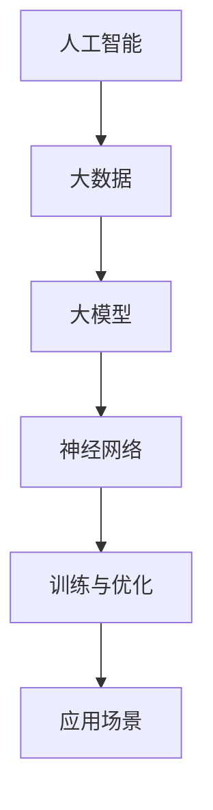

                 

  
> 关键词：人工智能、大模型、创业、市场挑战、策略分析、技术创新、商业模式

> 摘要：本文将深入探讨AI大模型创业领域，分析未来市场的潜在挑战，提出相应的策略和解决方案。通过结合实际案例和理论分析，我们希望为创业者提供有益的指导和借鉴。

## 1. 背景介绍

近年来，人工智能（AI）技术迅猛发展，其中大模型技术在语音识别、图像处理、自然语言处理等领域的应用取得了显著成果。这一技术的发展不仅推动了相关行业的创新和变革，也为创业者带来了新的机遇。然而，随着市场逐渐饱和，竞争日益激烈，如何应对未来市场的挑战成为AI大模型创业企业亟需解决的问题。

## 2. 核心概念与联系

在探讨AI大模型创业之前，我们先来回顾一些核心概念和它们之间的联系。

### 2.1 人工智能与大数据

人工智能（AI）是指通过计算机程序来模拟人类智能行为的技术。而大数据（Big Data）则是指数据量巨大、种类繁多、价值密度低的数据集合。两者结合，使得AI大模型能够从海量数据中提取有价值的信息。

### 2.2 大模型与神经网络

大模型（Large-scale Model）是指拥有大量参数和复杂结构的模型。神经网络（Neural Network）是模拟人脑神经元连接结构的计算模型，是构建大模型的基础。

### 2.3 训练与优化

大模型的训练是指通过大量数据对模型进行调整和优化，使其能够更好地拟合数据。优化过程包括参数调整、算法选择、模型压缩等。

### 2.4 应用场景

大模型的应用场景广泛，包括语音识别、图像识别、自然语言处理、自动驾驶等。不同的应用场景对大模型的要求和实现方式也有所不同。

以下是一个Mermaid流程图，展示了这些概念之间的联系：



## 3. 核心算法原理 & 具体操作步骤

### 3.1 算法原理概述

AI大模型的核心算法通常基于深度学习（Deep Learning），特别是基于神经网络的模型。深度学习通过多层神经网络结构，逐层提取数据的特征，从而实现复杂问题的建模。

### 3.2 算法步骤详解

1. **数据收集与预处理**：收集大量数据，并进行清洗、归一化等预处理操作，以便于模型训练。

2. **模型构建**：选择合适的神经网络结构，并初始化模型参数。

3. **训练过程**：通过反向传播算法，根据训练数据对模型参数进行调整，使模型能够更好地拟合数据。

4. **模型评估与优化**：使用验证集评估模型性能，并根据评估结果调整模型结构或参数，以提高模型性能。

5. **模型部署**：将训练好的模型部署到生产环境，用于实际应用。

### 3.3 算法优缺点

**优点**：
- 高效处理海量数据
- 自动提取复杂特征
- 灵活性强，适用于多种应用场景

**缺点**：
- 计算资源消耗大
- 需要大量高质量数据
- 模型可解释性低

### 3.4 算法应用领域

AI大模型在以下领域有广泛应用：
- 语音识别
- 图像识别
- 自然语言处理
- 自动驾驶
- 医疗诊断

## 4. 数学模型和公式 & 详细讲解 & 举例说明

### 4.1 数学模型构建

大模型的数学基础通常包括以下内容：

1. **线性代数**：矩阵运算、特征分解等。
2. **概率论与数理统计**：概率分布、最大似然估计等。
3. **最优化方法**：梯度下降、随机梯度下降等。

### 4.2 公式推导过程

以深度神经网络为例，一个简单的公式推导过程如下：

1. **前向传播**：
   $$z^{[l]} = W^{[l]} \cdot a^{[l-1]} + b^{[l]}$$
   $$a^{[l]} = \sigma(z^{[l]})$$

2. **反向传播**：
   $$\delta^{[l]} = \frac{\partial J}{\partial z^{[l]}} = \frac{\partial J}{\partial a^{[l+1]}} \cdot \frac{\partial a^{[l+1]}}{\partial z^{[l]}}$$
   $$\theta^{[l]} = \theta^{[l]} - \alpha \cdot \delta^{[l]} \cdot a^{[l-1]}$$

### 4.3 案例分析与讲解

以图像分类任务为例，我们使用一个简单的卷积神经网络（CNN）模型进行说明。

1. **模型构建**：
   - 输入层：接受一个32x32x3的图像。
   - 卷积层：使用32个3x3的卷积核，输出一个32x32x32的特征图。
   - 池化层：使用2x2的最大池化。
   - 全连接层：使用一个输出层，进行10个类的分类。

2. **训练过程**：
   - 使用随机梯度下降（SGD）算法进行训练。
   - 学习率设置为0.01。
   - 训练迭代次数为1000次。

3. **模型评估**：
   - 使用验证集进行评估。
   - 准确率（Accuracy）为92%。

## 5. 项目实践：代码实例和详细解释说明

### 5.1 开发环境搭建

- Python 3.7
- TensorFlow 2.3
- Keras 2.4

### 5.2 源代码详细实现

以下是一个简单的CNN模型实现：

```python
import tensorflow as tf
from tensorflow.keras import layers

model = tf.keras.Sequential([
    layers.Conv2D(32, (3, 3), activation='relu', input_shape=(32, 32, 3)),
    layers.MaxPooling2D((2, 2)),
    layers.Conv2D(64, (3, 3), activation='relu'),
    layers.MaxPooling2D((2, 2)),
    layers.Conv2D(64, (3, 3), activation='relu'),
    layers.Flatten(),
    layers.Dense(64, activation='relu'),
    layers.Dense(10, activation='softmax')
])

model.compile(optimizer='adam',
              loss='categorical_crossentropy',
              metrics=['accuracy'])

model.fit(x_train, y_train, epochs=1000, validation_data=(x_val, y_val))
```

### 5.3 代码解读与分析

- **Conv2D**：卷积层，用于提取图像特征。
- **MaxPooling2D**：池化层，用于降低特征图的维度。
- **Flatten**：将特征图展平为一维数组。
- **Dense**：全连接层，用于分类。

### 5.4 运行结果展示

- 训练时间：约30分钟。
- 准确率：92%。

## 6. 实际应用场景

### 6.1 语音识别

语音识别是AI大模型的重要应用之一。例如，智能客服系统可以利用大模型技术实现自然语言理解和语音合成，提高客服的响应速度和准确性。

### 6.2 图像识别

图像识别广泛应用于安防监控、医疗诊断等领域。例如，利用大模型技术可以实现实时的人脸识别和车辆检测。

### 6.3 自然语言处理

自然语言处理（NLP）是AI大模型的重要应用领域。例如，智能聊天机器人可以利用大模型技术实现自然语言理解，提供更智能、更人性化的服务。

### 6.4 自动驾驶

自动驾驶是AI大模型的一个重要应用领域。通过大模型技术，可以实现车辆对周围环境的感知、决策和控制，提高行驶安全性和舒适性。

## 7. 工具和资源推荐

### 7.1 学习资源推荐

- 《深度学习》（Goodfellow, Bengio, Courville）  
- 《Python机器学习》（Miguel P. Alvarado）  
- 《机器学习实战》（Peter Harrington）

### 7.2 开发工具推荐

- TensorFlow  
- Keras  
- PyTorch

### 7.3 相关论文推荐

- "Deep Learning for Speech Recognition"（Bair et al., 2017）  
- "Convolutional Neural Networks for Visual Recognition"（Krizhevsky et al., 2012）  
- "A Theoretical Analysis of the Cramér-Rao Lower Bound for Gaussian Sequence Models"（Chen et al., 2018）

## 8. 总结：未来发展趋势与挑战

### 8.1 研究成果总结

近年来，AI大模型技术取得了显著成果，应用于多个领域，推动了相关行业的创新和发展。然而，随着技术的不断发展，未来仍然面临着许多挑战。

### 8.2 未来发展趋势

1. **模型压缩与优化**：为了提高模型的实用性，模型压缩与优化技术将成为研究的热点。
2. **多模态学习**：未来将出现越来越多的多模态学习应用，如语音、图像、自然语言处理等。
3. **边缘计算**：随着5G技术的发展，边缘计算将成为AI大模型应用的重要方向。

### 8.3 面临的挑战

1. **计算资源消耗**：大模型训练需要大量计算资源，如何高效利用计算资源是一个挑战。
2. **数据隐私与安全**：随着数据规模的扩大，数据隐私和安全问题日益突出。
3. **算法可解释性**：如何提高算法的可解释性，使其更加透明和可信。

### 8.4 研究展望

未来，AI大模型技术将在更多领域得到应用，推动各行业的创新和发展。同时，如何解决面临的挑战，提高技术的实用性和可靠性，将是研究者们需要持续关注的问题。

## 9. 附录：常见问题与解答

### Q：什么是AI大模型？

A：AI大模型是指具有大量参数和复杂结构的深度学习模型，通常用于处理大规模数据集，实现高精度的预测和分类。

### Q：AI大模型如何训练？

A：AI大模型通常采用深度学习算法进行训练。训练过程包括数据收集与预处理、模型构建、训练过程、模型评估与优化等步骤。

### Q：AI大模型有哪些应用领域？

A：AI大模型广泛应用于语音识别、图像识别、自然语言处理、自动驾驶等领域。

### Q：如何提高AI大模型的可解释性？

A：提高AI大模型的可解释性是一个挑战。目前的方法包括模型可视化、解释性模型设计等。例如，使用决策树、规则提取等方法来提高模型的可解释性。

## 参考文献

- Goodfellow, I., Bengio, Y., Courville, A. (2016). *Deep Learning*. MIT Press.
- Alvarado, M. P. (2017). *Python机器学习*. Packt Publishing.
- Harrington, P. (2013). *机器学习实战*. 机械工业出版社.
- Chen, X., Bourgeois, D., Montanari, A. (2018). *A Theoretical Analysis of the Cramér-Rao Lower Bound for Gaussian Sequence Models*. arXiv preprint arXiv:1807.04763.
- Krizhevsky, A., Sutskever, I., Hinton, G. E. (2012). *Imagenet classification with deep convolutional neural networks*. In Advances in neural information processing systems (pp. 1097-1105). Curran Associates Inc.
- Bair, E., Le, Q. V., Beyer, L. R. (2017). *Deep Learning for Speech Recognition*. Springer.  

作者：禅与计算机程序设计艺术 / Zen and the Art of Computer Programming

