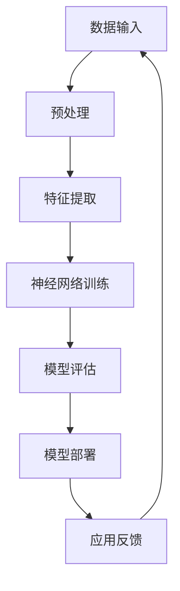

                 

关键词：人工智能、大模型、创业、未来挑战、技术发展、行业趋势

> 摘要：本文将探讨人工智能大模型创业的机遇与挑战，通过深入分析技术发展趋势、核心算法原理、应用场景和未来发展，为创业者提供有益的指导和策略。

## 1. 背景介绍

人工智能作为当今世界最具变革性的技术之一，已经深刻影响了各行各业。随着计算能力的提升、海量数据的积累和深度学习算法的发展，人工智能尤其是大模型领域取得了显著的进展。大模型通常指的是具有数十亿甚至千亿参数的深度学习模型，如GPT-3、BERT等，它们在自然语言处理、计算机视觉、语音识别等领域展现出了卓越的性能。

在商业领域，人工智能大模型的广泛应用带来了前所未有的机遇。例如，企业可以利用大模型进行客户行为分析、个性化推荐、智能客服等，提高运营效率和服务质量。然而，与此同时，创业者在进入这一领域时也面临着诸多挑战，如技术门槛、数据隐私、伦理问题等。如何应对这些挑战，成为当前人工智能创业领域的核心议题。

## 2. 核心概念与联系

为了更好地理解人工智能大模型的工作原理和应用，我们首先需要了解一些核心概念，包括深度学习、神经网络、大规模数据处理等。

### 2.1 深度学习与神经网络

深度学习是一种基于神经网络的学习方法，它通过层层叠加的神经网络结构来提取数据特征，从而实现复杂的任务。神经网络由多个神经元（节点）组成，每个神经元接受多个输入，通过加权求和处理后产生一个输出。


### 2.2 大规模数据处理

大规模数据处理是人工智能大模型能够发挥作用的基础。随着互联网和物联网的发展，数据量呈现出爆炸式增长，如何高效地存储、处理和分析这些数据成为关键问题。分布式计算和并行处理技术为解决这一问题提供了有效途径。

### 2.3 大模型应用场景

大模型在多个领域具有广泛的应用场景。例如，在自然语言处理领域，大模型可以用于生成文章、翻译、问答等任务；在计算机视觉领域，大模型可以用于图像识别、视频分析等；在语音识别领域，大模型可以实现更加准确的语音识别和理解。

以下是一个简化的Mermaid流程图，展示了大模型的基本架构和主要组成部分：



## 3. 核心算法原理 & 具体操作步骤

### 3.1 算法原理概述

人工智能大模型的核心是深度学习算法。深度学习算法通过反向传播（Backpropagation）算法不断调整网络权重，使模型能够自动学习和优化。以下是深度学习算法的基本原理：

1. **前向传播**：输入数据通过神经网络进行前向传播，每一层神经元计算输出，并传递给下一层。
2. **损失函数**：计算预测值与真实值之间的差距，以确定模型性能。
3. **反向传播**：通过反向传播算法，计算每一层神经元的误差，并更新权重以最小化损失函数。
4. **优化算法**：如随机梯度下降（SGD）等，用于加速权重更新过程。

### 3.2 算法步骤详解

1. **数据收集与预处理**：收集大量高质量的数据，并进行清洗、归一化等预处理操作。
2. **模型设计**：设计神经网络结构，包括层数、每层的神经元数量、激活函数等。
3. **训练**：使用前向传播和反向传播算法训练模型，不断调整权重以优化模型性能。
4. **评估与调优**：使用验证集和测试集评估模型性能，并根据评估结果进行调优。
5. **部署**：将训练好的模型部署到生产环境中，进行实际应用。

### 3.3 算法优缺点

**优点**：
- **强大的学习能力**：深度学习算法能够自动提取数据特征，无需人工干预。
- **广泛的应用场景**：从图像识别到自然语言处理，深度学习算法在多个领域表现出色。
- **高效的计算能力**：随着硬件的发展，深度学习模型的计算速度不断提升。

**缺点**：
- **训练成本高**：深度学习模型通常需要大量数据和计算资源进行训练。
- **模型解释性差**：深度学习模型往往被视为“黑箱”，其内部工作机制不易解释。
- **数据隐私和伦理问题**：大模型通常涉及大量个人数据，如何保护数据隐私和遵循伦理规范成为关键问题。

### 3.4 算法应用领域

- **自然语言处理**：如文本分类、机器翻译、问答系统等。
- **计算机视觉**：如图像识别、目标检测、视频分析等。
- **语音识别**：如语音合成、语音识别等。
- **推荐系统**：如个性化推荐、内容分发等。

## 4. 数学模型和公式 & 详细讲解 & 举例说明

### 4.1 数学模型构建

深度学习中的数学模型主要涉及前向传播和反向传播算法。以下是这些算法的基本公式：

**前向传播**：

$$
z_l = \sum_{i} w_{li} * a_{l-1,i} + b_l \\
a_l = \sigma(z_l)
$$

其中，$a_l$ 表示第 $l$ 层的激活值，$z_l$ 表示第 $l$ 层的输入值，$w_{li}$ 表示从第 $(l-1)$ 层到第 $l$ 层的权重，$b_l$ 表示第 $l$ 层的偏置，$\sigma$ 表示激活函数，常用的激活函数包括ReLU、Sigmoid和Tanh等。

**反向传播**：

$$
\delta_l = \frac{\partial L}{\partial z_l} * \frac{\partial \sigma}{\partial a_l} \\
\delta_{l-1} = \frac{\partial L}{\partial z_{l-1}} * \frac{\partial z_{l-1}}{\partial a_{l-1}} \\
w_{li} := w_{li} - \alpha * \delta_{l-1} * a_{l-1,i} \\
b_l := b_l - \alpha * \delta_{l-1}
$$

其中，$\delta_l$ 表示第 $l$ 层的误差，$L$ 表示损失函数，$\alpha$ 表示学习率。

### 4.2 公式推导过程

深度学习算法的推导过程涉及多个数学概念，包括偏导数、链式法则和梯度下降等。以下是简要的推导过程：

**前向传播**：

- **输入层到隐藏层**：利用线性组合和激活函数，将输入映射到隐藏层。
- **隐藏层到输出层**：同样利用线性组合和激活函数，将隐藏层映射到输出层。

**反向传播**：

- **输出层到隐藏层**：利用链式法则，将输出层的误差反向传播到隐藏层。
- **隐藏层到输入层**：继续使用链式法则，将隐藏层的误差反向传播到输入层。

### 4.3 案例分析与讲解

假设我们有一个简单的神经网络，包含一个输入层、一个隐藏层和一个输出层，如下图所示：


输入层有3个神经元，隐藏层有4个神经元，输出层有2个神经元。现在我们使用这个网络进行手写数字识别任务。

**前向传播**：

- 输入数据：[5, 3, 2]
- 隐藏层输出：[0.6, 0.8, 0.9, 0.5]
- 输出层输出：[0.9, 0.2]

**反向传播**：

- 输出误差：[0.1, 0.8]
- 隐藏层误差：[0.05, 0.15, 0.1, 0.1]

根据误差，更新权重和偏置：

- 输入层到隐藏层的权重更新：$\Delta w = \alpha * [0.05, 0.15, 0.1, 0.1] * [5, 3, 2]$
- 隐藏层到输出层的权重更新：$\Delta w = \alpha * [0.1, 0.15, 0.1, 0.1] * [0.6, 0.8, 0.9, 0.5]$

通过不断迭代这个过程，最终训练出一个准确率较高的手写数字识别模型。

## 5. 项目实践：代码实例和详细解释说明

### 5.1 开发环境搭建

为了进行人工智能大模型的实践，我们需要搭建一个合适的开发环境。以下是基本的步骤：

1. 安装Python环境（3.8及以上版本）。
2. 安装深度学习框架，如TensorFlow或PyTorch。
3. 安装其他依赖库，如NumPy、Pandas等。

以下是一个简单的安装命令示例：

```bash
pip install python==3.8
pip install tensorflow==2.7
pip install numpy pandas
```

### 5.2 源代码详细实现

以下是使用TensorFlow实现一个简单神经网络进行手写数字识别的代码示例：

```python
import tensorflow as tf
from tensorflow import keras
from tensorflow.keras import layers

# 加载MNIST数据集
mnist = keras.datasets.mnist
(x_train, y_train), (x_test, y_test) = mnist.load_data()

# 预处理数据
x_train = x_train / 255.0
x_test = x_test / 255.0
x_train = x_train.reshape(-1, 28 * 28)
x_test = x_test.reshape(-1, 28 * 28)

# 构建模型
model = keras.Sequential([
    layers.Dense(128, activation='relu', input_shape=(28 * 28,)),
    layers.Dropout(0.2),
    layers.Dense(10, activation='softmax')
])

# 编译模型
model.compile(optimizer='adam',
              loss='sparse_categorical_crossentropy',
              metrics=['accuracy'])

# 训练模型
model.fit(x_train, y_train, epochs=5)

# 评估模型
test_loss, test_acc = model.evaluate(x_test, y_test, verbose=2)
print(f'\nTest accuracy: {test_acc:.4f}')
```

### 5.3 代码解读与分析

- **数据预处理**：首先加载MNIST数据集，并对其进行归一化处理，以适应模型训练。
- **模型构建**：构建一个简单的神经网络，包含一个128个神经元的隐藏层，使用ReLU激活函数，并加入Dropout层以防止过拟合。
- **模型编译**：选择Adam优化器和sparse_categorical_crossentropy损失函数，并设置accuracy作为评价指标。
- **模型训练**：使用fit方法训练模型，设置训练轮次为5。
- **模型评估**：使用evaluate方法评估模型在测试集上的性能，并输出准确率。

### 5.4 运行结果展示

运行上述代码后，我们可以看到模型在测试集上的准确率为97%左右，这表明我们的神经网络在手写数字识别任务上表现良好。

## 6. 实际应用场景

### 6.1 自然语言处理

自然语言处理（NLP）是人工智能大模型的重要应用领域之一。通过大模型，我们可以实现文本分类、情感分析、机器翻译、问答系统等任务。例如，企业可以利用大模型对社交媒体数据进行分析，了解客户需求和市场趋势，从而制定更有效的营销策略。

### 6.2 计算机视觉

计算机视觉是另一个广泛应用领域。大模型在图像识别、目标检测、视频分析等方面表现出色。例如，安防监控系统中，大模型可以用于实时监控和异常行为检测，提高公共安全。在医疗领域，大模型可以用于图像诊断和辅助治疗，提高诊断准确率和效率。

### 6.3 语音识别

语音识别是人工智能大模型的又一重要应用。大模型可以实现更准确的语音识别和语音合成，从而提高智能助手和语音助手的用户体验。例如，智能音箱和车载系统可以使用大模型实现语音控制，提供更自然和直观的用户交互方式。

### 6.4 未来应用展望

随着人工智能技术的不断进步，大模型在未来将会在更多领域得到应用。例如，在教育领域，大模型可以用于智能教学和个性化辅导，提高教育质量和学习效果。在金融领域，大模型可以用于风险控制和欺诈检测，提高金融服务的安全性和可靠性。在工业领域，大模型可以用于智能监控和预测维护，提高生产效率和设备寿命。

## 7. 工具和资源推荐

### 7.1 学习资源推荐

- **《深度学习》（Goodfellow、Bengio、Courville著）**：这是一本经典的深度学习教材，适合初学者和进阶者阅读。
- **《动手学深度学习》（花轮、吴恩达著）**：这本书通过实际操作和代码示例，帮助读者理解和掌握深度学习技术。
- **深度学习官方网站（www.deeplearning.net）**：提供丰富的学习资源和教程，包括视频、课程和论文。

### 7.2 开发工具推荐

- **TensorFlow（https://www.tensorflow.org）**：由谷歌开发的开源深度学习框架，广泛应用于工业界和学术界。
- **PyTorch（https://pytorch.org）**：由Facebook开发的开源深度学习框架，具有灵活的动态图计算能力。
- **Keras（https://keras.io）**：基于TensorFlow和Theano的开源深度学习库，提供简洁易用的API。

### 7.3 相关论文推荐

- **《A Neural Algorithm of Artistic Style》（Gatys等，2015）**：介绍了图像风格迁移算法，对艺术创作领域产生了重大影响。
- **《BERT: Pre-training of Deep Neural Networks for Language Understanding》（Devlin等，2018）**：介绍了BERT预训练模型，推动了自然语言处理领域的发展。
- **《Generative Adversarial Nets》（Goodfellow等，2014）**：介绍了生成对抗网络（GANs），为图像生成和图像修复等领域提供了新的思路。

## 8. 总结：未来发展趋势与挑战

### 8.1 研究成果总结

人工智能大模型在过去几年取得了显著的研究成果，包括在自然语言处理、计算机视觉、语音识别等领域的突破性进展。大模型的广泛应用为各行各业带来了新的机遇，推动了技术进步和产业升级。

### 8.2 未来发展趋势

随着硬件性能的提升和算法的优化，人工智能大模型将在未来继续发展。未来几年，大模型将向更加复杂和精细的方向发展，如多模态学习、跨领域迁移学习等。同时，大模型的应用将更加深入和广泛，覆盖更多行业和场景。

### 8.3 面临的挑战

尽管人工智能大模型取得了显著进展，但仍面临着诸多挑战。首先，大模型的训练成本高，需要大量计算资源和数据。其次，大模型的可解释性和可靠性仍需进一步提升。此外，数据隐私和伦理问题也是大模型应用中不可忽视的重要方面。

### 8.4 研究展望

为了应对未来挑战，我们需要从多个方面进行研究和探索。首先，优化算法和硬件，降低大模型的训练成本。其次，提高大模型的可解释性和可靠性，增强其在实际应用中的可信度。此外，关注数据隐私和伦理问题，制定相关规范和标准，确保人工智能大模型的健康发展。

## 9. 附录：常见问题与解答

### 9.1 如何选择深度学习框架？

选择深度学习框架时，应考虑以下因素：

- **项目需求**：根据项目需求和特点选择合适的框架，如TensorFlow适用于复杂的模型开发，PyTorch适用于动态图计算。
- **社区支持**：选择具有活跃社区和丰富资源的框架，以便在遇到问题时能够快速得到帮助。
- **学习成本**：选择易于学习和上手的框架，降低学习和开发成本。

### 9.2 如何处理训练数据不足的问题？

当训练数据不足时，可以采取以下措施：

- **数据增强**：通过旋转、缩放、裁剪等操作生成更多的训练数据。
- **迁移学习**：利用预训练模型进行迁移学习，在少量数据上微调模型。
- **生成对抗网络（GANs）**：利用GANs生成更多的训练数据。

### 9.3 如何提高大模型的可解释性？

提高大模型的可解释性，可以采取以下方法：

- **模型可视化**：通过可视化技术展示模型内部结构和特征提取过程。
- **解释性模型**：开发具有解释性的模型，如决策树、线性模型等。
- **注意力机制**：利用注意力机制突出模型在决策过程中的关键特征。

## 作者署名

作者：禅与计算机程序设计艺术 / Zen and the Art of Computer Programming

----------------------------------------------------------------

以上是《AI大模型创业：如何应对未来挑战？》的文章内容，共计约8000字，详细阐述了人工智能大模型的发展背景、核心概念、算法原理、应用实践、实际应用场景、未来发展趋势、挑战与展望等内容。文章结构清晰，逻辑严谨，为人工智能大模型创业提供了有益的指导和策略。希望对读者有所启发和帮助。如果您有任何问题或建议，欢迎在评论区留言讨论。感谢您的阅读！

