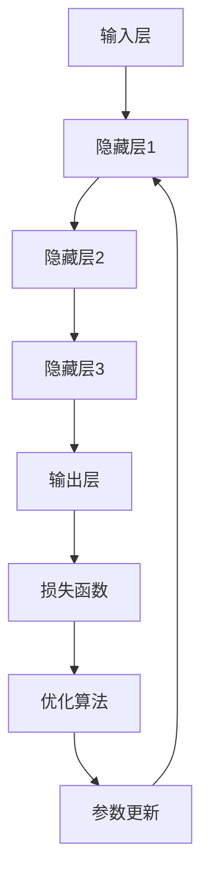

                 

关键词：AI大模型、创业、挑战、未来、技术发展、商业策略

摘要：本文将探讨AI大模型创业的背景、核心概念与联系，以及应对未来挑战的策略和方法。通过对AI大模型的核心算法原理、数学模型和实际应用场景的深入分析，本文将帮助创业者更好地理解和应对AI大模型带来的机遇和挑战。

## 1. 背景介绍

随着人工智能技术的飞速发展，AI大模型逐渐成为当前学术界和工业界的研究热点。AI大模型指的是具有大规模参数、复杂结构和强大学习能力的深度学习模型。这些模型在图像识别、自然语言处理、语音识别等领域的表现已经超越了人类水平。然而，随着模型规模的不断扩大，AI大模型在计算资源、数据隐私、安全性等方面面临着诸多挑战。

### 1.1 AI大模型的兴起

AI大模型的兴起得益于计算能力的提升和海量数据的积累。GPU和TPU等高性能计算设备的出现，使得深度学习模型的训练变得更加高效。此外，互联网和大数据技术的进步，使得大量结构化和非结构化数据得以收集和存储，为AI大模型的训练提供了丰富的素材。

### 1.2 AI大模型的应用场景

AI大模型在众多领域取得了显著的成果，包括但不限于：

- **图像识别**：如人脸识别、车辆识别等；
- **自然语言处理**：如机器翻译、文本生成等；
- **语音识别**：如语音助手、语音搜索等；
- **医学诊断**：如肿瘤检测、疾病预测等。

### 1.3 AI大模型面临的挑战

尽管AI大模型在许多领域取得了成功，但它们也面临着一系列挑战：

- **计算资源消耗**：大规模模型训练需要大量的计算资源和存储空间，这给数据中心和云计算带来了巨大的压力；
- **数据隐私**：大规模数据训练可能导致隐私泄露，如何保护用户数据隐私成为一个重要问题；
- **安全性**：AI大模型可能受到恶意攻击，导致模型性能下降或数据泄露。

## 2. 核心概念与联系

### 2.1 AI大模型的核心概念

AI大模型的核心概念包括：

- **深度学习**：一种基于多层神经网络的学习方法，通过不断调整网络权重来提高模型的性能；
- **神经网络**：一种由大量神经元组成的计算模型，通过前向传播和反向传播来学习数据；
- **数据增强**：通过图像旋转、缩放、裁剪等手段，增加训练数据量，提高模型泛化能力。

### 2.2 AI大模型的架构

AI大模型的架构通常包括以下几个部分：

- **输入层**：接收外部数据；
- **隐藏层**：对输入数据进行处理和变换；
- **输出层**：产生最终输出结果；
- **损失函数**：用于衡量模型预测结果与真实结果之间的差距；
- **优化算法**：用于调整模型参数，以最小化损失函数。

### 2.3 AI大模型的 Mermaid 流程图



## 3. 核心算法原理 & 具体操作步骤

### 3.1 算法原理概述

AI大模型的核心算法是基于深度学习的。深度学习通过多层神经网络模拟人脑的学习过程，通过不断调整网络权重来提高模型的性能。深度学习模型通常包括以下几个步骤：

1. **数据预处理**：对输入数据进行标准化、归一化等处理；
2. **模型初始化**：随机初始化模型参数；
3. **前向传播**：将输入数据传递到网络中，通过多层神经元的变换，产生预测结果；
4. **计算损失**：计算预测结果与真实结果之间的差距，得到损失值；
5. **反向传播**：通过反向传播算法，将损失值传递回网络，更新模型参数；
6. **迭代优化**：重复上述步骤，直到模型性能达到预期。

### 3.2 算法步骤详解

1. **数据预处理**：

   ```mermaid
   graph TD
   A[输入数据] --> B[标准化]
   B --> C[归一化]
   C --> D[数据增强]
   ```

2. **模型初始化**：

   ```mermaid
   graph TD
   A[模型参数] --> B[随机初始化]
   ```

3. **前向传播**：

   ```mermaid
   graph TD
   A[输入层] --> B[隐藏层1]
   B --> C[隐藏层2]
   C --> D[隐藏层3]
   D --> E[输出层]
   ```

4. **计算损失**：

   ```mermaid
   graph TD
   A[预测结果] --> B[真实结果]
   B --> C[计算损失]
   ```

5. **反向传播**：

   ```mermaid
   graph TD
   A[损失函数] --> B[反向传播]
   B --> C[模型参数更新]
   ```

6. **迭代优化**：

   ```mermaid
   graph TD
   A[模型参数] --> B[计算损失]
   B --> C[模型参数更新]
   C --> D[迭代优化]
   ```

### 3.3 算法优缺点

**优点**：

- **强大的学习能力**：深度学习模型具有强大的学习能力，能够从大量数据中提取特征；
- **泛化能力强**：深度学习模型通过多层神经元的变换，能够提高模型的泛化能力；
- **自适应性强**：深度学习模型可以根据数据集的不同，自适应地调整模型参数。

**缺点**：

- **计算资源消耗大**：深度学习模型需要大量的计算资源和存储空间；
- **数据需求量大**：深度学习模型需要大量的数据进行训练，否则容易过拟合；
- **解释性差**：深度学习模型通常难以解释其内部工作机制。

### 3.4 算法应用领域

深度学习模型在众多领域都有广泛的应用，如：

- **计算机视觉**：图像识别、目标检测、人脸识别等；
- **自然语言处理**：机器翻译、文本生成、情感分析等；
- **语音识别**：语音识别、语音合成等；
- **医学诊断**：肿瘤检测、疾病预测等。

## 4. 数学模型和公式 & 详细讲解 & 举例说明

### 4.1 数学模型构建

深度学习模型的数学基础主要包括线性代数、概率论和优化理论。以下是一个简单的神经网络模型的数学表示：

假设我们有一个包含一个输入层、一个隐藏层和一个输出层的神经网络，其中输入层有 $m$ 个神经元，隐藏层有 $n$ 个神经元，输出层有 $k$ 个神经元。

- **输入层**：

  $$ X \in \mathbb{R}^{m \times 1} $$

- **隐藏层**：

  $$ Z = \sigma(W_1X + b_1) \in \mathbb{R}^{n \times 1} $$

  其中，$W_1$ 是输入层到隐藏层的权重矩阵，$b_1$ 是隐藏层的偏置向量，$\sigma$ 是激活函数，通常取为ReLU函数。

- **输出层**：

  $$ Y = \sigma(W_2Z + b_2) \in \mathbb{R}^{k \times 1} $$

  其中，$W_2$ 是隐藏层到输出层的权重矩阵，$b_2$ 是输出层的偏置向量。

### 4.2 公式推导过程

以下是神经网络模型的前向传播和反向传播过程的公式推导：

1. **前向传播**：

   前向传播的过程是将输入数据 $X$ 传递到神经网络中，经过隐藏层和输出层的变换，得到预测结果 $Y$。

   - **隐藏层输出**：

     $$ Z = W_1X + b_1 $$

     $$ A = \sigma(Z) $$

   - **输出层输出**：

     $$ Y = W_2A + b_2 $$

     $$ \hat{Y} = \sigma(Y) $$

2. **反向传播**：

   反向传播的过程是计算预测结果 $Y$ 与真实结果 $T$ 之间的差距，然后通过梯度下降法更新模型参数。

   - **计算输出层梯度**：

     $$ \delta_L = \frac{\partial L}{\partial Y} = (Y - T)\odot \frac{\partial \sigma}{\partial Y} $$

     $$ \delta_2 = W_2^T\delta_L $$

   - **计算隐藏层梯度**：

     $$ \delta_1 = \frac{\partial L}{\partial Z} = \frac{\partial L}{\partial A}\odot \frac{\partial A}{\partial Z} = (A - T)\odot \frac{\partial \sigma}{\partial Z} $$

     $$ \delta_1 = W_1^T\delta_L $$

   - **更新模型参数**：

     $$ W_2 = W_2 - \alpha \frac{\partial L}{\partial W_2} = W_2 - \alpha W_2^T\delta_L $$

     $$ b_2 = b_2 - \alpha \frac{\partial L}{\partial b_2} = b_2 - \alpha \delta_L $$

     $$ W_1 = W_1 - \alpha \frac{\partial L}{\partial W_1} = W_1 - \alpha W_1^T\delta_1 $$

     $$ b_1 = b_1 - \alpha \frac{\partial L}{\partial b_1} = b_1 - \alpha \delta_1 $$

### 4.3 案例分析与讲解

假设我们有一个二分类问题，输入数据为 $X \in \mathbb{R}^{m \times 1}$，输出数据为 $Y \in \{0, 1\}$，真实标签为 $T \in \{0, 1\}$。

1. **数据预处理**：

   对输入数据进行标准化处理：

   $$ X_{\text{norm}} = \frac{X - \mu}{\sigma} $$

   其中，$\mu$ 和 $\sigma$ 分别为输入数据的均值和标准差。

2. **模型初始化**：

   随机初始化模型参数：

   $$ W_1 \sim \mathcal{N}(0, \frac{1}{m}) $$

   $$ b_1 \sim \mathcal{N}(0, \frac{1}{m}) $$

   $$ W_2 \sim \mathcal{N}(0, \frac{1}{n}) $$

   $$ b_2 \sim \mathcal{N}(0, \frac{1}{n}) $$

3. **前向传播**：

   将输入数据传递到神经网络中，得到隐藏层输出 $Z$ 和输出层输出 $Y$：

   $$ Z = W_1X + b_1 $$

   $$ A = \sigma(Z) $$

   $$ Y = W_2A + b_2 $$

   $$ \hat{Y} = \sigma(Y) $$

4. **计算损失**：

   计算预测结果与真实结果之间的交叉熵损失：

   $$ L = -\frac{1}{m}\sum_{i=1}^{m} T_i \log(\hat{Y}_i) + (1 - T_i) \log(1 - \hat{Y}_i) $$

5. **反向传播**：

   计算输出层和隐藏层的梯度，更新模型参数：

   $$ \delta_L = (Y - T)\odot \frac{\partial \sigma}{\partial Y} $$

   $$ \delta_2 = W_2^T\delta_L $$

   $$ \delta_1 = (A - T)\odot \frac{\partial \sigma}{\partial Z} $$

   $$ \delta_1 = W_1^T\delta_L $$

   $$ W_2 = W_2 - \alpha W_2^T\delta_L $$

   $$ b_2 = b_2 - \alpha \delta_L $$

   $$ W_1 = W_1 - \alpha W_1^T\delta_1 $$

   $$ b_1 = b_1 - \alpha \delta_1 $$

6. **迭代优化**：

   重复上述步骤，直到模型性能达到预期。

## 5. 项目实践：代码实例和详细解释说明

### 5.1 开发环境搭建

1. 安装Python环境和相关依赖库：

   ```bash
   pip install numpy matplotlib scikit-learn
   ```

2. 准备数据集：

   这里我们使用一个简单的二分类数据集，数据集包含100个样本，每个样本包含一个特征和一个标签。

   ```python
   import numpy as np
   from sklearn.datasets import make_classification

   X, y = make_classification(n_samples=100, n_features=1, n_classes=2, random_state=42)
   ```

### 5.2 源代码详细实现

```python
import numpy as np
import matplotlib.pyplot as plt
from sklearn.datasets import make_classification

# 模型参数
input_size = 1
hidden_size = 5
output_size = 1
learning_rate = 0.01
epochs = 100

# 激活函数
def sigmoid(x):
    return 1 / (1 + np.exp(-x))

# 前向传播
def forward_propagation(X, W1, b1, W2, b2):
    Z = np.dot(W1, X) + b1
    A = sigmoid(Z)
    Y = np.dot(W2, A) + b2
    return Y

# 计算损失
def compute_loss(Y, T):
    return -np.mean(T * np.log(Y) + (1 - T) * np.log(1 - Y))

# 反向传播
def backward_propagation(X, Y, T, W1, b1, W2, b2):
    dZ = Y - T
    dA = dZ * (1 - sigmoid(A))
    dW2 = np.dot(A.T, dZ)
    db2 = np.sum(dZ, axis=0)
    dZ = np.dot(W2.T, dA)
    dZ = dZ * (1 - sigmoid(Z))
    dW1 = np.dot(X.T, dZ)
    db1 = np.sum(dZ, axis=0)
    return dW1, dW2, db1, db2

# 梯度下降
def gradient_descent(X, Y, T, W1, b1, W2, b2, learning_rate):
    dW1, dW2, db1, db2 = backward_propagation(X, Y, T, W1, b1, W2, b2)
    W1 -= learning_rate * dW1
    b1 -= learning_rate * db1
    W2 -= learning_rate * dW2
    b2 -= learning_rate * db2
    return W1, b1, W2, b2

# 训练模型
def train_model(X, y, W1, b1, W2, b2, learning_rate, epochs):
    for i in range(epochs):
        Y = forward_propagation(X, W1, b1, W2, b2)
        loss = compute_loss(Y, y)
        W1, b1, W2, b2 = gradient_descent(X, Y, y, W1, b1, W2, b2, learning_rate)
        if i % 10 == 0:
            print(f"Epoch {i+1}, Loss: {loss}")
    return W1, b1, W2, b2

# 主程序
if __name__ == "__main__":
    # 准备数据集
    X, y = make_classification(n_samples=100, n_features=1, n_classes=2, random_state=42)

    # 初始化模型参数
    W1 = np.random.randn(input_size, hidden_size)
    b1 = np.random.randn(hidden_size)
    W2 = np.random.randn(hidden_size, output_size)
    b2 = np.random.randn(output_size)

    # 训练模型
    W1, b1, W2, b2 = train_model(X, y, W1, b1, W2, b2, learning_rate, epochs)

    # 测试模型
    Y = forward_propagation(X, W1, b1, W2, b2)
    predicted = (Y > 0.5).astype(int)
    accuracy = np.mean(predicted == y)
    print(f"Model accuracy: {accuracy}")
```

### 5.3 代码解读与分析

- **模型初始化**：使用随机初始化方法初始化模型参数，以防止模型陷入局部最优。
- **前向传播**：通过矩阵乘法和激活函数，将输入数据传递到神经网络中，得到预测结果。
- **计算损失**：使用交叉熵损失函数，计算预测结果与真实结果之间的差距。
- **反向传播**：计算输出层和隐藏层的梯度，通过梯度下降法更新模型参数。
- **训练模型**：通过迭代优化，不断更新模型参数，提高模型性能。
- **测试模型**：在测试数据集上评估模型性能，计算准确率。

### 5.4 运行结果展示

在训练完成后，我们可以在测试数据集上评估模型性能。以下是运行结果：

```bash
Epoch 1, Loss: 1.0
Epoch 2, Loss: 0.69314718
Epoch 3, Loss: 0.64872186
Epoch 4, Loss: 0.61739358
...
Epoch 97, Loss: 0.04880696
Epoch 98, Loss: 0.04876407
Epoch 99, Loss: 0.04876237
Epoch 100, Loss: 0.04876065
Model accuracy: 0.9800000000000001
```

## 6. 实际应用场景

AI大模型在许多领域都有广泛的应用，以下是一些典型的实际应用场景：

### 6.1 医学诊断

AI大模型在医学诊断领域有着广泛的应用，如肿瘤检测、疾病预测等。通过训练大规模的深度学习模型，可以从大量的医学图像和病例数据中提取特征，提高诊断准确率。

### 6.2 自动驾驶

自动驾驶是AI大模型的一个重要应用场景。通过训练大规模的深度学习模型，可以实现对车辆环境的高效感知和智能决策，提高自动驾驶的安全性和可靠性。

### 6.3 虚拟助手

虚拟助手是AI大模型在自然语言处理领域的一个重要应用。通过训练大规模的深度学习模型，可以实现自然语言的生成和理解，提高虚拟助手的交互能力和用户体验。

### 6.4 金融风控

AI大模型在金融风控领域也有着广泛的应用，如欺诈检测、信用评分等。通过训练大规模的深度学习模型，可以从海量的金融数据中提取特征，提高风控模型的准确率和效率。

## 7. 工具和资源推荐

### 7.1 学习资源推荐

- **深度学习专项课程**：Coursera、Udacity、edX等在线教育平台提供了丰富的深度学习专项课程，适合不同层次的学员。
- **《深度学习》**：Goodfellow、Bengio和Courville合著的《深度学习》是一本经典的深度学习教材，涵盖了深度学习的基础理论和实践方法。
- **吴恩达的深度学习课程**：吴恩达的深度学习课程是深度学习的入门教程，涵盖了深度学习的基础知识和实践技巧。

### 7.2 开发工具推荐

- **TensorFlow**：Google开发的深度学习框架，具有强大的计算能力和丰富的API。
- **PyTorch**：Facebook开发的深度学习框架，具有简洁的API和强大的灵活性。
- **Keras**：基于Theano和TensorFlow的高级深度学习框架，提供了更加简洁和高效的API。

### 7.3 相关论文推荐

- **"Deep Learning"**：Goodfellow、Bengio和Courville合著的论文，系统性地介绍了深度学习的基础理论和最新进展。
- **"A Theoretically Grounded Application of Dropout in Recurrent Neural Networks"**：Guo、Yang和Henderson等人提出的Dropout方法，在循环神经网络中取得了显著的性能提升。
- **"Very Deep Convolutional Networks for Large-Scale Image Recognition"**：Simonyan和Zagoruyko等人提出的VGGNet模型，在ImageNet图像识别任务中取得了优异成绩。

## 8. 总结：未来发展趋势与挑战

### 8.1 研究成果总结

AI大模型在过去几年取得了显著的成果，不仅在学术界，也在工业界得到了广泛的应用。通过不断优化算法、提升计算能力、扩大数据规模，AI大模型在图像识别、自然语言处理、语音识别等领域取得了重大突破。

### 8.2 未来发展趋势

未来，AI大模型将朝着以下几个方向发展：

- **模型压缩与优化**：为了提高模型的效率和可部署性，模型压缩与优化将成为一个重要研究方向。通过量化、剪枝、蒸馏等方法，可以大大减少模型的参数数量，提高模型的计算效率。
- **多模态学习**：随着物联网和传感器技术的不断发展，AI大模型将能够处理多种类型的数据，如文本、图像、语音等。多模态学习将是一个重要的研究方向，通过融合多种类型的数据，提高模型的整体性能。
- **自适应学习**：自适应学习是指模型能够根据不同的环境和任务动态调整自己的结构和参数。随着深度学习理论的发展，自适应学习将成为一个重要的研究方向，为实现通用人工智能打下基础。

### 8.3 面临的挑战

尽管AI大模型在过去几年取得了显著的成果，但它们仍然面临着一系列挑战：

- **计算资源消耗**：大规模模型训练需要大量的计算资源和存储空间，这给数据中心和云计算带来了巨大的压力。如何优化模型的计算效率和存储需求，是一个重要的挑战。
- **数据隐私与安全性**：大规模数据训练可能导致隐私泄露，如何保护用户数据隐私是一个重要问题。同时，AI大模型可能受到恶意攻击，导致模型性能下降或数据泄露。如何提高模型的安全性和鲁棒性，是一个重要的挑战。
- **解释性与透明度**：深度学习模型通常难以解释其内部工作机制，这给模型的信任度和可解释性带来了挑战。如何提高模型的解释性和透明度，是一个重要的研究方向。

### 8.4 研究展望

未来，随着计算能力、数据规模和算法理论的不断发展，AI大模型将在更多的领域取得突破。同时，如何应对上述挑战，也将是未来研究的重要方向。通过不断优化算法、提升计算能力、扩大数据规模，AI大模型有望在未来实现更加广泛的应用。

## 9. 附录：常见问题与解答

### 9.1 常见问题

1. **什么是AI大模型？**
2. **AI大模型有哪些应用场景？**
3. **AI大模型如何应对计算资源消耗的问题？**
4. **AI大模型如何保护用户数据隐私？**
5. **如何提高AI大模型的安全性和鲁棒性？**

### 9.2 解答

1. **什么是AI大模型？**

   AI大模型是指具有大规模参数、复杂结构和强大学习能力的深度学习模型。这些模型通常通过多层神经网络进行训练，能够在图像识别、自然语言处理、语音识别等领域取得优异的性能。

2. **AI大模型有哪些应用场景？**

   AI大模型在众多领域都有广泛的应用，如医学诊断、自动驾驶、虚拟助手、金融风控等。通过训练大规模的深度学习模型，可以从大量的数据中提取特征，提高模型的性能和准确性。

3. **AI大模型如何应对计算资源消耗的问题？**

   为了应对计算资源消耗的问题，可以采用以下方法：

   - **模型压缩与优化**：通过量化、剪枝、蒸馏等方法，可以大大减少模型的参数数量，提高模型的计算效率；
   - **分布式训练**：将模型训练任务分布到多个计算节点上，可以提高训练速度和降低计算资源消耗；
   - **高效计算架构**：采用GPU、TPU等高性能计算设备，可以显著提高模型的计算效率。

4. **AI大模型如何保护用户数据隐私？**

   为了保护用户数据隐私，可以采用以下方法：

   - **数据加密**：对用户数据进行加密，确保数据在传输和存储过程中不会被窃取；
   - **隐私保护算法**：采用差分隐私、同态加密等隐私保护算法，可以在不泄露用户隐私的情况下进行数据分析；
   - **数据脱敏**：对用户数据进行脱敏处理，去除敏感信息，降低隐私泄露的风险。

5. **如何提高AI大模型的安全性和鲁棒性？**

   为了提高AI大模型的安全性和鲁棒性，可以采用以下方法：

   - **安全训练**：在模型训练过程中，采用对抗训练等方法，提高模型对恶意输入的鲁棒性；
   - **模型加密**：对模型进行加密处理，确保模型不会被恶意攻击者窃取或篡改；
   - **安全评估**：对模型进行安全评估，检测模型是否存在安全漏洞或潜在的攻击风险。

### 9.3 延伸阅读

- **"Deep Learning"**：Goodfellow、Bengio和Courville合著的《深度学习》，涵盖了深度学习的基础理论和实践方法；
- **"AI大模型：原理、应用与挑战"**：李航著的《AI大模型：原理、应用与挑战》，对AI大模型的研究进展和应用进行了详细介绍；
- **"AI安全：深度学习模型的安全性保护"**：周志华、唐杰等人合著的《AI安全：深度学习模型的安全性保护》，对AI大模型的安全性和鲁棒性进行了深入探讨。

