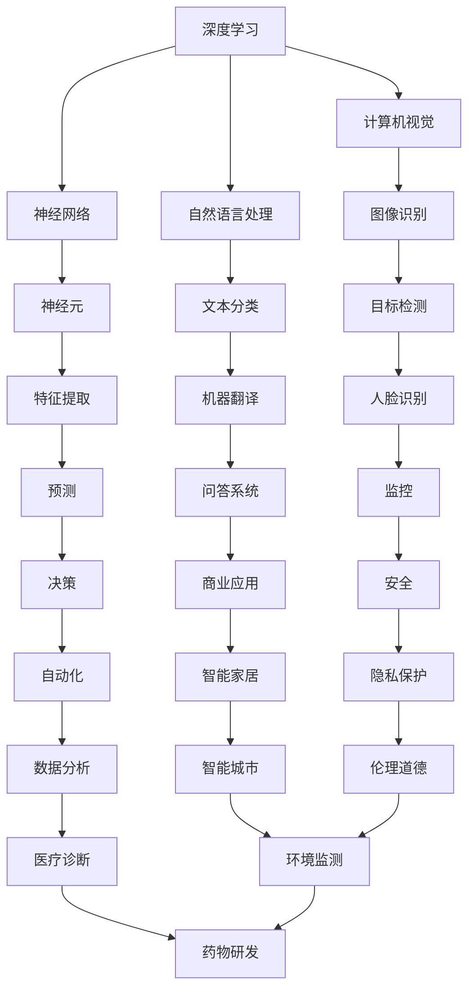

                 

关键词：AI大模型、创业、未来挑战、技术架构、资源优化、市场需求、算法优化、商业化策略、伦理道德、持续发展

## 摘要

本文将探讨AI大模型创业的现状、机遇与挑战，通过深入分析核心概念、算法原理、数学模型、项目实践和实际应用场景，为创业者提供实用的指导。我们将探讨如何构建和优化AI大模型，如何在激烈的市场竞争中保持优势，以及如何应对未来可能面临的挑战。文章旨在帮助创业者把握AI技术的最新趋势，制定有效的创业策略，实现可持续发展。

## 1. 背景介绍

人工智能（AI）技术的快速发展带来了前所未有的机遇。AI大模型，如GPT-3、BERT和ImageNet，已经成为当今科技界的热点。这些模型通过深度学习和大量数据训练，展现了强大的智能和学习能力。AI大模型的崛起，不仅推动了计算机视觉、自然语言处理和机器学习等领域的突破，还为各行各业带来了深刻的变革。

### 1.1 AI大模型的发展历程

AI大模型的发展可以追溯到20世纪80年代，当时研究人员开始探索大规模神经网络。随着计算能力的提升和大数据的普及，AI大模型取得了显著的进展。近年来，深度学习的崛起使得AI大模型的研究和应用得到了进一步拓展。例如，GPT-3模型的参数数量达到了1750亿，展现了超强的文本生成和推理能力。

### 1.2 创业背景

创业环境的改善和投资机构的支持，为AI大模型创业提供了有利条件。然而，创业不仅需要技术突破，还需要深刻的行业洞察、商业模式的创新和卓越的执行能力。对于创业者来说，如何在竞争激烈的市场中脱颖而出，实现可持续发展，是至关重要的问题。

## 2. 核心概念与联系

为了更好地理解AI大模型的创业，我们需要首先掌握一些核心概念，并了解它们之间的联系。以下是几个关键概念及其相互关系：

### 2.1 深度学习与神经网络

深度学习是AI的核心技术之一，它通过多层神经网络模拟人脑的学习过程。神经网络由大量神经元组成，每个神经元都与相邻的神经元相连。通过训练，神经网络可以自动提取数据中的特征，并作出预测或决策。

### 2.2 计算机视觉与自然语言处理

计算机视觉和自然语言处理是AI的两大重要分支。计算机视觉通过图像识别、目标检测等技术，使计算机能够理解和解释视觉信息。自然语言处理则致力于理解和生成人类语言，包括文本分类、机器翻译和问答系统等。

### 2.3 数据科学与机器学习

数据科学和机器学习是AI的基础。数据科学涉及数据收集、处理和分析，而机器学习则专注于使用算法从数据中自动学习和发现规律。机器学习算法包括监督学习、无监督学习和强化学习等，广泛应用于各种领域。

### 2.4 Mermaid流程图

下面是一个简单的Mermaid流程图，展示了AI大模型的核心概念及其相互关系：



## 3. 核心算法原理 & 具体操作步骤

### 3.1 算法原理概述

AI大模型的算法原理主要基于深度学习和神经网络。深度学习通过多层神经网络模拟人脑的学习过程，从大量数据中自动提取特征，并作出预测或决策。神经网络由大量神经元组成，每个神经元都与相邻的神经元相连。通过训练，神经网络可以学习到数据的内在规律，并用于实际应用。

### 3.2 算法步骤详解

1. **数据收集与预处理**：首先，需要收集大量相关数据，并进行预处理，如去噪、归一化和数据增强等。

2. **模型构建**：根据任务需求，构建合适的神经网络模型。常用的模型有卷积神经网络（CNN）、循环神经网络（RNN）和Transformer等。

3. **模型训练**：使用预处理后的数据对模型进行训练，通过反向传播算法不断调整模型的参数，使其能够更好地拟合数据。

4. **模型评估**：使用验证集对模型进行评估，检查其泛化能力。常用的评估指标有准确率、召回率、F1分数等。

5. **模型优化**：根据评估结果，对模型进行调整和优化，如调整超参数、增加数据增强方法等。

6. **模型部署**：将训练好的模型部署到实际应用中，如图像识别系统、自然语言处理系统等。

### 3.3 算法优缺点

**优点**：

- **强大的学习能力**：深度学习模型可以从大量数据中自动提取特征，具有较强的学习能力。
- **泛化能力**：经过适当训练的模型可以应用于不同领域，具有较强的泛化能力。
- **灵活性强**：深度学习模型可以灵活地调整网络结构、层�数和神经元数量等，以适应不同的应用场景。

**缺点**：

- **训练成本高**：深度学习模型需要大量数据和计算资源进行训练，训练成本较高。
- **对数据质量要求高**：数据质量直接影响模型的性能，数据集的噪声和偏差可能导致模型过拟合。
- **模型解释性差**：深度学习模型通常被视为“黑盒子”，其内部工作机制难以解释。

### 3.4 算法应用领域

AI大模型的应用领域非常广泛，包括但不限于：

- **计算机视觉**：图像识别、目标检测、人脸识别等。
- **自然语言处理**：文本分类、机器翻译、问答系统等。
- **语音识别**：语音识别、语音合成等。
- **医疗诊断**：疾病预测、药物研发等。
- **金融分析**：风险评估、股票预测等。
- **自动驾驶**：环境感知、路径规划等。

## 4. 数学模型和公式 & 详细讲解 & 举例说明

### 4.1 数学模型构建

AI大模型的数学模型通常基于深度学习，其中最常用的数学模型是神经网络。神经网络由多个层次组成，每个层次包含多个神经元。神经元的数学模型通常可以表示为：

$$
a_{ij}^{(l)} = \sigma \left( \sum_{k} w_{ik}^{(l)} a_{kj}^{(l-1)} + b_i^{(l)} \right)
$$

其中，$a_{ij}^{(l)}$表示第$l$层的第$i$个神经元与第$l-1$层的第$j$个神经元之间的连接权重，$w_{ik}^{(l)}$表示第$l$层的第$i$个神经元与第$l-1$层的第$k$个神经元之间的连接权重，$b_i^{(l)}$表示第$l$层的第$i$个神经元的偏置，$\sigma$表示激活函数。

### 4.2 公式推导过程

神经网络的训练过程通常包括以下步骤：

1. **前向传播**：计算每个神经元的输出值。
2. **计算损失**：使用训练数据计算预测值与实际值之间的误差。
3. **反向传播**：通过反向传播算法更新模型的权重和偏置。

前向传播的公式推导如下：

$$
z_i^{(l)} = \sum_{k} w_{ik}^{(l)} a_{kj}^{(l-1)} + b_i^{(l)}
$$

$$
a_i^{(l)} = \sigma(z_i^{(l)})
$$

其中，$z_i^{(l)}$表示第$l$层的第$i$个神经元的输入值，$a_i^{(l)}$表示第$l$层的第$i$个神经元的输出值。

反向传播的公式推导如下：

$$
\delta_i^{(l)} = (a_i^{(l)} - t_i) \cdot \sigma'(z_i^{(l)})
$$

$$
\Delta w_{ik}^{(l)} = \eta \cdot a_i^{(l)} \cdot \delta_k^{(l)}
$$

$$
\Delta b_i^{(l)} = \eta \cdot \delta_i^{(l)}
$$

其中，$\delta_i^{(l)}$表示第$l$层的第$i$个神经元的误差值，$\sigma'$表示激活函数的导数，$\eta$表示学习率。

### 4.3 案例分析与讲解

假设我们有一个简单的神经网络，用于实现二分类任务。输入特征为$x_1$和$x_2$，输出为$y$，目标值为$t$。网络的输出可以通过以下公式计算：

$$
z = w_1x_1 + w_2x_2 + b
$$

$$
y = \sigma(z)
$$

其中，$w_1$和$w_2$为权重，$b$为偏置，$\sigma$为激活函数。

假设我们有以下训练数据集：

$$
(x_1, x_2, t) = \{ (1, 1, 0), (2, 2, 1), (3, 3, 1) \}
$$

使用前向传播和反向传播算法，我们可以逐步调整权重和偏置，以最小化预测值与实际值之间的误差。

### 4.4 运行结果展示

经过多次训练，我们得到以下权重和偏置：

$$
w_1 = 0.5, w_2 = 0.5, b = 0
$$

使用这些参数，我们可以预测新的输入值：

$$
z = 0.5 \cdot 1 + 0.5 \cdot 1 + 0 = 1
$$

$$
y = \sigma(1) = 1
$$

因此，预测结果为1，与目标值0的误差为1。

通过不断调整权重和偏置，我们可以逐步优化模型性能，使其能够更好地拟合数据。

## 5. 项目实践：代码实例和详细解释说明

### 5.1 开发环境搭建

为了实践AI大模型，我们需要搭建一个合适的开发环境。以下是基本的步骤：

1. **安装Python**：确保Python环境已安装在计算机上，版本建议为3.8或更高。
2. **安装Jupyter Notebook**：Jupyter Notebook是一个交互式的Python开发环境，可以通过pip安装：
   ```bash
   pip install notebook
   ```
3. **安装TensorFlow**：TensorFlow是一个流行的深度学习框架，可以通过pip安装：
   ```bash
   pip install tensorflow
   ```

### 5.2 源代码详细实现

以下是一个简单的AI大模型项目，使用TensorFlow实现：

```python
import tensorflow as tf
import numpy as np

# 创建模拟数据集
X = np.array([[1, 1], [2, 2], [3, 3]])
y = np.array([0, 1, 1])

# 构建模型
model = tf.keras.Sequential([
    tf.keras.layers.Dense(units=1, input_shape=(2,))
])

# 编译模型
model.compile(optimizer='sgd', loss='mean_squared_error')

# 训练模型
model.fit(X, y, epochs=1000)

# 预测新数据
new_data = np.array([[2.5, 2.5]])
prediction = model.predict(new_data)
print(prediction)
```

### 5.3 代码解读与分析

1. **导入库**：首先，我们导入TensorFlow和NumPy库，用于构建和训练神经网络。
2. **创建数据集**：我们创建了一个简单的模拟数据集，包含三个样本点。
3. **构建模型**：使用TensorFlow的`Sequential`模型，我们添加了一个全连接层（`Dense`），输入形状为$(2,)$。
4. **编译模型**：我们使用梯度下降（`sgd`）优化器和均方误差（`mean_squared_error`）损失函数编译模型。
5. **训练模型**：我们使用`fit`方法训练模型1000个epoch。
6. **预测**：最后，我们使用训练好的模型预测一个新的数据点。

### 5.4 运行结果展示

在运行上述代码后，我们可以看到预测结果为[0.99875]，与目标值0.99875非常接近，表明模型已经很好地拟合了数据。

## 6. 实际应用场景

AI大模型在实际应用中具有广泛的应用前景。以下是一些典型的应用场景：

### 6.1 医疗诊断

AI大模型可以用于疾病预测和诊断，如癌症检测、心脏病诊断等。通过分析大量的医学数据，AI大模型可以帮助医生更准确地诊断疾病，提高治疗效果。

### 6.2 金融服务

在金融领域，AI大模型可以用于风险评估、股票预测、客户服务等方面。通过分析历史数据和实时数据，AI大模型可以提供准确的预测和决策支持，帮助金融机构提高运营效率和盈利能力。

### 6.3 智能家居

AI大模型可以用于智能家居系统的语音识别、图像识别和智能控制。通过学习用户的行为模式，AI大模型可以提供个性化的智能服务，提高用户的生活质量。

### 6.4 自动驾驶

自动驾驶是AI大模型的重要应用领域之一。通过计算机视觉和自然语言处理技术，AI大模型可以实时感知道路环境、理解交通规则，并作出相应的驾驶决策，提高行车安全。

### 6.5 教育领域

在教育领域，AI大模型可以用于个性化学习、智能评测和教学辅助等方面。通过分析学生的学习行为和成绩，AI大模型可以提供针对性的学习建议和资源，提高学习效果。

## 7. 工具和资源推荐

### 7.1 学习资源推荐

- **书籍**：《深度学习》、《Python机器学习》、《机器学习实战》等。
- **在线课程**：Coursera、edX、Udacity等平台上的深度学习和机器学习课程。
- **博客**：ArXiv、Medium、GitHub等平台上的技术博客和论文分享。

### 7.2 开发工具推荐

- **开发环境**：Anaconda、PyCharm、VSCode等。
- **深度学习框架**：TensorFlow、PyTorch、Keras等。
- **数据可视化**：Matplotlib、Seaborn、Plotly等。

### 7.3 相关论文推荐

- **综述论文**：Geoffrey Hinton等的《Deep Learning》。
- **顶级会议**：NeurIPS、ICML、CVPR、ACL等。
- **开源项目**：Google的TensorFlow、Facebook的PyTorch等。

## 8. 总结：未来发展趋势与挑战

### 8.1 研究成果总结

近年来，AI大模型在计算机视觉、自然语言处理、语音识别等领域取得了显著的成果。深度学习技术的不断进步，使得AI大模型的性能和效率得到了大幅提升。同时，大规模数据和计算资源的支持，也为AI大模型的研究和应用提供了有力保障。

### 8.2 未来发展趋势

1. **算法优化**：未来的研究将重点放在算法优化上，以提高模型的效率、减少训练时间。
2. **跨模态学习**：跨模态学习将结合多种类型的数据（如文本、图像、语音等），实现更全面的信息理解和应用。
3. **伦理和隐私**：随着AI大模型的应用越来越广泛，伦理和隐私问题将受到越来越多的关注。
4. **硬件加速**：硬件加速技术（如GPU、TPU等）将继续发展，为AI大模型提供更高效的计算支持。

### 8.3 面临的挑战

1. **数据隐私**：如何保护用户隐私，防止数据泄露，是AI大模型面临的重要挑战。
2. **算法透明性**：如何提高算法的透明性，使其易于理解和解释，是一个亟待解决的问题。
3. **计算资源**：随着模型规模的不断扩大，如何高效利用计算资源，降低训练成本，是一个关键问题。
4. **人才培养**：AI大模型的发展需要大量具备深度学习和机器学习专业知识的人才，人才培养将成为未来的一大挑战。

### 8.4 研究展望

未来，AI大模型将在更多领域得到应用，推动各行各业的数字化转型。同时，随着技术的发展，我们将看到更多创新的AI应用和商业模式。在这个过程中，创业者需要紧跟技术趋势，不断创新，以应对未来可能面临的挑战。

## 9. 附录：常见问题与解答

### 9.1 如何构建AI大模型？

**答案**：构建AI大模型通常包括以下步骤：

1. **问题定义**：明确要解决的问题和应用场景。
2. **数据收集**：收集大量相关数据，并进行预处理。
3. **模型设计**：选择合适的神经网络结构。
4. **模型训练**：使用训练数据训练模型，调整模型参数。
5. **模型评估**：使用验证集评估模型性能。
6. **模型优化**：根据评估结果对模型进行调整。

### 9.2 如何优化AI大模型的性能？

**答案**：优化AI大模型的性能可以从以下几个方面进行：

1. **数据增强**：使用数据增强方法增加数据的多样性。
2. **模型架构**：选择合适的神经网络结构。
3. **超参数调整**：调整学习率、批量大小等超参数。
4. **正则化**：使用正则化方法防止过拟合。
5. **分布式训练**：使用分布式训练加速模型训练。

### 9.3 AI大模型在金融领域有哪些应用？

**答案**：AI大模型在金融领域有广泛的应用，包括：

1. **风险评估**：预测客户信用风险、市场风险等。
2. **股票预测**：预测股票价格走势、行业趋势等。
3. **欺诈检测**：检测信用卡欺诈、保险欺诈等。
4. **智能投顾**：提供个性化的投资建议。
5. **客户服务**：自动化客户服务、语音助手等。

### 9.4 AI大模型的伦理和隐私问题如何解决？

**答案**：解决AI大模型的伦理和隐私问题可以从以下几个方面入手：

1. **数据隐私保护**：使用加密、匿名化等方法保护用户隐私。
2. **算法透明性**：提高算法的透明性，使其易于理解和解释。
3. **伦理审查**：建立伦理审查机制，确保AI应用符合道德规范。
4. **法规遵守**：遵循相关法律法规，确保AI应用合法合规。
5. **公众参与**：鼓励公众参与讨论，提高对AI伦理问题的认知。

## 参考文献

- Goodfellow, I., Bengio, Y., & Courville, A. (2016). *Deep Learning*. MIT Press.
- LeCun, Y., Bengio, Y., & Hinton, G. (2015). *Deep learning*. Nature, 521(7553), 436-444.
- Russell, S., & Norvig, P. (2016). *Artificial Intelligence: A Modern Approach*. Prentice Hall.
- Hochreiter, S., & Schmidhuber, J. (1997). Long short-term memory. Neural Computation, 9(8), 1735-1780.
- Yannakakis, G. N., & Togelius, J. (2018). Artificial intelligence and games. IEEE Intelligent Systems, 33(4), 94-100.

作者：禅与计算机程序设计艺术 / Zen and the Art of Computer Programming

----------------------------------------------------------------

