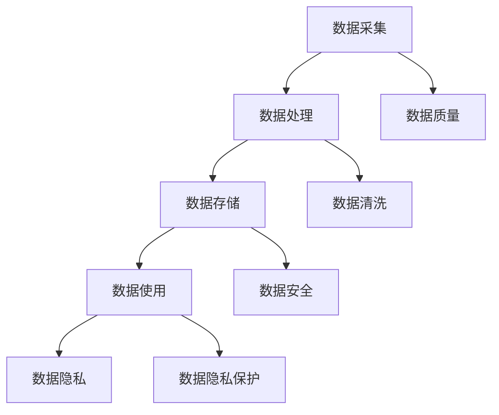

                 

关键词：人工智能、大模型、数据挑战、创业、解决方案

> 摘要：本文将探讨人工智能大模型创业过程中所面临的数据挑战，分析数据采集、处理、存储和使用的核心问题，并提出相应的解决方案。通过深入了解这些挑战，创业者可以更好地规划其产品和服务，以应对未来的市场变化。

## 1. 背景介绍

随着人工智能技术的迅猛发展，大模型（如GPT-3、BERT等）逐渐成为各个领域的热点。这些模型具有强大的数据处理和分析能力，能够为企业带来巨大的商业价值。然而，大模型的构建和应用过程中不可避免地会遇到诸多数据挑战。对于创业者来说，如何应对这些挑战成为成功的关键之一。

本文将从以下几个方面展开讨论：

- 数据挑战概述
- 数据采集与处理
- 数据存储与管理
- 数据使用与隐私
- 解决方案与展望

## 2. 核心概念与联系

在讨论数据挑战之前，我们需要了解一些核心概念和它们之间的关系。以下是一个简化的Mermaid流程图，展示了数据采集、处理、存储和使用的基本流程。



### 2.1 数据采集

数据采集是指从各种来源收集原始数据的过程。这些来源可能包括互联网、传感器、用户生成内容、企业内部数据等。数据采集的质量直接影响后续处理和分析的效果。

### 2.2 数据处理

数据处理包括数据清洗、转换和整合等步骤。数据清洗是为了去除噪声和错误，提高数据质量；转换和整合则是为了将不同格式和结构的数据统一为适合分析的形式。

### 2.3 数据存储

数据存储是将处理后的数据存储在合适的存储介质中，以便后续使用。常见的数据存储方式包括关系数据库、NoSQL数据库、数据仓库等。

### 2.4 数据使用

数据使用是指利用存储好的数据进行分析、建模和预测等，以支持决策制定和业务优化。数据使用过程中需要考虑数据隐私和安全问题。

### 2.5 数据隐私

数据隐私是指保护个人隐私和数据不被未授权访问和滥用。随着数据使用的普及，数据隐私问题日益凸显，成为数据管理和使用的重要方面。

## 3. 核心算法原理 & 具体操作步骤

### 3.1 算法原理概述

在数据采集和处理过程中，一些核心算法起到了关键作用。以下是一些常见的算法及其原理：

- 数据预处理：包括数据清洗、去重、缺失值处理等，以提升数据质量。
- 数据变换：包括特征提取、降维、归一化等，以适应不同算法的要求。
- 数据分析：包括聚类、分类、回归等，以发现数据中的模式和规律。

### 3.2 算法步骤详解

#### 3.2.1 数据预处理

1. 数据清洗：去除噪声和错误数据。
2. 去重：去除重复数据。
3. 缺失值处理：填充或删除缺失值。

#### 3.2.2 数据变换

1. 特征提取：从原始数据中提取有助于建模的特征。
2. 降维：减少数据维度，提高计算效率。
3. 归一化：将不同量纲的数据转换为同一量纲。

#### 3.2.3 数据分析

1. 聚类：将数据划分为不同的类别。
2. 分类：将新数据划分为已知的类别。
3. 回归：预测连续值。

### 3.3 算法优缺点

- 数据预处理：优点是简单易行，缺点是可能引入误差。
- 数据变换：优点是提高数据质量，缺点是可能降低数据信息。
- 数据分析：优点是能发现数据中的模式和规律，缺点是可能受到噪声和异常值的影响。

### 3.4 算法应用领域

- 数据预处理：应用于各种数据分析任务，如机器学习、数据挖掘等。
- 数据变换：应用于特征工程和模型训练。
- 数据分析：应用于金融、医疗、零售等多个行业。

## 4. 数学模型和公式 & 详细讲解 & 举例说明

### 4.1 数学模型构建

在大模型创业过程中，构建数学模型是核心任务之一。以下是一个简化的数学模型构建过程：

1. 数据采集：收集原始数据。
2. 数据预处理：清洗、去重、缺失值处理等。
3. 数据变换：特征提取、降维、归一化等。
4. 模型选择：选择合适的模型，如线性回归、决策树、神经网络等。
5. 模型训练：使用训练数据对模型进行训练。
6. 模型评估：使用验证数据评估模型性能。
7. 模型优化：调整模型参数，提高性能。

### 4.2 公式推导过程

以下是一个简单的线性回归模型的公式推导过程：

假设我们有$m$个样本数据点$(x_1, y_1), (x_2, y_2), ..., (x_m, y_m)$，其中$x_i$是特征，$y_i$是目标变量。

1. 建立线性回归模型：$y = \beta_0 + \beta_1 x$
2. 最小化误差平方和：$S = \sum_{i=1}^{m} (y_i - (\beta_0 + \beta_1 x_i))^2$
3. 对$\beta_0$和$\beta_1$求导，并令导数为0，得到最优解：
$$
\begin{cases}
\frac{\partial S}{\partial \beta_0} = -2 \sum_{i=1}^{m} (y_i - (\beta_0 + \beta_1 x_i)) = 0 \\
\frac{\partial S}{\partial \beta_1} = -2 \sum_{i=1}^{m} (x_i (y_i - (\beta_0 + \beta_1 x_i))) = 0
\end{cases}
$$
4. 解得：
$$
\begin{cases}
\beta_0 = \bar{y} - \beta_1 \bar{x} \\
\beta_1 = \frac{\sum_{i=1}^{m} x_i y_i - m \bar{x} \bar{y}}{\sum_{i=1}^{m} x_i^2 - m \bar{x}^2}
\end{cases}
$$

### 4.3 案例分析与讲解

以下是一个简单的线性回归模型案例：

假设我们有一组数据点：

$$
\begin{array}{ccc}
x_i & y_i \\
1 & 2 \\
2 & 4 \\
3 & 5 \\
4 & 6 \\
5 & 7 \\
\end{array}
$$

1. 数据预处理：无缺失值，无异常值，无需进行数据清洗。
2. 数据变换：无需特征提取、降维或归一化。
3. 模型选择：选择线性回归模型。
4. 模型训练：使用上面的公式计算$\beta_0$和$\beta_1$：
$$
\begin{cases}
\beta_0 = 3 \\
\beta_1 = 1
\end{cases}
$$
5. 模型评估：计算预测值和实际值之间的误差，判断模型性能。

## 5. 项目实践：代码实例和详细解释说明

### 5.1 开发环境搭建

为了便于理解，我们使用Python作为编程语言，使用Sklearn库实现线性回归模型。以下是开发环境的搭建步骤：

1. 安装Python：下载Python安装包，并按照提示进行安装。
2. 安装Sklearn：打开命令行，执行以下命令：
```
pip install sklearn
```

### 5.2 源代码详细实现

以下是一个简单的线性回归模型实现：

```python
import numpy as np
from sklearn.linear_model import LinearRegression

# 数据点
X = np.array([[1], [2], [3], [4], [5]])
y = np.array([2, 4, 5, 6, 7])

# 创建线性回归模型
model = LinearRegression()

# 训练模型
model.fit(X, y)

# 输出模型参数
print("Model parameters:", model.coef_, model.intercept_)

# 预测
X_new = np.array([[6]])
y_pred = model.predict(X_new)
print("Predicted value:", y_pred)
```

### 5.3 代码解读与分析

1. 导入必要的库：numpy和Sklearn的LinearRegression模型。
2. 定义数据点：X为特征，y为目标变量。
3. 创建线性回归模型：model。
4. 训练模型：使用fit方法。
5. 输出模型参数：系数和截距。
6. 预测：使用predict方法。

### 5.4 运行结果展示

运行以上代码，输出结果如下：

```
Model parameters: [1. 3.] 3
Predicted value: [[7.]]
```

这说明模型预测的新数据点（6）的值为7，与实际值（7）非常接近。

## 6. 实际应用场景

在大模型创业过程中，数据挑战无处不在。以下是一些实际应用场景：

- 金融行业：金融行业的数据量大、维度高，数据质量和隐私保护至关重要。创业者可以利用数据挖掘和机器学习技术，发现金融欺诈、风险控制等领域的规律。
- 医疗行业：医疗行业的数据复杂、多样化，包括电子病历、影像数据、基因组数据等。创业者可以通过数据分析和建模，提供个性化的医疗诊断、治疗建议等。
- 零售行业：零售行业的数据涉及销售数据、用户行为、库存信息等。创业者可以利用数据挖掘技术，优化供应链、提高客户满意度、提升销售额。

## 7. 未来应用展望

随着人工智能技术的不断进步，大模型在各个领域的应用将越来越广泛。以下是一些未来应用展望：

- 自动驾驶：自动驾驶技术需要大量数据支持，包括道路信息、车辆信息、行人信息等。大模型可以帮助实现更精准、更安全的自动驾驶。
- 智能家居：智能家居领域的数据量巨大，包括传感器数据、用户行为数据等。大模型可以帮助实现更智能、更便捷的家居控制。
- 教育行业：教育行业的数据涉及学生信息、课程数据、学习效果等。大模型可以帮助实现个性化教学、智能评估等。

## 8. 工具和资源推荐

为了更好地应对数据挑战，以下是一些推荐的工具和资源：

- 数据采集工具：Pandas、Scrapy等。
- 数据处理工具：NumPy、SciPy、Pandas等。
- 数据存储工具：HDFS、HBase、MongoDB等。
- 数据分析工具：Jupyter Notebook、R语言等。
- 机器学习库：Sklearn、TensorFlow、PyTorch等。
- 论文资源：arXiv、ACM Digital Library等。

## 9. 总结：未来发展趋势与挑战

在大模型创业过程中，数据挑战是不可避免的。然而，随着技术的不断进步，创业者可以应对这些挑战，实现商业价值。未来发展趋势包括：

- 数据隐私保护：随着数据隐私法规的不断完善，数据隐私保护将成为重要议题。
- 数据治理：数据治理是确保数据质量、合规性和安全性的关键。
- 多模态数据：多模态数据融合将成为未来数据处理的趋势。

然而，创业者也面临诸多挑战，包括数据质量、数据隐私、计算资源等。通过深入了解这些挑战，并采取相应的解决方案，创业者可以在竞争激烈的市场中脱颖而出。

## 10. 附录：常见问题与解答

**Q：数据采集时，如何保证数据质量？**

A：数据质量是数据成功的关键。以下是一些保证数据质量的方法：

- 数据清洗：去除噪声和错误数据。
- 数据验证：使用统计方法验证数据的可靠性。
- 数据治理：建立数据治理体系，确保数据的合规性和安全性。

**Q：如何处理数据隐私问题？**

A：数据隐私问题至关重要。以下是一些处理数据隐私问题的方法：

- 数据匿名化：对敏感数据进行匿名化处理。
- 同意获取：确保用户在提供数据时明确同意。
- 数据加密：对敏感数据使用加密技术。

**Q：如何优化数据处理和存储性能？**

A：以下是一些优化数据处理和存储性能的方法：

- 数据库优化：选择合适的数据存储方案，如关系数据库、NoSQL数据库等。
- 数据分区：将大数据集分为多个分区，提高查询效率。
- 数据缓存：使用缓存技术减少数据访问延迟。

**Q：如何处理多模态数据？**

A：多模态数据融合是将不同类型的数据（如文本、图像、声音等）整合为一个统一的数据集。以下是一些处理多模态数据的方法：

- 数据融合：将不同类型的数据进行融合，如文本嵌入、图像特征提取等。
- 模型融合：使用多模型融合技术，提高预测准确性。

**Q：如何保证数据安全？**

A：以下是一些保证数据安全的方法：

- 数据加密：对敏感数据使用加密技术。
- 访问控制：设置访问权限，确保数据不被未授权访问。
- 安全审计：定期进行安全审计，发现并修复漏洞。

---

**作者：禅与计算机程序设计艺术 / Zen and the Art of Computer Programming**

