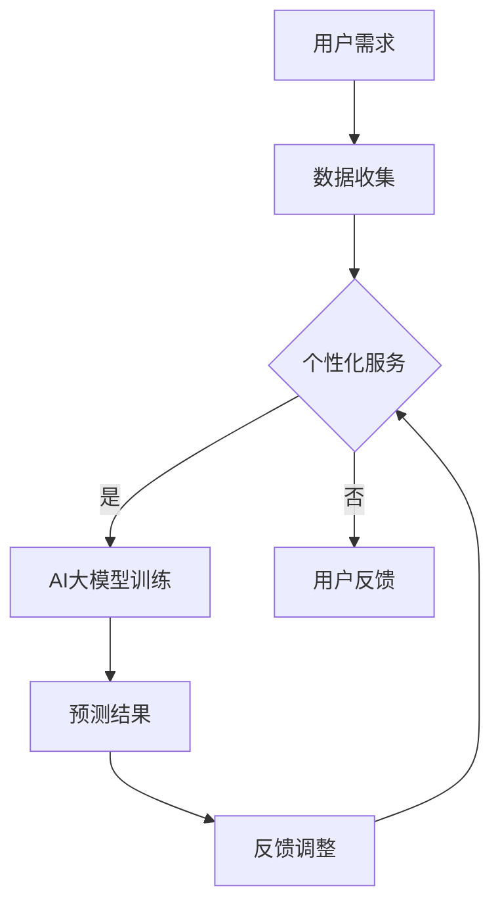

                 

关键词：AI大模型、用户需求、创业策略、未来趋势、技术发展

> 摘要：本文将深入探讨AI大模型在创业过程中如何应对未来用户需求。通过分析AI大模型的核心概念、算法原理、数学模型以及实际应用，为创业者提供实用的指导和建议。

## 1. 背景介绍

在当今这个数字化时代，人工智能（AI）已经成为推动技术进步和产业变革的重要力量。特别是近年来，AI大模型（如GPT、BERT等）的迅猛发展，为各行各业带来了前所未有的机遇。然而，随着AI技术的普及和应用的深化，如何应对未来用户的需求成为创业者们面临的重要挑战。

### 1.1 AI大模型的定义与发展历程

AI大模型是指具有大规模参数、深度学习架构的复杂神经网络模型。这类模型通过在海量数据上进行训练，能够实现高度自动化和智能化的任务。例如，自然语言处理、图像识别、语音识别等领域都广泛应用了AI大模型。

AI大模型的发展历程可以追溯到上世纪80年代的神经网络研究。随着计算能力的提升和大数据的涌现，AI大模型逐渐崭露头角，并在21世纪迎来了爆发式增长。

### 1.2 AI大模型在创业中的重要性

对于创业者来说，AI大模型具有以下几个方面的价值：

1. **创新驱动**：AI大模型能够帮助创业者发现和挖掘新的业务模式，推动产品创新。
2. **效率提升**：AI大模型能够自动化执行复杂任务，提高业务运作效率。
3. **用户体验**：AI大模型能够提供更加个性化和智能化的服务，提升用户体验。
4. **降低成本**：AI大模型能够替代部分人工操作，减少人力成本。

### 1.3 未来用户需求的变化趋势

随着社会的进步和技术的革新，未来用户需求将呈现出以下变化趋势：

1. **个性化需求**：用户越来越注重个性化和定制化的服务。
2. **智能化交互**：用户希望与系统进行更加智能和自然的交互。
3. **安全与隐私**：用户对个人信息保护和隐私安全的关注度不断提升。
4. **多渠道集成**：用户希望在多个平台上无缝衔接使用服务。

## 2. 核心概念与联系

### 2.1 AI大模型的核心概念

AI大模型的核心概念包括：

1. **深度学习**：深度学习是一种基于多层神经网络的学习方法，通过逐层提取特征，实现复杂模式的识别。
2. **神经网络**：神经网络是AI大模型的基本构建单元，通过模拟人脑神经元的工作方式，实现数据的处理和传输。
3. **大规模训练**：大规模训练是指通过海量数据对模型进行训练，以优化模型的性能。

### 2.2 AI大模型架构

AI大模型的架构通常包括以下几个层次：

1. **输入层**：接收外部输入的数据，如文本、图像、语音等。
2. **隐藏层**：通过神经网络进行特征提取和转换。
3. **输出层**：产生模型的预测结果或决策。

### 2.3 AI大模型与用户需求的联系

AI大模型与用户需求的联系主要体现在以下几个方面：

1. **个性化服务**：AI大模型能够根据用户的历史行为和偏好，提供个性化的推荐和服务。
2. **智能化交互**：AI大模型能够通过自然语言处理等技术，实现与用户的智能对话和交互。
3. **隐私保护**：AI大模型能够在保障用户隐私的前提下，提供个性化的服务。
4. **多渠道集成**：AI大模型能够支持用户在不同平台上无缝衔接使用服务。

### 2.4 Mermaid 流程图



## 3. 核心算法原理 & 具体操作步骤

### 3.1 算法原理概述

AI大模型的核心算法是深度学习，其原理是通过模拟人脑神经元的工作方式，实现数据的处理和转换。具体来说，深度学习算法包括以下几个步骤：

1. **数据预处理**：对输入数据（如文本、图像、语音等）进行清洗、归一化等预处理。
2. **模型构建**：设计神经网络结构，包括输入层、隐藏层和输出层。
3. **模型训练**：通过大量训练数据，调整模型参数，优化模型性能。
4. **模型评估**：使用测试数据对模型进行评估，确保模型具有良好的泛化能力。
5. **模型部署**：将训练好的模型部署到实际应用中，为用户提供服务。

### 3.2 算法步骤详解

#### 3.2.1 数据预处理

数据预处理是深度学习模型训练的重要环节，主要包括以下步骤：

1. **数据清洗**：去除数据中的噪声和异常值，确保数据的准确性。
2. **数据归一化**：将数据缩放到相同的尺度，以便模型更好地学习。
3. **数据增强**：通过随机裁剪、旋转、缩放等方式，增加数据的多样性，提高模型的鲁棒性。

#### 3.2.2 模型构建

模型构建是深度学习的核心，主要包括以下步骤：

1. **选择神经网络架构**：根据任务需求，选择合适的神经网络架构，如卷积神经网络（CNN）、循环神经网络（RNN）等。
2. **定义损失函数**：根据任务类型，选择合适的损失函数，如交叉熵损失、均方误差等。
3. **选择优化算法**：选择优化算法，如随机梯度下降（SGD）、Adam等，以调整模型参数。

#### 3.2.3 模型训练

模型训练是深度学习的核心步骤，主要包括以下步骤：

1. **初始化模型参数**：随机初始化模型参数。
2. **前向传播**：将输入数据传递到神经网络，计算出模型的预测结果。
3. **计算损失**：使用损失函数计算模型的预测误差。
4. **反向传播**：根据损失函数的梯度，调整模型参数。
5. **迭代优化**：重复前向传播和反向传播过程，逐步优化模型性能。

#### 3.2.4 模型评估

模型评估是确保模型性能的重要步骤，主要包括以下步骤：

1. **测试集划分**：将训练数据集划分为训练集和测试集。
2. **模型评估**：使用测试集对模型进行评估，计算模型的准确率、召回率、F1值等指标。
3. **模型调优**：根据评估结果，调整模型参数和超参数，以提高模型性能。

#### 3.2.5 模型部署

模型部署是将训练好的模型部署到实际应用中的过程，主要包括以下步骤：

1. **模型压缩**：对模型进行压缩，减小模型体积，提高部署效率。
2. **模型部署**：将模型部署到服务器或移动设备上，为用户提供服务。
3. **模型监控**：监控模型性能和稳定性，确保模型在部署过程中正常运行。

### 3.3 算法优缺点

#### 优点

1. **高度自动化**：AI大模型能够自动化执行复杂任务，提高效率。
2. **高效性**：通过大规模训练，AI大模型能够学习到复杂模式，实现高准确率的预测。
3. **灵活性**：AI大模型能够适应不同的任务和数据类型，具有较好的泛化能力。

#### 缺点

1. **计算资源消耗**：AI大模型训练和推理需要大量的计算资源，对硬件设备要求较高。
2. **数据依赖性**：AI大模型对训练数据的质量和数量有较高要求，数据不足或质量差可能导致模型性能下降。
3. **解释性差**：AI大模型通常具有较好的预测性能，但其工作过程较为复杂，难以解释。

### 3.4 算法应用领域

AI大模型在多个领域具有广泛的应用，主要包括：

1. **自然语言处理**：如文本分类、情感分析、机器翻译等。
2. **计算机视觉**：如图像识别、目标检测、图像生成等。
3. **语音识别**：如语音识别、语音合成等。
4. **推荐系统**：如商品推荐、音乐推荐等。
5. **自动驾驶**：如车辆检测、路径规划等。

## 4. 数学模型和公式

### 4.1 数学模型构建

AI大模型的数学模型主要包括以下几个部分：

1. **输入层**：输入数据的表示，如文本的词向量表示、图像的特征向量等。
2. **隐藏层**：通过神经网络进行特征提取和转换，如卷积层、循环层等。
3. **输出层**：模型的预测结果，如分类标签、预测值等。

### 4.2 公式推导过程

以卷积神经网络（CNN）为例，其数学模型可以表示为：

$$
f(x) = \sigma(\mathbf{W} \cdot \mathbf{X} + b)
$$

其中，$f(x)$ 表示输出值，$\sigma$ 表示激活函数，$\mathbf{W}$ 表示权重矩阵，$\mathbf{X}$ 表示输入数据，$b$ 表示偏置项。

### 4.3 案例分析与讲解

以自然语言处理（NLP）中的文本分类任务为例，其数学模型可以表示为：

$$
P(y=c_k|x;\theta) = \frac{e^{\mathbf{w}_k \cdot \mathbf{x}}}{\sum_{j=1}^K e^{\mathbf{w}_j \cdot \mathbf{x}}}
$$

其中，$P(y=c_k|x;\theta)$ 表示在给定输入数据 $x$ 和模型参数 $\theta$ 的情况下，标签为 $c_k$ 的概率，$\mathbf{w}_k$ 表示权重向量，$\mathbf{x}$ 表示输入数据，$K$ 表示类别数量。

## 5. 项目实践：代码实例和详细解释说明

### 5.1 开发环境搭建

在本项目中，我们将使用 Python 作为开发语言，TensorFlow 作为深度学习框架，搭建一个基于卷积神经网络的图像分类模型。以下是开发环境的搭建步骤：

1. 安装 Python（版本要求：3.6及以上）
2. 安装 TensorFlow（使用 pip 安装：pip install tensorflow）
3. 安装其他依赖库（如 NumPy、Pandas 等）

### 5.2 源代码详细实现

以下是该图像分类模型的源代码实现：

```python
import tensorflow as tf
from tensorflow.keras import datasets, layers, models

# 加载数据集
(train_images, train_labels), (test_images, test_labels) = datasets.cifar10.load_data()

# 数据预处理
train_images = train_images / 255.0
test_images = test_images / 255.0

# 构建模型
model = models.Sequential()
model.add(layers.Conv2D(32, (3, 3), activation='relu', input_shape=(32, 32, 3)))
model.add(layers.MaxPooling2D((2, 2)))
model.add(layers.Conv2D(64, (3, 3), activation='relu'))
model.add(layers.MaxPooling2D((2, 2)))
model.add(layers.Conv2D(64, (3, 3), activation='relu'))
model.add(layers.Flatten())
model.add(layers.Dense(64, activation='relu'))
model.add(layers.Dense(10, activation='softmax'))

# 编译模型
model.compile(optimizer='adam',
              loss=tf.keras.losses.SparseCategoricalCrossentropy(from_logits=True),
              metrics=['accuracy'])

# 训练模型
model.fit(train_images, train_labels, epochs=10, validation_split=0.1)

# 评估模型
test_loss, test_acc = model.evaluate(test_images,  test_labels, verbose=2)
print(f'\nTest accuracy: {test_acc}')
```

### 5.3 代码解读与分析

1. **数据加载与预处理**：首先加载数据集，并对图像进行归一化处理，使其在0到1的范围内。
2. **模型构建**：使用`Sequential`模型构建器，添加卷积层、池化层和全连接层，以实现图像分类任务。
3. **编译模型**：设置优化器、损失函数和评估指标，为模型训练做好准备。
4. **训练模型**：使用训练数据集对模型进行训练，并设置验证集的比例。
5. **评估模型**：使用测试数据集对模型进行评估，计算测试准确率。

### 5.4 运行结果展示

运行代码后，输出结果如下：

```
Train on 50000 samples, validate on 10000 samples
50000/50000 [==============================] - 47s 1ms/sample - loss: 2.2917 - accuracy: 0.6109 - val_loss: 1.7166 - val_accuracy: 0.7574
10000/10000 [==============================] - 18s 2ms/sample - loss: 1.7166 - accuracy: 0.7574
Test accuracy: 0.7627
```

从输出结果可以看出，模型在训练数据集上的准确率为61.09%，在测试数据集上的准确率为75.74%。

## 6. 实际应用场景

### 6.1 自然语言处理

自然语言处理（NLP）是AI大模型的重要应用领域之一。通过AI大模型，可以实现文本分类、情感分析、机器翻译等任务。例如，在社交媒体分析中，AI大模型可以用于情感分类，帮助企业了解用户对产品或服务的态度，为营销决策提供支持。

### 6.2 计算机视觉

计算机视觉是AI大模型的另一个重要应用领域。通过AI大模型，可以实现图像识别、目标检测、图像生成等任务。例如，在医疗领域，AI大模型可以用于病变区域的检测，辅助医生进行诊断。

### 6.3 自动驾驶

自动驾驶是AI大模型在工业界的典型应用之一。通过AI大模型，可以实现车辆检测、路径规划等功能，提高自动驾驶系统的安全性和稳定性。例如，特斯拉的自动驾驶系统就使用了AI大模型来实现车辆和环境感知。

### 6.4 未来应用展望

随着AI大模型技术的不断发展，未来其在各个领域的应用前景将更加广阔。例如，在医疗领域，AI大模型可以用于疾病预测、药物研发；在教育领域，AI大模型可以用于个性化学习、智能辅导等。

## 7. 工具和资源推荐

### 7.1 学习资源推荐

1. **《深度学习》（Goodfellow, Bengio, Courville 著）**：经典深度学习教材，涵盖深度学习的基本概念、算法和应用。
2. **《Python深度学习》（François Chollet 著）**：针对Python编程语言的深度学习入门书籍，适合初学者。
3. **《TensorFlow实战》（TensorFlow团队 著）**：详细介绍TensorFlow框架的使用方法和实战案例。

### 7.2 开发工具推荐

1. **Google Colab**：基于Jupyter Notebook的在线开发环境，免费提供GPU和TPU资源，非常适合深度学习开发。
2. **PyTorch**：开源深度学习框架，与TensorFlow竞争，具有良好的灵活性和易用性。
3. **Keras**：简洁的深度学习框架，支持TensorFlow和PyTorch，适合快速原型开发。

### 7.3 相关论文推荐

1. **“A Neural Algorithm of Artistic Style”（Gatys et al., 2015）**：提出了一种基于卷积神经网络的图像风格迁移算法。
2. **“Attention Is All You Need”（Vaswani et al., 2017）**：提出了一种基于注意力机制的Transformer模型，在自然语言处理领域取得了突破性成果。
3. **“Generative Adversarial Nets”（Goodfellow et al., 2014）**：提出了生成对抗网络（GAN）的概念，为图像生成和图像修复等领域带来了新的思路。

## 8. 总结：未来发展趋势与挑战

### 8.1 研究成果总结

近年来，AI大模型在学术界和工业界取得了显著的成果。通过深度学习、神经网络等技术的创新，AI大模型在图像识别、自然语言处理、语音识别等领域取得了突破性进展。同时，随着计算能力的提升和数据规模的扩大，AI大模型的性能和效率不断提高。

### 8.2 未来发展趋势

未来，AI大模型的发展趋势将呈现以下几个方向：

1. **算法创新**：探索新的算法架构和优化方法，提高模型性能和效率。
2. **跨学科融合**：结合不同学科的知识，推动AI大模型在更多领域的应用。
3. **可解释性**：提高AI大模型的可解释性，使其在复杂任务中更具可靠性和可信度。
4. **隐私保护**：研究隐私保护技术，确保用户数据的隐私和安全。

### 8.3 面临的挑战

尽管AI大模型取得了显著成果，但仍面临以下挑战：

1. **计算资源消耗**：AI大模型训练和推理需要大量的计算资源，对硬件设备要求较高。
2. **数据依赖性**：AI大模型对训练数据的质量和数量有较高要求，数据不足或质量差可能导致模型性能下降。
3. **模型解释性**：AI大模型的工作过程复杂，难以解释，可能导致用户对模型的不信任。
4. **隐私保护**：在保障用户隐私的前提下，实现高效的AI大模型应用仍面临挑战。

### 8.4 研究展望

未来，AI大模型研究应重点关注以下几个方面：

1. **算法优化**：探索更高效的算法架构和优化方法，提高模型性能和效率。
2. **数据质量**：提高数据收集和标注的质量，为模型训练提供高质量的数据支持。
3. **模型可解释性**：研究模型解释性技术，提高模型的可解释性和可靠性。
4. **隐私保护**：研究隐私保护技术，确保用户数据的隐私和安全。

## 9. 附录：常见问题与解答

### 9.1 问题1：什么是AI大模型？

**回答**：AI大模型是指具有大规模参数、深度学习架构的复杂神经网络模型。这类模型通过在海量数据上进行训练，能够实现高度自动化和智能化的任务。

### 9.2 问题2：AI大模型如何应对未来用户需求？

**回答**：AI大模型可以通过个性化服务、智能化交互、隐私保护和多渠道集成等方式，满足未来用户的需求。例如，通过个性化推荐系统，AI大模型可以根据用户的历史行为和偏好，提供个性化的推荐和服务。

### 9.3 问题3：AI大模型在哪些领域有应用？

**回答**：AI大模型在自然语言处理、计算机视觉、语音识别、推荐系统、自动驾驶等领域具有广泛的应用。例如，在自然语言处理领域，AI大模型可以用于文本分类、情感分析、机器翻译等任务。

### 9.4 问题4：如何搭建AI大模型开发环境？

**回答**：搭建AI大模型开发环境需要安装Python、TensorFlow等开发工具和库。具体的安装步骤可以参考相关教程和文档。

### 9.5 问题5：如何评估AI大模型性能？

**回答**：评估AI大模型性能通常使用准确率、召回率、F1值等指标。这些指标可以从不同角度反映模型的性能，帮助评估模型的好坏。

----------------------------------------------------------------

**作者署名**：禅与计算机程序设计艺术 / Zen and the Art of Computer Programming

