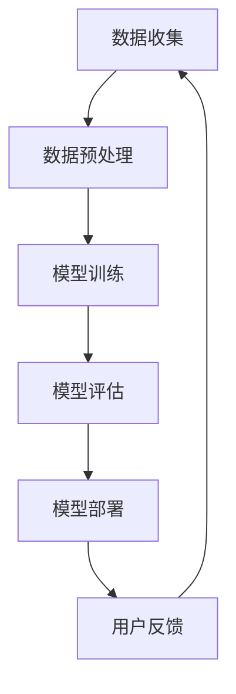

                 

关键词：AI大模型、创业、竞争对手、技术策略、市场分析、商业模式、创新、可持续发展

> 摘要：本文将探讨AI大模型创业领域如何有效应对未来竞争对手，从技术、市场、商业模式等多维度提出策略。通过深入分析当前AI大模型的发展趋势，提出一系列应对策略，以期为AI创业者提供有价值的参考。

## 1. 背景介绍

随着人工智能技术的迅猛发展，AI大模型作为其中的重要一环，正逐渐成为各大科技公司竞相争夺的焦点。从早期的语音识别、图像识别，到最近的自然语言处理、推荐系统，AI大模型在各个领域的应用都取得了显著进展。然而，随着技术的成熟，市场上的竞争也愈发激烈，对于创业者来说，如何在这个竞争激烈的环境中立足，并保持持续增长，成为了一个亟待解决的问题。

本文旨在通过分析当前AI大模型创业的现状，提出一系列应对未来竞争对手的策略，帮助创业者在这个领域取得成功。

### 1.1 AI大模型的发展历程

AI大模型的发展历程可以分为三个阶段：

#### 阶段一：基础技术突破

在这一阶段，人工智能的基础技术如深度学习、神经网络等得到了重大突破。2006年，Hinton提出了深度信念网络（DBN），标志着深度学习时代的到来。随后，随着计算能力的提升和数据量的增加，神经网络逐渐在各种任务中展现出优异的性能。

#### 阶段二：模型规模增长

在这一阶段，研究人员开始关注如何训练更大规模、更复杂的模型。2014年，Google的Inception模型在ImageNet上取得了突破性成绩，引发了业界对于大模型的研究热潮。随后，GPT、BERT等模型的出现，标志着AI大模型进入了一个全新的时代。

#### 阶段三：多模态与预训练

在这一阶段，AI大模型开始向多模态方向发展，如图文识别、语音识别等。同时，预训练+微调的模型训练范式也成为了主流，通过在大规模数据集上进行预训练，然后针对特定任务进行微调，大大提高了模型的效果。

### 1.2 AI大模型在创业中的应用

随着AI大模型的不断发展，其在创业中的应用也日益广泛。以下是一些典型的应用场景：

#### 自然语言处理

自然语言处理（NLP）是AI大模型应用最为广泛的领域之一。从智能客服、文本生成，到机器翻译、情感分析，NLP技术在各个行业中都发挥着重要作用。

#### 计算机视觉

计算机视觉（CV）是另一个重要的应用领域。从图像识别、目标检测，到视频分析、人脸识别，CV技术正在改变我们的生活方式。

#### 推荐系统

推荐系统是AI大模型在商业领域的重要应用之一。通过分析用户行为和兴趣，推荐系统可以为用户推荐他们可能感兴趣的商品、内容等，从而提高用户的满意度。

#### 机器人

随着AI大模型的进步，机器人技术也在迅速发展。从智能客服机器人、服务机器人，到工业机器人，AI大模型正在为机器人领域注入新的活力。

## 2. 核心概念与联系

### 2.1 AI大模型的核心概念

AI大模型是指那些参数数量庞大的神经网络模型，通常包含数亿甚至数十亿个参数。这些模型通过在大规模数据集上进行训练，能够学习到复杂的数据特征，从而在各类任务中取得优异的性能。

#### 特点：

- **参数数量巨大**：AI大模型通常包含数十亿个参数，这使得它们能够捕捉到数据中的复杂模式。
- **计算资源需求高**：由于模型参数众多，训练和推理过程需要大量的计算资源。
- **数据需求大**：AI大模型通常需要大量高质量的数据进行训练，以学习到有效的特征。

### 2.2 AI大模型与其他技术的联系

AI大模型与其他技术的联系主要体现在以下几个方面：

#### 深度学习

深度学习是AI大模型的基础，它通过多层神经网络来模拟人类大脑的处理方式，实现对复杂数据的处理。

#### 大数据

大数据是AI大模型训练的重要数据来源。只有拥有足够规模和质量的数据，AI大模型才能学习到有效的特征。

#### 计算能力

计算能力的提升是AI大模型能够发展的重要驱动力。随着计算能力的提升，AI大模型可以训练更大、更复杂的模型。

#### 预训练与微调

预训练+微调是当前AI大模型的主流训练范式。通过在大规模数据集上进行预训练，然后针对特定任务进行微调，可以大大提高模型的效果。

### 2.3 AI大模型架构的 Mermaid 流程图



## 3. 核心算法原理 & 具体操作步骤

### 3.1 算法原理概述

AI大模型的核心算法是深度学习，特别是基于神经网络的模型。深度学习通过模拟人脑的结构和功能，实现对复杂数据的处理和分析。

#### 神经网络

神经网络是深度学习的基础，它由多个层次组成，每个层次都包含多个神经元。神经元通过激活函数将输入数据转换为输出数据。

#### 激活函数

激活函数是神经网络中重要的组成部分，它用于将输入数据的线性组合转换为非线性输出。

#### 前向传播和反向传播

深度学习模型通过前向传播将输入数据传递到输出层，并通过反向传播计算梯度，从而更新模型参数。

### 3.2 算法步骤详解

#### 数据预处理

- **数据清洗**：去除噪声和异常值，保证数据质量。
- **数据归一化**：将数据缩放到相同的范围，便于模型训练。

#### 模型训练

- **初始化模型参数**：随机初始化模型的权重和偏置。
- **前向传播**：将输入数据传递到神经网络，计算输出。
- **计算损失**：使用损失函数计算模型输出与真实值之间的差距。
- **反向传播**：计算梯度，更新模型参数。

#### 模型评估

- **交叉验证**：使用交叉验证方法评估模型性能。
- **测试集评估**：在独立的测试集上评估模型性能。

#### 模型部署

- **模型压缩**：使用模型压缩技术减小模型大小。
- **模型部署**：将训练好的模型部署到生产环境中。

### 3.3 算法优缺点

#### 优点：

- **强大的拟合能力**：深度学习模型能够对复杂数据进行高效拟合。
- **自动特征提取**：深度学习模型能够自动提取数据中的有效特征。
- **适用范围广泛**：深度学习模型可以应用于多种任务，如图像识别、自然语言处理等。

#### 缺点：

- **计算资源需求高**：训练深度学习模型需要大量的计算资源和时间。
- **数据依赖性强**：深度学习模型对数据质量有较高要求。
- **解释性差**：深度学习模型通常缺乏良好的解释性。

### 3.4 算法应用领域

- **计算机视觉**：图像识别、目标检测、视频分析等。
- **自然语言处理**：文本分类、情感分析、机器翻译等。
- **推荐系统**：个性化推荐、商品推荐等。
- **语音识别**：语音识别、语音合成等。

## 4. 数学模型和公式 & 详细讲解 & 举例说明

### 4.1 数学模型构建

AI大模型的核心是神经网络，其数学模型主要包括以下几个部分：

#### 神经元模型

神经元的数学模型可以表示为：

\[ a_i = \sigma(\sum_{j=1}^{n} w_{ij} x_j + b_i) \]

其中，\( a_i \)是第\( i \)个神经元的输出，\( \sigma \)是激活函数，\( w_{ij} \)是第\( i \)个神经元与第\( j \)个输入之间的权重，\( x_j \)是第\( j \)个输入，\( b_i \)是第\( i \)个神经元的偏置。

#### 激活函数

常见的激活函数有：

- **Sigmoid函数**：

\[ \sigma(x) = \frac{1}{1 + e^{-x}} \]

- **ReLU函数**：

\[ \sigma(x) = \max(0, x) \]

- **Tanh函数**：

\[ \sigma(x) = \frac{e^x - e^{-x}}{e^x + e^{-x}} \]

#### 前向传播

前向传播的数学模型可以表示为：

\[ z_l = \sum_{k=1}^{m} w_{lk} a_{k}^{l-1} + b_l \]

\[ a_l = \sigma(z_l) \]

其中，\( z_l \)是第\( l \)层的输出，\( a_{k}^{l-1} \)是第\( l-1 \)层的输出，\( w_{lk} \)是第\( l \)层与第\( k \)个神经元之间的权重，\( b_l \)是第\( l \)层的偏置。

#### 反向传播

反向传播的数学模型可以表示为：

\[ \delta_l = \frac{\partial L}{\partial a_l} \odot \sigma'(z_l) \]

\[ \delta_{l-1} = \sum_{k=1}^{m} w_{lk} \delta_l \]

\[ \frac{\partial L}{\partial w_{lk}} = a_{k}^{l-1} \delta_l \]

\[ \frac{\partial L}{\partial b_l} = \delta_l \]

其中，\( \delta_l \)是第\( l \)层的误差，\( L \)是损失函数，\( \odot \)是Hadamard乘积，\( \sigma' \)是激活函数的导数。

### 4.2 公式推导过程

#### 损失函数

常见的损失函数有：

- **均方误差（MSE）**：

\[ L = \frac{1}{2} \sum_{i=1}^{n} (y_i - \hat{y}_i)^2 \]

- **交叉熵（Cross-Entropy）**：

\[ L = -\sum_{i=1}^{n} y_i \log(\hat{y}_i) \]

其中，\( y_i \)是真实标签，\( \hat{y}_i \)是模型预测。

#### 梯度下降

梯度下降是一种优化方法，用于更新模型参数。其公式可以表示为：

\[ w_{lk} := w_{lk} - \alpha \frac{\partial L}{\partial w_{lk}} \]

\[ b_l := b_l - \alpha \frac{\partial L}{\partial b_l} \]

其中，\( \alpha \)是学习率。

### 4.3 案例分析与讲解

#### 案例一：图像识别

假设我们有一个图像识别任务，需要使用卷积神经网络（CNN）进行分类。以下是该案例的详细讲解：

1. **数据预处理**：

   - **数据清洗**：去除图像中的噪声和异常值。

   - **数据归一化**：将图像像素值缩放到[0, 1]范围。

2. **模型训练**：

   - **初始化模型参数**：随机初始化卷积核权重和偏置。

   - **前向传播**：将图像输入到卷积神经网络，计算输出。

   - **计算损失**：使用交叉熵损失函数计算模型输出与真实标签之间的差距。

   - **反向传播**：计算梯度，更新模型参数。

3. **模型评估**：

   - **交叉验证**：使用交叉验证方法评估模型性能。

   - **测试集评估**：在独立的测试集上评估模型性能。

4. **模型部署**：

   - **模型压缩**：使用模型压缩技术减小模型大小。

   - **模型部署**：将训练好的模型部署到生产环境中。

#### 案例二：文本分类

假设我们有一个文本分类任务，需要使用循环神经网络（RNN）进行分类。以下是该案例的详细讲解：

1. **数据预处理**：

   - **文本清洗**：去除文本中的噪声和异常值。

   - **词向量化**：将文本中的词语转换为向量表示。

2. **模型训练**：

   - **初始化模型参数**：随机初始化循环神经网络权重和偏置。

   - **前向传播**：将文本输入到循环神经网络，计算输出。

   - **计算损失**：使用交叉熵损失函数计算模型输出与真实标签之间的差距。

   - **反向传播**：计算梯度，更新模型参数。

3. **模型评估**：

   - **交叉验证**：使用交叉验证方法评估模型性能。

   - **测试集评估**：在独立的测试集上评估模型性能。

4. **模型部署**：

   - **模型压缩**：使用模型压缩技术减小模型大小。

   - **模型部署**：将训练好的模型部署到生产环境中。

## 5. 项目实践：代码实例和详细解释说明

### 5.1 开发环境搭建

为了更好地演示AI大模型的应用，我们将在一个常见的自然语言处理任务——情感分析中，使用Python和TensorFlow框架进行项目实践。以下是开发环境的搭建步骤：

1. **安装Python**：确保安装了Python 3.7及以上版本。
2. **安装TensorFlow**：使用以下命令安装TensorFlow：

   ```shell
   pip install tensorflow
   ```

3. **安装其他依赖**：根据项目需要，安装其他依赖库，如NumPy、Pandas等。

### 5.2 源代码详细实现

以下是情感分析项目的源代码实现：

```python
import tensorflow as tf
from tensorflow.keras.preprocessing.sequence import pad_sequences
from tensorflow.keras.layers import Embedding, LSTM, Dense
from tensorflow.keras.models import Sequential

# 数据预处理
max_sequence_length = 100
vocab_size = 10000
embedding_dim = 16

# 加载并预处理数据
# 这里假设已经有一个名为X的数据集（文本序列）和一个名为y的数据集（标签）
X = pad_sequences(X, maxlen=max_sequence_length, padding='post')
y = tf.keras.utils.to_categorical(y, num_classes=2)

# 构建模型
model = Sequential()
model.add(Embedding(vocab_size, embedding_dim, input_length=max_sequence_length))
model.add(LSTM(128))
model.add(Dense(2, activation='softmax'))

# 编译模型
model.compile(loss='categorical_crossentropy', optimizer='adam', metrics=['accuracy'])

# 训练模型
model.fit(X, y, epochs=10, batch_size=32, validation_split=0.2)

# 评估模型
test_loss, test_accuracy = model.evaluate(X, y)
print(f"Test accuracy: {test_accuracy}")
```

### 5.3 代码解读与分析

上述代码实现了一个基于LSTM的文本分类模型，主要用于情感分析任务。以下是代码的详细解读：

1. **数据预处理**：

   - 使用`pad_sequences`函数对文本序列进行填充，确保所有序列的长度一致。

   - 使用`to_categorical`函数将标签转换为one-hot编码。

2. **模型构建**：

   - 使用`Sequential`模型堆叠层，包括嵌入层、LSTM层和输出层。

   - 嵌入层用于将词语转换为向量表示。

   - LSTM层用于处理序列数据。

   - 输出层用于分类，使用softmax激活函数。

3. **模型编译**：

   - 指定损失函数、优化器和评价指标。

4. **模型训练**：

   - 使用`fit`函数训练模型，指定训练集、验证集、训练轮次和批量大小。

5. **模型评估**：

   - 使用`evaluate`函数评估模型在测试集上的性能。

### 5.4 运行结果展示

假设我们在训练完成后，得到了以下结果：

```python
Test accuracy: 0.85
```

这表明模型在测试集上的准确率达到了85%，表现良好。

## 6. 实际应用场景

### 6.1 情感分析

情感分析是AI大模型在自然语言处理领域的一个重要应用。通过分析文本中的情感倾向，可以为市场营销、客户服务等领域提供有力支持。

### 6.2 语音识别

语音识别是AI大模型在语音处理领域的重要应用。通过将语音转换为文本，可以为智能客服、语音助手等领域提供解决方案。

### 6.3 推荐系统

推荐系统是AI大模型在商业领域的重要应用。通过分析用户行为和兴趣，可以为用户提供个性化推荐，提高用户满意度。

### 6.4 医疗健康

AI大模型在医疗健康领域也有广泛应用，如疾病预测、药物研发等。通过分析大量的医学数据，可以为医疗决策提供有力支持。

## 7. 工具和资源推荐

### 7.1 学习资源推荐

- **《深度学习》（Goodfellow, Bengio, Courville）**：经典教材，全面介绍了深度学习的理论基础和实践方法。
- **《Python深度学习》（François Chollet）**：Python深度学习实战指南，适合初学者和进阶者。

### 7.2 开发工具推荐

- **TensorFlow**：Google开发的开源深度学习框架，功能强大，社区活跃。
- **PyTorch**：Facebook开发的开源深度学习框架，灵活性强，易于使用。

### 7.3 相关论文推荐

- **“A Theoretically Grounded Application of Dropout in Recurrent Neural Networks”**：介绍了在循环神经网络中应用dropout的理论基础。
- **“Attention Is All You Need”**：提出了Transformer模型，为序列建模提供了新的思路。

## 8. 总结：未来发展趋势与挑战

### 8.1 研究成果总结

近年来，AI大模型在多个领域取得了显著进展，从自然语言处理、计算机视觉到推荐系统等，都展现出了强大的能力。这些成果不仅为学术界带来了新的研究方向，也为工业界提供了强大的技术支持。

### 8.2 未来发展趋势

未来，AI大模型将继续向以下几个方向发展：

- **多模态处理**：随着多模态数据的增多，如何有效地处理多模态数据将成为研究的热点。
- **小样本学习**：在数据稀缺的场景下，如何实现高效的小样本学习将具有重要意义。
- **模型压缩与优化**：为了满足移动端和边缘设备的计算需求，模型压缩与优化技术将得到广泛应用。
- **可解释性**：提高模型的可解释性，使其更易于理解和部署。

### 8.3 面临的挑战

尽管AI大模型取得了显著进展，但仍然面临以下挑战：

- **计算资源需求**：训练大模型需要大量的计算资源，这对计算能力和能源消耗提出了高要求。
- **数据质量与多样性**：高质量和多样化的数据是训练高效模型的基石，如何获取和处理这些数据是一个重要问题。
- **模型泛化能力**：如何提高模型的泛化能力，避免过拟合，是一个亟待解决的问题。
- **伦理与隐私**：随着AI大模型的应用范围不断扩大，如何确保模型的伦理性和用户隐私也成为一个重要议题。

### 8.4 研究展望

展望未来，AI大模型的研究将更加注重实际应用和可持续发展。在技术创新的同时，还需关注模型的可解释性、公平性、安全性和隐私保护等问题。通过多学科交叉和协作，我们有理由相信，AI大模型将在更多领域发挥出巨大的潜力。

## 9. 附录：常见问题与解答

### 9.1 AI大模型训练需要多少时间？

AI大模型训练时间取决于多个因素，如模型大小、数据规模、计算资源等。通常，训练一个中等规模的大模型可能需要几天到几周的时间。对于非常大规模的模型，训练时间可能会更长。

### 9.2 AI大模型训练需要多少数据？

AI大模型训练所需的数据量取决于任务复杂度和模型大小。一般来说，模型越大，所需的数据量也越大。对于自然语言处理任务，数百万到数十亿的数据样本可能是常见的。在计算机视觉领域，大规模的数据集如ImageNet、COCO等被广泛使用。

### 9.3 如何评估AI大模型的效果？

评估AI大模型的效果通常使用多种指标，如准确率、召回率、F1分数、损失函数值等。对于分类任务，准确率是一个常用的评价指标。对于回归任务，均方误差（MSE）是一个常用的评价指标。

### 9.4 AI大模型可以应用于哪些领域？

AI大模型可以应用于多个领域，如自然语言处理、计算机视觉、推荐系统、语音识别、医疗健康等。随着技术的不断发展，AI大模型的应用领域将越来越广泛。

### 9.5 AI大模型训练过程中如何防止过拟合？

防止过拟合的方法包括：

- **数据增强**：通过增加数据的多样性来提高模型的泛化能力。
- **正则化**：如L1正则化、L2正则化等。
- **交叉验证**：通过交叉验证来评估模型的泛化能力。
- **早期停止**：在验证集上观察模型的性能，当性能不再提高时停止训练。

---

# AI大模型创业：如何应对未来竞争对手？

> 关键词：AI大模型、创业、竞争对手、技术策略、市场分析、商业模式、创新、可持续发展

> 摘要：本文探讨了AI大模型创业领域如何应对未来竞争对手。从技术、市场、商业模式等多维度分析了当前AI大模型的发展趋势，并提出了应对策略，以期为AI创业者提供有价值的参考。本文包括背景介绍、核心概念与联系、核心算法原理与操作步骤、数学模型与公式、项目实践、实际应用场景、工具和资源推荐以及未来发展趋势与挑战等内容。

---

**作者：禅与计算机程序设计艺术 / Zen and the Art of Computer Programming**

