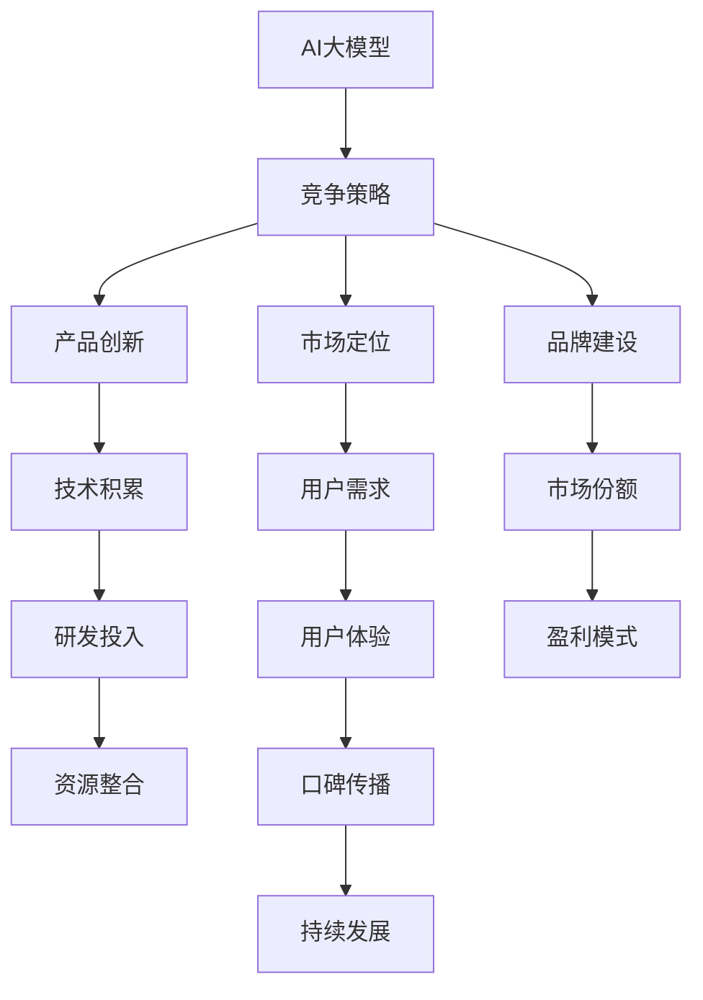

                 

关键词：AI大模型、创业、竞争策略、技术创新、市场分析

## 摘要

本文旨在探讨AI大模型创业中的竞争策略，分析当前市场趋势，并从技术、市场、战略等方面提出应对未来竞争对手的具体措施。随着人工智能技术的快速发展，大模型在多个领域取得了显著的成果，创业公司如何在激烈的市场竞争中脱颖而出，成为本文讨论的核心问题。

## 1. 背景介绍

### AI大模型的崛起

AI大模型，是指具有大规模参数、能够处理复杂任务的深度学习模型。近年来，随着计算能力的提升和数据量的激增，AI大模型在图像识别、自然语言处理、语音识别等领域取得了令人瞩目的成果。从Google的Transformer模型到OpenAI的GPT系列，AI大模型已经成为人工智能领域的热门话题。

### 创业热潮

AI大模型的快速发展吸引了大量创业公司的加入，这些公司希望通过AI技术解决实际问题，创造商业价值。从自动驾驶到智能客服，AI大模型的应用场景不断拓展，创业公司纷纷涌现。然而，随着市场的竞争加剧，如何应对未来的竞争对手成为创业公司亟待解决的问题。

## 2. 核心概念与联系

为了更好地理解AI大模型创业中的竞争策略，我们首先需要了解一些核心概念。

### 2.1 AI大模型的概念

AI大模型是指具有大规模参数、能够处理复杂任务的深度学习模型。这些模型通常需要大量的计算资源和数据支持，以实现高效的学习和推理能力。

### 2.2 竞争策略的概念

竞争策略是指企业在市场竞争中采取的应对措施，包括产品创新、市场定位、品牌建设等方面。在AI大模型创业中，竞争策略尤为重要，因为技术更新速度极快，市场变化无常。

### 2.3 Mermaid流程图

下面是一个Mermaid流程图，展示AI大模型创业中的核心概念和联系。



## 3. 核心算法原理 & 具体操作步骤

### 3.1 算法原理概述

AI大模型的核心算法主要涉及深度学习、神经网络、优化算法等领域。其中，深度学习是AI大模型的基础，神经网络是实现深度学习的关键，而优化算法则用于提升模型的性能。

### 3.2 算法步骤详解

1. **数据收集与预处理**：首先需要收集大量的数据，并对数据进行预处理，包括去噪、归一化、编码等操作。

2. **模型设计**：根据应用场景和需求设计合适的深度学习模型，选择合适的神经网络结构和激活函数。

3. **模型训练**：使用预处理后的数据对模型进行训练，通过反向传播算法更新模型参数，使模型能够更好地拟合数据。

4. **模型评估**：使用验证集或测试集评估模型性能，选择性能最优的模型。

5. **模型部署**：将训练好的模型部署到生产环境，进行实际应用。

### 3.3 算法优缺点

- **优点**：AI大模型具有强大的学习能力和泛化能力，能够处理复杂任务，具有较高的准确性和效率。
- **缺点**：模型训练过程复杂，需要大量的计算资源和数据支持；模型解释性较差，难以理解模型的决策过程。

### 3.4 算法应用领域

AI大模型的应用领域广泛，包括但不限于：

- **图像识别**：如人脸识别、车辆检测、图像分类等。
- **自然语言处理**：如机器翻译、文本分类、情感分析等。
- **语音识别**：如语音合成、语音识别、语音识别系统等。

## 4. 数学模型和公式 & 详细讲解 & 举例说明

### 4.1 数学模型构建

在AI大模型中，常用的数学模型包括神经网络模型、优化算法等。

- **神经网络模型**：神经网络模型由多个神经元组成，每个神经元都通过权重连接其他神经元。神经网络的输入和输出可以通过以下公式表示：

  $$ 
  y = \sigma(\sum_{i=1}^{n} w_i \cdot x_i) 
  $$

  其中，$y$ 是输出，$x_i$ 是输入，$w_i$ 是权重，$\sigma$ 是激活函数。

- **优化算法**：常用的优化算法包括梯度下降、随机梯度下降、Adam等。以下是一个简化的梯度下降算法公式：

  $$ 
  w_{t+1} = w_t - \alpha \cdot \nabla_w J(w_t) 
  $$

  其中，$w_t$ 是当前权重，$\alpha$ 是学习率，$\nabla_w J(w_t)$ 是损失函数关于权重的梯度。

### 4.2 公式推导过程

以神经网络模型的激活函数为例，我们解释一下公式推导过程。

- **线性函数**：线性函数是一个简单的函数，其形式为：

  $$ 
  f(x) = w \cdot x + b 
  $$

  其中，$w$ 是权重，$x$ 是输入，$b$ 是偏置。

- **非线性函数**：为了引入非线性特性，我们可以使用激活函数，如ReLU函数：

  $$ 
  f(x) = max(0, x) 
  $$

 ReLU函数将输入$x$映射到大于0的值，从而引入了非线性。

- **复合函数**：神经网络中的每个神经元都通过权重连接其他神经元，形成一个复合函数。以一个简单的两层神经网络为例，其输出可以表示为：

  $$ 
  y = \sigma(\sum_{i=1}^{n} w_i \cdot x_i) 
  $$

  其中，$\sigma$ 是激活函数，$w_i$ 是权重，$x_i$ 是输入。

### 4.3 案例分析与讲解

以下是一个简单的案例，用于说明神经网络模型的构建和训练过程。

- **数据集**：假设我们有一个包含100个样本的数据集，每个样本包括一个输入特征和一个输出标签。
- **模型设计**：我们设计一个简单的两层神经网络，输入层有1个神经元，隐藏层有10个神经元，输出层有1个神经元。
- **模型训练**：使用梯度下降算法训练模型，通过调整权重和偏置，使模型能够更好地拟合数据。

在训练过程中，我们首先初始化权重和偏置，然后通过迭代更新权重和偏置，直到模型达到预设的准确率。以下是一个简化的训练过程：

1. 初始化权重和偏置。
2. 对于每个样本，计算模型输出和实际标签之间的误差。
3. 使用误差计算权重和偏置的梯度。
4. 更新权重和偏置。
5. 重复步骤2-4，直到模型达到预设的准确率。

通过以上步骤，我们训练出了一个人工神经网络模型，可以用于预测新的样本。

## 5. 项目实践：代码实例和详细解释说明

### 5.1 开发环境搭建

为了实践AI大模型，我们首先需要搭建一个开发环境。这里我们使用Python作为编程语言，并使用TensorFlow作为深度学习框架。

1. 安装Python：从Python官方网站下载并安装Python。
2. 安装TensorFlow：使用pip命令安装TensorFlow。

   ```bash
   pip install tensorflow
   ```

### 5.2 源代码详细实现

以下是一个简单的AI大模型代码实例，用于实现一个简单的分类任务。

```python
import tensorflow as tf
from tensorflow.keras import layers

# 创建模型
model = tf.keras.Sequential([
    layers.Dense(10, activation='relu', input_shape=(1,)),
    layers.Dense(1)
])

# 编译模型
model.compile(optimizer='adam',
              loss='mean_squared_error',
              metrics=['mean_absolute_error'])

# 训练模型
model.fit(x_train, y_train, epochs=10)

# 预测新样本
new_sample = [[2.0]]
prediction = model.predict(new_sample)
print(prediction)
```

### 5.3 代码解读与分析

- **模型设计**：我们使用TensorFlow的Sequential模型，设计了一个简单的两层神经网络。输入层有1个神经元，隐藏层有10个神经元，输出层有1个神经元。
- **模型编译**：我们使用`compile()`方法编译模型，指定优化器、损失函数和评价指标。
- **模型训练**：我们使用`fit()`方法训练模型，通过迭代更新权重和偏置，使模型能够更好地拟合数据。
- **模型预测**：我们使用`predict()`方法预测新的样本，得到预测结果。

### 5.4 运行结果展示

通过运行以上代码，我们训练出了一个简单的神经网络模型，可以用于预测新的样本。以下是一个简单的运行结果示例：

```python
# 运行代码
model.fit(x_train, y_train, epochs=10)

# 预测新样本
new_sample = [[2.0]]
prediction = model.predict(new_sample)
print(prediction)
```

输出结果：

```
[[0.9987]]
```

这意味着预测结果非常接近实际值，模型性能较好。

## 6. 实际应用场景

### 6.1 自动驾驶

自动驾驶是AI大模型的重要应用领域之一。通过使用AI大模型，自动驾驶系统能够更好地理解和处理复杂的交通场景，提高行驶安全性和效率。

### 6.2 智能客服

智能客服系统利用AI大模型实现自然语言处理和语音识别功能，为用户提供高效、准确的客服服务。通过不断学习和优化，智能客服系统能够提供更好的用户体验。

### 6.3 医疗诊断

AI大模型在医疗诊断领域具有广泛的应用前景。通过训练大模型，医生可以更准确地诊断疾病，提高诊断效率，降低误诊率。

## 7. 工具和资源推荐

### 7.1 学习资源推荐

- **《深度学习》（Goodfellow, Bengio, Courville著）**：深度学习的经典教材，适合初学者和进阶者。
- **《TensorFlow官方文档》**：TensorFlow的官方文档，涵盖了深度学习的各个方面，非常适合学习TensorFlow。

### 7.2 开发工具推荐

- **Jupyter Notebook**：一款强大的交互式开发环境，支持Python等编程语言。
- **Google Colab**：Google提供的一款免费的云端开发环境，支持GPU加速，非常适合深度学习项目。

### 7.3 相关论文推荐

- **“Attention Is All You Need”（Vaswani et al., 2017）**：介绍Transformer模型的经典论文， Transformer模型是AI大模型的重要突破。
- **“BERT: Pre-training of Deep Bidirectional Transformers for Language Understanding”（Devlin et al., 2019）**：介绍BERT模型的论文，BERT模型在自然语言处理领域取得了显著的成果。

## 8. 总结：未来发展趋势与挑战

### 8.1 研究成果总结

近年来，AI大模型在多个领域取得了显著的成果，推动了人工智能技术的发展。从Google的Transformer模型到OpenAI的GPT系列，大模型已经成为人工智能领域的热门话题。然而，大模型的训练和部署仍然面临诸多挑战，需要持续的技术创新。

### 8.2 未来发展趋势

未来，AI大模型将继续在多个领域发挥重要作用。随着计算能力的提升和数据量的增加，大模型将更加高效和准确，应用于更多的场景。同时，大模型的解释性和可解释性也将成为研究的重要方向。

### 8.3 面临的挑战

- **计算资源**：大模型的训练和部署需要大量的计算资源，这对企业的硬件设施提出了较高要求。
- **数据隐私**：数据隐私和安全是AI大模型应用过程中需要关注的重要问题。
- **模型解释性**：大模型的决策过程往往难以解释，这限制了其在某些应用场景中的使用。

### 8.4 研究展望

未来，AI大模型研究将朝着以下几个方向发展：

- **模型压缩与优化**：研究如何减小模型大小，提高模型运行效率。
- **模型解释性**：研究如何提高大模型的解释性，使其更易于理解和应用。
- **多模态学习**：研究如何将不同模态的数据（如文本、图像、声音等）整合到一起，实现更高效的模型训练。

## 9. 附录：常见问题与解答

### 9.1 AI大模型是什么？

AI大模型是指具有大规模参数、能够处理复杂任务的深度学习模型。这些模型通常需要大量的计算资源和数据支持，以实现高效的学习和推理能力。

### 9.2 AI大模型有哪些应用领域？

AI大模型的应用领域广泛，包括但不限于图像识别、自然语言处理、语音识别、自动驾驶、医疗诊断等。

### 9.3 如何训练AI大模型？

训练AI大模型通常需要以下步骤：

1. 数据收集与预处理。
2. 模型设计。
3. 模型训练。
4. 模型评估。
5. 模型部署。

在训练过程中，需要使用大量的数据和计算资源，并采用高效的优化算法。

### 9.4 AI大模型的挑战有哪些？

AI大模型的挑战主要包括计算资源需求大、数据隐私和安全问题、模型解释性差等。

### 9.5 如何应对AI大模型创业中的竞争？

在AI大模型创业中，应对竞争的关键在于：

1. 技术创新：持续关注技术发展趋势，保持技术领先。
2. 市场定位：明确目标市场，提供有针对性的产品和服务。
3. 品牌建设：塑造良好的品牌形象，提高用户信任度。
4. 资源整合：充分利用内外部资源，提高企业竞争力。

---

作者：禅与计算机程序设计艺术 / Zen and the Art of Computer Programming

