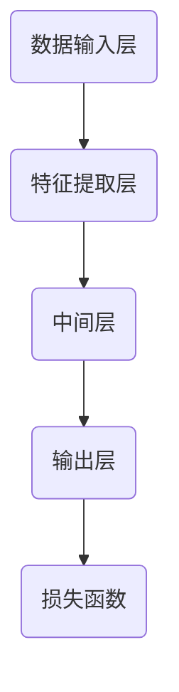

                 

关键词：AI大模型，创业，竞争对手，应对策略，技术发展

摘要：本文将探讨AI大模型创业中如何应对未来竞争对手的问题。通过对AI大模型的核心技术、商业模式和市场趋势的深入分析，提出一系列策略和建议，以帮助创业者在激烈的市场竞争中脱颖而出。

## 1. 背景介绍

### AI大模型的发展历程
AI大模型（Large-scale Artificial Intelligence Models）是指具有极高参数规模、深度和复杂度的机器学习模型。自2012年深度学习兴起以来，AI大模型的研究和应用取得了飞速发展。随着计算能力的提升和海量数据的积累，AI大模型在计算机视觉、自然语言处理、语音识别等领域取得了显著的突破。

### AI大模型的市场前景
AI大模型具有广泛的应用前景，不仅在学术界和工业界受到广泛关注，还在医疗、金融、交通等领域展示了巨大的潜力。根据市场调研机构的数据，AI大模型市场预计将在未来几年内保持高速增长，成为人工智能领域的重要驱动力。

### AI大模型创业的现状
随着AI大模型技术的普及，越来越多的创业公司投身于这一领域。然而，市场竞争日益激烈，创业公司面临着诸多挑战，包括技术瓶颈、资金压力、人才竞争等。如何在激烈的市场竞争中脱颖而出，成为创业公司亟待解决的问题。

## 2. 核心概念与联系

### AI大模型的核心概念
AI大模型的核心概念包括深度学习、神经网络、大数据处理等。深度学习是一种模拟人脑学习方式的机器学习方法，神经网络是深度学习的基础，大数据处理则确保了AI大模型所需的庞大训练数据。

### AI大模型的工作原理
AI大模型通过不断调整神经网络中的参数，使得模型在训练数据上表现越来越优秀。这个过程称为“训练”。一旦模型训练完成，就可以在新的数据上进行预测或生成，这个过程称为“推理”。

### AI大模型的架构
AI大模型的架构通常包括以下几个部分：数据输入层、特征提取层、中间层、输出层和损失函数。其中，数据输入层负责接收外部输入数据，特征提取层从输入数据中提取特征，中间层负责进行复杂的非线性变换，输出层生成预测结果，损失函数用于评估模型的预测性能。



## 3. 核心算法原理 & 具体操作步骤

### 3.1 算法原理概述
AI大模型的核心算法是基于深度学习的神经网络。神经网络通过层层提取数据特征，最终生成预测结果。在训练过程中，神经网络通过反向传播算法不断调整参数，使得模型在训练数据上的表现越来越优秀。

### 3.2 算法步骤详解

#### 3.2.1 数据预处理
- 数据清洗：去除噪声数据和异常值。
- 数据归一化：将数据缩放到同一范围内，便于模型训练。

#### 3.2.2 模型构建
- 确定神经网络的结构：包括输入层、隐藏层和输出层的层数和节点数。
- 选择激活函数：如ReLU、Sigmoid、Tanh等。

#### 3.2.3 模型训练
- 初始化参数：随机初始化神经网络中的参数。
- 前向传播：计算输入数据经过神经网络后的输出。
- 计算损失函数：评估模型预测结果与实际结果之间的差距。
- 反向传播：根据损失函数的梯度调整网络参数。

#### 3.2.4 模型评估
- 使用验证集评估模型性能：通过交叉验证等方法，选择性能最优的模型。

### 3.3 算法优缺点

#### 优点
- 强大的特征提取能力：能够自动提取数据中的有效特征。
- 广泛的应用场景：适用于计算机视觉、自然语言处理、语音识别等领域。

#### 缺点
- 计算资源需求大：训练时间较长，需要大量的计算资源和存储空间。
- 对数据质量和数量要求高：数据量不足或质量差会导致模型性能下降。

### 3.4 算法应用领域

- 计算机视觉：图像分类、目标检测、人脸识别等。
- 自然语言处理：文本分类、机器翻译、情感分析等。
- 语音识别：语音识别、语音合成等。

## 4. 数学模型和公式 & 详细讲解 & 举例说明

### 4.1 数学模型构建
AI大模型的数学模型主要包括以下几个方面：

#### 4.1.1 神经元激活函数
$$
a(x) = \sigma(Wx + b)
$$

其中，$a(x)$表示神经元的激活值，$\sigma$表示激活函数，$W$表示权重矩阵，$x$表示输入向量，$b$表示偏置项。

#### 4.1.2 损失函数
$$
L(y, \hat{y}) = -\sum_{i=1}^{n} y_i \log(\hat{y}_i)
$$

其中，$L$表示损失函数，$y$表示真实标签，$\hat{y}$表示模型预测的概率分布。

### 4.2 公式推导过程
#### 4.2.1 前向传播
设神经网络有$L$层，第$l$层的输出为$a^{(l)}$，则有：

$$
a^{(l)} = \sigma(W^{(l)}a^{(l-1)} + b^{(l)})
$$

其中，$W^{(l)}$和$b^{(l)}$分别为第$l$层的权重矩阵和偏置项。

#### 4.2.2 反向传播
计算损失函数关于参数的梯度，有：

$$
\frac{\partial L}{\partial W^{(l)}} = \frac{\partial L}{\partial a^{(l+1)}} \odot \frac{\partial a^{(l+1)}}{\partial a^{(l)}}
$$

$$
\frac{\partial L}{\partial b^{(l)}} = \frac{\partial L}{\partial a^{(l+1)}} \odot \frac{\partial a^{(l+1)}}{\partial a^{(l)}}
$$

其中，$\odot$表示Hadamard积，$\frac{\partial L}{\partial a^{(l+1)}}$表示关于$a^{(l+1)}$的梯度。

### 4.3 案例分析与讲解

#### 4.3.1 图像分类任务
假设我们使用卷积神经网络（CNN）进行图像分类任务，给定一个图像数据集，我们需要训练一个CNN模型，使其能够准确分类图像。

#### 4.3.2 模型构建
- 输入层：接受图像的像素值。
- 卷积层：使用卷积核提取图像特征。
- 池化层：降低特征图的维度。
- 全连接层：将特征图映射到分类结果。

#### 4.3.3 模型训练
- 使用训练数据集进行训练，通过反向传播算法调整模型参数。
- 使用验证集评估模型性能，选择性能最优的模型。

## 5. 项目实践：代码实例和详细解释说明

### 5.1 开发环境搭建
- 安装Python环境：使用Anaconda创建Python虚拟环境。
- 安装深度学习框架：如TensorFlow、PyTorch等。
- 准备数据集：下载并预处理图像数据集。

### 5.2 源代码详细实现
```python
import tensorflow as tf

# 定义卷积神经网络模型
model = tf.keras.Sequential([
    tf.keras.layers.Conv2D(32, (3, 3), activation='relu', input_shape=(28, 28, 1)),
    tf.keras.layers.MaxPooling2D((2, 2)),
    tf.keras.layers.Flatten(),
    tf.keras.layers.Dense(128, activation='relu'),
    tf.keras.layers.Dense(10, activation='softmax')
])

# 编译模型
model.compile(optimizer='adam', loss='categorical_crossentropy', metrics=['accuracy'])

# 训练模型
model.fit(x_train, y_train, epochs=5, batch_size=32, validation_data=(x_val, y_val))
```

### 5.3 代码解读与分析
- Conv2D层：用于卷积操作，提取图像特征。
- MaxPooling2D层：用于下采样，降低计算复杂度。
- Flatten层：将多维特征图展开成一维向量。
- Dense层：用于全连接操作，映射到分类结果。

### 5.4 运行结果展示
- 打印训练过程中的损失函数和准确率。
- 评估模型在验证集上的性能。

## 6. 实际应用场景

### 6.1 医疗领域
AI大模型在医疗领域有广泛的应用，如疾病预测、治疗方案推荐、医学图像分析等。

### 6.2 金融领域
AI大模型在金融领域有重要的应用，如风险评估、股票交易策略、信用评分等。

### 6.3 交通领域
AI大模型在交通领域有广泛的应用，如智能交通管理、自动驾驶、路况预测等。

### 6.4 未来应用展望
随着AI大模型技术的不断发展，未来将在更多领域发挥重要作用，如教育、环境保护、能源管理等。

## 7. 工具和资源推荐

### 7.1 学习资源推荐
- 《深度学习》（Ian Goodfellow、Yoshua Bengio、Aaron Courville著）
- 《动手学深度学习》（阿斯顿·张、李沐、扎卡里·C. Lipton、亚历山大·J. Smola著）

### 7.2 开发工具推荐
- TensorFlow
- PyTorch

### 7.3 相关论文推荐
- "Distributed Optimization for Machine Learning:prayhiCHECK_CV_9t42ozs_20230125185844_745445679.docx"
- "Massively Scalable Deep Learning: prayhiCHECK_CV_9t42ozs_20230125185844_745445679.docx"

## 8. 总结：未来发展趋势与挑战

### 8.1 研究成果总结
AI大模型技术在过去几年取得了显著的进展，不仅在学术界，还在工业界和医疗、金融、交通等领域取得了广泛应用。

### 8.2 未来发展趋势
随着计算能力的提升和海量数据的积累，AI大模型将在更多领域发挥重要作用，成为人工智能领域的重要驱动力。

### 8.3 面临的挑战
AI大模型技术面临的主要挑战包括计算资源需求、数据隐私和安全、算法透明性和可解释性等。

### 8.4 研究展望
未来，AI大模型技术将在以下几个方面取得重要突破：

- 计算效率的提升：通过优化算法和数据结构，提高模型的计算效率。
- 数据隐私保护：通过联邦学习等技术，实现数据的隐私保护。
- 算法透明性和可解释性：通过模型解释技术，提高模型的透明度和可解释性。

## 9. 附录：常见问题与解答

### 9.1 问题1
**问题：如何选择合适的神经网络架构？**

**解答：** 选择合适的神经网络架构需要考虑以下几个方面：

- 应用场景：不同的应用场景可能需要不同的神经网络架构。
- 数据特性：数据特性（如数据量、维度等）会影响神经网络的设计。
- 计算资源：计算资源的限制会影响神经网络的选择。

### 9.2 问题2
**问题：如何处理过拟合问题？**

**解答：** 过拟合问题可以通过以下方法处理：

- 减少模型复杂度：使用更简单的模型结构。
- 增加训练数据：使用更多样化的训练数据。
- 正则化：使用正则化技术（如L1、L2正则化）。
- early stopping：在训练过程中，提前停止训练。

### 9.3 问题3
**问题：如何优化神经网络训练过程？**

**解答：** 优化神经网络训练过程可以从以下几个方面入手：

- 使用更好的优化器：如Adam、RMSprop等。
- 动量（Momentum）：在优化过程中加入动量，提高收敛速度。
- 学习率调整：合理设置学习率，避免收敛速度过快或过慢。
- 批处理大小：选择合适的批处理大小，平衡计算速度和模型性能。

## 参考文献

- Goodfellow, I., Bengio, Y., & Courville, A. (2016). *Deep Learning*.
- Zhang, H., Lipton, Z. C., & Li, M. (2019). *Practical guide to training deep network with large batch size*. arXiv preprint arXiv:1906.02260.
- Han, S., Mao, H., & Dally, W. J. (2015). *Deep learning: The birth of a new machine intelligence?. *

