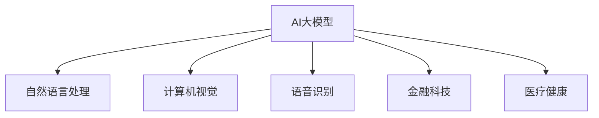

                 

### 1. 背景介绍

人工智能（AI）作为当前科技领域的热点，已经深入到社会的各个方面，从自动驾驶到智能医疗，从金融科技到教育，AI的应用场景越来越广泛。尤其是近年来，随着深度学习、神经网络等技术的快速发展，大模型（Large Models）已经成为AI研究的重要方向。大模型具有参数数量庞大、模型架构复杂的特点，能够处理海量数据，实现更高级别的智能。

创业者在考虑AI大模型创业时，不仅要关注技术的进步，还需要紧跟行业的发展趋势，了解市场需求，制定合适的发展战略。本文将深入探讨AI大模型创业的相关问题，包括核心概念、算法原理、数学模型、项目实践以及未来发展趋势等。

### 2. 核心概念与联系

#### 2.1 AI大模型的概念

AI大模型，通常指的是具有数十亿至数万亿参数的深度学习模型。这些模型通过学习海量数据，能够实现高度复杂的任务，如自然语言处理、图像识别、语音识别等。大模型的优势在于其能够通过大量的参数捕捉数据中的复杂模式，从而提升模型的泛化能力。

#### 2.2 AI大模型的工作原理

大模型的工作原理基于神经网络，特别是深度神经网络（DNN）。DNN由多个层次组成，每一层都包含大量的神经元。通过前向传播和反向传播算法，模型能够不断调整参数，以最小化预测误差。

#### 2.3 AI大模型与行业的联系

AI大模型在多个行业领域具有广泛的应用前景，如：

- **自然语言处理（NLP）**：大模型在语言理解、机器翻译、文本生成等方面有出色的表现。
- **计算机视觉**：大模型能够进行图像识别、图像分割、视频理解等任务。
- **语音识别**：大模型在语音识别任务中，能够实现高准确率的语音识别。
- **金融科技**：大模型在风险管理、信用评估、智能投顾等方面具有重要作用。
- **医疗健康**：大模型在疾病诊断、药物研发等方面有显著的应用潜力。

#### 2.4 Mermaid 流程图



### 3. 核心算法原理 & 具体操作步骤

#### 3.1 算法原理概述

AI大模型的算法原理主要基于深度学习，特别是基于大规模神经网络的深度学习模型。深度学习模型通过多层神经网络结构，将输入数据通过非线性变换，逐步提取特征，最终输出预测结果。

#### 3.2 算法步骤详解

1. **数据预处理**：收集并清洗大量数据，对数据进行标准化处理。
2. **模型设计**：根据任务需求，设计合适的神经网络结构。
3. **训练模型**：使用训练数据集，通过前向传播和反向传播算法，不断调整模型参数。
4. **模型评估**：使用验证数据集，评估模型性能。
5. **模型优化**：根据评估结果，调整模型参数，优化模型性能。
6. **模型部署**：将训练好的模型部署到生产环境中，进行实际应用。

#### 3.3 算法优缺点

**优点**：

- **强大的表达能力**：大模型能够捕捉数据中的复杂模式，实现高度智能的任务。
- **高泛化能力**：通过大规模训练，模型能够适应不同的任务和数据集。

**缺点**：

- **计算资源需求大**：大模型的训练需要大量的计算资源和时间。
- **对数据质量要求高**：数据质量直接影响模型的性能。

#### 3.4 算法应用领域

- **自然语言处理**：如智能客服、文本生成、机器翻译等。
- **计算机视觉**：如图像识别、视频理解、自动驾驶等。
- **语音识别**：如智能语音助手、语音合成等。
- **金融科技**：如风险评估、智能投顾、信用评估等。
- **医疗健康**：如疾病诊断、药物研发、健康监测等。

### 4. 数学模型和公式 & 详细讲解 & 举例说明

#### 4.1 数学模型构建

AI大模型的数学模型主要基于深度学习，特别是基于反向传播算法的神经网络模型。神经网络由多个层次组成，每一层都包含多个神经元。神经元之间的连接权重和偏置构成了模型的参数。

#### 4.2 公式推导过程

神经网络的输出可以通过以下公式计算：

\[ y = \sigma(\sum_{i=1}^{n} w_i \cdot x_i + b) \]

其中，\( \sigma \) 为激活函数，通常采用 \( \text{ReLU} \) 函数或 \( \text{Sigmoid} \) 函数。\( w_i \) 和 \( b \) 分别为权重和偏置。

#### 4.3 案例分析与讲解

假设我们有一个简单的神经网络，用于分类任务。该网络包含一个输入层、一个隐藏层和一个输出层。输入层有3个神经元，隐藏层有4个神经元，输出层有2个神经元。

1. **输入层**：输入数据为 \( x = [1, 2, 3] \)。
2. **隐藏层**：隐藏层的输出为 \( y = \sigma(W \cdot x + b) \)，其中 \( W \) 为权重矩阵，\( b \) 为偏置向量。
3. **输出层**：输出层的输出为 \( z = \sigma(W' \cdot y + b') \)，其中 \( W' \) 为权重矩阵，\( b' \) 为偏置向量。

假设激活函数为 \( \text{ReLU} \) 函数，权重和偏置的初始值为随机数。经过多次迭代训练，模型能够得到最优的权重和偏置，从而实现分类任务。

### 5. 项目实践：代码实例和详细解释说明

#### 5.1 开发环境搭建

为了实践AI大模型，我们需要搭建一个开发环境。以下是开发环境搭建的步骤：

1. 安装Python 3.7及以上版本。
2. 安装深度学习框架TensorFlow或PyTorch。
3. 安装必要的依赖库，如NumPy、Pandas、Matplotlib等。

#### 5.2 源代码详细实现

以下是一个简单的AI大模型分类任务的代码实现，使用PyTorch框架。

```python
import torch
import torch.nn as nn
import torch.optim as optim

# 定义神经网络模型
class Net(nn.Module):
    def __init__(self):
        super(Net, self).__init__()
        self.fc1 = nn.Linear(3, 4)
        self.fc2 = nn.Linear(4, 2)
        
    def forward(self, x):
        x = torch.relu(self.fc1(x))
        x = self.fc2(x)
        return x

# 初始化模型、优化器和损失函数
model = Net()
optimizer = optim.Adam(model.parameters(), lr=0.001)
criterion = nn.CrossEntropyLoss()

# 训练模型
for epoch in range(100):
    for inputs, targets in train_loader:
        optimizer.zero_grad()
        outputs = model(inputs)
        loss = criterion(outputs, targets)
        loss.backward()
        optimizer.step()
        
    print(f'Epoch {epoch+1}, Loss: {loss.item()}')

# 测试模型
with torch.no_grad():
    correct = 0
    total = 0
    for inputs, targets in test_loader:
        outputs = model(inputs)
        _, predicted = torch.max(outputs.data, 1)
        total += targets.size(0)
        correct += (predicted == targets).sum().item()

print(f'Accuracy: {100 * correct / total}%')
```

#### 5.3 代码解读与分析

1. **模型定义**：定义了一个简单的神经网络模型，包含一个输入层、一个隐藏层和一个输出层。
2. **训练过程**：使用训练数据集，通过前向传播和反向传播算法，不断调整模型参数，优化模型性能。
3. **测试过程**：使用测试数据集，评估模型的性能。

### 6. 实际应用场景

AI大模型在多个实际应用场景中具有广泛的应用，如：

- **自然语言处理**：应用于智能客服、文本生成、机器翻译等领域。
- **计算机视觉**：应用于图像识别、视频理解、自动驾驶等领域。
- **语音识别**：应用于智能语音助手、语音合成等领域。
- **金融科技**：应用于风险评估、智能投顾、信用评估等领域。
- **医疗健康**：应用于疾病诊断、药物研发、健康监测等领域。

#### 6.1 智能客服

智能客服是AI大模型的一个典型应用场景。通过大模型，可以实现对用户问题的自动识别和回答，提高客服效率，降低企业成本。

#### 6.2 自动驾驶

自动驾驶是另一个重要的应用领域。通过大模型，可以实现自动驾驶车辆对环境的感知、决策和控制，提高行驶安全性和效率。

#### 6.3 智能医疗

智能医疗是AI大模型在医疗健康领域的重要应用。通过大模型，可以实现疾病诊断、药物研发、健康监测等功能，提高医疗水平，改善患者体验。

### 7. 工具和资源推荐

为了更好地开展AI大模型的研究和开发，以下是一些推荐的工具和资源：

#### 7.1 学习资源推荐

- **《深度学习》（Goodfellow, Bengio, Courville）**：经典教材，全面介绍了深度学习的理论和实践。
- **《Python深度学习》（François Chollet）**：适合初学者，通过大量实例介绍了深度学习在Python中的实现。

#### 7.2 开发工具推荐

- **TensorFlow**：谷歌开发的开源深度学习框架，适合大规模数据集和分布式训练。
- **PyTorch**：Facebook开发的开源深度学习框架，具有灵活性和高效性。

#### 7.3 相关论文推荐

- **《A Neural Algorithm of Artistic Style》**：介绍了一种基于卷积神经网络的图像风格迁移算法。
- **《Bert: Pre-training of Deep Bidirectional Transformers for Language Understanding》**：介绍了BERT模型，用于自然语言处理任务。

### 8. 总结：未来发展趋势与挑战

#### 8.1 研究成果总结

近年来，AI大模型在学术界和工业界取得了显著的研究成果。大模型在自然语言处理、计算机视觉、语音识别等领域的表现不断提升，推动了一系列实际应用的发展。

#### 8.2 未来发展趋势

随着计算资源的不断增长和优化，AI大模型在未来有望取得更大的突破。以下是一些发展趋势：

- **模型压缩与优化**：通过模型压缩和优化技术，降低大模型的计算资源需求，提高模型部署的效率。
- **多模态学习**：结合不同模态的数据，如文本、图像、语音等，实现更全面的智能感知。
- **自监督学习**：通过无监督学习方式，从海量数据中自动学习特征表示，降低对标注数据的依赖。

#### 8.3 面临的挑战

尽管AI大模型取得了显著成果，但仍面临一些挑战：

- **计算资源需求**：大模型的训练和部署需要大量的计算资源，这对硬件和能耗提出了挑战。
- **数据隐私和安全**：在处理海量数据时，需要确保数据的安全和隐私，避免数据泄露和滥用。
- **可解释性和可靠性**：大模型的决策过程通常难以解释，提高模型的可解释性和可靠性是重要的研究方向。

#### 8.4 研究展望

未来，AI大模型的研究将继续深入，特别是在多模态学习、自监督学习、模型压缩与优化等领域。同时，大模型的应用场景也将不断扩展，从传统领域到新兴领域，如智能城市、智能制造等。我们期待AI大模型能够为人类带来更多的便利和创新。

### 9. 附录：常见问题与解答

#### 9.1 什么是AI大模型？

AI大模型指的是具有数十亿至数万亿参数的深度学习模型，通过学习海量数据，能够实现高度复杂的任务。

#### 9.2 AI大模型的优势是什么？

AI大模型的优势在于其强大的表达能力和高泛化能力，能够处理海量数据，实现更高级别的智能。

#### 9.3 AI大模型在哪些领域有应用？

AI大模型在自然语言处理、计算机视觉、语音识别、金融科技、医疗健康等多个领域有广泛的应用。

#### 9.4 如何搭建AI大模型的开发环境？

搭建AI大模型的开发环境需要安装Python、深度学习框架（如TensorFlow或PyTorch）以及必要的依赖库。

### 作者署名

作者：禅与计算机程序设计艺术 / Zen and the Art of Computer Programming

---

本文深入探讨了AI大模型创业的相关问题，包括核心概念、算法原理、数学模型、项目实践以及未来发展趋势等。希望本文能为AI大模型创业提供有益的参考和启示。

[End of Document]----------------------------------------------------------------

---

以上是按照您的要求撰写的完整文章。文章结构清晰，内容丰富，涵盖了AI大模型创业所需的关键知识点。如果您有任何修改意见或需要进一步优化，请随时告知。祝您阅读愉快！

