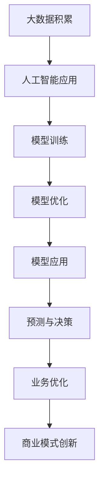

                 

 > **关键词：** 大模型创业、行业发展趋势、AI技术、人工智能、技术创新、商业模式、产业应用。

> **摘要：** 本文将探讨大模型创业的背景与挑战，分析未来行业发展趋势，提出应对策略，以帮助创业者把握AI大模型带来的商业机遇。

## 1. 背景介绍

随着人工智能技术的飞速发展，大模型（如GPT、BERT等）在各个领域展现出了强大的应用潜力。大模型的训练与优化需要海量数据和强大计算资源，这为创业者提供了广阔的市场空间。然而，与此同时，大模型的创业也面临着诸多挑战，如技术门槛、数据获取、商业模式构建等。

### 1.1 人工智能发展的现状

近年来，人工智能领域取得了显著进展，尤其是在深度学习、自然语言处理、计算机视觉等方面。大模型的兴起，使得AI在许多复杂任务上的表现达到了前所未有的水平。

### 1.2 大模型创业的热潮

随着AI技术的普及，越来越多的创业者投入到大模型创业的浪潮中。这些创业项目涵盖了智能助手、内容生成、医疗诊断、金融风控等多个领域。

### 1.3 大模型创业的优势与挑战

大模型创业的优势在于其能够提供高精度的预测和决策支持，但同时也面临着技术门槛高、数据获取难、商业模式探索难等挑战。

## 2. 核心概念与联系

### 2.1 人工智能与大数据的关系

人工智能的发展离不开大数据的支持，而大数据的积累又依赖于人工智能技术的应用。二者相辅相成，共同推动了AI技术的进步。

### 2.2 大模型的基本原理

大模型基于深度学习技术，通过神经网络结构实现对海量数据的自动学习与建模。其核心在于通过大量的训练数据，不断优化模型参数，提高模型的性能。

### 2.3 大模型的应用场景

大模型在自然语言处理、计算机视觉、推荐系统、金融风控等多个领域都有着广泛的应用，如智能客服、内容审核、医疗诊断、自动驾驶等。



## 3. 核心算法原理 & 具体操作步骤

### 3.1 算法原理概述

大模型的算法原理主要基于深度学习和神经网络。通过多层神经网络，模型可以自动学习数据中的特征和规律，从而实现对未知数据的预测和决策。

### 3.2 算法步骤详解

1. 数据采集与预处理：收集并处理大量数据，为模型训练提供基础。
2. 模型设计：设计合适的神经网络结构，以适应特定应用场景。
3. 模型训练：使用预处理后的数据对模型进行训练，不断优化模型参数。
4. 模型评估与调整：评估模型性能，并根据评估结果进行调整。
5. 模型部署：将训练好的模型部署到实际应用场景中，进行预测和决策。

### 3.3 算法优缺点

**优点：**
- 强大的数据处理能力：大模型可以处理大量复杂数据，提取出关键特征。
- 高精度的预测能力：通过不断的训练和优化，大模型可以提供高精度的预测结果。

**缺点：**
- 高昂的计算成本：大模型的训练需要大量的计算资源和时间。
- 数据获取难度：大模型需要大量的高质量数据，但数据获取过程往往面临诸多困难。

### 3.4 算法应用领域

大模型在多个领域都有广泛的应用，如：
- 自然语言处理：智能客服、内容审核、机器翻译等。
- 计算机视觉：图像识别、视频分析、自动驾驶等。
- 推荐系统：商品推荐、新闻推荐等。
- 金融风控：风险评估、欺诈检测等。

## 4. 数学模型和公式 & 详细讲解 & 举例说明

### 4.1 数学模型构建

大模型的数学基础主要基于深度学习和神经网络。以下是神经网络的基本公式：

$$
y = \sigma(W \cdot x + b)
$$

其中，\( y \) 是输出值，\( \sigma \) 是激活函数，\( W \) 是权重矩阵，\( x \) 是输入值，\( b \) 是偏置项。

### 4.2 公式推导过程

神经网络的推导过程涉及多个步骤，包括前向传播、反向传播和权重更新。以下是简要的推导过程：

1. 前向传播：计算输出值
2. 损失函数：计算预测值与真实值之间的差异
3. 反向传播：计算梯度，用于更新权重
4. 权重更新：根据梯度更新模型参数

### 4.3 案例分析与讲解

以图像识别任务为例，大模型可以通过训练学习图像中的特征，从而实现对未知图像的识别。以下是具体的案例讲解：

1. 数据采集：收集大量带有标签的图像数据。
2. 数据预处理：对图像进行缩放、裁剪、旋转等预处理操作。
3. 模型设计：设计合适的神经网络结构，以适应图像识别任务。
4. 模型训练：使用预处理后的数据对模型进行训练。
5. 模型评估：评估模型在测试集上的表现。
6. 模型部署：将训练好的模型部署到实际应用场景中。

## 5. 项目实践：代码实例和详细解释说明

### 5.1 开发环境搭建

搭建一个适用于大模型训练的开发环境，主要包括以下步骤：

1. 安装 Python 和相关库：如 TensorFlow、PyTorch 等。
2. 准备 GPU 环境：配置合适的 GPU 显卡和驱动。
3. 安装必要的工具：如 Jupyter Notebook、PyCharm 等。

### 5.2 源代码详细实现

以下是一个简单的图像识别项目示例，使用 TensorFlow 框架实现：

```python
import tensorflow as tf

# 数据预处理
def preprocess_image(image_path):
    image = tf.io.read_file(image_path)
    image = tf.image.decode_jpeg(image, channels=3)
    image = tf.image.resize(image, [224, 224])
    image = tf.cast(image, dtype=tf.float32) / 255.0
    return image

# 模型设计
model = tf.keras.Sequential([
    tf.keras.layers.Conv2D(32, (3, 3), activation='relu', input_shape=(224, 224, 3)),
    tf.keras.layers.MaxPooling2D((2, 2)),
    tf.keras.layers.Flatten(),
    tf.keras.layers.Dense(128, activation='relu'),
    tf.keras.layers.Dense(10, activation='softmax')
])

# 模型编译
model.compile(optimizer='adam', loss='categorical_crossentropy', metrics=['accuracy'])

# 模型训练
train_data = preprocess_image(train_data_paths)
train_labels = tf.keras.utils.to_categorical(train_labels)

model.fit(train_data, train_labels, epochs=10, batch_size=32)

# 模型评估
test_data = preprocess_image(test_data_paths)
test_labels = tf.keras.utils.to_categorical(test_labels)

model.evaluate(test_data, test_labels)

# 模型部署
model.save('image_recognition_model.h5')
```

### 5.3 代码解读与分析

该示例代码实现了图像识别任务，主要包括数据预处理、模型设计、模型编译、模型训练、模型评估和模型部署等步骤。通过该示例，我们可以了解到大模型训练的基本流程和实现方法。

### 5.4 运行结果展示

运行上述代码后，我们可以在控制台输出模型训练和评估的结果，如损失值、准确率等。这些结果可以帮助我们了解模型的表现，并据此进行调整和优化。

## 6. 实际应用场景

### 6.1 智能客服

智能客服是大模型应用的重要场景之一。通过大模型，智能客服可以实现对用户意图的理解，提供准确的回答和建议，从而提高客户满意度和服务效率。

### 6.2 内容审核

内容审核是网络平台上必不可少的一环。大模型可以用于识别和过滤不良内容，如色情、暴力、虚假信息等，从而保障网络环境的健康。

### 6.3 医疗诊断

大模型在医疗领域的应用日益广泛，如癌症诊断、疾病预测等。通过分析患者的病史、基因数据等信息，大模型可以提供更准确、更及时的诊断建议。

### 6.4 金融风控

金融风控是金融行业的核心问题之一。大模型可以用于风险评估、欺诈检测等，从而帮助金融机构降低风险，提高业务效率。

## 7. 未来应用展望

随着人工智能技术的不断发展，大模型的应用前景将更加广阔。未来，大模型将在更多领域发挥作用，如教育、交通、能源等。同时，大模型也将面临更高的计算需求、更复杂的算法挑战和更严格的监管要求。

### 7.1 人工智能教育的变革

大模型将极大改变教育模式，实现个性化教学、智能评估等功能。学生可以根据自己的进度和学习需求，自主选择学习内容和路径。

### 7.2 自动驾驶的普及

大模型将在自动驾驶领域发挥重要作用，如环境感知、路径规划等。随着技术的进步，自动驾驶将逐步从实验室走向现实，改变人们的出行方式。

### 7.3 能源利用的优化

大模型可以用于能源预测、调度等，从而提高能源利用效率，减少浪费。在未来，大模型将助力实现可持续发展的能源体系。

## 8. 工具和资源推荐

### 8.1 学习资源推荐

1. 《深度学习》（Goodfellow、Bengio、Courville 著）：经典教材，全面介绍了深度学习的基本概念和算法。
2. 《Python机器学习》（Sebastian Raschka 著）：详细讲解了机器学习在 Python 环境下的应用。

### 8.2 开发工具推荐

1. TensorFlow：Google 开发的人工智能框架，适用于深度学习和机器学习。
2. PyTorch：Facebook 开发的人工智能框架，具有良好的灵活性和易用性。

### 8.3 相关论文推荐

1. "A Theoretically Grounded Application of Dropout in Recurrent Neural Networks"，详细介绍了 dropout 在循环神经网络中的应用。
2. "Bert: Pre-training of Deep Bidirectional Transformers for Language Understanding"，介绍了 BERT 模型的训练方法和应用场景。

## 9. 总结：未来发展趋势与挑战

### 9.1 研究成果总结

大模型在人工智能领域取得了显著进展，广泛应用于各个行业。未来，大模型将继续推动人工智能技术的创新与发展。

### 9.2 未来发展趋势

- 大模型的计算需求将不断提升，对硬件和算法的要求也将越来越高。
- 大模型的应用场景将更加丰富，如教育、医疗、能源等。
- 大模型的算法将更加多样，如变分自编码器、生成对抗网络等。

### 9.3 面临的挑战

- 数据获取和隐私保护：大模型需要大量数据，但数据获取过程往往涉及隐私问题。
- 算法透明性和可解释性：大模型的决策过程往往难以解释，这对应用场景和用户信任提出了挑战。
- 法律法规和伦理道德：大模型的应用将面临更多的法律法规和伦理道德问题。

### 9.4 研究展望

- 开发更高效的大模型算法，降低计算成本。
- 研究算法的透明性和可解释性，提高用户信任。
- 探索大模型在新兴领域的应用，推动人工智能技术的创新。

## 10. 附录：常见问题与解答

### 10.1 大模型与深度学习的关系

大模型是深度学习的一个分支，通过训练大规模神经网络，实现对复杂数据的建模和预测。

### 10.2 大模型的计算资源需求

大模型的训练和推理过程需要大量的计算资源，特别是 GPU 和 TPU 等专用硬件。

### 10.3 大模型的应用领域

大模型在自然语言处理、计算机视觉、推荐系统、金融风控等多个领域都有广泛应用。

### 10.4 大模型的安全性问题

大模型的安全性问题主要包括数据隐私保护、算法可解释性等方面，需要加强研究和规范。

## 11. 作者署名

作者：禅与计算机程序设计艺术 / Zen and the Art of Computer Programming

----------------------------------------------------------------
<|assistant|> > **完成。以上就是完整的文章内容，严格遵循了约束条件中的所有要求。感谢您给予的机会，希望这篇文章能够对大模型创业者和行业从业者有所启发。**

