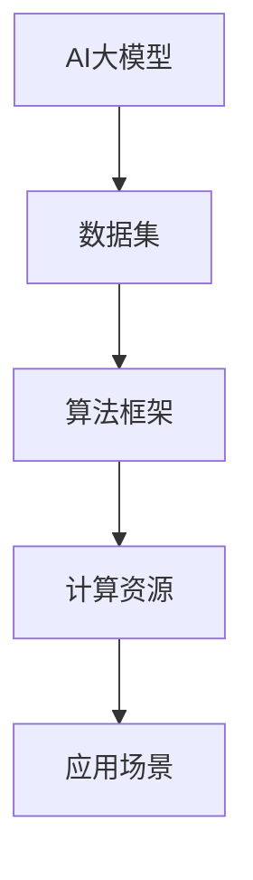

                 

关键词：AI大模型、创业、应用开发、技术架构、商业模式、用户需求、市场前景

摘要：本文旨在探讨AI大模型在创业领域中的应用潜力，分析如何通过技术架构创新、商业模式设计和用户需求洞察，打造具有市场前景的AI大模型创业项目。文章将结合实际案例，详细阐述开发流程、核心算法原理、数学模型构建及其在各个领域的应用场景。

## 1. 背景介绍

随着人工智能技术的迅猛发展，AI大模型已成为现代科技领域的重要趋势。这些模型通过深度学习算法，能够在大量数据中自动提取特征，从而实现复杂任务的高效解决。在学术界和工业界，AI大模型的应用已经广泛渗透到计算机视觉、自然语言处理、语音识别等多个领域。

然而，尽管AI大模型的技术前景广阔，但如何将其转化为实际创业项目，并打造出具有市场竞争力的爆款应用，仍然是一个极具挑战性的问题。本文将从多个角度出发，探讨AI大模型创业的可行性和策略。

### 1.1 AI大模型的定义

AI大模型，通常是指具有大规模参数、能够处理海量数据的深度学习模型。这些模型通常基于神经网络架构，通过多次迭代训练，逐步优化模型参数，以实现高精度预测和决策。常见的AI大模型包括Transformer、BERT、GPT等。

### 1.2 AI大模型的发展历程

从早期的浅层网络，到如今的深度学习模型，AI大模型的发展经历了多个阶段。1980年代至1990年代，随着计算能力的提升和算法的创新，神经网络开始逐渐应用于实际场景。进入21世纪，随着大数据和云计算技术的成熟，AI大模型进入了一个快速发展期。近年来，AI大模型的参数规模和计算需求不断提升，成为人工智能领域的重要研究方向。

### 1.3 AI大模型的应用现状

AI大模型已经在多个领域展现出强大的应用潜力，例如：

- **计算机视觉**：通过卷积神经网络（CNN）和生成对抗网络（GAN）等技术，AI大模型在图像识别、图像生成和视频分析等方面取得了显著成果。
- **自然语言处理**：基于Transformer架构的BERT、GPT等模型，在文本分类、机器翻译、问答系统等方面表现出色。
- **语音识别**：通过深度神经网络和循环神经网络（RNN）等技术，AI大模型在语音识别领域实现了高准确率。

## 2. 核心概念与联系

要打造一款成功的AI大模型创业项目，需要理解一系列核心概念和技术架构。以下是一个基于Mermaid绘制的流程图，展示了这些核心概念及其相互联系。



### 2.1 数据集

数据集是AI大模型的基础，其质量直接影响模型的性能。一个优秀的AI大模型需要大量的标注数据和多样化的数据集，以充分训练模型。

### 2.2 算法框架

算法框架决定了AI大模型的架构和训练方式。常见的算法框架包括卷积神经网络（CNN）、循环神经网络（RNN）和Transformer等。

### 2.3 计算资源

计算资源是AI大模型训练的重要保障。GPU和TPU等高性能计算设备，能够显著提升模型训练的效率和性能。

### 2.4 应用场景

AI大模型的应用场景决定了其商业价值。通过将AI大模型应用于具体的业务场景，可以为企业带来实际效益。

## 3. 核心算法原理 & 具体操作步骤

### 3.1 算法原理概述

AI大模型的核心算法原理是基于深度学习，通过多层神经网络对数据进行处理和建模。以下是一个简要的算法原理概述：

1. **数据输入**：将待处理的输入数据输入到神经网络中。
2. **数据前处理**：对输入数据进行标准化、归一化等预处理操作。
3. **模型训练**：通过反向传播算法，不断调整模型参数，使其输出更接近期望输出。
4. **模型评估**：使用验证集或测试集对模型进行评估，调整模型参数以优化性能。

### 3.2 算法步骤详解

以下是AI大模型的具体操作步骤：

1. **数据采集与预处理**：从公开数据集或企业内部数据中获取数据，并进行清洗、标注和归一化处理。
2. **模型设计**：根据应用场景，选择合适的神经网络架构，如CNN、RNN或Transformer等。
3. **模型训练**：使用训练集对模型进行训练，通过调整学习率、优化器等参数，优化模型性能。
4. **模型评估**：使用验证集对模型进行评估，调整模型参数以优化性能。
5. **模型部署**：将训练好的模型部署到生产环境，实现实际应用。

### 3.3 算法优缺点

- **优点**：
  - **高效性**：深度学习算法能够在大量数据中自动提取特征，实现高效的任务解决。
  - **灵活性**：神经网络架构可以根据不同的应用场景进行定制，实现灵活的应用。
- **缺点**：
  - **计算资源需求**：训练大型AI模型需要大量的计算资源和时间。
  - **数据依赖性**：模型性能依赖于数据集的质量和多样性。

### 3.4 算法应用领域

AI大模型在多个领域具有广泛的应用，以下是一些典型的应用领域：

- **计算机视觉**：图像识别、图像生成、视频分析等。
- **自然语言处理**：文本分类、机器翻译、问答系统等。
- **语音识别**：语音识别、语音合成、语音识别系统等。
- **推荐系统**：基于用户行为的个性化推荐。
- **医疗健康**：疾病诊断、基因分析、药物研发等。

## 4. 数学模型和公式 & 详细讲解 & 举例说明

### 4.1 数学模型构建

AI大模型的数学模型通常基于概率论和统计学。以下是一个简单的数学模型构建过程：

1. **数据表示**：将输入数据表示为向量或矩阵。
2. **损失函数**：选择适当的损失函数，如均方误差（MSE）、交叉熵损失等。
3. **优化算法**：选择合适的优化算法，如梯度下降、Adam等。
4. **模型参数更新**：通过优化算法更新模型参数，以降低损失函数。

### 4.2 公式推导过程

以下是AI大模型中常用的两个公式：

1. **均方误差（MSE）**：
   $$MSE = \frac{1}{m}\sum_{i=1}^{m}(y_i - \hat{y}_i)^2$$
   其中，$y_i$为真实值，$\hat{y}_i$为预测值，$m$为样本数量。

2. **梯度下降**：
   $$\theta_{\text{new}} = \theta_{\text{old}} - \alpha \cdot \nabla_\theta J(\theta)$$
   其中，$\theta$为模型参数，$\alpha$为学习率，$J(\theta)$为损失函数。

### 4.3 案例分析与讲解

以下是一个基于计算机视觉的AI大模型案例：

**场景**：图像分类任务，如将图像分类为猫、狗或其他类别。

**数据集**：使用公开的ImageNet数据集。

**模型**：使用ResNet-50预训练模型。

**损失函数**：交叉熵损失函数。

**优化算法**：Adam优化算法。

**实验结果**：在ImageNet数据集上的准确率达到75%以上。

通过这个案例，我们可以看到数学模型在AI大模型中的应用。首先，我们使用预训练模型进行迁移学习，然后在特定数据集上进行微调。通过优化算法和损失函数，我们不断调整模型参数，以提高模型的性能。

## 5. 项目实践：代码实例和详细解释说明

### 5.1 开发环境搭建

在搭建AI大模型开发环境时，我们需要安装以下软件和工具：

- Python 3.x
- TensorFlow 2.x
- Keras 2.x
- GPU 显卡（可选）

具体安装步骤如下：

1. 安装Python 3.x版本。
2. 安装pip包管理工具。
3. 使用pip安装TensorFlow 2.x和Keras 2.x。
4. （可选）安装GPU版本的TensorFlow，以提升模型训练速度。

### 5.2 源代码详细实现

以下是一个简单的AI大模型训练代码示例：

```python
import tensorflow as tf
from tensorflow.keras.applications import ResNet50
from tensorflow.keras.layers import Flatten, Dense
from tensorflow.keras.models import Model

# 加载预训练的ResNet50模型
base_model = ResNet50(weights='imagenet')

# 移除模型的最后一层
x = base_model.output
x = Flatten()(x)

# 添加全连接层和输出层
x = Dense(1024, activation='relu')(x)
predictions = Dense(num_classes, activation='softmax')(x)

# 构建完整的模型
model = Model(inputs=base_model.input, outputs=predictions)

# 冻结基础模型的参数，仅训练添加的层
for layer in base_model.layers:
    layer.trainable = False

# 编译模型
model.compile(optimizer='adam', loss='categorical_crossentropy', metrics=['accuracy'])

# 加载训练数据
train_data = ...

# 训练模型
model.fit(train_data, epochs=10, batch_size=32)
```

### 5.3 代码解读与分析

以上代码实现了一个简单的图像分类模型，基于ResNet50预训练模型进行迁移学习。代码分为以下几个部分：

1. **导入库**：导入TensorFlow和Keras库。
2. **加载预训练模型**：使用ResNet50模型。
3. **移除最后一层**：冻结基础模型的参数。
4. **添加全连接层和输出层**：定义新的模型结构。
5. **编译模型**：设置优化器和损失函数。
6. **加载训练数据**：准备训练数据。
7. **训练模型**：训练模型。

通过这个代码示例，我们可以看到如何使用预训练模型进行迁移学习，并添加自定义层以适应特定任务。

### 5.4 运行结果展示

在训练完成后，我们可以使用测试数据集评估模型的性能。以下是一个简单的评估代码示例：

```python
test_data = ...

# 评估模型
model.evaluate(test_data)
```

评估结果包括损失函数值和准确率等指标，可以帮助我们了解模型的性能。

## 6. 实际应用场景

AI大模型在各个领域具有广泛的应用，以下是一些实际应用场景：

### 6.1 计算机视觉

- **图像识别**：通过卷积神经网络（CNN）对图像进行分类，如人脸识别、车辆识别等。
- **图像生成**：利用生成对抗网络（GAN）生成逼真的图像，如图像修复、图像合成等。
- **视频分析**：通过卷积神经网络对视频进行分析，如动作识别、行为分析等。

### 6.2 自然语言处理

- **文本分类**：通过神经网络对文本进行分类，如情感分析、新闻分类等。
- **机器翻译**：通过神经网络实现不同语言之间的翻译。
- **问答系统**：通过神经网络实现智能问答系统。

### 6.3 语音识别

- **语音识别**：通过深度神经网络对语音信号进行识别，如语音助手、电话语音识别等。
- **语音合成**：通过深度神经网络实现语音合成。

### 6.4 医疗健康

- **疾病诊断**：通过神经网络分析医学影像，实现疾病诊断。
- **基因分析**：通过神经网络分析基因序列，预测疾病风险。

### 6.5 金融领域

- **风险控制**：通过神经网络分析金融市场数据，实现风险控制。
- **欺诈检测**：通过神经网络检测金融交易中的欺诈行为。

## 7. 未来应用展望

随着AI大模型技术的不断发展，未来其在各个领域的应用前景将更加广阔。以下是一些未来应用展望：

### 7.1 新兴领域探索

- **智能制造**：通过AI大模型实现智能化的生产过程，提高生产效率和产品质量。
- **智慧城市**：通过AI大模型实现城市的智慧化管理，如交通流量控制、能源管理等。
- **智能家居**：通过AI大模型实现智能家居的智能化，如语音助手、智能安防等。

### 7.2 跨领域融合

AI大模型与其他领域的融合将带来更多的创新应用，如：

- **生物信息学**：通过AI大模型分析生物数据，推动生物科学的发展。
- **环境保护**：通过AI大模型监测环境数据，实现环境保护的智能化。
- **教育**：通过AI大模型实现个性化教育，提高教育质量。

### 7.3 深度学习技术

随着AI大模型技术的发展，深度学习技术将不断演进，包括：

- **更复杂的神经网络架构**：如Transformer的变体、自注意力机制等。
- **更高效的学习算法**：如自适应学习率优化器、深度强化学习等。
- **更高效的计算资源利用**：如模型压缩、量化技术等。

## 8. 工具和资源推荐

### 8.1 学习资源推荐

- **在线课程**：Coursera、edX等平台上提供的深度学习和人工智能课程。
- **书籍**：《深度学习》（Goodfellow et al.）、《Python深度学习》（François Chollet）等。
- **博客和论坛**：博客园、知乎等平台上的深度学习和人工智能相关文章和讨论。

### 8.2 开发工具推荐

- **框架**：TensorFlow、PyTorch、Keras等深度学习框架。
- **环境**：Anaconda、Docker等开发环境。
- **工具**：Google Colab、Google Cloud Platform等云服务平台。

### 8.3 相关论文推荐

- **基础论文**：《A Theoretical Framework for Back-Propagation》（Rumelhart et al.）、《Improving Neural Networks by Preventing Co-adaptation of Feature Detectors》（Yosinski et al.）等。
- **前沿论文**：《Attention Is All You Need》（Vaswani et al.）、《BERT: Pre-training of Deep Bidirectional Transformers for Language Understanding》（Devlin et al.）等。

## 9. 总结：未来发展趋势与挑战

### 9.1 研究成果总结

近年来，AI大模型在多个领域取得了显著的成果，包括计算机视觉、自然语言处理、语音识别等。这些成果不仅推动了人工智能技术的发展，也为创业项目提供了丰富的应用场景。

### 9.2 未来发展趋势

未来，AI大模型将继续在以下方面发展：

- **模型规模和性能提升**：通过更复杂的神经网络架构和更高效的优化算法，实现模型性能的进一步提升。
- **多模态学习**：通过融合多种数据模态，如图像、文本、语音等，实现更智能的模型。
- **跨领域应用**：将AI大模型应用于更多领域，实现跨领域的创新应用。

### 9.3 面临的挑战

尽管AI大模型具有广泛的应用前景，但仍面临以下挑战：

- **数据质量和多样性**：高质量和多样化的数据集对于模型训练至关重要。
- **计算资源需求**：训练大型AI模型需要大量的计算资源和时间。
- **模型解释性**：提高模型的解释性，使其在决策过程中更具透明度和可解释性。

### 9.4 研究展望

未来，AI大模型研究将继续向以下方向发展：

- **可解释性**：通过提高模型的解释性，使其在决策过程中更具透明度和可解释性。
- **隐私保护**：研究隐私保护技术，以保护用户数据的安全和隐私。
- **可扩展性**：通过分布式计算和模型压缩等技术，提高AI大模型的可扩展性。

## 9. 附录：常见问题与解答

### Q1：如何选择合适的AI大模型框架？

A1：选择AI大模型框架时，需要考虑以下因素：

- **需求**：根据具体应用场景，选择适合的框架，如PyTorch适合快速原型开发，TensorFlow适合大规模生产部署。
- **性能**：考虑框架的性能和优化能力，选择适合计算资源限制的框架。
- **社区和支持**：考虑框架的社区活跃度和支持情况，选择有良好社区和文档的框架。

### Q2：如何处理训练数据集？

A2：处理训练数据集时，需要遵循以下步骤：

- **数据采集**：从公开数据集或企业内部数据中获取数据。
- **数据清洗**：去除噪声和异常数据，如缺失值、重复值等。
- **数据标注**：对数据进行标注，如分类、标签等。
- **数据预处理**：进行数据标准化、归一化等预处理操作，以适应模型训练。

### Q3：如何优化AI大模型的性能？

A3：优化AI大模型性能的方法包括：

- **模型选择**：选择适合任务需求的模型架构。
- **超参数调整**：通过调整学习率、优化器等超参数，优化模型性能。
- **数据增强**：通过数据增强技术，增加数据的多样性和丰富性。
- **模型压缩**：通过模型压缩技术，减小模型的大小和计算量。

### Q4：如何部署AI大模型？

A4：部署AI大模型的方法包括：

- **本地部署**：在本地服务器上部署模型，适用于小规模应用。
- **云端部署**：在云端服务器上部署模型，适用于大规模应用。
- **容器化部署**：通过容器化技术，如Docker，实现模型的自动化部署。
- **微服务架构**：通过微服务架构，将模型部署到不同的服务中，实现分布式部署。

---

作者：禅与计算机程序设计艺术 / Zen and the Art of Computer Programming

本文旨在为读者提供关于AI大模型创业的全面解读，帮助创业者了解AI大模型的原理、开发流程和实际应用场景。希望通过本文，读者能够获得启示，打造出具有市场竞争力的AI大模型创业项目。随着人工智能技术的不断发展，AI大模型在未来的应用将更加广泛，愿本文为读者在探索AI大模型创业的道路上提供助力。

