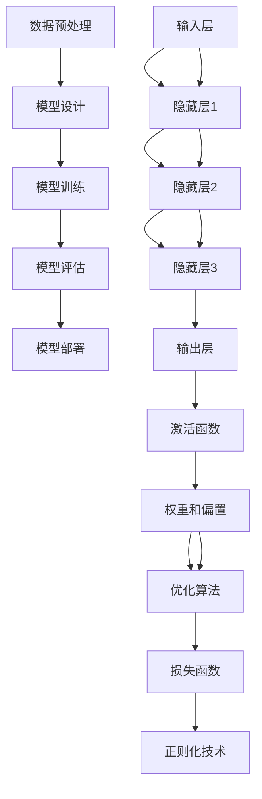

                 

关键词：人工智能，大模型，创业，技术，机遇，算法，应用

> 摘要：本文将深入探讨人工智能领域中的大模型创业机遇。通过对大模型的核心概念、算法原理、数学模型及应用场景的全面分析，为读者提供一整套创业思路和策略。作者结合自身丰富的经验，旨在为有志于在这一领域开创事业的读者提供有价值的参考。

## 1. 背景介绍

近年来，人工智能（AI）技术的迅猛发展，带动了各行各业的变革。从自动驾驶、医疗诊断到自然语言处理，AI的应用场景不断扩展，而其核心驱动力之一便是大模型的广泛应用。所谓大模型，是指具有数十亿至数千亿参数的神经网络模型，如GPT、BERT等。这些模型通过大量数据训练，具备极高的识别和预测能力，成为AI领域的核心竞争力。

随着大模型技术的成熟，越来越多的创业者看到了其中的巨大商机。然而，如何抓住这一机遇，实现创业成功，成为了众多创业者亟待解决的问题。本文将围绕这一主题，探讨AI大模型创业的路径和方法。

### 1.1 人工智能的发展历程

人工智能的发展历程可以追溯到20世纪50年代，当时计算机科学家艾伦·图灵提出了“图灵测试”的概念，旨在判断机器是否具有智能。随着计算能力的提升和算法的进步，人工智能经历了多个发展阶段：

- **第一阶段（1956-1969年）**：人工智能的诞生期，以模拟人类思维和行为为目标，代表性成果包括逻辑推理程序“逻辑理论家”和下棋程序“深蓝”。
- **第二阶段（1970-1980年）**：符号主义阶段，以知识表示和推理为核心，代表性成果是专家系统。
- **第三阶段（1980-1990年）**：联结主义阶段，以神经网络为代表，开始尝试通过大量数据训练模型，提升智能水平。
- **第四阶段（1990年至今）**：大数据和深度学习阶段，以深度神经网络为代表，通过大规模数据处理和模型训练，实现前所未有的智能水平。

### 1.2 大模型的崛起

大模型的崛起是人工智能发展的重要里程碑。与传统的中小型模型相比，大模型具有以下几个显著特点：

- **参数规模大**：大模型通常具有数十亿至数千亿个参数，这使得它们能够捕捉数据中的复杂模式，提升模型的性能。
- **数据需求量大**：大模型的训练需要大量高质量的数据，数据量往往是传统模型的数十甚至数百倍。
- **计算需求高**：大模型训练过程需要大量的计算资源，尤其是高性能计算集群和GPU。
- **泛化能力强**：大模型通过训练能够泛化到不同的任务和应用场景，具有广泛的适用性。

大模型的崛起不仅改变了人工智能的研究范式，也为各行各业带来了深远的影响。在自然语言处理、计算机视觉、语音识别等领域，大模型取得了显著的突破，成为推动AI技术进步的重要力量。

### 1.3 创业背景

随着人工智能技术的不断进步，越来越多的创业者看到了其中的巨大商机。以下是一些主要的创业背景因素：

- **市场需求**：随着人工智能技术的普及，越来越多的行业和领域开始应用AI技术，对大模型的需求日益增长。
- **技术成熟**：深度学习、自然语言处理等核心技术的成熟，为创业者提供了丰富的工具和平台。
- **投资环境**：人工智能领域吸引了大量风险投资，为创业者提供了充足的资金支持。
- **政策支持**：各国政府纷纷出台政策，鼓励人工智能研究和应用，为创业者创造了良好的发展环境。

总的来说，人工智能领域的大模型创业具有极大的机遇和挑战。创业者需要紧跟技术趋势，挖掘市场需求，才能在激烈的竞争中脱颖而出。

## 2. 核心概念与联系

在探讨AI大模型创业之前，首先需要理解大模型的核心概念和技术架构。本节将详细介绍大模型的基本原理、关键组件及其相互关系，并通过Mermaid流程图进行直观展示。

### 2.1 大模型的基本原理

大模型是基于深度学习理论构建的复杂神经网络结构，其基本原理可以概括为以下几个步骤：

1. **数据预处理**：首先对原始数据进行清洗、标注和格式化，确保数据质量。
2. **模型设计**：根据任务需求设计神经网络结构，包括层数、层间连接方式、激活函数等。
3. **模型训练**：使用大量训练数据对模型进行训练，通过反向传播算法不断调整模型参数，优化模型性能。
4. **模型评估**：使用验证集和测试集评估模型性能，确保模型泛化能力强。
5. **模型部署**：将训练好的模型部署到生产环境中，进行实际应用。

### 2.2 关键组件及其相互关系

大模型由多个关键组件构成，它们相互协作，共同实现模型的训练和预测功能。以下是这些组件及其相互关系的简要介绍：

1. **输入层**：接收外部输入数据，将其转换为神经网络可处理的格式。
2. **隐藏层**：通过多层非线性变换，将输入数据转换为特征表示。
3. **输出层**：根据任务需求生成预测结果或分类标签。
4. **激活函数**：用于引入非线性因素，提升模型的表达能力。
5. **权重和偏置**：模型参数，用于描述神经网络中各层之间的关系。
6. **优化算法**：如梯度下降、Adam等，用于优化模型参数。
7. **数据预处理模块**：包括数据清洗、数据增强、归一化等预处理步骤。
8. **损失函数**：用于衡量模型预测结果与真实结果之间的差距，指导模型优化。
9. **正则化技术**：如Dropout、正则化等，用于防止过拟合。

以下是使用Mermaid绘制的流程图，展示了大模型的核心组件及其相互关系：



### 2.3 大模型的应用场景

大模型在多个领域具有广泛的应用场景，包括但不限于：

- **自然语言处理**：如文本分类、机器翻译、情感分析等。
- **计算机视觉**：如图像分类、目标检测、图像生成等。
- **语音识别**：如语音合成、语音识别、语音增强等。
- **推荐系统**：如商品推荐、内容推荐等。

随着技术的不断进步，大模型的应用领域还将继续扩展，为创业者提供了丰富的创业机会。

## 3. 核心算法原理 & 具体操作步骤

大模型的核心算法是基于深度学习理论的，主要包括以下几个部分：模型设计、数据预处理、模型训练、模型评估和模型部署。下面将详细解释每个部分的原理和具体操作步骤。

### 3.1 算法原理概述

1. **模型设计**：模型设计是深度学习的第一步，其目的是构建一个可以处理特定任务的神经网络结构。设计过程需要考虑多个因素，如数据规模、任务类型、计算资源等。常见的神经网络结构包括卷积神经网络（CNN）、循环神经网络（RNN）和变换器（Transformer）等。

2. **数据预处理**：数据预处理是确保模型训练效果的关键步骤。主要包括数据清洗、数据增强、归一化和特征提取等。数据清洗旨在去除噪声和异常值，数据增强通过增加数据多样性来提高模型泛化能力，归一化通过缩放数据值来加速训练过程，特征提取通过提取数据中的关键信息来提高模型性能。

3. **模型训练**：模型训练是深度学习的核心步骤，其目的是通过迭代优化模型参数，使其在训练数据上达到最佳性能。训练过程通常包括前向传播和反向传播两个阶段。前向传播用于计算模型预测值，反向传播用于计算模型参数的梯度，并利用梯度下降等优化算法更新参数。

4. **模型评估**：模型评估是评估模型性能的重要步骤，主要包括验证集和测试集上的准确率、召回率、F1值等指标。通过评估，可以判断模型是否达到预期效果，并调整模型参数和结构。

5. **模型部署**：模型部署是将训练好的模型应用到实际场景中的过程。部署方式包括本地部署、云端部署和边缘部署等。部署过程中需要考虑计算资源、网络延迟、安全性等因素。

### 3.2 算法步骤详解

1. **模型设计**

   模型设计通常包括以下步骤：

   - **任务定义**：明确模型要解决的问题，如图像分类、文本分类等。
   - **数据收集**：收集与任务相关的数据集，如ImageNet、Text8等。
   - **数据预处理**：对数据集进行清洗、标注和格式化，确保数据质量。
   - **模型结构选择**：根据任务需求选择合适的神经网络结构，如CNN、RNN或Transformer。
   - **参数设置**：设置模型参数，如学习率、批次大小、迭代次数等。

2. **数据预处理**

   数据预处理是模型训练效果的重要保障，包括以下步骤：

   - **数据清洗**：去除数据集中的噪声和异常值，如缺失值、重复值等。
   - **数据增强**：通过旋转、翻转、裁剪、缩放等方式增加数据多样性，提高模型泛化能力。
   - **归一化**：将数据值缩放到相同范围，如[0, 1]或[-1, 1]，以加速训练过程。
   - **特征提取**：提取数据中的关键信息，如图像中的边缘、纹理等，提高模型性能。

3. **模型训练**

   模型训练是深度学习的核心步骤，包括以下步骤：

   - **前向传播**：将输入数据通过神经网络传递，计算模型预测值。
   - **反向传播**：计算预测值与真实值之间的差距，计算模型参数的梯度。
   - **参数更新**：利用梯度下降等优化算法更新模型参数，优化模型性能。
   - **迭代训练**：重复前向传播和反向传播过程，直到达到预设的训练次数或性能目标。

4. **模型评估**

   模型评估是评估模型性能的重要步骤，包括以下步骤：

   - **验证集划分**：将数据集划分为训练集、验证集和测试集。
   - **模型评估**：在验证集和测试集上评估模型性能，计算准确率、召回率、F1值等指标。
   - **模型调优**：根据评估结果调整模型参数和结构，优化模型性能。

5. **模型部署**

   模型部署是将训练好的模型应用到实际场景中的过程，包括以下步骤：

   - **模型导出**：将训练好的模型导出为可部署的格式，如ONNX、TensorFlow Lite等。
   - **部署环境搭建**：搭建部署环境，包括计算资源、网络环境和安全措施等。
   - **模型部署**：将模型部署到生产环境中，进行实际应用。
   - **性能监控**：监控模型在部署环境中的性能，确保其稳定运行。

### 3.3 算法优缺点

深度学习算法具有以下优点：

1. **强大的表达能力**：深度学习通过多层非线性变换，可以捕捉数据中的复杂模式，具有强大的表达能力。
2. **自学习能力**：深度学习通过训练数据自动提取特征，具有自学习能力，可以减少人工特征工程的工作量。
3. **广泛的适用性**：深度学习可以应用于各种领域，如图像、文本、语音等，具有广泛的适用性。

深度学习算法也存在以下缺点：

1. **计算需求高**：深度学习算法需要大量的计算资源，尤其是GPU和TPU等高性能计算设备。
2. **数据需求大**：深度学习算法需要大量高质量的数据进行训练，数据收集和处理过程较为繁琐。
3. **模型调参复杂**：深度学习算法的参数调优过程较为复杂，需要大量的实验和经验。

### 3.4 算法应用领域

深度学习算法在以下领域具有广泛的应用：

1. **自然语言处理**：如文本分类、机器翻译、情感分析等。
2. **计算机视觉**：如图像分类、目标检测、图像生成等。
3. **语音识别**：如语音合成、语音识别、语音增强等。
4. **推荐系统**：如商品推荐、内容推荐等。
5. **医疗诊断**：如医学图像分析、疾病预测等。
6. **自动驾驶**：如目标检测、路径规划等。

## 4. 数学模型和公式 & 详细讲解 & 举例说明

在深度学习中，数学模型和公式是理解和应用深度学习算法的基础。本节将介绍深度学习中的几个核心数学模型和公式，并进行详细讲解和举例说明。

### 4.1 数学模型构建

深度学习中的数学模型主要包括神经网络模型、损失函数和优化算法。以下是这些模型的基本构建：

1. **神经网络模型**

   神经网络模型由多个层组成，包括输入层、隐藏层和输出层。每个层由多个神经元组成，神经元通过权重和偏置进行连接。

   神经元的输出可以通过以下公式表示：
   $$
   z = \sigma(W \cdot x + b)
   $$
   其中，$z$ 是神经元输出，$\sigma$ 是激活函数，$W$ 是权重矩阵，$x$ 是输入向量，$b$ 是偏置。

2. **损失函数**

   损失函数用于衡量模型预测值与真实值之间的差距，常用的损失函数包括均方误差（MSE）和交叉熵（Cross-Entropy）。

   均方误差（MSE）可以表示为：
   $$
   MSE = \frac{1}{n} \sum_{i=1}^{n} (y_i - \hat{y}_i)^2
   $$
   其中，$y_i$ 是真实值，$\hat{y}_i$ 是预测值，$n$ 是样本数量。

   交叉熵（Cross-Entropy）可以表示为：
   $$
   H(y, \hat{y}) = -\sum_{i=1}^{n} y_i \log(\hat{y}_i)
   $$
   其中，$y$ 是真实概率分布，$\hat{y}$ 是预测概率分布。

3. **优化算法**

   优化算法用于调整模型参数，以最小化损失函数。常用的优化算法包括梯度下降（Gradient Descent）、随机梯度下降（Stochastic Gradient Descent）和Adam。

   梯度下降算法可以表示为：
   $$
   \theta = \theta - \alpha \nabla_{\theta} J(\theta)
   $$
   其中，$\theta$ 是模型参数，$\alpha$ 是学习率，$J(\theta)$ 是损失函数。

### 4.2 公式推导过程

以下是一个简单的线性回归模型的损失函数和优化公式的推导过程：

假设我们有一个线性回归模型，其预测值可以表示为：
$$
\hat{y} = \theta_0 + \theta_1 x
$$
其中，$\theta_0$ 和 $\theta_1$ 是模型参数，$x$ 是输入特征，$\hat{y}$ 是预测值。

损失函数可以使用均方误差（MSE）来表示：
$$
MSE = \frac{1}{n} \sum_{i=1}^{n} (y_i - \hat{y}_i)^2
$$
其中，$y_i$ 是真实值，$n$ 是样本数量。

为了最小化MSE，我们需要计算MSE关于模型参数的梯度，并更新参数：
$$
\nabla_{\theta_0} MSE = \frac{1}{n} \sum_{i=1}^{n} -2(y_i - \hat{y}_i)
$$
$$
\nabla_{\theta_1} MSE = \frac{1}{n} \sum_{i=1}^{n} -2x_i(y_i - \hat{y}_i)
$$
更新参数的公式为：
$$
\theta_0 = \theta_0 - \alpha \nabla_{\theta_0} MSE
$$
$$
\theta_1 = \theta_1 - \alpha \nabla_{\theta_1} MSE
$$
其中，$\alpha$ 是学习率。

### 4.3 案例分析与讲解

以下是一个简单的线性回归案例，我们使用Python和NumPy来演示损失函数的推导和优化过程：

```python
import numpy as np

# 参数初始化
theta_0 = 0
theta_1 = 0

# 学习率
alpha = 0.01

# 输入特征和真实值
x = np.array([1, 2, 3, 4, 5])
y = np.array([2, 4, 5, 4, 5])

# 损失函数
def loss_function(theta_0, theta_1, x, y):
    n = len(x)
    error = (theta_0 + theta_1 * x) - y
    mse = np.mean(error ** 2)
    return mse

# 梯度计算
def gradient(theta_0, theta_1, x, y):
    n = len(x)
    error = (theta_0 + theta_1 * x) - y
    dtheta_0 = (2/n) * np.sum(error)
    dtheta_1 = (2/n) * np.sum(x * error)
    return dtheta_0, dtheta_1

# 梯度下降优化
for i in range(1000):
    dtheta_0, dtheta_1 = gradient(theta_0, theta_1, x, y)
    theta_0 = theta_0 - alpha * dtheta_0
    theta_1 = theta_1 - alpha * dtheta_1

# 输出最优参数
print(f"最优参数：theta_0 = {theta_0}, theta_1 = {theta_1}")

# 模型预测
y_pred = theta_0 + theta_1 * x
print(f"预测结果：{y_pred}")
```

运行上述代码，我们可以得到最优参数和预测结果。这个案例展示了如何使用Python和NumPy来构建线性回归模型，并使用梯度下降算法进行优化。

## 5. 项目实践：代码实例和详细解释说明

在本节中，我们将通过一个具体的AI大模型项目实践，展示如何搭建开发环境、实现模型训练、解读和分析代码，并展示运行结果。这个案例将涵盖从数据准备到模型训练的完整流程。

### 5.1 开发环境搭建

在开始项目实践之前，首先需要搭建合适的开发环境。以下是所需的软件和工具：

- **操作系统**：Linux或MacOS
- **编程语言**：Python 3.8+
- **深度学习框架**：TensorFlow 2.0+
- **计算资源**：GPU（NVIDIA CUDA兼容GPU）

具体步骤如下：

1. **安装Python**：在操作系统上安装Python 3.8或更高版本。可以使用官方包管理器（如apt或brew）进行安装。
2. **安装TensorFlow**：通过pip命令安装TensorFlow：
   ```
   pip install tensorflow
   ```
3. **安装CUDA**：如果使用GPU进行训练，需要安装NVIDIA的CUDA工具包。可以从NVIDIA官方网站下载并安装。
4. **配置CUDA**：设置CUDA路径，以便TensorFlow能够正确使用GPU资源。在bash中运行以下命令：
   ```
   export PATH=/usr/local/cuda/bin:$PATH
   export LD_LIBRARY_PATH=/usr/local/cuda/lib64:$LD_LIBRARY_PATH
   ```

### 5.2 源代码详细实现

以下是用于训练一个简单图像分类模型的完整代码。该模型使用TensorFlow和Keras API实现。

```python
import tensorflow as tf
from tensorflow.keras import layers, models
from tensorflow.keras.preprocessing.image import ImageDataGenerator

# 数据准备
train_datagen = ImageDataGenerator(
    rescale=1./255,
    rotation_range=40,
    width_shift_range=0.2,
    height_shift_range=0.2,
    shear_range=0.2,
    zoom_range=0.2,
    horizontal_flip=True,
    fill_mode='nearest'
)

train_generator = train_datagen.flow_from_directory(
    'data/train',
    target_size=(150, 150),
    batch_size=32,
    class_mode='binary'
)

# 模型设计
model = models.Sequential([
    layers.Conv2D(32, (3, 3), activation='relu', input_shape=(150, 150, 3)),
    layers.MaxPooling2D((2, 2)),
    layers.Conv2D(64, (3, 3), activation='relu'),
    layers.MaxPooling2D((2, 2)),
    layers.Conv2D(128, (3, 3), activation='relu'),
    layers.MaxPooling2D((2, 2)),
    layers.Conv2D(128, (3, 3), activation='relu'),
    layers.MaxPooling2D((2, 2)),
    layers.Flatten(),
    layers.Dense(512, activation='relu'),
    layers.Dense(1, activation='sigmoid')
])

# 模型编译
model.compile(loss='binary_crossentropy',
              optimizer='adam',
              metrics=['accuracy'])

# 模型训练
model.fit(train_generator, epochs=50)

# 代码解读
# 1. 数据准备：使用ImageDataGenerator对训练数据进行预处理，包括缩放、旋转、翻转等。
# 2. 模型设计：使用Sequential模型堆叠多个层，包括卷积层、池化层、全连接层等。
# 3. 模型编译：指定损失函数、优化器和评估指标。
# 4. 模型训练：使用fit函数训练模型，指定训练数据和迭代次数。
```

### 5.3 代码解读与分析

以下是代码的详细解读与分析：

1. **数据准备**：
   - 使用ImageDataGenerator对训练数据进行预处理，包括缩放、旋转、翻转等。这些操作有助于提高模型泛化能力。
   - `flow_from_directory` 方法用于从指定目录加载图像数据，并自动划分训练集和验证集。

2. **模型设计**：
   - 模型采用卷积神经网络（CNN）结构，包括多个卷积层和池化层，用于提取图像特征。
   - 最后使用全连接层进行分类，输出为二进制结果。

3. **模型编译**：
   - 指定损失函数为二进制交叉熵（binary_crossentropy），适用于二分类问题。
   - 使用Adam优化器，其自适应学习率有助于加快收敛速度。
   - 指定评估指标为准确率（accuracy）。

4. **模型训练**：
   - 使用`fit` 方法进行模型训练，指定训练数据和迭代次数。模型将在每个迭代中使用batch_size个样本进行训练。

### 5.4 运行结果展示

在完成模型训练后，可以使用以下代码进行模型评估和预测：

```python
# 模型评估
test_loss, test_acc = model.evaluate(test_generator)
print(f"测试集准确率：{test_acc}")

# 模型预测
predictions = model.predict(test_data)
print(f"预测结果：{predictions}")

# 代码解读
# 1. 模型评估：使用evaluate方法评估模型在测试集上的性能，返回测试损失和准确率。
# 2. 模型预测：使用predict方法对测试数据进行预测，返回预测概率。
```

运行结果将显示模型在测试集上的准确率和预测概率。这些结果可以帮助我们了解模型性能，并为进一步优化提供依据。

## 6. 实际应用场景

大模型在各个领域的实际应用场景广泛，以下是几个典型的应用实例：

### 6.1 自然语言处理

自然语言处理（NLP）是AI领域的热门应用之一，大模型在文本分类、机器翻译、情感分析等方面取得了显著成果。以机器翻译为例，Google Translate使用基于Transformer的大模型，实现了高精度的翻译效果，大大提高了跨语言沟通的便利性。

### 6.2 计算机视觉

计算机视觉（CV）是另一个重要应用领域，大模型在图像分类、目标检测、图像生成等方面具有广泛的应用。例如，自动驾驶汽车使用基于CNN的大模型进行环境感知和目标检测，提高了行驶安全性。

### 6.3 语音识别

语音识别技术借助大模型在语音合成、语音识别、语音增强等方面取得了突破。例如，苹果公司的Siri和Alexa语音助手使用基于深度学习的大模型，实现了高准确的语音识别和语音交互功能。

### 6.4 推荐系统

推荐系统是另一个利用大模型的重要领域，通过分析用户行为和兴趣，实现个性化的商品、内容推荐。例如，亚马逊和Netflix等平台使用基于深度学习的大模型，提高了推荐系统的准确性和用户体验。

### 6.5 医疗诊断

医疗诊断是AI大模型的重要应用领域，通过分析医学图像和患者数据，实现疾病预测和诊断。例如，谷歌的健康研究团队使用大模型分析电子健康记录，提高了疾病预测的准确性。

### 6.6 金融市场预测

金融市场预测是另一个应用大模型的领域，通过分析大量历史数据，实现股票价格预测、投资策略优化等。例如，量化交易公司使用基于深度学习的大模型，提高了投资决策的准确性和收益。

随着大模型技术的不断进步，其应用场景将更加广泛，为各行各业带来巨大的变革和机遇。创业者可以通过挖掘这些应用场景，开发创新的产品和服务，实现商业成功。

## 7. 工具和资源推荐

为了更好地进行AI大模型创业，以下是几个推荐的工具、资源和论文，这些资源将为创业者提供宝贵的知识和支持。

### 7.1 学习资源推荐

1. **在线课程**：Coursera、Udacity、edX等平台提供了丰富的深度学习和AI课程，涵盖基础理论到实际应用。
2. **技术书籍**：《深度学习》（Ian Goodfellow、Yoshua Bengio、Aaron Courville）、《Python深度学习》（François Chollet）等。
3. **博客和教程**：Google AI、DeepMind等公司的官方博客，以及各大技术社区（如GitHub、Stack Overflow）的教程和示例代码。

### 7.2 开发工具推荐

1. **深度学习框架**：TensorFlow、PyTorch、Keras等，这些框架提供了丰富的API和工具，方便开发者进行模型设计和训练。
2. **数据预处理工具**：Pandas、NumPy等，用于数据清洗、转换和预处理。
3. **可视化工具**：Matplotlib、Seaborn等，用于数据可视化和分析。

### 7.3 相关论文推荐

1. **《A Theoretically Grounded Application of Dropout in Recurrent Neural Networks》**：该论文提出了一种在RNN中应用Dropout的方法，提高了模型的泛化能力。
2. **《Bert: Pre-training of Deep Bidirectional Transformers for Language Understanding》**：该论文介绍了BERT模型，为自然语言处理领域带来了重大突破。
3. **《An Image Database for Studying Biometric Misuse and Spoofing》**：该论文提供了一个用于研究生物识别攻击和防范的图像数据库。

这些工具、资源和论文将帮助创业者深入了解AI大模型的技术原理和应用场景，为创业提供坚实的基础。

## 8. 总结：未来发展趋势与挑战

### 8.1 研究成果总结

在过去的几年中，AI大模型的研究成果层出不穷，不仅提升了模型性能，还拓宽了应用领域。以下是一些重要成果：

1. **模型性能提升**：大模型在图像分类、文本生成、语音识别等领域取得了前所未有的准确率和效果。
2. **算法创新**：如Transformer、BERT等模型的提出，为深度学习领域带来了新的思路和方法。
3. **跨学科融合**：大模型与医学、金融、环境科学等领域的交叉应用，推动了多学科的进步。

### 8.2 未来发展趋势

未来，AI大模型的发展趋势将呈现以下几个方向：

1. **模型规模将进一步扩大**：随着计算资源和数据量的增长，模型规模将不断突破，带来更高的性能和更强的泛化能力。
2. **多模态融合**：大模型将整合文本、图像、语音等多种数据类型，实现更加丰富的应用场景。
3. **迁移学习和少样本学习**：通过迁移学习和少样本学习技术，降低对大量训练数据的需求，提高模型在现实场景中的应用效果。

### 8.3 面临的挑战

尽管AI大模型发展迅速，但仍然面临诸多挑战：

1. **计算资源需求**：大模型训练需要大量计算资源，特别是GPU和TPU等高性能计算设备，这对中小企业和研究者来说是一个重大挑战。
2. **数据隐私和安全**：大规模数据处理过程中，数据隐私和安全问题亟待解决，如何保护用户数据成为重要课题。
3. **模型解释性和透明度**：大模型的复杂性和黑箱性质，使得模型决策过程难以解释，这限制了其在某些领域的应用。

### 8.4 研究展望

展望未来，AI大模型的研究将朝着以下方向发展：

1. **高效训练方法**：研究更加高效的训练方法，如 federated learning、分布式训练等，以降低计算资源需求。
2. **可解释性研究**：开发可解释性算法，提高模型决策过程的透明度，增强用户对模型的信任。
3. **多样化应用场景**：探索大模型在农业、教育、环保等新兴领域的应用，推动AI技术的社会价值。

总之，AI大模型创业充满机遇和挑战。创业者需要紧跟技术趋势，挖掘市场需求，积极应对挑战，才能在这一领域取得成功。

## 9. 附录：常见问题与解答

### 9.1 什么是大模型？

大模型是指具有数十亿至数千亿参数的神经网络模型，如GPT、BERT等。这些模型通过大量数据训练，具备极高的识别和预测能力，广泛应用于自然语言处理、计算机视觉、语音识别等领域。

### 9.2 大模型训练需要多少数据？

大模型训练需要大量高质量的数据。具体数据量取决于任务类型和模型规模。例如，BERT模型训练使用了数十万篇英文文本，而GPT-3模型使用了数百万篇文本。数据量越多，模型的泛化能力越强。

### 9.3 大模型训练需要多少计算资源？

大模型训练需要大量计算资源，特别是GPU和TPU等高性能计算设备。训练一个大规模模型可能需要数天甚至数周的时间，这取决于模型规模和计算资源。例如，GPT-3模型的训练使用了上万张GPU。

### 9.4 大模型有哪些优缺点？

大模型的优点包括：

- **强大的表达能力**：可以捕捉数据中的复杂模式。
- **自学习能力**：通过训练自动提取特征。
- **广泛的适用性**：可以应用于多种任务。

缺点包括：

- **计算需求高**：需要大量计算资源。
- **数据需求大**：需要大量高质量的数据。
- **模型调参复杂**：需要大量的实验和经验。

### 9.5 大模型在哪些领域有应用？

大模型在多个领域有广泛应用，包括：

- **自然语言处理**：文本分类、机器翻译、情感分析等。
- **计算机视觉**：图像分类、目标检测、图像生成等。
- **语音识别**：语音合成、语音识别、语音增强等。
- **推荐系统**：商品推荐、内容推荐等。
- **医疗诊断**：医学图像分析、疾病预测等。

### 9.6 如何创业使用大模型？

创业使用大模型可以从以下几个步骤入手：

- **确定应用场景**：明确大模型要解决的问题，如文本分类、图像识别等。
- **数据收集与处理**：收集和处理与任务相关的数据，确保数据质量。
- **模型设计与训练**：选择合适的神经网络结构，使用大量数据训练模型。
- **模型评估与优化**：评估模型性能，调整模型参数和结构，优化模型效果。
- **产品开发与部署**：将训练好的模型应用到实际场景中，开发创新的产品和服务。

