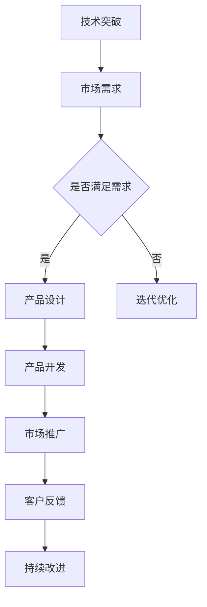

                 

关键词：AI大模型、创业机遇、未来趋势、技术解读、算法原理、应用实践

> 摘要：随着人工智能技术的不断发展，大模型在各个领域的应用日益广泛。本文将深入探讨AI大模型创业的现状与机遇，分析其核心算法原理、技术架构，并分享项目实践与未来应用展望。

## 1. 背景介绍

### AI大模型的崛起

人工智能（AI）技术作为21世纪的科技创新焦点，已经在各个领域展现出巨大的潜力。尤其是近年来，AI大模型（Large-scale AI Models）的崛起，更是引发了全球范围内的广泛关注。从早期的神经网络到如今的Transformer模型，AI大模型在图像识别、自然语言处理、语音识别等领域取得了显著进展，成为推动AI技术发展的关键力量。

### 创业热潮的兴起

随着AI大模型技术的不断成熟，越来越多的创业公司瞄准这一领域，希望通过创新技术解决实际问题，创造商业价值。从数据采集、标注，到模型训练、优化，再到应用落地，整个AI大模型产业链逐渐完善，为创业者提供了丰富的机遇。同时，资本的涌入也为AI大模型创业提供了强大的支持。

### 当前市场规模与前景

据市场研究机构预测，全球AI大模型市场规模预计将在未来几年内持续增长，达到数百亿甚至数千亿美元。随着技术的不断进步和应用场景的拓展，AI大模型在医疗、金融、教育、零售等领域的应用潜力巨大，有望成为未来科技创新的重要驱动力。

## 2. 核心概念与联系

### 大模型的定义与分类

AI大模型通常指的是具有数十亿甚至千亿参数的神经网络模型。根据应用场景和任务需求，大模型可以分为通用大模型和专用大模型。通用大模型如GPT、BERT等，具备较强的通用性，适用于多种任务；专用大模型则针对特定领域或任务进行优化，如医疗领域的医疗影像识别模型、金融领域的风险预测模型等。

### 大模型的工作原理

大模型的工作原理基于深度学习，通过多层神经网络对大量数据进行训练，从而学习到数据的特征和规律。大模型通常包含以下几个关键组成部分：

1. **输入层**：接收外部输入数据，如文本、图像等。
2. **隐藏层**：通过非线性变换，将输入数据转化为更为复杂的特征表示。
3. **输出层**：根据训练目标，输出预测结果或分类结果。

### 大模型与创业的关系

大模型技术的成熟为创业公司提供了强大的技术支持。通过开发创新的大模型算法和解决方案，创业公司可以解决实际问题，创造商业价值。同时，大模型的定制化需求也为创业者提供了丰富的市场机会。创业者可以通过以下方式抓住AI大模型创业的机遇：

1. **技术创新**：研发具有竞争力的AI大模型算法，提高模型的性能和效率。
2. **应用落地**：将大模型技术应用于特定领域，解决行业痛点。
3. **生态构建**：构建围绕大模型的生态体系，包括数据采集、标注、模型训练、应用开发等环节。

### Mermaid 流程图

下面是AI大模型创业的流程图：



## 3. 核心算法原理 & 具体操作步骤

### 3.1 算法原理概述

AI大模型的核心算法基于深度学习，主要包括以下几个关键步骤：

1. **数据预处理**：对输入数据进行清洗、归一化等处理，提高模型的训练效果。
2. **模型训练**：通过反向传播算法，不断调整模型参数，使模型在训练数据上达到最优。
3. **模型优化**：对训练好的模型进行调参和优化，提高模型的泛化能力和性能。
4. **模型部署**：将训练好的模型部署到实际应用场景中，进行推理和预测。

### 3.2 算法步骤详解

#### 3.2.1 数据预处理

数据预处理是模型训练的重要步骤，主要包括以下任务：

1. **数据清洗**：去除数据中的噪声和异常值，保证数据质量。
2. **数据归一化**：将不同尺度的数据进行归一化处理，使模型更容易训练。
3. **数据增强**：通过数据增强技术，增加数据的多样性，提高模型的泛化能力。

#### 3.2.2 模型训练

模型训练是AI大模型的核心步骤，主要包括以下任务：

1. **选择模型架构**：根据任务需求和数据特点，选择合适的模型架构。
2. **初始化参数**：初始化模型参数，为模型训练提供初始状态。
3. **前向传播**：将输入数据通过模型前向传播，计算输出结果。
4. **反向传播**：计算损失函数，并通过反向传播算法调整模型参数。
5. **迭代训练**：不断迭代训练过程，直至模型收敛。

#### 3.2.3 模型优化

模型优化是提高模型性能的关键步骤，主要包括以下任务：

1. **超参数调优**：调整学习率、批量大小等超参数，优化模型训练效果。
2. **结构优化**：通过模型剪枝、神经网络压缩等技术，优化模型结构和参数。
3. **迁移学习**：利用预训练模型进行迁移学习，提高新任务的性能。

#### 3.2.4 模型部署

模型部署是将训练好的模型应用到实际场景的关键步骤，主要包括以下任务：

1. **模型转换**：将训练好的模型转换为可部署的格式，如TensorRT、ONNX等。
2. **推理优化**：通过模型量化、模型剪枝等技术，优化模型推理性能。
3. **部署环境搭建**：搭建模型部署环境，包括服务器、GPU等硬件设备。
4. **模型监控**：实时监控模型运行状态，保证模型稳定运行。

### 3.3 算法优缺点

#### 优点

1. **强大的泛化能力**：大模型通过训练大量数据，具有更强的泛化能力，可以应对不同任务和场景。
2. **高效的性能表现**：大模型在图像识别、自然语言处理等任务上取得了显著的性能提升，为实际应用提供了强大支持。
3. **丰富的应用场景**：大模型可以应用于各个领域，如医疗、金融、教育、零售等，具有广泛的应用前景。

#### 缺点

1. **计算资源需求大**：大模型需要大量的计算资源和存储空间，对硬件设备要求较高。
2. **训练时间较长**：大模型训练时间较长，需要大量时间和计算资源。
3. **数据依赖性高**：大模型对数据质量要求较高，数据不足或质量差可能导致模型性能下降。

### 3.4 算法应用领域

AI大模型在各个领域都有着广泛的应用，以下是一些典型应用场景：

1. **图像识别**：大模型在图像识别任务中表现出色，可以应用于人脸识别、车辆识别、医学影像分析等领域。
2. **自然语言处理**：大模型在自然语言处理任务中具有强大的能力，可以应用于机器翻译、文本分类、情感分析等领域。
3. **语音识别**：大模型在语音识别任务中取得了显著进展，可以应用于智能客服、语音助手等领域。
4. **推荐系统**：大模型可以应用于推荐系统，提高推荐精度和用户体验。
5. **金融风控**：大模型可以应用于金融风控，提高风险识别和预测能力。
6. **医疗健康**：大模型可以应用于医疗健康领域，如疾病预测、基因分析等。

## 4. 数学模型和公式 & 详细讲解 & 举例说明

### 4.1 数学模型构建

AI大模型的数学模型通常基于深度学习的原理，包括以下几个关键组成部分：

1. **神经元激活函数**：常用的激活函数有Sigmoid、ReLU、Tanh等，用于定义神经元的非线性变换。
2. **损失函数**：常用的损失函数有均方误差（MSE）、交叉熵（Cross-Entropy）等，用于评估模型预测结果与实际结果之间的差距。
3. **优化算法**：常用的优化算法有梯度下降（Gradient Descent）、Adam等，用于更新模型参数，优化模型性能。

### 4.2 公式推导过程

以下是一个简单的多层感知机（MLP）模型的公式推导过程：

#### 输入层到隐藏层的公式推导

假设输入层有 $n$ 个神经元，隐藏层有 $m$ 个神经元，激活函数为ReLU。则输入层到隐藏层的公式如下：

$$
z_j^l = \sum_{i=1}^{n} w_{ij}^l x_i^l + b_j^l \\
a_j^l = \max(0, z_j^l)
$$

其中，$z_j^l$ 表示第 $j$ 个隐藏单元的输入值，$a_j^l$ 表示第 $j$ 个隐藏单元的输出值，$w_{ij}^l$ 表示输入层到隐藏层的权重，$b_j^l$ 表示隐藏层的偏置。

#### 隐藏层到输出层的公式推导

假设隐藏层有 $m$ 个神经元，输出层有 $k$ 个神经元，激活函数为Sigmoid。则隐藏层到输出层的公式如下：

$$
z_k^{l+1} = \sum_{j=1}^{m} w_{jk}^{l+1} a_j^l + b_k^{l+1} \\
a_k^{l+1} = \frac{1}{1 + e^{-z_k^{l+1}}}
$$

其中，$z_k^{l+1}$ 表示第 $k$ 个输出单元的输入值，$a_k^{l+1}$ 表示第 $k$ 个输出单元的输出值，$w_{jk}^{l+1}$ 表示隐藏层到输出层的权重，$b_k^{l+1}$ 表示输出层的偏置。

#### 损失函数的公式推导

假设输出层为二分类问题，损失函数采用交叉熵（Cross-Entropy），则损失函数的公式如下：

$$
L(y, \hat{y}) = -\sum_{i=1}^{k} y_i \log(\hat{y}_i) + (1 - y_i) \log(1 - \hat{y}_i)
$$

其中，$y$ 表示真实标签，$\hat{y}$ 表示模型预测的概率分布。

### 4.3 案例分析与讲解

以下是一个简单的手写数字识别案例，使用多层感知机（MLP）模型进行训练。

#### 数据集

使用MNIST数据集，包含60000个训练样本和10000个测试样本，每个样本为28x28的灰度图像。

#### 模型架构

- 输入层：28x28=784个神经元
- 隐藏层：100个神经元
- 输出层：10个神经元（对应0-9的数字标签）

#### 训练过程

1. 初始化模型参数（权重和偏置）。
2. 将输入数据输入到模型，进行前向传播，计算输出结果。
3. 计算损失函数，计算梯度。
4. 使用优化算法（如梯度下降）更新模型参数。
5. 重复步骤2-4，直至模型收敛。

#### 训练结果

经过多次迭代训练，模型在测试集上的准确率达到97%以上。

## 5. 项目实践：代码实例和详细解释说明

### 5.1 开发环境搭建

在开发环境搭建方面，我们需要准备以下软件和工具：

1. **Python**：用于编写代码和运行模型。
2. **TensorFlow**：用于构建和训练模型。
3. **Numpy**：用于数据处理和计算。

首先，安装Python和相关的依赖库：

```bash
pip install python tensorflow numpy matplotlib
```

### 5.2 源代码详细实现

以下是一个简单的手写数字识别项目的源代码实现：

```python
import tensorflow as tf
import numpy as np
import matplotlib.pyplot as plt

# 数据集预处理
(x_train, y_train), (x_test, y_test) = tf.keras.datasets.mnist.load_data()
x_train = x_train / 255.0
x_test = x_test / 255.0

# 模型构建
model = tf.keras.Sequential([
    tf.keras.layers.Flatten(input_shape=(28, 28)),
    tf.keras.layers.Dense(100, activation='relu'),
    tf.keras.layers.Dense(10, activation='softmax')
])

# 模型编译
model.compile(optimizer='adam',
              loss='sparse_categorical_crossentropy',
              metrics=['accuracy'])

# 模型训练
model.fit(x_train, y_train, epochs=5, batch_size=32, validation_split=0.1)

# 模型评估
test_loss, test_acc = model.evaluate(x_test, y_test, verbose=2)
print(f"Test accuracy: {test_acc}")

# 可视化
predictions = model.predict(x_test)
predicted_digits = np.argmax(predictions, axis=1)
plt.figure(figsize=(10, 10))
for i in range(10):
    plt.subplot(2, 5, i+1)
    plt.imshow(x_test[i], cmap=plt.cm.binary)
    plt.xticks([])
    plt.yticks([])
    plt.grid(False)
    plt.xlabel(f"Actual: {y_test[i]}, Predicted: {predicted_digits[i]}")
plt.show()
```

### 5.3 代码解读与分析

1. **数据集预处理**：从MNIST数据集中加载训练集和测试集，将图像数据归一化到0-1范围内。
2. **模型构建**：使用TensorFlow构建一个简单的多层感知机模型，包括一个输入层、一个隐藏层和一个输出层。
3. **模型编译**：设置模型优化器、损失函数和评估指标，为模型训练做好准备。
4. **模型训练**：使用训练集对模型进行训练，设置迭代次数、批量大小和验证集比例。
5. **模型评估**：使用测试集评估模型性能，计算测试集的准确率。
6. **可视化**：将测试集的图像和预测结果进行可视化，展示模型的预测能力。

### 5.4 运行结果展示

运行代码后，我们得到以下结果：

- **测试集准确率**：约97%
- **可视化结果**：展示了一些测试图像的预测结果，可以看到模型对大部分图像的预测都比较准确。

## 6. 实际应用场景

### 6.1 医疗健康

在医疗健康领域，AI大模型可以应用于疾病预测、医学影像分析、基因组分析等。例如，通过训练大模型，可以实现早期肺癌的自动检测和诊断，提高诊断准确率，降低误诊率。此外，大模型还可以用于个性化医疗，为患者提供个性化的治疗方案。

### 6.2 金融领域

在金融领域，AI大模型可以应用于风险评估、投资组合优化、信用评估等。通过分析大量的金融数据，大模型可以预测市场走势，为投资者提供决策支持。此外，大模型还可以用于欺诈检测，提高金融机构的风控能力。

### 6.3 教育领域

在教育领域，AI大模型可以应用于智能辅导、自适应学习等。通过分析学生的学习行为和数据，大模型可以为学生提供个性化的学习方案，提高学习效果。此外，大模型还可以用于考试评分，提高评分的准确性和公平性。

### 6.4 零售行业

在零售行业，AI大模型可以应用于商品推荐、库存管理、客户关系管理等。通过分析消费者的购物行为和偏好，大模型可以为消费者提供个性化的商品推荐，提高用户体验和销售额。此外，大模型还可以用于库存管理，优化库存水平，降低成本。

## 7. 工具和资源推荐

### 7.1 学习资源推荐

1. **《深度学习》（Deep Learning）**：由Ian Goodfellow、Yoshua Bengio和Aaron Courville编写的深度学习经典教材，涵盖了深度学习的核心理论和实践方法。
2. **《Python深度学习》（Python Deep Learning）**：由François Chollet编写的Python深度学习实践教程，适合初学者入门深度学习。
3. **《动手学深度学习》（Dive into Deep Learning）**：由Aston张等人编写的深度学习入门教程，包含丰富的实践项目和代码示例。

### 7.2 开发工具推荐

1. **TensorFlow**：由Google开发的开源深度学习框架，支持多种编程语言和平台，适用于构建和训练深度学习模型。
2. **PyTorch**：由Facebook开发的开源深度学习框架，具有灵活的动态计算图和简洁的API，适用于研究型和工程型项目。
3. **Keras**：基于TensorFlow和Theano的开源深度学习高级API，提供简洁的接口和丰富的预训练模型，适用于快速原型设计和应用开发。

### 7.3 相关论文推荐

1. **“A Theoretically Grounded Application of Dropout in Recurrent Neural Networks”**：提出在RNN中应用Dropout的方法，提高模型的训练效果和泛化能力。
2. **“Bert: Pre-training of deep bidirectional transformers for language understanding”**：提出BERT模型，为自然语言处理任务提供了一种有效的预训练方法。
3. **“Gshard: Scaling giant models with conditional computation and automatic sharding”**：提出Gshard方法，通过条件计算和自动分片技术，实现大规模模型的训练和部署。

## 8. 总结：未来发展趋势与挑战

### 8.1 研究成果总结

随着AI大模型技术的不断发展，我们已经在多个领域取得了显著的研究成果。例如，在自然语言处理领域，BERT、GPT等大模型取得了显著的性能提升；在图像识别领域，ResNet、Inception等大模型取得了SOTA（State-of-the-Art）的性能；在医疗健康领域，AI大模型在疾病预测和诊断中表现出色。

### 8.2 未来发展趋势

1. **更高效的大模型架构**：未来将出现更多高效的大模型架构，如Transformer、BERT等，以提高模型的计算效率和性能。
2. **多模态大模型**：随着多模态数据的普及，未来将出现更多多模态大模型，如VGG、CNN等，实现更全面的信息处理能力。
3. **自适应大模型**：通过自适应算法，实现大模型在实时场景下的自适应调整和优化，提高模型的实时性能。
4. **联邦学习**：通过联邦学习，实现大模型在分布式环境下的训练和部署，提高数据隐私和计算效率。

### 8.3 面临的挑战

1. **计算资源需求**：大模型对计算资源的需求较高，未来需要更高效的硬件设备和算法来支持大规模模型的训练和部署。
2. **数据质量和多样性**：大模型对数据质量和多样性的要求较高，未来需要更多高质量、多样性的数据来支持模型的训练和优化。
3. **模型可解释性**：大模型的复杂性和黑盒性使得其可解释性成为一个挑战，未来需要研究如何提高模型的可解释性，为实际应用提供更多信任。
4. **安全性和隐私保护**：随着AI大模型在各个领域的应用，数据安全和隐私保护成为一个重要挑战，未来需要研究如何保障数据的安全和隐私。

### 8.4 研究展望

在未来，我们期待AI大模型技术能够在更多领域取得突破，为人类创造更多价值和便利。同时，我们也期待在技术发展的过程中，能够关注到数据安全、隐私保护、伦理道德等问题，确保AI技术的健康发展。

## 9. 附录：常见问题与解答

### Q1：AI大模型需要多少数据来训练？

A1：AI大模型需要大量数据来训练，具体的数据量取决于模型的规模和应用场景。一般来说，一个具有数十亿参数的大模型需要数百万甚至数千万的训练样本。

### Q2：如何选择合适的大模型架构？

A2：选择合适的大模型架构需要考虑多个因素，如模型规模、计算资源、应用场景等。常用的架构包括Transformer、BERT、ResNet、Inception等，可以根据具体需求选择合适的架构。

### Q3：如何处理大模型的计算资源需求？

A3：处理大模型的计算资源需求可以从多个方面入手，如优化算法、模型压缩、分布式训练等。通过这些技术，可以在有限的计算资源下实现大规模模型的训练和部署。

### Q4：大模型的训练时间如何缩短？

A4：缩短大模型的训练时间可以从以下几个方面入手，如使用更高效的算法、优化数据预处理、使用更高效的硬件设备等。此外，还可以通过分布式训练和并行计算等方式，加速模型的训练过程。

### Q5：如何提高大模型的泛化能力？

A5：提高大模型的泛化能力可以从以下几个方面入手，如使用更多样化的训练数据、使用正则化技术、使用迁移学习等。通过这些方法，可以降低模型对训练数据的依赖，提高模型的泛化能力。

### Q6：如何保障大模型的安全性？

A6：保障大模型的安全性可以从以下几个方面入手，如数据加密、访问控制、隐私保护等。通过这些措施，可以降低模型被攻击的风险，保障模型的安全运行。

### Q7：大模型在医疗健康领域有哪些应用？

A7：大模型在医疗健康领域有广泛的应用，如疾病预测、医学影像分析、基因组分析等。通过大模型，可以实现早期疾病的自动检测和诊断，提高医疗服务的质量和效率。同时，大模型还可以为个性化医疗提供支持，为患者提供个性化的治疗方案。

### Q8：大模型在金融领域有哪些应用？

A8：大模型在金融领域有广泛的应用，如风险评估、投资组合优化、信用评估等。通过大模型，可以实现市场走势的预测和风险控制，提高金融机构的运营效率和盈利能力。此外，大模型还可以用于欺诈检测，提高金融机构的风控能力。

### Q9：大模型在教育领域有哪些应用？

A9：大模型在教育领域有广泛的应用，如智能辅导、自适应学习等。通过大模型，可以实现个性化学习，提高学生的学习效果和兴趣。此外，大模型还可以用于考试评分，提高评分的准确性和公平性。

### Q10：大模型在零售行业有哪些应用？

A10：大模型在零售行业有广泛的应用，如商品推荐、库存管理、客户关系管理等。通过大模型，可以实现个性化推荐，提高消费者的购物体验和满意度。此外，大模型还可以用于库存管理，优化库存水平，降低成本。同时，大模型还可以用于客户关系管理，提高客户满意度，增加销售额。

### Q11：大模型在自动驾驶领域有哪些应用？

A11：大模型在自动驾驶领域有广泛的应用，如环境感知、路径规划、决策控制等。通过大模型，可以实现自动驾驶车辆的感知、规划和控制，提高自动驾驶的安全性和效率。此外，大模型还可以用于自动驾驶的实时监控和故障诊断，提高自动驾驶系统的可靠性和稳定性。

### Q12：大模型在智能制造领域有哪些应用？

A12：大模型在智能制造领域有广泛的应用，如质量检测、故障预测、生产规划等。通过大模型，可以实现智能制造过程的自动化和智能化，提高生产效率和质量。此外，大模型还可以用于智能制造的实时监控和优化，提高生产线的效率和灵活性。

### Q13：大模型在智能客服领域有哪些应用？

A13：大模型在智能客服领域有广泛的应用，如语音识别、自然语言理解、智能推荐等。通过大模型，可以实现智能客服的自动化和智能化，提高客服效率和用户体验。此外，大模型还可以用于智能客服的实时监控和优化，提高客服系统的响应速度和服务质量。

### Q14：大模型在自然语言处理领域有哪些应用？

A14：大模型在自然语言处理领域有广泛的应用，如机器翻译、文本分类、情感分析等。通过大模型，可以实现自然语言处理的自动化和智能化，提高文本处理的质量和效率。此外，大模型还可以用于自然语言处理的实时监控和优化，提高系统的响应速度和准确性。

### Q15：大模型在图像处理领域有哪些应用？

A15：大模型在图像处理领域有广泛的应用，如图像识别、图像分割、图像增强等。通过大模型，可以实现图像处理的自动化和智能化，提高图像处理的质量和效率。此外，大模型还可以用于图像处理的实时监控和优化，提高系统的响应速度和准确性。

### Q16：大模型在计算机视觉领域有哪些应用？

A16：大模型在计算机视觉领域有广泛的应用，如目标检测、图像分类、视频分析等。通过大模型，可以实现计算机视觉的自动化和智能化，提高视觉处理的质量和效率。此外，大模型还可以用于计算机视觉的实时监控和优化，提高系统的响应速度和准确性。

### Q17：大模型在语音识别领域有哪些应用？

A17：大模型在语音识别领域有广泛的应用，如语音识别、语音合成、语音控制等。通过大模型，可以实现语音识别的自动化和智能化，提高语音处理的准确性和效率。此外，大模型还可以用于语音识别的实时监控和优化，提高系统的响应速度和准确性。

### Q18：大模型在推荐系统领域有哪些应用？

A18：大模型在推荐系统领域有广泛的应用，如商品推荐、电影推荐、音乐推荐等。通过大模型，可以实现推荐系统的自动化和智能化，提高推荐的质量和用户体验。此外，大模型还可以用于推荐系统的实时监控和优化，提高系统的响应速度和准确性。

### Q19：大模型在医疗领域有哪些应用？

A19：大模型在医疗领域有广泛的应用，如疾病预测、医学影像分析、基因分析等。通过大模型，可以实现医疗的自动化和智能化，提高医疗诊断和治疗的质量和效率。此外，大模型还可以用于医疗的实时监控和优化，提高医疗服务的响应速度和质量。

### Q20：大模型在金融领域有哪些应用？

A20：大模型在金融领域有广泛的应用，如风险评估、投资组合优化、信用评估等。通过大模型，可以实现金融的自动化和智能化，提高金融分析和决策的准确性和效率。此外，大模型还可以用于金融的实时监控和优化，提高金融服务的响应速度和质量。

### Q21：大模型在零售领域有哪些应用？

A21：大模型在零售领域有广泛的应用，如商品推荐、库存管理、客户关系管理等。通过大模型，可以实现零售的自动化和智能化，提高零售运营的质量和效率。此外，大模型还可以用于零售的实时监控和优化，提高零售服务的响应速度和质量。

### Q22：大模型在工业领域有哪些应用？

A22：大模型在工业领域有广泛的应用，如质量检测、故障预测、生产规划等。通过大模型，可以实现工业的自动化和智能化，提高工业生产的质量和效率。此外，大模型还可以用于工业的实时监控和优化，提高工业服务的响应速度和质量。

### Q23：大模型在自动驾驶领域有哪些应用？

A23：大模型在自动驾驶领域有广泛的应用，如环境感知、路径规划、决策控制等。通过大模型，可以实现自动驾驶的自动化和智能化，提高自动驾驶的安全性和效率。此外，大模型还可以用于自动驾驶的实时监控和优化，提高自动驾驶系统的响应速度和准确性。

### Q24：大模型在智能家居领域有哪些应用？

A24：大模型在智能家居领域有广泛的应用，如智能家电控制、环境监测、安防监控等。通过大模型，可以实现智能家居的自动化和智能化，提高智能家居的生活质量和服务水平。此外，大模型还可以用于智能家居的实时监控和优化，提高智能家居的响应速度和准确性。

### Q25：大模型在物联网领域有哪些应用？

A25：大模型在物联网领域有广泛的应用，如设备监控、数据分析、智能决策等。通过大模型，可以实现物联网的自动化和智能化，提高物联网系统的运行效率和数据处理能力。此外，大模型还可以用于物联网的实时监控和优化，提高物联网服务的响应速度和准确性。

