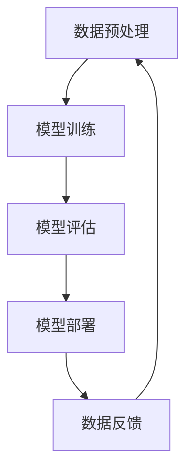

                 

关键词：AI大模型、创业、未来机遇、技术语言、深度学习、神经网络、商业策略

## 摘要

本文旨在探讨AI大模型在创业领域的应用及其带来的机遇。我们将深入分析AI大模型的本质、核心算法原理、数学模型，并通过具体的案例和实践来展示其应用价值。同时，本文还将探讨AI大模型创业中的挑战与未来发展趋势，为创业者和投资者提供有价值的参考。

## 1. 背景介绍

### AI大模型的兴起

近年来，人工智能（AI）技术取得了飞速发展，尤其是深度学习在图像识别、自然语言处理、推荐系统等领域的突破，使得AI大模型成为当前最热门的研究方向之一。AI大模型具有强大的数据处理能力和智能推理能力，能够处理海量数据，并从中提取有价值的信息。

### 创业领域的变革

随着AI大模型技术的成熟，越来越多的创业公司开始将其应用于各个领域，如金融、医疗、教育、零售等。AI大模型为创业公司提供了新的增长点，使得创业领域发生了深刻变革。

## 2. 核心概念与联系

### AI大模型概述

AI大模型是指具有大规模参数、能够处理海量数据的深度学习模型。这些模型通常由多个神经网络层组成，能够自动学习数据中的复杂模式。

### 核心算法原理

AI大模型的核心算法是深度学习。深度学习基于多层神经网络，通过反向传播算法来训练模型，使其能够识别和预测数据中的复杂模式。

### 架构与联系

AI大模型的架构通常包括数据预处理、模型训练、模型评估和模型部署等环节。这些环节相互联系，共同构成了AI大模型的完整流程。



## 3. 核心算法原理 & 具体操作步骤

### 3.1 算法原理概述

深度学习是一种基于神经网络的学习方法，通过多层神经网络来提取数据中的特征。深度学习的核心思想是通过反向传播算法来优化模型的参数，使其能够更好地拟合数据。

### 3.2 算法步骤详解

深度学习算法主要包括以下步骤：

1. **数据预处理**：对原始数据进行清洗、归一化等处理，使其符合模型的输入要求。
2. **模型设计**：根据任务需求设计神经网络结构，包括层数、每层的神经元数量等。
3. **模型训练**：通过反向传播算法来训练模型，使其能够拟合数据。
4. **模型评估**：使用验证数据集来评估模型的性能，选择最佳模型。
5. **模型部署**：将训练好的模型部署到实际应用场景中。

### 3.3 算法优缺点

**优点**：

- **强大的数据处理能力**：深度学习能够处理海量数据，并从中提取有价值的信息。
- **自适应性强**：深度学习模型能够自动调整参数，以适应不同的数据分布和任务需求。

**缺点**：

- **计算资源消耗大**：训练深度学习模型需要大量的计算资源。
- **模型可解释性差**：深度学习模型的内部机制复杂，难以解释其决策过程。

### 3.4 算法应用领域

深度学习算法在各个领域都有广泛的应用，如：

- **计算机视觉**：图像识别、目标检测、人脸识别等。
- **自然语言处理**：机器翻译、情感分析、文本生成等。
- **推荐系统**：个性化推荐、广告投放等。
- **金融领域**：风险控制、量化交易等。

## 4. 数学模型和公式 & 详细讲解 & 举例说明

### 4.1 数学模型构建

深度学习模型的核心是多层神经网络，其数学模型主要包括以下几个部分：

1. **输入层**：接收原始数据。
2. **隐藏层**：通过非线性变换来提取数据中的特征。
3. **输出层**：生成预测结果。

### 4.2 公式推导过程

深度学习模型的训练过程是基于梯度下降算法。其基本思想是：

$$
\theta_{\text{new}} = \theta_{\text{old}} - \alpha \cdot \nabla_{\theta} J(\theta)
$$

其中，$\theta$ 表示模型的参数，$J(\theta)$ 表示损失函数，$\alpha$ 表示学习率，$\nabla_{\theta} J(\theta)$ 表示损失函数关于参数的梯度。

### 4.3 案例分析与讲解

以一个简单的二元分类问题为例，我们使用多层感知机（MLP）模型来进行分类。

假设我们有一个包含两个特征的数据集，$x_1$ 和 $x_2$，我们需要判断样本是否属于正类（1）或负类（0）。

1. **数据预处理**：对数据进行归一化处理，使其具有相同的量级。
2. **模型设计**：设计一个包含一个隐藏层（2个神经元）的MLP模型。
3. **模型训练**：使用训练数据集来训练模型，通过反向传播算法来优化模型参数。
4. **模型评估**：使用验证数据集来评估模型的性能，选择最佳模型。
5. **模型部署**：将训练好的模型部署到实际应用场景中。

## 5. 项目实践：代码实例和详细解释说明

### 5.1 开发环境搭建

1. 安装Python环境。
2. 安装深度学习框架（如TensorFlow或PyTorch）。
3. 准备数据集。

### 5.2 源代码详细实现

以下是使用TensorFlow实现多层感知机模型的示例代码：

```python
import tensorflow as tf
from tensorflow.keras.models import Sequential
from tensorflow.keras.layers import Dense
from sklearn.model_selection import train_test_split
from sklearn.preprocessing import StandardScaler

# 数据预处理
X_train, X_test, y_train, y_test = train_test_split(X, y, test_size=0.2, random_state=42)
scaler = StandardScaler()
X_train = scaler.fit_transform(X_train)
X_test = scaler.transform(X_test)

# 模型设计
model = Sequential()
model.add(Dense(2, input_shape=(2,), activation='relu'))
model.add(Dense(1, activation='sigmoid'))

# 模型编译
model.compile(optimizer='adam', loss='binary_crossentropy', metrics=['accuracy'])

# 模型训练
model.fit(X_train, y_train, epochs=100, batch_size=10, validation_data=(X_test, y_test))

# 模型评估
model.evaluate(X_test, y_test)
```

### 5.3 代码解读与分析

- **数据预处理**：对数据进行归一化处理，使其具有相同的量级，以便模型能够更好地训练。
- **模型设计**：设计一个包含一个隐藏层（2个神经元）的MLP模型。
- **模型编译**：指定模型使用的优化器、损失函数和评价指标。
- **模型训练**：使用训练数据集来训练模型，通过反向传播算法来优化模型参数。
- **模型评估**：使用验证数据集来评估模型的性能。

## 6. 实际应用场景

AI大模型在各个领域都有广泛的应用，以下是一些实际应用场景：

- **金融领域**：用于风险管理、量化交易、信用评分等。
- **医疗领域**：用于疾病诊断、药物研发、健康管理等。
- **零售领域**：用于商品推荐、客户行为分析、供应链优化等。
- **教育领域**：用于个性化学习、智能评测、教学辅助等。

## 7. 未来应用展望

随着AI大模型技术的不断成熟，其应用范围将越来越广泛。未来，AI大模型将在更多领域发挥作用，如智慧城市、智能制造、无人驾驶等。同时，AI大模型创业也将面临更多的机遇和挑战。

## 8. 总结：未来发展趋势与挑战

### 8.1 研究成果总结

AI大模型技术在各个领域取得了显著的成果，为创业者提供了丰富的应用场景。未来，随着技术的不断发展，AI大模型的应用将更加广泛。

### 8.2 未来发展趋势

- **算法优化**：通过改进算法来提高模型性能。
- **数据积累**：通过更多数据来优化模型。
- **跨学科融合**：与更多学科领域进行融合，发挥AI大模型的优势。

### 8.3 面临的挑战

- **数据隐私**：如何保护用户隐私成为一大挑战。
- **算法可解释性**：提高模型的可解释性，使其更容易被用户理解和接受。
- **计算资源消耗**：如何降低模型训练和部署的计算资源消耗。

### 8.4 研究展望

未来，AI大模型技术将在更多领域发挥作用，成为推动社会发展的重要力量。同时，研究者需要关注技术发展的同时，解决其中的挑战，以实现AI大模型技术的可持续发展。

## 9. 附录：常见问题与解答

### 9.1 什么是AI大模型？

AI大模型是指具有大规模参数、能够处理海量数据的深度学习模型。这些模型通常由多个神经网络层组成，能够自动学习数据中的复杂模式。

### 9.2 如何训练AI大模型？

训练AI大模型主要包括以下步骤：

1. **数据预处理**：对原始数据进行清洗、归一化等处理。
2. **模型设计**：根据任务需求设计神经网络结构。
3. **模型训练**：通过反向传播算法来训练模型，优化模型参数。
4. **模型评估**：使用验证数据集来评估模型性能。
5. **模型部署**：将训练好的模型部署到实际应用场景中。

### 9.3 AI大模型创业有哪些挑战？

AI大模型创业面临以下挑战：

1. **数据隐私**：如何保护用户隐私成为一大挑战。
2. **算法可解释性**：提高模型的可解释性，使其更容易被用户理解和接受。
3. **计算资源消耗**：如何降低模型训练和部署的计算资源消耗。

---

作者：禅与计算机程序设计艺术 / Zen and the Art of Computer Programming
--------------------------------------------------------------------

