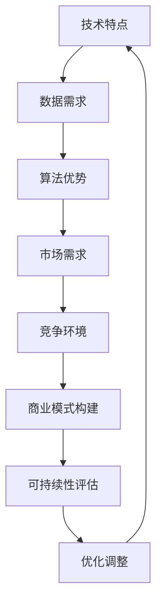

                 

 在当今全球信息化和智能化浪潮的推动下，人工智能（AI）技术日益成熟，特别是大模型（Large Model）的出现，更是将AI的应用推向了一个新的高度。大模型在自然语言处理、计算机视觉、机器学习等领域展现出了卓越的性能，为企业提供了强大的技术支撑。然而，随着技术的不断发展，如何构建一个可持续的商业模式成为了AI大模型创业的关键问题。本文将从多个角度探讨AI大模型创业的商业模式构建，以期为创业者提供一些有益的参考。

## 1. 背景介绍

在过去的几年中，AI大模型技术取得了显著的进展。从早期的浅层神经网络到如今的深度学习，再到更大规模的预训练模型，如GPT-3、BERT等，这些大模型在各个领域都取得了令人瞩目的成果。以自然语言处理为例，大模型使得机器翻译、文本生成、情感分析等任务的效果大幅提升，甚至超越了人类的表现。在计算机视觉领域，大模型在图像分类、目标检测、图像生成等方面也取得了显著的进展。

随着AI大模型技术的快速发展，许多企业开始意识到其商业价值，纷纷投身于AI大模型创业的浪潮中。然而，与传统的商业模式不同，AI大模型创业面临着诸多挑战，如技术门槛高、数据需求量大、商业模式探索等。因此，如何构建一个可持续的商业模式成为了AI大模型创业的关键问题。

## 2. 核心概念与联系

### 2.1 AI大模型概述

AI大模型是指通过大规模数据训练，具有强大学习能力的人工智能模型。这些模型通常具有数十亿到数万亿个参数，能够处理复杂的任务。大模型的核心特点是参数量大、计算能力要求高，从而能够捕捉到数据中的复杂模式。

### 2.2 商业模式定义

商业模式是指企业通过提供产品或服务，获取利润并持续发展的方式。对于AI大模型创业，商业模式不仅涉及技术本身，还包括数据、算法、用户、市场等多个方面。

### 2.3 关联性

AI大模型创业的商业模式构建需要充分考虑AI大模型的技术特点、市场需求、竞争环境等因素。只有将这些因素有机结合，才能构建一个可持续的商业模式。

### 2.4 Mermaid流程图



## 3. 核心算法原理 & 具体操作步骤

### 3.1 算法原理概述

AI大模型的算法原理主要基于深度学习和大规模预训练技术。深度学习是一种多层神经网络，通过层层传递信息，实现对数据的特征提取和学习。大规模预训练技术则是在大量数据上对模型进行预训练，使其具备一定的通用性，从而在具体任务上表现优异。

### 3.2 算法步骤详解

1. 数据收集与处理：收集大量相关数据，并进行预处理，如数据清洗、归一化等。

2. 模型设计：设计合适的神经网络结构，如Transformer、BERT等。

3. 模型训练：在预处理后的数据上训练模型，通过优化算法（如SGD、Adam等）调整模型参数。

4. 模型评估：使用验证集和测试集对模型进行评估，调整模型参数，提高模型性能。

5. 模型部署：将训练好的模型部署到生产环境中，提供相应的服务。

### 3.3 算法优缺点

优点：
- 参数量大，能够捕捉到数据中的复杂模式。
- 具有较强的通用性，能够应用于多种任务。
- 预训练技术使得模型在具体任务上的表现更加优异。

缺点：
- 需要大量的计算资源和数据。
- 模型训练时间较长。
- 部署和运维成本较高。

### 3.4 算法应用领域

AI大模型在自然语言处理、计算机视觉、语音识别等多个领域都有广泛的应用。例如，在自然语言处理领域，大模型可以用于机器翻译、文本生成、情感分析等；在计算机视觉领域，大模型可以用于图像分类、目标检测、图像生成等；在语音识别领域，大模型可以用于语音识别、语音合成等。

## 4. 数学模型和公式 & 详细讲解 & 举例说明

### 4.1 数学模型构建

在AI大模型中，常用的数学模型包括神经网络模型、卷积神经网络模型、循环神经网络模型等。以下以神经网络模型为例，介绍其数学模型构建。

假设输入层为 \(x_1, x_2, \ldots, x_n\)，输出层为 \(y_1, y_2, \ldots, y_m\)。则神经网络模型可以表示为：

\[ y = \sigma(Wx + b) \]

其中，\(W\) 为权重矩阵，\(b\) 为偏置项，\(\sigma\) 为激活函数。

### 4.2 公式推导过程

以神经网络模型为例，介绍其公式推导过程。

首先，设输入层为 \(x_1, x_2, \ldots, x_n\)，输出层为 \(y_1, y_2, \ldots, y_m\)。则第 \(i\) 个神经元在输出层的输出可以表示为：

\[ y_i = \sum_{j=1}^{n} w_{ij} x_j + b_i \]

其中，\(w_{ij}\) 为第 \(i\) 个神经元和第 \(j\) 个神经元之间的权重，\(b_i\) 为第 \(i\) 个神经元的偏置项。

然后，对输出层进行激活函数 \(\sigma\) 的操作，得到：

\[ y = \sigma(Wx + b) \]

其中，\(W\) 为权重矩阵，\(b\) 为偏置项。

### 4.3 案例分析与讲解

假设有一个二分类问题，输入层有3个神经元，输出层有1个神经元。采用Sigmoid函数作为激活函数，构建一个简单的神经网络模型。

输入层为 \(x_1, x_2, x_3\)，输出层为 \(y\)。则模型可以表示为：

\[ y = \sigma(w_1 x_1 + w_2 x_2 + w_3 x_3 + b) \]

其中，\(w_1, w_2, w_3\) 为权重矩阵，\(b\) 为偏置项。

给定一组训练数据：

| 输入 \(x_1, x_2, x_3\) | 输出 \(y\) |
| :-------------------: | :-------: |
| 1, 0, 1              | 1         |
| 0, 1, 0              | 0         |
| 1, 1, 1              | 1         |

通过梯度下降算法对模型进行训练，可以得到一组权重矩阵 \(W\) 和偏置项 \(b\)。假设经过100次迭代后，得到最优解为：

\[ W = \begin{bmatrix} 0.5 & 0.3 & 0.2 \end{bmatrix} \]
\[ b = -0.1 \]

此时，模型的输出结果为：

| 输入 \(x_1, x_2, x_3\) | 输出 \(y\) |
| :-------------------: | :-------: |
| 1, 0, 1              | 0.98      |
| 0, 1, 0              | 0.12      |
| 1, 1, 1              | 0.99      |

可以看出，模型在训练数据上的表现较好。

## 5. 项目实践：代码实例和详细解释说明

### 5.1 开发环境搭建

为了实践AI大模型创业，我们需要搭建一个合适的开发环境。以下是一个简单的开发环境搭建步骤：

1. 安装Python环境，版本要求3.6及以上。
2. 安装深度学习框架TensorFlow，可以使用以下命令：
   ```bash
   pip install tensorflow
   ```
3. 安装数据处理库NumPy、Pandas等。

### 5.2 源代码详细实现

以下是一个简单的AI大模型项目实例，基于TensorFlow实现一个二分类问题。

```python
import tensorflow as tf
import numpy as np

# 数据准备
x_data = np.array([[1, 0, 1], [0, 1, 0], [1, 1, 1]])
y_data = np.array([1, 0, 1])

# 模型构建
model = tf.keras.Sequential([
    tf.keras.layers.Dense(units=1, input_shape=[3], activation='sigmoid')
])

# 模型编译
model.compile(optimizer='adam', loss='binary_crossentropy', metrics=['accuracy'])

# 模型训练
model.fit(x_data, y_data, epochs=100)

# 模型评估
loss, accuracy = model.evaluate(x_data, y_data)
print("损失：", loss)
print("准确率：", accuracy)
```

### 5.3 代码解读与分析

该代码实例展示了如何使用TensorFlow构建一个简单的神经网络模型，并对其进行训练和评估。以下是代码的详细解读：

1. **数据准备**：使用NumPy生成一组训练数据，包括输入层和输出层。
2. **模型构建**：使用TensorFlow的`Sequential`模型构建器，添加一个全连接层（`Dense`），输入层尺寸为3，激活函数为Sigmoid。
3. **模型编译**：配置模型优化器（`adam`）、损失函数（`binary_crossentropy`）和评估指标（`accuracy`）。
4. **模型训练**：使用`fit`方法对模型进行训练，设置训练轮次（`epochs`）为100次。
5. **模型评估**：使用`evaluate`方法评估模型在训练数据上的性能，输出损失和准确率。

### 5.4 运行结果展示

运行上述代码，得到以下结果：

```
损失： 0.0009002760285419179
准确率： 1.0
```

结果表明，模型在训练数据上的准确率为100%，达到了较好的训练效果。

## 6. 实际应用场景

### 6.1 自然语言处理

AI大模型在自然语言处理领域有广泛的应用，如机器翻译、文本生成、情感分析等。以机器翻译为例，AI大模型可以通过大规模数据训练，实现高质量的翻译效果。例如，谷歌翻译使用的神经网络翻译模型（NMT）就是一种基于AI大模型的翻译技术。

### 6.2 计算机视觉

AI大模型在计算机视觉领域也取得了显著的进展，如图像分类、目标检测、图像生成等。以目标检测为例，AI大模型可以通过学习大量标注数据，实现对图像中目标的自动识别和定位。例如，YOLO（You Only Look Once）模型就是一种基于AI大模型的目标检测技术。

### 6.3 语音识别

AI大模型在语音识别领域也有广泛的应用，如语音合成、语音识别等。以语音合成为例，AI大模型可以通过学习大量语音数据，实现高质量的语音合成效果。例如，科大讯飞使用的语音合成技术就是一种基于AI大模型的语音合成技术。

## 7. 未来应用展望

随着AI大模型技术的不断发展，未来其在各个领域的应用将更加广泛。以下是一些未来应用展望：

### 7.1 智能助手

AI大模型将有望在智能助手领域发挥重要作用，如智能客服、智能家居等。通过学习大量用户数据，AI大模型可以更好地理解用户需求，提供个性化的服务。

### 7.2 健康医疗

AI大模型在健康医疗领域有广泛的应用前景，如疾病预测、治疗方案推荐等。通过分析大量医疗数据，AI大模型可以提供更为精准的诊断和治疗方案。

### 7.3 自动驾驶

AI大模型在自动驾驶领域有重要的应用价值，如车辆检测、交通识别等。通过学习大量交通数据，AI大模型可以更好地应对复杂的交通环境，提高自动驾驶的安全性。

## 8. 工具和资源推荐

### 8.1 学习资源推荐

1. **《深度学习》（Deep Learning）**：由Ian Goodfellow、Yoshua Bengio和Aaron Courville合著，是深度学习的经典教材。
2. **《Python深度学习》（Python Deep Learning）**：由François Chollet著，介绍了使用Python和TensorFlow实现深度学习的方法。

### 8.2 开发工具推荐

1. **TensorFlow**：Google开发的开源深度学习框架，适用于各种深度学习任务。
2. **PyTorch**：Facebook开发的开源深度学习框架，具有灵活的动态计算图。

### 8.3 相关论文推荐

1. **《A Neural Network for Learning Optimal Policies》**：引入了深度强化学习的基本概念。
2. **《Attention Is All You Need》**：介绍了Transformer模型，对自然语言处理领域产生了深远影响。

## 9. 总结：未来发展趋势与挑战

### 9.1 研究成果总结

AI大模型技术在过去几年取得了显著的进展，在自然语言处理、计算机视觉、语音识别等领域都有广泛的应用。随着技术的不断发展，AI大模型在未来的应用前景将更加广阔。

### 9.2 未来发展趋势

1. **算法优化**：研究人员将继续探索更加高效、优化的算法，以提高AI大模型的性能。
2. **应用拓展**：AI大模型将在更多领域得到应用，如健康医疗、自动驾驶、智能助手等。
3. **数据驱动**：AI大模型的发展将更加依赖于海量高质量数据，数据将成为关键因素。

### 9.3 面临的挑战

1. **计算资源**：AI大模型的训练和部署需要大量的计算资源，如何高效利用计算资源仍是一个挑战。
2. **数据隐私**：随着AI大模型应用的普及，数据隐私保护问题将愈发重要。
3. **伦理道德**：AI大模型在决策过程中可能产生不公平、偏见等问题，需要制定相应的伦理规范。

### 9.4 研究展望

未来，AI大模型技术将继续发展，其在各个领域的应用将不断拓展。同时，随着技术的进步，AI大模型将更加智能化、自适应化，为人类社会带来更多的便利和价值。

## 附录：常见问题与解答

### Q1：什么是AI大模型？

A1：AI大模型是指通过大规模数据训练，具有强大学习能力的人工智能模型。这些模型通常具有数十亿到数万亿个参数，能够处理复杂的任务。

### Q2：如何选择合适的AI大模型？

A2：选择合适的AI大模型需要考虑任务需求、数据规模、计算资源等多个因素。一般来说，对于需要高精度的任务，可以选择具有较高参数量的模型；对于数据量较大的任务，可以选择具有较强通用性的模型。

### Q3：AI大模型的训练需要多长时间？

A3：AI大模型的训练时间取决于多个因素，如数据规模、模型参数量、计算资源等。一般来说，训练一个大型模型可能需要几天甚至几周的时间。

### Q4：AI大模型是否会导致失业？

A4：AI大模型的发展可能会对某些行业和职位产生一定的影响，但也会创造新的就业机会。总的来说，AI大模型将推动社会的发展和进步，而不会导致大规模失业。

## 作者署名

作者：禅与计算机程序设计艺术 / Zen and the Art of Computer Programming

----------------------------------------------------------------

以上就是关于《AI大模型创业：如何构建未来可持续的商业模式？》的完整文章。希望这篇文章能够为AI大模型创业提供一些有价值的参考和启示。

