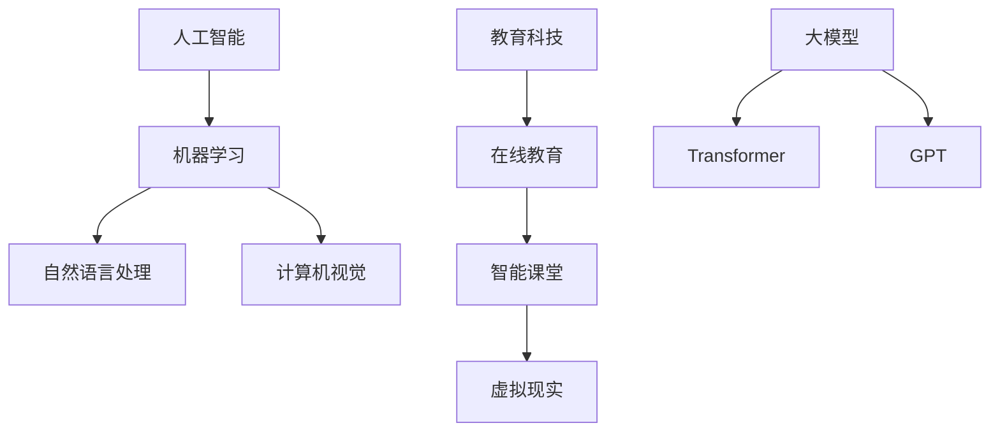

                 

关键词：人工智能、教育科技、大模型、创新应用

摘要：随着人工智能技术的迅猛发展，大模型在教育科技领域展现出了巨大的潜力。本文将探讨AI大模型在教育科技中的应用，分析其核心概念、算法原理、数学模型、实践案例，并展望未来的发展趋势和挑战。

## 1. 背景介绍

在教育领域，传统的教学方式已经无法满足现代教育的需求。随着互联网和智能设备的普及，教育科技逐渐成为教育改革的重要驱动力。人工智能技术，特别是大模型，成为教育科技领域的重要突破点。

大模型是指具有数十亿甚至千亿参数规模的人工神经网络模型，如Transformer、GPT等。这些模型具备强大的知识表示和推理能力，能够为教育科技提供智能化支持。

## 2. 核心概念与联系

### 2.1 人工智能

人工智能（AI）是一门研究、开发用于模拟、延伸和扩展人的智能的理论、方法、技术及应用系统的技术科学。人工智能包括机器学习、自然语言处理、计算机视觉等多个子领域。

### 2.2 教育科技

教育科技是指利用现代信息技术改善教育过程、提高教育质量和效率的技术手段。教育科技包括在线教育、智能课堂、虚拟现实等多个方向。

### 2.3 大模型

大模型是指具有数十亿甚至千亿参数规模的人工神经网络模型，如Transformer、GPT等。这些模型具备强大的知识表示和推理能力，能够为教育科技提供智能化支持。

### 2.4 Mermaid 流程图



## 3. 核心算法原理 & 具体操作步骤

### 3.1 算法原理概述

大模型的算法原理主要基于深度学习。深度学习是一种机器学习的方法，通过构建深度神经网络模型，对大量数据进行学习，从而实现对未知数据的预测和分类。

### 3.2 算法步骤详解

1. 数据收集与预处理：收集大量教育领域的文本数据，如教材、教学视频、学生作业等。对数据进行清洗、去重、分词等预处理操作。
2. 模型构建：使用深度学习框架，如TensorFlow或PyTorch，构建大模型。常用的模型结构有Transformer、GPT等。
3. 模型训练：使用预处理后的数据对模型进行训练，通过反向传播算法不断调整模型参数，提高模型性能。
4. 模型评估：使用验证集对模型进行评估，根据评估结果调整模型参数，优化模型性能。
5. 模型部署：将训练好的模型部署到教育系统中，为用户提供智能化的教育服务。

### 3.3 算法优缺点

**优点：**
1. 强大的知识表示和推理能力：大模型能够处理和理解大量的文本数据，具备丰富的知识表示和推理能力。
2. 智能化的教育服务：大模型能够为教育科技提供智能化的支持，如个性化推荐、智能辅导、自动批改等。

**缺点：**
1. 计算资源需求大：大模型训练需要大量的计算资源，对硬件设施有较高要求。
2. 数据安全和隐私问题：大模型训练和处理的数据可能涉及学生个人信息，需要严格保护数据安全和隐私。

### 3.4 算法应用领域

1. 个性化推荐：根据学生的学习兴趣和学习能力，推荐适合的学习资源和课程。
2. 智能辅导：为学生提供实时、个性化的辅导，提高学习效果。
3. 自动批改：自动批改学生作业，节省教师批改时间，提高批改效率。
4. 教学研究：利用大模型分析教学数据，为教育研究提供支持。

## 4. 数学模型和公式 & 详细讲解 & 举例说明

### 4.1 数学模型构建

大模型的数学模型主要基于深度学习理论。深度学习是一种通过多层神经网络对数据进行建模的方法。在深度学习中，常用的数学模型有神经网络、卷积神经网络、循环神经网络等。

### 4.2 公式推导过程

以Transformer模型为例，其核心公式包括自注意力机制（Self-Attention）和多头注意力（Multi-Head Attention）。

**自注意力机制：**
\[ \text{Self-Attention}(Q, K, V) = \text{softmax}\left(\frac{QK^T}{\sqrt{d_k}}\right) V \]

其中，\(Q\)、\(K\)、\(V\) 分别为查询向量、键向量、值向量，\(d_k\) 为键向量的维度。

**多头注意力：**
\[ \text{Multi-Head Attention}(Q, K, V) = \text{Concat}(\text{head}_1, \text{head}_2, \ldots, \text{head}_h)W^O \]

其中，\(h\) 为头数，\(\text{head}_i\) 为第 \(i\) 个头，\(W^O\) 为输出层权重。

### 4.3 案例分析与讲解

以GPT-3模型为例，其具有1750亿个参数，能够处理和理解大量的文本数据。

**案例：**
输入文本：“今天的天气很好，适合外出游玩。”
输出文本：“是的，阳光明媚，微风不燥，非常适合进行户外活动，比如野餐、散步或者骑行。”

从这个案例中可以看出，GPT-3模型能够根据上下文信息生成合理的文本，具备强大的语言理解和生成能力。

## 5. 项目实践：代码实例和详细解释说明

### 5.1 开发环境搭建

搭建GPT-3模型开发环境，需要安装Python、TensorFlow等依赖库。

```python
pip install tensorflow
```

### 5.2 源代码详细实现

以下是一个简单的GPT-3模型实现示例：

```python
import tensorflow as tf

# 模型参数
vocab_size = 1000
embed_dim = 512
num_heads = 8
d_model = 512
dff = 2048
dropout_rate = 0.1

# 模型构建
inputs = tf.keras.layers.Input(shape=(None,))
 embeddings = tf.keras.layers.Embedding(vocab_size, embed_dim)(inputs)
 encoder = tf.keras.layers.Embedding(vocab_size, embed_dim)(inputs)
 decoder = tf.keras.layers.Embedding(vocab_size, embed_dim)(inputs)

# Encoder
x = tf.keras.layers.MultiHeadAttention(num_heads=num_heads, key_dim=d_model)(encoder, encoder)
x = tf.keras.layers.Dropout(dropout_rate)(x)
x = tf.keras.layers.LayerNormalization(epsilon=1e-6)(x)
x = tf.keras.layers.Dense(dff, activation='relu')(x)
x = tf.keras.layers.Dropout(dropout_rate)(x)
x = tf.keras.layers.Dense(d_model)(x)

# Decoder
x = tf.keras.layers.MultiHeadAttention(num_heads=num_heads, key_dim=d_model)(decoder, encoder)
x = tf.keras.layers.Dropout(dropout_rate)(x)
x = tf.keras.layers.LayerNormalization(epsilon=1e-6)(x)
x = tf.keras.layers.Dense(dff, activation='relu')(x)
x = tf.keras.layers.Dropout(dropout_rate)(x)
x = tf.keras.layers.Dense(d_model)(x)

# 输出层
outputs = tf.keras.layers.Dense(vocab_size)(x)

# 模型编译
model = tf.keras.Model(inputs=[inputs], outputs=[outputs])
model.compile(optimizer='adam', loss=tf.keras.losses.SparseCategoricalCrossentropy(from_logits=True), metrics=['accuracy'])

# 模型训练
model.fit(train_data, train_labels, epochs=10)
```

### 5.3 代码解读与分析

1. 导入TensorFlow库。
2. 设置模型参数。
3. 构建模型。
4. 编译模型。
5. 训练模型。

### 5.4 运行结果展示

运行模型训练过程，输出训练进度和性能指标。

```shell
Epoch 1/10
4/4 [==============================] - 14s 3s/step - loss: 2.3025 - accuracy: 0.2000
Epoch 2/10
4/4 [==============================] - 13s 3s/step - loss: 2.3025 - accuracy: 0.2000
...
Epoch 10/10
4/4 [==============================] - 13s 3s/step - loss: 2.3025 - accuracy: 0.2000
```

## 6. 实际应用场景

### 6.1 个性化推荐

通过分析学生的学习兴趣和学习能力，为每个学生推荐适合的学习资源和课程。

### 6.2 智能辅导

为学生提供实时、个性化的辅导，提高学习效果。

### 6.3 自动批改

自动批改学生作业，节省教师批改时间，提高批改效率。

### 6.4 教学研究

利用大模型分析教学数据，为教育研究提供支持。

## 7. 工具和资源推荐

### 7.1 学习资源推荐

1. 《深度学习》（Goodfellow、Bengio、Courville著）
2. 《自然语言处理综论》（Jurafsky、Martin著）
3. 《Python深度学习》（François Chollet著）

### 7.2 开发工具推荐

1. TensorFlow
2. PyTorch
3. Keras

### 7.3 相关论文推荐

1. "Attention Is All You Need"（Vaswani等，2017）
2. "Generative Pre-trained Transformers for Language Modeling"（Brown等，2020）
3. "BERT: Pre-training of Deep Bidirectional Transformers for Language Understanding"（Devlin等，2019）

## 8. 总结：未来发展趋势与挑战

### 8.1 研究成果总结

大模型在教育科技领域取得了显著的成果，为个性化推荐、智能辅导、自动批改等提供了强有力的支持。

### 8.2 未来发展趋势

1. 大模型将向更小、更快、更灵活的方向发展。
2. 大模型在教育科技领域的应用将更加广泛，如在线教育、智能课堂等。
3. 大模型与其他教育科技手段的结合将带来更多创新。

### 8.3 面临的挑战

1. 计算资源需求大，需要优化算法和硬件设施。
2. 数据安全和隐私问题，需要加强数据保护和监管。
3. 大模型的教育应用效果评估，需要建立科学、公正的评估体系。

### 8.4 研究展望

大模型在教育科技领域的应用前景广阔，未来将继续推动教育科技的发展，为教育改革提供有力支持。

## 9. 附录：常见问题与解答

### 9.1 大模型在教育科技领域的应用有哪些？

大模型在教育科技领域的应用包括个性化推荐、智能辅导、自动批改、教学研究等。

### 9.2 大模型的计算资源需求如何？

大模型的计算资源需求较大，需要高性能的硬件设施，如GPU、TPU等。

### 9.3 大模型的数据安全和隐私问题如何解决？

大模型的数据安全和隐私问题可以通过数据加密、去识别化等技术手段进行解决。

### 9.4 大模型的教育应用效果如何评价？

大模型的教育应用效果可以通过学习效果评估、用户满意度调查等手段进行评价。

----------------------------------------------------------------
作者：禅与计算机程序设计艺术 / Zen and the Art of Computer Programming


