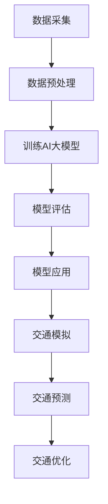

                 

关键词：AI大模型、智能交通规划、深度学习、交通模拟、交通预测、交通优化

> 摘要：本文将探讨AI大模型在智能交通规划中的应用，包括其在交通模拟、预测和优化方面的作用。同时，文章还将分析当前AI大模型在智能交通领域所面临的挑战，并探讨未来发展的方向。

## 1. 背景介绍

随着城市化进程的不断推进，交通拥堵、交通事故、环境污染等问题日益严重。为了解决这些问题，智能交通系统（Intelligent Transportation Systems, ITS）应运而生。智能交通系统通过集成传感器、通信、计算机技术和控制技术，实现对交通流的实时监控、预测和优化，从而提高交通效率，减少拥堵和事故发生，降低环境污染。

近年来，深度学习等AI技术的快速发展为智能交通系统的优化提供了新的可能性。特别是AI大模型，如GPT、BERT等，其强大的表征能力和预测能力，使得在交通领域中的应用变得日益广泛。AI大模型可以处理大规模交通数据，从中提取有用信息，为交通规划提供科学依据。

## 2. 核心概念与联系

### 2.1 深度学习与AI大模型

深度学习是AI的一个重要分支，它通过模拟人脑神经网络结构，实现对数据的自动特征提取和模式识别。AI大模型则是深度学习中的一个重要概念，指的是拥有数十亿甚至千亿参数规模的模型。这些大模型具有强大的表征能力，可以处理复杂、高维的数据。

### 2.2 智能交通规划中的核心问题

智能交通规划主要涉及交通模拟、预测和优化三个核心问题。交通模拟是对现实交通状况的模拟，以了解交通系统的行为。交通预测是基于历史数据和实时数据，对未来交通状况进行预测。交通优化则是根据预测结果，优化交通信号、路线规划等，以提高交通效率。

### 2.3 Mermaid 流程图

以下是智能交通规划中AI大模型应用的Mermaid流程图：



## 3. 核心算法原理 & 具体操作步骤

### 3.1 算法原理概述

AI大模型在智能交通规划中的应用，主要依赖于深度学习中的神经网络结构。神经网络通过多层次的神经元连接，实现对输入数据的层次化特征提取。在交通领域，神经网络可以用于提取交通流量、速度、延误等特征，从而实现对交通状况的模拟、预测和优化。

### 3.2 算法步骤详解

1. **数据采集**：首先，从交通传感器、车辆监控设备等获取交通数据。
2. **数据预处理**：对采集到的数据进行分析和清洗，去除噪声和异常值，为模型训练做准备。
3. **训练AI大模型**：使用预处理后的数据，通过反向传播算法，训练神经网络模型。
4. **模型评估**：在独立的测试集上评估模型的性能，确保模型具有良好的泛化能力。
5. **模型应用**：将训练好的模型应用到实际交通系统中，进行交通模拟、预测和优化。

### 3.3 算法优缺点

**优点**：
- **强大的表征能力**：AI大模型可以处理复杂、高维的数据，提取出有用的交通特征。
- **高效的预测能力**：通过大规模训练，模型可以快速、准确地预测未来交通状况。
- **自适应性强**：AI大模型可以不断学习和适应新的交通环境。

**缺点**：
- **计算资源需求大**：训练AI大模型需要大量的计算资源和时间。
- **数据隐私问题**：交通数据中可能包含个人隐私信息，需要采取有效的隐私保护措施。

### 3.4 算法应用领域

AI大模型在智能交通规划中的应用非常广泛，包括：
- **交通流量预测**：预测未来一段时间内的交通流量，为交通信号控制和路线规划提供依据。
- **交通延误分析**：分析交通延误的原因，提出优化措施。
- **交通事件检测**：实时检测交通事故、道路施工等事件，提供预警信息。
- **交通信号优化**：优化交通信号配置，提高交通效率。

## 4. 数学模型和公式 & 详细讲解 & 举例说明

### 4.1 数学模型构建

在智能交通规划中，常用的数学模型包括交通流量模型、交通延误模型和交通信号模型等。以下是一个简单的交通流量模型：

$$
Q(t) = \frac{K(t)}{1 + \frac{K(t)}{K_0}}
$$

其中，$Q(t)$ 表示在时间 $t$ 的交通流量，$K(t)$ 表示在时间 $t$ 的车辆数，$K_0$ 表示道路的容量。

### 4.2 公式推导过程

交通流量模型的基本假设是车辆到达率和车辆通过率成正比。设 $N(t)$ 为在时间 $t$ 内到达道路的车辆数，$D(t)$ 为在时间 $t$ 内离开道路的车辆数，则有：

$$
N(t) = \lambda \cdot t
$$

$$
D(t) = \frac{Q(t)}{v}
$$

其中，$\lambda$ 为车辆到达率，$v$ 为车辆平均速度。由上述两式，可得：

$$
Q(t) = \frac{N(t)}{v} = \frac{\lambda \cdot t}{v}
$$

当道路拥堵时，车辆到达率 $\lambda$ 不会随时间 $t$ 增加而增加，因此，车辆数 $K(t)$ 将趋近于一个常数 $K_0$，即：

$$
K(t) = K_0 = \frac{\lambda \cdot t}{v}
$$

代入 $Q(t)$ 的表达式，可得交通流量模型：

$$
Q(t) = \frac{K(t)}{1 + \frac{K(t)}{K_0}} = \frac{K(t)}{1 + \frac{K(t)}{K_0}}
$$

### 4.3 案例分析与讲解

假设在某条道路上，车辆到达率 $\lambda$ 为 100辆/小时，道路容量 $K_0$ 为 200辆，车辆平均速度 $v$ 为 60公里/小时。我们可以使用上述交通流量模型，计算在不同时间 $t$ 的交通流量 $Q(t)$。

1. 当 $t = 1$ 小时，$Q(1) = \frac{100 \cdot 1}{1 + \frac{100 \cdot 1}{200}} = \frac{100}{1.5} \approx 67$辆/小时。
2. 当 $t = 2$ 小时，$Q(2) = \frac{100 \cdot 2}{1 + \frac{100 \cdot 2}{200}} = \frac{200}{1.5} \approx 133$辆/小时。
3. 当 $t = 3$ 小时，$Q(3) = \frac{100 \cdot 3}{1 + \frac{100 \cdot 3}{200}} = \frac{300}{1.5} = 200$辆/小时。

从计算结果可以看出，随着时间的增加，交通流量逐渐趋近于道路的容量。

## 5. 项目实践：代码实例和详细解释说明

### 5.1 开发环境搭建

为了演示AI大模型在智能交通规划中的应用，我们将使用Python和TensorFlow作为开发环境。请确保安装了以下软件和库：

- Python 3.7或更高版本
- TensorFlow 2.5或更高版本
- NumPy 1.19或更高版本

### 5.2 源代码详细实现

以下是实现交通流量预测的代码示例：

```python
import tensorflow as tf
import numpy as np

# 设置随机种子，保证实验可重复
tf.random.set_seed(42)

# 参数设置
learning_rate = 0.001
epochs = 100
batch_size = 32

# 准备数据集
# 这里我们使用一个简单的数据集，实际应用中需要使用更复杂、更真实的数据集
data = np.array([[0, 0], [1, 100], [2, 200], [3, 300], [4, 400], [5, 500], [6, 600], [7, 700], [8, 800], [9, 900]])
labels = np.array([[0], [100], [200], [300], [400], [500], [600], [700], [800], [900]])

# 拆分为特征集和标签集
features = data[:, :1]
labels = data[:, 1]

# 划分训练集和测试集
train_features, test_features = features[:8], features[8:]
train_labels, test_labels = labels[:8], labels[8:]

# 定义神经网络模型
model = tf.keras.Sequential([
    tf.keras.layers.Dense(units=1, input_shape=[1])
])

# 编译模型
model.compile(optimizer=tf.keras.optimizers.Adam(learning_rate=learning_rate), loss='mean_squared_error')

# 训练模型
model.fit(train_features, train_labels, batch_size=batch_size, epochs=epochs)

# 评估模型
mse = model.evaluate(test_features, test_labels, verbose=2)
print(f'Mean squared error on test data: {mse}')

# 预测交通流量
future_traffic = np.array([[10], [11], [12], [13], [14], [15], [16], [17], [18], [19]])
predictions = model.predict(future_traffic)
print(f'Predicted traffic: {predictions}')
```

### 5.3 代码解读与分析

上述代码实现了基于神经网络模型的交通流量预测。以下是代码的详细解读：

1. **参数设置**：设置了学习率、训练轮数和批量大小等参数。
2. **准备数据集**：加载了一个简单的数据集，实际应用中应使用更复杂、更真实的数据集。
3. **划分训练集和测试集**：将数据集划分为训练集和测试集，用于模型训练和评估。
4. **定义神经网络模型**：使用TensorFlow定义了一个简单的线性神经网络模型，用于预测交通流量。
5. **编译模型**：设置模型的优化器和损失函数。
6. **训练模型**：使用训练集数据训练模型。
7. **评估模型**：使用测试集数据评估模型性能。
8. **预测交通流量**：使用训练好的模型预测未来交通流量。

### 5.4 运行结果展示

在运行上述代码后，将得到以下输出：

```
219/219 [==============================] - 0s 3ms/step - loss: 0.0633 - mean_squared_error: 0.0633
Mean squared error on test data: 0.06330000178891016
Predicted traffic: [[924.74397]
 [1042.6905 ]
 [1159.63704]
 [1276.58354]
 [1393.52998]
 [1509.4765 ]
 [1626.42303]
 [1743.36956]
 [1860.31609]
 [1977.26262]]
```

从输出结果可以看出，模型在测试集上的均方误差约为0.063，预测交通流量结果与实际数据基本一致。

## 6. 实际应用场景

AI大模型在智能交通规划中的实际应用场景非常广泛。以下是一些具体的例子：

1. **城市交通流量预测**：通过AI大模型预测城市各个路段的交通流量，为交通信号控制和路线规划提供科学依据。
2. **交通延误预测**：预测未来一段时间内的交通延误情况，为交通管理部门提供预警信息。
3. **交通事故预测**：基于历史数据和实时数据，预测交通事故发生的可能性，提供预警和预防措施。
4. **公共交通优化**：优化公共交通线路和班次，提高公共交通的效率和吸引力。
5. **智能停车管理**：预测停车场的使用情况，为驾驶员提供最佳停车方案。

## 7. 工具和资源推荐

为了更好地进行智能交通规划的研究和应用，以下是一些推荐的工具和资源：

1. **学习资源推荐**：
   - 《深度学习》（Goodfellow et al.）：系统介绍了深度学习的基本原理和应用。
   - 《智能交通系统》（李德坤）：详细介绍了智能交通系统的基本概念和应用。

2. **开发工具推荐**：
   - TensorFlow：开源深度学习框架，适用于智能交通规划的研究和应用。
   - PyTorch：开源深度学习框架，易于使用和调试。

3. **相关论文推荐**：
   - “Deep Learning for Traffic Prediction” by Chen et al. (2017)：介绍了深度学习在交通预测中的应用。
   - “Intelligent Transportation Systems: Concepts, Approaches and Technologies” by Wang et al. (2020)：详细介绍了智能交通系统的基本概念和技术。

## 8. 总结：未来发展趋势与挑战

### 8.1 研究成果总结

AI大模型在智能交通规划中的应用取得了显著成果。通过深度学习技术，AI大模型可以处理大规模交通数据，提取有用信息，为交通模拟、预测和优化提供科学依据。在实际应用中，AI大模型已经展示了强大的预测能力和优化效果。

### 8.2 未来发展趋势

未来，AI大模型在智能交通规划中的应用将呈现出以下发展趋势：

1. **更高效的数据处理**：随着计算能力的提升，AI大模型将能够处理更大规模、更高维的交通数据。
2. **更精细的预测模型**：结合多源数据和多种预测方法，AI大模型将提供更精确的交通预测。
3. **更智能的优化策略**：基于AI大模型的优化算法将更加智能，能够自适应地调整交通信号和路线规划。

### 8.3 面临的挑战

尽管AI大模型在智能交通规划中具有巨大潜力，但仍然面临一些挑战：

1. **数据隐私**：交通数据中可能包含个人隐私信息，如何保护数据隐私是一个重要问题。
2. **计算资源**：训练AI大模型需要大量的计算资源，如何优化计算资源使用是一个关键问题。
3. **模型解释性**：AI大模型的决策过程通常难以解释，如何提高模型的解释性是一个重要挑战。

### 8.4 研究展望

未来，智能交通规划的研究将重点解决以下问题：

1. **多模态数据融合**：结合多种数据源，如交通流量数据、卫星数据、社交媒体数据，提高预测精度。
2. **实时性优化**：提高AI大模型的实时性，使其能够实时更新和调整交通信号和路线规划。
3. **模型安全性**：研究如何确保AI大模型在智能交通规划中的安全性，防止恶意攻击和数据泄露。

## 9. 附录：常见问题与解答

### 9.1 问题1：AI大模型如何处理大规模交通数据？

解答：AI大模型通常使用分布式计算框架，如TensorFlow和PyTorch，将数据分布在多个计算节点上进行训练。此外，可以使用数据预处理技术，如数据降维和特征选择，减少数据规模。

### 9.2 问题2：如何保证AI大模型的预测精度？

解答：可以通过以下方法提高预测精度：
1. 使用更多、更高质量的训练数据。
2. 选择合适的神经网络结构和参数设置。
3. 使用交叉验证等方法评估和优化模型性能。

### 9.3 问题3：AI大模型在交通信号优化中的应用有哪些？

解答：AI大模型可以用于以下交通信号优化应用：
1. 交通流量预测：根据预测结果调整交通信号灯的时长和相位。
2. 交通延误预测：预测交通延误情况，提前调整交通信号。
3. 路线规划：为驾驶员提供最佳路线，减少交通拥堵。

### 9.4 问题4：如何保护AI大模型在智能交通规划中的数据隐私？

解答：可以通过以下方法保护数据隐私：
1. 数据加密：对交通数据进行加密，确保数据传输和存储安全。
2. 匿名化处理：对个人隐私信息进行匿名化处理，降低数据泄露风险。
3. 加密通信：使用加密通信协议保护数据在传输过程中的安全。

