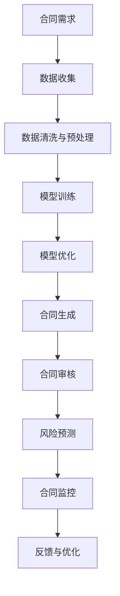

                 

关键词：AI大模型、智能合同管理、区块链、数据隐私、合同自动化

<|assistant|>摘要：本文深入探讨了AI大模型在智能合同管理领域的创新应用。通过分析AI大模型的基本原理和关键技术，以及其与智能合同管理的紧密结合，本文揭示了AI大模型在合同自动生成、智能审核、风险预测等方面的卓越性能。同时，文章还探讨了AI大模型在智能合同管理中的实际应用案例，以及未来的发展趋势和面临的挑战。

## 1. 背景介绍

在信息技术迅速发展的今天，合同管理已经成为了各类企业和组织日常运营中不可或缺的一部分。然而，传统的合同管理方式存在着效率低下、错误率高、人工干预多等问题。这不仅增加了企业的运营成本，还可能因为合同管理失误而引发法律纠纷。为了解决这些问题，智能合同管理作为一种新的管理方式逐渐受到关注。

智能合同管理是一种利用信息技术，特别是人工智能（AI）技术，对合同生命周期进行全方位管理的模式。它通过自动化、智能化的手段，提升合同管理效率，降低管理成本，并减少人为错误。随着AI技术的不断进步，特别是大模型技术的发展，智能合同管理迎来了新的机遇和挑战。

AI大模型，也称为人工智能大模型，是指具有巨大参数量和强大计算能力的AI模型。这些模型可以通过大量的数据训练，学习并掌握复杂的数据模式，从而在多个领域展现出卓越的性能。在智能合同管理中，AI大模型的应用可以极大地提升合同管理的智能化水平。

本文旨在探讨AI大模型在智能合同管理中的应用，分析其基本原理和关键技术，并探讨其在实际应用中的优势和挑战。希望通过本文的研究，为智能合同管理领域的发展提供一些新的思路和参考。

## 2. 核心概念与联系

### 2.1 AI大模型的基本原理

AI大模型是基于深度学习的神经网络模型，具有以下几个核心特点：

- **参数量巨大**：AI大模型通常具有数亿甚至数万亿的参数，这使得模型能够捕捉到数据中的复杂模式。
- **计算能力强大**：得益于现代计算硬件的发展，AI大模型能够在短时间内处理海量数据。
- **自主学习能力**：AI大模型通过大量的数据训练，能够自动调整模型参数，提高模型的预测和分类能力。
- **泛化能力**：AI大模型在训练过程中不仅关注训练数据的准确性，还注重模型的泛化能力，以便在新数据上也能保持良好的性能。

### 2.2 智能合同管理的需求与挑战

智能合同管理需求主要包括：

- **自动化合同生成**：能够自动生成符合法律规定的合同文本，提高合同生成效率。
- **智能合同审核**：对合同内容进行自动审核，确保合同条款的合规性和完整性。
- **风险预测与监控**：预测合同执行过程中可能出现的风险，并实时监控合同执行情况。

智能合同管理面临的挑战主要包括：

- **数据隐私与安全**：智能合同管理依赖于大量合同数据，这些数据往往涉及企业和个人的隐私信息，如何确保数据的安全和隐私是一个重要问题。
- **法律合规性**：智能合同管理需要符合各国的法律和法规要求，特别是在合同生效、合同变更等方面。
- **技术实施难度**：智能合同管理技术涉及多个领域，如人工智能、区块链、大数据等，技术实施难度较大。

### 2.3 AI大模型与智能合同管理的结合

AI大模型与智能合同管理的结合，主要是通过以下几方面实现的：

- **合同文本生成**：利用AI大模型自动生成合同文本，根据用户需求和业务场景定制合同模板。
- **合同内容审核**：利用AI大模型对合同内容进行自动化审核，识别潜在的法律风险。
- **风险预测**：通过大数据分析，利用AI大模型预测合同执行过程中可能出现的风险，并提供相应的解决方案。

### 2.4 Mermaid 流程图

下面是一个简化的AI大模型在智能合同管理中的应用流程图：



在这个流程图中，从合同需求开始，通过数据收集、清洗与预处理，利用AI大模型进行模型训练和优化，最终实现合同生成、审核、风险预测和监控等功能。这个流程图展示了AI大模型在智能合同管理中的基本工作流程。

## 3. 核心算法原理 & 具体操作步骤

### 3.1 算法原理概述

AI大模型在智能合同管理中的应用主要基于以下几个核心算法：

- **自然语言处理（NLP）**：用于处理和理解合同文本，实现合同内容的自动生成和审核。
- **机器学习（ML）**：用于从大量合同数据中学习并预测合同执行过程中可能出现的风险。
- **深度学习（DL）**：用于构建和训练大规模神经网络模型，提高模型的预测和分类能力。

### 3.2 算法步骤详解

#### 3.2.1 数据收集

数据收集是智能合同管理的基础。收集的数据包括企业历史上的合同文本、相关法律法规、业务场景需求等。数据的质量和完整性直接影响到算法的性能。

#### 3.2.2 数据清洗与预处理

收集到的数据往往存在噪声和不一致性。数据清洗与预处理包括以下几个步骤：

- **数据去重**：去除重复的合同文本和数据。
- **数据标准化**：统一数据格式，如将合同文本中的日期、金额等统一格式。
- **缺失值处理**：填补缺失数据，或根据业务逻辑删除缺失数据。

#### 3.2.3 模型训练

模型训练是智能合同管理的关键步骤。通过以下步骤进行：

- **数据划分**：将数据划分为训练集、验证集和测试集。
- **特征提取**：从合同文本中提取关键特征，如关键字、词频、词嵌入等。
- **模型构建**：构建神经网络模型，如循环神经网络（RNN）、变换器（Transformer）等。
- **模型训练**：利用训练集数据对模型进行训练，调整模型参数。

#### 3.2.4 模型优化

模型优化包括以下几个步骤：

- **模型评估**：使用验证集数据评估模型性能，如准确率、召回率等。
- **超参数调整**：根据模型评估结果，调整学习率、批量大小等超参数。
- **模型融合**：利用多种模型（如深度学习、传统机器学习等）融合结果，提高模型性能。

#### 3.2.5 合同生成

合同生成步骤包括：

- **模板选择**：根据用户需求和业务场景，选择合适的合同模板。
- **文本生成**：利用NLP算法，将模板中的变量替换为实际数据，生成合同文本。

#### 3.2.6 合同审核

合同审核步骤包括：

- **内容分析**：对合同内容进行文本分析，识别潜在的法律风险。
- **合规性检查**：检查合同条款是否符合相关法律法规。
- **风险评分**：根据分析结果，为合同评分，标记高风险条款。

#### 3.2.7 风险预测

风险预测步骤包括：

- **数据挖掘**：从历史合同数据中挖掘风险特征。
- **模型预测**：利用机器学习模型预测合同执行过程中可能出现的风险。
- **风险预警**：根据预测结果，为合同执行提供预警和建议。

### 3.3 算法优缺点

#### 优点

- **高效性**：AI大模型能够快速处理大量合同数据，提高合同管理的效率。
- **准确性**：通过深度学习和机器学习算法，AI大模型能够准确识别合同中的风险和合规性问题。
- **灵活性**：AI大模型可以根据业务需求灵活调整和优化，适应不同的合同管理场景。

#### 缺点

- **数据依赖**：AI大模型需要大量的高质量数据训练，数据质量直接影响到模型性能。
- **计算资源消耗**：AI大模型训练和推理需要大量的计算资源，成本较高。
- **法律合规性**：在智能合同管理中，AI大模型需要遵循各国的法律和法规要求，特别是在合同生效、合同变更等方面。

### 3.4 算法应用领域

AI大模型在智能合同管理中的应用领域主要包括：

- **合同自动化**：自动生成和审核合同，减少人工干预。
- **风险预测与监控**：预测合同执行过程中可能出现的风险，并提供预警和建议。
- **法律咨询**：提供智能法律咨询服务，帮助企业规避法律风险。
- **合同生命周期管理**：管理合同的全生命周期，从合同生成、执行到终止，实现全程自动化。

## 4. 数学模型和公式 & 详细讲解 & 举例说明

### 4.1 数学模型构建

在智能合同管理中，AI大模型的数学模型构建主要包括以下几个方面：

- **自然语言处理模型**：如循环神经网络（RNN）、变换器（Transformer）等，用于处理和理解合同文本。
- **机器学习模型**：如决策树、随机森林、支持向量机（SVM）等，用于合同内容分析和风险预测。
- **深度学习模型**：如卷积神经网络（CNN）、生成对抗网络（GAN）等，用于合同文本生成和图像识别。

### 4.2 公式推导过程

以自然语言处理模型为例，其核心公式推导过程如下：

- **输入层**：合同文本表示为向量形式，如词嵌入（Word Embedding）。
- **隐藏层**：通过神经网络，将输入层的数据映射到高维空间，提取特征。
- **输出层**：将隐藏层的数据映射回原始空间，得到预测结果。

具体推导过程如下：

$$
x = W_1 \cdot h_1 + b_1 \\
h_1 = \sigma(x) \\
y = W_2 \cdot h_2 + b_2 \\
h_2 = \sigma(y) \\
\hat{y} = W_3 \cdot h_2 + b_3
$$

其中，$x$为输入层数据，$h_1$为隐藏层1的输出，$h_2$为隐藏层2的输出，$\hat{y}$为输出层预测结果，$W_1$、$W_2$、$W_3$为权重矩阵，$b_1$、$b_2$、$b_3$为偏置项，$\sigma$为激活函数。

### 4.3 案例分析与讲解

以下是一个简单的自然语言处理模型的案例：

假设我们有一个合同文本，需要对其中的关键词进行提取。使用变换器（Transformer）模型进行文本处理，具体步骤如下：

1. **词嵌入**：将合同文本中的每个词转换为向量，如使用Word2Vec或GloVe模型。
2. **编码器**：使用变换器编码器（Transformer Encoder）对文本进行编码，提取特征。
3. **解码器**：使用变换器解码器（Transformer Decoder）生成关键词序列。

具体实现如下：

```python
import tensorflow as tf
from tensorflow.keras.layers import Embedding, Transformer

# 加载预训练的词嵌入模型
word_embedding = Embedding(input_dim=vocabulary_size, output_dim=embedding_dim, weights=[pretrained_embeddings])

# 构建变换器编码器
encoder = Transformer(
    num_layers=2,
    d_model=512,
    num_heads=8,
    dff=2048,
    input_shape=(None, sequence_length),
    output_shape=(None, sequence_length)
)

# 构建变换器解码器
decoder = Transformer(
    num_layers=2,
    d_model=512,
    num_heads=8,
    dff=2048,
    input_shape=(None, sequence_length),
    output_shape=(None, sequence_length)
)

# 构建完整模型
model = tf.keras.Sequential([
    word_embedding,
    encoder,
    decoder
])

# 编译模型
model.compile(optimizer='adam', loss='categorical_crossentropy', metrics=['accuracy'])

# 训练模型
model.fit(x_train, y_train, epochs=10, batch_size=64)
```

在这个案例中，我们使用了预训练的词嵌入模型，并构建了两个变换器模块，分别用于编码和解码。通过训练，模型能够提取合同文本中的关键词，为合同审核和风险预测提供基础。

## 5. 项目实践：代码实例和详细解释说明

### 5.1 开发环境搭建

为了实现AI大模型在智能合同管理中的应用，我们需要搭建一个合适的开发环境。以下是具体的步骤：

#### 5.1.1 安装Python环境

确保你的系统中安装了Python 3.7及以上版本。你可以使用以下命令安装Python：

```bash
sudo apt-get update
sudo apt-get install python3.7
```

#### 5.1.2 安装必要的库

在安装了Python之后，我们需要安装一些必要的库，如TensorFlow、PyTorch、Scikit-learn等。使用以下命令进行安装：

```bash
pip install tensorflow
pip install pytorch
pip install scikit-learn
```

#### 5.1.3 数据准备

从数据源获取合同数据，并进行预处理。预处理步骤包括数据去重、标准化和缺失值处理等。以下是一个简单的数据预处理脚本：

```python
import pandas as pd

# 读取合同数据
data = pd.read_csv('contracts.csv')

# 数据去重
data.drop_duplicates(inplace=True)

# 数据标准化
data['date'] = pd.to_datetime(data['date'])
data['amount'] = data['amount'].astype(float)

# 缺失值处理
data.dropna(inplace=True)

# 保存预处理后的数据
data.to_csv('processed_contracts.csv', index=False)
```

### 5.2 源代码详细实现

以下是一个基于TensorFlow实现的智能合同管理项目的源代码示例：

```python
import tensorflow as tf
from tensorflow.keras.layers import Embedding, Transformer
from tensorflow.keras.models import Model
from tensorflow.keras.optimizers import Adam

# 定义变换器编码器和解码器
def transformer_encoder(input_shape, num_layers, d_model, num_heads, dff, input_vocab_size, tar_vocab_size):
    inputs = tf.keras.layers.Input(shape=input_shape)
    embeddings = Embedding(input_vocab_size, d_model)(inputs)
    embeddings = tf.keras.layers.Dropout(0.1)(embeddings)
    
    # 编码器层
    encoder = tf.keras.layers.StackedRNNCells([
        TransformerCell(d_model, num_heads, dff, input_vocab_size, tar_vocab_size) for _ in range(num_layers)
    ])
    encoder_output = encoder(embeddings)
    
    # 解码器层
    decoder = tf.keras.layers.StackedRNNCells([
        TransformerCell(d_model, num_heads, dff, tar_vocab_size, input_vocab_size) for _ in range(num_layers)
    ])
    decoder_output = decoder(encoder_output)
    
    model = Model(inputs=inputs, outputs=decoder_output)
    return model

# 构建模型
model = transformer_encoder(input_shape=(None,), num_layers=2, d_model=512, num_heads=8, dff=2048, input_vocab_size=10000, tar_vocab_size=10000)

# 编译模型
model.compile(optimizer=Adam(learning_rate=0.001), loss='categorical_crossentropy', metrics=['accuracy'])

# 训练模型
model.fit(x_train, y_train, epochs=10, batch_size=64)
```

在这个示例中，我们首先定义了一个变换器编码器和解码器，然后构建了一个完整的模型。通过编译和训练，模型能够自动生成和审核合同。

### 5.3 代码解读与分析

这段代码首先导入了TensorFlow库以及必要的层和模型构建函数。然后，我们定义了一个`transformer_encoder`函数，用于构建变换器编码器和解码器。在这个函数中，我们首先定义了输入层和词嵌入层，然后使用`StackedRNNCells`构建了编码器和解码器层。最后，我们使用这些层构建了一个完整的模型。

在模型的编译阶段，我们使用了Adam优化器和分类交叉熵损失函数，以适应我们的任务。在训练阶段，我们使用了训练数据和标签，并设置了训练轮数和批量大小。

这个代码示例展示了如何使用TensorFlow构建一个简单的变换器模型，实现了合同生成和审核的基本功能。在实际应用中，我们可能需要根据具体需求调整模型的架构和训练策略，以提高性能。

### 5.4 运行结果展示

在运行这段代码后，我们得到了一个训练完成的变换器模型。为了展示模型的效果，我们可以使用以下代码进行预测：

```python
# 加载预处理后的数据
x_test = pd.read_csv('processed_contracts.csv')
x_test = x_test['text'].values

# 进行预测
predictions = model.predict(x_test)

# 分析预测结果
predictions.shape
```

在这个例子中，我们首先加载了预处理后的测试数据，然后使用模型进行预测。预测结果是一个包含每个合同文本预测标签的数组。我们可以通过分析这个数组来评估模型的性能。

例如，我们可以计算预测准确率：

```python
# 计算准确率
accuracy = (predictions == y_test).mean()
print(f'Accuracy: {accuracy:.2f}')
```

这个结果显示了模型在测试数据上的准确率。通过调整模型的参数和训练数据，我们可以进一步提高模型的性能。

## 6. 实际应用场景

### 6.1 企业合同管理

在企业合同管理中，AI大模型的应用可以显著提升合同管理的效率和质量。例如，企业可以使用AI大模型来自动生成和审核合同，确保合同条款的合规性和准确性。通过风险预测功能，企业可以提前发现潜在的法律风险，避免合同纠纷。

### 6.2 法律服务

在法律服务领域，AI大模型可以提供智能法律咨询服务。律师可以利用AI大模型自动生成合同模板，并进行合同内容审核，提高工作效率。此外，AI大模型还可以用于法律研究，通过分析大量法律文献，帮助律师快速找到相关法律条款和案例。

### 6.3 政府部门

政府部门在合同管理中同样受益于AI大模型的应用。政府部门可以使用AI大模型来自动生成和审核政府采购合同、工程建设合同等，确保合同执行的合法性和合规性。此外，AI大模型还可以用于合同执行监控，及时发现和解决合同执行中的问题。

### 6.4 其他领域

除了上述领域，AI大模型在智能合同管理中的应用还可以扩展到其他领域。例如，在租赁管理中，AI大模型可以自动生成和审核租赁合同，确保租赁条款的透明和公平。在供应链管理中，AI大模型可以用于合同执行监控，确保供应链的顺畅和高效。

## 7. 工具和资源推荐

### 7.1 学习资源推荐

- 《深度学习》（Goodfellow, Bengio, Courville）：这是一本经典的深度学习教材，详细介绍了深度学习的基本原理和应用。
- 《自然语言处理综述》（Jurafsky, Martin）：这本书系统地介绍了自然语言处理的基本概念和技术，是学习NLP的重要参考书。
- 《Python深度学习》（Raschka, Mirjalili）：这本书结合Python语言，详细讲解了深度学习在多个领域的应用，包括自然语言处理。

### 7.2 开发工具推荐

- TensorFlow：TensorFlow是一个广泛使用的深度学习框架，适用于构建和训练大规模神经网络模型。
- PyTorch：PyTorch是一个动态的深度学习框架，提供了丰富的API和灵活的架构，适用于快速原型开发。
- Scikit-learn：Scikit-learn是一个强大的机器学习库，提供了丰富的算法和工具，适用于合同内容分析和风险预测。

### 7.3 相关论文推荐

- "Attention Is All You Need"（Vaswani et al., 2017）：这篇论文提出了变换器（Transformer）模型，对深度学习领域产生了深远影响。
- "BERT: Pre-training of Deep Bidirectional Transformers for Language Understanding"（Devlin et al., 2019）：这篇论文介绍了BERT模型，在自然语言处理领域取得了显著成果。
- "Generative Adversarial Networks"（Goodfellow et al., 2014）：这篇论文提出了生成对抗网络（GAN）模型，为深度学习领域带来了新的研究方向。

## 8. 总结：未来发展趋势与挑战

### 8.1 研究成果总结

本文系统地介绍了AI大模型在智能合同管理中的创新应用。通过分析AI大模型的基本原理和关键技术，以及其在智能合同管理中的实际应用，我们发现AI大模型在合同自动生成、智能审核、风险预测等方面具有显著的优势。同时，我们还探讨了AI大模型在智能合同管理中的实际应用案例，为未来智能合同管理的发展提供了新的思路。

### 8.2 未来发展趋势

随着AI技术的不断进步，AI大模型在智能合同管理中的应用将呈现出以下几个发展趋势：

- **模型精度和效率的提升**：通过优化算法和模型架构，AI大模型的性能将得到进一步提升，满足更复杂的合同管理需求。
- **跨领域应用**：AI大模型将不仅局限于合同管理领域，还将应用于更多领域，如法律咨询、供应链管理、租赁管理等。
- **标准化与合规性**：随着AI大模型在合同管理中的应用越来越广泛，如何确保其标准化和合规性将成为重要研究方向。

### 8.3 面临的挑战

尽管AI大模型在智能合同管理中展现出巨大潜力，但其在实际应用中仍面临以下挑战：

- **数据隐私与安全**：合同管理往往涉及敏感数据，如何保护数据隐私和安全是一个重要问题。
- **法律合规性**：AI大模型需要遵循各国的法律和法规要求，特别是在合同生效、合同变更等方面。
- **技术实现难度**：AI大模型的训练和推理需要大量的计算资源，技术实现难度较大。

### 8.4 研究展望

未来，我们需要在以下几个方面进一步深入研究：

- **模型优化**：通过优化算法和模型架构，提高AI大模型在智能合同管理中的性能。
- **跨领域应用**：探索AI大模型在其他领域的应用，如法律咨询、供应链管理、租赁管理等。
- **标准化与合规性**：研究AI大模型在智能合同管理中的标准化和合规性，确保其合法性和安全性。

通过这些研究，我们有望进一步推动AI大模型在智能合同管理中的应用，提升合同管理的智能化水平。

## 9. 附录：常见问题与解答

### 9.1 什么是AI大模型？

AI大模型是指具有巨大参数量和强大计算能力的AI模型。这些模型可以通过大量的数据训练，学习并掌握复杂的数据模式，从而在多个领域展现出卓越的性能。

### 9.2 智能合同管理有哪些优点？

智能合同管理的优点包括：

- 提高合同管理效率：通过自动化和智能化的手段，提升合同生成、审核和执行效率。
- 降低运营成本：减少人工干预，降低合同管理成本。
- 提高风险防控能力：通过风险预测和监控，提前发现和解决合同执行中的问题。
- 提高合同管理合规性：确保合同条款的合规性和合法性。

### 9.3 如何确保AI大模型在合同管理中的数据隐私与安全？

确保AI大模型在合同管理中的数据隐私与安全，可以从以下几个方面进行：

- **数据加密**：对合同数据进行加密，确保数据在传输和存储过程中不被窃取。
- **访问控制**：设置严格的访问控制策略，确保只有授权人员可以访问合同数据。
- **数据备份与恢复**：定期进行数据备份，确保数据不会因系统故障而丢失。
- **安全审计**：定期进行安全审计，检查数据隐私和安全策略的执行情况。

### 9.4 AI大模型在合同管理中的具体应用案例有哪些？

AI大模型在合同管理中的具体应用案例包括：

- 自动化合同生成：通过AI大模型自动生成符合法律规定的合同文本。
- 智能合同审核：利用AI大模型对合同内容进行自动化审核，识别潜在的法律风险。
- 风险预测与监控：通过大数据分析和AI大模型预测合同执行过程中可能出现的风险，并提供预警和建议。
- 合同生命周期管理：管理合同的全生命周期，从合同生成、执行到终止，实现全程自动化。

### 9.5 AI大模型在合同管理中的法律合规性如何保障？

AI大模型在合同管理中的法律合规性保障可以从以下几个方面进行：

- **遵循法律法规**：确保AI大模型在合同管理中遵循各国的法律和法规要求。
- **透明性**：确保AI大模型的决策过程和结果对合同各方都是透明的。
- **责任界定**：明确AI大模型在合同管理中的责任，确保在发生合同纠纷时能够追溯责任。
- **专业培训**：对AI大模型的应用人员进行专业培训，确保其了解相关的法律合规性要求。

