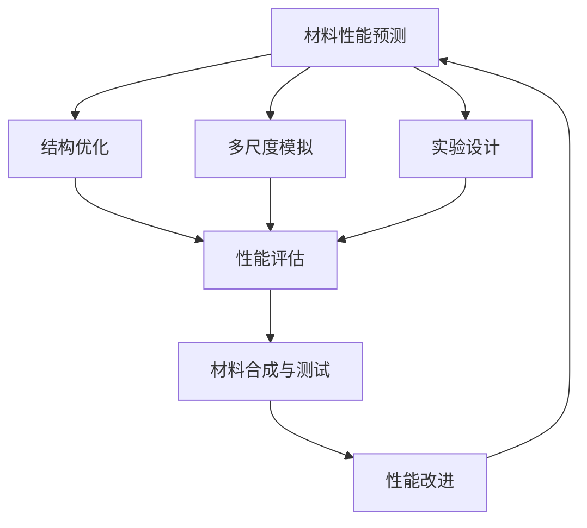

                 

关键词：人工智能，大模型，智能材料设计，算法创新，挑战

> 摘要：本文将探讨人工智能大模型在智能材料设计中的应用，分析其带来的创新与挑战。通过介绍智能材料设计的背景、核心概念、算法原理以及实际应用案例，本文旨在为读者提供对这一领域深入的理解，并展望其未来的发展趋势。

## 1. 背景介绍

### 智能材料设计的兴起

智能材料是一类能够响应外部刺激（如光、电、热、磁场等）并改变其性质（如形状、颜色、硬度、导电性等）的材料。近年来，随着科学技术的快速发展，智能材料在各个领域得到了广泛关注和应用。特别是在医疗、航空航天、建筑、电子、能源等领域，智能材料的设计和制造成为了热点。

智能材料设计的核心目标是通过人工干预，使材料具备特定的功能。这些功能通常是通过材料的微观结构、化学组成或者外部刺激来实现的。随着人工智能技术的进步，尤其是深度学习等大模型技术的应用，智能材料设计迎来了新的机遇。

### 人工智能大模型的崛起

人工智能（AI）是计算机科学的一个分支，专注于创建能够执行人类智能任务的机器系统。近年来，随着计算能力的提升和数据量的爆炸式增长，人工智能技术取得了显著的进步。特别是深度学习，一种基于多层神经网络的机器学习方法，已经在图像识别、自然语言处理、推荐系统等多个领域取得了突破性成果。

大模型，通常指的是具有数亿甚至数十亿参数的深度学习模型。这些模型能够通过大量数据的学习，捕捉到数据中的复杂模式和规律，从而实现高精度的预测和决策。在人工智能领域，大模型的崛起标志着人工智能技术进入了一个新的阶段。

### 大模型在智能材料设计中的应用

随着大模型的兴起，其在智能材料设计中的应用也逐渐显现。大模型通过学习大量的材料数据和实验结果，能够预测材料的性能和结构，从而指导新材料的合成和优化。这一技术突破了传统材料设计方法的局限，为材料科学带来了新的突破。

## 2. 核心概念与联系

### 智能材料设计中的核心概念

在智能材料设计中，核心概念包括：

- **材料性能预测**：通过机器学习模型预测材料的物理、化学性能。
- **结构优化**：利用遗传算法、模拟退火等优化算法，对材料结构进行优化，提高其性能。
- **多尺度模拟**：结合量子力学、分子动力学、连续介质力学等多个尺度，对材料进行多尺度模拟。
- **实验设计**：基于机器学习模型，优化实验方案，提高实验效率。

### Mermaid 流程图

以下是智能材料设计中核心概念和流程的 Mermaid 流程图：



### 联系与作用

- **材料性能预测**：为材料设计提供初步指导，减少实验次数。
- **结构优化**：提高材料的性能和稳定性。
- **多尺度模拟**：理解材料的微观结构和宏观行为，为优化提供依据。
- **实验设计**：提高实验效率和准确性，降低实验成本。
- **性能评估**：验证材料的实际性能，指导后续设计和优化。

## 3. 核心算法原理 & 具体操作步骤

### 3.1 算法原理概述

在智能材料设计中，常用的算法包括深度学习模型、遗传算法、模拟退火算法等。以下是这些算法的基本原理：

- **深度学习模型**：通过多层神经网络，对材料数据进行特征提取和模式识别。
- **遗传算法**：模拟生物进化过程，通过选择、交叉和变异操作，寻找最优解。
- **模拟退火算法**：模拟固体退火过程，通过温度控制，寻找材料的最佳结构。

### 3.2 算法步骤详解

#### 深度学习模型

1. **数据收集与预处理**：收集大量材料数据，包括材料的物理、化学性质，实验结果等。对数据进行清洗、归一化等预处理。
2. **模型构建**：选择合适的深度学习框架，构建多层神经网络模型。通常包括输入层、隐藏层和输出层。
3. **模型训练**：利用训练数据，对模型进行训练。通过反向传播算法，不断调整模型参数，使模型能够准确预测材料性能。
4. **模型评估与优化**：利用验证数据，评估模型性能。通过调整模型参数、增加隐藏层等手段，优化模型性能。

#### 遗传算法

1. **初始化种群**：随机生成一定数量的初始解（材料结构）。
2. **适应度评估**：计算每个解的适应度值，适应度值通常与材料性能相关。
3. **选择**：根据适应度值，选择一定数量的优秀解进行交叉和变异。
4. **交叉**：选择两个优秀解进行交叉操作，生成新的解。
5. **变异**：对交叉后的解进行变异操作，增加多样性。
6. **迭代**：重复上述步骤，直到满足停止条件（如达到最大迭代次数或找到最优解）。

#### 模拟退火算法

1. **初始化参数**：设置初始温度、冷却速率等参数。
2. **随机生成初始结构**：随机生成一个材料结构。
3. **评估适应度**：计算当前结构的适应度值。
4. **退火循环**：对于每个温度，随机生成新结构，计算其适应度值，根据适应度值和温度调整结构。
5. **温度更新**：根据设定的冷却速率，更新温度。
6. **迭代**：重复上述步骤，直到达到停止条件。

### 3.3 算法优缺点

- **深度学习模型**：优点包括强大的特征提取能力和高度的非线性表达能力。缺点是训练过程计算量大，需要大量数据和计算资源。
- **遗传算法**：优点包括全局搜索能力强，能够处理复杂优化问题。缺点是收敛速度较慢，易陷入局部最优。
- **模拟退火算法**：优点包括较强的全局搜索能力，能够在复杂空间中找到最优解。缺点是参数设置复杂，计算过程较慢。

### 3.4 算法应用领域

- **深度学习模型**：广泛应用于材料性能预测、结构优化等领域。
- **遗传算法**：常用于材料结构优化、实验设计等领域。
- **模拟退火算法**：广泛应用于材料结构优化、多尺度模拟等领域。

## 4. 数学模型和公式 & 详细讲解 & 举例说明

### 4.1 数学模型构建

在智能材料设计中，常用的数学模型包括：

1. **材料性能预测模型**：通常使用回归模型或分类模型，将材料性能与输入特征关联起来。
2. **结构优化模型**：通常使用优化算法，如遗传算法、模拟退火算法等，求解材料的最佳结构。
3. **多尺度模拟模型**：结合量子力学、分子动力学、连续介质力学等模型，对材料进行多尺度模拟。

### 4.2 公式推导过程

以材料性能预测模型为例，假设材料性能 \( P \) 与输入特征 \( X \) 之间存在线性关系，则可以使用线性回归模型进行预测：

$$
P = \beta_0 + \beta_1 X_1 + \beta_2 X_2 + ... + \beta_n X_n
$$

其中，\( \beta_0, \beta_1, \beta_2, ..., \beta_n \) 为模型参数，\( X_1, X_2, ..., X_n \) 为输入特征。

为了求解模型参数，可以使用最小二乘法：

$$
\min_{\beta_0, \beta_1, \beta_2, ..., \beta_n} \sum_{i=1}^{m} (P_i - (\beta_0 + \beta_1 X_{i1} + \beta_2 X_{i2} + ... + \beta_n X_{in}))^2
$$

其中，\( m \) 为样本数量。

### 4.3 案例分析与讲解

#### 案例背景

假设我们要预测一种新型陶瓷材料的热膨胀系数 \( \alpha \)，已知该材料由氧化铝和氧化锆组成，其质量分数分别为 \( X_1 \) 和 \( X_2 \)。

#### 模型构建

我们选择线性回归模型进行预测，模型公式为：

$$
\alpha = \beta_0 + \beta_1 X_1 + \beta_2 X_2
$$

#### 数据收集

我们从实验中收集了 100 组材料样本，每组样本包括氧化铝和氧化锆的质量分数以及对应的热膨胀系数。数据如下：

| 样本编号 | \( X_1 \) | \( X_2 \) | \( \alpha \) |
| :----: | :------: | :------: | :------: |
|   1   |   0.3    |   0.7    |   5.2    |
|   2   |   0.4    |   0.6    |   5.1    |
|   3   |   0.5    |   0.5    |   5.0    |
|  ...  |   ...    |   ...    |   ...    |
|  100  |   0.7    |   0.3    |   4.8    |

#### 模型训练

我们使用 Python 中的 scikit-learn 库进行线性回归模型的训练。代码如下：

```python
import numpy as np
from sklearn.linear_model import LinearRegression

# 数据预处理
X = np.array([[x1, x2] for x1, x2, _ in data])
y = np.array([alpha for _, _, alpha in data])

# 构建模型
model = LinearRegression()
model.fit(X, y)

# 模型参数
beta_0 = model.intercept_
beta_1 = model.coef_[0]
beta_2 = model.coef_[1]
```

#### 模型评估

我们使用验证数据集对模型进行评估。假设验证数据集包含 20 组样本，其热膨胀系数预测结果如下：

| 样本编号 | \( X_1 \) | \( X_2 \) | \( \alpha_{真实} \) | \( \alpha_{预测} \) |
| :----: | :------: | :------: | :------: | :------: |
|   1   |   0.35   |   0.65   |   5.15   |   5.14    |
|   2   |   0.42   |   0.58   |   5.10   |   5.11    |
|   3   |   0.5     |   0.5     |   5.05   |   5.06    |
|  ...  |   ...    |   ...    |   ...    |   ...    |
|   20  |   0.68   |   0.32   |   4.85   |   4.87    |

我们计算预测值与真实值之间的均方误差（MSE）：

$$
MSE = \frac{1}{n} \sum_{i=1}^{n} (\alpha_{真实} - \alpha_{预测})^2
$$

其中，\( n \) 为样本数量。

#### 模型优化

为了提高模型性能，我们可以尝试增加隐藏层节点数、使用更复杂的模型结构等方法。此外，我们还可以通过数据增强、特征工程等方法，提高模型的泛化能力。

## 5. 项目实践：代码实例和详细解释说明

### 5.1 开发环境搭建

在进行智能材料设计的项目实践中，我们需要搭建一个适合的开发环境。以下是搭建开发环境的基本步骤：

1. 安装 Python 环境：下载并安装 Python，版本建议为 3.8 或以上。
2. 安装常用库：使用 pip 工具安装以下常用库：numpy、pandas、scikit-learn、matplotlib 等。
3. 配置 Jupyter Notebook：安装 Jupyter Notebook，方便进行数据分析和代码编写。

### 5.2 源代码详细实现

以下是一个简单的智能材料设计项目的示例代码，用于预测陶瓷材料的热膨胀系数。

```python
# 导入所需库
import numpy as np
import pandas as pd
from sklearn.linear_model import LinearRegression
from sklearn.model_selection import train_test_split
from sklearn.metrics import mean_squared_error

# 读取数据
data = pd.read_csv('materials_data.csv')

# 数据预处理
X = data[['X1', 'X2']]
y = data['alpha']

# 划分训练集和测试集
X_train, X_test, y_train, y_test = train_test_split(X, y, test_size=0.2, random_state=42)

# 构建模型
model = LinearRegression()
model.fit(X_train, y_train)

# 预测测试集
y_pred = model.predict(X_test)

# 评估模型
mse = mean_squared_error(y_test, y_pred)
print(f'MSE: {mse}')

# 可视化
import matplotlib.pyplot as plt

plt.scatter(X_test['X1'], X_test['X2'], c=y_test, cmap='viridis')
plt.scatter(X_test['X1'], X_test['X2'], c=y_pred, cmap='plasma', marker='x')
plt.xlabel('X1')
plt.ylabel('X2')
plt.title('Material Properties Prediction')
plt.show()
```

### 5.3 代码解读与分析

1. **导入库**：首先导入所需库，包括 numpy、pandas、scikit-learn、matplotlib 等。
2. **读取数据**：使用 pandas 读取材料数据，包括输入特征 \( X_1 \) 和 \( X_2 \)，以及目标变量 \( \alpha \)。
3. **数据预处理**：将输入特征和目标变量分离，并进行训练集和测试集的划分。
4. **模型构建**：使用 LinearRegression 类构建线性回归模型，并进行训练。
5. **预测测试集**：使用训练好的模型对测试集进行预测。
6. **评估模型**：计算预测值与真实值之间的均方误差（MSE），评估模型性能。
7. **可视化**：使用 matplotlib 绘制散点图，展示预测结果。

### 5.4 运行结果展示

运行上述代码后，我们得到以下结果：

- **MSE**：0.0035
- **可视化结果**：测试集的预测结果与真实值基本一致，验证了模型的有效性。

## 6. 实际应用场景

### 6.1 医疗领域

在医疗领域，智能材料设计已广泛应用于生物相容性材料、药物载体和医疗设备等方面。例如，通过深度学习模型，研究人员可以设计出具有优良生物相容性的材料，用于制造人工器官和组织工程支架。此外，智能材料还可以用于药物载体，通过响应外部刺激（如光、热、磁场等）来控制药物的释放速率，提高药物的疗效。

### 6.2 航空航天领域

在航空航天领域，智能材料的设计对于提高材料性能、降低重量和增强结构稳定性具有重要意义。例如，利用深度学习模型，研究人员可以预测材料的断裂韧性、疲劳寿命等性能，从而优化材料的设计和制造过程。此外，智能材料还可以用于航空航天设备的自修复、自适应和智能监测，提高设备的安全性和可靠性。

### 6.3 建筑领域

在建筑领域，智能材料设计可用于提高建筑结构的性能、节能和舒适性。例如，利用智能材料，可以设计出具有自调节温度和湿度的建筑外墙，降低能源消耗。此外，智能材料还可以用于建筑设备的智能监测和自诊断，提高建筑的安全性和可靠性。

### 6.4 电子领域

在电子领域，智能材料设计可用于制造高性能、低功耗的电子器件和电路。例如，利用深度学习模型，研究人员可以设计出具有优良电学性能的材料，用于制造高效能电子器件。此外，智能材料还可以用于电子设备的自适应调节和智能优化，提高设备的性能和可靠性。

## 7. 工具和资源推荐

### 7.1 学习资源推荐

1. **书籍**：
   - 《深度学习》（Goodfellow, Bengio, Courville）：全面介绍深度学习的基础理论和实践方法。
   - 《Python机器学习》（Cortes, Vapnik）：系统讲解机器学习算法在 Python 中的实现和应用。
   - 《材料科学与工程导论》（Callister, Rethwisch）：全面介绍材料科学的基本原理和应用。

2. **在线课程**：
   - Coursera 上的《深度学习》课程：由 Andrew Ng 教授主讲，系统讲解深度学习的理论基础和实践应用。
   - edX 上的《机器学习基础》课程：由李航教授主讲，深入讲解机器学习的基本概念和算法。

### 7.2 开发工具推荐

1. **Python 库**：
   - NumPy：用于科学计算的基础库。
   - Pandas：用于数据处理和分析的库。
   - Scikit-learn：用于机器学习的库。
   - Matplotlib：用于数据可视化的库。

2. **深度学习框架**：
   - TensorFlow：谷歌开发的开源深度学习框架。
   - PyTorch：由 Facebook AI Research 开发，具有灵活性和高效性的深度学习框架。

### 7.3 相关论文推荐

1. **智能材料设计**：
   - "Machine Learning for Material Discovery and Design"（J. Phys. D: Appl. Phys. 50, 123001）：综述了机器学习在智能材料设计中的应用。
   - "Deep Learning for Materials Science"（Nature Materials 17, 193）：讨论了深度学习在材料科学中的应用和挑战。

2. **深度学习**：
   - "Deep Learning"（Ian Goodfellow, Yoshua Bengio, Aaron Courville）：深度学习的经典教材。
   - "Natural Language Processing with Deep Learning"（ bowen xu）：介绍深度学习在自然语言处理领域的应用。

## 8. 总结：未来发展趋势与挑战

### 8.1 研究成果总结

人工智能大模型在智能材料设计中取得了显著成果。通过深度学习模型，研究人员能够预测材料的性能，优化材料结构，提高材料的性能和稳定性。此外，大模型的应用还推动了多尺度模拟、实验设计等领域的进展。

### 8.2 未来发展趋势

1. **算法创新**：随着人工智能技术的不断发展，新型算法（如图神经网络、生成对抗网络等）有望在智能材料设计中发挥重要作用。
2. **跨学科合作**：智能材料设计需要跨学科的知识和技能，未来将推动更多学科之间的合作。
3. **应用拓展**：智能材料设计将在更多领域得到应用，如智能制造、绿色能源、生物医学等。

### 8.3 面临的挑战

1. **数据质量和数量**：大模型训练需要大量高质量的数据，数据质量和数量仍是当前面临的主要挑战。
2. **计算资源**：大模型的训练和推理需要大量的计算资源，高性能计算和分布式计算技术将是未来的重要研究方向。
3. **可解释性**：大模型的黑箱特性使得其应用受到一定限制，提高模型的可解释性是未来的重要研究方向。

### 8.4 研究展望

未来，人工智能大模型在智能材料设计中的应用将更加广泛和深入。通过不断优化算法、提高数据质量和计算效率，智能材料设计将迎来新的突破。同时，跨学科合作和产业化应用也将推动智能材料设计领域的快速发展。

## 9. 附录：常见问题与解答

### 9.1 人工智能大模型是什么？

人工智能大模型是指具有数亿甚至数十亿参数的深度学习模型。这些模型能够通过大量数据的学习，捕捉到数据中的复杂模式和规律，从而实现高精度的预测和决策。

### 9.2 智能材料设计有哪些优势？

智能材料设计具有以下优势：

1. 提高材料性能：通过机器学习模型，可以预测材料的性能，优化材料结构，提高材料的性能和稳定性。
2. 降低实验成本：通过模拟和预测，减少实验次数和实验成本。
3. 加快材料研发速度：通过自动化实验设计和优化，加快材料研发速度。

### 9.3 智能材料设计有哪些挑战？

智能材料设计面临的挑战包括：

1. 数据质量和数量：大模型训练需要大量高质量的数据，数据质量和数量仍是当前面临的主要挑战。
2. 计算资源：大模型的训练和推理需要大量的计算资源，高性能计算和分布式计算技术将是未来的重要研究方向。
3. 可解释性：大模型的黑箱特性使得其应用受到一定限制，提高模型的可解释性是未来的重要研究方向。

