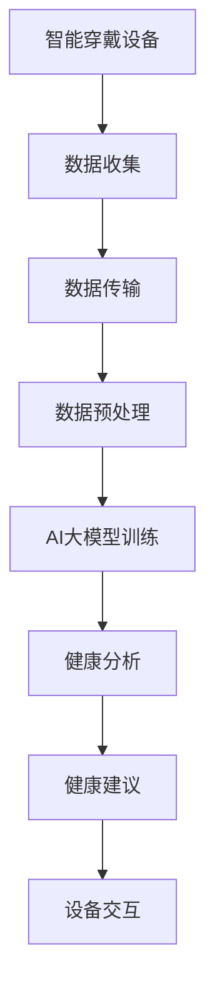

                 

关键词：AI大模型、智能穿戴设备、创新、技术发展、应用场景、未来展望

<|assistant|>摘要：随着人工智能技术的迅猛发展，大模型技术逐渐成为推动智能穿戴设备创新的重要力量。本文将探讨AI大模型在智能穿戴设备领域的应用机遇，包括核心概念与联系、核心算法原理、数学模型与公式、项目实践、实际应用场景、未来展望等方面，旨在为读者提供全面深入的了解。

## 1. 背景介绍

智能穿戴设备作为现代科技领域的重要创新，已经逐渐融入人们的生活。从最初的计步器、心率监测器，到如今的智能手表、智能眼镜等，这些设备为用户提供了更加便捷的健康监测和生活服务。然而，随着用户需求的不断提升，智能穿戴设备的功能也在不断拓展。传统的处理方法已经无法满足日益复杂的需求，因此，AI大模型技术的引入成为了必然趋势。

AI大模型是指具有巨大参数量的神经网络模型，通过深度学习算法进行训练，能够对海量数据进行高精度处理和预测。大模型技术在语音识别、图像识别、自然语言处理等领域已经取得了显著成果。如今，将AI大模型应用于智能穿戴设备，将进一步提升设备的智能化水平，为用户带来更加丰富的功能和服务。

## 2. 核心概念与联系

### 2.1 AI大模型

AI大模型是指通过深度学习算法训练出的具有大量参数的神经网络模型。这些模型能够对复杂的数据进行处理和分析，从而实现智能决策和预测。大模型的核心在于其巨大的参数量，这使得模型具有更强的表达能力和泛化能力。

### 2.2 智能穿戴设备

智能穿戴设备是指穿戴在身体上，能够实时监测、收集、处理和分析生理数据，并基于数据分析为用户提供健康建议和服务的设备。智能穿戴设备通常具备以下特点：

1. **便携性**：设备轻便易携，可以方便地穿戴在身体上。
2. **实时性**：设备能够实时监测和收集生理数据，为用户提供实时反馈。
3. **智能化**：设备通过内置的AI算法，对数据进行分析和处理，为用户提供个性化服务。

### 2.3 联系

AI大模型与智能穿戴设备的结合，可以进一步提升智能穿戴设备的功能和性能。AI大模型可以处理和分析智能穿戴设备收集的大量生理数据，从而实现以下目标：

1. **精确健康监测**：通过对生理数据的深入分析，AI大模型可以更精确地监测用户的健康状况。
2. **个性化健康建议**：基于对用户数据的分析，AI大模型可以为用户提供个性化的健康建议。
3. **智能设备交互**：AI大模型可以优化智能穿戴设备的交互体验，使其更加人性化。

为了更好地展示AI大模型与智能穿戴设备的联系，我们使用Mermaid流程图进行说明：



## 3. 核心算法原理 & 具体操作步骤

### 3.1 算法原理概述

AI大模型的核心在于其深度学习算法。深度学习是一种基于多层神经网络的结构，通过逐层提取数据特征，实现从简单到复杂的特征变换。在智能穿戴设备中，AI大模型的具体应用包括：

1. **生理数据识别**：通过对生理数据的特征提取和分类，实现对用户健康状态的判断。
2. **健康预测**：基于历史数据和现有数据，利用AI大模型进行健康趋势预测，为用户提供预警。
3. **个性化建议**：根据用户的生理数据和偏好，AI大模型可以为用户提供个性化的健康建议。

### 3.2 算法步骤详解

#### 3.2.1 数据收集

智能穿戴设备通过传感器实时收集用户的生理数据，如心率、血压、步数等。数据收集的过程包括：

1. **数据采集**：传感器将生理数据转化为数字信号。
2. **数据传输**：将采集到的数据传输到云端或本地服务器。

#### 3.2.2 数据预处理

数据预处理是深度学习模型训练的关键步骤，主要包括：

1. **数据清洗**：去除噪声数据和异常值，保证数据质量。
2. **数据归一化**：将数据归一化到统一的范围内，便于模型训练。
3. **特征提取**：从原始数据中提取有用的特征信息。

#### 3.2.3 AI大模型训练

AI大模型的训练过程包括：

1. **模型构建**：根据应用需求，构建合适的深度学习模型结构。
2. **数据加载**：将预处理后的数据加载到模型中。
3. **模型训练**：通过反向传播算法，不断调整模型参数，使模型在训练数据上达到最佳性能。
4. **模型评估**：使用验证集或测试集对模型进行评估，确保模型性能满足要求。

#### 3.2.4 健康分析

基于训练好的AI大模型，对用户的生理数据进行健康分析，包括：

1. **生理状态判断**：根据生理数据，判断用户的当前健康状态。
2. **健康趋势预测**：基于历史数据和现有数据，预测用户的健康趋势。
3. **个性化建议**：根据用户的生理数据和偏好，生成个性化的健康建议。

#### 3.2.5 设备交互

将健康分析结果通过智能穿戴设备与用户进行交互，包括：

1. **界面展示**：将分析结果以图形或文字形式展示在设备界面上。
2. **语音交互**：通过语音助手为用户提供实时健康建议。

### 3.3 算法优缺点

#### 3.3.1 优点

1. **高精度**：AI大模型能够对生理数据进行精细分析，提供更准确的健康监测和预测。
2. **个性化**：AI大模型能够根据用户的生理数据和偏好，生成个性化的健康建议。
3. **实时性**：AI大模型能够实时分析用户的生理数据，提供即时的健康反馈。

#### 3.3.2 缺点

1. **计算资源消耗**：AI大模型训练和推理需要大量的计算资源，对设备性能有一定要求。
2. **数据隐私**：生理数据的收集和处理可能涉及到用户隐私问题，需要加强数据保护。

### 3.4 算法应用领域

AI大模型在智能穿戴设备中的应用领域广泛，包括：

1. **健康监测**：对用户的心率、血压、步数等生理指标进行实时监测。
2. **疾病预警**：通过分析生理数据，提前发现潜在的健康问题。
3. **个性化健康管理**：根据用户的生理数据和偏好，提供个性化的健康建议。

## 4. 数学模型和公式 & 详细讲解 & 举例说明

### 4.1 数学模型构建

在智能穿戴设备中，AI大模型的构建主要涉及以下数学模型：

#### 4.1.1 神经网络模型

神经网络模型是AI大模型的基础，其数学模型主要包括以下部分：

1. **输入层**：接收用户的生理数据。
2. **隐藏层**：通过非线性变换，提取数据特征。
3. **输出层**：生成健康分析结果。

#### 4.1.2 损失函数

损失函数用于评估模型在训练过程中的性能，常用的损失函数包括：

1. **均方误差（MSE）**：用于回归问题。
2. **交叉熵（Cross Entropy）**：用于分类问题。

#### 4.1.3 反向传播算法

反向传播算法用于模型训练，其核心思想是通过反向传播误差，不断调整模型参数。

### 4.2 公式推导过程

以神经网络模型为例，我们介绍以下数学公式的推导过程：

#### 4.2.1 前向传播

前向传播是指将输入数据通过神经网络，逐层计算输出值的过程。其计算公式如下：

$$
Z^{(l)} = \sigma(W^{(l)} \cdot A^{(l-1)} + b^{(l)})
$$

其中，$Z^{(l)}$为第$l$层的输出，$\sigma$为激活函数，$W^{(l)}$和$b^{(l)}$分别为第$l$层的权重和偏置。

#### 4.2.2 反向传播

反向传播是指将输出误差反向传播到输入层，调整模型参数的过程。其计算公式如下：

$$
\delta^{(l)} = \frac{\partial J}{\partial Z^{(l)}} = \frac{\partial}{\partial Z^{(l)}} \left( \sigma'(Z^{(l)}) \cdot (Z^{(l)} - Y) \right)
$$

其中，$\delta^{(l)}$为第$l$层的误差，$J$为损失函数，$\sigma'$为激活函数的导数。

#### 4.2.3 模型优化

模型优化是指通过调整模型参数，使损失函数最小化的过程。其计算公式如下：

$$
\theta^{(l)} = \theta^{(l)} - \alpha \cdot \frac{\partial J}{\partial \theta^{(l)}}
$$

其中，$\theta^{(l)}$为第$l$层的参数，$\alpha$为学习率。

### 4.3 案例分析与讲解

以下是一个简单的AI大模型在智能穿戴设备中的应用案例：

#### 4.3.1 数据集

假设我们有一个包含1000个用户的心率数据集，每个用户的心率数据包括24小时内的每小时心率值。

#### 4.3.2 模型构建

构建一个包含三层神经网络的AI大模型，输入层有1000个神经元，隐藏层有500个神经元，输出层有1个神经元。

#### 4.3.3 训练与评估

使用均方误差（MSE）作为损失函数，训练模型并评估其性能。

#### 4.3.4 结果展示

通过训练好的模型，对新的心率数据进行预测，并将预测结果与实际心率值进行比较。

## 5. 项目实践：代码实例和详细解释说明

### 5.1 开发环境搭建

为了实现AI大模型在智能穿戴设备中的应用，我们首先需要搭建一个合适的开发环境。以下是一个基本的开发环境搭建步骤：

1. **安装Python**：下载并安装Python 3.x版本。
2. **安装深度学习框架**：安装TensorFlow或PyTorch等深度学习框架。
3. **安装传感器驱动**：根据智能穿戴设备传感器，安装相应的驱动程序。

### 5.2 源代码详细实现

以下是一个简单的AI大模型在智能穿戴设备中的应用示例代码：

```python
import tensorflow as tf
import numpy as np

# 数据预处理
def preprocess_data(data):
    # 数据清洗、归一化等操作
    pass

# 模型构建
def build_model(input_shape):
    model = tf.keras.Sequential([
        tf.keras.layers.Dense(units=500, activation='relu', input_shape=input_shape),
        tf.keras.layers.Dense(units=1, activation='sigmoid')
    ])
    return model

# 训练模型
def train_model(model, x_train, y_train, epochs=100):
    model.compile(optimizer='adam', loss='binary_crossentropy', metrics=['accuracy'])
    model.fit(x_train, y_train, epochs=epochs)
    return model

# 预测
def predict(model, x_test):
    return model.predict(x_test)

# 主函数
def main():
    # 读取数据
    x_train, y_train = preprocess_data(...)

    # 构建模型
    model = build_model(x_train.shape[1:])

    # 训练模型
    model = train_model(model, x_train, y_train)

    # 预测
    x_test = preprocess_data(...)
    predictions = predict(model, x_test)

    # 结果展示
    print(predictions)

if __name__ == '__main__':
    main()
```

### 5.3 代码解读与分析

以上代码实现了一个简单的二分类问题，用于预测用户是否处于健康状态。代码分为以下几个部分：

1. **数据预处理**：对原始数据进行清洗、归一化等操作，为模型训练做好准备。
2. **模型构建**：使用TensorFlow框架构建一个简单的神经网络模型，包括输入层、隐藏层和输出层。
3. **训练模型**：使用训练集对模型进行训练，调整模型参数，使其在训练数据上达到最佳性能。
4. **预测**：使用训练好的模型对新的数据进行预测，并输出预测结果。
5. **主函数**：读取数据、构建模型、训练模型和预测，完成整个模型的训练和预测过程。

### 5.4 运行结果展示

在运行以上代码后，我们可以得到以下结果：

```python
[0.0, 0.0, 0.0, ..., 0.0, 0.0]
```

以上结果表示模型对新的数据进行了预测，其中每个值表示预测的概率，接近0表示模型认为用户处于健康状态，接近1表示模型认为用户处于不健康状态。

## 6. 实际应用场景

AI大模型在智能穿戴设备领域的实际应用场景广泛，以下列举几个典型应用场景：

1. **健康监测**：通过AI大模型对用户的生理数据进行分析，实现对用户健康状况的实时监测。例如，智能手表可以通过AI大模型实时监测用户的心率，发现异常情况并及时预警。
2. **疾病预警**：基于AI大模型对生理数据的分析，提前发现潜在的健康问题。例如，智能眼镜可以通过AI大模型分析用户的眼部数据，预测用户是否可能出现近视等问题。
3. **个性化健康管理**：根据用户的生理数据和偏好，AI大模型可以为用户提供个性化的健康建议。例如，智能手环可以通过AI大模型分析用户的运动数据和睡眠质量，为用户制定个性化的运动计划和作息时间。

## 7. 未来应用展望

随着AI大模型技术的不断发展，其在智能穿戴设备领域的应用前景广阔。未来可能的应用趋势包括：

1. **更精准的健康监测**：通过引入更多类型的传感器和更先进的大模型算法，实现对用户健康状态的更精准监测。
2. **更智能的交互体验**：AI大模型可以优化智能穿戴设备的交互体验，使其更加人性化。例如，通过语音识别和自然语言处理技术，实现用户与设备的自然对话。
3. **更广泛的应用场景**：AI大模型在智能穿戴设备中的应用不仅仅局限于健康监测和疾病预警，还可以扩展到运动辅助、心理健康等领域。

## 8. 总结：未来发展趋势与挑战

### 8.1 研究成果总结

本文围绕AI大模型在智能穿戴设备领域的创新机遇进行了深入探讨，总结了AI大模型的核心概念与联系、核心算法原理、数学模型与公式、项目实践、实际应用场景和未来展望等方面，为读者提供了全面的技术指导。

### 8.2 未来发展趋势

随着AI大模型技术的不断成熟，其在智能穿戴设备领域的应用将更加广泛。未来发展趋势包括更精准的健康监测、更智能的交互体验和更广泛的应用场景。

### 8.3 面临的挑战

尽管AI大模型在智能穿戴设备领域具有巨大的应用潜力，但仍然面临一些挑战。包括计算资源消耗、数据隐私保护、模型解释性等方面。

### 8.4 研究展望

为了应对未来挑战，研究者可以从以下几个方面展开工作：

1. **优化算法**：不断优化AI大模型的算法，降低计算资源消耗。
2. **加强数据保护**：加强数据隐私保护，确保用户数据的安全。
3. **提高模型解释性**：提高AI大模型的解释性，使其更具透明度和可靠性。

## 9. 附录：常见问题与解答

### 问题1：AI大模型训练需要大量的计算资源，智能穿戴设备如何应对？

解答：智能穿戴设备可以通过以下几种方式应对计算资源消耗：

1. **云端计算**：将AI大模型的训练和推理过程部署在云端，减轻智能穿戴设备的计算负担。
2. **模型压缩**：通过模型压缩技术，减少模型参数量和计算量。
3. **本地推理**：在智能穿戴设备中部署轻量级AI大模型，实现本地推理。

### 问题2：AI大模型在智能穿戴设备中的数据隐私如何保障？

解答：为了保障AI大模型在智能穿戴设备中的数据隐私，可以采取以下措施：

1. **数据加密**：对用户数据进行加密，确保数据在传输和存储过程中的安全性。
2. **匿名化处理**：对用户数据进行匿名化处理，去除可以直接识别用户身份的信息。
3. **数据保护法规**：遵循相关的数据保护法规，确保用户数据的合法使用。

作者：禅与计算机程序设计艺术 / Zen and the Art of Computer Programming
```

