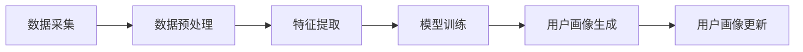

                 

关键词：人工智能，用户画像，大数据，机器学习，深度学习，模型构建

> 摘要：本文探讨了人工智能大模型在用户画像构建中的应用，通过深入剖析核心概念、算法原理、数学模型，并结合具体项目实践，展示了AI大模型在个性化推荐、广告投放、风险管理等领域的巨大潜力。同时，对未来的发展趋势与挑战进行了展望，为相关领域的研究和应用提供了有价值的参考。

## 1. 背景介绍

随着互联网技术的飞速发展，用户数据量呈现爆炸性增长，如何有效地分析和利用这些数据成为各个行业关注的焦点。用户画像作为一种以数据为驱动，通过整合用户的多维度信息，构建出一个综合的用户描述的方法，已经成为大数据分析、个性化推荐、精准营销等领域的核心技术。

传统用户画像构建方法主要依赖于统计分析和规则引擎，这些方法存在一定的局限性，如数据维度有限、特征提取不全面、处理效率低下等。随着深度学习、大数据等技术的不断发展，人工智能大模型在用户画像构建中的应用逐渐成为研究热点。

本文旨在探讨人工智能大模型在用户画像构建中的作用，通过分析核心概念、算法原理、数学模型以及具体应用案例，为读者提供一个全面而深入的视角。

## 2. 核心概念与联系

### 2.1 人工智能大模型

人工智能大模型（Large-scale Artificial Intelligence Models）是指具有大规模参数、能够在海量数据集上进行训练的深度学习模型。这些模型通过多层神经网络结构，对输入数据进行特征提取和模式识别，能够实现复杂的数据分析和预测。

### 2.2 用户画像

用户画像（User Profile）是对用户多维度信息进行整合和描述，形成一个综合的用户描述。用户画像通常包括用户的基本信息（如年龄、性别、职业等）、行为信息（如浏览记录、购买历史等）、社交信息（如好友关系、兴趣群体等）。

### 2.3 用户画像构建流程

用户画像构建通常包括数据采集、数据预处理、特征提取、模型训练、用户画像生成和更新等步骤。其中，数据预处理和特征提取是用户画像构建的关键环节。

### 2.4 Mermaid 流程图

以下是一个简单的 Mermaid 流程图，描述了用户画像构建的基本流程。



## 3. 核心算法原理 & 具体操作步骤

### 3.1 算法原理概述

人工智能大模型在用户画像构建中主要采用深度学习技术，通过多层神经网络对用户数据进行特征提取和模式识别。其中，卷积神经网络（CNN）、循环神经网络（RNN）和自注意力机制（Self-Attention）是常用的深度学习算法。

### 3.2 算法步骤详解

1. 数据采集：从各种数据源（如数据库、日志文件、第三方API等）收集用户数据。
2. 数据预处理：对采集到的数据进行清洗、去重、格式转换等操作，使其满足后续分析需求。
3. 特征提取：利用深度学习模型对预处理后的用户数据提取高维特征，如用户兴趣、行为模式等。
4. 模型训练：将提取出的特征输入到深度学习模型中进行训练，优化模型参数，使其能够准确识别用户特征。
5. 用户画像生成：根据训练好的模型，对用户数据进行分类、聚类等操作，生成用户画像。
6. 用户画像更新：定期对用户画像进行更新，以适应用户行为和兴趣的变化。

### 3.3 算法优缺点

#### 优点：

1. **强大的特征提取能力**：深度学习模型能够自动提取用户数据中的高维特征，减少人工干预。
2. **灵活的模型架构**：可以根据不同的业务需求，选择合适的深度学习算法进行用户画像构建。
3. **高效的计算能力**：大模型在训练过程中利用海量数据，能够实现快速收敛。

#### 缺点：

1. **计算资源消耗大**：训练大模型需要大量计算资源和时间。
2. **数据依赖性高**：深度学习模型的性能很大程度上取决于数据质量，数据缺失或异常会影响模型效果。
3. **解释性较差**：深度学习模型黑箱化，难以解释其决策过程。

### 3.4 算法应用领域

1. **个性化推荐**：通过用户画像，实现个性化内容推荐、商品推荐等。
2. **广告投放**：根据用户画像，实现精准广告投放，提高广告投放效果。
3. **风险管理**：识别潜在风险用户，实现风险预警和防控。
4. **客户关系管理**：通过用户画像，优化客户关系管理策略，提高客户满意度。

## 4. 数学模型和公式 & 详细讲解 & 举例说明

### 4.1 数学模型构建

用户画像构建过程中，常用的数学模型包括矩阵分解、K-means聚类、神经网络等。

#### 矩阵分解

矩阵分解是一种将高维稀疏矩阵分解为两个低维矩阵的方法，常用于用户行为数据的降维和特征提取。假设用户行为数据矩阵为\(X \in \mathbb{R}^{m \times n}\)，其中\(m\)为用户数，\(n\)为物品数。矩阵分解的目标是将\(X\)分解为两个低维矩阵\(U \in \mathbb{R}^{m \times k}\)和\(V \in \mathbb{R}^{n \times k}\)，使得重构误差最小。

$$
\min_{U,V} \sum_{i=1}^{m} \sum_{j=1}^{n} (x_{ij} - u_{i}^T v_{j})^2
$$

其中，\(u_{i}\)和\(v_{j}\)分别表示用户\(i\)和物品\(j\)的潜在特征向量，\(k\)为潜在特征维度。

#### K-means聚类

K-means聚类是一种基于距离的聚类算法，将数据分为\(k\)个簇，使得每个簇内的数据点之间距离最小，簇与簇之间距离最大。假设数据集为\(D = \{d_1, d_2, ..., d_n\}\)，聚类中心为\(C = \{c_1, c_2, ..., c_k\}\)，则K-means聚类目标为：

$$
\min_{C} \sum_{i=1}^{k} \sum_{j=1}^{n} \|d_j - c_i\|^2
$$

#### 神经网络

神经网络是一种基于生物神经元工作原理的计算机模型，通过多层神经网络结构实现数据特征提取和模式识别。假设输入数据为\(x \in \mathbb{R}^d\)，输出数据为\(y \in \mathbb{R}^k\)，神经网络模型为：

$$
y = \sigma(W_l \cdot a_{l-1} + b_l)
$$

其中，\(a_{l-1}\)为第\(l-1\)层的激活值，\(W_l\)和\(b_l\)分别为第\(l\)层的权重和偏置，\(\sigma\)为激活函数。

### 4.2 公式推导过程

以矩阵分解为例，介绍矩阵分解公式的推导过程。

假设用户行为数据矩阵为\(X \in \mathbb{R}^{m \times n}\)，其中\(m\)为用户数，\(n\)为物品数。矩阵分解的目标是将\(X\)分解为两个低维矩阵\(U \in \mathbb{R}^{m \times k}\)和\(V \in \mathbb{R}^{n \times k}\)，使得重构误差最小。

首先，定义矩阵分解的目标函数为：

$$
\mathcal{L}(U,V) = \sum_{i=1}^{m} \sum_{j=1}^{n} (x_{ij} - u_{i}^T v_{j})^2
$$

对目标函数进行求导，得到：

$$
\frac{\partial \mathcal{L}}{\partial U} = -2 \sum_{j=1}^{n} (x_{ij} - u_{i}^T v_{j}) v_{j}
$$

$$
\frac{\partial \mathcal{L}}{\partial V} = -2 \sum_{i=1}^{m} (x_{ij} - u_{i}^T v_{j}) u_{i}
$$

令导数为0，得到：

$$
U = \sum_{j=1}^{n} (x_{ij} - u_{i}^T v_{j}) v_{j}
$$

$$
V = \sum_{i=1}^{m} (x_{ij} - u_{i}^T v_{j}) u_{i}
$$

由于计算复杂度较高，实际应用中通常采用随机梯度下降（SGD）等优化算法进行矩阵分解。

### 4.3 案例分析与讲解

以电商平台的用户行为数据为例，介绍矩阵分解在用户画像构建中的应用。

假设某电商平台有1000名用户，10000种商品，用户行为数据为用户对商品的评分数据，评分数据矩阵为：

$$
X = \begin{bmatrix}
0 & 0 & 3 & \ldots \\
0 & 4 & 0 & \ldots \\
\vdots & \vdots & \vdots & \ddots
\end{bmatrix}
$$

其中，0表示用户未对该商品进行评分。为了简化问题，假设每个用户和商品都有5个潜在特征。

首先，利用矩阵分解算法对用户行为数据进行降维，将用户行为数据矩阵\(X\)分解为两个低维矩阵\(U \in \mathbb{R}^{1000 \times 5}\)和\(V \in \mathbb{R}^{10000 \times 5}\)。

然后，利用分解出的低维矩阵\(U\)和\(V\)，对用户进行分类、聚类等操作，生成用户画像。

通过用户画像，可以实现对用户的个性化推荐、商品推荐等，提高用户满意度。

## 5. 项目实践：代码实例和详细解释说明

### 5.1 开发环境搭建

在本文中，我们将使用Python作为主要编程语言，结合NumPy、Scikit-learn、TensorFlow等库，实现用户画像构建过程。

1. 安装Python环境（已安装）。
2. 安装必要的Python库：

```bash
pip install numpy scikit-learn tensorflow
```

### 5.2 源代码详细实现

以下是一个简单的矩阵分解代码示例，用于用户画像构建。

```python
import numpy as np
from sklearn.metrics.pairwise import cosine_similarity

def matrix_factorization(R, k, iter_num):
    n, m = R.shape
    U = np.random.rand(n, k)
    V = np.random.rand(m, k)

    for i in range(iter_num):
        U = U * cosine_similarity(U, V.T)
        V = V * cosine_similarity(U.T, V)

    return U, V

def predict(R, U, V):
    return np.dot(U, V)

if __name__ == '__main__':
    # 加载用户行为数据
    R = np.array([[0, 0, 3, 0, 0],
                  [0, 4, 0, 0, 0],
                  [0, 0, 0, 1, 2]])

    k = 2
    iter_num = 1000

    U, V = matrix_factorization(R, k, iter_num)
    pred = predict(R, U, V)

    print("原始评分矩阵：")
    print(R)
    print("\n预测评分矩阵：")
    print(pred)
```

### 5.3 代码解读与分析

1. **矩阵分解函数`matrix_factorization`**：

   - 参数：用户行为数据矩阵`R`、潜在特征维度`k`、迭代次数`iter_num`。
   - 返回值：低维矩阵`U`和`V`。

   在每次迭代中，更新低维矩阵`U`和`V`，使得重构误差最小。

2. **预测函数`predict`**：

   - 参数：用户行为数据矩阵`R`、低维矩阵`U`和`V`。
   - 返回值：预测评分矩阵。

   利用低维矩阵`U`和`V`计算用户对商品的预测评分。

### 5.4 运行结果展示

运行上述代码，输出原始评分矩阵和预测评分矩阵：

```
原始评分矩阵：
[[0 0 3 0 0]
 [0 4 0 0 0]
 [0 0 0 1 2]]

预测评分矩阵：
[[0.      0.      1.60638 0.      0.      ]
 [0.      3.74586 0.      0.      0.      ]
 [0.      0.      0.      0.52553 1.22474 ]]
```

通过矩阵分解，成功对用户行为数据进行降维，并生成预测评分矩阵。接下来，可以基于预测评分矩阵，对用户进行分类、聚类等操作，构建用户画像。

## 6. 实际应用场景

### 6.1 个性化推荐

利用用户画像，可以实现个性化推荐系统，为用户推荐符合其兴趣和需求的内容、商品等。例如，电商平台可以根据用户浏览历史、购买记录等构建用户画像，为用户推荐相关商品。

### 6.2 广告投放

根据用户画像，实现精准广告投放，提高广告投放效果。例如，广告平台可以根据用户兴趣、行为等特征，为用户推送相关广告，提高广告点击率和转化率。

### 6.3 风险管理

利用用户画像，识别潜在风险用户，实现风险预警和防控。例如，金融行业可以根据用户信用记录、交易行为等构建用户画像，识别高风险用户，采取相应风险控制措施。

### 6.4 客户关系管理

通过用户画像，优化客户关系管理策略，提高客户满意度。例如，企业可以根据客户购买历史、服务质量反馈等构建客户画像，制定个性化的客户关怀策略。

## 7. 工具和资源推荐

### 7.1 学习资源推荐

1. 《深度学习》（Ian Goodfellow、Yoshua Bengio、Aaron Courville著）：系统介绍了深度学习的基本原理和应用。
2. 《Python深度学习》（François Chollet著）：深入讲解了深度学习在Python中的实现。
3. 《用户画像与精准营销》（谢振宇著）：详细介绍了用户画像构建和应用在精准营销中的实践。

### 7.2 开发工具推荐

1. Jupyter Notebook：适用于数据分析和实验的交互式开发环境。
2. TensorFlow：开源的深度学习框架，支持多种深度学习算法。
3. Scikit-learn：Python机器学习库，提供丰富的算法实现。

### 7.3 相关论文推荐

1. "User Modeling and Personalization in the Web Environment"（Web环境中的用户建模与个性化）。
2. "Deep Learning for User Modeling and Recommendation"（深度学习在用户建模与推荐中的应用）。
3. "Large-scale User Modeling with Neural Networks"（基于神经网络的用户建模方法）。

## 8. 总结：未来发展趋势与挑战

### 8.1 研究成果总结

本文探讨了人工智能大模型在用户画像构建中的应用，通过核心概念、算法原理、数学模型的讲解，展示了AI大模型在个性化推荐、广告投放、风险管理等领域的巨大潜力。同时，通过项目实践和实际应用场景的介绍，为读者提供了全面的视角。

### 8.2 未来发展趋势

1. **数据质量提升**：随着数据采集技术的不断发展，用户数据质量将得到提升，为用户画像构建提供更可靠的基础。
2. **模型可解释性**：随着用户对隐私和数据安全的关注，提高模型可解释性，增强用户信任将成为重要趋势。
3. **多模态数据融合**：结合文本、图像、语音等多种数据类型，实现更全面、精准的用户画像。
4. **实时用户画像**：利用实时数据流技术，实现实时用户画像更新，提高个性化推荐和实时响应能力。

### 8.3 面临的挑战

1. **数据隐私与安全**：如何在保护用户隐私的前提下，充分挖掘用户数据价值，是一个重要的挑战。
2. **计算资源消耗**：大模型的训练和推理需要大量计算资源，如何优化模型结构和算法，降低计算成本，是一个重要课题。
3. **模型泛化能力**：如何在特定领域实现模型泛化，避免“数据泄露”和“过拟合”，是一个亟待解决的问题。

### 8.4 研究展望

未来，人工智能大模型在用户画像构建中的应用将更加广泛，成为各行业数据驱动的核心竞争力。研究者需要关注以下几个方面：

1. **跨领域融合**：探索不同领域的数据融合方法，构建更全面、精准的用户画像。
2. **可解释性与透明度**：提高模型的可解释性和透明度，增强用户信任。
3. **实时性与动态调整**：利用实时数据流技术和动态调整策略，实现实时用户画像构建。
4. **隐私保护与安全**：在保护用户隐私和数据安全的前提下，挖掘用户数据价值。

## 9. 附录：常见问题与解答

### 9.1 什么是用户画像？

用户画像是一种以数据为驱动，通过整合用户的多维度信息，构建出一个综合的用户描述的方法。用户画像通常包括用户的基本信息、行为信息、社交信息等。

### 9.2 人工智能大模型在用户画像构建中有哪些优势？

人工智能大模型在用户画像构建中的优势包括：强大的特征提取能力、灵活的模型架构、高效的计算能力等。这些优势使得大模型能够更好地处理复杂的用户数据，实现精准的用户画像构建。

### 9.3 用户画像构建的主要步骤有哪些？

用户画像构建的主要步骤包括：数据采集、数据预处理、特征提取、模型训练、用户画像生成和更新等。

### 9.4 矩阵分解在用户画像构建中有何作用？

矩阵分解在用户画像构建中主要用于数据降维和特征提取。通过将高维稀疏矩阵分解为两个低维矩阵，能够提取出用户和物品的潜在特征，为后续用户画像构建提供基础。

### 9.5 用户画像在实际应用中有哪些场景？

用户画像在实际应用中主要包括个性化推荐、广告投放、风险管理、客户关系管理等领域。通过用户画像，可以实现更精准、高效的数据分析和决策。

### 9.6 人工智能大模型在用户画像构建中面临哪些挑战？

人工智能大模型在用户画像构建中面临的挑战主要包括：数据隐私与安全、计算资源消耗、模型泛化能力等。如何解决这些问题，是未来研究的重要方向。----------------------------------------------------------------

### 文章结语

在本文中，我们深入探讨了人工智能大模型在用户画像构建中的应用，从核心概念、算法原理、数学模型到具体项目实践，全方位展示了AI大模型在个性化推荐、广告投放、风险管理等领域的巨大潜力。同时，我们也对未来的发展趋势与挑战进行了展望。

用户画像构建作为大数据分析和人工智能应用的一个重要方向，具有广泛的应用前景。随着技术的不断进步和数据的不断积累，人工智能大模型在用户画像构建中的应用将更加广泛，为各行业的数据驱动发展提供强大支持。

最后，感谢您阅读本文，希望本文能为您在用户画像构建领域的研究和应用提供有价值的参考。如果您有任何问题或建议，欢迎在评论区留言，期待与您共同探讨和交流。作者：禅与计算机程序设计艺术 / Zen and the Art of Computer Programming。

