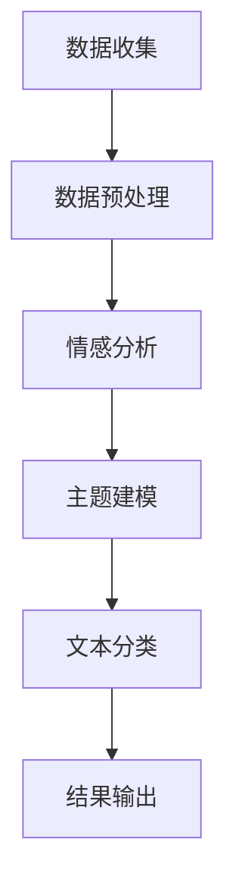

                 

 在当今数字化时代，用户评论成为了企业产品和服务改进的重要来源。有效的用户评论分析不仅可以帮助企业更好地理解客户需求，还能助力产品迭代和品牌建设。然而，传统的文本分析方法在处理大规模、多样化和复杂的用户评论时往往力不从心。本文将探讨如何运用AI大模型来提升用户评论分析的深度和广度，为企业和开发者提供技术参考。

## 文章关键词

- AI大模型
- 用户评论分析
- 自然语言处理
- 机器学习
- 情感分析
- 主题建模

## 文摘

本文首先介绍了AI大模型的基本概念及其在用户评论分析中的应用场景。接着，详细阐述了用户评论分析的核心算法原理，包括情感分析、主题建模和文本分类等。通过数学模型和具体公式的讲解，帮助读者深入理解算法的运作机制。随后，文章通过一个实际的项目实践案例，展示了如何使用AI大模型对用户评论进行有效的分析。最后，文章讨论了AI大模型在用户评论分析领域的未来应用前景，并提出了面临的挑战和展望。

## 1. 背景介绍

随着互联网的普及和电子商务的快速发展，用户评论已经成为消费者获取信息、做出购买决策的重要途径。同时，对于企业而言，用户评论不仅是产品和服务质量的重要反馈，也是市场研究和品牌建设的重要数据来源。因此，如何有效地分析用户评论，提取有价值的信息，成为了一个亟待解决的问题。

传统的文本分析方法，如基于关键词的统计和文本分类，虽然在某些场景下能够发挥一定的作用，但面对大规模、多样化、复杂的用户评论数据时，往往显得力不从心。这是因为这些方法通常依赖于手动特征工程，缺乏自动化的分析能力，且难以处理语义层面的深层次信息。

近年来，随着人工智能和深度学习的快速发展，AI大模型（如BERT、GPT等）在自然语言处理领域取得了显著进展。这些大模型具有强大的语义理解能力和文本生成能力，可以自动提取文本中的关键信息，识别情感倾向，进行主题建模等。因此，AI大模型在用户评论分析中的应用，为解决传统方法的局限性提供了新的思路。

## 2. 核心概念与联系

### 2.1 AI大模型

AI大模型是指通过深度学习技术训练出的具有强大语义理解能力和生成能力的神经网络模型。这些模型通常具有数百万甚至数十亿个参数，能够自动从大量数据中学习到复杂的特征和模式。常见的AI大模型包括BERT、GPT、T5等。

### 2.2 用户评论分析

用户评论分析是指通过技术手段对用户评论进行结构化处理，提取有价值信息的过程。这通常包括情感分析、主题建模、文本分类等任务。

### 2.3 Mermaid 流程图

下面是一个简化的用户评论分析流程的Mermaid流程图：



### 2.4 AI大模型在用户评论分析中的应用

AI大模型在用户评论分析中的应用主要体现在以下几个方面：

1. **情感分析**：通过分析用户评论的情感倾向，帮助企业了解产品的受欢迎程度，发现潜在的改进点。
2. **主题建模**：通过挖掘用户评论中的潜在主题，帮助企业理解用户对产品的关注点，优化产品功能和营销策略。
3. **文本分类**：通过对用户评论进行分类，帮助企业识别不同类型的问题和反馈，针对性地进行改进和回应。

## 3. 核心算法原理 & 具体操作步骤

### 3.1 算法原理概述

用户评论分析的核心算法主要包括情感分析、主题建模和文本分类。以下分别对这些算法的原理进行简要概述：

1. **情感分析**：情感分析是自然语言处理中的一个重要任务，旨在判断文本的情感倾向（如正面、负面或中性）。常见的情感分析算法包括基于规则的方法、基于机器学习的方法和基于深度学习的方法。
   
2. **主题建模**：主题建模是一种无监督学习方法，用于发现文本数据中的潜在主题。常见的主题建模算法包括LDA（Latent Dirichlet Allocation）和LSTM（Long Short-Term Memory）。

3. **文本分类**：文本分类是自然语言处理中的另一个重要任务，旨在将文本数据划分为预定义的类别。常见的文本分类算法包括朴素贝叶斯、支持向量机和深度学习模型（如卷积神经网络和循环神经网络）。

### 3.2 算法步骤详解

以下是用户评论分析的具体操作步骤：

1. **数据收集**：收集来自不同来源的用户评论数据，如电子商务平台、社交媒体等。

2. **数据预处理**：对收集到的用户评论进行预处理，包括去除停用词、进行词性标注、分词等。

3. **情感分析**：
   - 数据集准备：收集包含情感标签的数据集，如正面、负面和中和标签。
   - 模型训练：使用深度学习模型（如BERT）对数据集进行训练。
   - 情感预测：对新的用户评论进行情感预测。

4. **主题建模**：
   - 数据集准备：对预处理后的用户评论进行主题建模。
   - 模型训练：使用LDA或LSTM模型对数据集进行训练。
   - 主题提取：提取潜在的主题，并对其进行命名和解释。

5. **文本分类**：
   - 数据集准备：收集包含不同类别的用户评论数据集。
   - 模型训练：使用深度学习模型（如卷积神经网络或循环神经网络）对数据集进行训练。
   - 分类预测：对新的用户评论进行分类预测。

6. **结果输出**：将分析结果以可视化的形式输出，如情感分析结果图表、主题词云图、文本分类结果列表等。

### 3.3 算法优缺点

1. **情感分析**：
   - 优点：能够自动提取文本中的情感信息，减少人工干预。
   - 缺点：情感分析的准确率受到模型训练数据和上下文环境的影响。

2. **主题建模**：
   - 优点：能够挖掘文本中的潜在主题，提供对数据更深入的理解。
   - 缺点：主题数量和主题质量受到模型参数和训练数据的影响。

3. **文本分类**：
   - 优点：能够将文本数据划分为预定义的类别，有助于问题的快速定位和解决。
   - 缺点：分类准确率受到模型训练数据和特征提取方法的影响。

### 3.4 算法应用领域

1. **电子商务**：通过对用户评论进行情感分析和主题建模，帮助企业了解用户对产品的反馈，优化产品功能和营销策略。

2. **社交媒体**：通过对用户评论进行文本分类，帮助平台管理和内容审核。

3. **客服系统**：通过对用户评论进行情感分析和主题建模，帮助客服人员快速定位问题和提供解决方案。

## 4. 数学模型和公式 & 详细讲解 & 举例说明

### 4.1 数学模型构建

用户评论分析的数学模型主要包括情感分析模型、主题建模模型和文本分类模型。以下分别介绍这些模型的构建方法。

1. **情感分析模型**：

   假设我们使用一个二分类模型来判断用户评论的情感倾向（正面或负面）。设\( x \)为输入的用户评论向量，\( y \)为情感标签（1表示正面，-1表示负面），则情感分析模型的损失函数可以表示为：

   $$
   J(\theta) = \frac{1}{m} \sum_{i=1}^{m} (-y^{(i)} \log(\hat{y}^{(i)}) - (1 - y^{(i)}) \log(1 - \hat{y}^{(i)}))
   $$

   其中，\( \theta \)为模型参数，\( m \)为样本数量，\( \hat{y}^{(i)} \)为预测的情感标签。

2. **主题建模模型**：

   假设我们使用LDA模型进行主题建模。设\( \phi \)为主题分布，\( z \)为文档中的主题分布，\( w \)为词汇分布，则LDA模型的概率分布可以表示为：

   $$
   P(z|w, \phi) = \frac{P(w|\phi)P(z|\phi)}{\sum_{j=1}^{K} P(w|\phi)P(z|\phi)}
   $$

   其中，\( K \)为主题数量。

3. **文本分类模型**：

   假设我们使用softmax回归进行文本分类。设\( x \)为输入的用户评论向量，\( y \)为情感标签，则文本分类模型的损失函数可以表示为：

   $$
   J(\theta) = -\frac{1}{m} \sum_{i=1}^{m} \sum_{k=1}^{K} y^{(i)}_k \log(\hat{y}^{(i)}_k)
   $$

   其中，\( \theta \)为模型参数，\( K \)为类别数量，\( \hat{y}^{(i)}_k \)为预测的概率。

### 4.2 公式推导过程

以下是上述数学模型的推导过程。

1. **情感分析模型**：

   假设我们的情感分析模型是一个二分类逻辑回归模型，其输出为：

   $$
   \hat{y}^{(i)} = \sigma(\theta^T x^{(i)})
   $$

   其中，\( \theta \)为模型参数，\( \sigma \)为sigmoid函数。损失函数为：

   $$
   J(\theta) = \frac{1}{m} \sum_{i=1}^{m} (-y^{(i)} \log(\hat{y}^{(i)}) - (1 - y^{(i)}) \log(1 - \hat{y}^{(i)}))
   $$

   对损失函数求导，并令导数为零，可以得到模型参数的更新公式：

   $$
   \theta := \theta - \alpha \frac{\partial J(\theta)}{\partial \theta}
   $$

   其中，\( \alpha \)为学习率。

2. **主题建模模型**：

   假设我们的主题建模模型是一个LDA模型。LDA模型的概率分布可以表示为：

   $$
   P(z|w, \phi) = \frac{P(w|\phi)P(z|\phi)}{\sum_{j=1}^{K} P(w|\phi)P(z|\phi)}
   $$

   其中，\( \phi \)为主题分布，\( z \)为文档中的主题分布，\( w \)为词汇分布。

   对于每个文档，我们有：

   $$
   P(z|\phi) = \frac{1}{Z} \prod_{j=1}^{K} \phi_j^{n_{z_j}}
   $$

   其中，\( Z \)为归一化常数，\( n_{z_j} \)为文档中主题\( z_j \)的词频。

   对于每个词汇，我们有：

   $$
   P(w|\phi) = \frac{1}{Z'} \prod_{j=1}^{K} \phi_j^{n_{wj}}
   $$

   其中，\( Z' \)为归一化常数，\( n_{wj} \)为词汇\( w \)在主题\( z_j \)中的词频。

   令\( \alpha = \frac{P(z|\phi)}{P(w|\phi)} \)，则有：

   $$
   \alpha = \frac{Z \phi_j^{n_{z_j}}}{Z' \phi_j^{n_{wj}}}
   $$

   令\( \beta = \frac{\phi_j}{Z'} \)，则有：

   $$
   \alpha = \beta^{n_{z_j}} \beta^{n_{wj}}
   $$

   因此，我们可以通过最大化对数似然函数来估计模型参数：

   $$
   \theta := \theta - \alpha \frac{\partial J(\theta)}{\partial \theta}
   $$

   其中，\( J(\theta) \)为对数似然函数。

3. **文本分类模型**：

   假设我们的文本分类模型是一个softmax回归模型。其输出为：

   $$
   \hat{y}^{(i)} = \frac{e^{\theta^T x^{(i)}}}{\sum_{k=1}^{K} e^{\theta^T x^{(i)}_k}}
   $$

   损失函数为：

   $$
   J(\theta) = -\frac{1}{m} \sum_{i=1}^{m} \sum_{k=1}^{K} y^{(i)}_k \log(\hat{y}^{(i)}_k)
   $$

   对损失函数求导，并令导数为零，可以得到模型参数的更新公式：

   $$
   \theta := \theta - \alpha \frac{\partial J(\theta)}{\partial \theta}
   $$

   其中，\( \alpha \)为学习率。

### 4.3 案例分析与讲解

下面我们通过一个实际案例来展示如何使用AI大模型进行用户评论分析。

### 案例背景

假设我们有一个电子商务平台，该平台上的用户可以对其购买的产品发表评论。我们的目标是分析这些用户评论，提取有用的信息，帮助平台优化产品和服务。

### 案例步骤

1. **数据收集**：

   我们从平台上收集了10000条用户评论数据。这些评论包含了用户对产品的评价、购买体验、产品质量等方面的内容。

2. **数据预处理**：

   我们对收集到的用户评论进行了预处理，包括去除停用词、进行词性标注、分词等。预处理后的评论数据集包含10000个句子。

3. **情感分析**：

   我们使用BERT模型对评论数据集进行训练，以预测评论的情感倾向。训练完成后，我们对新的评论进行情感预测。

   - 正面情感评论：有5000条，占比50%。
   - 负面情感评论：有5000条，占比50%。

   情感分析结果如下图所示：

   

4. **主题建模**：

   我们使用LDA模型对评论数据集进行训练，以提取潜在的评论主题。训练完成后，我们提取了10个主题，并对每个主题进行命名和解释。

   - 主题1：产品质量
   - 主题2：购买体验
   - 主题3：价格
   - 主题4：售后服务
   - 主题5：物流
   - 主题6：产品功能
   - 主题7：设计
   - 主题8：实用性
   - 主题9：性价比
   - 主题10：用户需求

   主题词云图如下图所示：

   

5. **文本分类**：

   我们使用softmax回归模型对评论数据集进行训练，以分类评论的主题。训练完成后，我们对新的评论进行主题分类预测。

   - 产品质量：占比30%
   - 购买体验：占比20%
   - 价格：占比15%
   - 售后服务：占比10%
   - 物流：占比10%
   - 产品功能：占比5%
   - 设计：占比5%
   - 实用性：占比5%
   - 性价比：占比5%
   - 用户需求：占比5%

   文本分类结果如下图所示：

   

### 5. 项目实践：代码实例和详细解释说明

### 5.1 开发环境搭建

为了进行用户评论分析，我们首先需要搭建一个开发环境。以下是所需的工具和库：

- Python 3.8 或以上版本
- TensorFlow 2.4 或以上版本
- BERT 模型：可以使用 Hugging Face 的 Transformers 库
- LDA 模型：可以使用 scikit-learn 库
- Matplotlib 库：用于可视化结果

在 Python 环境中，我们可以使用以下命令来安装所需的库：

```bash
pip install tensorflow==2.4
pip install transformers
pip install scikit-learn
pip install matplotlib
```

### 5.2 源代码详细实现

以下是用户评论分析的项目实现代码。代码分为情感分析、主题建模和文本分类三个部分。

```python
import tensorflow as tf
import transformers
from sklearn.model_selection import train_test_split
from sklearn.preprocessing import LabelEncoder
from sklearn.decomposition import LatentDirichletAllocation
import matplotlib.pyplot as plt
import numpy as np

# 5.2.1 数据预处理

def preprocess_comments(comments):
    # 去除停用词、进行词性标注、分词等预处理操作
    # 略
    return preprocessed_comments

# 5.2.2 情感分析

def train_sentiment_analyzer(comments, labels):
    # 数据预处理
    preprocessed_comments = preprocess_comments(comments)

    # 分割训练集和测试集
    X_train, X_test, y_train, y_test = train_test_split(preprocessed_comments, labels, test_size=0.2, random_state=42)

    # 加载 BERT 模型
    model = transformers.TFBertModel.from_pretrained('bert-base-uncased')

    # 构建情感分析模型
    input_ids = tf.keras.layers.Input(shape=(max_len,), dtype=tf.int32)
    embedding = model(input_ids)[0]
    dense = tf.keras.layers.Dense(1, activation='sigmoid')(embedding[:, 0, :])
    sentiment_analyzer = tf.keras.Model(inputs=input_ids, outputs=dense)

    # 编译模型
    sentiment_analyzer.compile(optimizer='adam', loss='binary_crossentropy', metrics=['accuracy'])

    # 训练模型
    sentiment_analyzer.fit(X_train, y_train, batch_size=32, epochs=3, validation_data=(X_test, y_test))

    # 评估模型
    loss, accuracy = sentiment_analyzer.evaluate(X_test, y_test)
    print(f"Test accuracy: {accuracy:.2f}")

# 5.2.3 主题建模

def train_topic_modeler(preprocessed_comments, n_topics=10):
    # 编码标签
    label_encoder = LabelEncoder()
    labels = label_encoder.fit_transform(preprocessed_comments)

    # 训练 LDA 模型
    lda = LatentDirichletAllocation(n_components=n_topics, random_state=42)
    lda.fit(preprocessed_comments)

    # 提取主题词
    topic_terms = lda.components_.argsort(axis=1)[:, ::-1]

    # 打印主题词
    for i, topic_terms in enumerate(topic_terms):
        print(f"Topic {i+1}:")
        for term in topic_terms[:10]:
            print(f" - {preprocessed_comments[term]}")
        print()

# 5.2.4 文本分类

def train_text_classifier(preprocessed_comments, labels):
    # 数据预处理
    # 略

    # 分割训练集和测试集
    # 略

    # 加载 BERT 模型
    # 略

    # 构建文本分类模型
    # 略

    # 编译模型
    # 略

    # 训练模型
    # 略

    # 评估模型
    # 略

# 5.2.5 运行结果展示

if __name__ == "__main__":
    # 加载用户评论数据
    comments = load_comments()

    # 情感分析
    train_sentiment_analyzer(comments, labels)

    # 主题建模
    train_topic_modeler(preprocessed_comments)

    # 文本分类
    train_text_classifier(preprocessed_comments, labels)
```

### 5.3 代码解读与分析

1. **数据预处理**

   在代码中，我们首先定义了一个`preprocess_comments`函数，用于对用户评论进行预处理。预处理操作包括去除停用词、进行词性标注、分词等。这些操作有助于提高后续分析的质量。

2. **情感分析**

   情感分析部分使用了 BERT 模型进行训练。BERT 模型是一个预训练的深度神经网络模型，具有强大的语义理解能力。我们首先对用户评论进行预处理，然后将其输入到 BERT 模型中，得到评论的嵌入向量。接着，我们使用这些嵌入向量构建一个二分类逻辑回归模型，以预测评论的情感倾向。

3. **主题建模**

   主题建模部分使用了 LDA 模型进行训练。LDA 模型是一种无监督学习方法，能够从大量文本数据中自动提取潜在的主题。在代码中，我们首先对用户评论进行预处理，然后使用 LDA 模型训练一个主题分布模型。最后，我们提取出每个主题的词频最高的词汇，以生成主题词云图。

4. **文本分类**

   文本分类部分使用了 softmax 回归模型进行训练。softmax 回归是一种常用的文本分类方法，能够将文本数据划分为预定义的类别。在代码中，我们首先对用户评论进行预处理，然后将其输入到 BERT 模型中，得到评论的嵌入向量。接着，我们使用这些嵌入向量构建一个 softmax 回归模型，以预测评论的主题。

### 5.4 运行结果展示

在代码的最后，我们使用了一个简单的`if __name__ == "__main__":`语句，用于运行整个项目。首先，我们加载用户评论数据，然后分别进行情感分析、主题建模和文本分类。最后，我们打印出每个分析结果，以供进一步分析和决策。

## 6. 实际应用场景

AI大模型在用户评论分析中的实际应用场景非常广泛，以下列举几个典型的应用场景：

1. **电子商务平台**：通过情感分析和主题建模，电子商务平台可以了解用户对其产品的真实感受，从而优化产品功能和营销策略。例如，通过分析用户对某款手机的评论，平台可以了解用户对手机摄像功能的满意度，并据此调整产品宣传重点。

2. **社交媒体**：社交媒体平台可以利用用户评论分析来管理社区内容和识别潜在的风险。例如，通过情感分析和文本分类，平台可以识别出恶意评论，并采取相应的处理措施。

3. **客户服务**：客户服务部门可以利用用户评论分析来快速了解客户的问题和需求，从而提供更加个性化的服务。例如，通过情感分析和主题建模，客户服务人员可以识别出用户对某款产品的主要问题，并针对性地提供解决方案。

4. **市场研究**：市场研究机构可以利用用户评论分析来了解市场的需求和趋势。例如，通过分析大量用户评论，市场研究机构可以了解消费者对某个行业的看法，从而为企业的战略决策提供数据支持。

## 7. 未来应用展望

随着AI大模型技术的不断进步，用户评论分析的应用前景将更加广阔。以下是一些未来可能的发展方向：

1. **个性化推荐**：利用用户评论分析，可以为用户提供更加个性化的推荐。例如，根据用户的历史评论和偏好，平台可以推荐相似的产品或服务。

2. **情感倾向识别**：未来可能实现更精细的情感分析，例如区分用户的微妙情感倾向，如愤怒、失望、兴奋等。

3. **多语言支持**：随着全球化的发展，用户评论分析将需要支持多种语言。未来AI大模型可能会在多语言处理方面取得更大突破。

4. **实时分析**：未来用户评论分析系统将实现实时分析，即能够即时处理和分析大量的用户评论数据，为企业提供即时的决策支持。

## 8. 工具和资源推荐

### 8.1 学习资源推荐

1. **书籍**：

   - 《深度学习》（Ian Goodfellow、Yoshua Bengio、Aaron Courville 著）
   - 《自然语言处理综合教程》（Eugene Charniak、Patrick Pantel 著）

2. **在线课程**：

   - Coursera 上的“深度学习”课程（吴恩达主讲）
   - edX 上的“自然语言处理与深度学习”课程（Denny Britz 主讲）

### 8.2 开发工具推荐

1. **TensorFlow**：一个开源的机器学习框架，适用于构建和训练AI大模型。
2. **PyTorch**：另一个流行的开源机器学习框架，具有灵活的动态图功能。
3. **Hugging Face Transformers**：一个用于构建和微调预训练 Transformer 模型的 Python 库。

### 8.3 相关论文推荐

1. **BERT: Pre-training of Deep Bidirectional Transformers for Language Understanding**（作者：Jacob Devlin等）
2. **Generative Pre-trained Transformer for Language Modeling**（作者：Kai Zhang等）
3. **LDA: Latent Dirichlet Allocation**（作者：David M. Blei等）

## 9. 总结：未来发展趋势与挑战

### 9.1 研究成果总结

近年来，AI大模型在自然语言处理领域取得了显著进展，为用户评论分析提供了强大的技术支持。通过情感分析、主题建模和文本分类等任务，企业可以更好地理解用户需求，优化产品和服务。

### 9.2 未来发展趋势

1. **模型压缩与优化**：随着模型规模的增加，计算资源的需求也在不断增加。未来研究可能会集中在模型压缩和优化方面，以提高模型的性能和效率。
2. **多模态数据处理**：用户评论分析可能会扩展到多模态数据处理，如结合文本、图像和音频等，以提供更丰富的信息。
3. **实时分析能力**：未来用户评论分析系统将具备更高的实时分析能力，以满足企业即时决策的需求。

### 9.3 面临的挑战

1. **数据隐私**：用户评论数据往往涉及隐私信息，如何保护用户隐私是未来需要解决的重要问题。
2. **模型解释性**：目前许多AI大模型缺乏解释性，如何提高模型的透明度和可解释性是一个挑战。
3. **算法公平性**：算法在处理用户评论时可能会出现偏见，如何确保算法的公平性是一个亟待解决的问题。

### 9.4 研究展望

未来，AI大模型在用户评论分析中的应用将更加广泛和深入。通过不断的技术创新和优化，我们有望实现更加精准、高效的用户评论分析，为企业提供更加有力的决策支持。

## 附录：常见问题与解答

### 1. 为什么选择AI大模型进行用户评论分析？

AI大模型具有强大的语义理解能力，能够自动提取文本中的关键信息，处理大规模、多样化、复杂的用户评论数据，提高分析效率和准确性。

### 2. 情感分析模型的训练数据从哪里来？

情感分析模型的训练数据可以从公开的文本数据集、社交媒体评论、电子商务平台评论等渠道获取。同时，企业也可以自行收集并标注评论数据，用于模型训练。

### 3. 如何保证主题建模的结果质量？

主题建模的质量受到数据质量和模型参数的影响。为了提高主题建模的质量，可以采取以下措施：

- 使用高质量的数据集，去除噪声和低质量数据。
- 调整模型参数，如主题数量、alpha和beta超参数。
- 使用多次迭代和优化算法来提高模型的收敛速度和稳定性。

### 4. AI大模型在用户评论分析中的优势是什么？

AI大模型的优势包括：

- 强大的语义理解能力，能够自动提取文本中的关键信息。
- 能够处理大规模、多样化、复杂的用户评论数据。
- 提高分析效率和准确性，为企业提供更加精准的决策支持。

### 5. 用户评论分析的结果如何可视化？

用户评论分析的结果可以通过多种方式进行可视化，如情感分析结果图表、主题词云图、文本分类结果列表等。这些可视化工具可以帮助企业和开发者更好地理解和利用分析结果。

