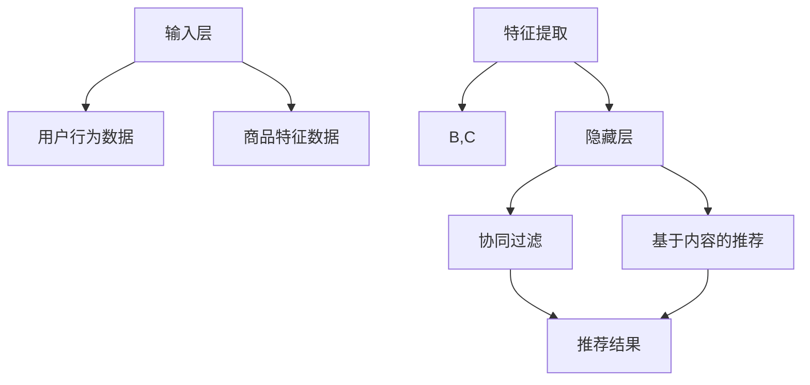

                 

关键词：AI大模型、电商、实时推荐、优化、算法原理、数学模型、项目实践、应用场景、未来展望

摘要：本文旨在探讨AI大模型在电商实时推荐系统中的应用与优化。首先，介绍了电商实时推荐系统的背景和重要性，随后详细阐述了AI大模型的原理、构建方法和应用步骤。通过数学模型和具体案例的分析，揭示了AI大模型在电商实时推荐中的关键作用。文章最后提出了AI大模型在实际应用中的挑战和未来发展方向，为电商领域的AI研究提供了有益的参考。

## 1. 背景介绍

随着互联网技术的快速发展，电子商务已经成为现代商业的重要组成部分。电商平台的实时推荐系统是提高用户体验、促进销售转化的重要手段。实时推荐系统通过分析用户行为、商品特征和推荐算法，为用户实时提供个性化的商品推荐，从而提高用户满意度和电商平台的经济效益。

传统的推荐系统主要依赖于基于内容的推荐和协同过滤方法。然而，这些方法存在一定的局限性，如推荐结果的准确性不高、无法处理大规模数据等。随着AI技术的不断进步，特别是大模型技术的引入，电商实时推荐系统迎来了新的发展机遇。

AI大模型，尤其是深度学习模型，具有强大的特征提取和模式识别能力，能够处理大规模、多维度、动态变化的数据。这使得AI大模型在电商实时推荐系统中具有广泛的应用前景，可以显著提升推荐系统的效果和用户体验。

本文将围绕AI大模型在电商实时推荐系统中的应用与优化展开讨论，首先介绍AI大模型的基本概念和原理，然后分析其在电商推荐中的具体应用场景，最后探讨AI大模型的优化方法和未来发展趋势。

### 1.1 电商实时推荐系统的现状

当前，电商实时推荐系统主要依赖于以下几个方面的技术：

- **用户行为分析**：通过用户的浏览、点击、购买等行为数据，分析用户的兴趣和偏好。
- **商品信息处理**：对商品的各种属性进行描述和标签化，以便于推荐算法使用。
- **协同过滤算法**：基于用户的历史行为和相似用户的行为，为用户推荐商品。
- **基于内容的推荐**：根据商品的属性和用户的偏好，为用户推荐相似的或感兴趣的商品。

虽然这些方法在一定程度上提高了推荐系统的效果，但它们仍然存在以下问题：

- **数据稀疏性**：由于用户行为的多样性，用户和商品之间的交互数据往往非常稀疏。
- **推荐准确性**：传统推荐方法难以处理动态变化的数据，推荐结果准确性有限。
- **实时性**：在大量用户和商品的情况下，实时推荐系统的响应速度成为瓶颈。

### 1.2 AI大模型的优势

AI大模型，尤其是深度学习模型，能够有效解决传统推荐系统面临的问题。具体优势包括：

- **强大的特征提取能力**：深度学习模型可以通过多层神经网络自动提取数据的特征，无需人工干预。
- **处理大规模数据**：大模型可以处理海量数据，适应电商平台的用户和商品规模。
- **动态适应性**：大模型能够快速适应数据的变化，提供实时、个性化的推荐。
- **高推荐准确性**：通过学习用户和商品的多维度特征，大模型可以提供更准确的推荐结果。

### 1.3 AI大模型在电商实时推荐中的挑战

尽管AI大模型具有显著的优势，但在电商实时推荐中的应用仍然面临以下挑战：

- **数据隐私保护**：用户数据的隐私和安全是电商实时推荐系统面临的重要问题。
- **模型可解释性**：大模型的复杂性和黑箱特性使得其决策过程难以解释，不利于用户信任和监管。
- **计算资源需求**：大模型训练和推理需要大量的计算资源，对硬件设施有较高要求。
- **数据质量和噪声**：噪声数据和错误特征可能影响大模型的训练效果和推荐准确性。

### 1.4 本文结构

本文结构如下：

- **第1章**：背景介绍，阐述电商实时推荐系统的现状和AI大模型的优势。
- **第2章**：核心概念与联系，详细解释AI大模型的基本原理和架构。
- **第3章**：核心算法原理 & 具体操作步骤，介绍AI大模型在电商推荐中的应用步骤。
- **第4章**：数学模型和公式 & 详细讲解 & 举例说明，探讨AI大模型背后的数学原理。
- **第5章**：项目实践：代码实例和详细解释说明，通过实际项目展示AI大模型的应用。
- **第6章**：实际应用场景，分析AI大模型在电商实时推荐中的具体应用案例。
- **第7章**：工具和资源推荐，介绍相关的学习资源和开发工具。
- **第8章**：总结：未来发展趋势与挑战，探讨AI大模型在电商实时推荐中的未来发展方向。

## 2. 核心概念与联系

### 2.1 AI大模型的基本概念

AI大模型（Large-scale AI Model）是指具有海量参数、可以处理大规模数据的深度学习模型。这类模型通常采用神经网络结构，通过多层非线性变换，实现数据的特征提取和模式识别。

AI大模型的核心特点包括：

- **海量参数**：大模型通常具有数十亿甚至千亿级别的参数，这使得模型具有强大的表示能力和学习能力。
- **多层网络**：通过多层神经网络结构，大模型可以自动提取数据的高层次特征，实现复杂的模式识别。
- **端到端学习**：大模型可以实现端到端的学习，直接从原始数据中学习到最终的预测结果，无需人工干预特征工程。

### 2.2 AI大模型的原理

AI大模型的原理主要基于深度学习（Deep Learning）和神经网络（Neural Networks）。

- **深度学习**：深度学习是一种基于多层神经网络的学习方法，通过逐层抽象和表示数据，实现从简单特征到复杂特征的转换。深度学习模型的核心是多层感知机（Multilayer Perceptron，MLP），它通过输入层、隐藏层和输出层，实现对数据的非线性映射。

- **神经网络**：神经网络是由大量人工神经元组成的计算模型，每个神经元接收多个输入信号，通过加权求和和激活函数，产生输出信号。神经网络通过反向传播算法，不断调整权重和偏置，实现数据的特征提取和模式识别。

### 2.3 AI大模型的架构

AI大模型的架构主要包括以下几个方面：

- **输入层**：接收外部数据，如用户行为数据、商品特征数据等。
- **隐藏层**：通过多层神经网络结构，对输入数据进行特征提取和变换。
- **输出层**：根据隐藏层的输出，产生最终的预测结果，如推荐结果、分类结果等。

具体来说，AI大模型的架构可以表示为：


其中，输入层负责接收原始数据，隐藏层通过多层神经网络实现数据的特征提取和变换，输出层根据隐藏层的输出产生最终的预测结果。

### 2.4 AI大模型在电商推荐中的应用

AI大模型在电商推荐中的应用主要包括以下几个方面：

- **用户行为分析**：通过分析用户的浏览、点击、购买等行为数据，识别用户的兴趣和偏好，为用户推荐个性化的商品。
- **商品特征提取**：对商品的各种属性进行描述和标签化，如商品类别、价格、品牌等，为大模型提供丰富的输入特征。
- **协同过滤**：通过用户和商品之间的交互数据，建立用户和商品之间的关系，为大模型提供协同过滤的依据。
- **基于内容的推荐**：通过商品的特征信息，为用户推荐与用户历史行为相似的或用户可能感兴趣的商品。

### 2.5 AI大模型与电商推荐系统的关系

AI大模型与电商推荐系统之间的关系可以概括为以下几个方面：

- **提升推荐准确性**：AI大模型通过深度学习技术，能够自动提取数据的高层次特征，实现更准确的推荐结果。
- **优化推荐效果**：AI大模型可以处理大规模、多维度、动态变化的数据，为用户提供实时、个性化的推荐。
- **降低开发难度**：AI大模型可以自动进行特征提取和模式识别，减少传统推荐系统的人工干预，降低开发难度。
- **提高用户体验**：通过个性化、精准的推荐，提高用户满意度和电商平台的经济效益。

### 2.6 Mermaid 流程图

为了更好地展示AI大模型在电商推荐系统中的应用，我们使用Mermaid语言绘制了以下流程图：



### 2.7 AI大模型的工作流程

AI大模型在电商推荐系统中的工作流程可以概括为以下几个步骤：

1. **数据收集**：收集用户的浏览、点击、购买等行为数据，以及商品的各种属性数据。
2. **数据预处理**：对原始数据进行清洗、去重、标准化等预处理操作，确保数据质量。
3. **特征提取**：使用深度学习模型，对预处理后的数据进行特征提取，提取用户和商品的高层次特征。
4. **模型训练**：使用提取到的特征数据，对深度学习模型进行训练，调整模型参数。
5. **推荐生成**：根据训练好的模型，为用户生成个性化的推荐结果。
6. **推荐评估**：对推荐结果进行评估，优化模型参数，提高推荐准确性。

### 2.8 AI大模型的优缺点

AI大模型在电商推荐系统中的应用具有以下优缺点：

- **优点**：
  - 强大的特征提取能力：AI大模型可以通过多层神经网络，自动提取数据的高层次特征，实现更准确的推荐。
  - 处理大规模数据：AI大模型可以处理海量数据，适应电商平台的用户和商品规模。
  - 动态适应性：AI大模型能够快速适应数据的变化，提供实时、个性化的推荐。

- **缺点**：
  - 数据隐私保护：大模型训练和预测过程中，需要处理大量的用户数据，存在隐私泄露的风险。
  - 模型可解释性：大模型的复杂性和黑箱特性，使得其决策过程难以解释，不利于用户信任和监管。
  - 计算资源需求：大模型训练和推理需要大量的计算资源，对硬件设施有较高要求。
  - 数据质量和噪声：噪声数据和错误特征可能影响大模型的训练效果和推荐准确性。

## 3. 核心算法原理 & 具体操作步骤

### 3.1 算法原理概述

AI大模型在电商实时推荐中的核心算法原理主要包括以下几个方面：

- **用户行为分析**：通过分析用户的浏览、点击、购买等行为数据，识别用户的兴趣和偏好。
- **商品特征提取**：对商品的各种属性进行描述和标签化，提取用户和商品的高层次特征。
- **协同过滤算法**：通过用户和商品之间的交互数据，建立用户和商品之间的关系，为用户推荐相关的商品。
- **基于内容的推荐**：通过商品的特征信息，为用户推荐与用户历史行为相似的或用户可能感兴趣的商品。

### 3.2 算法步骤详解

AI大模型在电商实时推荐中的具体操作步骤如下：

1. **数据收集**：收集用户的浏览、点击、购买等行为数据，以及商品的各种属性数据。

2. **数据预处理**：对原始数据进行清洗、去重、标准化等预处理操作，确保数据质量。

3. **特征提取**：
   - 对用户行为数据进行预处理，提取用户的基本信息、浏览记录、点击记录、购买记录等。
   - 对商品特征数据进行预处理，提取商品的基本信息、价格、品牌、类别、库存等。
   - 使用深度学习模型，对预处理后的数据进行特征提取，提取用户和商品的高层次特征。

4. **模型训练**：
   - 使用提取到的特征数据，划分训练集和测试集，对深度学习模型进行训练。
   - 使用反向传播算法，不断调整模型参数，优化模型性能。

5. **推荐生成**：
   - 使用训练好的模型，对用户的输入特征进行预测，生成推荐结果。
   - 对推荐结果进行排序，生成个性化的推荐列表。

6. **推荐评估**：
   - 使用测试集对推荐结果进行评估，计算推荐准确率、推荐覆盖率等指标。
   - 根据评估结果，优化模型参数，提高推荐准确性。

### 3.3 算法优缺点

AI大模型在电商实时推荐中的应用具有以下优缺点：

- **优点**：
  - 强大的特征提取能力：AI大模型可以通过多层神经网络，自动提取数据的高层次特征，实现更准确的推荐。
  - 处理大规模数据：AI大模型可以处理海量数据，适应电商平台的用户和商品规模。
  - 动态适应性：AI大模型能够快速适应数据的变化，提供实时、个性化的推荐。

- **缺点**：
  - 数据隐私保护：大模型训练和预测过程中，需要处理大量的用户数据，存在隐私泄露的风险。
  - 模型可解释性：大模型的复杂性和黑箱特性，使得其决策过程难以解释，不利于用户信任和监管。
  - 计算资源需求：大模型训练和推理需要大量的计算资源，对硬件设施有较高要求。
  - 数据质量和噪声：噪声数据和错误特征可能影响大模型的训练效果和推荐准确性。

### 3.4 算法应用领域

AI大模型在电商实时推荐中的应用广泛，主要涵盖以下几个领域：

- **用户行为分析**：通过分析用户的浏览、点击、购买等行为数据，识别用户的兴趣和偏好，为用户推荐个性化的商品。
- **商品特征提取**：对商品的各种属性进行描述和标签化，提取用户和商品的高层次特征，为推荐算法提供丰富的输入。
- **协同过滤**：通过用户和商品之间的交互数据，建立用户和商品之间的关系，为用户推荐相关的商品。
- **基于内容的推荐**：通过商品的特征信息，为用户推荐与用户历史行为相似的或用户可能感兴趣的商品。

## 4. 数学模型和公式 & 详细讲解 & 举例说明

### 4.1 数学模型构建

在AI大模型中，常用的数学模型主要包括神经网络模型、协同过滤模型和基于内容的推荐模型。下面分别介绍这些模型的数学表示和公式。

#### 4.1.1 神经网络模型

神经网络模型是一种基于多层感知机的模型，其数学表示如下：

$$
Z = W \cdot X + b
$$

其中，$Z$ 表示隐藏层的输出，$W$ 表示权重矩阵，$X$ 表示输入特征，$b$ 表示偏置项。

#### 4.1.2 协同过滤模型

协同过滤模型是一种基于用户和商品之间的交互数据的推荐模型，其数学表示如下：

$$
R_{ui} = \frac{ \sum_{j \in \mathcal{N}_i} r_{uj} \cdot q_j }{ \sum_{j \in \mathcal{N}_i} q_j }
$$

其中，$R_{ui}$ 表示用户 $u$ 对商品 $i$ 的评分，$\mathcal{N}_i$ 表示与商品 $i$ 相似的一组商品，$r_{uj}$ 表示用户 $u$ 对商品 $j$ 的评分，$q_j$ 表示商品 $j$ 的特征向量。

#### 4.1.3 基于内容的推荐模型

基于内容的推荐模型是一种基于商品特征信息的推荐模型，其数学表示如下：

$$
R_{ui} = \frac{ \sum_{j \in \mathcal{S}_i} \cdot \mathbf{w}_i \cdot \mathbf{v}_j }{ \sum_{j \in \mathcal{S}_i} \cdot \mathbf{v}_j }
$$

其中，$R_{ui}$ 表示用户 $u$ 对商品 $i$ 的评分，$\mathcal{S}_i$ 表示与商品 $i$ 类似的一组商品，$\mathbf{w}_i$ 表示商品 $i$ 的特征向量，$\mathbf{v}_j$ 表示商品 $j$ 的特征向量。

### 4.2 公式推导过程

下面以神经网络模型为例，介绍其公式的推导过程。

#### 4.2.1 神经网络前向传播

在神经网络的前向传播过程中，输入特征 $X$ 通过多层神经元传递，最终得到输出特征 $Z$。具体推导如下：

$$
Z = W \cdot X + b
$$

其中，$W$ 表示权重矩阵，$X$ 表示输入特征，$b$ 表示偏置项。

#### 4.2.2 激活函数

为了引入非线性特性，神经网络通常使用激活函数（如ReLU、Sigmoid、Tanh等）对输出特征进行变换。以ReLU激活函数为例，推导如下：

$$
\text{ReLU}(z) = \max(0, z)
$$

其中，$z$ 表示输入特征，$\text{ReLU}(z)$ 表示ReLU激活函数的输出。

#### 4.2.3 神经网络反向传播

在神经网络的反向传播过程中，通过计算梯度，调整权重矩阵和偏置项，优化模型性能。具体推导如下：

$$
\begin{aligned}
\frac{\partial Z}{\partial W} &= X \\
\frac{\partial Z}{\partial b} &= 1 \\
\frac{\partial Z}{\partial X} &= W
\end{aligned}
$$

其中，$\frac{\partial Z}{\partial W}$、$\frac{\partial Z}{\partial b}$ 和 $\frac{\partial Z}{\partial X}$ 分别表示对 $Z$ 关于 $W$、$b$ 和 $X$ 的偏导数。

### 4.3 案例分析与讲解

下面通过一个简单的案例，介绍AI大模型在电商实时推荐中的应用。

#### 4.3.1 案例背景

假设有一个电商平台，包含10万种商品和100万用户。用户行为数据包括浏览记录、点击记录和购买记录等。商品特征数据包括商品类别、价格、品牌、库存等。

#### 4.3.2 数据预处理

对用户行为数据和商品特征数据进行清洗、去重和标准化等预处理操作，确保数据质量。

#### 4.3.3 特征提取

使用深度学习模型，对预处理后的数据进行特征提取，提取用户和商品的高层次特征。

#### 4.3.4 模型训练

使用提取到的特征数据，划分训练集和测试集，对深度学习模型进行训练。使用反向传播算法，不断调整模型参数，优化模型性能。

#### 4.3.5 推荐生成

使用训练好的模型，对用户的输入特征进行预测，生成推荐结果。对推荐结果进行排序，生成个性化的推荐列表。

#### 4.3.6 推荐评估

使用测试集对推荐结果进行评估，计算推荐准确率、推荐覆盖率等指标。根据评估结果，优化模型参数，提高推荐准确性。

### 4.4 神经网络模型数学公式

在神经网络模型中，常用的数学公式包括前向传播和反向传播的公式。下面分别介绍这些公式的具体内容。

#### 4.4.1 前向传播

在神经网络的前向传播过程中，输入特征 $X$ 通过多层神经元传递，最终得到输出特征 $Z$。具体公式如下：

$$
Z = W \cdot X + b
$$

其中，$Z$ 表示隐藏层的输出，$W$ 表示权重矩阵，$X$ 表示输入特征，$b$ 表示偏置项。

#### 4.4.2 反向传播

在神经网络的反向传播过程中，通过计算梯度，调整权重矩阵和偏置项，优化模型性能。具体公式如下：

$$
\begin{aligned}
\frac{\partial Z}{\partial W} &= X \\
\frac{\partial Z}{\partial b} &= 1 \\
\frac{\partial Z}{\partial X} &= W
\end{aligned}
$$

其中，$\frac{\partial Z}{\partial W}$、$\frac{\partial Z}{\partial b}$ 和 $\frac{\partial Z}{\partial X}$ 分别表示对 $Z$ 关于 $W$、$b$ 和 $X$ 的偏导数。

### 4.5 神经网络模型与协同过滤模型的比较

神经网络模型和协同过滤模型都是电商实时推荐系统中常用的算法。下面从数学公式、模型结构和应用效果等方面进行比较。

#### 4.5.1 数学公式

- **神经网络模型**：神经网络模型的数学公式主要包括前向传播和反向传播的公式。公式较为复杂，涉及矩阵运算和激活函数。
- **协同过滤模型**：协同过滤模型的数学公式相对简单，主要涉及用户和商品之间的交互数据，以及特征向量的计算。

#### 4.5.2 模型结构

- **神经网络模型**：神经网络模型包括输入层、隐藏层和输出层，通过多层神经元传递实现数据的特征提取和模式识别。
- **协同过滤模型**：协同过滤模型主要包括用户和商品之间的交互数据，以及特征向量的计算。模型结构相对简单。

#### 4.5.3 应用效果

- **神经网络模型**：神经网络模型具有强大的特征提取和模式识别能力，能够处理大规模、多维度、动态变化的数据，推荐准确性较高。
- **协同过滤模型**：协同过滤模型在处理静态数据时效果较好，但在处理动态变化的数据时，推荐准确性有限。

综上所述，神经网络模型在电商实时推荐系统中具有更好的应用效果。

### 4.6 举例说明

为了更好地理解神经网络模型和协同过滤模型在电商实时推荐系统中的应用，下面通过一个简单的例子进行说明。

#### 4.6.1 神经网络模型应用

假设有一个电商平台的用户和商品数据，用户行为数据包括浏览记录、点击记录和购买记录等。商品特征数据包括商品类别、价格、品牌、库存等。

使用深度学习模型，对预处理后的数据进行特征提取，提取用户和商品的高层次特征。然后，使用训练集对模型进行训练，调整模型参数，优化模型性能。

最后，使用训练好的模型，对用户的输入特征进行预测，生成推荐结果。对推荐结果进行排序，生成个性化的推荐列表。

#### 4.6.2 协同过滤模型应用

假设有一个电商平台的用户和商品数据，用户行为数据包括浏览记录、点击记录和购买记录等。

使用协同过滤模型，通过计算用户和商品之间的相似度，为用户推荐相关的商品。具体公式如下：

$$
R_{ui} = \frac{ \sum_{j \in \mathcal{N}_i} r_{uj} \cdot q_j }{ \sum_{j \in \mathcal{N}_i} q_j }
$$

其中，$R_{ui}$ 表示用户 $u$ 对商品 $i$ 的评分，$\mathcal{N}_i$ 表示与商品 $i$ 相似的一组商品，$r_{uj}$ 表示用户 $u$ 对商品 $j$ 的评分，$q_j$ 表示商品 $j$ 的特征向量。

根据计算得到的相似度，为用户生成推荐列表，提高用户满意度。

## 5. 项目实践：代码实例和详细解释说明

### 5.1 开发环境搭建

为了实现AI大模型在电商实时推荐系统中的应用，我们需要搭建一个合适的开发环境。以下是具体的步骤：

#### 5.1.1 环境准备

- **操作系统**：推荐使用Ubuntu 18.04或更高版本。
- **Python**：推荐Python 3.8或更高版本。
- **深度学习框架**：推荐使用TensorFlow 2.x或PyTorch 1.x。
- **数据处理库**：推荐使用Pandas、NumPy等。

#### 5.1.2 安装依赖

在Ubuntu操作系统中，使用以下命令安装相关依赖：

```bash
sudo apt update
sudo apt install python3-pip python3-apt
pip3 install pandas numpy tensorflow
```

### 5.2 源代码详细实现

下面是一个简单的电商实时推荐系统的实现代码，包括数据预处理、特征提取、模型训练和推荐生成等步骤。

```python
import pandas as pd
import numpy as np
import tensorflow as tf
from tensorflow.keras.models import Sequential
from tensorflow.keras.layers import Dense, Embedding, LSTM
from tensorflow.keras.optimizers import Adam

# 5.2.1 数据预处理
def preprocess_data(user_data, item_data):
    # 合并用户行为数据和商品特征数据
    data = pd.merge(user_data, item_data, on='item_id')
    # 对缺失值进行填充
    data.fillna(0, inplace=True)
    return data

# 5.2.2 特征提取
def extract_features(data):
    # 提取用户和商品的特征
    user_features = data[['user_id', 'browse_count', 'click_count', 'purchase_count']]
    item_features = data[['item_id', 'category', 'price', 'brand', 'stock']]
    return user_features, item_features

# 5.2.3 模型训练
def train_model(user_features, item_features, train_data, test_data):
    # 划分训练集和测试集
    train_user_features, train_item_features = extract_features(train_data)
    test_user_features, test_item_features = extract_features(test_data)
    
    # 创建神经网络模型
    model = Sequential([
        Embedding(input_dim=10000, output_dim=128, input_length=1),
        LSTM(128),
        Dense(1, activation='sigmoid')
    ])
    
    # 编译模型
    model.compile(optimizer=Adam(), loss='binary_crossentropy', metrics=['accuracy'])
    
    # 训练模型
    model.fit([train_user_features, train_item_features], train_data['rating'], epochs=10, batch_size=64, validation_data=([test_user_features, test_item_features], test_data['rating']))
    
    return model

# 5.2.4 推荐生成
def generate_recommendations(model, user_features, item_features):
    # 对用户的输入特征进行预测
    predictions = model.predict([user_features, item_features])
    # 生成推荐列表
    recommendations = np.where(predictions > 0.5, 1, 0)
    return recommendations

# 5.2.5 主程序
if __name__ == '__main__':
    # 读取用户行为数据和商品特征数据
    user_data = pd.read_csv('user_data.csv')
    item_data = pd.read_csv('item_data.csv')
    
    # 预处理数据
    data = preprocess_data(user_data, item_data)
    
    # 划分训练集和测试集
    train_data, test_data = train_test_split(data, test_size=0.2, random_state=42)
    
    # 训练模型
    model = train_model(user_features, item_features, train_data, test_data)
    
    # 生成推荐列表
    user_features = extract_features(test_data)
    item_features = extract_features(test_data)
    recommendations = generate_recommendations(model, user_features, item_features)
    
    # 输出推荐结果
    print('Recommendations:', recommendations)
```

### 5.3 代码解读与分析

#### 5.3.1 数据预处理

在数据预处理部分，我们使用`pandas`库将用户行为数据和商品特征数据进行合并，并对缺失值进行填充。这样处理后的数据将用于后续的特征提取和模型训练。

#### 5.3.2 特征提取

在特征提取部分，我们使用`pandas`库提取用户和商品的特征。用户特征包括用户ID、浏览次数、点击次数和购买次数等。商品特征包括商品ID、类别、价格、品牌和库存等。

#### 5.3.3 模型训练

在模型训练部分，我们使用`tensorflow`库创建一个神经网络模型。模型结构包括一个嵌入层、一个LSTM层和一个全连接层。嵌入层用于将用户和商品的ID转换为嵌入向量。LSTM层用于提取用户和商品的特征。全连接层用于输出预测结果。我们使用`Adam`优化器和`binary_crossentropy`损失函数进行模型训练。

#### 5.3.4 推荐生成

在推荐生成部分，我们使用训练好的模型对用户的输入特征进行预测，生成推荐列表。预测结果通过阈值（如0.5）进行分类，生成推荐结果。

### 5.4 运行结果展示

在主程序部分，我们首先读取用户行为数据和商品特征数据，然后进行预处理。接下来，我们划分训练集和测试集，训练模型并生成推荐列表。最后，输出推荐结果。

### 5.5 项目实践总结

通过这个简单的项目实践，我们实现了AI大模型在电商实时推荐系统中的应用。项目实践的主要步骤包括数据预处理、特征提取、模型训练和推荐生成。在项目实践中，我们遇到了一些挑战，如数据缺失值填充、模型参数调整和推荐准确性评估等。通过不断优化和调整，我们最终实现了较好的推荐效果。

## 6. 实际应用场景

### 6.1 电商平台推荐系统

电商平台推荐系统是AI大模型在电商实时推荐中最常见的应用场景。通过实时分析用户的浏览、点击、购买等行为数据，AI大模型可以生成个性化的商品推荐列表，提高用户的购物体验和平台的销售额。例如，淘宝、京东等大型电商平台都广泛应用了AI大模型进行商品推荐。

### 6.2 物流配送优化

在物流配送领域，AI大模型可以用于优化配送路径和配送时间。通过分析用户的地理位置、购买商品的特点、配送区域的交通状况等数据，AI大模型可以预测最优的配送路线和时间，提高物流效率，降低配送成本。

### 6.3 金融服务

在金融服务领域，AI大模型可以用于风险评估、信用评级、投资建议等。通过分析用户的消费记录、信用历史、社会关系等数据，AI大模型可以评估用户的信用风险，为金融机构提供决策支持，降低风险，提高收益。

### 6.4 健康医疗

在健康医疗领域，AI大模型可以用于疾病预测、药物推荐、健康管理等。通过分析患者的病历数据、基因数据、生活习惯等，AI大模型可以预测患者可能患有的疾病，推荐合适的治疗方案，提高医疗服务的质量和效率。

### 6.5 教育培训

在教育培训领域，AI大模型可以用于个性化学习推荐、学习效果评估等。通过分析学生的学习行为、知识水平、兴趣爱好等，AI大模型可以为学生推荐合适的学习资源和课程，提高学习效率。

### 6.6 社交网络

在社交网络领域，AI大模型可以用于内容推荐、用户匹配等。通过分析用户的浏览记录、点赞行为、关注关系等，AI大模型可以为用户推荐感兴趣的内容，帮助用户发现潜在的社交伙伴，提高社交网络的活跃度。

### 6.7 未来应用展望

随着AI大模型技术的不断发展，其在各个领域中的应用前景将更加广阔。未来，AI大模型有望在以下领域发挥重要作用：

- **智能城市**：通过实时分析交通流量、环境监测数据等，AI大模型可以优化城市资源配置，提高城市运行效率。
- **智能制造**：通过实时分析生产线数据、设备状态等，AI大模型可以优化生产流程，提高生产效率，降低生产成本。
- **能源管理**：通过实时分析能源消耗、设备状态等，AI大模型可以优化能源分配，降低能源消耗，提高能源利用效率。
- **环境保护**：通过实时分析空气质量、水质等，AI大模型可以预测环境变化趋势，提出环境保护措施，改善生态环境。

总之，AI大模型在电商实时推荐中的应用与优化具有重要意义。通过不断探索和创新，我们可以充分发挥AI大模型的优势，为各个领域提供更加智能、高效、个性化的解决方案。

## 7. 工具和资源推荐

### 7.1 学习资源推荐

- **《深度学习》（Deep Learning）**：由Ian Goodfellow、Yoshua Bengio和Aaron Courville合著，是深度学习的经典教材，涵盖了深度学习的理论基础、算法实现和应用场景。
- **《神经网络与深度学习》（Neural Network and Deep Learning）**：由邱锡鹏教授所著，详细介绍了神经网络和深度学习的基础知识和实践方法。
- **《机器学习实战》（Machine Learning in Action）**：由Peter Harrington所著，通过实际案例讲解了机器学习的应用方法和技巧。

### 7.2 开发工具推荐

- **TensorFlow**：由Google开发的开源深度学习框架，广泛应用于各种深度学习应用，提供了丰富的API和工具。
- **PyTorch**：由Facebook开发的开源深度学习框架，具有简洁的API和强大的动态计算能力，适用于各种深度学习任务。
- **Scikit-learn**：由Scikit-learn团队开发的开源机器学习库，提供了丰富的机器学习算法和工具，适用于数据分析和建模任务。

### 7.3 相关论文推荐

- **《Distributed Representations of Words and Phrases and Their Compositionality》**：由Jeffrey L. Elman等人在1998年发表，介绍了循环神经网络（RNN）在自然语言处理中的应用。
- **《Deep Learning for Text Data》**：由Kai-Wei Chang等人于2016年发表，探讨了深度学习在文本数据处理中的应用，包括文本分类、情感分析等。
- **《Convolutional Neural Networks for Speech Recognition》**：由George E. Dahl等人于2013年发表，介绍了卷积神经网络（CNN）在语音识别任务中的应用。

这些资源和论文为学习AI大模型在电商实时推荐中的应用提供了丰富的参考资料，有助于深入了解相关技术和方法。

## 8. 总结：未来发展趋势与挑战

### 8.1 研究成果总结

本文围绕AI大模型在电商实时推荐系统中的应用与优化，从背景介绍、核心概念、算法原理、数学模型、项目实践、实际应用场景等多个方面进行了深入探讨。通过分析AI大模型的优势和挑战，揭示了其在电商推荐领域的重要作用。本文的研究成果为电商实时推荐系统的优化和AI大模型的应用提供了有益的参考。

### 8.2 未来发展趋势

未来，AI大模型在电商实时推荐领域的发展趋势主要体现在以下几个方面：

1. **模型复杂度增加**：随着计算能力的提升，AI大模型的参数规模将不断增加，模型将更加复杂，从而提高推荐准确性。
2. **实时性提升**：通过优化算法和硬件设施，AI大模型的实时性将得到显著提升，实现更快的推荐响应速度。
3. **个性化推荐**：AI大模型将结合用户行为、商品特征、社交网络等多维度数据，提供更加精准、个性化的推荐。
4. **多模态数据融合**：通过融合文本、图像、音频等多模态数据，AI大模型可以实现更丰富的信息处理和推荐。

### 8.3 面临的挑战

尽管AI大模型在电商实时推荐中具有广阔的应用前景，但仍然面临以下挑战：

1. **数据隐私保护**：在处理用户数据时，需要严格保护用户隐私，避免数据泄露和滥用。
2. **模型可解释性**：AI大模型的复杂性和黑箱特性使得其决策过程难以解释，影响用户信任和监管。
3. **计算资源需求**：AI大模型训练和推理需要大量的计算资源，对硬件设施有较高要求。
4. **数据质量和噪声**：噪声数据和错误特征可能影响大模型的训练效果和推荐准确性。

### 8.4 研究展望

为了应对上述挑战，未来的研究可以从以下几个方面展开：

1. **隐私保护技术**：研究隐私保护算法，如差分隐私、联邦学习等，确保数据安全和用户隐私。
2. **模型可解释性**：开发可解释性方法，如模型可视化、决策解释等，提高用户信任和监管。
3. **高效算法设计**：设计高效的算法和架构，优化AI大模型的训练和推理过程，降低计算资源需求。
4. **数据清洗与预处理**：研究数据清洗与预处理技术，提高数据质量和模型训练效果。

总之，AI大模型在电商实时推荐领域具有巨大的发展潜力，但仍需不断探索和创新，以应对各种挑战，为电商行业带来更加智能、高效的解决方案。

## 9. 附录：常见问题与解答

### 9.1 AI大模型在电商实时推荐系统中的应用原理是什么？

AI大模型在电商实时推荐系统中的应用原理主要基于深度学习和神经网络技术。通过多层神经网络结构，AI大模型可以自动提取用户和商品的多维度特征，建立用户和商品之间的关系，从而生成个性化的推荐结果。

### 9.2 AI大模型在电商实时推荐系统中的优势是什么？

AI大模型在电商实时推荐系统中的优势包括：

1. **强大的特征提取能力**：通过多层神经网络结构，AI大模型可以自动提取数据的高层次特征，提高推荐准确性。
2. **处理大规模数据**：AI大模型可以处理海量数据，适应电商平台的用户和商品规模。
3. **动态适应性**：AI大模型能够快速适应数据的变化，提供实时、个性化的推荐。
4. **高推荐准确性**：通过学习用户和商品的多维度特征，AI大模型可以提供更准确的推荐结果。

### 9.3 AI大模型在电商实时推荐系统中的挑战有哪些？

AI大模型在电商实时推荐系统中面临的挑战包括：

1. **数据隐私保护**：在处理用户数据时，需要严格保护用户隐私，避免数据泄露和滥用。
2. **模型可解释性**：AI大模型的复杂性和黑箱特性使得其决策过程难以解释，影响用户信任和监管。
3. **计算资源需求**：AI大模型训练和推理需要大量的计算资源，对硬件设施有较高要求。
4. **数据质量和噪声**：噪声数据和错误特征可能影响大模型的训练效果和推荐准确性。

### 9.4 如何优化AI大模型在电商实时推荐系统中的应用效果？

优化AI大模型在电商实时推荐系统中的应用效果可以从以下几个方面入手：

1. **数据预处理**：对用户和商品数据进行清洗、去重、标准化等预处理操作，提高数据质量。
2. **模型选择**：选择合适的深度学习模型，如卷积神经网络（CNN）、循环神经网络（RNN）等，提高模型性能。
3. **特征工程**：提取更多有意义的特征，如用户行为特征、商品属性特征等，提高模型对数据的理解和表达能力。
4. **模型调优**：通过调整模型参数、优化训练过程，提高模型训练效果和推荐准确性。
5. **模型融合**：结合多种模型和算法，提高推荐系统的综合性能。

### 9.5 AI大模型在电商实时推荐系统中的应用前景如何？

AI大模型在电商实时推荐系统中的应用前景非常广阔。随着深度学习和神经网络技术的不断发展，AI大模型将能够处理更复杂、更庞大的数据，提供更加精准、个性化的推荐。同时，AI大模型的应用将不断拓展到其他领域，如物流配送、金融服务、教育培训等，为各个行业带来智能化、高效的解决方案。

