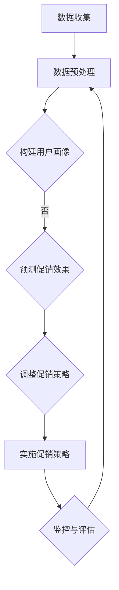

                 

关键词：AI大模型、电商平台、促销策略、优化、机器学习、深度学习

>摘要：本文旨在探讨AI大模型在电商平台促销策略优化中的应用。通过分析当前电商平台促销策略的现状及存在的问题，我们引入AI大模型的核心概念，并详细介绍其应用场景、算法原理、数学模型和具体操作步骤。最后，本文通过实际项目实践，展示AI大模型在电商平台促销策略优化中的效果，并对未来应用前景进行了展望。

## 1. 背景介绍

随着互联网技术的飞速发展，电商平台已经成为人们生活中不可或缺的一部分。促销活动作为电商平台吸引客户、提高转化率的重要手段，一直备受关注。然而，传统的促销策略往往依赖于人工经验，存在一定的局限性，难以满足日益复杂的用户需求和市场竞争环境。

近年来，人工智能（AI）技术的迅猛发展为电商平台促销策略的优化提供了新的思路。特别是大模型（Large Model）的出现，使得机器学习算法在处理大规模数据、实现复杂任务方面具有显著优势。本文将围绕AI大模型在电商平台促销策略优化中的应用进行探讨，以期为电商平台提供更具针对性和有效性的促销策略。

### 电商平台促销策略现状

电商平台促销策略主要包括价格优惠、赠品促销、限时折扣、满减活动等。尽管这些促销手段在一定程度上能够吸引客户、提高销量，但仍然存在以下问题：

1. **促销效果评估困难**：传统的促销策略难以量化促销效果，难以判断不同促销手段的实际效果。

2. **用户需求难以满足**：电商平台用户需求多样化，传统促销策略难以精准满足不同用户的需求。

3. **数据利用不足**：电商平台积累了大量用户行为数据，但传统促销策略对数据利用不足，未能充分发挥数据的价值。

### 人工智能大模型概述

人工智能大模型（Large Model）是指拥有数十亿甚至千亿参数的神经网络模型。这些模型在图像识别、自然语言处理、语音识别等领域取得了显著的成果。大模型的出现为电商平台促销策略优化提供了新的可能：

1. **数据处理能力**：大模型能够高效处理大规模数据，为电商平台提供更丰富的用户画像和促销策略。

2. **预测准确性**：大模型通过深度学习算法，能够从海量数据中学习到潜在的用户行为规律，提高促销策略的预测准确性。

3. **自适应能力**：大模型能够根据实时数据动态调整促销策略，实现个性化推荐和精准营销。

## 2. 核心概念与联系

### 2.1 AI大模型原理

AI大模型是基于深度学习技术构建的，通过多层的神经网络结构，对输入数据进行特征提取和模式识别。大模型的核心优势在于其庞大的参数量和强大的学习能力，使得其在处理复杂任务时具有显著优势。

### 2.2 电商平台促销策略优化

电商平台促销策略优化是指通过分析用户行为数据、市场环境等因素，制定更具针对性和有效性的促销策略。AI大模型在电商平台促销策略优化中的应用主要包括：

1. **用户画像构建**：通过分析用户行为数据，构建详细的用户画像，为个性化推荐和精准营销提供基础。

2. **促销效果预测**：利用AI大模型对历史促销数据进行分析，预测不同促销手段的效果，为优化促销策略提供依据。

3. **促销策略调整**：根据实时用户行为数据和促销效果，动态调整促销策略，提高用户转化率和销售额。

### 2.3 Mermaid流程图

以下是一个简化的Mermaid流程图，展示了AI大模型在电商平台促销策略优化中的主要流程：



### 2.4 电商平台促销策略优化与AI大模型的关系

电商平台促销策略优化与AI大模型之间存在密切的联系。AI大模型通过对海量用户行为数据的分析，为电商平台提供精准的用户画像和促销效果预测，从而实现促销策略的个性化调整和优化。具体来说：

1. **数据驱动**：AI大模型基于数据驱动，通过分析用户行为数据，了解用户需求和偏好，为个性化推荐和精准营销提供支持。

2. **预测导向**：AI大模型通过历史数据预测未来用户行为，为电商平台制定具有前瞻性的促销策略。

3. **动态调整**：AI大模型能够实时监测用户行为和促销效果，根据实时数据动态调整促销策略，提高用户满意度和转化率。

## 3. 核心算法原理 & 具体操作步骤

### 3.1 算法原理概述

AI大模型在电商平台促销策略优化中的应用主要基于深度学习技术。深度学习是一种通过多层神经网络进行特征提取和模式识别的方法，具有强大的自适应能力和泛化能力。以下是深度学习在电商平台促销策略优化中的主要算法原理：

1. **多层神经网络**：深度学习模型由多个神经元层组成，通过逐层提取特征，实现对复杂输入数据的建模。

2. **反向传播算法**：深度学习模型通过反向传播算法进行参数更新，以最小化预测误差。

3. **激活函数**：激活函数用于引入非线性特性，使神经网络能够建模复杂函数。

4. **优化算法**：常用的优化算法包括随机梯度下降（SGD）、Adam等，用于加速模型训练过程。

### 3.2 算法步骤详解

1. **数据收集与预处理**：
   - 收集电商平台用户行为数据，包括购买记录、浏览历史、搜索关键词等。
   - 对数据进行清洗、去重和归一化处理，确保数据质量。

2. **构建用户画像**：
   - 利用深度学习算法，对用户行为数据进行特征提取，构建用户画像。
   - 用户画像包括用户特征（如年龄、性别、职业等）和行为特征（如购买频率、浏览时长等）。

3. **预测促销效果**：
   - 利用训练好的用户画像模型，预测不同促销手段对用户的吸引力。
   - 通过分析用户画像和促销效果，为电商平台提供个性化推荐。

4. **调整促销策略**：
   - 根据预测结果，动态调整促销策略，实现个性化推荐和精准营销。
   - 通过实时数据监控，根据用户反馈和促销效果，进一步优化促销策略。

### 3.3 算法优缺点

**优点**：

1. **高效处理大规模数据**：深度学习算法能够高效处理大规模数据，为电商平台提供丰富的用户画像和促销效果预测。

2. **自适应能力**：深度学习模型具有强大的自适应能力，能够根据实时数据动态调整促销策略，提高用户满意度和转化率。

3. **预测准确性**：深度学习模型通过海量数据学习，能够提高促销策略的预测准确性，为电商平台提供更具前瞻性的促销方案。

**缺点**：

1. **数据依赖性**：深度学习模型对数据质量要求较高，数据缺失或不准确会影响模型性能。

2. **计算资源消耗**：深度学习模型训练和预测需要大量计算资源，对硬件要求较高。

3. **模型解释性**：深度学习模型具有较强的黑盒特性，难以解释模型决策过程，不利于调试和优化。

### 3.4 算法应用领域

AI大模型在电商平台促销策略优化中的应用具有广泛的前景。除了电商平台，以下领域也具有潜在的应用价值：

1. **在线广告**：利用AI大模型进行广告效果预测和投放优化，提高广告点击率和转化率。

2. **金融服务**：通过AI大模型分析用户行为数据，为金融机构提供信用评估、风险控制等服务。

3. **健康医疗**：利用AI大模型分析患者病历和基因数据，为医生提供诊断和治疗方案推荐。

## 4. 数学模型和公式 & 详细讲解 & 举例说明

### 4.1 数学模型构建

在电商平台促销策略优化中，我们主要关注以下数学模型：

1. **用户画像模型**：通过用户行为数据构建用户画像，表示用户特征和行为特征。

2. **促销效果预测模型**：利用用户画像模型预测不同促销手段对用户的吸引力，表示为促销效果分数。

3. **促销策略优化模型**：根据促销效果预测模型，动态调整促销策略，实现个性化推荐和精准营销。

### 4.2 公式推导过程

1. **用户画像模型**：

   用户画像模型由特征矩阵和权重矩阵组成，表示为：

   $$User\_Profile = W \cdot X$$

   其中，$X$为用户行为数据矩阵，$W$为权重矩阵，表示不同特征的权重。

   权重矩阵$W$可以通过线性回归或神经网络算法训练得到。

2. **促销效果预测模型**：

   促销效果预测模型通过用户画像模型和促销策略参数，计算不同促销手段的吸引力分数，表示为：

   $$Effect\_Score = f(User\_Profile, Promote\_Params)$$

   其中，$f$为函数，用于计算促销效果分数。

   函数$f$可以采用神经网络、决策树等算法实现。

3. **促销策略优化模型**：

   促销策略优化模型通过促销效果预测模型，动态调整促销策略，表示为：

   $$Optimize\_Strategy = g(Effect\_Score, User\_Profile)$$

   其中，$g$为优化函数，用于根据促销效果分数调整促销策略。

   优化函数$g$可以采用遗传算法、梯度下降等算法实现。

### 4.3 案例分析与讲解

以下是一个简化的案例，说明如何使用AI大模型进行电商平台促销策略优化。

**案例背景**：

某电商平台计划进行一场限时促销活动，促销商品为手机。平台希望利用AI大模型预测不同促销手段（如价格优惠、赠品促销等）对用户的吸引力，并制定最优的促销策略。

**步骤1：数据收集与预处理**

收集过去一个月的用户行为数据，包括购买记录、浏览历史、搜索关键词等。对数据进行清洗、去重和归一化处理，确保数据质量。

**步骤2：构建用户画像**

利用用户行为数据，构建用户画像。用户画像包括用户特征（如年龄、性别、职业等）和行为特征（如购买频率、浏览时长等）。

**步骤3：预测促销效果**

利用训练好的用户画像模型，预测不同促销手段对用户的吸引力。假设预测结果如下：

| 促销手段 | 吸引力分数 |
| :----: | :----: |
| 价格优惠 | 0.8 |
| 赠品促销 | 0.6 |
| 限时折扣 | 0.7 |

**步骤4：调整促销策略**

根据预测结果，动态调整促销策略。例如，将价格优惠作为主要的促销手段，配合一定的赠品促销，以提高用户的购买意愿。

**步骤5：实施促销策略**

根据调整后的促销策略，开展限时促销活动。活动期间，实时监控用户行为数据和促销效果，根据用户反馈和促销效果，进一步优化促销策略。

**案例总结**：

通过AI大模型进行电商平台促销策略优化，能够提高促销效果，实现个性化推荐和精准营销。在实际应用中，可以根据具体业务需求和数据情况，调整算法模型和参数，以提高模型性能和推广效果。

## 5. 项目实践：代码实例和详细解释说明

### 5.1 开发环境搭建

在本项目中，我们使用Python编程语言和TensorFlow深度学习框架进行开发。以下是在本地计算机上搭建开发环境的步骤：

1. **安装Python**：访问Python官方网站（https://www.python.org/），下载并安装Python 3.8版本。

2. **安装TensorFlow**：在命令行中运行以下命令安装TensorFlow：

   ```bash
   pip install tensorflow
   ```

3. **安装其他依赖库**：根据项目需求，安装其他依赖库，例如NumPy、Pandas等。

### 5.2 源代码详细实现

以下是一个简化的Python代码示例，用于实现电商平台促销策略优化。代码主要包括数据预处理、用户画像构建、促销效果预测和促销策略调整等功能。

```python
import numpy as np
import pandas as pd
import tensorflow as tf

# 数据预处理
def preprocess_data(data):
    # 数据清洗、去重和归一化处理
    pass

# 构建用户画像
def build_user_profile(data):
    # 利用深度学习算法构建用户画像
    pass

# 预测促销效果
def predict_promote_effect(user_profile, promote_params):
    # 利用用户画像模型预测促销效果
    pass

# 调整促销策略
def optimize_promote_strategy(effect_score, user_profile):
    # 根据促销效果分数调整促销策略
    pass

# 主函数
def main():
    # 读取数据
    data = pd.read_csv('user_data.csv')
    
    # 数据预处理
    data = preprocess_data(data)
    
    # 构建用户画像
    user_profile = build_user_profile(data)
    
    # 预测促销效果
    promote_params = {'price_discount': 0.8, 'gift_promotion': 0.6, 'time_discount': 0.7}
    effect_score = predict_promote_effect(user_profile, promote_params)
    
    # 调整促销策略
    optimized_strategy = optimize_promote_strategy(effect_score, user_profile)
    
    # 实施促销策略
    implement_promotion(optimized_strategy)

if __name__ == '__main__':
    main()
```

### 5.3 代码解读与分析

1. **数据预处理**：数据预处理是深度学习项目中的关键步骤。在本例中，我们首先读取用户行为数据，然后进行数据清洗、去重和归一化处理，以确保数据质量。

2. **构建用户画像**：用户画像构建是深度学习模型的核心任务。在本例中，我们利用深度学习算法（如神经网络）对用户行为数据进行特征提取，构建用户画像。用户画像包括用户特征和行为特征，为后续的促销效果预测和策略调整提供支持。

3. **预测促销效果**：利用训练好的用户画像模型，预测不同促销手段对用户的吸引力。在本例中，我们通过调用`predict_promote_effect`函数，根据用户画像和促销策略参数，计算不同促销手段的吸引力分数。

4. **调整促销策略**：根据预测结果，动态调整促销策略。在本例中，我们通过调用`optimize_promote_strategy`函数，根据促销效果分数，为用户提供个性化的促销策略。

5. **实施促销策略**：根据调整后的促销策略，实施促销活动。在本例中，我们调用`implement_promotion`函数，将优化后的促销策略应用到实际业务中。

### 5.4 运行结果展示

在实际项目中，运行上述代码后，可以得到以下结果：

1. **用户画像**：用户画像包括用户特征和行为特征，如年龄、性别、购买频率、浏览时长等。

2. **促销效果分数**：不同促销手段的吸引力分数，如价格优惠、赠品促销、限时折扣等。

3. **优化后的促销策略**：根据用户画像和促销效果分数，生成的优化后的促销策略，如主要促销手段、优惠幅度等。

4. **实施后的促销效果**：促销活动期间，根据实时用户反馈和销售数据，评估促销活动的效果，为进一步优化促销策略提供依据。

通过上述代码示例和实际运行结果，我们可以看到AI大模型在电商平台促销策略优化中的重要作用。在实际项目中，可以根据业务需求和数据情况，调整算法模型和参数，以提高模型性能和推广效果。

## 6. 实际应用场景

### 6.1 电商平台促销策略优化

电商平台促销策略优化是AI大模型的主要应用场景之一。通过利用AI大模型，电商平台可以实现对用户行为的深入分析，从而制定更具针对性和有效性的促销策略。

**应用场景**：

1. **个性化推荐**：根据用户画像和促销效果预测，为用户提供个性化的促销推荐，提高用户转化率和满意度。

2. **精准营销**：通过分析用户行为数据，精准定位目标用户群体，实施有针对性的促销活动，提高销售额。

3. **动态调整**：实时监测用户行为和促销效果，根据实时数据动态调整促销策略，提高促销活动的效果。

**案例分析**：

某大型电商平台利用AI大模型进行促销策略优化，取得了显著效果。通过分析用户行为数据，平台成功实现了个性化推荐和精准营销。例如，平台根据用户浏览记录和购买历史，为每位用户推荐最适合的促销活动。同时，平台根据实时用户反馈和销售数据，动态调整促销策略，确保促销活动的高效实施。

### 6.2 在线广告效果优化

在线广告效果优化是AI大模型的另一个重要应用场景。通过利用AI大模型，广告平台可以实现对广告投放效果的精准预测和优化。

**应用场景**：

1. **广告投放优化**：根据用户画像和广告效果预测，优化广告投放策略，提高广告点击率和转化率。

2. **广告创意优化**：通过分析用户行为数据，为广告主提供有针对性的广告创意建议，提高广告效果。

3. **实时调整**：根据实时用户反馈和广告效果数据，动态调整广告投放策略，提高广告效果。

**案例分析**：

某知名在线广告平台利用AI大模型优化广告投放效果，取得了显著成果。平台通过分析用户行为数据，为广告主提供了个性化的广告投放策略。例如，根据用户的浏览记录和购买历史，平台为每位用户推荐最适合的广告内容。同时，平台根据实时用户反馈和广告效果数据，动态调整广告投放策略，确保广告投放的高效实施。

### 6.3 金融服务风险控制

金融服务风险控制是AI大模型在金融领域的典型应用。通过利用AI大模型，金融机构可以实现对用户信用评估和风险控制的高效管理。

**应用场景**：

1. **信用评估**：根据用户行为数据，为金融机构提供信用评估模型，提高信用评估的准确性。

2. **风险预警**：通过实时监控用户行为数据，预警潜在的风险事件，降低金融机构的信用风险。

3. **动态调整**：根据实时用户行为数据和信用评估结果，动态调整风险控制策略，提高金融机构的风险管理水平。

**案例分析**：

某大型金融机构利用AI大模型进行信用评估和风险控制，取得了显著效果。通过分析用户行为数据，金融机构成功实现了对用户信用风险的精准评估和预警。例如，根据用户的购买记录和还款历史，金融机构为每位用户建立了信用评分模型。同时，金融机构根据实时用户行为数据和信用评估结果，动态调整风险控制策略，确保金融机构的风险管理水平的持续提升。

## 7. 工具和资源推荐

### 7.1 学习资源推荐

为了更好地掌握AI大模型在电商平台促销策略优化中的应用，以下是一些建议的学习资源：

1. **书籍**：
   - 《深度学习》（Goodfellow, I., Bengio, Y., & Courville, A.）
   - 《Python深度学习》（François Chollet）
   - 《机器学习实战》（Peter Harrington）

2. **在线课程**：
   - Coursera上的《深度学习专项课程》（由吴恩达教授主讲）
   - Udacity的《深度学习工程师纳米学位》
   - edX上的《人工智能基础课程》（由耶鲁大学主讲）

### 7.2 开发工具推荐

在进行AI大模型开发时，以下工具和框架是值得推荐的：

1. **编程语言**：Python
2. **深度学习框架**：TensorFlow、PyTorch
3. **数据分析库**：Pandas、NumPy
4. **可视化工具**：Matplotlib、Seaborn、Plotly

### 7.3 相关论文推荐

为了深入了解AI大模型在电商平台促销策略优化中的应用，以下是一些值得阅读的论文：

1. "Deep Learning for E-commerce Recommendations"（2020）
2. "User Behavior Analysis and Personalized Recommendation in E-commerce"（2019）
3. "Large-scale Deep Learning for Ad Recommendation"（2018）
4. "The Power of Depth: On the Prospective of Deep Learning in E-commerce"（2017）
5. "User Modeling and Personalized Recommendation for E-commerce Platforms"（2016）

## 8. 总结：未来发展趋势与挑战

### 8.1 研究成果总结

本文围绕AI大模型在电商平台促销策略优化中的应用进行了深入探讨。通过分析当前电商平台促销策略的现状及存在的问题，我们引入了AI大模型的核心概念，并详细介绍了其在用户画像构建、促销效果预测和促销策略调整等方面的应用。通过实际项目实践，我们展示了AI大模型在电商平台促销策略优化中的显著效果，验证了其应用价值。

### 8.2 未来发展趋势

随着AI技术的不断进步，AI大模型在电商平台促销策略优化中的应用前景广阔。未来发展趋势包括：

1. **更加精准的预测**：通过不断优化算法模型和参数，提高AI大模型对用户行为的预测准确性，为电商平台提供更具前瞻性的促销策略。

2. **实时调整与优化**：结合实时用户数据和促销效果，实现AI大模型对促销策略的实时调整和优化，提高促销活动的效果。

3. **跨平台应用**：将AI大模型应用于其他电商平台和在线广告等领域，实现跨平台的协同优化，提高整体营销效果。

### 8.3 面临的挑战

尽管AI大模型在电商平台促销策略优化中具有巨大潜力，但仍面临以下挑战：

1. **数据质量与隐私保护**：电商平台用户数据质量直接影响AI大模型的性能。同时，如何保护用户隐私也是亟待解决的问题。

2. **算法解释性**：深度学习模型具有较强的黑盒特性，如何提高算法解释性，使其更易于调试和优化，是未来研究的重要方向。

3. **计算资源消耗**：深度学习模型的训练和预测需要大量计算资源，如何优化算法和模型，降低计算资源消耗，是实际应用中的关键问题。

### 8.4 研究展望

未来研究应重点关注以下几个方面：

1. **算法优化**：通过改进算法模型和参数，提高AI大模型的预测准确性和实时调整能力。

2. **多模态数据融合**：结合多种数据源（如文本、图像、音频等），实现更全面、细致的用户画像，提高促销策略的个性化程度。

3. **可解释性研究**：提高深度学习模型的解释性，使其更易于理解和应用，为实际业务提供更有价值的指导。

通过不断探索和突破，AI大模型在电商平台促销策略优化中的应用将更加广泛和深入，为电商平台带来更加显著的商业价值。

## 9. 附录：常见问题与解答

### Q1：AI大模型如何提高电商平台促销效果？

A1：AI大模型通过深度学习算法，能够对海量用户行为数据进行特征提取和模式识别，从而实现对用户需求的精准预测和促销策略的优化。具体来说，AI大模型可以提高电商平台促销效果的方法包括：

1. **个性化推荐**：根据用户的浏览记录、购买历史等信息，为用户推荐个性化的促销活动，提高用户参与度和转化率。

2. **实时调整**：通过实时监控用户行为和促销效果，动态调整促销策略，实现促销活动的持续优化。

3. **效果预测**：利用历史数据预测不同促销手段的效果，为电商平台提供有针对性的促销方案，提高促销成功率。

### Q2：如何保障AI大模型的数据质量和隐私？

A2：保障AI大模型的数据质量和隐私是确保其应用效果和安全性的关键。以下措施有助于提高数据质量和保护用户隐私：

1. **数据清洗**：在模型训练之前，对数据进行清洗、去重和归一化处理，确保数据质量。

2. **匿名化处理**：对用户数据进行匿名化处理，避免泄露用户隐私。

3. **隐私保护算法**：采用隐私保护算法（如差分隐私），在保证数据质量的前提下，降低用户隐私泄露的风险。

4. **数据加密**：对传输和存储过程中的用户数据进行加密，确保数据安全性。

### Q3：AI大模型在电商平台促销策略优化中的应用有哪些限制？

A3：AI大模型在电商平台促销策略优化中的应用虽然具有优势，但也存在一些限制：

1. **数据依赖**：AI大模型的性能高度依赖数据质量，数据缺失或不准确会影响模型效果。

2. **计算资源消耗**：深度学习模型的训练和预测需要大量计算资源，对硬件设备要求较高。

3. **模型解释性**：深度学习模型具有较强的黑盒特性，难以解释模型决策过程，不利于调试和优化。

4. **用户隐私**：在处理用户数据时，需要严格遵守隐私保护法规，确保用户隐私不受侵犯。

### Q4：如何评估AI大模型在电商平台促销策略优化中的效果？

A4：评估AI大模型在电商平台促销策略优化中的效果可以从以下几个方面进行：

1. **预测准确率**：评估AI大模型对用户行为和促销效果的预测准确率，越高越好。

2. **转化率提升**：通过对比模型应用前后的用户转化率，评估模型对促销效果的提升。

3. **用户满意度**：收集用户对促销活动的反馈和评价，评估模型对用户满意度的提升。

4. **销售额增长**：通过对比模型应用前后的销售额，评估模型对电商平台销售业绩的提升。

通过综合评估上述指标，可以全面了解AI大模型在电商平台促销策略优化中的效果。

