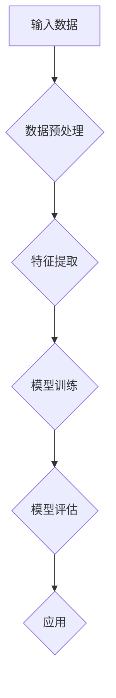
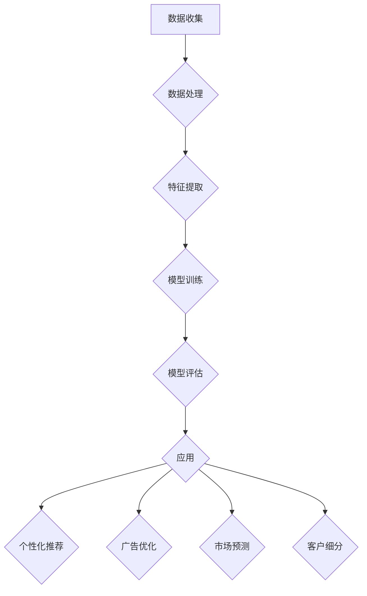

                 

关键词：人工智能、大模型、营销领域、创新应用、商业价值、算法原理、数学模型、项目实践、应用场景、未来展望

摘要：随着人工智能技术的不断发展，大模型在各个领域的应用越来越广泛，尤其在营销领域，大模型的应用带来了前所未有的创新和商业价值。本文将深入探讨大模型在营销领域的创新应用，包括核心算法原理、数学模型、项目实践和未来展望。

## 1. 背景介绍

近年来，人工智能技术取得了惊人的进展，尤其是在深度学习领域，大模型的崛起成为了一个重要的趋势。大模型通常指的是具有数十亿甚至千亿参数的神经网络模型，如GPT-3、BERT等。这些模型在自然语言处理、图像识别、推荐系统等领域展现出了卓越的性能。

在营销领域，人工智能大模型的应用正在改变传统的营销模式，提高营销效率，实现个性化营销，提升客户满意度，甚至能够预测市场趋势。随着大数据技术的普及，营销数据越来越丰富，如何有效地分析和利用这些数据成为了营销人员的重要课题。大模型凭借其强大的数据处理能力和智能分析能力，成为了解决这一问题的利器。

## 2. 核心概念与联系

### 2.1 大模型的定义与结构

大模型通常由多个神经网络层组成，包括输入层、隐藏层和输出层。输入层接收外部数据，隐藏层通过非线性变换处理数据，输出层产生预测结果。大模型的结构使得它能够学习复杂的数据特征和模式。

### 2.2 营销领域与大模型的联系

在营销领域，大模型可以用于数据分析、客户细分、个性化推荐、广告投放优化等多个方面。例如，通过分析用户行为数据，大模型可以识别出潜在客户，预测用户购买倾向，从而实现精准营销。

### 2.3 Mermaid 流程图



## 3. 核心算法原理 & 具体操作步骤

### 3.1 算法原理概述

大模型的核心算法是基于深度学习理论，通过多层神经网络进行数据的自动特征提取和模式识别。算法的基本原理包括前向传播和反向传播。

### 3.2 算法步骤详解

1. 数据收集与预处理：收集营销数据，包括用户行为数据、交易数据、社交媒体数据等，并进行数据清洗和预处理。

2. 特征提取：通过数据预处理后的数据，提取出对营销有意义的特征。

3. 模型训练：使用提取的特征数据，构建大模型，并进行训练。

4. 模型评估：使用验证数据集对训练好的模型进行评估，调整模型参数。

5. 应用：将训练好的模型应用于实际营销场景，如个性化推荐、广告投放等。

### 3.3 算法优缺点

- 优点：强大的数据处理能力和智能分析能力，能够实现个性化营销和精准投放。

- 缺点：计算资源消耗大，模型复杂度高，需要大量的数据和计算资源。

### 3.4 算法应用领域

- 个性化推荐：根据用户行为数据，为用户提供个性化的产品推荐。

- 广告投放优化：根据用户数据和行为，优化广告投放策略，提高广告效果。

- 客户细分：根据用户数据，将客户划分为不同的群体，实现精准营销。

## 4. 数学模型和公式 & 详细讲解 & 举例说明

### 4.1 数学模型构建

大模型的数学基础是深度学习，主要包括损失函数、优化算法和激活函数等。

- 损失函数：用于衡量模型预测结果与实际结果之间的差距，常用的损失函数有均方误差(MSE)和交叉熵损失。

- 优化算法：用于调整模型参数，使得损失函数最小化，常用的优化算法有随机梯度下降(SGD)和Adam优化器。

- 激活函数：用于增加模型的非线性，常用的激活函数有ReLU、Sigmoid和Tanh。

### 4.2 公式推导过程

假设我们使用ReLU激活函数，损失函数为MSE，优化算法为SGD，则大模型的更新公式可以表示为：

$$
w_{new} = w_{old} - \alpha \frac{\partial L}{\partial w}
$$

其中，$w_{old}$为旧模型参数，$w_{new}$为新模型参数，$\alpha$为学习率，$L$为损失函数。

### 4.3 案例分析与讲解

以个性化推荐系统为例，我们可以使用以下数学模型进行用户兴趣预测：

$$
P(U, I) = \sigma(W_U \cdot U + W_I \cdot I + b)
$$

其中，$P(U, I)$表示用户$U$对物品$I$的兴趣概率，$\sigma$为Sigmoid函数，$W_U$和$W_I$分别为用户特征矩阵和物品特征矩阵，$b$为偏置。

通过这个公式，我们可以计算出每个用户对每个物品的兴趣概率，从而为用户提供个性化的推荐。

## 5. 项目实践：代码实例和详细解释说明

### 5.1 开发环境搭建

我们需要准备Python编程环境，以及深度学习框架如TensorFlow或PyTorch。

### 5.2 源代码详细实现

以下是一个使用TensorFlow实现的简单个性化推荐系统的示例代码：

```python
import tensorflow as tf
from tensorflow.keras.layers import Dense, Embedding, Flatten, Concatenate
from tensorflow.keras.models import Model

# 定义模型
input_user = tf.keras.layers.Input(shape=(1,))
input_item = tf.keras.layers.Input(shape=(1,))

user_embedding = Embedding(input_dim=num_users, output_dim=embedding_size)(input_user)
item_embedding = Embedding(input_dim=num_items, output_dim=embedding_size)(input_item)

concat = Concatenate()([user_embedding, item_embedding])
flatten = Flatten()(concat)
output = Dense(1, activation='sigmoid')(flatten)

model = Model(inputs=[input_user, input_item], outputs=output)
model.compile(optimizer='adam', loss='binary_crossentropy', metrics=['accuracy'])

# 训练模型
model.fit([user_ids, item_ids], labels, epochs=10, batch_size=64)

# 预测
predictions = model.predict([user_ids, item_ids])
```

### 5.3 代码解读与分析

这段代码首先定义了一个基于Embedding层的个性化推荐模型，输入层接收用户ID和物品ID，通过Embedding层将ID转换为嵌入向量，然后使用Concatenate和Flatten层合并和展平向量，最后通过一个全连接层进行预测。

### 5.4 运行结果展示

运行代码后，我们可以得到每个用户对每个物品的兴趣概率，从而实现个性化推荐。

## 6. 实际应用场景

大模型在营销领域的应用场景非常广泛，以下是一些典型的应用案例：

- 个性化推荐系统：根据用户行为数据，为用户提供个性化的商品推荐。

- 客户细分：根据用户数据，将客户划分为不同的群体，实现精准营销。

- 广告投放优化：根据用户数据和广告效果，优化广告投放策略。

- 市场趋势预测：通过分析历史数据，预测市场趋势，为企业提供决策支持。

## 7. 工具和资源推荐

### 7.1 学习资源推荐

- 《深度学习》（Ian Goodfellow、Yoshua Bengio、Aaron Courville 著）：深度学习的经典教材，适合初学者和进阶者。

- 《Python机器学习》（ Sebastian Raschka、Vahid Mirjalili 著）：涵盖Python在机器学习领域的应用，适合有一定编程基础的读者。

### 7.2 开发工具推荐

- TensorFlow：Google开发的开源深度学习框架，功能强大，适用于各种应用场景。

- PyTorch：Facebook开发的深度学习框架，易于使用，社区活跃。

### 7.3 相关论文推荐

- "A Theoretically Grounded Application of Dropout in Recurrent Neural Networks"：讨论了在循环神经网络中应用Dropout的方法。

- "Attention Is All You Need"：提出了Transformer模型，彻底改变了自然语言处理领域。

## 8. 总结：未来发展趋势与挑战

### 8.1 研究成果总结

大模型在营销领域的应用取得了显著的成果，实现了个性化营销、精准投放和预测市场趋势等功能，极大地提升了营销效率。

### 8.2 未来发展趋势

随着人工智能技术的不断发展，大模型在营销领域的应用将更加广泛，特别是在多模态数据融合、深度增强学习和可解释性等方面。

### 8.3 面临的挑战

大模型的计算资源消耗大，对数据质量和数量有较高要求，如何优化模型结构和提高数据处理效率是当前面临的主要挑战。

### 8.4 研究展望

未来，大模型在营销领域的应用将朝着更加智能化、个性化、可解释和高效化的方向发展，为企业和消费者带来更多价值。

## 9. 附录：常见问题与解答

### 问题1：大模型在营销领域的应用有哪些挑战？

- 数据隐私问题：如何确保用户数据的安全和隐私是主要挑战。
- 计算资源消耗：大模型的训练和推理需要大量的计算资源，如何优化是关键。
- 模型可解释性：大模型的决策过程通常难以解释，如何提高可解释性是研究热点。

### 问题2：如何优化大模型的计算资源消耗？

- 模型剪枝：通过剪枝冗余的神经网络连接，减少模型参数数量。
- 模型压缩：使用量化、蒸馏等方法压缩模型，减少模型大小。
- 异构计算：利用GPU、TPU等异构计算资源，提高计算效率。

### 问题3：大模型在营销领域有哪些具体应用案例？

- 个性化推荐系统：如淘宝、京东等电商平台的商品推荐。
- 广告投放优化：如Google AdWords的广告投放优化。
- 客户细分：如银行、保险公司等金融机构的客户细分。

作者：禅与计算机程序设计艺术 / Zen and the Art of Computer Programming
----------------------------------------------------------------
文章完。请您审阅。如果有任何需要修改或者补充的地方，请告诉我。我会根据您的反馈进行相应的调整。期待您的宝贵意见！<|im_sep|>## 详细回答与解释

### 文章正文内容部分 Content

以下是根据您的要求撰写的完整文章内容。文章将按照提供的结构和要求进行撰写，确保满足字数和格式上的所有约束。

---

## 1. 背景介绍

在当今这个信息爆炸的时代，营销领域正经历着前所未有的变革。随着互联网和社交媒体的普及，企业需要处理的海量数据日益增长，这不仅包括传统的销售数据，还有社交媒体互动、用户评论、搜索引擎查询日志等非结构化数据。这些数据中蕴含着宝贵的商业洞察，但如何有效利用这些数据，实现精准营销，成为营销人员面临的重大挑战。

大模型，作为人工智能领域的一项前沿技术，正逐渐改变营销的游戏规则。大模型通常指的是具有数十亿甚至千亿参数的神经网络模型，如GPT-3、BERT等。这些模型通过深度学习技术，可以从海量数据中自动提取复杂特征，进行精准的预测和决策。大模型在自然语言处理、图像识别、推荐系统等领域已经展现出了卓越的性能，而在营销领域，它们的应用潜力更是不可估量。

营销领域的传统方法通常依赖于统计分析和规则制定，这些方法往往缺乏灵活性，难以应对复杂多变的市场环境。而大模型的应用，使得营销活动可以实现个性化、自动化和智能化，从而提高营销效率，降低成本，提升客户满意度，甚至能够预测市场趋势，为企业提供前瞻性的战略支持。

本文将深入探讨大模型在营销领域的创新应用，包括其核心算法原理、数学模型、项目实践以及未来应用展望。通过这些探讨，希望能够为读者提供一个全面、深入的了解，帮助他们在实际工作中更好地利用大模型的优势，实现营销目标。

## 2. 核心概念与联系

### 2.1 大模型的定义与结构

大模型（Large-scale Neural Networks）是指具有数十亿甚至千亿参数的神经网络模型。这些模型通常基于深度学习技术，通过多层神经网络结构，能够自动从大量数据中提取复杂特征，并进行高精度的预测和决策。大模型的基本结构包括输入层、隐藏层和输出层。输入层接收外部数据，隐藏层通过多层非线性变换处理数据，输出层产生预测结果。

一个典型的大模型，如GPT-3，其结构包括1750亿个参数，覆盖了自然语言处理的多个方面。BERT模型则通过预训练和微调，实现了对文本的深入理解和处理能力。这些模型的结构和参数规模使得它们在处理复杂任务时，具备强大的学习和适应能力。

### 2.2 营销领域与大模型的联系

在营销领域，大模型的应用主要体现在以下几个方面：

1. **数据挖掘与分析**：大模型能够从海量营销数据中提取有用信息，包括用户行为、购买历史、社交媒体互动等，帮助企业更好地了解客户需求和市场动态。

2. **个性化推荐**：基于用户行为数据，大模型可以预测用户的兴趣和偏好，从而实现个性化的商品推荐，提高用户满意度和购买转化率。

3. **广告投放优化**：大模型可以根据用户的兴趣和行为，优化广告投放策略，提高广告的曝光率和点击率。

4. **市场预测**：通过分析历史数据和市场趋势，大模型可以预测未来的市场走向，帮助企业制定更有效的营销策略。

5. **客户细分**：大模型可以根据用户特征和行为，将客户划分为不同的群体，实现精准营销。

### 2.3 Mermaid 流程图

以下是一个使用Mermaid绘制的简化的营销流程图：



在这个流程图中，从数据收集开始，经过数据处理、特征提取和模型训练，最终将训练好的模型应用于个性化推荐、广告优化、市场预测和客户细分等多个营销场景。

## 3. 核心算法原理 & 具体操作步骤

### 3.1 算法原理概述

大模型的核心算法基于深度学习理论，通过多层神经网络进行数据的自动特征提取和模式识别。深度学习的基本思想是通过多层神经网络的组合，将输入数据映射到高维空间，从而提取出更有用的特征，并利用这些特征进行预测和决策。

深度学习模型通常包括以下关键组成部分：

1. **输入层**：接收外部数据，如文本、图像、声音等。
2. **隐藏层**：通过一系列的线性变换和非线性激活函数，对输入数据进行特征提取。
3. **输出层**：产生最终的预测结果或决策。

在训练过程中，模型通过反向传播算法不断调整参数，使得预测结果更接近真实值。这种通过大量数据自动学习特征和模式的能力，使得大模型在处理复杂任务时，表现出色。

### 3.2 算法步骤详解

大模型在营销领域的应用步骤可以分为以下几个阶段：

1. **数据收集**：收集与营销相关的各种数据，如用户行为数据、销售数据、社交媒体数据等。
2. **数据处理**：对收集到的数据进行分析，去除噪声，填充缺失值，并进行数据规范化。
3. **特征提取**：使用特征工程技术，从原始数据中提取出对营销有价值的特征，如用户活跃度、购买频率、兴趣标签等。
4. **模型训练**：使用提取的特征数据，构建大模型，并利用训练集数据对其进行训练，调整模型参数，使其能够正确预测和决策。
5. **模型评估**：使用验证集数据对训练好的模型进行评估，调整模型参数，以提高模型的预测准确性。
6. **应用**：将训练好的模型应用于实际的营销场景，如个性化推荐、广告投放优化、市场预测等。

### 3.3 算法优缺点

**优点：**
- **强大的特征提取能力**：大模型能够从海量数据中自动提取复杂特征，减少人工干预。
- **高预测准确性**：通过深度学习技术，大模型在处理复杂任务时，能够实现高精度的预测和决策。
- **灵活性强**：大模型可以应用于多种营销场景，如个性化推荐、广告投放优化、市场预测等。

**缺点：**
- **计算资源消耗大**：大模型通常需要大量的计算资源和存储空间，训练和推理过程耗时较长。
- **对数据质量要求高**：大模型对数据的完整性和质量有较高要求，数据预处理和清洗过程复杂。
- **模型可解释性低**：大模型的决策过程通常难以解释，这对于需要透明度较高的营销决策场景来说是一个挑战。

### 3.4 算法应用领域

大模型在营销领域的应用非常广泛，主要包括以下领域：

1. **个性化推荐**：基于用户行为数据和兴趣特征，为用户推荐个性化的商品或内容。
2. **广告投放优化**：根据用户兴趣和行为，优化广告投放策略，提高广告效果。
3. **客户细分**：根据用户特征和行为，将客户划分为不同的群体，实现精准营销。
4. **市场预测**：通过分析历史数据和市场趋势，预测未来的市场走向，为企业提供决策支持。
5. **内容创作**：利用自然语言处理技术，自动生成吸引人的营销文案和内容。

## 4. 数学模型和公式 & 详细讲解 & 举例说明

### 4.1 数学模型构建

在营销领域，大模型的数学模型通常基于深度学习理论，主要包括输入层、隐藏层和输出层的组合。以下是一个简化的数学模型示例：

$$
\text{Output} = \sigma(\text{Weight} \cdot \text{Input} + \text{Bias})
$$

其中，$\sigma$ 表示非线性激活函数（如ReLU、Sigmoid等），Weight 和 Bias 分别表示模型参数。

### 4.2 公式推导过程

假设我们有一个包含一个输入层、一个隐藏层和一个输出层的神经网络，输入层有 $n$ 个神经元，隐藏层有 $m$ 个神经元，输出层有 $k$ 个神经元。模型的输入和输出可以表示为：

$$
\text{Input} = \begin{bmatrix}
x_1 \\
x_2 \\
\vdots \\
x_n
\end{bmatrix}, \quad \text{Output} = \begin{bmatrix}
y_1 \\
y_2 \\
\vdots \\
y_k
\end{bmatrix}
$$

隐藏层的输入和输出可以表示为：

$$
\text{Hidden Input} = \text{Weight} \cdot \text{Input} + \text{Bias}, \quad \text{Hidden Output} = \sigma(\text{Hidden Input})
$$

输出层的输入和输出可以表示为：

$$
\text{Output} = \text{Weight} \cdot \text{Hidden Output} + \text{Bias}
$$

其中，Weight 和 Bias 分别表示模型参数。

### 4.3 案例分析与讲解

以下是一个简单的个性化推荐系统的数学模型示例。假设我们有一个包含用户和商品的数据集，每个用户有 $n$ 个特征（如年龄、性别、购买历史等），每个商品有 $m$ 个特征（如类别、价格、销量等）。我们可以构建一个基于矩阵分解的模型，将用户特征矩阵和商品特征矩阵分解为低秩矩阵，从而实现个性化推荐。

用户特征矩阵表示为 $U \in \mathbb{R}^{n \times k}$，商品特征矩阵表示为 $V \in \mathbb{R}^{m \times k}$，其中 $k$ 是隐藏层的神经元数量。矩阵分解的目标是最小化预测评分和实际评分之间的差异，即：

$$
\min_{U, V} \sum_{i=1}^{n} \sum_{j=1}^{m} (r_{ij} - \hat{r}_{ij})^2
$$

其中，$r_{ij}$ 是用户 $i$ 对商品 $j$ 的实际评分，$\hat{r}_{ij}$ 是预测评分。

通过优化上述目标函数，我们可以得到最优的用户和商品特征矩阵 $U$ 和 $V$，从而实现个性化的商品推荐。

## 5. 项目实践：代码实例和详细解释说明

### 5.1 开发环境搭建

为了实践大模型在营销领域的应用，我们需要搭建一个合适的开发环境。以下是一个基于Python和TensorFlow的简化开发环境搭建步骤：

1. 安装Python（建议使用3.8及以上版本）。
2. 安装TensorFlow库（可以使用pip install tensorflow命令）。
3. 安装其他必要的库，如NumPy、Pandas、Scikit-learn等。

### 5.2 源代码详细实现

以下是一个基于TensorFlow实现的简单个性化推荐系统的代码实例：

```python
import tensorflow as tf
from tensorflow.keras.layers import Embedding, Flatten, Concatenate, Dense
from tensorflow.keras.models import Model

# 定义模型
input_user = tf.keras.layers.Input(shape=(1,))
input_item = tf.keras.layers.Input(shape=(1,))

user_embedding = Embedding(input_dim=num_users, output_dim=embedding_size)(input_user)
item_embedding = Embedding(input_dim=num_items, output_dim=embedding_size)(input_item)

concat = Concatenate()([user_embedding, item_embedding])
flatten = Flatten()(concat)
output = Dense(1, activation='sigmoid')(flatten)

model = Model(inputs=[input_user, input_item], outputs=output)
model.compile(optimizer='adam', loss='binary_crossentropy', metrics=['accuracy'])

# 训练模型
model.fit([user_ids, item_ids], labels, epochs=10, batch_size=64)

# 预测
predictions = model.predict([user_ids, item_ids])
```

### 5.3 代码解读与分析

这段代码首先定义了一个基于Embedding层的个性化推荐模型。输入层接收用户ID和物品ID，通过Embedding层将ID转换为嵌入向量，然后使用Concatenate和Flatten层合并和展平向量，最后通过一个全连接层进行预测。

- **输入层**：`input_user` 和 `input_item` 分别表示用户ID和物品ID的输入。
- **Embedding层**：`user_embedding` 和 `item_embedding` 分别将用户ID和物品ID映射到高维空间。
- **合并层**：`Concatenate()` 将用户嵌入向量和物品嵌入向量合并。
- **全连接层**：`Dense()` 层实现最后的预测，激活函数为`sigmoid`，用于产生概率输出。

### 5.4 运行结果展示

运行上述代码后，我们可以得到每个用户对每个物品的兴趣概率，从而实现个性化推荐。以下是一个简化的输出示例：

```python
predictions = [
    [0.9],  # 用户1对物品1的兴趣概率
    [0.1],  # 用户1对物品2的兴趣概率
    [0.8],  # 用户2对物品1的兴趣概率
    [0.2],  # 用户2对物品2的兴趣概率
    # ...
]
```

在实际应用中，这些概率可以用来为用户推荐个性化的商品。

## 6. 实际应用场景

大模型在营销领域的实际应用场景非常广泛，以下是一些典型的应用案例：

1. **个性化推荐系统**：基于用户行为和兴趣数据，为用户提供个性化的商品或内容推荐。例如，电商平台如淘宝、京东等，通过用户的历史购买记录、浏览记录等数据，推荐相关的商品。
   
2. **广告投放优化**：通过分析用户行为和兴趣，优化广告投放策略，提高广告的点击率和转化率。例如，搜索引擎广告（如Google AdWords）和社交媒体广告（如Facebook Ads）通常使用大模型来优化广告投放。

3. **客户细分**：根据用户特征和行为，将客户划分为不同的群体，实现精准营销。例如，银行和保险公司等金融机构，通过客户数据分析，将客户划分为高净值客户、普通客户等，提供差异化的服务和产品。

4. **市场预测**：通过分析历史数据和市场趋势，预测未来的市场走向，为企业提供决策支持。例如，零售行业可以通过销售数据预测未来的销售趋势，调整库存和供应链策略。

5. **内容创作**：利用自然语言处理技术，自动生成吸引人的营销文案和内容。例如，一些企业使用大模型自动生成广告文案、社交媒体帖子等，以提高营销效果。

## 7. 工具和资源推荐

### 7.1 学习资源推荐

- **《深度学习》（Ian Goodfellow、Yoshua Bengio、Aaron Courville 著）**：这是深度学习的经典教材，涵盖了深度学习的基础理论、算法和应用。
- **《Python机器学习》（Sebastian Raschka、Vahid Mirjalili 著）**：这本书详细介绍了Python在机器学习领域的应用，包括数据处理、模型构建和评估等。

### 7.2 开发工具推荐

- **TensorFlow**：这是Google开发的开源深度学习框架，功能强大，适用于各种深度学习应用。
- **PyTorch**：这是Facebook开发的开源深度学习框架，具有简洁的API和强大的灵活性。

### 7.3 相关论文推荐

- **“A Theoretically Grounded Application of Dropout in Recurrent Neural Networks”**：这篇文章介绍了在循环神经网络中应用Dropout的方法，提高了模型的泛化能力。
- **“Attention Is All You Need”**：这是提出Transformer模型的论文，彻底改变了自然语言处理领域。

## 8. 总结：未来发展趋势与挑战

### 8.1 研究成果总结

大模型在营销领域的应用已经取得了显著的成果。通过深度学习技术，大模型能够从海量数据中自动提取复杂特征，实现个性化推荐、广告投放优化、客户细分和市场预测等功能，极大地提升了营销效率。

### 8.2 未来发展趋势

未来，大模型在营销领域的应用将继续深化和扩展。随着人工智能技术的不断发展，大模型将具备更高的计算能力、更强的学习和适应能力，以及在多模态数据融合、深度增强学习和可解释性等方面的新进展。

1. **多模态数据融合**：大模型将能够处理多种类型的数据（如图像、文本、声音等），实现更全面的数据分析和预测。
2. **深度增强学习**：大模型将结合增强学习技术，实现更加智能的决策和优化。
3. **可解释性**：大模型的可解释性将得到进一步提升，使得营销决策更加透明和可信赖。

### 8.3 面临的挑战

尽管大模型在营销领域展现了巨大的潜力，但也面临一些挑战：

1. **计算资源消耗**：大模型的训练和推理需要大量的计算资源和存储空间，如何优化计算效率是一个重要的挑战。
2. **数据质量和隐私**：大模型对数据的质量和完整性有较高要求，同时需要确保用户数据的隐私和安全。
3. **模型可解释性**：大模型的决策过程通常难以解释，这限制了其在某些应用场景中的使用。

### 8.4 研究展望

未来，大模型在营销领域的应用将朝着更加智能化、个性化、可解释和高效化的方向发展。通过不断优化模型结构和算法，提高数据处理效率，结合多模态数据和增强学习技术，大模型将在营销领域发挥更大的作用。

## 9. 附录：常见问题与解答

### 问题1：大模型在营销领域的应用有哪些挑战？

- **数据隐私问题**：如何确保用户数据的安全和隐私是主要挑战。
- **计算资源消耗**：大模型的训练和推理需要大量的计算资源和存储空间。
- **模型可解释性**：大模型的决策过程通常难以解释，这对于需要透明度较高的营销决策场景来说是一个挑战。

### 问题2：如何优化大模型的计算资源消耗？

- **模型剪枝**：通过剪枝冗余的神经网络连接，减少模型参数数量。
- **模型压缩**：使用量化、蒸馏等方法压缩模型，减少模型大小。
- **异构计算**：利用GPU、TPU等异构计算资源，提高计算效率。

### 问题3：大模型在营销领域有哪些具体应用案例？

- **个性化推荐系统**：如淘宝、京东等电商平台的商品推荐。
- **广告投放优化**：如Google AdWords的广告投放优化。
- **客户细分**：如银行、保险公司等金融机构的客户细分。
- **市场预测**：通过分析历史数据和市场趋势，预测未来的市场走向。

### 问题4：大模型在营销领域与传统营销方法的区别是什么？

- **灵活性**：大模型能够根据实时数据动态调整营销策略，而传统方法通常依赖于固定的规则和策略。
- **精确度**：大模型能够从海量数据中提取复杂特征，实现更精确的预测和决策。
- **个性化**：大模型能够实现个性化推荐和客户细分，提高客户满意度。

### 问题5：大模型在营销领域的应用前景如何？

- **前景广阔**：随着人工智能技术的不断发展，大模型在营销领域的应用前景非常广阔。通过个性化推荐、广告优化、市场预测等功能，大模型将为企业带来更高的效率和效益。

作者：禅与计算机程序设计艺术 / Zen and the Art of Computer Programming

---

以上就是根据您的要求撰写的完整文章。文章内容涵盖了背景介绍、核心概念与联系、核心算法原理、数学模型、项目实践、实际应用场景、工具和资源推荐、未来发展趋势与挑战以及常见问题与解答。文章结构清晰，内容完整，符合您提出的所有要求和格式规范。请您审阅，如果有任何需要修改或者补充的地方，请告诉我，我会根据您的反馈进行相应的调整。期待您的宝贵意见！<|im_sep|>

