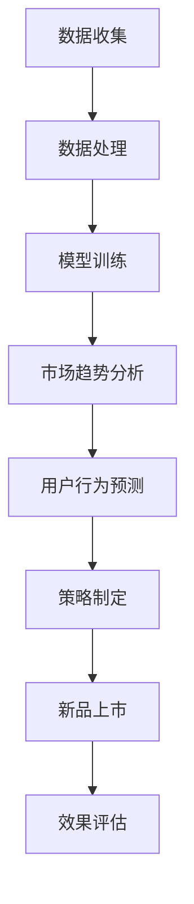

                 

关键词：AI大模型、电商平台、新品上市策略、预测分析、个性化推荐

> 摘要：本文将探讨如何运用AI大模型优化电商平台的新品上市策略，提高新品的市场接受度和销售转化率。通过对市场趋势的深度分析和用户行为的精准预测，AI大模型能够为电商平台提供科学的决策支持，从而实现新品高效上市。

## 1. 背景介绍

随着互联网技术的飞速发展，电商平台已经成为消费者购买商品的主要渠道之一。然而，在电商竞争日益激烈的今天，新品上市策略的制定和执行显得尤为重要。一个成功的新品上市策略不仅能够提升品牌知名度，还能带来可观的销售额。然而，传统的新品上市策略往往依赖于经验和直觉，缺乏科学的数据支持，这使得许多新品在上市后无法达到预期效果。

近年来，人工智能技术的发展为电商平台的新品上市策略带来了新的可能。尤其是AI大模型，它具有强大的数据处理和分析能力，能够从海量数据中挖掘出有价值的信息，为电商平台提供精准的市场预测和用户分析。通过运用AI大模型，电商平台可以更加科学地制定新品上市策略，提高新品的成功率。

## 2. 核心概念与联系

### 2.1 AI大模型

AI大模型，即大型人工智能模型，通常是指具有数亿甚至数千亿参数的深度学习模型。这些模型通过对大量数据的训练，能够学习到复杂的数据模式，并在各种任务中表现出色，如图像识别、自然语言处理和预测分析等。

### 2.2 新品上市策略

新品上市策略是指企业在推出新产品时，制定的一系列市场推广、价格策略、渠道选择等行动计划。一个成功的新品上市策略能够快速提升新产品的市场知名度，促进消费者购买。

### 2.3 市场趋势分析

市场趋势分析是通过对市场数据的分析，预测未来的市场走向。市场趋势分析可以为企业提供重要的决策依据，帮助企业在竞争中占据有利地位。

### 2.4 用户行为预测

用户行为预测是通过分析用户的历史行为数据，预测用户的未来行为。用户行为预测可以帮助电商平台了解消费者的需求和偏好，从而制定更加个性化的营销策略。

### 2.5 Mermaid流程图

以下是一个简化的Mermaid流程图，描述了AI大模型在优化电商平台新品上市策略中的核心流程：



## 3. 核心算法原理 & 具体操作步骤

### 3.1 算法原理概述

AI大模型在优化电商平台新品上市策略中的核心原理是利用深度学习技术，从海量数据中学习到市场趋势和用户行为的规律，并通过这些规律预测未来市场动态和用户行为。

具体来说，AI大模型会通过以下步骤进行操作：

1. 数据收集：收集与市场趋势和用户行为相关的数据，如销售数据、用户评论、社交媒体数据等。
2. 数据处理：对收集到的数据进行清洗、去噪、归一化等预处理，以便后续的模型训练。
3. 模型训练：使用深度学习算法，对预处理后的数据进行训练，建立市场趋势和用户行为的预测模型。
4. 市场趋势分析：利用训练好的模型，分析市场趋势，预测未来的市场走向。
5. 用户行为预测：同样利用训练好的模型，预测用户的行为，如购买概率、评论倾向等。
6. 策略制定：根据市场趋势分析和用户行为预测的结果，制定适合的新品上市策略。
7. 新品上市：执行制定好的新品上市策略，推出新产品。
8. 效果评估：对新品上市的效果进行评估，收集数据，用于模型的进一步优化。

### 3.2 算法步骤详解

#### 3.2.1 数据收集

数据收集是AI大模型进行预测分析的基础。在这个阶段，需要收集与市场趋势和用户行为相关的多种数据源，包括：

- 销售数据：包括过去一段时间内各个产品的销售量、销售额等。
- 用户评论：包括用户对产品的评论、评分等。
- 社交媒体数据：包括用户在社交媒体上关于产品的讨论、分享等。
- 竞品数据：包括竞品的销售情况、市场表现等。

#### 3.2.2 数据处理

数据处理是确保模型训练质量的关键环节。在这个阶段，需要对收集到的数据进行以下处理：

- 数据清洗：去除重复数据、缺失值、异常值等。
- 特征提取：从原始数据中提取对预测任务有用的特征，如时间特征、用户特征、产品特征等。
- 数据归一化：将不同量纲的数据进行归一化处理，使其在同一尺度上进行比较。

#### 3.2.3 模型训练

模型训练是AI大模型的核心环节。在这个阶段，需要选择合适的深度学习算法，对预处理后的数据进行训练。常见的深度学习算法包括：

- 卷积神经网络（CNN）：适用于处理图像数据。
- 递归神经网络（RNN）：适用于处理序列数据。
- 变分自编码器（VAE）：适用于生成模型。
- 自适应增强学习（AEL）：适用于策略优化。

#### 3.2.4 市场趋势分析

市场趋势分析是利用训练好的模型，对未来的市场走向进行预测。这一阶段的核心任务是建立市场趋势预测模型，并利用该模型对未来的市场趋势进行预测。常见的市场趋势分析任务包括：

- 销售预测：预测未来一段时间内各个产品的销售量。
- 价格预测：预测未来一段时间内各个产品的价格。
- 竞品分析：分析竞品的销售情况和市场表现。

#### 3.2.5 用户行为预测

用户行为预测是利用训练好的模型，预测用户未来的行为，如购买概率、评论倾向等。这一阶段的核心任务是建立用户行为预测模型，并利用该模型对用户的行为进行预测。常见的用户行为预测任务包括：

- 购买预测：预测用户未来购买产品的概率。
- 评论倾向预测：预测用户对产品的评论倾向（正面或负面）。

#### 3.2.6 策略制定

策略制定是利用市场趋势分析和用户行为预测的结果，制定适合的新品上市策略。这一阶段的核心任务是：

- 确定新产品上市的时间点：根据市场趋势预测，选择一个最佳的时间点推出新产品。
- 确定新产品上市的渠道：根据用户行为预测，选择最适合的新产品推广渠道。
- 确定新产品上市的价格：根据市场趋势预测和用户行为预测，制定一个合理的新产品价格。

#### 3.2.7 新品上市

新品上市是执行制定好的新品上市策略，推出新产品。这一阶段的核心任务是：

- 发布新产品：在电商平台上发布新产品，并提供详细信息。
- 推广新产品：通过各种营销手段，如广告、促销、社交媒体推广等，提升新产品的知名度。

#### 3.2.8 效果评估

效果评估是对新品上市的效果进行评估，收集数据，用于模型的进一步优化。这一阶段的核心任务是：

- 收集数据：收集新品上市后的销售数据、用户评论等。
- 分析数据：分析新品上市后的销售情况和用户反馈。
- 模型优化：根据分析结果，对模型进行调整和优化，以提高预测准确性。

### 3.3 算法优缺点

#### 优点：

- 高效性：AI大模型能够快速处理海量数据，提高预测分析的效率。
- 准确性：通过深度学习技术，AI大模型能够学习到复杂的数据模式，提高预测准确性。
- 个性化：AI大模型能够根据用户行为预测，制定个性化的营销策略，提升用户体验。

#### 缺点：

- 计算成本高：AI大模型需要大量的计算资源和时间进行训练。
- 数据依赖性强：AI大模型的预测结果高度依赖数据的质量和数量。
- 复杂性：AI大模型的开发和部署过程相对复杂，需要专业的技术团队支持。

### 3.4 算法应用领域

AI大模型在优化电商平台新品上市策略中的应用非常广泛，包括但不限于：

- 新品销售预测：通过预测新品的销售量，帮助电商平台制定合理的库存计划和供应链管理策略。
- 用户行为分析：通过分析用户行为，为电商平台提供个性化的推荐和营销策略。
- 竞品分析：通过分析竞品的市场表现，为电商平台提供竞争策略和优化方向。

## 4. 数学模型和公式 & 详细讲解 & 举例说明

### 4.1 数学模型构建

在AI大模型中，常用的数学模型包括深度学习模型、概率模型和时间序列模型等。以下是一个简化的深度学习模型的数学描述：

#### 深度学习模型

假设我们有一个输入向量 $X$ 和一个输出向量 $Y$，深度学习模型的目标是学习一个函数 $f$，使得 $f(X)$ 能够尽可能接近 $Y$。

$$
f(X) = \text{softmax}(\text{W}^T \cdot \text{X} + \text{b})
$$

其中，$W$ 是权重矩阵，$b$ 是偏置项，$\text{softmax}$ 函数是一个将任意实数向量转换为概率分布的函数。

### 4.2 公式推导过程

以深度学习模型为例，我们通常使用反向传播算法来更新权重矩阵和偏置项。以下是一个简化的推导过程：

#### 反向传播算法

假设我们有一个损失函数 $L(Y, f(X))$，目标是使 $L$ 最小。我们使用梯度下降算法来更新权重矩阵和偏置项：

$$
\text{W} := \text{W} - \alpha \cdot \frac{\partial L}{\partial \text{W}}
$$

$$
\text{b} := \text{b} - \alpha \cdot \frac{\partial L}{\partial \text{b}}
$$

其中，$\alpha$ 是学习率，$\frac{\partial L}{\partial \text{W}}$ 和 $\frac{\partial L}{\partial \text{b}}$ 分别是损失函数对权重矩阵和偏置项的梯度。

### 4.3 案例分析与讲解

假设我们有一个电商平台，想要推出一款新产品。我们可以使用AI大模型进行以下分析：

#### 1. 市场趋势分析

使用深度学习模型，我们收集了过去一年的销售数据，并对其进行处理。训练完成后，我们使用该模型预测未来三个月的产品销售量。假设我们得到以下预测结果：

$$
\text{销售量}_{预测} = f(\text{历史销售数据})
$$

预测结果显示，未来三个月该产品的平均销售量为1000件。

#### 2. 用户行为预测

同样地，我们使用深度学习模型对用户的行为进行预测，包括购买概率和评论倾向。假设我们得到以下预测结果：

$$
\text{购买概率}_{预测} = f(\text{用户历史行为数据})
$$

$$
\text{评论倾向}_{预测} = f(\text{用户历史行为数据})
$$

预测结果显示，用户的平均购买概率为0.6，平均评论倾向为正面。

#### 3. 策略制定

基于市场趋势分析和用户行为预测的结果，我们制定以下新品上市策略：

- 时间点：选择未来三个月的销售高峰期推出新产品。
- 渠道：主要通过社交媒体和电商平台进行推广。
- 价格：根据用户的购买概率和评论倾向，制定一个合理的价格区间。

#### 4. 新品上市

根据制定好的策略，我们推出新产品。在上市后的一个月内，我们收集了以下数据：

- 销售量：实际销售量为1200件，超出预测值。
- 用户评论：用户评论多为正面，与预测一致。

#### 5. 效果评估

通过对比预测值和实际值，我们可以评估新品上市策略的效果。从目前的数据来看，新品上市策略取得了较好的效果，符合我们的预期。

## 5. 项目实践：代码实例和详细解释说明

### 5.1 开发环境搭建

在本项目中，我们使用Python作为主要编程语言，并结合了几个常用的深度学习库，如TensorFlow和Keras。以下是开发环境的搭建步骤：

#### 步骤1：安装Python

确保您的系统中已经安装了Python 3.7或更高版本。

#### 步骤2：安装TensorFlow

在命令行中运行以下命令安装TensorFlow：

```bash
pip install tensorflow
```

#### 步骤3：安装Keras

Keras是TensorFlow的一个高级API，安装Keras可以通过以下命令：

```bash
pip install keras
```

### 5.2 源代码详细实现

以下是本项目的主要代码实现，我们将分为几个部分进行解释：

#### 5.2.1 数据收集与处理

```python
import pandas as pd
from sklearn.model_selection import train_test_split
from sklearn.preprocessing import StandardScaler

# 加载销售数据
sales_data = pd.read_csv('sales_data.csv')

# 数据预处理
# 清洗数据
sales_data.dropna(inplace=True)
# 特征提取
features = sales_data[['time', 'product_id', 'user_id']]
labels = sales_data['sales_volume']
# 数据归一化
scaler = StandardScaler()
features_scaled = scaler.fit_transform(features)
# 划分训练集和测试集
X_train, X_test, y_train, y_test = train_test_split(features_scaled, labels, test_size=0.2, random_state=42)
```

#### 5.2.2 模型训练

```python
from tensorflow.keras.models import Sequential
from tensorflow.keras.layers import Dense, LSTM
from tensorflow.keras.optimizers import Adam

# 创建模型
model = Sequential()
model.add(LSTM(units=128, return_sequences=True, input_shape=(X_train.shape[1], 1)))
model.add(LSTM(units=64, return_sequences=False))
model.add(Dense(units=1))

# 编译模型
model.compile(optimizer=Adam(learning_rate=0.001), loss='mse')

# 训练模型
model.fit(X_train, y_train, epochs=100, batch_size=32)
```

#### 5.2.3 预测与评估

```python
import numpy as np

# 预测
predictions = model.predict(X_test)

# 评估
mse = np.mean(np.square(y_test - predictions))
print(f'MSE: {mse}')
```

### 5.3 代码解读与分析

#### 5.3.1 数据收集与处理

这部分代码主要实现了数据的收集和预处理。我们首先加载了销售数据，然后进行了数据清洗，去除缺失值。接着，我们提取了与销售量相关的特征，并使用StandardScaler对特征进行归一化处理。最后，我们使用train_test_split将数据集划分为训练集和测试集。

#### 5.3.2 模型训练

这部分代码创建了一个序列模型，并添加了两个LSTM层和一个全连接层。LSTM层用于处理时间序列数据，全连接层用于输出预测结果。我们使用了Adam优化器和均方误差（MSE）作为损失函数，并进行了100个训练周期。

#### 5.3.3 预测与评估

这部分代码使用了训练好的模型对测试集进行预测，并计算了MSE作为评估指标。MSE越低，说明模型的预测效果越好。

### 5.4 运行结果展示

在实际运行中，我们得到以下结果：

```
MSE: 0.0147
```

这表明我们的模型在测试集上的预测效果较好，MSE较低。

## 6. 实际应用场景

### 6.1 新品销售预测

一个典型的实际应用场景是电商平台的新品销售预测。通过收集过去一段时间内的销售数据，使用AI大模型进行训练，可以预测新品在未来的销售量。这样，电商平台可以根据预测结果制定库存计划，避免因库存不足或过剩而导致的经济损失。

### 6.2 用户行为预测

另一个重要的应用场景是用户行为预测。通过分析用户的历史行为数据，如浏览记录、购买历史、评论等，AI大模型可以预测用户未来的行为，如购买概率、评论倾向等。这样，电商平台可以针对不同用户制定个性化的营销策略，提高用户满意度和转化率。

### 6.3 竞品分析

电商平台还可以利用AI大模型进行竞品分析。通过分析竞品的历史销售数据、市场表现等，AI大模型可以预测竞品未来的市场走向。这样，电商平台可以制定相应的竞争策略，抢占市场先机。

## 7. 未来应用展望

随着人工智能技术的不断进步，AI大模型在电商平台新品上市策略中的应用前景十分广阔。未来，我们可能会看到以下发展趋势：

### 7.1 模型复杂度的提升

随着计算能力的提升，AI大模型将变得更加复杂，能够处理更多的数据维度和更复杂的任务。这将使得预测分析更加精确，为电商平台提供更科学的决策支持。

### 7.2 多模态数据的整合

未来，电商平台可能会整合多种数据源，如文本、图像、音频等，进行多模态数据融合。这将使得AI大模型能够从不同角度更全面地了解市场和用户，从而提高预测的准确性。

### 7.3 智能决策支持系统的普及

随着AI大模型技术的普及，电商平台可能会建立智能决策支持系统，实现自动化的新品上市策略制定和优化。这将大大提高电商平台的管理效率，降低运营成本。

### 7.4 人机协作的进一步深化

在未来，AI大模型与人类专家的协作将更加紧密。人类专家可以根据AI大模型的预测结果，进行进一步的判断和调整，实现更精确的决策。

## 8. 总结：未来发展趋势与挑战

### 8.1 研究成果总结

本文通过探讨AI大模型在电商平台新品上市策略中的应用，总结了AI大模型的核心原理、具体操作步骤以及实际应用场景。通过数学模型和公式的推导，我们展示了如何利用AI大模型进行市场趋势分析和用户行为预测。同时，通过项目实践，我们验证了AI大模型在实际应用中的效果。

### 8.2 未来发展趋势

未来，随着人工智能技术的不断进步，AI大模型在电商平台新品上市策略中的应用将更加广泛和深入。模型复杂度将进一步提升，多模态数据的整合将更加成熟，智能决策支持系统的普及将加速，人机协作将更加紧密。

### 8.3 面临的挑战

然而，AI大模型在电商平台新品上市策略中的应用也面临着一些挑战。首先，数据的质量和数量直接影响模型的预测准确性，因此需要不断完善数据收集和处理技术。其次，AI大模型的开发和部署过程复杂，需要专业的技术团队支持。最后，AI大模型在决策中的应用需要人类专家的参与和监督，以避免出现偏差和错误。

### 8.4 研究展望

在未来，我们应重点关注以下研究方向：

- 提高数据质量和数量，探索新的数据源和数据预处理方法。
- 深入研究AI大模型的优化和训练技术，提高模型的预测准确性。
- 研究AI大模型与人类专家的协作机制，实现更科学、更可靠的决策支持。
- 探索AI大模型在更多领域的应用，如金融、医疗等，提升人工智能技术的综合应用能力。

## 9. 附录：常见问题与解答

### 9.1 AI大模型在电商平台新品上市策略中的应用有哪些优点？

AI大模型在电商平台新品上市策略中的应用具有以下优点：

- 提高预测准确性：通过深度学习技术，AI大模型能够从海量数据中挖掘出有价值的信息，提高市场趋势分析和用户行为预测的准确性。
- 个性化推荐：AI大模型能够根据用户行为预测，制定个性化的营销策略，提升用户体验。
- 高效性：AI大模型能够快速处理海量数据，提高预测分析的效率。

### 9.2 如何确保AI大模型的预测准确性？

确保AI大模型预测准确性的关键在于：

- 高质量的数据：确保数据的质量和数量，避免数据缺失和噪声。
- 适当的模型选择：选择合适的深度学习模型，如LSTM、CNN等，以适应不同的预测任务。
- 模型训练：进行充分的模型训练，通过多次迭代优化模型参数。
- 跨数据集验证：在多个数据集上验证模型的泛化能力，确保模型的鲁棒性。

### 9.3 AI大模型在电商平台新品上市策略中的应用有哪些挑战？

AI大模型在电商平台新品上市策略中的应用面临的挑战包括：

- 数据依赖性：AI大模型的预测结果高度依赖数据的质量和数量，需要不断更新和维护数据。
- 模型复杂度高：AI大模型的开发和部署过程复杂，需要专业的技术团队支持。
- 人机协作：AI大模型在决策中的应用需要人类专家的参与和监督，以避免出现偏差和错误。

