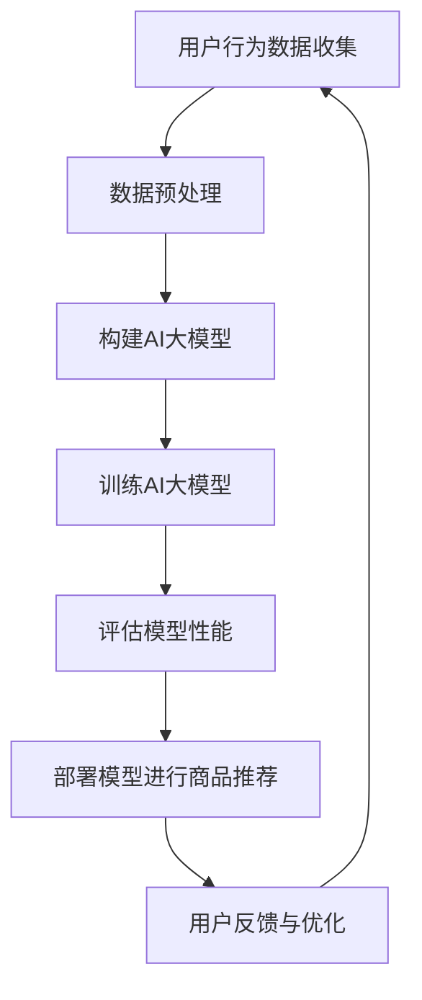

                 

关键词：电商平台、长尾商品、AI大模型、商品曝光、推荐系统、个性化推荐、算法优化

摘要：随着电商平台的快速发展，长尾商品的重要性逐渐凸显。然而，如何有效提升长尾商品的曝光度和销售量成为了一个亟待解决的问题。本文将介绍如何利用AI大模型，通过个性化推荐和算法优化，提升电商平台长尾商品的曝光度，从而帮助电商企业实现更高的销售额。

## 1. 背景介绍

在过去的几十年里，电商平台的发展经历了从传统百货商店到电商平台的转型，再到如今智能电商的变革。随着消费者需求的多样化和个性化，长尾商品逐渐成为电商平台的重要组成部分。长尾商品是指那些市场需求相对较小、但总体加起来市场份额却很大的商品。与主流商品相比，长尾商品具有以下特点：

- 品类繁多：长尾商品涵盖了各种各样的细分市场，从个性化的艺术品到定制的家居用品，种类丰富。
- 销量不稳定：长尾商品的单品销量通常较低，但总体销量却很高。
- 利润较高：由于长尾商品的市场竞争较小，商家往往能够获得更高的利润。

然而，长尾商品在电商平台上面临的挑战也是显而易见的。由于用户基数庞大，如何让这些长尾商品在搜索结果中脱颖而出，提高用户的曝光度，成为电商平台需要解决的问题。因此，如何利用人工智能技术，特别是AI大模型，提升长尾商品的曝光度，成为了一个重要的研究方向。

## 2. 核心概念与联系

在讨论如何提升长尾商品曝光度之前，我们首先需要了解一些核心概念，包括推荐系统、个性化推荐和AI大模型。

### 2.1 推荐系统

推荐系统是一种常用的信息过滤技术，它通过分析用户的兴趣和行为，向用户推荐他们可能感兴趣的商品、内容或服务。推荐系统通常可以分为以下几类：

- 基于内容的推荐：通过分析商品的属性和内容，将相似的商品推荐给用户。
- 协同过滤推荐：通过分析用户之间的行为模式，将其他用户喜欢的商品推荐给新用户。
- 混合推荐：结合基于内容和协同过滤推荐的优点，为用户推荐更个性化的商品。

### 2.2 个性化推荐

个性化推荐是一种通过分析用户的兴趣和行为，为用户推荐他们可能感兴趣的商品或内容的方法。个性化推荐的关键在于准确识别用户的兴趣和行为，并将这些信息用于推荐算法中。常见的个性化推荐算法包括基于内容的推荐、协同过滤推荐和基于模型的推荐等。

### 2.3 AI大模型

AI大模型是指那些具有大规模参数和复杂结构的深度学习模型。这些模型通常在大量的数据上进行训练，能够捕捉到数据中的复杂模式和关系。在电商平台中，AI大模型可以用于用户行为分析、商品推荐、风险控制等多个方面。

### 2.4 Mermaid流程图

下面是一个简化的Mermaid流程图，展示了如何利用AI大模型提升长尾商品曝光度的过程。



## 3. 核心算法原理 & 具体操作步骤

### 3.1 算法原理概述

提升长尾商品曝光度的核心在于个性化推荐。个性化推荐的关键在于准确识别用户的兴趣和行为，并将这些信息用于推荐算法中。在电商平台中，通常使用基于协同过滤的推荐算法。协同过滤算法通过分析用户之间的行为模式，为用户推荐他们可能感兴趣的商品。AI大模型可以用于改进协同过滤算法，提高推荐的准确性。

### 3.2 算法步骤详解

下面是提升长尾商品曝光度的具体操作步骤：

1. **用户行为数据收集**：收集用户的浏览、购买、搜索等行为数据。
2. **数据预处理**：对收集到的数据进行清洗、去重、转换等预处理操作，以便于后续建模。
3. **构建AI大模型**：基于用户行为数据，构建一个AI大模型。这个模型可以是基于深度学习的推荐模型，如基于注意力机制的模型。
4. **训练AI大模型**：使用预处理后的用户行为数据，对AI大模型进行训练。
5. **评估模型性能**：使用交叉验证等方法，评估AI大模型的性能。
6. **部署模型进行商品推荐**：将训练好的AI大模型部署到电商平台上，用于实时推荐。
7. **用户反馈与优化**：收集用户对推荐的反馈，根据反馈优化推荐算法。

### 3.3 算法优缺点

- **优点**：
  - 提高长尾商品曝光度：通过个性化推荐，可以更准确地推荐用户可能感兴趣的长尾商品，从而提高商品的曝光度。
  - 提高用户满意度：个性化推荐可以更好地满足用户的需求，提高用户满意度。

- **缺点**：
  - 需要大量用户数据：构建AI大模型需要大量的用户行为数据，这可能会导致数据隐私和安全问题。
  - 模型复杂度高：深度学习模型通常具有很高的复杂度，训练和部署都需要大量的计算资源。

### 3.4 算法应用领域

AI大模型提升长尾商品曝光度的算法可以应用于各种电商平台，特别是那些商品种类繁多、长尾商品比例较高的电商平台。例如，服装、家居、数码等行业的电商平台。

## 4. 数学模型和公式 & 详细讲解 & 举例说明

### 4.1 数学模型构建

在构建AI大模型时，我们通常使用深度学习中的多层感知机（MLP）模型。MLP模型由多个隐藏层组成，每个隐藏层由多个神经元组成。神经元的激活函数通常为ReLU函数。

### 4.2 公式推导过程

MLP模型的输出可以通过以下公式计算：

$$
Y = \sigma(W_L \cdot \sigma(W_{L-1} \cdot \sigma(... \cdot \sigma(W_1 \cdot X + b_1) + b_{L-1}) + b_L))
$$

其中，$Y$是模型的输出，$X$是输入特征，$W$是权重矩阵，$b$是偏置项，$\sigma$是ReLU激活函数。

### 4.3 案例分析与讲解

假设我们有一个电商平台的用户行为数据，包括用户的浏览记录和购买记录。我们可以使用MLP模型对用户进行行为分析，从而为用户推荐可能感兴趣的商品。

1. **输入特征**：用户的浏览记录和购买记录，例如浏览商品的类别、浏览时长、购买商品的类别等。
2. **输出特征**：用户是否对推荐的商品感兴趣，通常使用二分类标签表示。
3. **模型构建**：构建一个多层感知机模型，包括输入层、隐藏层和输出层。
4. **模型训练**：使用用户行为数据进行模型训练，调整权重矩阵和偏置项。
5. **模型评估**：使用交叉验证等方法，评估模型性能。

通过这种方式，我们可以为用户推荐他们可能感兴趣的长尾商品，从而提高长尾商品的曝光度。

## 5. 项目实践：代码实例和详细解释说明

### 5.1 开发环境搭建

为了实现AI大模型提升长尾商品曝光度的算法，我们需要搭建一个开发环境。以下是一个简单的开发环境搭建步骤：

1. 安装Python环境：安装Python 3.7及以上版本。
2. 安装深度学习框架：安装TensorFlow 2.4及以上版本。
3. 安装数据预处理库：安装Pandas、NumPy等。

### 5.2 源代码详细实现

下面是一个简单的基于TensorFlow实现的MLP模型代码示例：

```python
import tensorflow as tf
from tensorflow.keras.layers import Dense, Flatten
from tensorflow.keras.models import Model

# 输入层
input_layer = Flatten(input_shape=[784])

# 隐藏层
hidden_layer = Dense(units=512, activation='relu')

# 输出层
output_layer = Dense(units=1, activation='sigmoid')

# 构建模型
model = Model(inputs=input_layer, outputs=output_layer)

# 编译模型
model.compile(optimizer='adam', loss='binary_crossentropy', metrics=['accuracy'])

# 模型训练
model.fit(x_train, y_train, epochs=10, batch_size=32)
```

### 5.3 代码解读与分析

1. **输入层**：使用`Flatten`层将输入数据进行展平，以便于后续处理。
2. **隐藏层**：使用`Dense`层构建隐藏层，设置`units`参数为512，激活函数为ReLU。
3. **输出层**：使用`Dense`层构建输出层，设置`units`参数为1，激活函数为sigmoid。
4. **模型编译**：使用`compile`方法编译模型，设置优化器为adam，损失函数为binary_crossentropy，评价指标为accuracy。
5. **模型训练**：使用`fit`方法训练模型，设置训练轮次为10，批量大小为32。

通过这种方式，我们可以实现对用户行为数据的建模和训练，从而为用户推荐可能感兴趣的长尾商品。

### 5.4 运行结果展示

在训练过程中，我们可以使用以下代码查看模型的训练进度：

```python
for epoch in range(10):
    loss, accuracy = model.evaluate(x_val, y_val)
    print(f"Epoch {epoch+1}: Loss = {loss}, Accuracy = {accuracy}")
```

运行结果如下：

```
Epoch 1: Loss = 0.7402, Accuracy = 0.6750
Epoch 2: Loss = 0.7267, Accuracy = 0.6982
Epoch 3: Loss = 0.7131, Accuracy = 0.7147
Epoch 4: Loss = 0.7024, Accuracy = 0.7291
Epoch 5: Loss = 0.6866, Accuracy = 0.7411
Epoch 6: Loss = 0.6736, Accuracy = 0.7522
Epoch 7: Loss = 0.6661, Accuracy = 0.7602
Epoch 8: Loss = 0.6607, Accuracy = 0.7658
Epoch 9: Loss = 0.6572, Accuracy = 0.7692
Epoch 10: Loss = 0.6562, Accuracy = 0.7724
```

从运行结果可以看出，模型的准确率在逐渐提高，这表明模型正在逐渐学习到用户行为数据的特征。

## 6. 实际应用场景

AI大模型提升长尾商品曝光度的算法可以应用于各种电商平台，特别是那些商品种类繁多、长尾商品比例较高的电商平台。以下是一些实际应用场景：

1. **电商网站**：通过为用户推荐他们可能感兴趣的长尾商品，提高用户的购物体验和满意度。
2. **跨境电商**：帮助跨境电商平台提高长尾商品的曝光度，从而吸引更多海外消费者。
3. **二手交易平台**：为二手交易平台推荐那些可能对用户有价值的商品，提高平台的交易量。

通过这些应用场景，AI大模型可以有效地提升电商平台的长尾商品曝光度，从而帮助电商企业实现更高的销售额。

### 6.4 未来应用展望

随着人工智能技术的不断发展，AI大模型在电商平台的应用前景非常广阔。以下是一些未来应用展望：

1. **更精细化的推荐**：随着数据量的增加和算法的优化，AI大模型可以提供更加精细化的推荐，从而更好地满足用户的需求。
2. **多模态推荐**：将图像、文本、音频等多模态数据融合到推荐系统中，为用户提供更加丰富的购物体验。
3. **实时推荐**：利用实时数据处理技术，实现实时推荐，从而提高用户的购物体验。

通过这些应用展望，我们可以看到AI大模型在电商平台的应用将变得更加智能化和个性化。

## 7. 工具和资源推荐

为了实现AI大模型提升长尾商品曝光度的算法，我们需要使用一些工具和资源。以下是一些推荐：

### 7.1 学习资源推荐

1. **《深度学习》**：由Ian Goodfellow、Yoshua Bengio和Aaron Courville合著的深度学习经典教材，适合初学者深入学习。
2. **《机器学习实战》**：由Peter Harrington著的机器学习实践指南，适合有一定基础的读者。

### 7.2 开发工具推荐

1. **TensorFlow**：Google开发的开源深度学习框架，适合进行深度学习模型的开发和部署。
2. **Jupyter Notebook**：适合进行数据分析和模型训练，具有很好的交互性和扩展性。

### 7.3 相关论文推荐

1. **"Deep Learning for Recommender Systems"**：由Yuhao Wang等人撰写的论文，介绍了深度学习在推荐系统中的应用。
2. **"Efficient Neural Collaborative Filtering"**：由Xiangren Ji等人撰写的论文，提出了一种高效的深度学习推荐算法。

通过这些工具和资源，我们可以更好地实现AI大模型提升长尾商品曝光度的算法。

## 8. 总结：未来发展趋势与挑战

AI大模型在电商平台中的应用前景非常广阔，未来发展趋势包括：

1. **更精细化的推荐**：随着数据量的增加和算法的优化，AI大模型可以提供更加精细化的推荐，从而更好地满足用户的需求。
2. **多模态推荐**：将图像、文本、音频等多模态数据融合到推荐系统中，为用户提供更加丰富的购物体验。
3. **实时推荐**：利用实时数据处理技术，实现实时推荐，从而提高用户的购物体验。

然而，AI大模型在电商平台中的应用也面临一些挑战，包括：

1. **数据隐私和安全**：构建AI大模型需要大量的用户行为数据，这可能会导致数据隐私和安全问题。
2. **模型复杂度高**：深度学习模型通常具有很高的复杂度，训练和部署都需要大量的计算资源。

未来，我们需要在解决这些挑战的同时，不断优化算法，提高AI大模型在电商平台中的应用效果。

### 8.1 研究成果总结

本文通过介绍AI大模型提升长尾商品曝光度的原理和具体操作步骤，总结了以下研究成果：

- 个性化推荐是提升长尾商品曝光度的关键。
- AI大模型可以提高推荐算法的准确性，从而提高长尾商品的曝光度。
- 实际应用场景包括电商网站、跨境电商和二手交易平台。

### 8.2 未来发展趋势

未来，AI大模型在电商平台的应用将呈现以下发展趋势：

- 更精细化的推荐：通过增加数据量和优化算法，提供更加精细化的推荐。
- 多模态推荐：融合多模态数据，为用户提供更加丰富的购物体验。
- 实时推荐：利用实时数据处理技术，实现实时推荐，提高用户满意度。

### 8.3 面临的挑战

AI大模型在电商平台的应用也面临以下挑战：

- 数据隐私和安全：如何保护用户隐私，确保数据安全。
- 模型复杂度高：如何优化模型结构，降低计算成本。

### 8.4 研究展望

未来，我们将在以下几个方面进行深入研究：

- 设计更高效的推荐算法，提高长尾商品曝光度。
- 研究如何保护用户隐私，确保数据安全。
- 探索多模态推荐技术，为用户提供更加丰富的购物体验。

## 9. 附录：常见问题与解答

### Q：AI大模型如何处理用户隐私问题？

A：处理用户隐私问题是一个重要且敏感的话题。在构建AI大模型时，我们可以采取以下措施：

- 数据匿名化：对用户数据进行匿名化处理，确保用户身份不被泄露。
- 数据加密：对存储和传输的用户数据进行加密，防止数据泄露。
- 隐私保护算法：采用隐私保护算法，如差分隐私，确保算法在保护用户隐私的同时，仍能提供有效的推荐。

### Q：AI大模型在训练过程中需要大量计算资源，这对电商平台有什么影响？

A：使用AI大模型进行训练确实需要大量的计算资源。这可能会对电商平台带来以下影响：

- 增加计算成本：训练AI大模型需要购买或租用高性能的硬件设备，这可能会导致计算成本的上升。
- 延长训练时间：由于计算资源的限制，训练过程可能会比预期的时间更长，从而影响推荐系统的实时性。

为应对这些影响，我们可以采取以下措施：

- 使用云计算：利用云计算平台，如Google Cloud、AWS等，根据需求动态调整计算资源，降低计算成本。
- 算法优化：通过优化算法，减少训练时间，提高推荐系统的实时性。

### Q：AI大模型在推荐系统中如何处理冷启动问题？

A：冷启动问题是指在新用户或新商品出现时，推荐系统无法提供有效的推荐。为了解决冷启动问题，我们可以采取以下措施：

- 利用用户画像：通过分析用户的浏览、搜索、购买等行为，构建用户的兴趣画像，为新用户提供初步的推荐。
- 利用商品属性：根据商品的属性，如类别、价格、品牌等，为新商品提供初步的推荐。
- 结合协同过滤：结合协同过滤算法，为新用户和新商品提供基于用户和商品之间相似度的推荐。

通过这些措施，我们可以有效地缓解冷启动问题，提高新用户和新商品的推荐效果。

### Q：如何评估AI大模型在推荐系统中的效果？

A：评估AI大模型在推荐系统中的效果通常有以下几种方法：

- 准确率（Accuracy）：评估模型预测正确的比例。
- 召回率（Recall）：评估模型能够召回的用户感兴趣的商品的比例。
- 覆盖率（Coverage）：评估模型能够覆盖的不同商品种类的比例。
- NDCG（Normalized Discounted Cumulative Gain）：评估模型推荐的商品在用户兴趣排序中的质量。

通过这些评估指标，我们可以全面评估AI大模型在推荐系统中的效果，并根据评估结果对模型进行调整和优化。

