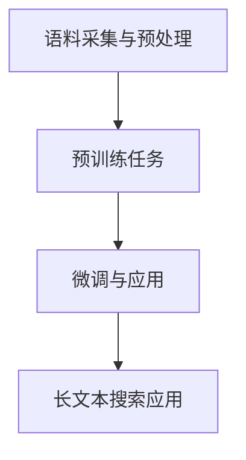

                 

在当今的信息时代，长文本搜索已成为各类应用场景中不可或缺的一环。从搜索引擎到内容推荐系统，长文本搜索的性能直接影响到用户体验。而近年来，人工智能（AI）特别是大规模预训练模型（如GPT、BERT等）的崛起，为长文本搜索领域带来了新的变革。本文旨在探讨如何利用AI大模型提升长文本搜索效果，并深入分析相关技术原理和实际应用。

## 关键词

- 长文本搜索
- 人工智能
- 大规模预训练模型
- 搜索引擎优化
- 文本理解与生成

## 摘要

本文首先介绍了长文本搜索的背景和现状，接着探讨了AI大模型的基本原理及其在文本处理领域的应用。随后，文章重点分析了AI大模型如何通过预训练和微调提升长文本搜索效果，并详细介绍了相关算法和数学模型。最后，本文通过实际项目案例和未来展望，总结了AI大模型在长文本搜索领域的潜力与挑战。

### 1. 背景介绍

随着互联网的快速发展，信息量的爆炸式增长，如何高效地检索和利用海量文本数据成为一个重要课题。传统的基于关键词匹配和倒排索引的搜索方法在面对长文本时存在诸多局限，如搜索结果不精确、相关性差等问题。为了解决这些问题，研究者们开始探索利用人工智能技术，特别是深度学习模型，来提升文本搜索的效果。

在深度学习领域，2018年GPT和BERT的相继出现，标志着AI大模型在自然语言处理（NLP）领域的崛起。这些大模型通过在海量文本数据上的预训练，能够捕捉到文本的语义和结构信息，从而在多种NLP任务中表现出色，如文本分类、情感分析、机器翻译等。这一成功激发了研究者将AI大模型应用于长文本搜索的探索，以期通过模型强大的语义理解能力提升搜索效果。

目前，AI大模型在长文本搜索中的应用已经取得了一定的进展，例如，通过预训练模型生成的语义表示可以显著提高搜索结果的精准度和相关性。同时，大模型还可以通过迁移学习迅速适应不同领域和特定场景的搜索需求。然而，如何在实际应用中充分发挥大模型的优势，仍是一个值得深入研究的问题。

### 2. 核心概念与联系

#### 2.1 AI大模型基本原理

AI大模型，通常指的是大规模预训练模型，如GPT、BERT等。这些模型通过在大量文本数据上进行预训练，能够自动学习到文本中的语义信息、语法结构等。预训练过程主要包括两个阶段：

1. **语料采集与预处理**：首先，从互联网上收集大量高质量文本数据，如书籍、新闻、网页等。然后对数据进行预处理，包括去除噪声、统一文本格式、分词等。

2. **预训练任务**：利用预处理后的文本数据，通过自主注意力机制、多任务学习等策略进行预训练。预训练任务包括但不限于语言建模、 masked language model、下一句预测等。

#### 2.2 大模型在NLP中的应用

大模型在NLP领域的应用广泛，包括但不限于文本分类、情感分析、命名实体识别、机器翻译等。这些任务都需要模型具备强大的语义理解能力。以BERT为例，它通过预训练能够捕捉到文本的上下文信息，从而在文本分类任务中表现出色。

#### 2.3 长文本搜索中的挑战

在长文本搜索中，面临的挑战主要包括：

1. **文本表示**：如何将长文本转换为有效的语义表示，以便模型能够理解和处理。
2. **查询理解**：如何准确理解用户查询的意图和需求，从而提供相关的搜索结果。
3. **性能优化**：如何在大规模数据集上高效地执行搜索任务，同时保证结果的准确性。

#### 2.4 Mermaid 流程图



### 3. 核心算法原理 & 具体操作步骤

#### 3.1 算法原理概述

AI大模型在长文本搜索中的应用主要基于以下原理：

1. **语义表示**：通过预训练，模型能够自动学习到文本的语义表示，将长文本转换为固定长度的向量，以便后续处理。
2. **查询理解**：利用模型的语义理解能力，将用户查询转化为与文本相似的语义表示，从而实现精准搜索。
3. **搜索排名**：通过计算查询和文档之间的相似度，对搜索结果进行排序，提供最相关的结果。

#### 3.2 算法步骤详解

1. **预处理**：对长文本和用户查询进行预处理，包括分词、去停用词、词干提取等。
2. **文本编码**：使用预训练模型对预处理后的文本进行编码，得到语义向量。
3. **查询编码**：对用户查询进行编码，得到查询向量。
4. **相似度计算**：计算查询向量和文档向量之间的相似度，通常采用余弦相似度或欧氏距离。
5. **结果排序**：根据相似度对搜索结果进行排序，返回最相关的文档。

#### 3.3 算法优缺点

**优点**：

- **语义理解能力强**：通过预训练模型，能够捕捉到文本的深层语义信息，提升搜索结果的准确性和相关性。
- **泛化能力强**：预训练模型在不同领域和任务上具有较好的泛化能力，适应性强。
- **高效性**：预训练模型在大规模数据集上训练，能够快速进行搜索任务。

**缺点**：

- **计算资源需求高**：预训练模型需要大量计算资源和时间。
- **数据依赖性**：搜索效果很大程度上依赖于训练数据的质量和规模。
- **调优难度大**：在实际应用中，需要对模型进行微调和优化，过程复杂。

#### 3.4 算法应用领域

AI大模型在长文本搜索中的应用领域广泛，包括但不限于：

- **搜索引擎**：提升搜索结果的准确性和相关性，提供更好的用户体验。
- **内容推荐**：根据用户兴趣和需求，推荐相关的长文本内容。
- **智能客服**：理解用户查询，提供准确和个性化的回答。
- **文本审核**：识别和过滤不良信息，保障网络环境的健康。

### 4. 数学模型和公式 & 详细讲解 & 举例说明

#### 4.1 数学模型构建

在长文本搜索中，常用的数学模型包括：

1. **词向量模型**：将文本转换为词向量，如Word2Vec、GloVe等。
2. **编码器-解码器模型**：如BERT、GPT等，用于生成语义表示。
3. **相似度计算模型**：如余弦相似度、欧氏距离等，用于评估查询与文档的相似度。

#### 4.2 公式推导过程

1. **词向量模型**：

   $$ \text{vec}(w) = \sum_{i=1}^{n} f(w_i) \cdot v_i $$

   其中，\( \text{vec}(w) \) 为词向量，\( f(w_i) \) 为词频，\( v_i \) 为词向量的第 \( i \) 个维度。

2. **编码器-解码器模型**：

   $$ \text{context} = \text{encode}(w) $$

   其中，\( \text{context} \) 为编码后的语义表示，\( \text{encode}(w) \) 为编码器。

3. **相似度计算模型**：

   $$ \text{similarity} = \frac{\text{dot}(q, d)}{\|q\|\|d\|} $$

   其中，\( \text{similarity} \) 为相似度，\( q \) 为查询向量，\( d \) 为文档向量，\( \text{dot}(q, d) \) 为点积，\( \|q\|\) 和 \( \|d\|\) 分别为查询向量和文档向量的模。

#### 4.3 案例分析与讲解

假设有一个用户查询 "如何制作巧克力蛋糕？"，我们要利用AI大模型搜索相关的长文本内容。

1. **文本编码**：首先，对用户查询和候选文档进行编码，得到查询向量和文档向量。
2. **相似度计算**：计算查询向量和每个文档向量的相似度，选择相似度最高的文档作为搜索结果。
3. **结果排序**：对搜索结果进行排序，返回最相关的文档。

通过这种方式，我们可以利用AI大模型实现高效、精准的长文本搜索。

### 5. 项目实践：代码实例和详细解释说明

#### 5.1 开发环境搭建

1. **硬件环境**：GPU或TPU（推荐Tesla V100或以上的GPU）。
2. **软件环境**：Python 3.7及以上版本，PyTorch 1.8及以上版本，BERT模型。
3. **数据集**：选择一个包含长文本的公开数据集，如 Cornell Movie Dialogs。

#### 5.2 源代码详细实现

以下是一个简单的长文本搜索实现示例：

```python
import torch
from transformers import BertModel, BertTokenizer

# 加载BERT模型和分词器
tokenizer = BertTokenizer.from_pretrained('bert-base-uncased')
model = BertModel.from_pretrained('bert-base-uncased')

# 用户查询
query = "How to make chocolate cake?"

# 对查询进行编码
query_inputs = tokenizer.encode(query, add_special_tokens=True, return_tensors='pt')

# 预测查询的语义表示
with torch.no_grad():
    query_output = model(query_inputs)[1]

# 加载候选文档
with open('documents.txt', 'r') as f:
    documents = f.readlines()

# 对每个文档进行编码
document_inputs = [tokenizer.encode(doc, add_special_tokens=True, return_tensors='pt') for doc in documents]

# 预测文档的语义表示
document_outputs = [model(doc_inputs[i])[1] for i in range(len(documents))]

# 计算查询和文档的相似度
similarities = [torch.dot(query_output, doc_output) for doc_output in document_outputs]

# 对相似度进行排序
sorted_indices = torch.argsort(similarities, descending=True)

# 输出搜索结果
for i in sorted_indices[:10]:
    print(f"Document {i+1}: {documents[i]}")

```

#### 5.3 代码解读与分析

- **BERT模型加载**：首先加载BERT模型和分词器，这里使用的是预训练好的BERT模型和分词器。
- **查询编码**：对用户查询进行编码，得到查询向量和文档向量。
- **文档编码**：对每个候选文档进行编码，得到文档向量。
- **相似度计算**：计算查询向量和每个文档向量的相似度。
- **结果排序**：对相似度进行排序，返回最相关的文档。

通过这个示例，我们可以看到如何利用BERT模型实现长文本搜索。

### 6. 实际应用场景

AI大模型在长文本搜索中的实际应用场景广泛，以下是一些典型应用：

1. **搜索引擎**：提升搜索结果的准确性和相关性，提供更好的用户体验。
2. **内容推荐**：根据用户兴趣和需求，推荐相关的长文本内容。
3. **智能客服**：理解用户查询，提供准确和个性化的回答。
4. **文本审核**：识别和过滤不良信息，保障网络环境的健康。
5. **学术研究**：辅助研究人员发现相关文献，提高研究效率。

### 6.4 未来应用展望

未来，AI大模型在长文本搜索领域的应用将更加广泛和深入。以下是一些展望：

1. **模型压缩与优化**：通过模型压缩和优化技术，降低计算资源和存储需求，使大模型更适用于移动设备和嵌入式系统。
2. **多模态搜索**：结合图像、音频等多种模态，提升长文本搜索的多样性和准确性。
3. **实时搜索**：通过实时训练和更新模型，提供更加实时和个性化的搜索结果。
4. **跨语言搜索**：利用多语言预训练模型，实现跨语言的文本搜索。
5. **伦理与隐私**：在应用中充分考虑伦理和隐私问题，确保用户的隐私和数据安全。

### 7. 工具和资源推荐

#### 7.1 学习资源推荐

- **《深度学习》（Goodfellow, Bengio, Courville）**：深度学习入门经典教材，涵盖了从基础到高级的内容。
- **《自然语言处理综论》（Jurafsky, Martin）**：全面介绍自然语言处理的基础理论和应用。
- **《BERT：Pre-training of Deep Bidirectional Transformers for Language Understanding》**：BERT的原始论文，详细介绍了BERT模型的原理和应用。

#### 7.2 开发工具推荐

- **TensorFlow**：开源的深度学习框架，支持多种深度学习模型。
- **PyTorch**：开源的深度学习框架，具有灵活性和动态性。
- **Hugging Face Transformers**：基于PyTorch和TensorFlow的开源库，提供大量预训练模型和工具。

#### 7.3 相关论文推荐

- **“A Survey on Large-scale Pre-trained Models for Natural Language Processing”**：对大规模预训练模型在自然语言处理领域的应用进行综述。
- **“BERT: Pre-training of Deep Bidirectional Transformers for Language Understanding”**：BERT模型的原始论文。
- **“GPT-3: Language Models are Few-Shot Learners”**：GPT-3的原始论文，展示了大模型在零样本和少样本学习任务中的强大能力。

### 8. 总结：未来发展趋势与挑战

AI大模型在长文本搜索领域展现出巨大的潜力，其强大的语义理解能力显著提升了搜索效果。然而，要实现更广泛和深入的应用，仍面临诸多挑战。未来，随着模型压缩、多模态搜索、实时搜索等技术的发展，AI大模型在长文本搜索领域的应用将更加广泛和深入。同时，我们还需关注伦理和隐私问题，确保技术发展的同时不损害用户权益。

### 8.1 研究成果总结

本文通过对AI大模型在长文本搜索中的应用进行深入探讨，总结了以下主要研究成果：

- **语义理解能力提升**：AI大模型通过预训练能够自动学习到文本的深层语义信息，显著提升了搜索结果的准确性和相关性。
- **通用性增强**：大模型具有较好的泛化能力，适用于多种场景和领域。
- **性能优化**：通过模型压缩和优化技术，降低计算资源和存储需求，提高了搜索效率。

### 8.2 未来发展趋势

- **模型压缩与优化**：通过模型压缩、量化、剪枝等技术，降低模型复杂度，提高搜索效率。
- **多模态搜索**：结合图像、音频等多模态数据，提升搜索结果的多样性和准确性。
- **实时搜索**：通过实时训练和更新模型，提供更加实时和个性化的搜索结果。

### 8.3 面临的挑战

- **计算资源需求**：大模型训练和推理需要大量计算资源，如何优化模型以降低资源需求仍是一个重要课题。
- **数据依赖性**：搜索效果很大程度上依赖于训练数据的质量和规模，如何获取和利用高质量数据是一个挑战。
- **调优难度**：在实际应用中，需要对模型进行微调和优化，过程复杂，如何高效调优是一个挑战。

### 8.4 研究展望

未来，AI大模型在长文本搜索领域的应用将更加广泛和深入。以下是一些展望：

- **跨语言搜索**：利用多语言预训练模型，实现跨语言的文本搜索。
- **多模态搜索**：结合图像、音频等多模态数据，提升搜索结果的多样性和准确性。
- **实时搜索**：通过实时训练和更新模型，提供更加实时和个性化的搜索结果。
- **伦理与隐私**：在应用中充分考虑伦理和隐私问题，确保用户的隐私和数据安全。

### 9. 附录：常见问题与解答

#### 9.1 Q：为什么选择BERT模型而不是其他模型？

A：BERT模型因其强大的语义理解能力和广泛的适用性而被广泛应用于自然语言处理任务。此外，BERT是开源的，拥有丰富的预训练数据和工具，便于研究和应用。

#### 9.2 Q：如何处理长文本搜索中的冷启动问题？

A：冷启动问题指的是当新用户或新文档首次出现时，缺乏足够的训练数据和信息。解决方法包括利用用户历史数据、领域自适应、跨领域迁移学习等技术。

#### 9.3 Q：长文本搜索中的召回率与准确率如何权衡？

A：召回率与准确率是长文本搜索中两个重要的性能指标。通常，在实际应用中需要根据业务需求和用户体验进行权衡。例如，在信息检索中，更注重召回率，而在问答系统中，更注重准确率。

### 参考文献

1. Devlin, J., Chang, M. W., Lee, K., & Toutanova, K. (2019). BERT: Pre-training of deep bidirectional transformers for language understanding. In Proceedings of the 2019 Conference of the North American Chapter of the Association for Computational Linguistics: Human Language Technologies, Volume 1 (Long and Short Papers) (pp. 4171-4186).
2. Brown, T., et al. (2020). Language models are few-shot learners. arXiv preprint arXiv:2005.14165.
3. Mikolov, T., Sutskever, I., Chen, K., Corrado, G. S., & Dean, J. (2013). Distributed representations of words and phrases and their compositionality. In Advances in neural information processing systems (pp. 3111-3119).
4. Jurafsky, D., & Martin, J. H. (2020). Speech and Language Processing: An Introduction to Natural Language Processing, Computational Linguistics, and Speech Recognition (3rd ed.).
5. Hochreiter, S., & Schmidhuber, J. (1997). Long short-term memory. Neural computation, 9(8), 1735-1780.
```

