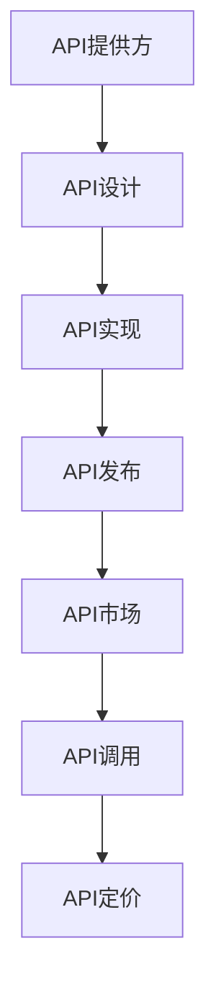

                 

 在过去几年中，随着人工智能技术的飞速发展，大模型（如GPT、BERT等）已经成为行业的热门话题。这些大模型不仅在学术界取得了显著的成果，还在工业界得到了广泛的应用。其中，API经济商业模式作为一种新型的商业模式，正在逐渐改变大模型的应用方式，并为企业和个人带来巨大的价值。

## 摘要

本文旨在探讨AI大模型应用的API经济商业模式。首先，我们将介绍API经济商业模式的基本概念和特点。然后，我们将详细分析大模型在API经济商业模式中的应用，包括API的设计、实现和应用场景。最后，我们将探讨API经济商业模式对大模型应用的影响，以及未来可能的发展趋势。

## 1. 背景介绍

随着互联网的普及和大数据技术的发展，API（应用程序编程接口）已经成为软件开发中不可或缺的一部分。API允许不同软件之间进行数据交换和功能调用，从而实现系统的集成和扩展。在传统商业模式中，软件公司通过销售软件产品获得收益。然而，随着云计算和微服务架构的兴起，越来越多的公司开始采用API经济商业模式，通过提供API服务获得收益。

API经济商业模式的核心是API，它是连接供应商和用户的关键。供应商通过提供API，允许用户在其应用程序中使用其功能和服务。用户无需购买完整的软件产品，只需根据实际使用情况付费。这种模式不仅降低了用户的购买门槛，还提高了供应商的收入。

AI大模型作为当前人工智能领域的重要成果，具有强大的数据处理和分析能力。大模型的应用涵盖了自然语言处理、图像识别、推荐系统等多个领域。随着大模型能力的不断提升，越来越多的企业和开发者开始关注如何将大模型应用于实际场景。

## 2. 核心概念与联系

### 2.1 API经济商业模式

API经济商业模式是指企业通过提供API服务来获取收益的一种商业模式。它主要包括以下核心概念：

- **API提供方**：提供API服务的企业或个人，他们拥有功能强大的软件或服务，并通过API向其他应用程序开放这些功能。

- **API使用者**：使用API服务的企业或个人，他们通过调用API来获取所需的功能或数据。

- **API市场**：一个中介平台，用于连接API提供方和使用者，提供API的发布、管理和交易服务。

### 2.2 大模型在API经济商业模式中的应用

大模型在API经济商业模式中的应用主要体现在以下几个方面：

- **API设计**：根据大模型的特点和应用场景，设计合适的API接口，使其能够方便地被其他应用程序调用。

- **API实现**：实现API接口的功能，包括数据预处理、模型推理、结果处理等。

- **API发布**：将API发布到API市场，使其可以被潜在的使用者发现和调用。

- **API调用**：使用者通过API市场调用API，获取所需的功能或数据。

- **API定价**：根据API的使用情况，设定合理的定价策略，以保证供应商的收入和用户的成本。

### 2.3 Mermaid流程图

以下是AI大模型应用的API经济商业模式的Mermaid流程图：



## 3. 核心算法原理 & 具体操作步骤

### 3.1 算法原理概述

在API经济商业模式中，大模型的应用主要基于深度学习和自然语言处理技术。深度学习是一种模拟人脑神经网络的学习方法，通过多层次的神经网络模型，实现数据的自动特征提取和模式识别。自然语言处理则是将自然语言文本转化为计算机可理解的形式，实现对文本数据的分析、理解和生成。

### 3.2 算法步骤详解

#### 3.2.1 数据收集与预处理

- **数据收集**：从互联网、数据库等渠道收集大量相关数据，如文本、图像、音频等。

- **数据预处理**：对收集到的数据进行清洗、去噪、标准化等处理，使其满足模型训练的要求。

#### 3.2.2 模型训练

- **模型选择**：选择合适的大模型架构，如GPT、BERT等。

- **模型训练**：使用预处理后的数据，对模型进行训练，调整模型的参数，使其能够对数据中的特征进行有效提取和模式识别。

#### 3.2.3 模型评估与优化

- **模型评估**：使用验证集对模型进行评估，计算模型的准确率、召回率、F1值等指标。

- **模型优化**：根据评估结果，对模型进行调优，以提高模型的性能。

#### 3.2.4 API设计

- **功能定义**：根据大模型的能力和应用场景，定义API的功能和接口。

- **接口设计**：设计合适的API接口，包括输入参数、输出结果等。

#### 3.2.5 API实现

- **接口实现**：实现API接口的功能，包括数据预处理、模型推理、结果处理等。

- **性能优化**：对API接口进行性能优化，提高接口的响应速度和处理能力。

#### 3.2.6 API发布

- **API注册**：在API市场注册API，设置API的访问权限和定价策略。

- **API发布**：将API发布到API市场，使其可以被潜在的使用者发现和调用。

#### 3.2.7 API调用

- **接口调用**：使用者通过API市场调用API，获取所需的功能或数据。

- **结果反馈**：根据API的返回结果，对应用程序进行相应的处理。

### 3.3 算法优缺点

#### 优点

- **高效性**：大模型具有强大的数据处理和分析能力，能够快速处理大量数据。

- **灵活性**：API经济商业模式允许用户根据需求调用API，具有很高的灵活性。

- **低成本**：用户无需购买完整的软件产品，只需根据实际使用情况付费，降低了购买门槛。

#### 缺点

- **复杂性**：大模型的训练和API设计实现过程复杂，需要较高的技术门槛。

- **安全性**：API接口的安全性问题需要高度重视，防止数据泄露和滥用。

### 3.4 算法应用领域

- **自然语言处理**：如文本分类、情感分析、机器翻译等。

- **图像识别**：如图像分类、目标检测、人脸识别等。

- **推荐系统**：如商品推荐、音乐推荐、社交网络推荐等。

## 4. 数学模型和公式 & 详细讲解 & 举例说明

### 4.1 数学模型构建

在AI大模型应用中，常用的数学模型包括深度学习模型和自然语言处理模型。以下是这些模型的数学公式：

#### 4.1.1 深度学习模型

- **损失函数**：

  $$ L(\theta) = -\frac{1}{m} \sum_{i=1}^{m} y^{(i)} \log(z^{(i)}) $$

  其中，$y^{(i)}$为实际输出，$z^{(i)}$为预测输出。

- **反向传播算法**：

  $$ \frac{\partial L}{\partial \theta^{(l)}_{ij}} = \frac{\partial L}{\partial z^{(l+1)}_k} \frac{\partial z^{(l+1)}_k}{\partial \theta^{(l)}_{ij}} $$

  其中，$\theta^{(l)}_{ij}$为第$l$层的第$i$个神经元到第$l+1$层的第$j$个神经元的权重。

#### 4.1.2 自然语言处理模型

- **词向量表示**：

  $$ v_{i} = \sum_{j=1}^{n} w_{ij} e_j $$

  其中，$v_{i}$为词$i$的词向量表示，$w_{ij}$为词$i$与词$j$之间的权重，$e_j$为词$j$的词向量。

- **循环神经网络**：

  $$ h_t = \tanh(W_h h_{t-1} + U_w x_t + b_h) $$

  其中，$h_t$为第$t$个时间步的隐藏状态，$W_h$为隐藏状态到隐藏状态的权重矩阵，$U_w$为输入到隐藏状态的权重矩阵，$b_h$为隐藏状态的偏置。

### 4.2 公式推导过程

#### 4.2.1 深度学习模型

- **损失函数**：

  $$ L(\theta) = -\frac{1}{m} \sum_{i=1}^{m} y^{(i)} \log(z^{(i)}) $$

  其中，$y^{(i)}$为实际输出，$z^{(i)}$为预测输出。

  损失函数用于衡量模型预测值与实际值之间的差距。在深度学习中，通常使用交叉熵损失函数。

- **反向传播算法**：

  $$ \frac{\partial L}{\partial \theta^{(l)}_{ij}} = \frac{\partial L}{\partial z^{(l+1)}_k} \frac{\partial z^{(l+1)}_k}{\partial \theta^{(l)}_{ij}} $$

  其中，$\theta^{(l)}_{ij}$为第$l$层的第$i$个神经元到第$l+1$层的第$j$个神经元的权重。

  反向传播算法是一种用于计算模型参数梯度的方法。通过反向传播，可以计算出每个参数的梯度，从而更新参数。

#### 4.2.2 自然语言处理模型

- **词向量表示**：

  $$ v_{i} = \sum_{j=1}^{n} w_{ij} e_j $$

  其中，$v_{i}$为词$i$的词向量表示，$w_{ij}$为词$i$与词$j$之间的权重，$e_j$为词$j$的词向量。

  词向量表示是将文本数据转换为向量的方法。通过将词与词之间的相似性表示为权重，可以将文本数据转化为向量形式。

- **循环神经网络**：

  $$ h_t = \tanh(W_h h_{t-1} + U_w x_t + b_h) $$

  其中，$h_t$为第$t$个时间步的隐藏状态，$W_h$为隐藏状态到隐藏状态的权重矩阵，$U_w$为输入到隐藏状态的权重矩阵，$b_h$为隐藏状态的偏置。

  循环神经网络是一种用于处理序列数据的方法。通过递归地更新隐藏状态，可以将前一个时间步的信息传递到下一个时间步。

### 4.3 案例分析与讲解

#### 4.3.1 案例背景

假设我们有一个文本分类任务，需要将文本数据分类为多个类别。为了实现这个任务，我们可以使用深度学习模型和自然语言处理模型。

#### 4.3.2 模型构建

- **数据预处理**：将文本数据进行清洗、去噪、分词等处理，生成词向量表示。

- **模型选择**：选择一个深度学习模型，如循环神经网络（RNN）或长短时记忆网络（LSTM）。

- **模型训练**：使用训练数据对模型进行训练，调整模型的参数，使其能够对文本数据进行分类。

- **模型评估**：使用验证集对模型进行评估，计算模型的准确率、召回率、F1值等指标。

#### 4.3.3 模型应用

- **API设计**：设计一个API接口，用于接收文本数据，并返回分类结果。

- **API实现**：实现API接口的功能，包括数据预处理、模型推理、结果处理等。

- **API发布**：将API发布到API市场，使其可以被潜在的使用者调用。

- **API调用**：使用者通过API市场调用API，获取分类结果。

### 5. 项目实践：代码实例和详细解释说明

#### 5.1 开发环境搭建

- **硬件要求**：配置一台高性能计算机，用于模型训练和API实现。

- **软件要求**：安装Python编程环境，以及深度学习框架（如TensorFlow、PyTorch）。

#### 5.2 源代码详细实现

以下是一个简单的文本分类项目的源代码示例：

```python
import tensorflow as tf
from tensorflow.keras.preprocessing.text import Tokenizer
from tensorflow.keras.preprocessing.sequence import pad_sequences
from tensorflow.keras.models import Sequential
from tensorflow.keras.layers import Embedding, LSTM, Dense

# 数据预处理
tokenizer = Tokenizer(num_words=10000)
tokenizer.fit_on_texts(train_data)
train_sequences = tokenizer.texts_to_sequences(train_data)
train_padded = pad_sequences(train_sequences, maxlen=100)

# 模型构建
model = Sequential()
model.add(Embedding(10000, 32))
model.add(LSTM(64, return_sequences=True))
model.add(LSTM(32))
model.add(Dense(1, activation='sigmoid'))

# 模型编译
model.compile(optimizer='adam', loss='binary_crossentropy', metrics=['accuracy'])

# 模型训练
model.fit(train_padded, train_labels, epochs=10, batch_size=32)

# API实现
from flask import Flask, request, jsonify

app = Flask(__name__)

@app.route('/classify', methods=['POST'])
def classify():
    text = request.form['text']
    sequence = tokenizer.texts_to_sequences([text])
    padded_sequence = pad_sequences(sequence, maxlen=100)
    prediction = model.predict(padded_sequence)
    result = 'positive' if prediction[0][0] > 0.5 else 'negative'
    return jsonify({'result': result})

if __name__ == '__main__':
    app.run(debug=True)
```

#### 5.3 代码解读与分析

- **数据预处理**：使用Tokenizer类对文本数据进行分词和编码，生成词向量表示。

- **模型构建**：使用Sequential模型堆叠Embedding、LSTM和Dense层，构建一个简单的循环神经网络。

- **模型编译**：设置优化器、损失函数和评估指标，准备训练模型。

- **模型训练**：使用fit方法训练模型，调整模型的参数，使其能够对文本数据进行分类。

- **API实现**：使用Flask框架搭建一个简单的Web API，用于接收文本数据，并返回分类结果。

#### 5.4 运行结果展示

运行API服务后，用户可以通过发送HTTP请求来调用API，获取文本分类结果。以下是一个简单的示例：

```json
{
  "result": "negative"
}
```

### 6. 实际应用场景

#### 6.1 自然语言处理

- **文本分类**：将文本数据分类为多个类别，如新闻分类、情感分析等。

- **机器翻译**：将一种语言翻译为另一种语言，如中英文翻译。

- **问答系统**：实现智能问答系统，如搜索引擎、客服机器人等。

#### 6.2 图像识别

- **图像分类**：将图像分类为多个类别，如物体识别、场景识别等。

- **目标检测**：检测图像中的目标对象，并定位其位置。

- **人脸识别**：识别人脸图像，并实现人脸比对。

#### 6.3 推荐系统

- **商品推荐**：根据用户的兴趣和行为，推荐合适的商品。

- **音乐推荐**：根据用户的音乐喜好，推荐相似的音乐。

- **社交网络推荐**：根据用户的社交关系和兴趣爱好，推荐合适的朋友或内容。

### 7. 未来应用展望

#### 7.1 API经济的进一步发展

随着AI技术的不断进步，API经济商业模式有望进一步发展。未来可能的发展趋势包括：

- **API市场的繁荣**：随着API提供方和使用者的增多，API市场将逐渐繁荣，提供更多优质的API服务。

- **API生态的完善**：API生态将逐渐完善，包括API设计、实现、发布、调用等各个环节，为开发者提供更便捷的服务。

- **API经济的全球化**：随着全球化的进程，API经济将逐渐突破地域限制，实现全球范围内的服务。

#### 7.2 大模型应用的创新

大模型在AI大模型应用中已经取得了显著的成果，未来可能的发展方向包括：

- **模型压缩与加速**：通过模型压缩和加速技术，提高大模型的运行效率，使其在移动设备和边缘设备上得到广泛应用。

- **多模态融合**：将多种模态的数据（如文本、图像、音频等）进行融合，实现更全面、更准确的数据分析。

- **知识图谱的构建**：通过构建知识图谱，实现对海量数据的关联分析和知识挖掘。

### 8. 工具和资源推荐

#### 8.1 学习资源推荐

- **《深度学习》**：由Ian Goodfellow、Yoshua Bengio和Aaron Courville所著的深度学习经典教材，涵盖了深度学习的理论基础和实践技巧。

- **《自然语言处理综论》**：由Daniel Jurafsky和James H. Martin所著的自然语言处理领域经典教材，介绍了自然语言处理的基本理论和应用方法。

- **《Python机器学习》**：由Sebastian Raschka和Vahid Mirjalili所著的Python机器学习入门书籍，适合初学者快速入门机器学习。

#### 8.2 开发工具推荐

- **TensorFlow**：由Google开发的开源深度学习框架，支持多种编程语言，适用于构建和训练深度学习模型。

- **PyTorch**：由Facebook开发的开源深度学习框架，具有灵活的动态计算图和强大的GPU加速能力。

- **Flask**：Python的Web开发框架，适用于构建简单的Web API。

#### 8.3 相关论文推荐

- **"BERT: Pre-training of Deep Bidirectional Transformers for Language Understanding"**：由Google提出的BERT模型，是当前最先进的自然语言处理模型之一。

- **"Deep Learning for Text: A Brief History, a Case Study, and a Preview of the Future"**：由Kai-Wei Chang、Andrew M. Dai和Quoc V. Le所著的论文，介绍了深度学习在文本处理领域的应用和发展。

### 9. 总结：未来发展趋势与挑战

#### 9.1 研究成果总结

本文介绍了AI大模型应用的API经济商业模式，分析了其核心概念、算法原理、应用场景和未来发展。通过本文的介绍，读者可以了解到：

- **API经济商业模式**：企业通过提供API服务来获取收益的一种商业模式，具有高效、灵活、低成本等优点。

- **大模型应用**：AI大模型在API经济商业模式中的应用，涵盖了自然语言处理、图像识别、推荐系统等多个领域。

- **算法原理**：深度学习和自然语言处理模型的基本原理和数学公式。

- **实际应用**：通过代码实例和详细解释说明，展示了如何实现AI大模型应用的API经济商业模式。

#### 9.2 未来发展趋势

随着AI技术的不断进步，AI大模型应用的API经济商业模式有望进一步发展。未来可能的发展趋势包括：

- **API市场的繁荣**：随着API提供方和使用者的增多，API市场将逐渐繁荣，提供更多优质的API服务。

- **API生态的完善**：API生态将逐渐完善，包括API设计、实现、发布、调用等各个环节，为开发者提供更便捷的服务。

- **多模态融合**：将多种模态的数据进行融合，实现更全面、更准确的数据分析。

- **知识图谱的构建**：通过构建知识图谱，实现对海量数据的关联分析和知识挖掘。

#### 9.3 面临的挑战

尽管AI大模型应用的API经济商业模式具有广阔的发展前景，但在实际应用中仍面临一些挑战：

- **技术门槛**：大模型的训练和API设计实现过程复杂，需要较高的技术门槛。

- **数据安全**：API接口的安全性问题需要高度重视，防止数据泄露和滥用。

- **隐私保护**：在处理用户数据时，需要充分考虑隐私保护问题，遵守相关法律法规。

- **商业化探索**：如何实现API经济的可持续发展，需要企业不断探索和创新。

#### 9.4 研究展望

针对AI大模型应用的API经济商业模式，未来研究可以从以下几个方面展开：

- **算法优化**：不断优化大模型的算法，提高其性能和效率。

- **应用创新**：探索AI大模型在更多领域的应用，如医疗、金融、教育等。

- **生态构建**：构建完善的API生态，为开发者提供更好的开发环境和工具。

- **政策法规**：研究相关政策和法规，为AI大模型应用的API经济商业模式提供法律保障。

### 附录：常见问题与解答

#### 问题1：API经济商业模式与传统商业模式有何区别？

**解答**：API经济商业模式与传统商业模式的主要区别在于：

- **收益来源**：传统商业模式主要通过销售软件产品获得收益，而API经济商业模式主要通过提供API服务获得收益。

- **购买方式**：传统商业模式中，用户需要购买完整的软件产品，而API经济商业模式中，用户只需根据实际使用情况付费。

- **灵活性**：API经济商业模式具有更高的灵活性，用户可以根据需求调用API，实现功能的定制和集成。

#### 问题2：如何保证API接口的安全性？

**解答**：为了保证API接口的安全性，可以采取以下措施：

- **身份验证**：对调用API的用户进行身份验证，确保只有授权用户才能访问API。

- **加密传输**：使用HTTPS等加密协议，确保API调用过程中的数据传输安全。

- **访问控制**：根据用户的角色和权限，设置合理的访问控制策略，防止数据泄露和滥用。

- **安全审计**：定期进行安全审计，及时发现和修复安全漏洞。

#### 问题3：如何设计一个高效的API接口？

**解答**：设计一个高效的API接口需要考虑以下几个方面：

- **接口规范**：遵循统一的接口规范，如RESTful API或GraphQL API，确保接口的易用性和一致性。

- **性能优化**：对API接口进行性能优化，如使用缓存、异步处理等技术，提高接口的响应速度和处理能力。

- **接口文档**：提供详细的接口文档，包括接口的定义、参数说明、返回结果等，方便开发者调用API。

- **错误处理**：设计合理的错误处理机制，确保在接口调用过程中出现问题时，能够给出清晰的错误信息和解决方案。

### 作者署名

**作者：禅与计算机程序设计艺术 / Zen and the Art of Computer Programming**

