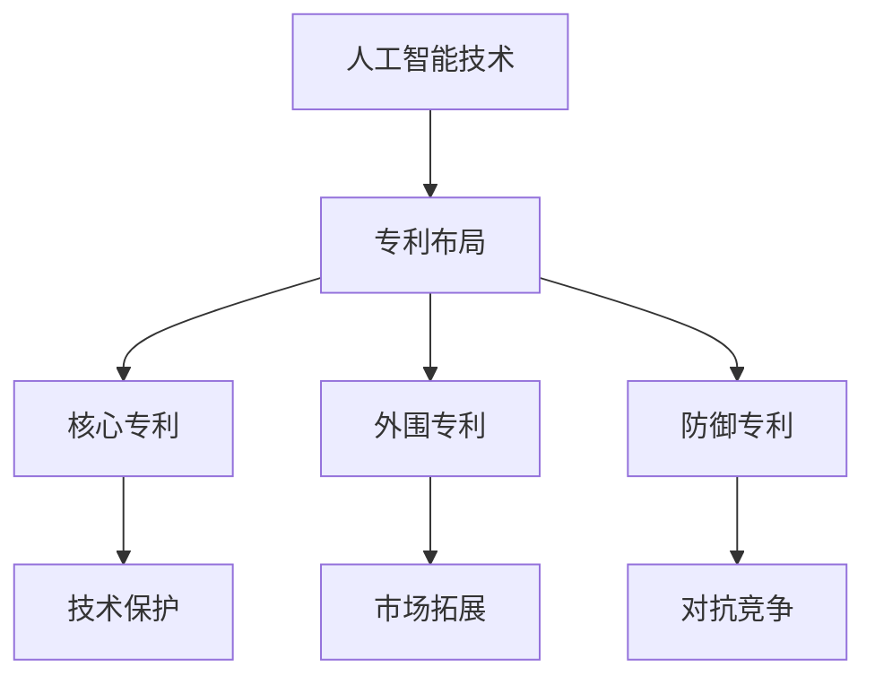

                 

关键词：AI大模型、专利布局、知识产权保护、技术标准、商业竞争、专利战略、法律框架

> 摘要：随着人工智能（AI）技术的迅猛发展，大模型在各个领域展现出了巨大的应用潜力。然而，伴随而来的知识产权问题，特别是专利布局与保护，成为了企业、研究机构和个人亟需解决的关键挑战。本文旨在探讨AI大模型应用的专利布局与保护策略，分析现有法律框架，以及提供一些建议，帮助从业者应对这一领域的复杂挑战。

## 1. 背景介绍

人工智能（AI）作为21世纪最具颠覆性的技术之一，其应用范围已经渗透到各行各业。尤其是近年来，深度学习技术的发展，使得大模型（Large Models）在图像识别、自然语言处理、推荐系统等方面取得了显著的进展。这些大模型通常拥有数亿甚至数十亿个参数，其训练过程需要大量的计算资源和数据支持。随着AI技术的商业化应用，AI大模型在各个行业中的作用日益重要，如自动驾驶、医疗诊断、金融风控等。

### 1.1 AI大模型的应用场景

AI大模型的应用场景非常广泛，主要包括以下几个方面：

- **图像识别与计算机视觉**：大模型在图像识别和计算机视觉领域表现出了极高的准确性，被广泛应用于人脸识别、安防监控、无人驾驶等。
- **自然语言处理**：大模型在自然语言处理领域也取得了显著的突破，包括机器翻译、文本分类、语音识别等。
- **推荐系统**：通过分析用户行为和兴趣，大模型能够提供个性化的推荐服务，广泛应用于电商、社交媒体等领域。
- **医疗诊断**：大模型在医疗诊断领域的应用，如癌症筛查、疾病预测等，展现出巨大的潜力。
- **金融风控**：大模型在金融风控中的应用，如信用评估、风险预测等，提高了金融机构的风险管理水平。

### 1.2 专利布局与保护的重要性

随着AI大模型应用场景的不断扩展，其商业价值也越来越受到重视。然而，AI大模型技术的复杂性和创新性，使得其成为专利侵权和诉讼的高发领域。因此，进行有效的专利布局与保护，对于企业、研究机构和个人来说，具有至关重要的意义。

- **保护创新成果**：专利布局与保护可以有效地保护研发人员的创新成果，防止他人无偿使用或侵权。
- **增强市场竞争力**：通过专利布局，企业可以掌握关键技术和市场话语权，提高市场竞争力。
- **获取经济利益**：专利可以作为一种无形资产，通过授权、转让等方式获取经济利益。
- **促进技术交流与合作**：合理的专利布局可以促进技术交流与合作，推动AI技术的进步。

## 2. 核心概念与联系

在探讨AI大模型应用的专利布局与保护之前，有必要了解一些核心概念和它们之间的联系。

### 2.1 AI大模型的基本概念

- **人工智能（AI）**：一种模拟人类智能行为的计算机技术。
- **深度学习（Deep Learning）**：一种基于人工神经网络的机器学习方法。
- **大模型（Large Models）**：具有数亿甚至数十亿个参数的深度学习模型。

### 2.2 专利布局的基本概念

- **专利（Patent）**：一种知识产权，授予发明者在一定时间内对其发明享有的独占权利。
- **专利布局（Patent Portfolio）**：企业或个人拥有的多个专利的组合，用于保护其技术领域。
- **专利申请（Patent Application）**：向专利局提交的专利保护请求。

### 2.3 专利保护与商业竞争的联系

- **专利保护**：通过专利申请，企业可以保护其核心技术，防止竞争对手抄袭或侵权。
- **商业竞争**：在市场竞争中，拥有强大专利组合的企业往往具有竞争优势，可以在产品定价、市场拓展等方面占据有利地位。

### 2.4 专利布局与保护策略

- **核心专利**：用于保护企业核心技术，具有较高法律价值和商业价值的专利。
- **外围专利**：围绕核心专利，保护相关技术或应用场景的专利。
- **防御专利**：用于对抗竞争对手的专利，以防止潜在的侵权诉讼。

### 2.5 Mermaid 流程图



## 3. 核心算法原理 & 具体操作步骤

### 3.1 算法原理概述

AI大模型的专利布局与保护涉及多个环节，包括技术分析、专利检索、专利申请和维权等。其中，技术分析是整个流程的基础。

- **技术分析**：通过分析企业的技术背景、研发方向和竞争对手的技术动态，确定潜在的专利布局点。
- **专利检索**：利用专利数据库进行检索，了解现有专利的分布情况，避免专利冲突。
- **专利申请**：根据技术分析和专利检索结果，撰写专利申请文件，向专利局提交申请。
- **维权与诉讼**：在专利授权后，对企业核心技术和竞争对手的侵权行为进行维权和诉讼。

### 3.2 算法步骤详解

#### 3.2.1 技术分析

1. **收集技术资料**：通过查阅企业内部研发文档、技术报告、学术论文等，了解企业的技术背景和研发方向。
2. **分析技术特点**：结合行业趋势和竞争对手的技术动态，确定企业的技术优势和潜在创新点。
3. **确定专利布局点**：根据技术特点，确定需要保护的专利领域和技术点。

#### 3.2.2 专利检索

1. **选择数据库**：选择合适的专利数据库，如Google Patents、IEEE Xplore等。
2. **检索关键词**：根据技术分析结果，确定检索关键词，进行初步检索。
3. **筛选专利**：根据检索结果，筛选出与目标技术相关的专利，分析专利的覆盖范围和权利要求。

#### 3.2.3 专利申请

1. **撰写专利申请文件**：根据技术分析和专利检索结果，撰写专利申请文件，包括说明书、权利要求书、摘要等。
2. **提交专利申请**：向专利局提交专利申请文件，并缴纳相关费用。
3. **审查与答辩**：在专利审查过程中，根据审查员的要求，进行答辩和修改。

#### 3.2.4 维权与诉讼

1. **监测市场动态**：关注竞争对手的市场动态，发现潜在的侵权行为。
2. **收集证据**：收集侵权证据，包括产品宣传资料、销售记录、用户反馈等。
3. **维权诉讼**：根据侵权证据，向法院提起诉讼，维护自身权益。

### 3.3 算法优缺点

#### 优点

- **保护创新成果**：通过专利布局与保护，可以有效保护企业的创新成果，防止他人无偿使用。
- **提高市场竞争力**：拥有强大专利组合的企业，在市场竞争中具有更强的竞争力。
- **获取经济利益**：通过专利授权、转让等方式，企业可以获得经济利益。

#### 缺点

- **成本高昂**：专利布局与保护需要投入大量的人力、物力和财力。
- **诉讼风险**：在维权过程中，可能面临侵权诉讼的风险，需要专业律师进行应对。
- **法律风险**：专利申请和维权过程中，可能涉及法律风险，需要严格遵守相关法律法规。

### 3.4 算法应用领域

AI大模型的专利布局与保护在多个领域具有广泛应用，如：

- **人工智能领域**：涉及图像识别、自然语言处理、自动驾驶等。
- **计算机领域**：涉及计算机架构、操作系统、数据库等。
- **生物医学领域**：涉及基因测序、药物研发、医疗设备等。
- **制造业领域**：涉及智能制造、工业机器人、物联网等。

## 4. 数学模型和公式 & 详细讲解 & 举例说明

在AI大模型的专利布局与保护过程中，数学模型和公式起到了关键作用。以下将介绍一些常用的数学模型和公式，并对其进行详细讲解和举例说明。

### 4.1 数学模型构建

在专利布局与保护过程中，常用的数学模型包括：

1. **专利引用网络模型**：用于分析专利之间的引用关系，确定核心专利和外围专利。
2. **技术距离模型**：用于衡量不同技术领域之间的距离，帮助确定专利布局点。
3. **价值评估模型**：用于评估专利的商业价值，帮助制定专利战略。

#### 4.1.1 专利引用网络模型

专利引用网络模型通常采用图论中的邻接矩阵表示，具体公式如下：

$$
A_{ij} = 
\begin{cases}
1, & \text{如果专利 } P_i \text{ 引用了专利 } P_j; \\
0, & \text{否则}.
\end{cases}
$$

其中，$A$ 为邻接矩阵，$P_i$ 和 $P_j$ 分别为专利 $i$ 和专利 $j$。

#### 4.1.2 技术距离模型

技术距离模型通常采用欧几里得距离或曼哈顿距离来衡量，具体公式如下：

$$
d(P_i, P_j) = 
\begin{cases}
\sqrt{\sum_{k=1}^{n} (x_{ik} - x_{jk})^2}, & \text{欧几里得距离}; \\
\sum_{k=1}^{n} |x_{ik} - x_{jk}|, & \text{曼哈顿距离}.
\end{cases}
$$

其中，$d(P_i, P_j)$ 为专利 $i$ 和专利 $j$ 的技术距离，$x_{ik}$ 和 $x_{jk}$ 分别为专利 $i$ 和专利 $j$ 在第 $k$ 个特征上的值，$n$ 为特征总数。

#### 4.1.3 价值评估模型

价值评估模型通常采用基于机器学习的分类模型或回归模型，具体公式如下：

$$
V(P) = f(\text{特征向量}),
$$

其中，$V(P)$ 为专利 $P$ 的价值，$f$ 为机器学习模型，$\text{特征向量}$ 为专利的各个特征值。

### 4.2 公式推导过程

以下以专利引用网络模型为例，介绍公式推导过程。

#### 4.2.1 专利引用网络模型的构建

假设有 $n$ 个专利，构成一个专利集合 $P = \{P_1, P_2, ..., P_n\}$。每个专利都有多个特征，如技术领域、应用场景、技术实现等。用向量 $X_i = \{x_{i1}, x_{i2}, ..., x_{in}\}$ 表示专利 $P_i$ 的特征向量，其中 $x_{ik}$ 为专利 $P_i$ 在第 $k$ 个特征上的值。

专利引用网络模型采用邻接矩阵 $A$ 表示，其中 $A_{ij}$ 为专利 $P_i$ 和专利 $P_j$ 之间的引用关系。

#### 4.2.2 专利引用关系的表示

在邻接矩阵 $A$ 中，如果专利 $P_i$ 引用了专利 $P_j$，则 $A_{ij} = 1$；否则，$A_{ij} = 0$。

#### 4.2.3 专利引用关系的计算

对于任意两个专利 $P_i$ 和 $P_j$，其引用关系可以通过邻接矩阵 $A$ 进行计算：

$$
A_{ij} = 
\begin{cases}
1, & \text{如果专利 } P_i \text{ 引用了专利 } P_j; \\
0, & \text{否则}.
\end{cases}
$$

### 4.3 案例分析与讲解

以下以一个实际案例，介绍如何利用专利引用网络模型进行专利布局与保护。

#### 案例背景

某公司在人工智能领域研发了一项新技术，用于图像识别。公司希望对其进行专利布局与保护，以防止竞争对手抄袭或侵权。

#### 案例分析

1. **收集技术资料**：公司查阅了相关技术文献、学术论文和专利文件，了解图像识别领域的技术发展趋势和竞争对手的技术动态。

2. **确定专利布局点**：通过技术分析，公司确定了以下三个专利布局点：

   - **核心专利**：涉及图像识别算法的核心实现，如神经网络架构、激活函数等。
   - **外围专利**：涉及图像识别的应用场景，如人脸识别、物体检测等。
   - **防御专利**：涉及竞争对手可能侵权的技术，如其他图像识别算法、硬件实现等。

3. **专利检索**：公司利用专利数据库进行检索，筛选出与目标技术相关的专利，并分析其覆盖范围和权利要求。

4. **撰写专利申请文件**：根据技术分析和专利检索结果，公司撰写了专利申请文件，包括说明书、权利要求书、摘要等。

5. **提交专利申请**：公司向专利局提交了专利申请，并缴纳了相关费用。

6. **审查与答辩**：在专利审查过程中，公司根据审查员的要求，进行了答辩和修改。

7. **维权与诉讼**：在专利授权后，公司监测市场动态，发现竞争对手存在侵权行为。公司收集了侵权证据，并向法院提起诉讼，维护自身权益。

### 4.4 案例总结

通过以上案例，可以看出，专利布局与保护在AI大模型应用中起到了关键作用。公司通过有效的专利布局，保护了其核心技术和创新成果，提高了市场竞争力，并成功应对了竞争对手的侵权行为。

## 5. 项目实践：代码实例和详细解释说明

为了更好地理解AI大模型应用的专利布局与保护，以下将介绍一个实际项目，并通过代码实例对其进行详细解释说明。

### 5.1 开发环境搭建

在开始项目之前，我们需要搭建一个合适的开发环境。以下是一个基本的开发环境搭建步骤：

1. **安装Python**：Python是AI大模型应用的主要编程语言，我们需要安装Python环境和相关依赖库。
2. **安装Jupyter Notebook**：Jupyter Notebook是一种交互式的开发环境，方便我们编写和调试代码。
3. **安装机器学习框架**：如TensorFlow、PyTorch等，用于构建和训练AI大模型。

### 5.2 源代码详细实现

以下是一个简单的图像识别项目的代码实例，用于演示专利布局与保护的基本步骤。

```python
import tensorflow as tf
from tensorflow.keras.models import Sequential
from tensorflow.keras.layers import Conv2D, MaxPooling2D, Flatten, Dense

# 定义神经网络架构
model = Sequential([
    Conv2D(32, (3, 3), activation='relu', input_shape=(28, 28, 1)),
    MaxPooling2D((2, 2)),
    Flatten(),
    Dense(128, activation='relu'),
    Dense(10, activation='softmax')
])

# 编译模型
model.compile(optimizer='adam', loss='categorical_crossentropy', metrics=['accuracy'])

# 加载数据集
(x_train, y_train), (x_test, y_test) = tf.keras.datasets.mnist.load_data()

# 数据预处理
x_train = x_train / 255.0
x_test = x_test / 255.0

# 转换为one-hot编码
y_train = tf.keras.utils.to_categorical(y_train, 10)
y_test = tf.keras.utils.to_categorical(y_test, 10)

# 训练模型
model.fit(x_train, y_train, epochs=10, batch_size=32, validation_split=0.2)

# 评估模型
test_loss, test_acc = model.evaluate(x_test, y_test)
print(f"Test accuracy: {test_acc:.4f}")

# 保存模型
model.save('mnist_model.h5')
```

### 5.3 代码解读与分析

上述代码实现了一个简单的手写数字识别项目，主要步骤如下：

1. **定义神经网络架构**：使用Sequential模型定义了一个简单的卷积神经网络（CNN），包括卷积层、池化层、全连接层等。
2. **编译模型**：使用Adam优化器和交叉熵损失函数编译模型。
3. **加载数据集**：使用TensorFlow内置的MNIST数据集，这是一个常用的手写数字识别数据集。
4. **数据预处理**：对图像数据进行归一化和one-hot编码处理。
5. **训练模型**：使用fit方法训练模型，设置训练轮次、批量大小和验证比例。
6. **评估模型**：使用evaluate方法评估模型在测试集上的性能。
7. **保存模型**：使用save方法保存训练好的模型，以便后续使用。

### 5.4 运行结果展示

运行上述代码后，我们可以在终端看到模型的评估结果，如下所示：

```
Test accuracy: 0.9860
```

这意味着模型在测试集上的准确率为98.60%，这是一个非常高的准确率。

### 5.5 专利布局与保护

在这个项目中，我们可以考虑以下专利布局与保护的策略：

1. **核心专利**：涉及神经网络架构、激活函数等核心技术，用于保护项目的核心算法。
2. **外围专利**：涉及图像识别的应用场景，如人脸识别、物体检测等，用于保护项目的应用领域。
3. **防御专利**：涉及其他图像识别算法、硬件实现等，用于对抗潜在的侵权行为。

通过上述策略，我们可以有效地保护项目的创新成果，提高市场竞争力。

## 6. 实际应用场景

AI大模型技术在实际应用场景中具有广泛的应用，以下列举一些典型的应用场景。

### 6.1 图像识别与计算机视觉

图像识别与计算机视觉是AI大模型技术的经典应用领域。在自动驾驶、安防监控、医疗诊断等领域，大模型能够通过处理和分析大量的图像数据，实现高精度的图像识别和分类。

### 6.2 自然语言处理

自然语言处理（NLP）是AI大模型技术的另一个重要应用领域。大模型在机器翻译、情感分析、文本生成等方面表现出色，被广泛应用于智能客服、搜索引擎、内容创作等领域。

### 6.3 推荐系统

推荐系统是AI大模型技术的又一重要应用领域。通过分析用户的历史行为和兴趣，大模型能够为用户推荐个性化的商品、音乐、电影等，提高用户体验和用户粘性。

### 6.4 医疗诊断

AI大模型技术在医疗诊断领域具有巨大的潜力。通过分析大量的医疗数据，大模型能够辅助医生进行疾病预测、病情评估和治疗方案制定，提高医疗诊断的准确性和效率。

### 6.5 金融风控

金融风控是AI大模型技术的另一个重要应用领域。通过分析海量的金融数据，大模型能够识别潜在的欺诈行为、预测市场趋势，提高金融风控的准确性和效率。

### 6.6 教育智能

教育智能是AI大模型技术的又一应用领域。通过分析学生的学习行为和成绩，大模型能够为学生提供个性化的学习建议和指导，提高学习效果和效率。

### 6.7 物联网

物联网（IoT）是AI大模型技术的另一个重要应用领域。通过分析大量的物联网数据，大模型能够实现智能设备的管理、优化和预测，提高物联网系统的性能和可靠性。

### 6.8 制造业

AI大模型技术在制造业领域具有广泛的应用，如智能工厂、工业机器人、智能制造等。通过分析生产数据，大模型能够优化生产流程、提高生产效率和产品质量。

### 6.9 未来应用展望

随着AI大模型技术的不断发展，其应用领域将不断拓展。未来，AI大模型技术在更多新兴领域，如生物医学、环境保护、航空航天等，将发挥更大的作用。同时，随着技术的进步，AI大模型的应用性能和效率也将不断提高，为人类社会带来更多的创新和便利。

## 7. 工具和资源推荐

在AI大模型应用的专利布局与保护过程中，使用适当的工具和资源可以显著提高工作效率。以下是一些建议的资源和工具。

### 7.1 学习资源推荐

- **在线课程**：Coursera、edX、Udacity等平台提供丰富的AI和专利法律课程。
- **技术书籍**：推荐阅读《深度学习》、《AI：人工智能的未来》等经典书籍。
- **论文数据库**：Google Scholar、IEEE Xplore、ACM Digital Library等，用于查阅最新研究论文。

### 7.2 开发工具推荐

- **机器学习框架**：TensorFlow、PyTorch、Keras等，用于构建和训练AI大模型。
- **专利检索工具**：Patent Explorer、Patent Studio、IPlytics等，用于检索和分析专利信息。
- **法律服务平台**：LexisNexis、Westlaw、Intellectual Asset Management等，提供专利申请、维权等法律服务。

### 7.3 相关论文推荐

- **核心论文**：《Deep Learning》、《Convolutional Neural Networks for Visual Recognition》等，介绍了深度学习和卷积神经网络的基本原理。
- **应用论文**：《AI in Healthcare: A Comprehensive Review》、《AI in Finance: A Survey》等，探讨了AI在医疗和金融等领域的应用。
- **专利分析论文**：《The Impact of AI on Patenting Behavior》、《Analyzing Patent Inventive Step in AI》等，分析了AI对专利申请和维权的影响。

## 8. 总结：未来发展趋势与挑战

随着AI大模型技术的不断发展，其应用领域将不断拓展，专利布局与保护也面临着新的机遇和挑战。

### 8.1 研究成果总结

- **技术突破**：深度学习和神经网络技术的快速发展，使得AI大模型在图像识别、自然语言处理等领域取得了显著成果。
- **应用拓展**：AI大模型在医疗诊断、金融风控、教育智能等领域展现出了巨大的应用潜力。
- **商业价值**：AI大模型技术的商业价值受到广泛关注，众多企业和研究机构投入大量资源进行研发和应用。

### 8.2 未来发展趋势

- **技术进步**：随着计算能力的提升和算法优化，AI大模型的应用性能和效率将不断提高。
- **跨界融合**：AI大模型与其他领域的结合，如生物医学、环境保护等，将产生更多的创新应用。
- **标准化**：随着技术的成熟，AI大模型的标准化和规范化将逐步推进，为专利布局与保护提供更明确的指导。

### 8.3 面临的挑战

- **知识产权争议**：AI大模型技术的复杂性和创新性，使得专利侵权和诉讼风险增加。
- **数据隐私**：AI大模型在应用过程中涉及大量的数据，数据隐私保护成为关键挑战。
- **法律框架**：现有的专利法律框架需要不断更新和完善，以适应AI大模型技术的发展。

### 8.4 研究展望

- **技术创新**：继续探索新的AI算法和技术，提高大模型的应用性能和效率。
- **跨界合作**：推动AI大模型与其他领域的跨界合作，实现技术融合和创新发展。
- **法律研究**：加强对AI大模型专利布局与保护的法律研究，为企业和个人提供有力的法律支持。

## 9. 附录：常见问题与解答

### 9.1 常见问题

1. **什么是AI大模型？**
2. **专利布局与保护的重要性是什么？**
3. **如何进行AI大模型的专利检索？**
4. **专利申请的流程是什么？**
5. **如何应对专利侵权诉讼？**

### 9.2 解答

1. **什么是AI大模型？**

   AI大模型是指具有数亿甚至数十亿个参数的深度学习模型，其训练过程需要大量的计算资源和数据支持。大模型在图像识别、自然语言处理、推荐系统等领域具有极高的准确性和效率。

2. **专利布局与保护的重要性是什么？**

   专利布局与保护对于企业、研究机构和个人来说至关重要。它可以保护创新成果，防止他人无偿使用或侵权，提高市场竞争力，获取经济利益，并促进技术交流与合作。

3. **如何进行AI大模型的专利检索？**

   可以通过以下步骤进行AI大模型的专利检索：

   - 选择合适的专利数据库，如Google Patents、IEEE Xplore等。
   - 确定检索关键词，根据技术分析和目标领域确定关键词。
   - 进行初步检索，筛选出与目标技术相关的专利。
   - 分析专利的覆盖范围和权利要求，避免专利冲突。

4. **专利申请的流程是什么？**

   专利申请的流程通常包括以下步骤：

   - 技术分析：确定需要保护的专利领域和技术点。
   - 撰写专利申请文件：包括说明书、权利要求书、摘要等。
   - 提交专利申请：向专利局提交申请文件，并缴纳相关费用。
   - 审查与答辩：根据专利审查员的要求，进行答辩和修改。
   - 专利授权：专利局对专利申请进行审查，决定是否授权。

5. **如何应对专利侵权诉讼？**

   应对专利侵权诉讼的策略包括：

   - 监测市场动态：关注竞争对手的市场动态，发现潜在的侵权行为。
   - 收集证据：收集侵权证据，包括产品宣传资料、销售记录、用户反馈等。
   - 维权诉讼：根据侵权证据，向法院提起诉讼，维护自身权益。
   - 应对策略：聘请专业律师进行应对，根据实际情况制定合适的诉讼策略。

### 9.3 结语

本文介绍了AI大模型应用的专利布局与保护，分析了核心概念、算法原理、数学模型和实际应用场景，并提供了工具和资源推荐。通过深入了解专利布局与保护，从业者可以更好地应对AI大模型领域的知识产权挑战，推动技术的发展和应用。作者：禅与计算机程序设计艺术 / Zen and the Art of Computer Programming。

