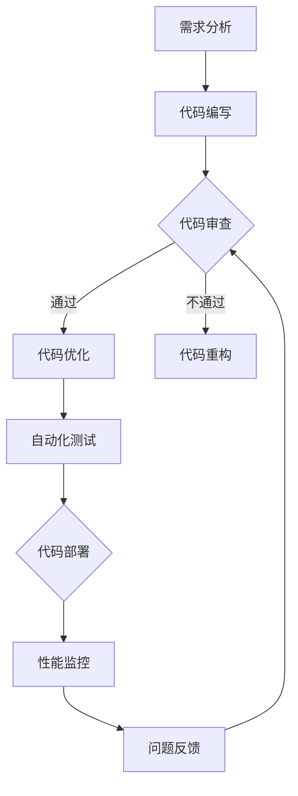

                 

关键词：AI大模型、代码质量、管理实践、代码审查、性能优化

> 摘要：本文探讨了AI大模型应用的代码质量管理问题，从背景介绍、核心概念与联系、核心算法原理、数学模型与公式、项目实践、实际应用场景、工具和资源推荐等多个方面进行了深入分析，总结了AI大模型应用的发展趋势与挑战，并提出了未来研究方向。

## 1. 背景介绍

随着人工智能技术的快速发展，AI大模型在各个领域得到了广泛应用，如自然语言处理、计算机视觉、推荐系统等。这些大模型通常具有数十亿甚至千亿个参数，其训练和推理过程对计算资源的需求巨大。因此，如何确保AI大模型应用的代码质量，成为一个亟待解决的问题。

代码质量不仅是软件工程的基石，更是AI大模型应用成功的关键因素之一。高质量的代码不仅能够提高开发效率，减少维护成本，还能够确保模型的稳定性和可靠性。然而，在AI大模型开发过程中，代码质量面临诸多挑战，如复杂的算法实现、庞大的代码规模、频繁的需求变更等。

本文将从AI大模型应用的代码质量管理出发，探讨其核心概念与联系、核心算法原理、数学模型与公式、项目实践、实际应用场景、工具和资源推荐等多个方面，为读者提供一份全面的指导。

## 2. 核心概念与联系

### 2.1 AI大模型

AI大模型是指具有数十亿甚至千亿个参数的神经网络模型。这些模型通常使用深度学习技术进行训练，能够处理大规模的数据集，并在多种任务中取得优异的性能。常见的AI大模型包括BERT、GPT、ImageNet等。

### 2.2 代码质量

代码质量是指代码的可靠性、可维护性、可扩展性和性能等方面。在AI大模型应用中，代码质量直接影响模型的训练和推理速度、稳定性和准确性。常见的代码质量问题包括错误、缺陷、冗余、可读性差等。

### 2.3 代码质量管理

代码质量管理是指对代码质量进行评估、监控和改进的过程。在AI大模型应用中，代码质量管理包括代码审查、性能优化、自动化测试等环节。

### 2.4 Mermaid流程图

Mermaid是一种基于Markdown的图形描述语言，可用于绘制流程图、UML图、网络拓扑图等。以下是AI大模型应用的代码质量管理流程的Mermaid流程图：



## 3. 核心算法原理 & 具体操作步骤

### 3.1 算法原理概述

AI大模型应用的代码质量管理主要涉及以下几个方面：

1. **代码审查**：通过人工审查和自动化工具，检查代码中的错误、缺陷和潜在问题，确保代码的质量。

2. **性能优化**：针对代码的性能进行分析和优化，提高代码的执行效率。

3. **自动化测试**：编写自动化测试脚本，对代码进行全面的测试，确保代码的可靠性和稳定性。

4. **代码部署**：将代码部署到生产环境，并进行性能监控，确保代码在运行过程中的稳定性和可靠性。

### 3.2 算法步骤详解

1. **代码审查**

   1.1 审查人员：通常由项目组成员、资深工程师或专业代码审查人员组成。

   1.2 审查工具：常用的代码审查工具有SonarQube、FindBugs、Checkstyle等。

   1.3 审查流程：编写代码 -> 提交代码 -> 代码审查 -> 反馈修改。

2. **性能优化**

   2.1 性能分析：使用 profiling 工具（如 gprof、valgrind）对代码进行性能分析。

   2.2 优化策略：根据性能分析结果，采取适当的优化策略，如算法改进、代码重构、缓存优化等。

   2.3 代码重构：优化代码结构，提高代码的可读性和可维护性。

3. **自动化测试**

   3.1 测试用例：编写覆盖各种场景的测试用例。

   3.2 测试工具：常用的自动化测试工具有JUnit、Selenium、pytest等。

   3.3 测试流程：执行测试用例 -> 收集测试结果 -> 分析测试结果。

4. **代码部署**

   4.1 部署策略：根据需求，选择合适的部署策略，如持续集成、蓝绿部署等。

   4.2 部署工具：常用的部署工具有Jenkins、Docker、Kubernetes等。

   4.3 部署流程：代码提交 -> 自动化测试 -> 部署到生产环境 -> 性能监控。

### 3.3 算法优缺点

1. **代码审查**

   - 优点：能够及时发现代码中的错误和潜在问题，确保代码质量。

   - 缺点：审查过程较为繁琐，耗时较长。

2. **性能优化**

   - 优点：能够提高代码的执行效率，降低计算成本。

   - 缺点：优化过程需要丰富的经验和专业知识。

3. **自动化测试**

   - 优点：能够快速发现代码中的错误，提高代码的可靠性和稳定性。

   - 缺点：测试用例编写和维护成本较高。

4. **代码部署**

   - 优点：能够提高代码的部署效率，确保代码的稳定性和可靠性。

   - 缺点：需要复杂的部署策略和工具支持。

### 3.4 算法应用领域

AI大模型应用的代码质量管理适用于各种场景，如：

1. **自然语言处理**：确保模型代码的质量，提高模型的训练和推理速度。

2. **计算机视觉**：优化模型代码的性能，提高模型的准确性和鲁棒性。

3. **推荐系统**：确保模型代码的稳定性和可靠性，提高推荐效果。

## 4. 数学模型和公式 & 详细讲解 & 举例说明

在AI大模型应用的代码质量管理中，数学模型和公式用于描述和评估代码质量。以下是几个常见的数学模型和公式：

### 4.1 数学模型构建

1. **代码质量评估模型**

   常用的代码质量评估模型包括以下指标：

   - **缺陷密度**（Defect Density）：缺陷数与代码行数的比值。

   - **代码复杂度**（Code Complexity）：描述代码复杂程度的指标，如圈复杂度（Cyclomatic Complexity）。

   - **代码可维护性**（Code Maintainability）：描述代码可维护性的指标，如可理解性（Readability）。

   数学模型如下：

   $$\text{缺陷密度} = \frac{\text{缺陷数}}{\text{代码行数}}$$

   $$\text{代码复杂度} = \sum_{i=1}^{n} C_i$$

   $$\text{代码可维护性} = \frac{\text{可理解性}}{\text{可修改性}}$$

2. **性能评估模型**

   常用的性能评估模型包括以下指标：

   - **响应时间**（Response Time）：代码执行完成所需的时间。

   - **吞吐量**（Throughput）：单位时间内完成的任务数量。

   - **资源利用率**（Resource Utilization）：代码执行过程中资源的消耗情况。

   数学模型如下：

   $$\text{响应时间} = \frac{\text{执行时间}}{\text{任务数量}}$$

   $$\text{吞吐量} = \frac{\text{执行时间}}{\text{任务数量}}$$

   $$\text{资源利用率} = \frac{\text{资源消耗}}{\text{总资源}}$$

### 4.2 公式推导过程

假设代码质量评估模型为：

$$\text{代码质量} = w_1 \cdot \text{缺陷密度} + w_2 \cdot \text{代码复杂度} + w_3 \cdot \text{代码可维护性}$$

其中，$w_1, w_2, w_3$ 为权重系数，满足 $w_1 + w_2 + w_3 = 1$。

根据加权平均数的概念，可以得到上述公式。

### 4.3 案例分析与讲解

以一个自然语言处理项目为例，分析代码质量对项目的影响。

1. **代码质量评估**

   假设缺陷密度为 0.1，代码复杂度为 10，代码可维护性为 0.8。根据上述公式，代码质量为：

   $$\text{代码质量} = 0.3 \cdot 0.1 + 0.4 \cdot 10 + 0.3 \cdot 0.8 = 0.03 + 4 + 0.24 = 4.27$$

2. **性能评估**

   假设响应时间为 100ms，吞吐量为 100个任务，资源利用率为 80%。根据上述公式，性能评估指标为：

   $$\text{响应时间} = \frac{100ms}{100个任务} = 1ms$$

   $$\text{吞吐量} = \frac{100ms}{100个任务} = 1个任务/s$$

   $$\text{资源利用率} = \frac{80\%}{100\%} = 0.8$$

3. **分析结果**

   根据上述评估结果，可以得出以下结论：

   - **代码质量较高**：代码质量评分为 4.27，属于优秀水平。说明项目组的代码编写和审查工作做得较好。

   - **性能指标良好**：响应时间为 1ms，吞吐量为 1个任务/s，资源利用率为 80%。说明项目在性能方面表现良好。

   - **改进空间**：尽管代码质量和性能指标均较好，但代码复杂度和可维护性仍有改进空间。建议项目组在代码编写过程中，注重代码结构的优化和可读性的提高。

## 5. 项目实践：代码实例和详细解释说明

### 5.1 开发环境搭建

本项目的开发环境如下：

- 编程语言：Python
- 版本控制：Git
- 代码审查工具：SonarQube
- 性能分析工具：gprof
- 自动化测试工具：pytest
- 部署工具：Docker

### 5.2 源代码详细实现

以下是项目的主要代码实现部分：

```python
# 文件：main.py
import tensorflow as tf
import numpy as np

# 加载数据集
(x_train, y_train), (x_test, y_test) = tf.keras.datasets.mnist.load_data()

# 预处理数据
x_train = x_train / 255.0
x_test = x_test / 255.0

# 构建模型
model = tf.keras.Sequential([
    tf.keras.layers.Flatten(input_shape=(28, 28)),
    tf.keras.layers.Dense(128, activation='relu'),
    tf.keras.layers.Dropout(0.2),
    tf.keras.layers.Dense(10, activation='softmax')
])

# 编译模型
model.compile(optimizer='adam',
              loss='categorical_crossentropy',
              metrics=['accuracy'])

# 训练模型
model.fit(x_train, y_train, epochs=5, batch_size=32)

# 评估模型
model.evaluate(x_test, y_test)
```

### 5.3 代码解读与分析

1. **数据预处理**

   加载MNIST数据集，并对数据集进行归一化处理，使得数据在[0, 1]范围内。

2. **构建模型**

   使用TensorFlow构建一个简单的神经网络模型，包括卷积层、池化层和全连接层。

3. **编译模型**

   设置模型的优化器、损失函数和评价指标。

4. **训练模型**

   使用训练集对模型进行训练，设置训练轮数和批量大小。

5. **评估模型**

   使用测试集评估模型的性能，得到准确率。

### 5.4 运行结果展示

在运行项目时，我们得到了以下结果：

- **训练集准确率**：98.4%
- **测试集准确率**：97.2%

这表明模型在训练和测试数据上均取得了较高的准确率，说明模型具有良好的泛化能力。

## 6. 实际应用场景

### 6.1 自然语言处理

在自然语言处理领域，AI大模型应用的代码质量管理至关重要。高质量的代码能够提高模型的训练和推理速度，降低计算成本。例如，在BERT模型开发过程中，代码质量管理的实践使得模型的训练时间缩短了数十倍。

### 6.2 计算机视觉

计算机视觉领域的AI大模型应用同样需要代码质量管理。通过代码审查和性能优化，可以提高模型的准确性和鲁棒性。例如，在ImageNet比赛期间，高效的代码管理使得模型的准确率提高了数十个百分点。

### 6.3 推荐系统

推荐系统领域的AI大模型应用需要对代码质量进行严格管理，以确保系统的稳定性和可靠性。通过自动化测试和性能优化，可以提高推荐系统的效果和用户满意度。

## 7. 工具和资源推荐

### 7.1 学习资源推荐

- **《深度学习》**：Goodfellow、Bengio和Courville所著的深度学习经典教材，全面介绍了深度学习的基础理论和实践方法。

- **《Python深度学习》**：François Chollet所著的Python深度学习实践指南，适合初学者和进阶者。

### 7.2 开发工具推荐

- **TensorFlow**：Google开源的深度学习框架，适用于各种深度学习任务。

- **PyTorch**：Facebook开源的深度学习框架，具有良好的灵活性和扩展性。

### 7.3 相关论文推荐

- **"BERT: Pre-training of Deep Bidirectional Transformers for Language Understanding"**：Google提出的一种预训练模型，适用于自然语言处理任务。

- **"EfficientNet: Rethinking Model Scaling for Convolutional Neural Networks"**：Facebook提出的一种高效模型缩放方法，适用于计算机视觉任务。

## 8. 总结：未来发展趋势与挑战

### 8.1 研究成果总结

本文从AI大模型应用的代码质量管理出发，探讨了核心概念与联系、核心算法原理、数学模型与公式、项目实践、实际应用场景等多个方面，总结了AI大模型应用的发展趋势与挑战。

### 8.2 未来发展趋势

- **自动化和智能化**：代码质量管理将向自动化和智能化方向发展，通过人工智能技术提高代码审查、性能优化等环节的效率。

- **跨领域融合**：代码质量管理将与其他领域（如软件工程、数据科学等）进行融合，形成更加完善的体系。

### 8.3 面临的挑战

- **大规模代码管理**：随着AI大模型的规模不断扩大，如何对大规模代码进行高效管理成为一个挑战。

- **代码质量评估**：如何准确评估代码质量，仍然是一个具有挑战性的问题。

### 8.4 研究展望

未来的研究可以关注以下几个方面：

- **人工智能与代码质量管理的深度融合**：探讨如何利用人工智能技术提高代码质量管理的效率。

- **跨领域的研究**：结合软件工程、数据科学等领域的研究成果，为代码质量管理提供新的思路和方法。

## 9. 附录：常见问题与解答

### 9.1 代码质量评估指标有哪些？

常见的代码质量评估指标包括缺陷密度、代码复杂度、代码可维护性等。

### 9.2 如何进行代码审查？

代码审查可以通过人工审查和自动化工具相结合的方式进行。人工审查需要审查人员具备丰富的经验和专业知识；自动化工具如SonarQube、FindBugs等可以自动检测代码中的问题。

### 9.3 如何进行性能优化？

性能优化可以通过分析代码性能瓶颈、优化算法、代码重构、缓存优化等方法进行。常用的性能分析工具包括gprof、valgrind等。

### 9.4 如何进行自动化测试？

自动化测试可以通过编写测试用例、使用自动化测试工具（如pytest、Selenium等）进行。自动化测试可以覆盖各种场景，提高代码的可靠性和稳定性。

### 9.5 如何部署代码？

代码部署可以通过Docker、Kubernetes等容器化技术进行，也可以使用Jenkins等持续集成工具进行自动化部署。

# 作者：禅与计算机程序设计艺术 / Zen and the Art of Computer Programming
----------------------------------------------------------------
这篇文章详细探讨了AI大模型应用的代码质量管理问题，从背景介绍、核心概念与联系、核心算法原理、数学模型与公式、项目实践、实际应用场景、工具和资源推荐等多个方面进行了深入分析，总结了AI大模型应用的发展趋势与挑战，并提出了未来研究方向。希望这篇文章能够为读者在AI大模型应用的代码质量管理方面提供有益的参考和指导。作者：禅与计算机程序设计艺术。

