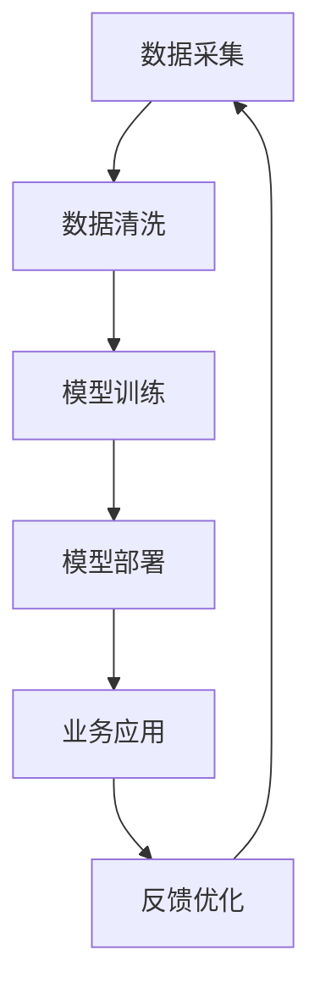

                 

  
> 关键词：AI大模型、商业应用、创新场景、技术探索

> 摘要：本文将深入探讨AI大模型在商业领域的应用，分析其带来的创新商业场景，包括市场趋势、技术应用、商业模式和未来展望。通过具体的案例和数据分析，揭示AI大模型如何推动商业变革。

## 1. 背景介绍

随着人工智能技术的快速发展，特别是深度学习和生成对抗网络（GAN）等先进算法的突破，AI大模型已经成为现代科技领域的重要推动力量。AI大模型具备处理海量数据、生成高质量内容、模拟复杂系统等能力，这些特性使其在商业领域展现出巨大的潜力。

商业应用场景日益丰富，从简单的推荐系统到复杂的决策支持系统，AI大模型都在不断拓展其应用范围。例如，在零售业中，AI大模型可以用于商品推荐、库存管理和客户行为分析；在金融领域，AI大模型可以用于风险管理、欺诈检测和投资策略；在医疗领域，AI大模型可以用于疾病诊断、药物研发和健康监测。

然而，AI大模型的应用并非一帆风顺。其复杂性、计算成本和隐私问题等挑战，都需要通过技术创新和商业模式创新来应对。本文将围绕这些挑战和机遇，探讨AI大模型在商业领域的创新应用场景。

## 2. 核心概念与联系

### 2.1 AI大模型的概念

AI大模型是指使用深度学习技术训练出的具有高参数量和大规模数据输入输出的神经网络模型。这些模型通常包括自然语言处理（NLP）、计算机视觉（CV）和强化学习（RL）等领域，具备处理复杂任务的能力。

### 2.2 商业应用场景

商业应用场景是指AI大模型在商业领域中的应用情况。这些应用场景包括但不限于以下几类：

- **客户关系管理（CRM）**：通过AI大模型分析客户数据，实现个性化推荐、客户细分和忠诚度管理。
- **供应链优化**：利用AI大模型优化库存管理、运输路线和供应链预测。
- **风险管理和欺诈检测**：通过AI大模型识别异常行为、预测风险和检测欺诈。
- **智能客服和虚拟助手**：利用AI大模型实现自然语言理解和智能对话，提升客户服务质量。

### 2.3 AI大模型与商业应用的联系

AI大模型与商业应用之间的联系主要体现在以下几个方面：

- **数据驱动决策**：AI大模型能够处理海量数据，提供实时、准确的决策支持。
- **提升效率**：AI大模型可以自动化许多重复性工作，降低人工成本，提高工作效率。
- **个性化体验**：AI大模型可以分析用户行为，提供个性化的产品推荐和服务。
- **创新商业模式**：AI大模型的应用可以创造新的商业模式，拓展商业边界。

下面是一个Mermaid流程图，展示了AI大模型在商业应用中的基本流程：



## 3. 核心算法原理 & 具体操作步骤

### 3.1 算法原理概述

AI大模型的算法原理主要基于深度学习技术，包括神经网络架构、训练算法和优化策略。其中，神经网络架构决定了模型的参数规模和计算能力，训练算法负责模型参数的调整，优化策略则用于提高模型的性能。

常用的神经网络架构包括卷积神经网络（CNN）、循环神经网络（RNN）和变换器（Transformer）等。训练算法主要包括反向传播（BP）算法和梯度下降（GD）算法。优化策略包括动量优化、自适应优化（如Adam）和权重正则化等。

### 3.2 算法步骤详解

AI大模型的具体操作步骤如下：

#### 3.2.1 数据准备

- **数据采集**：从各种来源获取数据，如网站日志、传感器数据、用户行为数据等。
- **数据清洗**：处理缺失值、异常值和重复数据，确保数据质量。

#### 3.2.2 模型设计

- **选择神经网络架构**：根据任务需求选择合适的神经网络架构。
- **设计损失函数**：选择合适的损失函数，如交叉熵损失、均方误差等。

#### 3.2.3 模型训练

- **初始化参数**：随机初始化模型参数。
- **正向传播**：输入数据通过模型，计算输出结果。
- **计算损失**：计算预测结果与真实结果之间的差异。
- **反向传播**：通过梯度下降算法更新模型参数。

#### 3.2.4 模型评估

- **验证集评估**：使用验证集评估模型性能。
- **测试集评估**：使用测试集评估模型泛化能力。

#### 3.2.5 模型部署

- **模型调优**：根据评估结果调整模型参数。
- **部署到生产环境**：将训练好的模型部署到生产环境，用于实际业务应用。

### 3.3 算法优缺点

#### 优点

- **高精度**：通过大规模数据和深度学习算法，模型可以达到很高的预测精度。
- **泛化能力强**：通过训练大量数据，模型可以适应不同的业务场景。
- **自动化**：可以自动化处理复杂的业务任务，降低人工成本。

#### 缺点

- **计算成本高**：需要大量的计算资源和时间进行训练。
- **数据依赖性强**：模型的性能依赖于数据质量和数量。
- **隐私问题**：涉及用户隐私数据时，需要确保数据安全和隐私保护。

### 3.4 算法应用领域

AI大模型在商业领域的应用非常广泛，包括但不限于以下领域：

- **零售业**：用于商品推荐、库存管理和客户行为分析。
- **金融业**：用于风险管理、欺诈检测和投资策略。
- **医疗领域**：用于疾病诊断、药物研发和健康监测。
- **制造业**：用于供应链优化、生产计划和设备维护。
- **服务业**：用于智能客服、个性化推荐和服务质量提升。

## 4. 数学模型和公式 & 详细讲解 & 举例说明

### 4.1 数学模型构建

AI大模型的数学模型主要基于深度学习算法。以神经网络为例，其数学模型可以表示为：

$$
\begin{aligned}
y &= f(\theta(x)) \\
L &= -\frac{1}{n}\sum_{i=1}^{n}y_i\log(y_i) \\
\theta_{\text{new}} &= \theta_{\text{old}} - \alpha\nabla_\theta L
\end{aligned}
$$

其中，$y$ 为预测结果，$f$ 为激活函数，$\theta$ 为模型参数，$L$ 为损失函数，$\alpha$ 为学习率，$n$ 为样本数量。

### 4.2 公式推导过程

以神经网络的前向传播为例，其推导过程如下：

$$
\begin{aligned}
z_1 &= \theta_1^T x + b_1 \\
a_1 &= f(z_1) \\
z_2 &= \theta_2^T a_1 + b_2 \\
a_2 &= f(z_2) \\
&\vdots \\
z_l &= \theta_l^T a_{l-1} + b_l \\
a_l &= f(z_l)
\end{aligned}
$$

### 4.3 案例分析与讲解

以下是一个简单的AI大模型应用案例：使用神经网络进行手写数字识别。

#### 数据准备

数据集：使用MNIST手写数字数据集，包含0-9共10个数字的图像。

#### 模型设计

- **神经网络架构**：采用卷积神经网络（CNN）。
- **激活函数**：使用ReLU函数。
- **损失函数**：使用交叉熵损失函数。

#### 模型训练

- **初始化参数**：随机初始化权重和偏置。
- **正向传播**：输入图像，通过卷积、池化和全连接层，输出预测结果。
- **计算损失**：计算预测结果与真实标签之间的交叉熵损失。
- **反向传播**：通过梯度下降算法更新模型参数。

#### 模型评估

使用测试集评估模型性能，计算准确率。

## 5. 项目实践：代码实例和详细解释说明

### 5.1 开发环境搭建

- **硬件环境**：配置高性能GPU，如NVIDIA Titan X。
- **软件环境**：安装Python、TensorFlow和Keras等工具。

### 5.2 源代码详细实现

以下是一个简单的手写数字识别模型实现代码：

```python
from tensorflow import keras
from tensorflow.keras import layers

# 创建模型
model = keras.Sequential([
    layers.Conv2D(32, (3, 3), activation='relu', input_shape=(28, 28, 1)),
    layers.MaxPooling2D((2, 2)),
    layers.Conv2D(64, (3, 3), activation='relu'),
    layers.MaxPooling2D((2, 2)),
    layers.Flatten(),
    layers.Dense(128, activation='relu'),
    layers.Dense(10, activation='softmax')
])

# 编译模型
model.compile(optimizer='adam',
              loss='categorical_crossentropy',
              metrics=['accuracy'])

# 加载MNIST数据集
(x_train, y_train), (x_test, y_test) = keras.datasets.mnist.load_data()

# 预处理数据
x_train = x_train.reshape(-1, 28, 28, 1).astype('float32') / 255
x_test = x_test.reshape(-1, 28, 28, 1).astype('float32') / 255
y_train = keras.utils.to_categorical(y_train, 10)
y_test = keras.utils.to_categorical(y_test, 10)

# 训练模型
model.fit(x_train, y_train, epochs=5, batch_size=64, validation_split=0.1)

# 评估模型
test_loss, test_acc = model.evaluate(x_test, y_test)
print(f"Test accuracy: {test_acc:.2f}")
```

### 5.3 代码解读与分析

- **模型创建**：使用`keras.Sequential`创建一个顺序模型，包括卷积层（`Conv2D`）、池化层（`MaxPooling2D`）、全连接层（`Dense`）。
- **编译模型**：使用`compile`方法配置模型优化器（`optimizer`）、损失函数（`loss`）和评估指标（`metrics`）。
- **数据预处理**：将数据集转换为适合模型训练的格式，包括缩放数据和标签编码。
- **模型训练**：使用`fit`方法进行模型训练，设置训练轮数（`epochs`）、批量大小（`batch_size`）和验证集比例（`validation_split`）。
- **模型评估**：使用`evaluate`方法评估模型在测试集上的性能。

## 6. 实际应用场景

### 6.1 零售业

AI大模型在零售业中的应用主要体现在商品推荐、库存管理和客户行为分析等方面。通过分析用户的购物行为、浏览历史和购买记录，AI大模型可以生成个性化的商品推荐，提高用户体验和销售转化率。

例如，亚马逊使用AI大模型分析用户的购物习惯和偏好，为用户推荐相关商品，从而提高用户的购买意愿。阿里巴巴的“智能推荐”系统也是基于AI大模型，通过对用户数据的深度分析，实现精准的商品推荐。

### 6.2 金融业

AI大模型在金融业中的应用非常广泛，包括风险管理、欺诈检测和投资策略等方面。通过分析大量的金融数据，AI大模型可以预测市场走势、评估风险和识别欺诈行为，为金融机构提供决策支持。

例如，美国的信用卡公司使用AI大模型监控用户的信用卡交易，识别异常行为和潜在的欺诈行为，从而降低欺诈风险。高盛的量化交易团队使用AI大模型分析市场数据，制定投资策略，实现高额收益。

### 6.3 医疗领域

AI大模型在医疗领域的应用主要体现在疾病诊断、药物研发和健康监测等方面。通过分析大量的医疗数据和患者信息，AI大模型可以帮助医生进行疾病诊断，优化治疗方案，提高医疗效果。

例如，谷歌的DeepMind团队使用AI大模型分析眼科图像，实现视网膜病变的自动诊断，提高了诊断准确率。辉瑞公司使用AI大模型加速药物研发过程，通过分析大量的生物数据和化学数据，预测药物的有效性和安全性。

### 6.4 制造业

AI大模型在制造业中的应用主要体现在供应链优化、生产计划和设备维护等方面。通过分析生产数据、供应链数据和设备状态数据，AI大模型可以优化生产流程、降低成本和提高生产效率。

例如，西门子的数字化工厂使用AI大模型优化生产计划，通过分析设备状态和生产数据，实现智能排程和资源优化。通用电气的Predix平台使用AI大模型监测和预测设备故障，实现设备维护的智能化。

## 7. 工具和资源推荐

### 7.1 学习资源推荐

- **在线课程**：Coursera、edX和Udacity等平台提供了丰富的AI和深度学习课程。
- **书籍**：《深度学习》（Goodfellow et al.）、《神经网络与深度学习》（邱锡鹏）等。
- **博客和论坛**：ArXiv、GitHub和Reddit等平台上的技术博客和论坛。

### 7.2 开发工具推荐

- **深度学习框架**：TensorFlow、PyTorch和Keras等。
- **编程语言**：Python、R和Julia等。
- **数据预处理工具**：Pandas、NumPy和Scikit-learn等。

### 7.3 相关论文推荐

- **《A Theoretical Framework for Large-Scale Machine Learning》**
- **《Distributed Deep Learning: Volume I》**
- **《Deep Learning for Natural Language Processing》**

## 8. 总结：未来发展趋势与挑战

### 8.1 研究成果总结

AI大模型在商业领域的应用已经取得了一系列重要成果，包括提高业务效率、降低运营成本、提升用户体验和创造新的商业模式。随着技术的不断进步，AI大模型的应用前景将更加广阔。

### 8.2 未来发展趋势

- **算法优化**：针对AI大模型的计算成本和复杂性问题，未来的研究将主要集中在算法优化和分布式训练方面。
- **数据隐私保护**：随着数据隐私保护意识的增强，未来的研究将更加关注数据隐私保护和数据安全。
- **跨领域应用**：AI大模型将在更多领域得到应用，如教育、医疗、金融等。

### 8.3 面临的挑战

- **计算资源**：AI大模型的训练和推理需要大量的计算资源，未来的挑战是如何高效地利用计算资源。
- **数据质量**：AI大模型的性能高度依赖于数据质量，如何获取高质量的数据是未来研究的重要课题。
- **算法解释性**：AI大模型的黑箱特性使得其决策过程难以解释，如何提高算法的解释性是未来的研究重点。

### 8.4 研究展望

随着AI大模型技术的不断发展，未来的研究将更加关注算法优化、数据隐私保护和跨领域应用。通过技术创新和商业模式创新，AI大模型将在商业领域发挥更大的作用，推动商业变革。

## 9. 附录：常见问题与解答

### 9.1 如何选择合适的神经网络架构？

- **任务类型**：根据任务类型选择合适的神经网络架构，如计算机视觉任务选择CNN，自然语言处理任务选择RNN或Transformer。
- **数据规模**：对于大规模数据，选择参数量较大的模型，如Transformer；对于小规模数据，选择参数量较小的模型，如RNN。

### 9.2 如何处理数据缺失和异常值？

- **数据填充**：使用平均值、中位数或最近邻等方法填充缺失值。
- **异常值检测**：使用统计方法（如箱线图）或机器学习方法（如Isolation Forest）检测异常值，并根据情况进行处理。

### 9.3 如何评估模型性能？

- **准确率**：评估分类任务的准确率，计算预测正确的样本数与总样本数的比例。
- **召回率**：评估分类任务的召回率，计算预测正确的正样本数与实际正样本数的比例。
- **F1值**：综合考虑准确率和召回率，计算F1值，用于评估分类任务的总体性能。

----------------------------------------------------------------

作者：禅与计算机程序设计艺术 / Zen and the Art of Computer Programming
```

