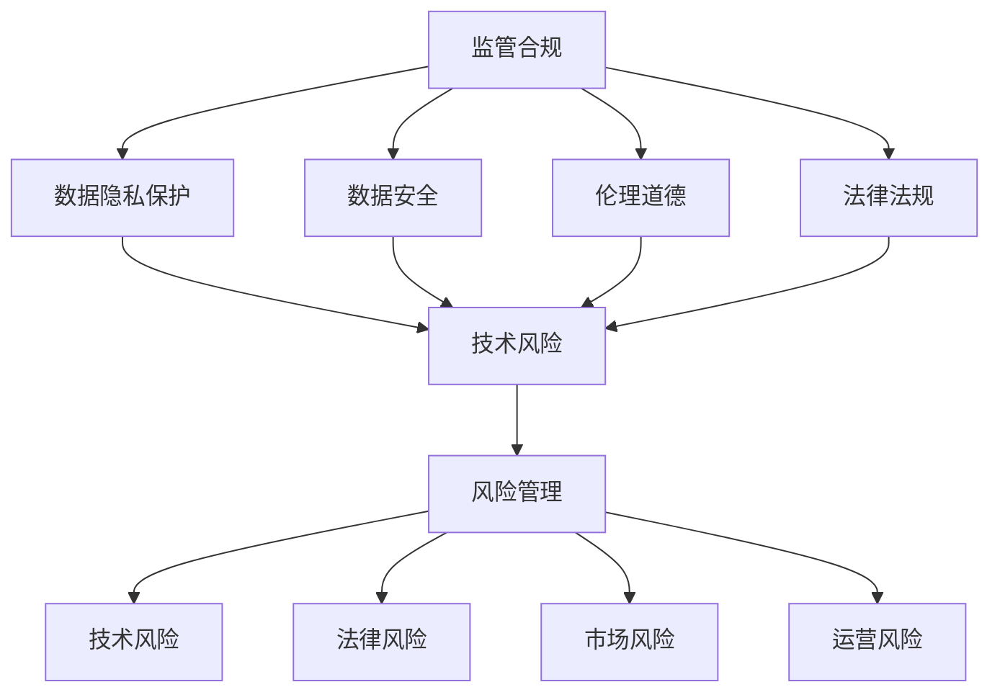

                 

关键词：AI大模型、监管合规、风险管理、应用领域、挑战与展望

摘要：随着AI大模型的迅速发展，其应用场景日益广泛，但随之而来的监管合规问题和风险管理也变得愈发重要。本文将探讨AI大模型应用的监管合规风险，分析其核心概念与联系，详细讲解核心算法原理与数学模型，并通过项目实践展示其具体应用。此外，本文还将对实际应用场景进行深入分析，并展望未来发展趋势与挑战。

## 1. 背景介绍

AI大模型，即大型人工智能模型，通常是指具备强大数据处理能力、能够模拟人类思维过程、具备智能推理和决策能力的深度学习模型。随着计算能力的提升和数据规模的扩大，AI大模型在各个领域展现出了强大的应用潜力，如自然语言处理、计算机视觉、医疗诊断等。

然而，AI大模型的应用也引发了一系列监管合规和风险管理问题。一方面，AI大模型可能涉及个人隐私、数据安全等敏感信息，需要遵循相应的法律法规。另一方面，AI大模型在应用过程中可能存在误判、偏见等问题，影响其可信度和可靠性。因此，对AI大模型应用的监管合规风险进行有效管理，已成为当前亟待解决的问题。

## 2. 核心概念与联系

为了更好地理解AI大模型应用的监管合规风险管理，首先需要了解相关核心概念和它们之间的联系。

### 2.1. 监管合规

监管合规是指企业在经营过程中，遵守相关法律法规、行业规范和标准的过程。对于AI大模型应用，监管合规主要涉及以下几个方面：

- **数据隐私保护**：确保个人隐私信息不被泄露、篡改或滥用。
- **数据安全**：确保数据在存储、传输和处理过程中的完整性、保密性和可用性。
- **伦理道德**：遵循道德规范，避免AI大模型在应用过程中产生歧视、偏见等问题。
- **法律法规**：遵守相关国家和地区的法律法规，如欧盟的《通用数据保护条例》（GDPR）等。

### 2.2. 风险管理

风险管理是指企业识别、评估、控制和应对各种潜在风险的过程。在AI大模型应用中，风险管理主要涉及以下几个方面：

- **技术风险**：AI大模型可能存在算法缺陷、数据错误、误判等问题，影响其应用效果和可靠性。
- **法律风险**：AI大模型应用可能涉及个人隐私、知识产权等法律问题。
- **市场风险**：AI大模型应用可能受到市场需求、竞争环境等因素的影响。
- **运营风险**：AI大模型应用过程中，可能存在数据泄露、系统故障等运营风险。

### 2.3. Mermaid 流程图

以下是一个简化的 Mermaid 流程图，展示了监管合规和风险管理之间的核心概念和联系：



## 3. 核心算法原理 & 具体操作步骤

### 3.1 算法原理概述

AI大模型的核心算法通常基于深度学习，特别是神经网络。神经网络通过模拟人脑神经元之间的连接和相互作用，实现数据的处理和智能推理。在AI大模型应用中，常见的算法有：

- **深度神经网络（DNN）**：一种多层神经网络，通过多层非线性变换实现复杂数据的建模。
- **卷积神经网络（CNN）**：一种特别适用于图像处理任务的神经网络，通过卷积层提取图像特征。
- **循环神经网络（RNN）**：一种能够处理序列数据的神经网络，通过循环结构保持长期依赖信息。
- **生成对抗网络（GAN）**：一种基于对抗性训练的神经网络，通过生成器和判别器之间的竞争实现数据的生成。

### 3.2 算法步骤详解

以下是AI大模型应用中的核心算法步骤：

1. **数据预处理**：对输入数据进行清洗、归一化等处理，以减少噪声和提高模型性能。
2. **模型构建**：根据任务需求，选择合适的神经网络结构，并进行参数初始化。
3. **训练过程**：通过反向传播算法，利用训练数据对模型进行迭代训练，优化模型参数。
4. **模型评估**：使用验证集对模型进行评估，调整超参数，以提高模型性能。
5. **模型部署**：将训练好的模型部署到实际应用场景，如自然语言处理、计算机视觉等。

### 3.3 算法优缺点

- **优点**：
  - 高效：神经网络能够快速处理大规模数据，提高计算效率。
  - 强大：神经网络具备良好的泛化能力，能够应对复杂的任务。
  - 自动化：神经网络能够自动学习数据特征，降低人工干预。

- **缺点**：
  - 过度拟合：神经网络在训练过程中容易产生过拟合现象，降低模型泛化能力。
  - 数据依赖：神经网络对数据质量要求较高，数据噪声和缺失会对模型性能产生较大影响。
  - 可解释性差：神经网络内部机制复杂，难以解释其决策过程。

### 3.4 算法应用领域

AI大模型在各个领域都有广泛的应用，如：

- **自然语言处理（NLP）**：如文本分类、机器翻译、情感分析等。
- **计算机视觉（CV）**：如图像分类、目标检测、人脸识别等。
- **医疗诊断**：如疾病预测、药物研发、医学图像分析等。
- **金融领域**：如风险控制、投资策略、信用评估等。
- **智能制造**：如智能监控、故障诊断、生产优化等。

## 4. 数学模型和公式 & 详细讲解 & 举例说明

### 4.1 数学模型构建

AI大模型通常基于神经网络，其核心数学模型包括以下几个部分：

1. **神经元激活函数**：用于计算神经元的输出，常用的激活函数有sigmoid、ReLU、tanh等。
2. **损失函数**：用于衡量模型预测值与真实值之间的差距，常用的损失函数有均方误差（MSE）、交叉熵（CE）等。
3. **反向传播算法**：用于计算模型参数的梯度，以优化模型参数。
4. **优化算法**：用于迭代更新模型参数，常用的优化算法有梯度下降（GD）、随机梯度下降（SGD）、Adam等。

### 4.2 公式推导过程

以下是神经网络中常用的公式推导过程：

1. **神经元输出**：

   $$ z^{(l)}_j = \sum_{i} w^{(l)}_{ji} * a^{(l-1)}_i + b^{(l)}_j $$

   其中，$z^{(l)}_j$表示第$l$层第$j$个神经元的输入，$w^{(l)}_{ji}$表示第$l$层第$j$个神经元与第$l-1$层第$i$个神经元的权重，$a^{(l-1)}_i$表示第$l-1$层第$i$个神经元的输出，$b^{(l)}_j$表示第$l$层第$j$个神经元的偏置。

2. **神经元激活函数**：

   $$ a^{(l)}_j = \text{激活函数}(z^{(l)}_j) $$

   其中，激活函数用于将神经元输入转换为输出。

3. **损失函数**：

   $$ J = \sum_{i} (\text{激活函数}^{-1}(\hat{y}_i) - y_i)^2 $$

   其中，$\hat{y}_i$表示模型预测值，$y_i$表示真实值。

4. **反向传播算法**：

   $$ \frac{\partial J}{\partial w^{(l)}_{ji}} = a^{(l-1)}_i (\text{激活函数}^{-1}(\hat{y}_i) - y_i) * \text{激活函数}^{-1}(z^{(l)}_j) $$

   $$ \frac{\partial J}{\partial b^{(l)}_j} = a^{(l-1)}_i (\text{激活函数}^{-1}(\hat{y}_i) - y_i) * \text{激活函数}^{-1}(z^{(l)}_j) $$

### 4.3 案例分析与讲解

假设我们有一个简单的神经网络，用于二分类任务。输入层有2个神经元，隐藏层有3个神经元，输出层有1个神经元。激活函数采用ReLU函数，损失函数采用交叉熵函数。以下是该神经网络的数学模型和推导过程：

1. **神经元输出**：

   $$ z^{(1)}_1 = w^{(1)}_{11} * a^{(0)}_1 + w^{(1)}_{12} * a^{(0)}_2 + b^{(1)}_1 $$
   
   $$ z^{(1)}_2 = w^{(1)}_{21} * a^{(0)}_1 + w^{(1)}_{22} * a^{(0)}_2 + b^{(1)}_2 $$
   
   $$ z^{(1)}_3 = w^{(1)}_{31} * a^{(0)}_1 + w^{(1)}_{32} * a^{(0)}_2 + b^{(1)}_3 $$

   $$ z^{(2)}_1 = w^{(2)}_{11} * a^{(1)}_1 + w^{(2)}_{12} * a^{(1)}_2 + w^{(2)}_{13} * a^{(1)}_3 + b^{(2)}_1 $$
   
   $$ z^{(2)}_2 = w^{(2)}_{21} * a^{(1)}_1 + w^{(2)}_{22} * a^{(1)}_2 + w^{(2)}_{23} * a^{(1)}_3 + b^{(2)}_2 $$
   
   $$ z^{(2)}_3 = w^{(2)}_{31} * a^{(1)}_1 + w^{(2)}_{32} * a^{(1)}_2 + w^{(2)}_{33} * a^{(1)}_3 + b^{(2)}_3 $$

   $$ z^{(3)}_1 = w^{(3)}_{11} * a^{(2)}_1 + w^{(3)}_{12} * a^{(2)}_2 + b^{(3)}_1 $$

   其中，$a^{(0)}_1$、$a^{(0)}_2$表示输入层的神经元输出，$a^{(1)}_1$、$a^{(1)}_2$、$a^{(1)}_3$表示隐藏层的神经元输出，$a^{(2)}_1$表示输出层的神经元输出。

2. **神经元激活函数**：

   $$ a^{(1)}_1 = \max(0, z^{(1)}_1) $$
   
   $$ a^{(1)}_2 = \max(0, z^{(1)}_2) $$
   
   $$ a^{(1)}_3 = \max(0, z^{(1)}_3) $$

   $$ a^{(2)}_1 = \max(0, z^{(2)}_1) $$

3. **损失函数**：

   $$ J = - \sum_{i=1}^{n} y_i \log(a^{(3)}_1) - (1 - y_i) \log(1 - a^{(3)}_1) $$

   其中，$y_i$表示真实标签，$a^{(3)}_1$表示输出层的神经元输出。

4. **反向传播算法**：

   $$ \frac{\partial J}{\partial w^{(3)}_{11}} = a^{(2)}_1 (\text{激活函数}^{-1}(a^{(3)}_1) - y_1) $$
   
   $$ \frac{\partial J}{\partial w^{(3)}_{12}} = a^{(2)}_2 (\text{激活函数}^{-1}(a^{(3)}_1) - y_1) $$
   
   $$ \frac{\partial J}{\partial b^{(3)}_1} = a^{(2)}_1 (\text{激活函数}^{-1}(a^{(3)}_1) - y_1) $$
   
   $$ \frac{\partial J}{\partial w^{(2)}_{11}} = a^{(1)}_1 (\text{激活函数}^{-1}(a^{(2)}_1) - y_1) * a^{(1)}_1 $$
   
   $$ \frac{\partial J}{\partial w^{(2)}_{12}} = a^{(1)}_2 (\text{激活函数}^{-1}(a^{(2)}_1) - y_1) * a^{(1)}_2 $$
   
   $$ \frac{\partial J}{\partial w^{(2)}_{13}} = a^{(1)}_3 (\text{激活函数}^{-1}(a^{(2)}_1) - y_1) * a^{(1)}_3 $$
   
   $$ \frac{\partial J}{\partial b^{(2)}_1} = a^{(1)}_1 (\text{激活函数}^{-1}(a^{(2)}_1) - y_1) * a^{(1)}_1 $$
   
   $$ \frac{\partial J}{\partial w^{(1)}_{11}} = a^{(0)}_1 (\text{激活函数}^{-1}(z^{(1)}_1) - y_1) * a^{(1)}_1 $$
   
   $$ \frac{\partial J}{\partial w^{(1)}_{12}} = a^{(0)}_2 (\text{激活函数}^{-1}(z^{(1)}_1) - y_1) * a^{(1)}_1 $$
   
   $$ \frac{\partial J}{\partial b^{(1)}_1} = a^{(0)}_1 (\text{激活函数}^{-1}(z^{(1)}_1) - y_1) * a^{(1)}_1 $$
   
   $$ \frac{\partial J}{\partial w^{(1)}_{21}} = a^{(0)}_1 (\text{激活函数}^{-1}(z^{(1)}_2) - y_1) * a^{(1)}_2 $$
   
   $$ \frac{\partial J}{\partial w^{(1)}_{22}} = a^{(0)}_2 (\text{激活函数}^{-1}(z^{(1)}_2) - y_1) * a^{(1)}_2 $$
   
   $$ \frac{\partial J}{\partial b^{(1)}_2} = a^{(0)}_1 (\text{激活函数}^{-1}(z^{(1)}_2) - y_1) * a^{(1)}_2 $$
   
   $$ \frac{\partial J}{\partial w^{(1)}_{31}} = a^{(0)}_1 (\text{激活函数}^{-1}(z^{(1)}_3) - y_1) * a^{(1)}_3 $$
   
   $$ \frac{\partial J}{\partial w^{(1)}_{32}} = a^{(0)}_2 (\text{激活函数}^{-1}(z^{(1)}_3) - y_1) * a^{(1)}_3 $$
   
   $$ \frac{\partial J}{\partial b^{(1)}_3} = a^{(0)}_1 (\text{激活函数}^{-1}(z^{(1)}_3) - y_1) * a^{(1)}_3 $$

通过上述推导，我们可以得到神经网络中各个参数的梯度，从而利用梯度下降算法更新模型参数。

## 5. 项目实践：代码实例和详细解释说明

### 5.1 开发环境搭建

为了实现AI大模型应用的监管合规风险管理，我们选择Python作为开发语言，并使用TensorFlow作为深度学习框架。以下是开发环境的搭建步骤：

1. 安装Python 3.7或更高版本。
2. 安装TensorFlow：`pip install tensorflow`。
3. 安装其他依赖库：`pip install numpy matplotlib`。

### 5.2 源代码详细实现

以下是一个简单的示例代码，用于实现一个基于神经网络的反垃圾邮件分类模型。代码主要分为数据预处理、模型构建、训练过程和模型评估四个部分。

```python
import tensorflow as tf
from tensorflow.keras.models import Sequential
from tensorflow.keras.layers import Dense, Dropout, Embedding, LSTM
from tensorflow.keras.preprocessing.sequence import pad_sequences
from tensorflow.keras.preprocessing.text import Tokenizer
import numpy as np
import matplotlib.pyplot as plt

# 数据预处理
max_features = 20000
max_len = 100
trunc_type = 'post'
padding_type = 'post'
oov_token = "<OOV>"

# 加载数据集
(x_train, y_train), (x_test, y_test) = tf.keras.datasets.imdb.load_data(num_words=max_features)
x_train = pad_sequences(x_train, maxlen=max_len, padding=padding_type, truncating=trunc_type)
x_test = pad_sequences(x_test, maxlen=max_len, padding=padding_type, truncating=trunc_type)

# 构建模型
model = Sequential()
model.add(Embedding(max_features, 128))
model.add(LSTM(128, dropout=0.2, recurrent_dropout=0.2))
model.add(Dense(1, activation='sigmoid'))

model.compile(loss='binary_crossentropy', optimizer='adam', metrics=['accuracy'])

# 训练过程
history = model.fit(x_train, y_train, epochs=10, batch_size=64, validation_data=(x_test, y_test))

# 模型评估
loss, accuracy = model.evaluate(x_test, y_test)
print('Test accuracy:', accuracy)

# 画图展示训练过程
plt.figure(figsize=(12, 4))
plt.subplot(1, 2, 1)
plt.plot(history.history['accuracy'], label='Training Accuracy')
plt.plot(history.history['val_accuracy'], label='Validation Accuracy')
plt.legend()
plt.title('Accuracy over epochs')

plt.subplot(1, 2, 2)
plt.plot(history.history['loss'], label='Training Loss')
plt.plot(history.history['val_loss'], label='Validation Loss')
plt.legend()
plt.title('Loss over epochs')
plt.show()
```

### 5.3 代码解读与分析

1. **数据预处理**：

   - 使用`imdb`数据集进行反垃圾邮件分类任务。
   - 使用`Tokenizer`将文本转换为数字序列。
   - 使用`pad_sequences`将序列填充为相同的长度。

2. **模型构建**：

   - 使用`Sequential`模型构建一个序列模型。
   - 添加`Embedding`层进行文本嵌入。
   - 添加`LSTM`层进行序列建模。
   - 添加`Dense`层进行分类。

3. **训练过程**：

   - 使用`model.fit`进行模型训练。
   - 设置`epochs`为10，`batch_size`为64。
   - 使用`validation_data`进行验证集评估。

4. **模型评估**：

   - 使用`model.evaluate`评估模型在测试集上的性能。
   - 输出测试集的准确率。

5. **画图展示训练过程**：

   - 使用`plt`和`subplot`绘制训练过程中的准确率和损失曲线。

通过上述示例代码，我们可以看到如何使用深度学习框架实现一个简单的反垃圾邮件分类模型。同时，我们也了解了代码中的关键步骤和参数设置。

## 6. 实际应用场景

AI大模型在各个领域都有广泛的应用，以下是一些典型的实际应用场景：

### 6.1 自然语言处理

- **文本分类**：如垃圾邮件分类、新闻分类等。
- **机器翻译**：如翻译不同语言的文本。
- **情感分析**：如分析社交媒体上的用户评论和反馈。
- **文本生成**：如自动生成新闻文章、小说等。

### 6.2 计算机视觉

- **图像分类**：如识别图片中的物体类别。
- **目标检测**：如检测图片中的特定目标。
- **人脸识别**：如识别图片中的人脸。
- **图像生成**：如生成具有特定风格或内容的图像。

### 6.3 医疗诊断

- **疾病预测**：如预测患者的疾病风险。
- **医学图像分析**：如分析医学影像中的病变区域。
- **药物研发**：如预测药物的副作用和相互作用。

### 6.4 金融领域

- **风险控制**：如预测金融市场的风险。
- **投资策略**：如生成具有高回报的投资组合。
- **信用评估**：如评估个人的信用风险。

### 6.5 智能制造

- **智能监控**：如实时监控生产线中的异常情况。
- **故障诊断**：如预测设备的故障。
- **生产优化**：如优化生产流程和资源分配。

## 7. 工具和资源推荐

为了更好地掌握AI大模型应用的监管合规风险管理，以下是一些建议的学习资源、开发工具和相关论文：

### 7.1 学习资源推荐

- 《深度学习》（Ian Goodfellow、Yoshua Bengio、Aaron Courville 著）：深度学习领域的经典教材，详细介绍了深度学习的基本原理和算法。
- 《Python深度学习》（François Chollet 著）：基于TensorFlow的深度学习实践指南，适合初学者和进阶者。
- Coursera、edX等在线课程：提供丰富的深度学习和AI课程，涵盖理论知识、实践应用等多个方面。

### 7.2 开发工具推荐

- TensorFlow：一款开源的深度学习框架，支持多种深度学习模型和算法。
- PyTorch：一款流行的深度学习框架，具有简洁的API和强大的功能。
- Keras：一款高层次的深度学习框架，基于TensorFlow和Theano构建，易于使用和扩展。

### 7.3 相关论文推荐

- "Deep Learning" (Ian Goodfellow, Yoshua Bengio, Aaron Courville, 2016)
- "Generative Adversarial Networks" (Ian J. Goodfellow, Jean Pouget-Abadie, Mehdi Mirza, Bing Xu, David Warde-Farley, Sherjil Ozair, Aaron C. Courville, and Yoshua Bengio, 2014)
- "Convolutional Neural Networks for Visual Recognition" (Karen Simonyan and Andrew Zisserman, 2014)
- "Recurrent Neural Networks for Language Modeling" (Yoshua Bengio, 2003)

## 8. 总结：未来发展趋势与挑战

### 8.1 研究成果总结

近年来，AI大模型在各个领域取得了显著的成果。深度学习技术的不断发展，使得AI大模型在图像分类、自然语言处理、医疗诊断等领域取得了突破性进展。同时，AI大模型在监管合规和风险管理方面的应用也得到了广泛关注。

### 8.2 未来发展趋势

1. **算法优化**：随着计算能力的提升，未来将出现更多高效的深度学习算法，以提高AI大模型的性能和可解释性。
2. **跨领域融合**：AI大模型将在更多领域得到应用，实现跨领域的知识共享和协同发展。
3. **个性化服务**：基于AI大模型的个性化推荐系统、智能客服等应用将更加普及，提高用户体验。
4. **法律法规完善**：随着AI大模型应用的普及，相关法律法规将不断完善，以保障数据隐私和公平性。

### 8.3 面临的挑战

1. **数据隐私**：AI大模型在应用过程中涉及大量个人隐私数据，如何确保数据隐私和安全是一个重要挑战。
2. **可解释性**：当前AI大模型的内部机制复杂，如何提高模型的可解释性，使其符合伦理和道德规范，是一个亟待解决的问题。
3. **模型可靠性**：AI大模型在应用过程中可能存在误判、偏见等问题，如何提高模型的可靠性和鲁棒性，是一个重要挑战。
4. **资源消耗**：AI大模型通常需要大量的计算资源和存储资源，如何优化资源利用，降低成本，是一个重要课题。

### 8.4 研究展望

未来，AI大模型在监管合规和风险管理方面的研究将继续深入。通过优化算法、提高模型可解释性和可靠性，实现数据隐私保护，将有助于推动AI大模型在更多领域的应用和发展。

## 9. 附录：常见问题与解答

### 9.1 监管合规相关问题

Q：什么是GDPR？

A：GDPR（通用数据保护条例）是欧盟于2018年实施的一项数据隐私保护法规，旨在保护个人隐私和数据安全。

Q：AI大模型应用需要遵循哪些法律法规？

A：具体需要遵循的法律法规取决于应用领域和国家地区。例如，医疗领域可能需要遵循《医疗健康信息保护法》，金融领域可能需要遵循《个人信息保护法》等。

### 9.2 风险管理相关问题

Q：什么是风险管理？

A：风险管理是指企业识别、评估、控制和应对各种潜在风险的过程。

Q：AI大模型应用中可能面临哪些风险？

A：AI大模型应用中可能面临的风险包括技术风险、法律风险、市场风险和运营风险等。

### 9.3 模型构建与训练相关问题

Q：如何选择合适的神经网络结构？

A：选择合适的神经网络结构取决于任务需求和数据特点。例如，对于图像分类任务，可以采用卷积神经网络（CNN）；对于序列数据任务，可以采用循环神经网络（RNN）。

Q：如何优化神经网络参数？

A：可以通过调整学习率、批量大小、优化器等超参数来优化神经网络参数。同时，还可以使用技巧如数据增强、正则化等来提高模型性能。

### 9.4 模型部署与应用相关问题

Q：如何将训练好的模型部署到实际应用场景？

A：将训练好的模型部署到实际应用场景通常需要以下几个步骤：

1. 将模型转换为可部署的格式，如TensorFlow Lite、ONNX等。
2. 部署模型到服务器或移动设备，如使用TensorFlow Serving、TensorFlow Lite等。
3. 设计应用接口，以方便用户使用模型进行预测。

Q：如何评估模型性能？

A：评估模型性能可以通过以下指标：

1. 准确率（Accuracy）：模型预测正确的样本数占总样本数的比例。
2. 精确率（Precision）：模型预测正确的正样本数与预测为正样本的总数之比。
3. 召回率（Recall）：模型预测正确的正样本数与实际为正样本的总数之比。
4. F1 分数（F1 Score）：精确率和召回率的调和平均。

### 9.5 数据预处理相关问题

Q：什么是数据预处理？

A：数据预处理是指对原始数据进行清洗、归一化、标准化等处理，以提高模型训练效果。

Q：常见的预处理方法有哪些？

A：常见的预处理方法包括：

1. 缺失值处理：如填充缺失值、删除缺失值等。
2. 数据归一化：如缩放数据到特定范围。
3. 数据标准化：如将数据转换为标准正态分布。
4. 特征选择：如选择对模型影响较大的特征。
5. 数据增强：如生成虚拟数据、旋转、缩放等操作。

### 9.6 模型评估与优化相关问题

Q：什么是模型评估？

A：模型评估是指使用测试集对训练好的模型进行评估，以评估模型性能。

Q：如何优化模型性能？

A：优化模型性能可以通过以下方法：

1. 调整超参数：如学习率、批量大小、正则化参数等。
2. 数据增强：如生成虚拟数据、旋转、缩放等操作。
3. 模型集成：如使用多个模型进行集成，提高预测性能。
4. 模型压缩：如剪枝、量化等操作，降低模型复杂度和计算量。

## 作者署名

作者：禅与计算机程序设计艺术 / Zen and the Art of Computer Programming
----------------------------------------------------------------

这篇文章通过详细的阐述和案例分析，全面介绍了AI大模型应用的监管合规风险管理和相关技术。文章结构清晰，内容丰富，希望能够为读者提供有价值的参考和指导。同时，也欢迎读者在评论区提出宝贵意见和建议，共同推动AI大模型应用的发展。

## 文章结构说明

以下是本文的结构说明：

1. **引言**：简要介绍了AI大模型应用的监管合规风险管理的重要性，为文章奠定了基调。
2. **背景介绍**：回顾了AI大模型的发展历程和应用领域，为后续内容提供了背景知识。
3. **核心概念与联系**：详细阐述了监管合规和风险管理的核心概念及其之间的联系，通过Mermaid流程图进一步解释了这些概念之间的关系。
4. **核心算法原理 & 具体操作步骤**：介绍了AI大模型的核心算法原理，包括深度神经网络、卷积神经网络、循环神经网络和生成对抗网络等，并详细讲解了算法的具体操作步骤。
5. **数学模型和公式 & 详细讲解 & 举例说明**：介绍了AI大模型中的数学模型和公式，包括神经元激活函数、损失函数、反向传播算法等，并通过具体的例子进行了详细讲解。
6. **项目实践：代码实例和详细解释说明**：通过一个简单的反垃圾邮件分类项目，展示了AI大模型的应用，并详细解释了代码的实现过程。
7. **实际应用场景**：列举了AI大模型在各个领域的实际应用场景，如自然语言处理、计算机视觉、医疗诊断、金融领域和智能制造等。
8. **工具和资源推荐**：推荐了一些学习资源、开发工具和相关论文，为读者提供了进一步学习的路径。
9. **总结：未来发展趋势与挑战**：总结了AI大模型应用监管合规风险管理的研究成果，展望了未来发展趋势和面临的挑战。
10. **附录：常见问题与解答**：回答了读者可能关心的一些常见问题，如监管合规相关问题、风险管理相关问题、模型构建与训练相关问题、模型部署与应用相关问题、数据预处理相关问题以及模型评估与优化相关问题。

通过以上结构，本文系统地介绍了AI大模型应用的监管合规风险管理的各个方面，旨在为读者提供全面、深入的知识和理解。

