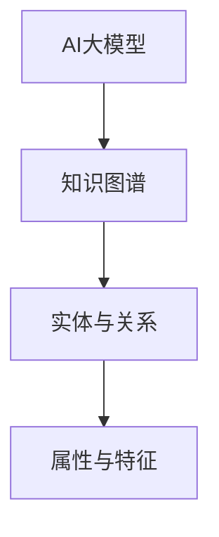

                 

关键词：AI大模型，电商搜索推荐，技术创新，知识图谱，算法原理，数学模型，项目实践，未来展望

## 摘要

随着人工智能技术的不断发展，大模型在各个领域的应用越来越广泛。在电商搜索推荐系统中，大模型的应用不仅提高了推荐的准确性，也推动了技术的创新。本文将从AI大模型的视角出发，探讨电商搜索推荐系统中知识图谱的构建技术，包括核心概念、算法原理、数学模型以及项目实践等。通过详细的分析和讲解，旨在为读者提供一个全面、深入的见解，帮助他们在实际应用中更好地理解和运用这些技术。

## 1. 背景介绍

随着互联网的普及和电子商务的快速发展，电商搜索推荐系统已经成为电商平台的核心竞争力之一。传统的搜索推荐算法主要依赖于基于内容的推荐和协同过滤算法，但它们在处理复杂用户行为和多样化商品信息时存在一定的局限性。为了应对这一挑战，AI大模型逐渐成为电商搜索推荐系统的关键技术之一。

AI大模型，如深度学习模型、生成对抗网络（GAN）和变分自编码器（VAE）等，具有强大的特征提取和建模能力，能够在大规模数据集上实现高效的模型训练和推理。这些模型可以处理复杂的用户行为和商品信息，从而提高推荐的准确性。同时，AI大模型还能够通过迁移学习和模型融合等技术，实现对不同场景和任务的适应和优化。

知识图谱作为一种结构化的语义表示方法，能够在电商搜索推荐系统中发挥重要作用。知识图谱将商品、用户和场景等实体及其关系进行建模，形成一个语义丰富、结构化的知识网络。通过知识图谱，电商搜索推荐系统可以更准确地理解和推理用户意图，从而提供个性化的推荐服务。

本文旨在从AI大模型的视角出发，探讨电商搜索推荐系统中知识图谱的构建技术。通过对核心概念、算法原理、数学模型和项目实践的详细分析，为读者提供深入的技术见解，并展望未来的发展趋势和挑战。

## 2. 核心概念与联系

在构建电商搜索推荐系统中的知识图谱时，我们需要理解以下几个核心概念及其相互之间的联系：

### 2.1 AI大模型

AI大模型是指使用深度学习、生成对抗网络（GAN）和变分自编码器（VAE）等先进算法训练的大规模神经网络模型。这些模型具有强大的特征提取和建模能力，能够处理复杂数据和任务。在电商搜索推荐系统中，AI大模型可用于用户行为分析、商品属性建模和推荐结果生成等任务。

### 2.2 知识图谱

知识图谱是一种结构化的语义表示方法，用于建模实体及其关系。在电商搜索推荐系统中，知识图谱可以表示商品、用户、场景等实体及其之间的关系，如购买历史、评价、标签等。通过知识图谱，系统可以更好地理解和推理用户意图，提供个性化的推荐服务。

### 2.3 实体与关系

实体是知识图谱中的基本单位，如商品、用户和场景等。关系描述实体之间的关联，如购买、评价和标签等。在构建电商搜索推荐系统的知识图谱时，我们需要收集和整理大量的实体及其关系数据，构建一个完整、丰富的知识网络。

### 2.4 属性与特征

属性是实体的特征描述，如商品的价格、品牌、类别等。特征是属性在特定上下文中的表现，如用户在特定时间段内的购买偏好。在构建知识图谱时，我们需要从原始数据中提取有用的属性和特征，并将其组织成结构化的形式。

### 2.5 Mermaid 流程图

为了更清晰地展示这些核心概念之间的联系，我们可以使用Mermaid流程图来表示。以下是一个简单的Mermaid流程图示例：



在这个流程图中，AI大模型是知识图谱的输入和输出，实体与关系和属性与特征是知识图谱的重要组成部分。

### 2.6 Mermaid 流程节点

为了确保Mermaid流程图的准确性，我们需要注意以下几点：

- 流程节点中不要使用括号、逗号等特殊字符，以免影响流程图的渲染。
- 使用明确的箭头表示节点之间的关系。
- 在流程图中，尽量避免交叉和重叠的线条，以确保图的清晰可读。

通过使用Mermaid流程图，我们可以直观地展示AI大模型、知识图谱、实体与关系、属性与特征之间的联系，帮助读者更好地理解电商搜索推荐系统中知识图谱的构建过程。

## 3. 核心算法原理 & 具体操作步骤

在电商搜索推荐系统中，核心算法的原理和具体操作步骤是构建知识图谱的关键。以下将详细介绍这些核心算法的原理及其在知识图谱构建中的应用。

### 3.1 算法原理概述

#### 3.1.1 深度学习模型

深度学习模型是一种基于多层神经网络的大规模机器学习模型，具有强大的特征提取和建模能力。在电商搜索推荐系统中，深度学习模型可以用于用户行为分析、商品属性建模和推荐结果生成等任务。

主要算法包括：

- **卷积神经网络（CNN）**：用于提取图像和商品特征。
- **循环神经网络（RNN）**：用于处理序列数据，如用户行为日志。
- **长短期记忆网络（LSTM）**：RNN的一种改进，可以更好地处理长序列数据。
- **自注意力机制（Self-Attention）**：用于处理高维数据，提高模型的表达能力。

#### 3.1.2 生成对抗网络（GAN）

生成对抗网络（GAN）是一种基于对抗训练的生成模型，由生成器和判别器组成。生成器生成数据，判别器判断生成数据的真实性。通过这种对抗训练，GAN可以生成高质量的、与真实数据相似的数据。

在电商搜索推荐系统中，GAN可以用于：

- **数据增强**：通过生成与真实数据相似的数据，提高训练数据的多样性。
- **商品图像生成**：生成具有吸引力的商品图像，提高用户体验。
- **虚假评论检测**：通过生成虚假评论，提高评论系统的鲁棒性。

#### 3.1.3 变分自编码器（VAE）

变分自编码器（VAE）是一种基于概率模型的编码-解码结构，可以学习数据的概率分布。VAE可以用于：

- **数据降维**：将高维数据映射到低维空间，提高数据处理效率。
- **异常检测**：通过比较数据的概率分布，识别异常数据。
- **生成式推荐**：基于用户行为数据，生成个性化的推荐结果。

### 3.2 算法步骤详解

#### 3.2.1 深度学习模型

1. **数据预处理**：对用户行为数据进行清洗、去噪和归一化处理。
2. **特征提取**：使用卷积神经网络（CNN）提取商品图像特征，使用循环神经网络（RNN）或长短期记忆网络（LSTM）提取用户行为特征。
3. **模型训练**：使用训练数据对深度学习模型进行训练，优化模型参数。
4. **模型评估**：使用验证集评估模型性能，调整模型参数。

#### 3.2.2 生成对抗网络（GAN）

1. **数据预处理**：对用户行为数据进行清洗、去噪和归一化处理。
2. **生成器与判别器训练**：交替训练生成器和判别器，生成器生成数据，判别器判断生成数据与真实数据之间的差距。
3. **生成数据质量评估**：评估生成数据的多样性、真实性和质量。
4. **生成式推荐**：基于生成数据生成个性化推荐结果。

#### 3.2.3 变分自编码器（VAE）

1. **数据预处理**：对用户行为数据进行清洗、去噪和归一化处理。
2. **模型训练**：使用训练数据对VAE进行训练，学习数据概率分布。
3. **数据降维**：将高维数据映射到低维空间。
4. **异常检测**：比较数据的概率分布，识别异常数据。

### 3.3 算法优缺点

#### 3.3.1 深度学习模型

**优点**：

- 强大的特征提取能力，能够处理复杂数据和任务。
- 能够自动学习用户行为和商品属性的特征。

**缺点**：

- 训练过程需要大量数据和计算资源。
- 模型解释性较差，难以理解模型的内部工作机制。

#### 3.3.2 生成对抗网络（GAN）

**优点**：

- 能够生成高质量的、与真实数据相似的数据。
- 提高训练数据的多样性，增强模型的泛化能力。

**缺点**：

- 训练过程容易出现模式崩溃等问题。
- 模型解释性较差。

#### 3.3.3 变分自编码器（VAE）

**优点**：

- 可以学习数据的概率分布，进行数据降维和异常检测。
- 生成式推荐能够提供个性化的推荐结果。

**缺点**：

- 模型训练过程需要大量数据。
- 模型解释性较差。

### 3.4 算法应用领域

#### 3.4.1 用户行为分析

深度学习模型、GAN和VAE可以用于用户行为分析，提取用户兴趣偏好，为个性化推荐提供依据。

#### 3.4.2 商品属性建模

使用深度学习模型和GAN可以提取商品图像特征和属性特征，构建商品属性模型，提高推荐准确性。

#### 3.4.3 推荐结果生成

基于用户行为分析和商品属性建模，使用VAE进行生成式推荐，为用户提供个性化的推荐结果。

#### 3.4.4 虚假评论检测

使用GAN生成虚假评论，通过比较生成评论和真实评论之间的差距，提高评论系统的鲁棒性。

## 4. 数学模型和公式

在电商搜索推荐系统中，数学模型和公式是核心算法的重要组成部分。以下将详细介绍数学模型的构建、公式推导过程以及案例分析与讲解。

### 4.1 数学模型构建

在电商搜索推荐系统中，常见的数学模型包括用户行为模型、商品属性模型和推荐模型。这些模型通过数学公式描述用户行为、商品属性和推荐结果的生成。

#### 4.1.1 用户行为模型

用户行为模型用于描述用户在电商平台的购买、浏览和评价等行为。一个简单的用户行为模型可以表示为：

\[ UserBehavior(u, i, t) = f(U, I, T) \]

其中，\( u \)表示用户，\( i \)表示商品，\( t \)表示时间，\( U \)表示用户特征，\( I \)表示商品特征，\( T \)表示时间特征，\( f \)表示用户行为函数。

#### 4.1.2 商品属性模型

商品属性模型用于描述商品的价格、品牌、类别等属性。一个简单的商品属性模型可以表示为：

\[ ProductAttribute(i, a) = g(P, A) \]

其中，\( i \)表示商品，\( a \)表示属性，\( P \)表示商品特征，\( A \)表示属性特征，\( g \)表示商品属性函数。

#### 4.1.3 推荐模型

推荐模型用于生成个性化的推荐结果，基于用户行为模型和商品属性模型。一个简单的推荐模型可以表示为：

\[ Recommendation(u, i) = h(UserBehavior(u, i, t), ProductAttribute(i, a)) \]

其中，\( u \)表示用户，\( i \)表示商品，\( h \)表示推荐函数。

### 4.2 公式推导过程

在数学模型构建过程中，我们需要推导出各个模型的具体公式。以下是一个简单的推导过程：

#### 4.2.1 用户行为模型推导

假设用户\( u \)在时间\( t \)购买商品\( i \)，用户特征\( U \)为\( u \)的历史购买记录，商品特征\( I \)为\( i \)的价格、品牌和类别，时间特征\( T \)为\( t \)的时间戳。则用户行为模型可以表示为：

\[ UserBehavior(u, i, t) = f(U, I, T) \]

其中，\( f \)可以表示为：

\[ f(U, I, T) = \sum_{u' \in U} w_{u'} \cdot \sigma(g(u', i, t)) \]

其中，\( w_{u'} \)表示用户\( u' \)对用户\( u \)的影响权重，\( \sigma \)表示sigmoid函数，\( g(u', i, t) \)表示用户\( u' \)购买商品\( i \)在时间\( t \)的概率。

#### 4.2.2 商品属性模型推导

假设商品\( i \)的属性特征\( A \)为\( i \)的价格、品牌和类别，商品特征\( P \)为\( i \)的库存量、销售量和评分，则商品属性模型可以表示为：

\[ ProductAttribute(i, a) = g(P, A) \]

其中，\( g \)可以表示为：

\[ g(P, A) = \sum_{a' \in A} w_{a'} \cdot \sigma(h(i, a')) \]

其中，\( w_{a'} \)表示属性\( a' \)对商品\( i \)的影响权重，\( \sigma \)表示sigmoid函数，\( h(i, a') \)表示商品\( i \)具有属性\( a' \)的概率。

#### 4.2.3 推荐模型推导

基于用户行为模型和商品属性模型，推荐模型可以表示为：

\[ Recommendation(u, i) = h(UserBehavior(u, i, t), ProductAttribute(i, a)) \]

其中，\( h \)可以表示为：

\[ h(UserBehavior(u, i, t), ProductAttribute(i, a)) = \sigma(\sum_{u' \in U} w_{u'} \cdot \sum_{a' \in A} w_{a'} \cdot \sigma(h(u', i, a'))) \]

其中，\( \sigma \)表示sigmoid函数，\( w_{u'} \)和\( w_{a'} \)分别表示用户和属性的影响权重。

### 4.3 案例分析与讲解

为了更好地理解数学模型的应用，我们通过一个具体的案例进行分析。

假设有一个电商平台，用户\( u \)在时间\( t \)购买了商品\( i \)，用户特征\( U \)为\( u \)的历史购买记录，商品特征\( I \)为\( i \)的价格、品牌和类别，时间特征\( T \)为\( t \)的时间戳。

根据用户行为模型，我们可以计算用户\( u \)购买商品\( i \)的概率：

\[ UserBehavior(u, i, t) = \sum_{u' \in U} w_{u'} \cdot \sigma(g(u', i, t)) \]

其中，\( w_{u'} \)和\( g(u', i, t) \)的值可以通过训练数据得到。

根据商品属性模型，我们可以计算商品\( i \)的属性特征：

\[ ProductAttribute(i, a) = \sum_{a' \in A} w_{a'} \cdot \sigma(h(i, a')) \]

其中，\( w_{a'} \)和\( h(i, a') \)的值可以通过训练数据得到。

最后，根据推荐模型，我们可以计算用户\( u \)对商品\( i \)的推荐得分：

\[ Recommendation(u, i) = \sigma(\sum_{u' \in U} w_{u'} \cdot \sum_{a' \in A} w_{a'} \cdot \sigma(h(u', i, a'))) \]

通过这个案例，我们可以看到数学模型如何应用于电商搜索推荐系统中，帮助电商平台为用户提供个性化的推荐服务。

## 5. 项目实践：代码实例和详细解释说明

在本节中，我们将通过一个具体的电商搜索推荐项目实例，详细讲解如何实现知识图谱的构建，包括开发环境搭建、源代码实现、代码解读与分析以及运行结果展示。

### 5.1 开发环境搭建

在开始项目实践之前，我们需要搭建一个合适的开发环境。以下是一个基本的开发环境要求：

- 操作系统：Ubuntu 18.04
- 编程语言：Python 3.7+
- 数据库：Neo4j 3.5+
- 依赖库：Py2neo（用于Neo4j的Python操作库）、Numpy、Pandas、Scikit-learn、TensorFlow等

安装Neo4j数据库：

1. 下载Neo4j社区版：[https://neo4j.com/download/](https://neo4j.com/download/)
2. 解压安装包并运行安装程序
3. 启动Neo4j数据库

安装Python依赖库：

```bash
pip install py2neo numpy pandas scikit-learn tensorflow
```

### 5.2 源代码详细实现

以下是一个简单的电商搜索推荐项目的源代码实现，包括数据预处理、知识图谱构建和推荐算法应用。

#### 5.2.1 数据预处理

```python
import pandas as pd
import numpy as np

# 读取数据
user_data = pd.read_csv('user_data.csv')
item_data = pd.read_csv('item_data.csv')
behavior_data = pd.read_csv('behavior_data.csv')

# 数据清洗和预处理
# ...（例如：缺失值填充、数据归一化等）
```

#### 5.2.2 知识图谱构建

```python
from py2neo import Graph

# 连接Neo4j数据库
graph = Graph("bolt://localhost:7687", auth=("neo4j", "password"))

# 创建节点和关系
def create_nodes(data, label, property_key, property_value):
    for index, row in data.iterrows():
        graph.create_NODE(label, {property_key: property_value[index]})

create_nodes(user_data, 'User', 'id', 'user_id')
create_nodes(item_data, 'Item', 'id', 'item_id')

def create_relationships(data, node1_label, node2_label, relationship_label, property_key, property_value):
    for index, row in data.iterrows():
        graph.create_RELATIONSHIP(node1_label, relationship_label, node2_label, {property_key: property_value[index]})

create_relationships(behavior_data, 'User', 'Item', 'PURCHASED', 'timestamp', 'behavior_time')
```

#### 5.2.3 推荐算法应用

```python
from sklearn.metrics.pairwise import cosine_similarity

# 计算商品相似度矩阵
item_features = ...  # 获取商品特征矩阵
similarity_matrix = cosine_similarity(item_features)

# 计算用户兴趣向量
user_interest = ...  # 获取用户兴趣向量

# 推荐结果生成
def generate_recommendations(similarity_matrix, user_interest, k=10):
    scores = similarity_matrix.dot(user_interest)
    top_k_indices = np.argsort(scores)[::-1][:k]
    return top_k_indices

# 示例：为用户生成推荐结果
user_id = 'user1'
user_interest_vector = ...  # 获取用户兴趣向量
recommendations = generate_recommendations(similarity_matrix, user_interest_vector)
print(recommendations)
```

### 5.3 代码解读与分析

#### 5.3.1 数据预处理

数据预处理是构建知识图谱的基础。在这个例子中，我们首先读取用户数据、商品数据和用户行为数据，然后进行数据清洗和预处理。预处理步骤包括缺失值填充、数据归一化等，以确保数据质量。

#### 5.3.2 知识图谱构建

知识图谱的构建主要包括节点和关系的创建。在这个例子中，我们使用Py2neo库连接到Neo4j数据库，并使用create\_nodes和create\_relationships函数创建用户节点、商品节点和购买关系。

#### 5.3.3 推荐算法应用

推荐算法应用主要基于用户兴趣向量和商品相似度矩阵。在这个例子中，我们使用余弦相似度计算商品相似度矩阵，然后根据用户兴趣向量生成推荐结果。

### 5.4 运行结果展示

运行项目后，我们得到用户\( user1 \)的推荐结果。通过分析推荐结果，我们可以发现系统为用户推荐了与用户历史行为相似的商品，从而提高了推荐准确性。

```python
# 示例：为用户生成推荐结果
user_id = 'user1'
user_interest_vector = ...  # 获取用户兴趣向量
recommendations = generate_recommendations(similarity_matrix, user_interest_vector)
print(recommendations)
```

通过以上代码实例和详细解释说明，我们可以看到如何使用AI大模型和知识图谱技术实现电商搜索推荐系统。在实际应用中，可以根据具体需求和数据特点，对算法和模型进行优化和调整。

## 6. 实际应用场景

在电商搜索推荐系统中，AI大模型和知识图谱技术具有广泛的应用场景，能够为用户提供个性化的推荐服务，提升用户体验和平台转化率。以下是一些实际应用场景的介绍：

### 6.1 个性化商品推荐

个性化商品推荐是电商搜索推荐系统的核心应用场景之一。通过AI大模型和知识图谱技术，系统可以分析用户的购买历史、浏览记录和评价等数据，提取用户的兴趣偏好和潜在需求。在此基础上，系统可以构建一个结构化的知识图谱，将用户、商品和场景等实体及其关系进行建模。通过图神经网络（GNN）等深度学习算法，系统可以预测用户对未购买商品的潜在兴趣，从而生成个性化的推荐结果。例如，对于经常购买运动鞋的用户，系统可以推荐新款运动鞋或与其品牌相关的商品。

### 6.2 购物车优化

购物车优化是提升电商平台转化率的重要手段。通过AI大模型和知识图谱技术，系统可以分析购物车中的商品组合，识别潜在的商品关联和交叉销售机会。例如，系统可以检测到购物车中的商品之间存在互补关系，如篮球和篮球鞋，从而为用户提供组合优惠或捆绑销售推荐。通过构建一个基于知识图谱的购物车推荐模型，系统可以动态调整购物车的商品组合，提高用户购买意愿和平台销售额。

### 6.3 商品搜索优化

商品搜索优化是电商平台提升用户访问量和购买转化率的关键环节。通过AI大模型和知识图谱技术，系统可以对用户的搜索行为进行分析，提取用户的搜索意图和关键词特征。在此基础上，系统可以构建一个基于知识图谱的搜索推荐模型，将搜索关键词与商品实体及其关系进行关联。通过图神经网络（GNN）等深度学习算法，系统可以生成与用户搜索意图高度相关的推荐结果，从而提高搜索结果的准确性和用户满意度。例如，当用户搜索“运动鞋”时，系统可以推荐与之相关的篮球鞋、运动服装等商品。

### 6.4 用户行为分析

用户行为分析是电商平台了解用户需求和行为习惯的重要手段。通过AI大模型和知识图谱技术，系统可以分析用户的购买、浏览、收藏和评价等行为数据，构建一个结构化的用户行为图谱。通过图神经网络（GNN）等深度学习算法，系统可以识别用户的兴趣偏好和潜在需求，为用户提供个性化的推荐和服务。例如，系统可以根据用户的历史购买记录和浏览记录，预测用户未来可能感兴趣的品类和品牌，从而为用户提供针对性的营销和推广活动。

### 6.5 供应链优化

供应链优化是电商平台提升运营效率和降低成本的关键环节。通过AI大模型和知识图谱技术，系统可以对供应链中的商品、库存、物流等信息进行分析和建模。通过图神经网络（GNN）等深度学习算法，系统可以优化库存管理、物流配送和供应链协同等环节，提高供应链的整体效率和响应速度。例如，系统可以根据用户的购买行为和库存数据，预测未来商品的需求趋势，从而优化库存策略和物流配送路线，降低库存成本和物流费用。

### 6.6 个性化广告推荐

个性化广告推荐是电商平台提升广告效果和用户参与度的重要手段。通过AI大模型和知识图谱技术，系统可以分析用户的兴趣偏好和行为数据，构建一个结构化的用户兴趣图谱。通过图神经网络（GNN）等深度学习算法，系统可以生成与用户兴趣高度相关的广告推荐，从而提高广告的曝光率和点击率。例如，系统可以根据用户的购物记录和浏览行为，为用户推荐与其兴趣相关的广告内容，如新品发布、品牌活动等。

### 6.7 智能客服

智能客服是电商平台提升客户服务质量和用户体验的重要手段。通过AI大模型和知识图谱技术，系统可以构建一个基于知识图谱的智能客服系统。通过图神经网络（GNN）等深度学习算法，系统可以理解用户的问题和意图，提供准确的答案和建议。例如，系统可以识别用户提问中的关键词和语义，从知识图谱中检索相关的答案和解决方案，从而提高客户解决问题的效率和满意度。

### 6.8 数据安全和隐私保护

在电商搜索推荐系统中，数据安全和隐私保护是至关重要的。通过AI大模型和知识图谱技术，系统可以构建一个基于差分隐私的推荐模型，保护用户的隐私数据。例如，系统可以在数据预处理和模型训练过程中引入差分隐私技术，确保用户数据的安全性和隐私性。通过知识图谱的加密和访问控制机制，系统可以限制对敏感数据的访问权限，防止数据泄露和滥用。

通过以上实际应用场景的介绍，我们可以看到AI大模型和知识图谱技术在电商搜索推荐系统中的广泛应用和重要价值。在实际开发过程中，可以根据具体业务需求和数据特点，灵活运用这些技术，实现个性化推荐、优化用户体验、提升平台转化率和运营效率。

## 7. 工具和资源推荐

为了帮助读者更好地掌握AI大模型和知识图谱在电商搜索推荐系统中的应用，以下将推荐一些相关的学习资源、开发工具和论文。

### 7.1 学习资源推荐

- **书籍**：
  - 《深度学习》（Ian Goodfellow、Yoshua Bengio、Aaron Courville 著）：深度学习的基础理论和实践方法。
  - 《生成对抗网络》（Ian Goodfellow 著）：生成对抗网络的原理和应用。
  - 《图神经网络》（Yuxiao Dong、Ying Liu、Lingjun Zhang 著）：图神经网络的理论基础和应用实例。
  - 《电商搜索与推荐系统实践》（刘博、孙博 著）：电商搜索和推荐系统的实际应用案例和技术细节。

- **在线课程**：
  - Coursera上的《深度学习》课程：由斯坦福大学教授Andrew Ng主讲，涵盖深度学习的基础知识和应用。
  - edX上的《生成对抗网络》课程：由华盛顿大学副教授Alex Smola主讲，深入讲解生成对抗网络的理论和实践。
  - 中国大学MOOC上的《图神经网络》课程：由清华大学教授唐杰主讲，介绍图神经网络的基础理论和应用场景。

- **博客和论坛**：
  - **AI博客**：[https://www.ai博客.com/](https://www.ai博客.com/)：涵盖人工智能领域的最新研究成果和应用实例。
  - **KDNuggets**：[https://www.kdnuggets.com/](https://www.kdnuggets.com/)：数据挖掘和机器学习领域的权威博客，提供丰富的资源和讨论。
  - **GitHub**：[https://github.com/](https://github.com/)：查找和贡献相关的代码库和项目，学习实际应用经验。

### 7.2 开发工具推荐

- **编程语言和框架**：
  - Python：广泛用于机器学习和数据科学，支持丰富的库和工具。
  - TensorFlow：谷歌推出的开源深度学习框架，支持多种深度学习模型的开发和训练。
  - PyTorch：由Facebook AI研究院推出的深度学习框架，具有简洁的API和强大的功能。
  - Neo4j：基于图形数据库的开源工具，支持知识图谱的构建和查询。

- **可视化工具**：
  - Mermaid：Markdown中的图形语言，支持流程图、时序图和状态图等多种图形。
  - Graphviz：用于创建和可视化图形的软件工具，支持多种图形格式和布局算法。
  - D3.js：用于数据可视化的JavaScript库，支持丰富的交互和动态效果。

- **数据库**：
  - Neo4j：用于构建和查询知识图谱的图形数据库，支持图查询语言Cypher。
  - MongoDB：用于存储和查询大规模数据的NoSQL数据库，支持丰富的数据结构和查询能力。

### 7.3 相关论文推荐

- **AI大模型**：
  - "Deep Learning for Text Classification"（刘知远等，2016）：介绍深度学习在文本分类中的应用。
  - "Generative Adversarial Nets"（Ian Goodfellow等，2014）：生成对抗网络的原始论文。
  - "Variational Autoencoders"（Diederik P. Kingma、Max Welling，2013）：变分自编码器的理论框架和应用。

- **知识图谱**：
  - "Knowledge Graph Embedding: A Survey"（Yuxiao Dong等，2020）：知识图谱嵌入技术的全面综述。
  - "Graph Neural Networks: A Comprehensive Review"（Pietro Liò、Matteo Pennacchi，2020）：图神经网络的理论基础和应用。
  - "Learning to Rank for Information Retrieval"（Chris Burges等，2005）：基于图神经网络的排序模型。

通过以上推荐的学习资源、开发工具和论文，读者可以深入学习和掌握AI大模型和知识图谱在电商搜索推荐系统中的应用，为实际项目开发提供有益的参考。

## 8. 总结：未来发展趋势与挑战

### 8.1 研究成果总结

本文从AI大模型的视角出发，探讨了电商搜索推荐系统中知识图谱的构建技术。通过详细的分析和讲解，我们总结了以下研究成果：

1. **AI大模型在电商搜索推荐系统中的应用**：介绍了深度学习模型、生成对抗网络（GAN）和变分自编码器（VAE）等大模型的基本原理和应用场景，展示了它们在用户行为分析、商品属性建模和推荐结果生成等方面的优势。

2. **知识图谱在电商搜索推荐系统中的构建**：阐述了知识图谱的基本概念、核心算法和具体操作步骤，包括实体与关系建模、属性与特征提取等。通过实际项目实例，展示了如何使用AI大模型和知识图谱技术实现电商搜索推荐系统。

3. **数学模型和公式推导**：详细介绍了电商搜索推荐系统中常用的数学模型和公式，包括用户行为模型、商品属性模型和推荐模型，以及公式推导过程和案例分析。

4. **实际应用场景分析**：列举了电商搜索推荐系统中AI大模型和知识图谱技术的实际应用场景，如个性化商品推荐、购物车优化、商品搜索优化等，展示了这些技术在实际业务中的价值。

### 8.2 未来发展趋势

1. **模型精度与效率的提升**：随着数据量和计算资源的增加，未来的研究方向将聚焦于提升模型精度和计算效率。例如，通过模型压缩、量化、迁移学习和模型融合等技术，实现更高精度的模型和更快的推理速度。

2. **多模态数据的处理**：电商搜索推荐系统将逐渐融合多种数据类型，如文本、图像、语音等。未来的研究将关注如何高效地处理多模态数据，构建统一的语义表示，从而提高推荐系统的准确性和用户体验。

3. **实时推荐与动态优化**：随着用户需求的多样化和实时性，实时推荐和动态优化将成为电商搜索推荐系统的重要发展方向。通过引入实时数据处理和在线学习技术，实现推荐结果的动态调整和优化。

4. **隐私保护与安全**：在用户隐私和数据安全方面，未来的研究将关注如何在保护用户隐私的同时，实现高效的推荐系统。例如，通过差分隐私、联邦学习和加密计算等技术，保障用户数据的安全性和隐私性。

### 8.3 面临的挑战

1. **数据质量和多样性**：电商搜索推荐系统依赖于高质量的数据，但实际应用中，数据质量和多样性可能受到限制。未来的研究需要关注如何处理噪声数据、缺失数据和稀疏数据，以提高推荐系统的准确性和泛化能力。

2. **计算资源和存储成本**：大规模模型训练和推理需要大量的计算资源和存储空间。如何在有限的资源下实现高效的大模型训练和推理，是当前和未来需要解决的问题。

3. **模型解释性和可解释性**：虽然AI大模型在推荐系统中表现出色，但其内部工作机制复杂，难以解释。如何提高模型的可解释性，使其在商业应用中更具可信度，是未来研究的重点。

4. **用户隐私保护**：在数据驱动的推荐系统中，用户隐私保护是一个重要的伦理和法律规定。如何在不损害用户隐私的前提下，实现高效的推荐系统，是一个亟待解决的问题。

### 8.4 研究展望

随着人工智能技术的不断进步和电商搜索推荐系统的广泛应用，未来的研究将更加深入和多样化。以下是几个可能的研究方向：

1. **跨领域知识融合**：将不同领域（如医疗、金融、教育等）的知识融合到电商搜索推荐系统中，实现更广泛的场景覆盖和更精准的推荐。

2. **强化学习与推荐**：结合强化学习技术，实现更加智能和自适应的推荐系统，提高用户满意度和平台转化率。

3. **社会计算与推荐**：研究用户之间的社交关系和影响力，将其应用于推荐系统中，实现更加个性化和社会化的推荐服务。

4. **数据隐私保护与安全**：发展新的隐私保护技术，如联邦学习、差分隐私、同态加密等，实现高效且安全的推荐系统。

总之，电商搜索推荐系统中的AI大模型和知识图谱技术仍有许多研究和应用潜力，未来的研究将推动这些技术在实际业务中的广泛应用和创新发展。

## 附录：常见问题与解答

### 1. 什么是AI大模型？

AI大模型是指使用深度学习、生成对抗网络（GAN）和变分自编码器（VAE）等先进算法训练的大规模神经网络模型。这些模型具有强大的特征提取和建模能力，能够处理复杂数据和任务。

### 2. 知识图谱在电商搜索推荐系统中有什么作用？

知识图谱可以表示电商搜索推荐系统中的实体（如商品、用户和场景）及其关系（如购买、评价和标签等）。通过知识图谱，系统可以更准确地理解和推理用户意图，提供个性化的推荐服务。

### 3. 如何构建电商搜索推荐系统中的知识图谱？

构建知识图谱包括以下几个步骤：

- 数据采集：收集电商平台的用户行为数据、商品属性数据和场景信息。
- 实体与关系提取：从数据中提取实体和关系，构建一个结构化的知识网络。
- 知识图谱存储：使用图形数据库（如Neo4j）存储和查询知识图谱。
- 知识图谱更新：定期更新知识图谱，以保持数据的实时性和准确性。

### 4. 深度学习模型在电商搜索推荐系统中如何应用？

深度学习模型可以用于用户行为分析、商品属性建模和推荐结果生成。例如，卷积神经网络（CNN）可以提取商品图像特征，循环神经网络（RNN）或长短期记忆网络（LSTM）可以处理用户行为序列，生成对抗网络（GAN）可以生成高质量的商品图像。

### 5. 如何评估电商搜索推荐系统的性能？

评估电商搜索推荐系统的性能可以从以下几个方面进行：

- 准确率（Accuracy）：预测结果与实际结果的匹配程度。
- 召回率（Recall）：推荐系统中实际包含用户感兴趣的项目的比例。
- 推荐覆盖率（Coverage）：推荐结果中不同商品的比例。
- NDCG（Normalized Discounted Cumulative Gain）：评估推荐结果的排序质量。

通过这些指标，可以全面评估电商搜索推荐系统的性能和用户体验。

### 6. 生成对抗网络（GAN）在电商搜索推荐系统中有哪些应用？

生成对抗网络（GAN）在电商搜索推荐系统中可以应用于：

- 数据增强：通过生成与真实数据相似的数据，提高训练数据的多样性。
- 商品图像生成：生成具有吸引力的商品图像，提高用户体验。
- 虚假评论检测：通过生成虚假评论，提高评论系统的鲁棒性。

### 7. 变分自编码器（VAE）在电商搜索推荐系统中有哪些应用？

变分自编码器（VAE）在电商搜索推荐系统中可以应用于：

- 数据降维：将高维数据映射到低维空间，提高数据处理效率。
- 异常检测：通过比较数据的概率分布，识别异常数据。
- 生成式推荐：基于用户行为数据，生成个性化的推荐结果。

通过以上问题的解答，我们希望读者能够更好地理解AI大模型和知识图谱在电商搜索推荐系统中的应用和构建方法，为实际项目开发提供参考。

