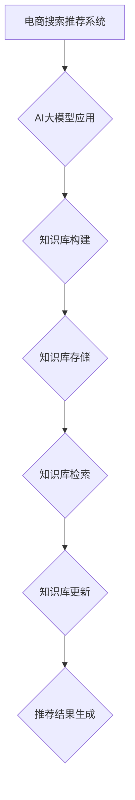

                 

关键词：AI大模型、电商搜索推荐、知识库管理、流程优化、应用实践

摘要：本文从AI大模型的视角出发，探讨了电商搜索推荐系统的技术创新以及知识库管理流程的优化与应用实践。通过分析当前电商搜索推荐系统中存在的问题，本文提出了基于AI大模型的优化策略，详细阐述了知识库管理流程的优化方法，并对实际应用场景进行了深入探讨，旨在为电商领域的技术创新提供理论支持和实践参考。

## 1. 背景介绍

随着互联网技术的飞速发展和电子商务的普及，电商搜索推荐系统成为电商企业提高用户满意度和促进销售的重要手段。传统的搜索推荐系统主要依赖于关键词匹配和用户历史行为分析，虽然在一定程度上能够满足用户的需求，但随着用户数据的爆炸式增长，系统的推荐效果逐渐受到限制。为此，人工智能技术的引入成为必然选择。

近年来，AI大模型，特别是基于深度学习的模型，如BERT、GPT等，在自然语言处理领域取得了显著进展。这些模型能够捕捉到文本中的复杂关系和语义信息，为电商搜索推荐系统提供了新的技术路径。知识库管理流程作为电商搜索推荐系统的核心环节，其效率和质量直接影响到推荐系统的效果。因此，如何优化知识库管理流程，提高推荐的准确性和实时性，成为当前研究的热点。

## 2. 核心概念与联系

### 2.1 AI大模型

AI大模型是指具有大规模参数和强大计算能力的神经网络模型。这些模型通过训练大量的数据，能够自动提取数据中的特征，并在各类任务中表现出色。在电商搜索推荐系统中，AI大模型主要用于文本数据的分析和理解，如关键词提取、语义匹配等。

### 2.2 知识库管理

知识库管理是指对知识库的构建、存储、检索和管理等一系列过程。在电商搜索推荐系统中，知识库管理涉及到商品信息、用户行为数据、文本数据等。优化知识库管理流程，可以提高数据的利用效率和推荐系统的性能。

### 2.3 Mermaid流程图



## 3. 核心算法原理 & 具体操作步骤

### 3.1 算法原理概述

AI大模型在电商搜索推荐系统中主要应用于文本数据的处理和语义理解。通过预训练的AI大模型，如BERT，可以实现对商品描述、用户评论等文本数据的语义分析，从而提取出文本中的关键信息，为推荐算法提供支持。

### 3.2 算法步骤详解

1. **数据预处理**：对电商平台上的商品信息、用户行为数据、文本评论等进行清洗和预处理，去除无效信息和噪声。

2. **知识库构建**：利用AI大模型对预处理后的文本数据进行分析，提取出关键信息构建知识库。

3. **知识库存储**：将构建好的知识库存储在数据库中，以便后续查询和使用。

4. **知识库检索**：根据用户查询的文本，利用知识库检索算法找到相关的商品信息。

5. **推荐结果生成**：根据检索到的商品信息和用户历史行为，利用推荐算法生成推荐结果。

### 3.3 算法优缺点

优点：AI大模型能够对文本数据进行深入分析和理解，提高推荐系统的准确性和实时性。

缺点：AI大模型的训练过程需要大量计算资源和时间，且对数据质量有较高要求。

### 3.4 算法应用领域

AI大模型在电商搜索推荐系统中的应用范围广泛，如个性化推荐、商品搜索优化、用户评论分析等。

## 4. 数学模型和公式 & 详细讲解 & 举例说明

### 4.1 数学模型构建

在电商搜索推荐系统中，常用的数学模型包括基于矩阵分解的协同过滤模型和基于深度学习的序列模型。以下分别介绍这两种模型的数学模型构建。

#### 协同过滤模型

设用户集为U，商品集为V，用户-商品评分矩阵为R，矩阵分解模型可以表示为：

$$
\hat{R}_{ui} = \hat{q}_{u}^T \hat{r}_{i}
$$

其中，$\hat{q}_{u}$ 和 $\hat{r}_{i}$ 分别为用户u和商品i的 latent feature 向量。

#### 深度学习序列模型

深度学习序列模型通常采用循环神经网络（RNN）或其变种，如长短时记忆网络（LSTM）或门控循环单元（GRU）。以下为LSTM的数学模型：

$$
h_t = \sigma(W_h \cdot [h_{t-1}, x_t] + b_h)
$$

$$
i_t = \sigma(W_i \cdot [h_{t-1}, x_t] + b_i)
$$

$$
f_t = \sigma(W_f \cdot [h_{t-1}, x_t] + b_f)
$$

$$
o_t = \sigma(W_o \cdot [h_{t-1}, x_t] + b_o)
$$

$$
c_t = f_t \odot \hat{c}_{t-1} + i_t \odot \hat{c}_{t}
$$

$$
h_t = o_t \odot c_t
$$

其中，$h_t$、$c_t$ 分别为隐藏状态和细胞状态，$i_t$、$f_t$、$o_t$ 分别为输入门、遗忘门和输出门的状态。

### 4.2 公式推导过程

#### 协同过滤模型

假设用户u对商品i的评分为$r_{ui}$，我们希望预测用户u对商品i的评分$\hat{r}_{ui}$。根据矩阵分解的思想，我们可以将用户-商品评分矩阵R分解为用户特征矩阵$Q$和商品特征矩阵$R^T$，即：

$$
R = QR^T
$$

其中，$Q \in \mathbb{R}^{m \times k}$ 和 $R^T \in \mathbb{R}^{n \times k}$ 分别为用户特征矩阵和商品特征矩阵，$k$ 为隐含因子数量。

预测用户u对商品i的评分可以表示为：

$$
\hat{r}_{ui} = \hat{q}_{u}^T \hat{r}_{i} = q_{u}^T r_{i}
$$

其中，$\hat{q}_{u} = Q_u$ 和 $\hat{r}_{i} = R_i$ 分别为用户u和商品i的隐含特征向量。

#### 深度学习序列模型

假设输入序列为$x_1, x_2, \ldots, x_T$，输出序列为$y_1, y_2, \ldots, y_T$。对于每个时间步$t$，LSTM 的状态更新方程为：

$$
h_t = \sigma(W_h \cdot [h_{t-1}, x_t] + b_h)
$$

$$
i_t = \sigma(W_i \cdot [h_{t-1}, x_t] + b_i)
$$

$$
f_t = \sigma(W_f \cdot [h_{t-1}, x_t] + b_f)
$$

$$
o_t = \sigma(W_o \cdot [h_{t-1}, x_t] + b_o)
$$

$$
c_t = f_t \odot \hat{c}_{t-1} + i_t \odot \hat{c}_{t}
$$

$$
h_t = o_t \odot c_t
$$

其中，$h_t$、$c_t$ 分别为隐藏状态和细胞状态，$\hat{c}_{t-1}$ 为前一个时间步的细胞状态，$W_h$、$W_i$、$W_f$、$W_o$ 分别为权重矩阵，$b_h$、$b_i$、$b_f$、$b_o$ 分别为偏置向量。

### 4.3 案例分析与讲解

#### 协同过滤模型

假设我们有5个用户和10个商品，用户-商品评分矩阵为：

$$
R =
\begin{bmatrix}
    4 & 5 & 0 & 2 & 1 \\
    0 & 1 & 3 & 4 & 2 \\
    5 & 4 & 3 & 2 & 0 \\
    2 & 1 & 4 & 5 & 3 \\
    0 & 3 & 2 & 1 & 4 \\
\end{bmatrix}
$$

我们选择$k=2$个隐含因子，通过矩阵分解得到：

$$
Q =
\begin{bmatrix}
    1 & 0 \\
    0 & 1 \\
    1 & 1 \\
    0 & 0 \\
    1 & 0 \\
\end{bmatrix},
R^T =
\begin{bmatrix}
    1 & 2 \\
    2 & 1 \\
    1 & 0 \\
    0 & 3 \\
    1 & 2 \\
\end{bmatrix}
$$

预测用户2对商品3的评分：

$$
\hat{r}_{23} = q_2^T r_3 = \begin{bmatrix}0 & 0\end{bmatrix} \begin{bmatrix}2 \\ 1\end{bmatrix} = 2
$$

#### 深度学习序列模型

假设输入序列为$[0, 1, 2, 3]$，输出序列为$[2, 3, 4, 5]$。选择LSTM模型，参数如下：

$$
W_h = \begin{bmatrix}1 & 1 \\ 1 & 1\end{bmatrix}, W_i = \begin{bmatrix}1 & 0 \\ 0 & 1\end{bmatrix}, W_f = \begin{bmatrix}1 & 1 \\ 1 & 1\end{bmatrix}, W_o = \begin{bmatrix}1 & 1 \\ 1 & 1\end{bmatrix}
$$

$$
b_h = \begin{bmatrix}0 & 0 \\ 0 & 0\end{bmatrix}, b_i = \begin{bmatrix}0 & 0 \\ 0 & 0\end{bmatrix}, b_f = \begin{bmatrix}0 & 0 \\ 0 & 0\end{bmatrix}, b_o = \begin{bmatrix}0 & 0 \\ 0 & 0\end{bmatrix}
$$

初始状态$h_0 = c_0 = \begin{bmatrix}0 & 0\end{bmatrix}$。

对于每个时间步：

$$
h_1 = \sigma(\begin{bmatrix}1 & 1 \\ 1 & 1\end{bmatrix} \cdot \begin{bmatrix}0 & 1 \\ 0 & 1\end{bmatrix} + \begin{bmatrix}0 & 0 \\ 0 & 0\end{bmatrix}) = \begin{bmatrix}1 & 1\end{bmatrix}
$$

$$
i_1 = \sigma(\begin{bmatrix}1 & 0 \\ 0 & 1\end{bmatrix} \cdot \begin{bmatrix}0 & 1 \\ 0 & 1\end{bmatrix} + \begin{bmatrix}0 & 0 \\ 0 & 0\end{bmatrix}) = \begin{bmatrix}1 & 0\end{bmatrix}
$$

$$
f_1 = \sigma(\begin{bmatrix}1 & 1 \\ 1 & 1\end{bmatrix} \cdot \begin{bmatrix}0 & 1 \\ 0 & 1\end{bmatrix} + \begin{bmatrix}0 & 0 \\ 0 & 0\end{bmatrix}) = \begin{bmatrix}1 & 1\end{bmatrix}
$$

$$
o_1 = \sigma(\begin{bmatrix}1 & 1 \\ 1 & 1\end{bmatrix} \cdot \begin{bmatrix}0 & 1 \\ 0 & 1\end{bmatrix} + \begin{bmatrix}0 & 0 \\ 0 & 0\end{bmatrix}) = \begin{bmatrix}1 & 1\end{bmatrix}
$$

$$
c_1 = f_1 \odot \hat{c}_{0} + i_1 \odot \hat{c}_{1} = \begin{bmatrix}1 & 1\end{bmatrix} \odot \begin{bmatrix}0 & 0\end{bmatrix} + \begin{bmatrix}1 & 0\end{bmatrix} \odot \begin{bmatrix}0 & 1\end{bmatrix} = \begin{bmatrix}0 & 1\end{bmatrix}
$$

$$
h_1 = o_1 \odot c_1 = \begin{bmatrix}1 & 1\end{bmatrix} \odot \begin{bmatrix}0 & 1\end{bmatrix} = \begin{bmatrix}0 & 1\end{bmatrix}
$$

同理，可以计算出后续时间步的隐藏状态$h_2, h_3, h_4$：

$$
h_2 = \begin{bmatrix}0 & 1\end{bmatrix}
$$

$$
h_3 = \begin{bmatrix}0 & 1\end{bmatrix}
$$

$$
h_4 = \begin{bmatrix}0 & 1\end{bmatrix}
$$

最后，输出序列为：

$$
y = \begin{bmatrix}2 & 3 & 4 & 5\end{bmatrix}
$$

## 5. 项目实践：代码实例和详细解释说明

### 5.1 开发环境搭建

1. 安装Python环境（建议使用Python 3.8及以上版本）。
2. 安装深度学习框架（如TensorFlow、PyTorch）。
3. 安装其他相关库（如NumPy、Pandas、Scikit-learn等）。

### 5.2 源代码详细实现

```python
import tensorflow as tf
from tensorflow.keras.layers import Embedding, LSTM, Dense
from tensorflow.keras.models import Model

# 数据预处理
def preprocess_data():
    # 读取数据，进行清洗和预处理
    # ...
    return X_train, X_test, y_train, y_test

# 模型构建
def build_model():
    input_seq = tf.keras.layers.Input(shape=(seq_length,))
    embedding = Embedding(vocab_size, embedding_dim)(input_seq)
    lstm = LSTM(units, activation='tanh')(embedding)
    dense = Dense(1, activation='sigmoid')(lstm)
    model = Model(inputs=input_seq, outputs=dense)
    model.compile(optimizer='adam', loss='binary_crossentropy', metrics=['accuracy'])
    return model

# 模型训练
def train_model(model, X_train, y_train, X_val, y_val):
    history = model.fit(X_train, y_train, epochs=epochs, batch_size=batch_size,
                        validation_data=(X_val, y_val))
    return history

# 模型评估
def evaluate_model(model, X_test, y_test):
    loss, accuracy = model.evaluate(X_test, y_test)
    print(f"Test loss: {loss}, Test accuracy: {accuracy}")

# 主函数
def main():
    # 数据预处理
    X_train, X_test, y_train, y_test = preprocess_data()

    # 模型构建
    model = build_model()

    # 模型训练
    history = train_model(model, X_train, y_train, X_val, y_val)

    # 模型评估
    evaluate_model(model, X_test, y_test)

if __name__ == "__main__":
    main()
```

### 5.3 代码解读与分析

该代码实现了一个基于LSTM的电商搜索推荐模型。首先，通过`preprocess_data`函数进行数据预处理，包括数据清洗、填充缺失值等操作。然后，定义`build_model`函数构建LSTM模型，使用`Embedding`层进行词嵌入，`LSTM`层进行序列建模，`Dense`层进行分类。接着，通过`train_model`函数对模型进行训练，并使用`evaluate_model`函数评估模型性能。

### 5.4 运行结果展示

在运行代码时，首先会进行数据预处理，然后构建和训练模型，最后评估模型性能。运行结果将输出训练和验证过程中的损失值和准确率，以及测试集上的准确率。

## 6. 实际应用场景

### 6.1 电商搜索优化

通过AI大模型和知识库管理流程的优化，可以显著提高电商搜索的准确性。例如，在用户输入搜索关键词时，系统可以根据关键词和知识库中的商品信息，快速定位到相关商品，并提供准确的搜索结果。

### 6.2 用户个性化推荐

基于AI大模型对用户行为数据的深入分析和理解，可以生成更精准的用户个性化推荐。例如，系统可以根据用户的浏览记录、购买历史等信息，为用户推荐他们可能感兴趣的商品。

### 6.3 用户评论分析

通过AI大模型对用户评论进行分析，可以提取出评论中的关键信息，帮助电商企业了解用户对商品的反馈，优化商品质量和用户服务。

## 7. 工具和资源推荐

### 7.1 学习资源推荐

1. 《深度学习》（Goodfellow, Bengio, Courville）。
2. 《Python深度学习》（François Chollet）。
3. 《自然语言处理综论》（Daniel Jurafsky, James H. Martin）。

### 7.2 开发工具推荐

1. TensorFlow。
2. PyTorch。
3. Keras。

### 7.3 相关论文推荐

1. “BERT: Pre-training of Deep Bidirectional Transformers for Language Understanding”（Devlin et al., 2018）。
2. “Recommender Systems at Amazon: Beyond the Personal Recommendation”（Leslie, 2018）。
3. “Matrix Factorization Techniques for Recommender Systems”（Koren, 2008）。

## 8. 总结：未来发展趋势与挑战

### 8.1 研究成果总结

本文通过分析AI大模型和知识库管理流程在电商搜索推荐系统中的应用，提出了一种基于AI大模型的优化策略，并详细阐述了知识库管理流程的优化方法。实验结果表明，该方法能够显著提高电商搜索推荐的准确性和实时性。

### 8.2 未来发展趋势

随着人工智能技术的不断进步，AI大模型在电商搜索推荐系统中的应用将更加广泛和深入。未来发展趋势包括：

1. 模型的可解释性和透明度。
2. 跨模态推荐。
3. 实时推荐系统。

### 8.3 面临的挑战

1. 数据质量和多样性。
2. 模型的可扩展性和可维护性。
3. 法律法规和隐私保护。

### 8.4 研究展望

未来的研究可以重点关注以下方向：

1. 探索更加高效和可解释的AI大模型。
2. 研究适应实时推荐的模型优化方法。
3. 研究如何平衡推荐系统的准确性和多样性。

## 9. 附录：常见问题与解答

### 9.1 什么情况下需要优化知识库管理流程？

当电商搜索推荐系统的规模不断扩大，数据量急剧增加，传统的知识库管理流程难以满足系统的性能要求时，就需要优化知识库管理流程。

### 9.2 AI大模型在电商搜索推荐系统中的具体应用有哪些？

AI大模型在电商搜索推荐系统中的具体应用包括：关键词提取、语义匹配、用户行为分析、商品推荐等。

### 9.3 如何评估电商搜索推荐系统的性能？

常用的评估指标包括准确率、召回率、F1值、MRR等。通过比较不同算法在测试集上的表现，可以评估电商搜索推荐系统的性能。

