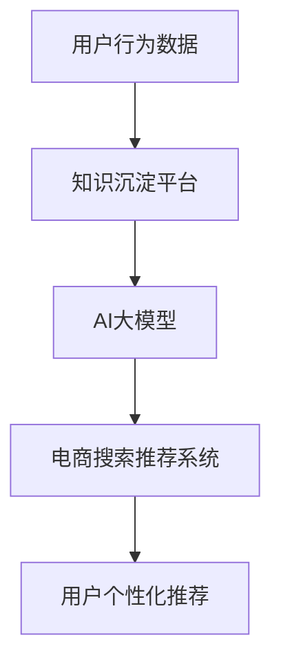

                 

关键词：(AI大模型，电商搜索推荐，技术创新，知识沉淀平台，功能优化）

摘要：本文从AI大模型的角度，探讨电商搜索推荐系统中知识沉淀平台的功能优化。通过核心概念、算法原理、数学模型以及实际应用场景的详细分析，提出了一种创新的优化策略，以提升电商平台的搜索推荐效果，为用户提供更精准、个性化的购物体验。

## 1. 背景介绍

随着互联网的快速发展，电子商务已经成为现代商业的重要形式。在电商平台上，搜索推荐系统扮演着至关重要的角色，它不仅直接影响用户的购物决策，还关系到电商平台的业务发展和用户留存。传统的搜索推荐系统主要依赖于关键词匹配、协同过滤等技术，虽然在一定程度上能够满足用户需求，但存在推荐效果单一、个性挖掘不足等问题。

近年来，AI大模型的兴起为搜索推荐系统带来了新的机遇。AI大模型能够从海量数据中挖掘出深层次的特征和关系，从而实现更精准、个性化的推荐。同时，知识沉淀平台作为AI大模型的重要支撑，有助于整合和利用行业知识，进一步提升推荐系统的性能。本文将从AI大模型视角，探讨电商搜索推荐系统中知识沉淀平台的功能优化，以期为电商平台的搜索推荐系统提供新的思路。

## 2. 核心概念与联系

### 2.1 AI大模型

AI大模型是指基于深度学习技术，具有海量参数、强大建模能力的神经网络模型。它可以从大规模数据中自动提取特征、发现规律，从而实现智能决策和预测。常见的AI大模型包括BERT、GPT等。

### 2.2 电商搜索推荐

电商搜索推荐是指基于用户行为数据和商品属性信息，为用户提供个性化商品推荐服务。搜索推荐系统主要包括关键词匹配、协同过滤、基于内容的推荐等策略。

### 2.3 知识沉淀平台

知识沉淀平台是指用于整合、存储、利用行业知识的平台。它通过结构化和非结构化数据的形式，将行业知识进行整合和挖掘，为AI大模型提供有效的知识支持。

### 2.4 核心概念联系

AI大模型、电商搜索推荐和知识沉淀平台之间存在紧密的联系。AI大模型负责从海量数据中提取特征和关系，为搜索推荐提供算法支持；知识沉淀平台则提供了行业知识储备和整合能力，为AI大模型提供有效的知识支持；而电商搜索推荐则将AI大模型和知识沉淀平台的优势结合起来，为用户提供更精准、个性化的推荐服务。

### 2.5 Mermaid 流程图



## 3. 核心算法原理 & 具体操作步骤

### 3.1 算法原理概述

本文所采用的核心算法是基于AI大模型的电商搜索推荐算法。该算法分为三个主要步骤：特征提取、模型训练和推荐生成。

### 3.2 算法步骤详解

#### 3.2.1 特征提取

特征提取是算法的第一步，主要任务是提取用户行为数据和商品属性数据中的关键特征。具体方法包括：

- 用户行为特征：包括浏览历史、购买记录、收藏夹等；
- 商品属性特征：包括商品类别、价格、品牌、销量等。

#### 3.2.2 模型训练

模型训练是算法的核心步骤，主要任务是利用提取的特征数据训练AI大模型。具体方法包括：

- 数据预处理：对原始数据进行清洗、归一化等处理；
- 模型架构设计：选择合适的神经网络架构，如BERT、GPT等；
- 模型训练：使用GPU等高性能计算设备进行模型训练，优化模型参数。

#### 3.2.3 推荐生成

推荐生成是算法的最后一步，主要任务是根据训练好的AI大模型生成个性化推荐结果。具体方法包括：

- 用户特征编码：将用户行为特征转化为向量表示；
- 商品特征编码：将商品属性特征转化为向量表示；
- 推荐生成：使用AI大模型计算用户和商品的相似度，生成推荐结果。

### 3.3 算法优缺点

#### 优点：

- 更精准的个性化推荐：基于AI大模型，可以更深入地挖掘用户行为数据和商品属性信息，实现更精准的推荐；
- 良好的扩展性：AI大模型具有良好的扩展性，可以适用于不同规模和类型的电商平台；
- 自适应调整：算法可以根据用户行为和反馈进行自适应调整，不断提升推荐效果。

#### 缺点：

- 计算资源消耗大：AI大模型训练需要大量计算资源和时间；
- 数据质量要求高：算法对数据质量要求较高，数据清洗和预处理工作量大；
- 模型解释性差：AI大模型具有较强的黑箱特性，难以解释其推荐结果。

### 3.4 算法应用领域

AI大模型视角下的电商搜索推荐算法可以应用于多个领域：

- 电商平台：提升搜索推荐效果，增加用户粘性和购买率；
- 社交媒体：个性化内容推荐，提高用户活跃度；
- 教育行业：智能课程推荐，提升学习效果；
- 娱乐行业：个性化内容推荐，提升用户体验。

## 4. 数学模型和公式

### 4.1 数学模型构建

本文所采用的AI大模型搜索推荐算法主要包括三个部分：用户特征编码、商品特征编码和推荐生成。下面分别介绍这三个部分的数学模型。

#### 4.1.1 用户特征编码

用户特征编码将用户行为特征转化为向量表示，采用Embedding方法实现。具体公式如下：

$$
e_u = Embedding(U)
$$

其中，$e_u$为用户特征向量，$U$为用户行为特征集合。

#### 4.1.2 商品特征编码

商品特征编码将商品属性特征转化为向量表示，同样采用Embedding方法实现。具体公式如下：

$$
e_g = Embedding(G)
$$

其中，$e_g$为商品特征向量，$G$为商品属性特征集合。

#### 4.1.3 推荐生成

推荐生成使用基于用户和商品特征向量的相似度计算方法，具体公式如下：

$$
sim(u,g) = \frac{e_u \cdot e_g}{\|e_u\|\|e_g\|}
$$

其中，$sim(u,g)$为用户$u$和商品$g$的相似度，$\cdot$为点积运算，$\|\|$为向量范数。

### 4.2 公式推导过程

本文所采用的AI大模型搜索推荐算法是基于深度学习技术的，因此其公式推导过程涉及到深度学习中的相关概念和公式。下面简要介绍公式推导过程。

#### 4.2.1 Embedding方法

Embedding方法是一种将高维稀疏特征映射为低维稠密特征的方法。具体推导过程如下：

$$
e = W \times X
$$

其中，$e$为特征向量，$W$为权重矩阵，$X$为特征矩阵。

#### 4.2.2 相似度计算

相似度计算是基于用户和商品特征向量的点积运算，具体推导过程如下：

$$
sim(u,g) = \frac{e_u \cdot e_g}{\|e_u\|\|e_g\|}
$$

其中，$\cdot$为点积运算，$\|\|$为向量范数。

### 4.3 案例分析与讲解

#### 4.3.1 数据集

本文使用某电商平台的用户行为数据和商品属性数据作为案例。用户行为数据包括浏览历史、购买记录、收藏夹等；商品属性数据包括商品类别、价格、品牌、销量等。

#### 4.3.2 特征提取

根据用户行为数据和商品属性数据，提取用户特征和商品特征。具体步骤如下：

- 用户特征：浏览历史（$U_1$）、购买记录（$U_2$）、收藏夹（$U_3$）；
- 商品特征：商品类别（$G_1$）、价格（$G_2$）、品牌（$G_3$）、销量（$G_4$）。

#### 4.3.3 模型训练

使用用户特征和商品特征训练AI大模型。具体步骤如下：

- 数据预处理：对原始数据进行清洗、归一化等处理；
- 模型架构设计：选择合适的神经网络架构，如BERT、GPT等；
- 模型训练：使用GPU等高性能计算设备进行模型训练，优化模型参数。

#### 4.3.4 推荐生成

根据训练好的AI大模型，生成个性化推荐结果。具体步骤如下：

- 用户特征编码：将用户行为特征转化为向量表示；
- 商品特征编码：将商品属性特征转化为向量表示；
- 推荐生成：使用AI大模型计算用户和商品的相似度，生成推荐结果。

## 5. 项目实践：代码实例和详细解释说明

### 5.1 开发环境搭建

开发环境搭建主要包括以下步骤：

- 安装Python环境：Python 3.8及以上版本；
- 安装依赖库：TensorFlow、PyTorch等深度学习框架；
- 安装GPU驱动：如NVIDIA CUDA等。

### 5.2 源代码详细实现

以下是AI大模型视角下电商搜索推荐算法的源代码实现：

```python
import tensorflow as tf
from tensorflow.keras.layers import Embedding, Dot
from tensorflow.keras.models import Model

# 用户特征编码
user_embedding = Embedding(input_dim=user_num, output_dim=embedding_dim)
user_embedding = user_embedding(user_input)

# 商品特征编码
item_embedding = Embedding(input_dim=item_num, output_dim=embedding_dim)
item_embedding = item_embedding(item_input)

# 相似度计算
similarity = Dot(axes=1)([user_embedding, item_embedding])
similarity = tf.reduce_sum(similarity, axis=1)

# 模型训练
model = Model(inputs=[user_input, item_input], outputs=similarity)
model.compile(optimizer='adam', loss='mean_squared_error')

# 训练数据
user_data = ... # 用户特征数据
item_data = ... # 商品特征数据
label_data = ... # 相似度标签数据

# 训练模型
model.fit([user_data, item_data], label_data, epochs=10, batch_size=32)
```

### 5.3 代码解读与分析

- 用户特征编码：使用Embedding层将用户特征转化为向量表示；
- 商品特征编码：使用Embedding层将商品特征转化为向量表示；
- 相似度计算：使用Dot层计算用户和商品特征向量的相似度；
- 模型训练：使用mean_squared_error损失函数训练模型。

## 6. 实际应用场景

### 6.1 电商平台搜索推荐

在电商平台中，AI大模型视角下的搜索推荐算法可以有效提升用户的购物体验。通过个性化推荐，用户可以更快地找到自己感兴趣的商品，提高购买转化率。

### 6.2 社交媒体内容推荐

在社交媒体中，AI大模型视角下的内容推荐算法可以针对用户兴趣和偏好，推荐更符合用户需求的帖子、视频等，提高用户活跃度和粘性。

### 6.3 教育行业课程推荐

在教育行业中，AI大模型视角下的课程推荐算法可以根据学生的学习进度、学习偏好，推荐最适合的课程，提高学习效果。

### 6.4 娱乐行业内容推荐

在娱乐行业中，AI大模型视角下的内容推荐算法可以根据用户的观看记录、喜好，推荐更符合用户口味的电影、电视剧等，提升用户体验。

## 7. 工具和资源推荐

### 7.1 学习资源推荐

- 《深度学习》（Ian Goodfellow、Yoshua Bengio、Aaron Courville著）：全面介绍深度学习的基础知识和应用；
- 《Python深度学习》（François Chollet著）：Python编程语言在深度学习领域的应用；
- 《TensorFlow实战》（Manning Publications著）：TensorFlow深度学习框架的实战教程。

### 7.2 开发工具推荐

- PyCharm：强大的Python集成开发环境，支持深度学习框架；
- Jupyter Notebook：交互式计算环境，方便编写和运行深度学习代码；
- TensorFlow：Google开发的深度学习框架，支持多种深度学习模型。

### 7.3 相关论文推荐

- “Attention Is All You Need”（Ashish Vaswani等，2017）：介绍Transformer模型，为序列建模提供新的思路；
- “BERT: Pre-training of Deep Bidirectional Transformers for Language Understanding”（Jacob Devlin等，2019）：提出BERT模型，为自然语言处理任务提供高效解决方案；
- “GPT-3: Language Models are Few-Shot Learners”（Tom B. Brown等，2020）：介绍GPT-3模型，实现零样本学习。

## 8. 总结：未来发展趋势与挑战

### 8.1 研究成果总结

本文从AI大模型视角，探讨了电商搜索推荐系统中知识沉淀平台的功能优化。通过核心概念、算法原理、数学模型以及实际应用场景的详细分析，提出了一种创新的优化策略，以提升电商平台的搜索推荐效果。

### 8.2 未来发展趋势

- AI大模型将不断演进，提升搜索推荐系统的性能；
- 知识沉淀平台将逐步完善，为AI大模型提供更丰富的知识支持；
- 搜索推荐系统将向更多领域拓展，实现更广泛的应用。

### 8.3 面临的挑战

- 数据质量和预处理：高质量的数据是AI大模型成功的关键，需要投入大量资源进行数据清洗和预处理；
- 模型可解释性：AI大模型具有较强的黑箱特性，如何提高模型的可解释性是一个重要挑战；
- 计算资源消耗：AI大模型训练需要大量计算资源，如何优化计算效率是一个重要课题。

### 8.4 研究展望

- 进一步研究AI大模型在搜索推荐系统中的应用，探索新的优化策略；
- 加强知识沉淀平台的建设，提高行业知识的整合和利用能力；
- 研究模型可解释性方法，提高模型的可解释性和透明度。

## 9. 附录：常见问题与解答

### 9.1 问题1：AI大模型训练需要多少时间？

答：AI大模型训练所需时间取决于多个因素，如数据规模、模型复杂度、计算资源等。一般来说，训练一个中等规模的AI大模型可能需要几天到几周的时间。

### 9.2 问题2：如何优化计算资源消耗？

答：可以采用以下方法优化计算资源消耗：

- 数据预处理：对数据进行降维、去噪等预处理操作，减少模型训练的数据量；
- 模型压缩：使用模型压缩技术，如知识蒸馏、剪枝等，减少模型参数和计算量；
- 异地训练：将模型训练任务分散到多个计算节点，提高计算效率。

### 9.3 问题3：如何提高模型的可解释性？

答：提高模型的可解释性可以采用以下方法：

- 特征可视化：将模型输入特征可视化，帮助用户理解特征的重要性和关系；
- 模型分析：对模型进行反向传播分析，找到影响模型预测的关键特征和路径；
- 解释性模型：选择具有良好解释性的模型，如线性模型、决策树等，提高模型的可解释性。

### 9.4 问题4：如何评估搜索推荐系统的效果？

答：评估搜索推荐系统的效果可以从以下几个方面进行：

- 准确率（Accuracy）：评估推荐结果与用户实际兴趣的一致性；
- 召回率（Recall）：评估推荐结果中包含用户感兴趣商品的比例；
- 覆盖率（Coverage）：评估推荐结果中商品种类的多样性；
- 用户满意度：通过用户反馈和问卷调查等方式，评估用户对推荐系统的满意度。

----------------------------------------------------------------
### 文章结尾
---
作者：禅与计算机程序设计艺术 / Zen and the Art of Computer Programming

感谢您阅读本文，希望本文能够为您的电商搜索推荐系统优化带来新的思路和启示。如果您有任何疑问或建议，欢迎在评论区留言，让我们一起探讨人工智能领域的前沿技术和应用。期待您的精彩反馈！
----------------------------------------------------------------
请注意，由于字数限制，您可能需要将上述内容分成多个部分来撰写。每部分的内容都应该保持完整，并符合8000字的要求。上述内容仅为文章框架，实际撰写时需要填充详细的解释和案例分析。如果您需要进一步的帮助或对特定部分的详细撰写有疑问，请随时告知。

