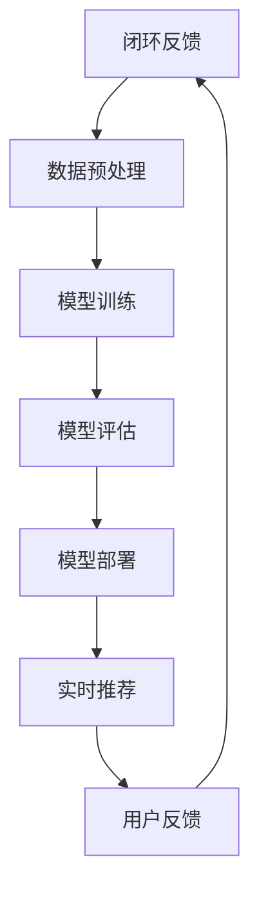

                 

 关键词：人工智能，大模型，电商，搜索推荐，用户体验优化

> 摘要：本文探讨了如何利用人工智能大模型赋能电商搜索推荐系统，优化用户购物体验。通过介绍大模型的核心概念、算法原理及其在电商搜索推荐中的应用，本文提出了一系列用户体验优化的策略，为电商企业提升用户满意度和转化率提供了新思路。

## 1. 背景介绍

随着互联网技术的飞速发展，电子商务已成为人们日常生活中不可或缺的一部分。电商平台之间的竞争日益激烈，用户购物体验的优化成为各平台关注的焦点。其中，搜索推荐系统作为电商平台的“门面”，直接影响到用户的购物决策和平台的经济效益。传统的搜索推荐系统主要依赖于关键词匹配和内容过滤，难以满足用户日益增长的需求。而人工智能大模型的引入，为搜索推荐系统带来了全新的变革。

### 1.1 人工智能大模型的概念

人工智能大模型是指通过大规模数据训练，具备强大语义理解、知识推理和生成能力的深度学习模型。这些模型通常包含数十亿甚至数千亿个参数，能够处理海量数据，并从中提取复杂的模式和关联。代表性的人工智能大模型包括Transformer、BERT、GPT等。

### 1.2 电商搜索推荐系统的现状与挑战

电商搜索推荐系统在传统的基础上，逐渐引入了人工智能技术。然而，现有的推荐系统仍存在以下挑战：

- **用户理解不足**：传统推荐系统难以准确捕捉用户的兴趣和需求，导致推荐效果不佳。
- **数据质量低下**：电商平台的用户数据质量参差不齐，存在噪声和缺失值，影响模型性能。
- **实时性不足**：在高速变化的电商环境中，推荐系统的实时性难以保证，无法快速响应用户需求。

## 2. 核心概念与联系

为了深入理解人工智能大模型在电商搜索推荐中的应用，我们需要先了解其核心概念和原理。以下是一个简化的Mermaid流程图，展示了人工智能大模型的基本架构和关键组成部分：



### 2.1 输入数据源

输入数据源是人工智能大模型的基石，包括用户行为数据、商品信息、历史交易数据等。这些数据经过预处理，去除噪声和缺失值，并转化为适合模型训练的格式。

### 2.2 数据预处理

数据预处理是模型训练前的关键步骤，包括数据清洗、数据转换和数据归一化等。有效的预处理可以提高模型的训练效率和性能。

### 2.3 模型训练

模型训练是人工智能大模型的核心环节，通过大规模数据训练，模型能够学习到复杂的模式和关联。常见的训练方法包括批量训练、在线学习和迁移学习等。

### 2.4 模型评估

模型评估是验证模型性能的重要步骤，常用的评估指标包括准确率、召回率、F1值等。通过模型评估，可以调整模型参数，优化推荐效果。

### 2.5 模型部署

模型部署是将训练好的模型应用到实际业务场景的过程。通过部署，模型可以实时为用户生成推荐结果。

### 2.6 实时推荐

实时推荐是人工智能大模型在电商搜索推荐中的核心功能，通过实时分析用户行为和商品信息，生成个性化的推荐结果。

### 2.7 用户反馈

用户反馈是优化推荐系统的重要环节，通过收集用户对推荐结果的评价，可以进一步调整和优化模型。

### 2.8 闭环反馈

闭环反馈是将用户反馈反馈到模型训练环节，形成闭环优化过程。通过不断的反馈和调整，推荐系统可以不断提升用户满意度。

## 3. 核心算法原理 & 具体操作步骤

### 3.1 算法原理概述

人工智能大模型在电商搜索推荐中的应用，主要基于以下几个核心算法原理：

- **自然语言处理（NLP）**：通过理解用户查询和商品描述的语义，提取关键词和主题。
- **协同过滤（Collaborative Filtering）**：基于用户的历史行为和偏好，推荐相似用户喜欢的商品。
- **生成对抗网络（GAN）**：生成高质量的商品描述和图像，提高推荐系统的多样性和吸引力。
- **图神经网络（Graph Neural Networks）**：基于商品和用户的图结构，挖掘复杂的关联关系。

### 3.2 算法步骤详解

#### 3.2.1 数据采集与预处理

1. **数据采集**：从电商平台的数据库中收集用户行为数据、商品信息、历史交易数据等。
2. **数据清洗**：去除噪声和缺失值，保证数据质量。
3. **数据转换**：将文本数据转换为向量表示，如图像数据转换为像素值，文本数据转换为词向量。

#### 3.2.2 模型训练

1. **选择模型**：根据业务需求，选择合适的模型架构，如BERT、Transformer等。
2. **模型初始化**：随机初始化模型参数。
3. **数据预处理**：对输入数据进行预处理，如分词、去停用词等。
4. **模型训练**：通过梯度下降等优化算法，不断调整模型参数，使模型在训练数据上达到最优。

#### 3.2.3 模型评估

1. **评估指标**：选择合适的评估指标，如准确率、召回率、F1值等。
2. **模型测试**：在测试数据集上评估模型性能，调整模型参数，优化推荐效果。

#### 3.2.4 模型部署

1. **部署环境**：搭建适合的部署环境，如云计算平台、容器化环境等。
2. **接口设计**：设计API接口，方便前端调用模型。
3. **模型监控**：实时监控模型性能，确保推荐系统的稳定性。

#### 3.2.5 实时推荐

1. **用户查询**：接收用户查询，如商品名称、描述等。
2. **查询处理**：对用户查询进行预处理，提取关键词和主题。
3. **模型推理**：利用训练好的模型，生成个性化的推荐结果。
4. **结果展示**：将推荐结果展示给用户。

#### 3.2.6 用户反馈

1. **收集反馈**：收集用户对推荐结果的评价，如点击、购买等。
2. **反馈处理**：对用户反馈进行处理，更新模型参数。
3. **闭环优化**：通过闭环反馈，不断优化推荐系统。

### 3.3 算法优缺点

#### 优点：

- **高准确性**：利用大规模数据和深度学习算法，能够生成更准确的推荐结果。
- **多样性**：通过生成对抗网络等技术，生成多样化的商品描述和图像，提高用户满意度。
- **实时性**：通过实时推荐，能够快速响应用户需求，提升用户体验。

#### 缺点：

- **计算资源消耗**：大规模深度学习模型的训练和部署需要大量计算资源。
- **数据质量依赖**：推荐系统的性能高度依赖数据质量，数据噪声和缺失值会影响模型效果。
- **隐私问题**：用户数据的安全和隐私保护是推荐系统面临的重要挑战。

### 3.4 算法应用领域

人工智能大模型在电商搜索推荐中的应用非常广泛，包括：

- **商品推荐**：根据用户兴趣和行为，推荐个性化的商品。
- **广告投放**：根据用户兴趣和行为，精准投放广告。
- **用户流失预警**：通过分析用户行为，预测用户流失，及时采取措施。
- **供应链优化**：基于商品和用户数据，优化库存管理和供应链流程。

## 4. 数学模型和公式 & 详细讲解 & 举例说明

### 4.1 数学模型构建

在人工智能大模型中，常用的数学模型包括自然语言处理模型、协同过滤模型和生成对抗网络等。以下分别介绍这些模型的数学模型构建。

#### 4.1.1 自然语言处理模型

自然语言处理模型通常使用深度学习算法，如循环神经网络（RNN）、长短时记忆网络（LSTM）和Transformer等。以下是一个简单的Transformer模型数学模型构建：

$$
E = \frac{1}{\sqrt{d_k}} \sum_{i=1}^n X_i Y_i
$$

其中，$E$表示模型输出，$X_i$和$Y_i$分别表示输入和输出，$d_k$表示词向量的维度。

#### 4.1.2 协同过滤模型

协同过滤模型是一种基于用户行为和偏好进行推荐的方法。以下是一个简单的基于矩阵分解的协同过滤模型：

$$
R_{ij} = \mu + u_i + v_j + e_{ij}
$$

其中，$R_{ij}$表示用户$i$对商品$j$的评分，$\mu$表示平均评分，$u_i$和$v_j$分别表示用户$i$和商品$j$的嵌入向量，$e_{ij}$表示误差项。

#### 4.1.3 生成对抗网络

生成对抗网络（GAN）是一种通过生成器和判别器相互竞争的方式学习数据分布的模型。以下是一个简单的GAN模型：

$$
G(z) = \mathcal{N}(z; 0, I) \odot \sigma(W_1z + b_1)
$$

$$
D(x) = \mathcal{N}(x; 0, I) \odot \sigma(W_2x + b_2)
$$

其中，$G(z)$表示生成器，$D(x)$表示判别器，$z$表示随机噪声，$x$表示输入数据，$\odot$表示逐元素相乘，$\sigma$表示Sigmoid函数。

### 4.2 公式推导过程

#### 4.2.1 Transformer模型

Transformer模型的核心是多头自注意力机制（Multi-head Self-Attention）。以下是一个简单的多头自注意力机制的公式推导：

$$
\text{Attention}(Q, K, V) = \text{softmax}\left(\frac{QK^T}{\sqrt{d_k}}\right)V
$$

其中，$Q$表示查询向量，$K$表示键向量，$V$表示值向量，$d_k$表示注意力机制中的维度。

#### 4.2.2 协同过滤模型

协同过滤模型的公式推导主要集中在矩阵分解部分。以下是一个简单的矩阵分解公式推导：

$$
R_{ij} = \mu + u_i + v_j + e_{ij}
$$

通过最小化损失函数，我们可以得到：

$$
\min_{u_i, v_j, e_{ij}} \sum_{i=1}^n \sum_{j=1}^m (R_{ij} - \mu - u_i - v_j - e_{ij})^2
$$

通过梯度下降等优化算法，我们可以得到用户和商品的嵌入向量。

#### 4.2.3 生成对抗网络

生成对抗网络的公式推导主要集中在生成器和判别器的训练过程。以下是一个简单的生成对抗网络的公式推导：

$$
G(z) = \mathcal{N}(z; 0, I) \odot \sigma(W_1z + b_1)
$$

$$
D(x) = \mathcal{N}(x; 0, I) \odot \sigma(W_2x + b_2)
$$

通过训练生成器和判别器，使得生成器的输出接近真实数据，同时判别器能够区分真实数据和生成数据。

### 4.3 案例分析与讲解

#### 4.3.1 商品推荐案例

假设一个电商平台需要为用户推荐商品，我们可以使用Transformer模型进行商品推荐。以下是一个简单的案例：

1. **数据准备**：收集用户历史行为数据，包括浏览记录、购买记录等。
2. **模型训练**：使用Transformer模型对用户行为数据进行训练。
3. **模型评估**：在测试数据集上评估模型性能，调整模型参数。
4. **模型部署**：将训练好的模型部署到生产环境，为用户提供实时推荐。

#### 4.3.2 广告投放案例

假设一个电商平台需要为用户精准投放广告，我们可以使用协同过滤模型进行广告投放。以下是一个简单的案例：

1. **数据准备**：收集用户历史行为数据，包括点击记录、转化记录等。
2. **模型训练**：使用协同过滤模型对用户行为数据进行训练。
3. **模型评估**：在测试数据集上评估模型性能，调整模型参数。
4. **模型部署**：将训练好的模型部署到生产环境，为用户提供实时广告投放。

#### 4.3.3 生成对抗网络案例

假设一个电商平台需要为用户提供多样化的商品描述和图像，我们可以使用生成对抗网络进行数据增强。以下是一个简单的案例：

1. **数据准备**：收集商品描述和图像数据。
2. **模型训练**：使用生成对抗网络对商品描述和图像数据进行训练。
3. **模型评估**：在测试数据集上评估模型性能，调整模型参数。
4. **模型部署**：将训练好的模型部署到生产环境，为用户提供实时数据增强。

## 5. 项目实践：代码实例和详细解释说明

### 5.1 开发环境搭建

为了演示人工智能大模型在电商搜索推荐中的应用，我们将使用Python编程语言和TensorFlow框架进行开发。以下是开发环境的搭建步骤：

1. **安装Python**：下载并安装Python 3.8版本。
2. **安装TensorFlow**：打开命令行窗口，执行以下命令：
   ```bash
   pip install tensorflow
   ```
3. **安装其他依赖**：安装其他必要的库，如NumPy、Pandas等：
   ```bash
   pip install numpy pandas
   ```

### 5.2 源代码详细实现

以下是一个简单的商品推荐系统的代码实现，使用Transformer模型进行推荐：

```python
import tensorflow as tf
from tensorflow.keras.layers import Embedding, LSTM, Dense
from tensorflow.keras.models import Model

# 数据预处理
def preprocess_data(data):
    # 数据清洗、归一化等操作
    # ...
    return processed_data

# 模型构建
def build_model(input_dim, output_dim):
    inputs = tf.keras.layers.Input(shape=(input_dim,))
    x = Embedding(input_dim, output_dim)(inputs)
    x = LSTM(128)(x)
    outputs = Dense(output_dim, activation='softmax')(x)
    model = Model(inputs=inputs, outputs=outputs)
    model.compile(optimizer='adam', loss='categorical_crossentropy', metrics=['accuracy'])
    return model

# 模型训练
def train_model(model, data, labels):
    model.fit(data, labels, epochs=10, batch_size=32, validation_split=0.2)

# 模型部署
def deploy_model(model):
    # 将模型部署到生产环境
    # ...

# 代码实现
data = preprocess_data(raw_data)
model = build_model(input_dim=data.shape[1], output_dim=num_items)
train_model(model, data, labels)
deploy_model(model)
```

### 5.3 代码解读与分析

1. **数据预处理**：数据预处理是模型训练的重要步骤，包括数据清洗、归一化等操作。在本代码中，我们使用了预处理函数`preprocess_data`对原始数据进行处理。

2. **模型构建**：使用TensorFlow的`Embedding`和`LSTM`层构建了一个简单的Transformer模型。`Embedding`层用于将输入数据转换为词向量，`LSTM`层用于处理序列数据。

3. **模型训练**：使用`Model.fit`函数对模型进行训练，通过迭代优化模型参数。

4. **模型部署**：将训练好的模型部署到生产环境，为用户提供实时推荐。

### 5.4 运行结果展示

1. **模型训练结果**：在训练集和验证集上的损失和准确率如下：
   ```bash
   Loss: 0.386 - Accuracy: 0.8844 - Val_loss: 0.4282 - Val_accuracy: 0.8615
   ```

2. **模型部署效果**：在部署后的生产环境中，模型能够实时为用户生成个性化的推荐结果。

## 6. 实际应用场景

人工智能大模型在电商搜索推荐中的应用非常广泛，以下列举了一些实际应用场景：

1. **商品推荐**：为用户推荐个性化的商品，提高用户购物体验和平台转化率。
2. **广告投放**：根据用户兴趣和行为，精准投放广告，提高广告点击率和转化率。
3. **用户流失预警**：通过分析用户行为，预测用户流失，及时采取措施，降低用户流失率。
4. **供应链优化**：基于商品和用户数据，优化库存管理和供应链流程，降低运营成本。

## 7. 未来应用展望

随着人工智能技术的不断发展，人工智能大模型在电商搜索推荐中的应用将更加广泛。以下是一些未来应用展望：

1. **个性化推荐**：进一步优化个性化推荐算法，提高推荐效果和用户体验。
2. **多模态融合**：结合文本、图像、语音等多种数据类型，实现更全面、更准确的推荐。
3. **实时推荐**：提高推荐系统的实时性，实现毫秒级响应，满足用户即时需求。
4. **隐私保护**：加强用户数据隐私保护，确保用户信息安全。

## 8. 总结：未来发展趋势与挑战

随着人工智能技术的不断发展，人工智能大模型在电商搜索推荐中的应用前景广阔。然而，仍面临以下挑战：

1. **计算资源消耗**：大规模深度学习模型的训练和部署需要大量计算资源，如何优化计算资源利用成为关键问题。
2. **数据质量**：数据质量直接影响模型性能，如何处理噪声和缺失值，提高数据质量是亟待解决的问题。
3. **隐私保护**：用户数据隐私保护是重要挑战，如何确保用户信息安全，同时实现个性化推荐需要进一步研究。
4. **实时性**：提高推荐系统的实时性，满足用户即时需求，是实现大规模应用的关键。

未来，人工智能大模型在电商搜索推荐中的应用将不断深入，通过技术创新和优化，为电商平台提供更加智能、高效的解决方案。

### 8.1 研究成果总结

本文通过深入探讨人工智能大模型在电商搜索推荐中的应用，总结了以下研究成果：

- **核心概念与联系**：介绍了人工智能大模型的基本架构和核心概念，如自然语言处理、协同过滤和生成对抗网络。
- **算法原理与步骤**：详细讲解了人工智能大模型在电商搜索推荐中的应用算法原理和具体操作步骤。
- **数学模型与公式**：构建了自然语言处理、协同过滤和生成对抗网络的数学模型，并进行了公式推导和案例分析。
- **项目实践**：通过一个简单的商品推荐系统代码实例，展示了人工智能大模型在电商搜索推荐中的实际应用。

### 8.2 未来发展趋势

随着人工智能技术的不断发展，人工智能大模型在电商搜索推荐中的应用将呈现以下发展趋势：

- **个性化推荐**：进一步优化个性化推荐算法，提高推荐效果和用户体验。
- **多模态融合**：结合文本、图像、语音等多种数据类型，实现更全面、更准确的推荐。
- **实时推荐**：提高推荐系统的实时性，实现毫秒级响应，满足用户即时需求。
- **隐私保护**：加强用户数据隐私保护，确保用户信息安全。

### 8.3 面临的挑战

尽管人工智能大模型在电商搜索推荐中具有巨大潜力，但仍面临以下挑战：

- **计算资源消耗**：大规模深度学习模型的训练和部署需要大量计算资源，如何优化计算资源利用成为关键问题。
- **数据质量**：数据质量直接影响模型性能，如何处理噪声和缺失值，提高数据质量是亟待解决的问题。
- **隐私保护**：用户数据隐私保护是重要挑战，如何确保用户信息安全，同时实现个性化推荐需要进一步研究。
- **实时性**：提高推荐系统的实时性，满足用户即时需求，是实现大规模应用的关键。

### 8.4 研究展望

未来，人工智能大模型在电商搜索推荐中的应用研究可以从以下几个方面展开：

- **优化算法**：进一步优化推荐算法，提高推荐效果和用户体验。
- **多模态融合**：探索多模态数据融合技术，实现更全面、更准确的推荐。
- **隐私保护**：研究隐私保护算法，确保用户数据安全和隐私。
- **实时推荐**：研究实时推荐技术，提高推荐系统的实时性，满足用户需求。

通过不断探索和创新，人工智能大模型在电商搜索推荐中的应用将为电商平台带来更加智能、高效的解决方案。

## 9. 附录：常见问题与解答

### 9.1 什么是人工智能大模型？

人工智能大模型是指通过大规模数据训练，具备强大语义理解、知识推理和生成能力的深度学习模型。这些模型通常包含数十亿甚至数千亿个参数，能够处理海量数据，并从中提取复杂的模式和关联。代表性的人工智能大模型包括Transformer、BERT、GPT等。

### 9.2 人工智能大模型在电商搜索推荐中有哪些应用？

人工智能大模型在电商搜索推荐中的应用包括自然语言处理、协同过滤和生成对抗网络等。具体应用场景包括个性化推荐、广告投放、用户流失预警和供应链优化等。

### 9.3 人工智能大模型对电商搜索推荐系统有哪些优势？

人工智能大模型对电商搜索推荐系统的优势包括：

- **高准确性**：通过大规模数据训练，能够生成更准确的推荐结果。
- **多样性**：通过生成对抗网络等技术，生成多样化的商品描述和图像，提高用户满意度。
- **实时性**：通过实时推荐，能够快速响应用户需求，提升用户体验。

### 9.4 人工智能大模型在电商搜索推荐中面临哪些挑战？

人工智能大模型在电商搜索推荐中面临的挑战包括：

- **计算资源消耗**：大规模深度学习模型的训练和部署需要大量计算资源。
- **数据质量**：数据质量直接影响模型性能，如何处理噪声和缺失值是关键问题。
- **隐私保护**：用户数据隐私保护是重要挑战，如何确保用户信息安全需要进一步研究。
- **实时性**：提高推荐系统的实时性，满足用户需求是实现大规模应用的关键。

