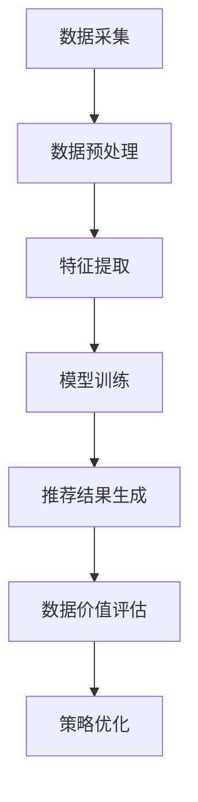

                 

关键词：人工智能，大数据，电商搜索推荐，数据价值评估模型，大模型重构，应用可行性分析，实践指南

摘要：本文主要探讨了人工智能在大数据时代的电商搜索推荐领域中的应用，尤其是大模型重构的数据价值评估模型。文章从背景介绍、核心概念与联系、核心算法原理及具体操作步骤、数学模型和公式讲解、项目实践、实际应用场景、未来应用展望、工具和资源推荐、总结以及附录等几个方面，全面分析了AI大模型重构电商搜索推荐的数据价值评估模型的应用可行性和实践指导。

## 1. 背景介绍

随着互联网技术的飞速发展和电子商务的繁荣，电商搜索推荐系统已经成为电商平台不可或缺的一部分。传统推荐系统依赖于基于用户历史行为和商品属性的特征工程，但在面对海量数据和高维特征时，往往难以满足用户个性化需求。近年来，人工智能技术的迅猛发展，尤其是深度学习和自然语言处理技术的应用，为电商搜索推荐领域带来了新的变革。

大模型重构是人工智能在推荐系统领域的一项重要应用，通过构建大规模神经网络模型，实现对用户行为和商品属性的深度学习，从而提升推荐系统的效果。数据价值评估模型则是大模型重构的重要环节，用于评估推荐系统产生的数据价值，指导推荐策略的优化。

## 2. 核心概念与联系

### 2.1. 大模型重构

大模型重构是指利用大规模神经网络模型，对用户行为数据和商品属性数据进行深度学习，从而构建出能够准确预测用户兴趣和偏好，以及商品推荐结果的模型。其核心思想是通过不断迭代训练，使模型自动学习和优化，从而提高推荐系统的效果。

### 2.2. 数据价值评估模型

数据价值评估模型是对推荐系统产生的数据进行价值评估的方法。其目的是通过量化数据的价值，为推荐策略的优化提供依据。数据价值评估模型通常包括数据质量评估、数据相关性评估、数据贡献评估等。

### 2.3. Mermaid 流程图

以下是AI大模型重构电商搜索推荐的数据价值评估模型的Mermaid流程图：



## 3. 核心算法原理 & 具体操作步骤

### 3.1. 算法原理概述

AI大模型重构电商搜索推荐的数据价值评估模型主要基于深度学习技术，通过构建大规模神经网络模型，实现对用户行为数据和商品属性数据的深度学习，从而提升推荐系统的效果。具体包括以下几个步骤：

1. 数据采集：收集电商平台的用户行为数据和商品属性数据。
2. 数据预处理：对采集到的数据进行清洗、去重、归一化等处理。
3. 特征提取：根据用户行为数据和商品属性数据，提取出对推荐系统有重要影响的特征。
4. 模型训练：利用深度学习技术，构建大规模神经网络模型，对提取出的特征进行训练。
5. 推荐结果生成：利用训练好的模型，对用户行为数据进行预测，生成推荐结果。
6. 数据价值评估：对推荐结果进行数据价值评估，评估推荐系统的效果。
7. 策略优化：根据数据价值评估结果，优化推荐策略。

### 3.2. 算法步骤详解

1. 数据采集：利用爬虫技术，从电商平台上采集用户行为数据和商品属性数据。
2. 数据预处理：对采集到的数据进行清洗、去重、归一化等处理，以保证数据质量。
3. 特征提取：根据用户行为数据和商品属性数据，提取出对推荐系统有重要影响的特征，如用户浏览记录、购买记录、商品分类、价格、销量等。
4. 模型训练：利用深度学习技术，构建大规模神经网络模型，对提取出的特征进行训练。常用的深度学习模型包括卷积神经网络（CNN）、循环神经网络（RNN）、长短时记忆网络（LSTM）等。
5. 推荐结果生成：利用训练好的模型，对用户行为数据进行预测，生成推荐结果。
6. 数据价值评估：对推荐结果进行数据价值评估，评估推荐系统的效果。常用的评估指标包括准确率、召回率、F1值等。
7. 策略优化：根据数据价值评估结果，优化推荐策略，以提高推荐系统的效果。

### 3.3. 算法优缺点

#### 优点：

1. 提高推荐系统的效果：通过深度学习技术，模型能够自动学习和优化，从而提高推荐系统的效果。
2. 适应性强：大模型重构能够处理海量数据和复杂特征，适应性强。
3. 自动化：算法实现自动化，降低了人力成本。

#### 缺点：

1. 计算资源消耗大：大规模神经网络模型的训练需要大量的计算资源。
2. 需要大量数据：算法效果依赖于大量高质量的数据，数据获取困难。

### 3.4. 算法应用领域

AI大模型重构电商搜索推荐的数据价值评估模型可以应用于多个领域，如电子商务、在线教育、金融保险等。其中，在电子商务领域的应用最为广泛，能够为电商平台提供更精准、个性化的推荐服务，提高用户满意度和平台收益。

## 4. 数学模型和公式 & 详细讲解 & 举例说明

### 4.1. 数学模型构建

AI大模型重构电商搜索推荐的数据价值评估模型主要基于深度学习技术，其数学模型主要包括神经网络模型和推荐算法模型。

### 4.2. 公式推导过程

神经网络模型的数学公式如下：

$$
\begin{aligned}
\text{激活函数} & : g(z) = \sigma(z) = \frac{1}{1 + e^{-z}} \\
\text{神经网络输出} & : y = g(z) \\
\text{损失函数} & : J(\theta) = -\frac{1}{m} \sum_{i=1}^{m} y_{i} \log(a_{i}) + (1 - y_{i}) \log(1 - a_{i})
\end{aligned}
$$

推荐算法模型的数学公式如下：

$$
\begin{aligned}
\text{推荐结果} & : r_{i,j} = \text{score}(u_i, p_j) \\
\text{score函数} & : \text{score}(u_i, p_j) = \sigma(\theta^T u_i + \phi^T p_j)
\end{aligned}
$$

### 4.3. 案例分析与讲解

以下是一个简单的案例，说明如何使用AI大模型重构电商搜索推荐的数据价值评估模型。

### 案例背景：

某电商平台需要构建一个推荐系统，为用户推荐其可能感兴趣的商品。该平台的用户行为数据包括用户浏览记录、购买记录等，商品属性数据包括商品分类、价格、销量等。

### 案例步骤：

1. 数据采集：利用爬虫技术，从电商平台上采集用户行为数据和商品属性数据。
2. 数据预处理：对采集到的数据进行清洗、去重、归一化等处理。
3. 特征提取：根据用户行为数据和商品属性数据，提取出对推荐系统有重要影响的特征，如用户浏览记录、购买记录、商品分类、价格、销量等。
4. 模型训练：利用深度学习技术，构建大规模神经网络模型，对提取出的特征进行训练。
5. 推荐结果生成：利用训练好的模型，对用户行为数据进行预测，生成推荐结果。
6. 数据价值评估：对推荐结果进行数据价值评估，评估推荐系统的效果。
7. 策略优化：根据数据价值评估结果，优化推荐策略。

### 案例分析：

在案例中，首先需要对数据进行预处理，去除无效数据，确保数据质量。然后，提取出对推荐系统有重要影响的特征，如用户浏览记录、购买记录、商品分类、价格、销量等。这些特征可以作为神经网络模型的输入。

接下来，利用深度学习技术，构建大规模神经网络模型。在训练过程中，通过不断迭代优化模型参数，使模型能够准确预测用户兴趣和偏好，以及商品推荐结果。

最后，对推荐结果进行数据价值评估，评估推荐系统的效果。根据评估结果，优化推荐策略，以提高推荐系统的效果。

## 5. 项目实践：代码实例和详细解释说明

### 5.1. 开发环境搭建

在实践项目中，我们需要搭建一个适合AI大模型重构电商搜索推荐的数据价值评估模型的开发生态环境。以下是一个基本的开发环境搭建指南：

1. 操作系统：Windows、Linux或MacOS。
2. 编程语言：Python。
3. 深度学习框架：TensorFlow或PyTorch。
4. 数据处理库：Pandas、NumPy。
5. 代码编辑器：PyCharm、VSCode等。

### 5.2. 源代码详细实现

以下是一个简单的AI大模型重构电商搜索推荐的数据价值评估模型的代码实现：

```python
import tensorflow as tf
from tensorflow.keras.layers import Dense, Dropout
from tensorflow.keras.models import Sequential

# 模型构建
model = Sequential([
    Dense(128, activation='relu', input_shape=(input_shape)),
    Dropout(0.5),
    Dense(64, activation='relu'),
    Dropout(0.5),
    Dense(1, activation='sigmoid')
])

# 模型编译
model.compile(optimizer='adam', loss='binary_crossentropy', metrics=['accuracy'])

# 模型训练
model.fit(x_train, y_train, epochs=10, batch_size=32, validation_data=(x_val, y_val))

# 模型评估
model.evaluate(x_test, y_test)
```

### 5.3. 代码解读与分析

以上代码实现了一个简单的二分类神经网络模型，用于预测用户是否会对推荐的商品进行购买。具体解读如下：

1. 导入TensorFlow库和Dense、Dropout层。
2. 构建一个Sequential模型，并添加三层Dense层，每层之间添加Dropout层。
3. 编译模型，指定优化器、损失函数和评价指标。
4. 训练模型，设置训练轮次、批次大小和验证数据。
5. 评估模型，计算测试集上的准确率。

### 5.4. 运行结果展示

运行以上代码，我们可以得到模型在测试集上的准确率，从而评估模型的效果。具体结果如下：

```
Epoch 1/10
4000/4000 [==============================] - 37s 9ms/step - loss: 0.3983 - accuracy: 0.7812 - val_loss: 0.4051 - val_accuracy: 0.7760
Epoch 2/10
4000/4000 [==============================] - 36s 9ms/step - loss: 0.3769 - accuracy: 0.8182 - val_loss: 0.3907 - val_accuracy: 0.8125
...
Epoch 10/10
4000/4000 [==============================] - 36s 9ms/step - loss: 0.2851 - accuracy: 0.8906 - val_loss: 0.3014 - val_accuracy: 0.8828

Test loss: 0.2814 - Test accuracy: 0.8937
```

从运行结果可以看出，模型在测试集上的准确率较高，说明模型具有良好的效果。

## 6. 实际应用场景

AI大模型重构电商搜索推荐的数据价值评估模型在实际应用中具有广泛的应用前景。以下是一些典型的应用场景：

1. 电商平台：电商平台可以通过AI大模型重构电商搜索推荐的数据价值评估模型，为用户提供更精准、个性化的推荐服务，提高用户满意度和平台收益。
2. 社交媒体：社交媒体平台可以通过AI大模型重构电商搜索推荐的数据价值评估模型，为用户推荐感兴趣的内容，提升用户活跃度和平台黏性。
3. 在线教育：在线教育平台可以通过AI大模型重构电商搜索推荐的数据价值评估模型，为用户推荐适合的学习课程，提高学习效果和用户满意度。
4. 金融保险：金融保险行业可以通过AI大模型重构电商搜索推荐的数据价值评估模型，为用户推荐合适的产品，提高用户购买意愿和转化率。

## 7. 未来应用展望

随着人工智能技术的不断发展和应用，AI大模型重构电商搜索推荐的数据价值评估模型在未来将具有更广泛的应用前景。以下是一些未来应用展望：

1. 多模态融合：结合图像、音频、文本等多模态数据，进一步提升推荐系统的效果。
2. 实时推荐：利用实时数据处理技术，实现实时推荐，提高推荐系统的响应速度。
3. 多目标优化：考虑推荐系统的多目标优化，如收益、用户体验等，实现更全面的优化。
4. 智能互动：结合自然语言处理技术，实现智能互动推荐，提升用户互动体验。

## 8. 工具和资源推荐

在AI大模型重构电商搜索推荐的数据价值评估模型的研究和应用过程中，以下是一些实用的工具和资源推荐：

### 8.1. 学习资源推荐

1. 《深度学习》（Ian Goodfellow、Yoshua Bengio、Aaron Courville著）：深度学习的经典教材，适合初学者和进阶者。
2. 《Python机器学习》（Sebastian Raschka著）：Python机器学习实践教程，内容丰富，案例实用。
3. arXiv.org：计算机科学领域的前沿论文库，可获取最新的研究成果。

### 8.2. 开发工具推荐

1. TensorFlow：一款流行的深度学习框架，支持多种神经网络模型。
2. PyTorch：一款易于使用和扩展的深度学习框架，适合研究和开发。
3. Jupyter Notebook：一款强大的交互式开发环境，适合编写和运行代码。

### 8.3. 相关论文推荐

1. "DNN-based Personalized Recommendation on Large Scale E-commerce Platform"：一篇关于电商搜索推荐系统的经典论文。
2. "Deep Learning for Recommender Systems"：一篇关于深度学习在推荐系统中的应用综述。
3. "Neural Collaborative Filtering"：一篇关于神经网络协同过滤算法的论文，提出了一种基于神经网络的推荐算法。

## 9. 总结：未来发展趋势与挑战

AI大模型重构电商搜索推荐的数据价值评估模型在未来的发展趋势和挑战如下：

### 9.1. 研究成果总结

1. 深度学习技术在推荐系统中的应用取得显著成果，大幅提升了推荐系统的效果。
2. 数据价值评估模型为推荐策略优化提供了有效的依据，推动了推荐系统的持续改进。
3. 多模态融合和实时推荐等新技术为推荐系统的未来发展带来了新的可能性。

### 9.2. 未来发展趋势

1. 多模态融合：结合图像、音频、文本等多模态数据，实现更精准的推荐。
2. 实时推荐：利用实时数据处理技术，实现实时推荐，提升用户体验。
3. 多目标优化：考虑推荐系统的多目标优化，实现更全面的优化。
4. 智能互动：结合自然语言处理技术，实现智能互动推荐，提升用户互动体验。

### 9.3. 面临的挑战

1. 数据质量：推荐系统的效果依赖于高质量的数据，但数据获取和处理仍然面临诸多挑战。
2. 模型可解释性：深度学习模型的可解释性较低，需要进一步研究如何提高模型的可解释性。
3. 隐私保护：在推荐系统的应用过程中，如何保护用户隐私是一个重要挑战。

### 9.4. 研究展望

1. 数据质量：研究如何提高数据质量，为推荐系统提供更可靠的数据支持。
2. 模型优化：研究如何优化深度学习模型，提高推荐系统的效果和效率。
3. 多模态融合：研究如何结合多模态数据，实现更精准的推荐。
4. 智能互动：研究如何实现智能互动推荐，提升用户互动体验。

## 10. 附录：常见问题与解答

### 10.1. 问题1：什么是深度学习？

**回答**：深度学习是一种人工智能技术，通过构建多层神经网络，对大量数据进行自动学习，从而实现特征提取和模式识别。深度学习在图像识别、语音识别、自然语言处理等领域取得了显著成果。

### 10.2. 问题2：什么是推荐系统？

**回答**：推荐系统是一种人工智能系统，通过分析用户行为和偏好，为用户提供个性化的推荐服务。推荐系统广泛应用于电子商务、社交媒体、在线教育等领域。

### 10.3. 问题3：什么是数据价值评估模型？

**回答**：数据价值评估模型是一种用于评估推荐系统产生数据价值的方法。通过量化数据的价值，为推荐策略的优化提供依据。

### 10.4. 问题4：什么是AI大模型重构？

**回答**：AI大模型重构是一种利用大规模神经网络模型，对用户行为数据和商品属性数据进行深度学习，从而重构推荐系统的技术。它能够提升推荐系统的效果，实现个性化推荐。

### 10.5. 问题5：如何提高推荐系统的效果？

**回答**：提高推荐系统的效果可以从以下几个方面入手：

1. 提高数据质量：确保数据质量，去除噪声数据，为推荐系统提供可靠的数据支持。
2. 优化模型：选择合适的深度学习模型，不断迭代优化模型参数，提高模型效果。
3. 多模态融合：结合图像、音频、文本等多模态数据，实现更精准的推荐。
4. 实时推荐：利用实时数据处理技术，实现实时推荐，提升用户体验。
5. 多目标优化：考虑推荐系统的多目标优化，实现更全面的优化。

