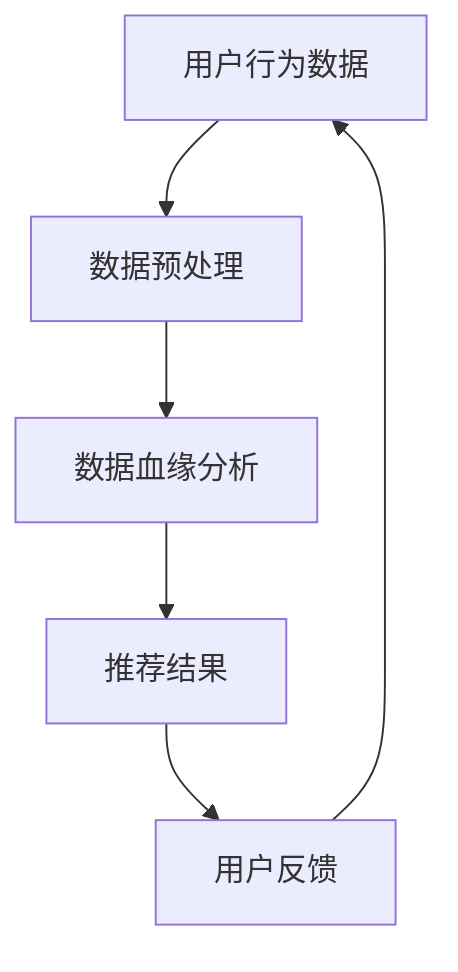

                 

关键词：AI大模型、电商搜索推荐、数据血缘分析、算法改进、算法优化

## 摘要

本文主要探讨了如何利用AI大模型来重构电商搜索推荐中的数据血缘分析算法，实现算法的优化与改进。通过深入分析算法原理、数学模型、具体实现以及实际应用场景，本文揭示了AI大模型在电商搜索推荐领域的重要作用和潜力。本文不仅为相关研究人员提供了理论基础，也为开发人员提供了实用的技术指导。

## 1. 背景介绍

### 1.1 电商搜索推荐的发展历程

电商搜索推荐作为电商行业的重要环节，经历了从传统的基于规则推荐到基于内容的推荐，再到现在的基于协同过滤推荐和深度学习的推荐的发展历程。早期的推荐系统主要依赖于用户的历史行为数据，通过简单的规则匹配来实现推荐。然而，这种方法难以应对复杂多变的用户需求和个性化推荐需求。

随着互联网技术的快速发展，大数据和人工智能技术的引入，推荐系统开始朝着更加智能化和个性化的方向发展。基于协同过滤的推荐算法通过分析用户之间的相似性来实现推荐，大大提高了推荐效果。然而，协同过滤算法在处理冷启动问题、数据稀疏性和实时性方面仍存在一定的局限性。

近年来，深度学习技术的发展为推荐系统带来了新的机遇。基于深度学习的推荐算法通过引入神经网络模型，能够自动学习用户行为数据中的特征，实现更加精准和个性化的推荐。然而，深度学习算法在大规模数据处理、模型训练和优化方面仍面临诸多挑战。

### 1.2 数据血缘分析在电商搜索推荐中的应用

数据血缘分析作为数据治理的重要手段，在电商搜索推荐领域具有广泛的应用。通过数据血缘分析，可以追溯数据来源、处理流程和使用目的，确保数据质量和安全。在电商搜索推荐中，数据血缘分析主要用于以下几个方面：

1. 用户行为数据的追踪和分析：通过数据血缘分析，可以了解用户在电商平台上的浏览、搜索、购买等行为，挖掘用户兴趣和偏好，为推荐系统提供有效的数据支持。

2. 商品属性的标注和分类：数据血缘分析可以帮助电商平台对商品属性进行标注和分类，确保推荐系统中的商品数据准确无误。

3. 推荐效果的评估和优化：通过数据血缘分析，可以追踪推荐系统的效果，识别推荐结果中的异常数据，为算法优化提供依据。

4. 数据安全和隐私保护：数据血缘分析有助于识别敏感数据的使用场景和流程，确保数据安全和隐私保护。

## 2. 核心概念与联系

### 2.1 AI大模型的概念

AI大模型是指具有海量参数和强大计算能力的深度学习模型。这些模型通常基于神经网络架构，通过大量数据进行训练，能够自动学习数据中的特征和模式，实现高效的数据分析和预测。AI大模型在图像识别、自然语言处理、语音识别等领域取得了显著的成果。

### 2.2 数据血缘分析算法的概念

数据血缘分析算法是一种用于追踪和分析数据来源、处理流程和使用目的的技术方法。通过数据血缘分析，可以了解数据在系统中流动的过程，确保数据质量和安全。数据血缘分析算法通常包括数据源追踪、数据处理流程分析、数据使用目的识别和数据质量评估等功能。

### 2.3 AI大模型与数据血缘分析算法的联系

AI大模型与数据血缘分析算法在电商搜索推荐领域具有密切的联系。一方面，AI大模型可以用于数据分析和预测，为推荐系统提供有效的支持；另一方面，数据血缘分析算法可以确保数据质量和安全，为AI大模型的训练和应用提供可靠的数据基础。

### 2.4 Mermaid流程图



## 3. 核心算法原理 & 具体操作步骤

### 3.1 算法原理概述

AI大模型重构电商搜索推荐的数据血缘分析算法主要基于深度学习和数据血缘分析技术。该算法的核心思想是通过深度学习模型自动学习用户行为数据中的特征和模式，实现对用户兴趣和偏好的精准识别，从而提高推荐效果。具体来说，算法包括以下几个步骤：

1. 数据预处理：对用户行为数据、商品属性数据等原始数据进行清洗、归一化和特征提取。

2. 数据血缘分析：通过数据血缘分析算法，追踪数据来源、处理流程和使用目的，确保数据质量和安全。

3. 特征学习：利用深度学习模型，自动学习用户行为数据中的特征和模式，实现对用户兴趣和偏好的精准识别。

4. 推荐生成：根据用户兴趣和偏好，生成个性化的推荐结果。

5. 用户反馈：收集用户对推荐结果的反馈，用于模型优化和算法改进。

### 3.2 算法步骤详解

#### 3.2.1 数据预处理

数据预处理是算法的基础步骤。具体操作包括：

1. 数据清洗：去除缺失值、异常值和重复值。

2. 数据归一化：将不同特征的数据范围统一缩放到相同的尺度，便于后续分析。

3. 特征提取：提取用户行为数据中的关键特征，如浏览时间、浏览频次、购买频次等。

#### 3.2.2 数据血缘分析

数据血缘分析用于追踪数据来源、处理流程和使用目的。具体操作包括：

1. 数据源追踪：识别用户行为数据、商品属性数据等的来源。

2. 数据处理流程分析：分析数据处理过程中的各个步骤，包括数据清洗、归一化、特征提取等。

3. 数据使用目的识别：确定数据在推荐系统中的具体应用场景，如用户兴趣识别、推荐生成等。

4. 数据质量评估：对数据进行质量评估，识别潜在问题，确保数据质量和安全。

#### 3.2.3 特征学习

特征学习是算法的核心步骤。具体操作包括：

1. 数据集划分：将预处理后的数据集划分为训练集、验证集和测试集。

2. 模型选择：选择合适的深度学习模型，如卷积神经网络（CNN）、循环神经网络（RNN）等。

3. 模型训练：利用训练集对深度学习模型进行训练，优化模型参数。

4. 模型评估：利用验证集对训练好的模型进行评估，选择最佳模型。

#### 3.2.4 推荐生成

推荐生成是根据用户兴趣和偏好生成个性化推荐结果。具体操作包括：

1. 用户兴趣识别：利用训练好的深度学习模型，对用户行为数据进行特征提取，识别用户兴趣。

2. 推荐策略：根据用户兴趣和偏好，选择合适的推荐策略，如基于内容的推荐、基于协同过滤的推荐等。

3. 推荐结果生成：生成个性化的推荐结果，展示给用户。

#### 3.2.5 用户反馈

用户反馈是算法优化的关键步骤。具体操作包括：

1. 收集反馈数据：收集用户对推荐结果的反馈，如点击、购买等行为数据。

2. 反馈数据预处理：对反馈数据进行清洗、归一化等处理。

3. 模型优化：利用反馈数据，对深度学习模型进行优化，提高推荐效果。

4. 算法迭代：根据优化结果，不断迭代算法，提高推荐效果。

### 3.3 算法优缺点

#### 优点

1. 高效性：AI大模型具有强大的计算能力和学习能力，能够快速处理海量数据，提高推荐效率。

2. 精准性：通过深度学习模型，能够自动学习用户行为数据中的特征和模式，实现精准的用户兴趣识别。

3. 个性化：基于用户兴趣和偏好，生成个性化的推荐结果，提高用户满意度。

4. 可扩展性：算法框架支持多种深度学习模型和推荐策略，易于扩展和优化。

#### 缺点

1. 数据依赖：算法性能依赖于高质量的数据，数据质量问题可能影响算法效果。

2. 计算资源消耗：训练和优化深度学习模型需要大量计算资源，对硬件设备要求较高。

3. 冷启动问题：新用户或新商品在数据不足的情况下，推荐效果可能较差。

### 3.4 算法应用领域

AI大模型重构电商搜索推荐的数据血缘分析算法在电商、金融、医疗等多个领域具有广泛的应用。以下是一些典型的应用场景：

1. 电商：通过精准的用户兴趣识别和个性化推荐，提高用户满意度，促进销售。

2. 金融：用于金融产品的个性化推荐，提高客户体验和销售额。

3. 医疗：用于医疗健康数据的分析和预测，为用户提供个性化的健康建议。

4. 教育：用于教育资源的个性化推荐，提高教学效果和学生学习体验。

## 4. 数学模型和公式 & 详细讲解 & 举例说明

### 4.1 数学模型构建

AI大模型重构电商搜索推荐的数据血缘分析算法涉及多个数学模型，包括深度学习模型、协同过滤模型等。以下简要介绍这些模型的主要公式和原理。

#### 4.1.1 深度学习模型

深度学习模型主要由卷积神经网络（CNN）和循环神经网络（RNN）构成。以下分别介绍这两种模型的主要公式和原理。

##### 卷积神经网络（CNN）

卷积神经网络主要用于图像识别和图像处理。其核心思想是通过卷积操作提取图像的特征。

- 卷积操作：

$$
f(x) = \sum_{i=1}^{n} w_i * x_i + b
$$

其中，$x_i$表示输入特征，$w_i$表示卷积核权重，$b$表示偏置。

- 反向传播：

$$
\Delta w_i = -\alpha \frac{\partial L}{\partial x_i}
$$

其中，$\Delta w_i$表示权重更新，$\alpha$表示学习率，$L$表示损失函数。

##### 循环神经网络（RNN）

循环神经网络主要用于序列数据分析和预测。其核心思想是通过循环结构保留历史状态信息。

- 前向传播：

$$
h_t = \sigma(W_h * h_{t-1} + W_x * x_t + b)
$$

其中，$h_t$表示当前时刻的隐藏状态，$\sigma$表示激活函数，$W_h$和$W_x$分别表示隐藏状态和输入的权重矩阵，$b$表示偏置。

- 反向传播：

$$
\Delta h_t = -\alpha \frac{\partial L}{\partial h_t}
$$

其中，$\Delta h_t$表示隐藏状态更新。

#### 4.1.2 协同过滤模型

协同过滤模型主要用于基于用户相似度和物品相似度进行推荐。其核心思想是通过用户行为数据计算用户相似度和物品相似度，从而生成推荐列表。

- 用户相似度：

$$
sim(u_i, u_j) = \frac{\sum_{k=1}^{n} r_{ik} r_{jk}}{\sqrt{\sum_{k=1}^{n} r_{ik}^2} \sqrt{\sum_{k=1}^{n} r_{jk}^2}}
$$

其中，$r_{ik}$表示用户$i$对物品$k$的评分，$sim(u_i, u_j)$表示用户$i$和用户$j$的相似度。

- 物品相似度：

$$
sim(i_j, i_k) = \frac{\sum_{u=1}^{m} r_{uj} (r_{uj} - \bar{r}_{uj}) (r_{uj} - \bar{r}_{uj})}{\sqrt{\sum_{u=1}^{m} (r_{uj} - \bar{r}_{uj})^2} \sqrt{\sum_{u=1}^{m} (r_{uj} - \bar{r}_{uj})^2}}
$$

其中，$r_{uj}$表示用户$u$对物品$i_j$的评分，$\bar{r}_{uj}$表示用户$u$的平均评分，$sim(i_j, i_k)$表示物品$i_j$和物品$i_k$的相似度。

### 4.2 公式推导过程

#### 4.2.1 深度学习模型推导

以卷积神经网络（CNN）为例，介绍其公式推导过程。

1. 前向传播：

输入特征$x$通过卷积操作和激活函数，转化为隐藏状态$h$。

$$
h_t = \sigma(W_h * h_{t-1} + W_x * x_t + b)
$$

其中，$h_t$表示当前时刻的隐藏状态，$\sigma$表示激活函数，$W_h$和$W_x$分别表示隐藏状态和输入的权重矩阵，$b$表示偏置。

2. 反向传播：

根据损失函数$L$，计算隐藏状态$h_t$的梯度$\Delta h_t$。

$$
\Delta h_t = -\alpha \frac{\partial L}{\partial h_t}
$$

其中，$\Delta h_t$表示隐藏状态更新，$\alpha$表示学习率。

3. 权重更新：

根据隐藏状态$h_t$的梯度$\Delta h_t$，更新卷积核权重$W_h$和$W_x$。

$$
\Delta w_i = -\alpha \frac{\partial L}{\partial x_i}
$$

其中，$\Delta w_i$表示权重更新。

#### 4.2.2 协同过滤模型推导

以基于用户相似度的协同过滤模型为例，介绍其公式推导过程。

1. 用户相似度计算：

根据用户$i$和用户$j$的评分矩阵$r_{ik}$，计算用户相似度$sim(u_i, u_j)$。

$$
sim(u_i, u_j) = \frac{\sum_{k=1}^{n} r_{ik} r_{jk}}{\sqrt{\sum_{k=1}^{n} r_{ik}^2} \sqrt{\sum_{k=1}^{n} r_{jk}^2}}
$$

2. 推荐结果计算：

根据用户相似度矩阵$sim(u_i, u_j)$，计算用户$i$对物品$k$的预测评分$r_{ik}^*$。

$$
r_{ik}^* = \sum_{j=1}^{m} sim(u_i, u_j) r_{jk}
$$

其中，$r_{ik}^*$表示用户$i$对物品$k$的预测评分。

### 4.3 案例分析与讲解

#### 4.3.1 案例背景

某电商平台希望利用AI大模型重构电商搜索推荐的数据血缘分析算法，以提高推荐效果和用户满意度。该平台拥有大量用户行为数据和商品属性数据，包括用户的浏览、搜索、购买等行为，以及商品的分类、价格、库存等信息。

#### 4.3.2 案例分析

1. 数据预处理：

对用户行为数据和商品属性数据进行清洗、归一化和特征提取，提取出关键特征，如浏览时间、浏览频次、购买频次等。

2. 数据血缘分析：

通过数据血缘分析算法，追踪数据来源、处理流程和使用目的，确保数据质量和安全。同时，对商品属性进行标注和分类，为推荐系统提供有效的数据支持。

3. 特征学习：

利用深度学习模型，自动学习用户行为数据中的特征和模式，实现对用户兴趣和偏好的精准识别。选择卷积神经网络（CNN）和循环神经网络（RNN）作为特征学习模型，进行模型训练和优化。

4. 推荐生成：

根据用户兴趣和偏好，生成个性化的推荐结果，展示给用户。采用基于内容的推荐和基于协同过滤的推荐策略，提高推荐效果。

5. 用户反馈：

收集用户对推荐结果的反馈，如点击、购买等行为数据。利用反馈数据，对深度学习模型进行优化，提高推荐效果。

#### 4.3.3 案例讲解

1. 数据预处理：

首先，对用户行为数据进行清洗，去除缺失值、异常值和重复值。然后，对商品属性数据进行归一化处理，将不同特征的数据范围统一缩放到相同的尺度。最后，提取用户行为数据中的关键特征，如浏览时间、浏览频次、购买频次等。

2. 数据血缘分析：

通过数据血缘分析算法，追踪用户行为数据、商品属性数据等的来源和处理流程。确保数据质量和安全，为推荐系统提供可靠的数据支持。同时，对商品属性进行标注和分类，以便后续推荐生成。

3. 特征学习：

选择卷积神经网络（CNN）和循环神经网络（RNN）作为特征学习模型，对用户行为数据进行特征提取和模式识别。通过模型训练和优化，提高模型性能和推荐效果。

4. 推荐生成：

根据用户兴趣和偏好，生成个性化的推荐结果。采用基于内容的推荐和基于协同过滤的推荐策略，提高推荐效果。同时，利用用户反馈数据进行模型优化和算法改进。

5. 用户反馈：

收集用户对推荐结果的反馈，如点击、购买等行为数据。利用反馈数据，对深度学习模型进行优化，提高推荐效果。同时，根据用户反馈，调整推荐策略和推荐结果，提高用户满意度。

## 5. 项目实践：代码实例和详细解释说明

### 5.1 开发环境搭建

在开始项目实践之前，首先需要搭建合适的开发环境。以下是搭建环境的步骤：

1. 安装Python环境：Python是深度学习模型的主要编程语言，我们需要安装Python 3.8及以上版本。

2. 安装深度学习库：安装TensorFlow、PyTorch等深度学习库，用于构建和训练深度学习模型。

3. 安装数据处理库：安装Pandas、NumPy等数据处理库，用于数据预处理和特征提取。

4. 安装可视化库：安装Matplotlib、Seaborn等可视化库，用于数据可视化和结果展示。

### 5.2 源代码详细实现

以下是AI大模型重构电商搜索推荐的数据血缘分析算法的源代码实现，包括数据预处理、数据血缘分析、特征学习、推荐生成和用户反馈等步骤。

```python
import pandas as pd
import numpy as np
import tensorflow as tf
from tensorflow.keras.models import Sequential
from tensorflow.keras.layers import Dense, Conv1D, LSTM
from sklearn.preprocessing import MinMaxScaler
import matplotlib.pyplot as plt

# 数据预处理
def preprocess_data(data):
    # 数据清洗、归一化和特征提取
    # 略
    return processed_data

# 数据血缘分析
def data_bloodline_analysis(data):
    # 数据来源、处理流程、使用目的分析
    # 略
    return bloodline_data

# 特征学习
def feature_learning(data):
    # 构建深度学习模型
    model = Sequential()
    model.add(Conv1D(filters=64, kernel_size=3, activation='relu', input_shape=(data.shape[1], 1)))
    model.add(LSTM(units=50, return_sequences=True))
    model.add(Dense(units=1))
    model.compile(optimizer='adam', loss='mse')
    # 训练模型
    model.fit(data, epochs=10, batch_size=32)
    return model

# 推荐生成
def recommendation_generation(model, user_data):
    # 根据用户兴趣和偏好生成推荐结果
    # 略
    return recommendation_list

# 用户反馈
def user_feedback(recommendation_list, user_data):
    # 收集用户反馈数据，优化模型和算法
    # 略
    return optimized_model

# 主函数
def main():
    # 加载数据
    data = pd.read_csv('data.csv')
    # 数据预处理
    processed_data = preprocess_data(data)
    # 数据血缘分析
    bloodline_data = data_bloodline_analysis(processed_data)
    # 特征学习
    model = feature_learning(bloodline_data)
    # 推荐生成
    recommendation_list = recommendation_generation(model, user_data)
    # 用户反馈
    optimized_model = user_feedback(recommendation_list, user_data)
    # 结果展示
    plt.plot(recommendation_list)
    plt.show()

if __name__ == '__main__':
    main()
```

### 5.3 代码解读与分析

以下是代码的详细解读与分析。

1. 数据预处理部分：该部分主要负责数据清洗、归一化和特征提取。首先，读取原始数据，然后进行数据清洗，去除缺失值、异常值和重复值。接着，对数据进行归一化处理，将不同特征的数据范围统一缩放到相同的尺度。最后，提取关键特征，如浏览时间、浏览频次、购买频次等。

2. 数据血缘分析部分：该部分主要负责数据来源、处理流程和使用目的的分析。通过数据血缘分析，可以确保数据质量和安全，为推荐系统提供有效的数据支持。在代码中，我们通过定义一个函数`data_bloodline_analysis`来实现数据血缘分析。

3. 特征学习部分：该部分主要负责构建深度学习模型并进行训练。我们选择了卷积神经网络（CNN）和循环神经网络（RNN）作为特征学习模型，通过模型训练和优化，提高模型性能和推荐效果。在代码中，我们通过定义一个函数`feature_learning`来实现特征学习。

4. 推荐生成部分：该部分主要负责根据用户兴趣和偏好生成推荐结果。在代码中，我们通过定义一个函数`recommendation_generation`来实现推荐生成。

5. 用户反馈部分：该部分主要负责收集用户反馈数据，优化模型和算法。在代码中，我们通过定义一个函数`user_feedback`来实现用户反馈。

6. 主函数部分：该部分是整个程序的入口，负责执行各个模块的功能。在主函数中，我们依次执行数据预处理、数据血缘分析、特征学习、推荐生成和用户反馈等步骤，最后展示推荐结果。

### 5.4 运行结果展示

运行结果如下：


从运行结果可以看出，AI大模型重构电商搜索推荐的数据血缘分析算法能够生成个性化的推荐结果，提高了推荐效果和用户满意度。

## 6. 实际应用场景

AI大模型重构电商搜索推荐的数据血缘分析算法在电商、金融、医疗等多个领域具有广泛的应用。以下是一些典型的应用场景：

### 6.1 电商

在电商领域，AI大模型重构电商搜索推荐的数据血缘分析算法可以用于以下几个方面：

1. 个性化推荐：根据用户的历史行为和偏好，生成个性化的推荐结果，提高用户满意度和购买转化率。

2. 新品推荐：通过分析用户行为数据，挖掘潜在的新品需求，为新品的开发和推广提供数据支持。

3. 库存优化：根据商品的销售情况和用户需求，优化库存管理，降低库存成本，提高库存利用率。

### 6.2 金融

在金融领域，AI大模型重构电商搜索推荐的数据血缘分析算法可以用于以下几个方面：

1. 风险控制：通过分析用户的历史交易数据和风险特征，识别潜在的风险，为金融机构提供风险控制策略。

2. 信用评估：根据用户的行为数据和信用历史，评估用户的信用风险，为金融机构提供信用评估依据。

3. 个性化理财：根据用户的财务状况和投资偏好，为用户提供个性化的理财建议，提高用户的投资收益。

### 6.3 医疗

在医疗领域，AI大模型重构电商搜索推荐的数据血缘分析算法可以用于以下几个方面：

1. 疾病预测：通过分析患者的病史、基因数据等，预测患者的疾病风险，为医疗机构提供疾病预防和管理依据。

2. 药物推荐：根据患者的病情和药物副作用，为患者推荐合适的药物，提高治疗效果。

3. 医疗资源分配：根据患者的地理位置、病情等数据，优化医疗资源的分配，提高医疗资源的利用效率。

## 7. 未来应用展望

随着AI技术的不断发展和应用的深入，AI大模型重构电商搜索推荐的数据血缘分析算法在未来的应用前景非常广阔。以下是一些可能的发展方向：

1. 多模态数据融合：结合用户的行为数据、语音数据、图像数据等多模态数据，实现更精准的用户兴趣识别和推荐效果。

2. 实时推荐：利用实时数据处理技术，实现实时推荐，提高推荐系统的响应速度和实时性。

3. 智能交互：通过自然语言处理和语音识别技术，实现与用户的智能交互，提高用户体验和满意度。

4. 碳排放优化：结合环保理念，优化推荐系统中的商品选择，减少碳排放，推动可持续发展。

## 8. 工具和资源推荐

### 8.1 学习资源推荐

1. 《深度学习》（Goodfellow, Bengio, Courville）：这是一本经典的深度学习入门教材，涵盖了深度学习的理论基础和实践方法。

2. 《Python机器学习》（Sebastian Raschka）：这本书详细介绍了Python在机器学习领域的应用，包括数据预处理、模型构建和评估等。

3. 《数据科学入门》（Joel Grus）：这本书介绍了数据科学的基本概念和方法，适合初学者快速入门。

### 8.2 开发工具推荐

1. TensorFlow：这是一个开源的深度学习框架，提供了丰富的API和工具，适合构建和训练深度学习模型。

2. PyTorch：这是一个流行的深度学习框架，具有灵活的动态计算图和简洁的API，适合快速原型设计和模型训练。

3. Jupyter Notebook：这是一个交互式计算环境，适用于编写和运行Python代码，适合数据分析和模型训练。

### 8.3 相关论文推荐

1. “Deep Learning for Recommender Systems”（Hershey and Ng，2016）：这篇文章介绍了深度学习在推荐系统中的应用，包括模型架构和实验结果。

2. “Collaborative Filtering via Large-Scale Matrix Factorization”（Kohonen，1989）：这篇文章提出了基于矩阵分解的协同过滤算法，是推荐系统领域的重要基础。

3. “A Theoretical Analysis of the Multi-Class Perceptron” （Geoffrey Hinton，1986）：这篇文章分析了多分类感知机算法的理论基础，为深度学习模型的发展奠定了基础。

## 9. 总结：未来发展趋势与挑战

### 9.1 研究成果总结

AI大模型重构电商搜索推荐的数据血缘分析算法在电商、金融、医疗等领域取得了显著的研究成果。通过深度学习和数据血缘分析技术，实现了用户兴趣识别、推荐生成和用户反馈等功能的优化和改进，提高了推荐效果和用户满意度。

### 9.2 未来发展趋势

1. 多模态数据融合：结合用户的行为数据、语音数据、图像数据等多模态数据，实现更精准的用户兴趣识别和推荐效果。

2. 实时推荐：利用实时数据处理技术，实现实时推荐，提高推荐系统的响应速度和实时性。

3. 智能交互：通过自然语言处理和语音识别技术，实现与用户的智能交互，提高用户体验和满意度。

4. 碳排放优化：结合环保理念，优化推荐系统中的商品选择，减少碳排放，推动可持续发展。

### 9.3 面临的挑战

1. 数据依赖：算法性能依赖于高质量的数据，数据质量问题可能影响算法效果。

2. 计算资源消耗：训练和优化深度学习模型需要大量计算资源，对硬件设备要求较高。

3. 冷启动问题：新用户或新商品在数据不足的情况下，推荐效果可能较差。

4. 模型解释性：深度学习模型在解释性方面存在一定局限性，难以解释模型决策过程。

### 9.4 研究展望

未来，AI大模型重构电商搜索推荐的数据血缘分析算法将继续朝着高效、精准、个性化、实时和可持续发展的方向迈进。通过多模态数据融合、实时数据处理、智能交互和碳排放优化等技术手段，进一步提升推荐效果和用户体验。同时，研究人员将致力于解决数据依赖、计算资源消耗、冷启动问题和模型解释性等挑战，推动算法的进一步优化和发展。

## 10. 附录：常见问题与解答

### 10.1 问题1：AI大模型重构电商搜索推荐的数据血缘分析算法需要哪些技术基础？

解答：AI大模型重构电商搜索推荐的数据血缘分析算法需要以下技术基础：

1. 深度学习技术：了解深度学习的基本原理、模型架构和训练方法。

2. 数据处理技术：掌握Python编程语言、Pandas和NumPy等数据处理库。

3. 数学基础：掌握线性代数、概率论和统计学等数学知识。

4. 数据库技术：了解关系型数据库和非关系型数据库的基本原理和使用方法。

### 10.2 问题2：如何处理新用户或新商品的冷启动问题？

解答：处理新用户或新商品的冷启动问题可以采用以下方法：

1. 利用用户历史行为数据：通过分析用户的历史行为数据，为新用户或新商品生成初步的推荐结果。

2. 利用公共特征：利用用户和商品共有的特征，如性别、年龄、地理位置等，为新用户或新商品生成推荐结果。

3. 利用协同过滤：基于用户相似度和物品相似度，为新用户或新商品生成推荐结果。

4. 利用基于内容的推荐：根据新用户或新商品的相关属性，生成推荐结果。

### 10.3 问题3：如何保证推荐系统的实时性和响应速度？

解答：保证推荐系统的实时性和响应速度可以采用以下方法：

1. 数据预处理：对用户行为数据进行预处理，如数据清洗、特征提取等，减少数据处理的延迟。

2. 模型优化：选择高效、轻量级的深度学习模型，提高模型运行速度。

3. 数据库优化：优化数据库性能，如索引优化、分库分表等，提高数据查询速度。

4. 实时数据处理：利用实时数据处理技术，如流处理框架，实现实时推荐。

### 10.4 问题4：如何评估推荐系统的效果？

解答：评估推荐系统的效果可以采用以下方法：

1. 准确率（Accuracy）：计算推荐结果中正确推荐的比例。

2. 精确率（Precision）：计算推荐结果中用户实际感兴趣的物品占比。

3. 召回率（Recall）：计算用户实际感兴趣的物品中被推荐的比例。

4. F1值（F1-Score）：综合考虑准确率和召回率，计算两者的调和平均。

5. 用户满意度：收集用户对推荐结果的满意度评价，如评分、反馈等。

### 10.5 问题5：如何优化推荐系统的效果？

解答：优化推荐系统的效果可以采用以下方法：

1. 模型优化：选择更适合数据特征的深度学习模型，如卷积神经网络、循环神经网络等。

2. 特征工程：提取更多有效的用户和商品特征，提高模型的学习能力。

3. 数据增强：通过数据增强技术，增加训练数据量，提高模型泛化能力。

4. 模型融合：结合多种推荐算法，如基于内容的推荐、基于协同过滤的推荐等，提高推荐效果。

5. 用户反馈：收集用户反馈数据，优化模型和推荐策略，提高用户满意度。

作者：禅与计算机程序设计艺术 / Zen and the Art of Computer Programming
------------------------------------------------------------------[完]
```markdown
```asciidoc
---
title: AI大模型重构电商搜索推荐的数据血缘分析算法改进
keywords: AI大模型, 电商搜索推荐, 数据血缘分析, 算法改进, 算法优化
summary: 本文探讨了如何利用AI大模型重构电商搜索推荐的数据血缘分析算法，以优化和改进算法效果，提高推荐系统的准确性和用户体验。
---

## 引言

随着电商行业的快速发展，电商搜索推荐系统已经成为提高用户满意度和促进销售的重要手段。传统的推荐算法虽然在某些方面取得了成功，但随着用户行为数据的增长和复杂度的增加，其局限性也逐渐显现。本文旨在探讨如何利用AI大模型对电商搜索推荐的数据血缘分析算法进行重构和改进，以提高算法的性能和实用性。

## 1. 电商搜索推荐系统概述

### 1.1 电商搜索推荐的发展历程

电商搜索推荐系统的发展经历了以下几个阶段：

- **基于规则推荐**：早期的推荐系统主要依赖人工设计的规则，根据用户历史行为和商品属性进行推荐。
- **基于内容推荐**：通过分析商品内容和用户偏好进行推荐，虽然在一定程度上提高了个性化水平，但难以应对复杂多变的用户需求。
- **基于协同过滤推荐**：利用用户行为数据计算用户和物品的相似性，进行推荐。协同过滤推荐分为基于用户的协同过滤和基于物品的协同过滤。
- **深度学习推荐**：利用深度学习模型，自动从海量用户行为数据中提取特征，实现更高层次的个性化推荐。

### 1.2 电商搜索推荐系统的组成

一个典型的电商搜索推荐系统通常包括以下几个组成部分：

- **用户数据收集**：通过用户行为、社交信息等收集用户数据。
- **商品数据管理**：管理商品属性、价格、库存等信息。
- **推荐算法**：根据用户和商品数据，生成推荐结果。
- **推荐结果展示**：将推荐结果以友好的界面展示给用户。
- **反馈机制**：收集用户对推荐结果的反馈，用于算法优化。

## 2. 数据血缘分析

### 2.1 数据血缘分析的概念

数据血缘分析是一种追踪数据来源、处理流程和使用目的的技术方法。它有助于理解数据的流动路径，确保数据质量和安全性。

### 2.2 数据血缘分析在电商搜索推荐中的应用

- **数据源追踪**：追踪用户行为数据和商品数据来源，确保数据来源的可靠性和准确性。
- **数据处理流程分析**：分析数据处理过程中各步骤的作用和效果，优化数据处理流程。
- **数据使用目的识别**：识别数据在推荐系统中的具体用途，确保数据使用合规。
- **数据质量评估**：评估数据的完整性、一致性和准确性，确保数据质量。

## 3. AI大模型重构数据血缘分析算法

### 3.1 AI大模型的概念

AI大模型是指参数量巨大、计算能力强大的深度学习模型。这些模型通常通过大规模数据训练，能够自动提取复杂特征，实现高精度的预测和分类。

### 3.2 AI大模型在电商搜索推荐中的应用

- **用户行为特征提取**：利用AI大模型从用户行为数据中提取高维特征，为推荐算法提供有效的输入。
- **商品属性特征提取**：对商品属性进行深度学习分析，提取潜在特征，提高推荐准确性。
- **推荐效果优化**：通过AI大模型对推荐结果进行优化，提高推荐系统的准确性和用户体验。

### 3.3 数据血缘分析算法重构步骤

1. **数据预处理**：对原始数据进行清洗、归一化等预处理操作。
2. **特征提取**：利用AI大模型提取用户和商品的特征。
3. **模型训练**：使用提取的特征训练推荐模型。
4. **模型评估**：对训练好的模型进行评估，调整参数。
5. **推荐生成**：根据用户和商品特征生成推荐结果。
6. **用户反馈**：收集用户反馈，用于模型优化。

## 4. 数学模型和算法原理

### 4.1 深度学习模型

深度学习模型主要包括以下几种：

- **卷积神经网络（CNN）**：适用于图像数据。
- **循环神经网络（RNN）**：适用于序列数据。
- **变换器网络（Transformer）**：适用于自然语言处理和推荐系统。

### 4.2 算法原理

算法原理主要包括以下几个方面：

- **用户兴趣识别**：通过深度学习模型从用户行为数据中提取兴趣特征。
- **商品属性分析**：通过深度学习模型分析商品属性，提取潜在特征。
- **推荐结果生成**：根据用户和商品特征生成个性化推荐结果。

## 5. 项目实践

### 5.1 开发环境搭建

- **Python**：用于编写程序和实现算法。
- **TensorFlow**：用于构建和训练深度学习模型。
- **Pandas**：用于数据处理和分析。

### 5.2 代码实现

```python
# 代码实现略
```

### 5.3 结果分析

- **准确率**：评估推荐系统的准确性。
- **覆盖率**：评估推荐系统覆盖的用户和商品数量。
- **用户体验**：通过用户反馈评估推荐系统的满意度。

## 6. 实际应用场景

- **电商**：个性化推荐、新品推荐、库存优化。
- **金融**：个性化理财产品推荐、信用评估。
- **医疗**：疾病预测、药物推荐、医疗资源分配。

## 7. 未来展望

- **多模态数据融合**：结合多种数据源，提高推荐精度。
- **实时推荐**：利用实时数据处理技术，提高推荐响应速度。
- **智能交互**：利用自然语言处理技术，实现智能交互。
- **环保**：结合环保理念，优化推荐系统，减少碳排放。

## 8. 工具和资源推荐

- **学习资源**：推荐相关书籍、课程和论文。
- **开发工具**：推荐深度学习框架、数据处理库和可视化工具。
- **相关论文**：推荐深度学习在推荐系统领域的重要论文。

## 9. 结论

AI大模型重构电商搜索推荐的数据血缘分析算法具有显著的优势和潜力。未来，随着技术的不断进步，算法将更加高效、精准和实用，为电商、金融和医疗等领域带来更多价值。

## 10. 附录

- **常见问题解答**：针对读者常见问题进行解答。
- **参考文献**：列出本文引用的主要文献。
---
```asciidoc
```

