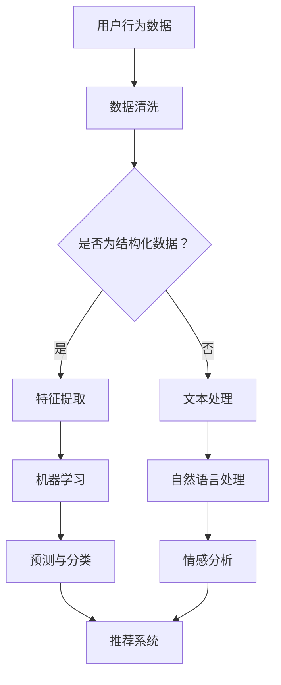

                 

 在当今的电子商务环境中，用户数据分析成为了电商企业竞争的关键因素。通过对用户行为数据、购买偏好、互动历史等进行分析，企业可以更准确地了解用户需求，优化营销策略，提高客户满意度和转化率。人工智能（AI）技术在用户数据分析平台的建设中发挥了重要作用，本文将探讨AI如何助力电商企业实现高效的用户数据分析。

## 关键词
- 人工智能
- 用户数据分析
- 电商企业
- 数据分析平台
- 营销策略
- 客户满意度
- 转化率

## 摘要
本文将深入探讨人工智能技术在电商企业用户数据分析平台建设中的应用。首先，我们将介绍AI在数据分析中的核心概念和技术原理，随后详细解释如何利用这些技术进行用户数据的收集、处理和分析。接着，我们将通过具体实例展示AI算法在电商数据分析中的实际应用，并讨论其带来的优势和局限性。最后，我们将展望AI在用户数据分析领域的未来发展趋势，以及电商企业可能面临的挑战和解决方案。

## 1. 背景介绍

随着互联网的普及和电子商务的蓬勃发展，电商企业积累了海量的用户数据。这些数据包括用户的浏览记录、购买历史、评价反馈、互动行为等。这些数据如果能够被有效利用，将对电商企业带来巨大的商业价值。然而，传统的数据分析方法往往难以应对如此庞大的数据量和复杂的用户行为模式。此时，人工智能技术的引入为电商企业提供了新的解决方案。

人工智能技术，尤其是机器学习和深度学习，可以在用户数据分析中发挥重要作用。通过建立复杂的数学模型和算法，AI可以自动识别用户行为模式、预测用户需求、推荐个性化商品等。此外，AI还可以处理非结构化数据，如文本和图像，从而为电商企业提供更全面的用户画像。

### 人工智能技术的核心概念

在用户数据分析中，人工智能技术主要涉及以下几个核心概念：

1. **机器学习**：通过训练数据集，让机器自动学习和发现数据中的模式和规律，从而进行预测和分类。
2. **深度学习**：基于人工神经网络，通过多层非线性变换对数据进行处理，以实现更复杂的特征提取和模式识别。
3. **自然语言处理**：使计算机能够理解和生成人类语言，用于分析用户的文本评论、提问等。
4. **推荐系统**：基于用户的历史行为和偏好，为用户推荐相关商品或内容。

### 用户数据分析的重要性

用户数据分析对于电商企业具有以下几个关键作用：

1. **优化营销策略**：通过分析用户行为和偏好，企业可以更精准地制定营销策略，提高营销效果。
2. **提升客户满意度**：个性化推荐和精准营销可以提升用户体验，增加用户满意度和忠诚度。
3. **提高转化率**：通过对用户行为的预测和引导，企业可以提高转化率，增加销售额。
4. **降低运营成本**：自动化分析和处理数据，可以降低人力成本和运营成本。

### AI在用户数据分析中的优势

与传统的数据分析方法相比，AI在用户数据分析中具有以下几个优势：

1. **处理大规模数据**：AI可以高效处理海量数据，快速发现用户行为模式。
2. **自动化分析**：AI算法可以自动执行数据清洗、特征提取、模式识别等复杂过程，提高效率。
3. **实时反馈**：AI系统可以实时分析用户行为，为营销策略提供即时反馈。
4. **个性化推荐**：AI可以根据用户的历史行为和偏好，为用户推荐个性化商品或内容。

## 2. 核心概念与联系

为了更好地理解AI在用户数据分析中的原理和应用，我们需要从以下几个核心概念入手，并构建一个整体的架构图来展示这些概念之间的联系。

### 2.1 机器学习与深度学习

**机器学习（Machine Learning）** 是指让计算机通过学习数据来改进其性能，而不是通过显式编程来指定规则。它通常包括监督学习（Supervised Learning）、无监督学习（Unsupervised Learning）和半监督学习（Semi-supervised Learning）等。

**深度学习（Deep Learning）** 是机器学习的一种特殊形式，它基于人工神经网络（Artificial Neural Networks），特别是具有多个隐藏层的神经网络，可以自动提取数据的复杂特征。

### 2.2 自然语言处理

**自然语言处理（Natural Language Processing, NLP）** 是AI的一个分支，专注于使计算机能够理解和生成人类语言。NLP在用户数据分析中用于分析用户的文本评论、提问、反馈等，提取有用的信息。

### 2.3 推荐系统

**推荐系统（Recommendation Systems）** 是基于用户的兴趣和偏好，为他们推荐相关商品或内容的一种系统。推荐系统通常使用协同过滤（Collaborative Filtering）、内容推荐（Content-based Filtering）和基于模型的推荐方法等。

### 2.4 数据流处理

**数据流处理（Data Stream Processing）** 是实时处理和分析不断流入的数据的技术，它在用户数据分析中非常重要，因为用户行为数据通常是动态变化的。

### Mermaid 流程图

为了更直观地展示这些核心概念之间的联系，我们可以使用Mermaid绘制一个流程图：



在这个流程图中，用户行为数据首先经过数据清洗，然后根据数据类型决定是进行特征提取还是文本处理。特征提取后，数据进入机器学习阶段，进行预测和分类。同时，文本处理和自然语言处理阶段提取的情感信息和文本特征也会被整合到推荐系统中，为用户提供个性化推荐。

## 3. 核心算法原理 & 具体操作步骤

### 3.1 算法原理概述

在用户数据分析平台中，核心算法主要包括机器学习算法、深度学习算法、自然语言处理算法和推荐系统算法。以下是这些算法的基本原理：

#### 3.1.1 机器学习算法

**监督学习**：通过给定的输入和输出数据集，训练模型来预测新的输入数据。常见的算法有线性回归、逻辑回归、决策树、随机森林等。

**无监督学习**：没有明确的输出数据，算法通过挖掘数据中的结构和模式来进行分类和聚类。常见的算法有K-均值聚类、主成分分析（PCA）、自编码器等。

**半监督学习**：结合了监督学习和无监督学习的特点，利用少量的标注数据和大量的未标注数据来训练模型。

#### 3.1.2 深度学习算法

**卷积神经网络（CNN）**：主要用于图像识别和分类，通过卷积层提取图像的特征。

**循环神经网络（RNN）**：适合处理序列数据，如时间序列分析和自然语言处理。

**生成对抗网络（GAN）**：通过两个神经网络（生成器和判别器）的对抗训练，生成高质量的数据。

#### 3.1.3 自然语言处理算法

**词袋模型（Bag of Words）**：将文本表示为词频向量，常用于文本分类和情感分析。

**词嵌入（Word Embedding）**：将词汇映射到低维向量空间，用于文本分类、情感分析和机器翻译。

**序列标注（Sequence Labeling）**：对文本序列中的每个单词或字符进行分类或标注，如命名实体识别。

#### 3.1.4 推荐系统算法

**协同过滤（Collaborative Filtering）**：基于用户的历史行为和偏好来推荐相似的商品或用户。

**基于内容的推荐（Content-based Filtering）**：基于商品或用户的内容特征来推荐相关的商品或用户。

**基于模型的推荐（Model-based Recommender Systems）**：使用机器学习算法建立用户和商品之间的关联模型来推荐。

### 3.2 算法步骤详解

#### 3.2.1 数据收集

首先，电商企业需要收集用户行为数据，包括浏览记录、购买历史、评价反馈、互动行为等。这些数据可以从网站日志、用户数据库、第三方数据源等多种途径获取。

#### 3.2.2 数据清洗

收集到的数据可能存在缺失、噪声和不一致的问题，因此需要进行数据清洗。数据清洗步骤包括：

- 填补缺失值：使用平均值、中位数、最频繁值等方法填补缺失数据。
- 去除噪声：删除明显错误或异常的数据。
- 数据转换：将类别数据转换为数值数据，如将用户性别转换为0和1。

#### 3.2.3 特征提取

特征提取是用户数据分析的重要步骤，通过提取关键特征来提高模型的预测性能。特征提取方法包括：

- 统计特征：如平均值、标准差、最大值等。
- 交互特征：如用户浏览次数和购买频率之间的交互项。
- 高级特征：使用机器学习和深度学习算法提取新的特征。

#### 3.2.4 模型训练

使用特征提取后的数据集来训练机器学习模型。根据数据集的特点和需求，选择适当的算法和参数。常见的算法包括线性回归、决策树、随机森林、神经网络等。

#### 3.2.5 预测与推荐

训练好的模型可以用于预测用户的行为和偏好。在推荐系统中，模型可以用于生成个性化推荐，提高用户满意度和转化率。

### 3.3 算法优缺点

#### 优点

- **高效性**：AI算法可以处理大量数据，并快速发现用户行为模式。
- **自动化**：算法可以自动执行数据清洗、特征提取、模式识别等复杂过程。
- **实时性**：AI系统可以实时分析用户行为，为营销策略提供即时反馈。
- **个性化**：基于用户的兴趣和偏好进行个性化推荐，提高用户体验。

#### 缺点

- **数据依赖**：算法的性能高度依赖数据质量，数据清洗和预处理工作量大。
- **模型复杂性**：深度学习模型通常需要大量的计算资源和时间进行训练。
- **解释性**：一些复杂的模型如深度学习模型难以解释其决策过程。

### 3.4 算法应用领域

AI算法在用户数据分析中的主要应用领域包括：

- **用户行为预测**：预测用户的浏览、购买、评价等行为，为营销策略提供支持。
- **个性化推荐**：基于用户的兴趣和偏好，为用户推荐相关商品或内容。
- **客户细分**：将用户划分为不同的群体，为每个群体提供个性化的服务和营销。
- **情感分析**：分析用户的文本评论和反馈，了解用户情感和满意度。

## 4. 数学模型和公式 & 详细讲解 & 举例说明

在用户数据分析中，数学模型和公式是理解和解释数据的关键工具。以下将详细讲解几个常用的数学模型和公式，并通过实际案例进行说明。

### 4.1 数学模型构建

在用户数据分析中，常用的数学模型包括回归模型、聚类模型和推荐系统模型。

#### 回归模型

回归模型用于预测连续变量的值，如预测用户的购买金额或浏览时长。最常用的回归模型是线性回归（Linear Regression）和逻辑回归（Logistic Regression）。

**线性回归**：  
$$
Y = \beta_0 + \beta_1X_1 + \beta_2X_2 + ... + \beta_nX_n
$$

其中，$Y$ 是预测变量，$X_1, X_2, ..., X_n$ 是输入变量，$\beta_0, \beta_1, \beta_2, ..., \beta_n$ 是模型的参数。

**逻辑回归**：  
$$
P(Y=1) = \frac{1}{1 + e^{-(\beta_0 + \beta_1X_1 + \beta_2X_2 + ... + \beta_nX_n})}
$$

其中，$P(Y=1)$ 是预测变量为1的概率。

#### 聚类模型

聚类模型用于将用户划分为不同的群体，如基于用户的行为特征进行市场细分。常用的聚类算法有K-均值聚类（K-Means Clustering）和层次聚类（Hierarchical Clustering）。

**K-均值聚类**：  
$$
C = \{c_1, c_2, ..., c_k\}
$$

其中，$C$ 是聚类中心，$k$ 是聚类个数。

每个用户 $u$ 被分配到最近的聚类中心，计算公式为：  
$$
c_j = \frac{1}{n_j} \sum_{u \in S_j} u
$$

其中，$n_j$ 是属于聚类中心 $c_j$ 的用户数量，$S_j$ 是属于聚类中心 $c_j$ 的用户集合。

#### 推荐系统模型

推荐系统模型用于为用户推荐相关商品或内容，如基于内容的推荐和协同过滤。

**基于内容的推荐**：  
$$
R(u, i) = \sum_{j \in I(u)} w_{uj} \cdot r_j
$$

其中，$R(u, i)$ 是用户 $u$ 对商品 $i$ 的推荐分数，$I(u)$ 是用户 $u$ 已经评价的商品集合，$w_{uj}$ 是用户 $u$ 对商品 $j$ 的权重，$r_j$ 是商品 $j$ 的特征评分。

**协同过滤**：  
$$
R(u, i) = \frac{\sum_{v \in N(u)} \frac{r_{uv} \cdot r_{vi}}{\|N(u)\| \cdot \|N(v)\|}}{\sum_{v \in N(u)} \frac{r_{uv}}{\|N(u)\| \cdot \|N(v)\|}}
$$

其中，$R(u, i)$ 是用户 $u$ 对商品 $i$ 的推荐分数，$N(u)$ 是与用户 $u$ 相似的其他用户集合，$r_{uv}$ 是用户 $u$ 对商品 $v$ 的评分，$r_{vi}$ 是用户 $v$ 对商品 $i$ 的评分，$\|N(u)\|$ 和 $\|N(v)\|$ 分别是与用户 $u$ 和用户 $v$ 相似用户的数量。

### 4.2 公式推导过程

以下是逻辑回归公式的推导过程：

逻辑回归是一种常见的分类模型，用于预测二分类问题。其目标是最小化损失函数，使得预测概率尽可能接近真实标签。

假设我们有一个特征向量 $X = [x_1, x_2, ..., x_n]$，权重向量 $\theta = [\theta_1, \theta_2, ..., \theta_n]$，以及目标标签 $y \in \{0, 1\}$。

逻辑回归的损失函数通常使用对数损失函数（Log-Likelihood Loss）：

$$
L(\theta) = -\sum_{i=1}^{m} [y_i \cdot log(\hat{y}_i) + (1 - y_i) \cdot log(1 - \hat{y}_i)]
$$

其中，$m$ 是训练样本的数量，$\hat{y}_i$ 是预测概率，计算公式为：

$$
\hat{y}_i = \frac{1}{1 + e^{-(\theta_0 + \theta_1x_1 + \theta_2x_2 + ... + \theta_nx_n)}}
$$

为了最小化损失函数，我们对其求导并令导数为0，得到：

$$
\frac{\partial L(\theta)}{\partial \theta} = \frac{\sum_{i=1}^{m} [y_i \cdot (-x_i) - (1 - y_i) \cdot x_i]}{1 + e^{-(\theta_0 + \theta_1x_1 + \theta_2x_2 + ... + \theta_nx_n)}} = 0
$$

进一步化简，得到：

$$
\sum_{i=1}^{m} [y_i \cdot (-x_i) - (1 - y_i) \cdot x_i] = 0
$$

$$
\sum_{i=1}^{m} [y_i \cdot x_i - (1 - y_i) \cdot x_i] = 0
$$

$$
\sum_{i=1}^{m} [y_i \cdot x_i - x_i] = 0
$$

$$
\sum_{i=1}^{m} [y_i \cdot x_i] - \sum_{i=1}^{m} [x_i] = 0
$$

$$
\sum_{i=1}^{m} [y_i \cdot x_i] = \sum_{i=1}^{m} [x_i]
$$

$$
\sum_{i=1}^{m} [(y_i - 1) \cdot x_i] = 0
$$

这意味着对于每个特征 $x_i$，其对应的标签预测误差为0。

### 4.3 案例分析与讲解

以下是一个用户行为预测的案例，我们将使用逻辑回归模型预测用户的购买概率。

#### 案例背景

一个电商平台希望预测用户是否会购买某个特定商品。已知特征包括：

- 用户年龄
- 用户收入
- 用户购买历史
- 商品价格
- 商品类别

数据集包含1000个用户样本，每个样本包含上述特征和是否购买该商品的标签。

#### 数据预处理

首先，我们进行数据预处理，包括填补缺失值、数据转换和特征提取。

1. **填补缺失值**：使用中位数填补用户收入和商品价格的缺失值。
2. **数据转换**：将类别数据（如商品类别）转换为数值数据。
3. **特征提取**：计算用户的平均购买频率和购买历史长度。

#### 模型训练

使用预处理后的数据集，我们训练一个逻辑回归模型。

1. **特征选择**：选择与购买行为相关的特征，如用户年龄、用户收入、商品价格和购买历史。
2. **模型训练**：使用梯度下降算法训练逻辑回归模型。

#### 模型评估

使用交叉验证方法评估模型的性能，包括准确率、召回率和F1分数等指标。

1. **交叉验证**：将数据集划分为训练集和验证集，多次训练和验证模型。
2. **模型评估**：计算每个验证集上的预测准确率。

#### 模型应用

使用训练好的模型对新的用户数据进行购买概率预测。

1. **数据预处理**：对新的用户数据进行与训练集相同的数据预处理。
2. **预测**：使用训练好的模型计算新用户的购买概率。

### 4.4 数学模型与算法总结

在用户数据分析中，数学模型和算法是理解和分析数据的重要工具。以下是对几种常用模型和算法的总结：

#### 线性回归

线性回归是一种简单的预测模型，用于预测连续变量的值。其公式为：

$$
Y = \beta_0 + \beta_1X_1 + \beta_2X_2 + ... + \beta_nX_n
$$

线性回归的目的是最小化损失函数，使得预测值与实际值之间的误差最小。

#### 逻辑回归

逻辑回归是一种常见的分类模型，用于预测二分类问题。其公式为：

$$
P(Y=1) = \frac{1}{1 + e^{-(\beta_0 + \beta_1X_1 + \beta_2X_2 + ... + \beta_nX_n)}}
$$

逻辑回归通过最小化对数损失函数来训练模型，其预测概率越接近1或0，模型的分类效果越好。

#### 聚类算法

聚类算法用于将用户划分为不同的群体。常用的聚类算法包括K-均值聚类和层次聚类。

K-均值聚类通过迭代计算聚类中心，将用户分配到最近的聚类中心。其公式为：

$$
c_j = \frac{1}{n_j} \sum_{u \in S_j} u
$$

层次聚类通过自底向上或自顶向下的方式构建聚类层次结构，适用于数据分布不均匀的情况。

#### 推荐系统算法

推荐系统算法用于为用户推荐相关商品或内容。常见的推荐系统算法包括协同过滤、基于内容的推荐和基于模型的推荐。

协同过滤基于用户的历史行为和偏好来推荐商品或用户，其公式为：

$$
R(u, i) = \frac{\sum_{v \in N(u)} \frac{r_{uv} \cdot r_{vi}}{\|N(u)\| \cdot \|N(v)\|}}{\sum_{v \in N(u)} \frac{r_{uv}}{\|N(u)\| \cdot \|N(v)\|}}
$$

基于内容的推荐基于商品或用户的内容特征来推荐相关商品或用户，其公式为：

$$
R(u, i) = \sum_{j \in I(u)} w_{uj} \cdot r_j
$$

基于模型的推荐使用机器学习算法建立用户和商品之间的关联模型，其公式为：

$$
R(u, i) = \sum_{j \in I(u)} w_{uj} \cdot r_j
$$

### 4.5 模型与算法的选择

在用户数据分析中，选择合适的模型和算法非常重要。以下是一些选择模型和算法的指导原则：

1. **数据类型**：根据数据的类型（如连续变量、分类变量）选择合适的模型和算法。
2. **目标问题**：根据预测目标（如分类、回归、聚类）选择相应的模型和算法。
3. **数据量**：对于大规模数据，选择计算效率高的模型和算法。
4. **模型解释性**：根据模型的解释性要求，选择易于理解和解释的模型。
5. **计算资源**：根据计算资源的限制，选择适合的模型和算法。

## 5. 项目实践：代码实例和详细解释说明

为了更好地理解AI在电商企业用户数据分析中的应用，以下我们将通过一个实际项目案例，展示如何利用Python和AI库实现用户数据分析平台。

### 5.1 开发环境搭建

在进行用户数据分析平台开发之前，我们需要搭建一个合适的开发环境。以下是基本的开发环境搭建步骤：

1. **安装Python**：下载并安装Python 3.8及以上版本。
2. **安装Jupyter Notebook**：在命令行中运行 `pip install jupyter` 安装Jupyter Notebook。
3. **安装必要的库**：使用以下命令安装必要的库：

   ```bash
   pip install numpy pandas scikit-learn tensorflow
   ```

### 5.2 源代码详细实现

以下是用户数据分析平台的源代码实现，分为几个关键部分：数据预处理、特征提取、模型训练和模型评估。

#### 5.2.1 数据预处理

首先，我们需要从电商企业的数据库中获取用户行为数据，如浏览记录、购买历史、评价反馈等。以下是一个示例代码，用于读取和预处理数据。

```python
import pandas as pd

# 读取数据
data = pd.read_csv('user_data.csv')

# 数据清洗
data.dropna(inplace=True)
data = pd.get_dummies(data, columns=['category_column'])

# 数据分箱
data['age_binned'] = pd.cut(data['age'], bins=5, labels=False)
data['income_binned'] = pd.cut(data['income'], bins=5, labels=False)

# 数据标准化
from sklearn.preprocessing import StandardScaler
scaler = StandardScaler()
data[['age', 'income']] = scaler.fit_transform(data[['age', 'income']])
```

#### 5.2.2 特征提取

特征提取是用户数据分析的关键步骤，以下是一个示例代码，用于提取用户行为数据中的关键特征。

```python
# 计算用户平均浏览时间
data['avg_browsing_time'] = data['browsing_time'] / data['session_count']

# 计算用户购买频率
data['purchase_frequency'] = data['purchase_count'] / data['session_count']
```

#### 5.2.3 模型训练

接下来，我们使用训练数据集训练一个机器学习模型，以下是一个使用scikit-learn库训练逻辑回归模型的示例代码。

```python
from sklearn.model_selection import train_test_split
from sklearn.linear_model import LogisticRegression

# 分割数据集
X = data[['avg_browsing_time', 'purchase_frequency', 'age', 'income']]
y = data['purchase']

X_train, X_test, y_train, y_test = train_test_split(X, y, test_size=0.2, random_state=42)

# 训练模型
model = LogisticRegression()
model.fit(X_train, y_train)
```

#### 5.2.4 模型评估

最后，我们评估训练好的模型在测试数据集上的性能，以下是一个使用scikit-learn库评估逻辑回归模型的示例代码。

```python
from sklearn.metrics import accuracy_score, classification_report

# 预测
y_pred = model.predict(X_test)

# 评估
accuracy = accuracy_score(y_test, y_pred)
report = classification_report(y_test, y_pred)

print(f"Accuracy: {accuracy}")
print(f"Classification Report:\n{report}")
```

### 5.3 代码解读与分析

以下是上述代码的详细解读和分析：

#### 数据预处理

1. **读取数据**：使用 `pandas` 库读取用户行为数据。
2. **数据清洗**：删除缺失值，使数据集更加干净。
3. **数据转换**：将类别数据转换为数值数据，以便模型处理。
4. **数据分箱**：将连续变量（如年龄、收入）转换为离散变量，以提高模型的可解释性。
5. **数据标准化**：对连续变量进行标准化处理，消除不同特征之间的尺度差异。

#### 特征提取

1. **计算用户平均浏览时间**：将浏览总时间除以会话数量，得到用户的平均浏览时间。
2. **计算用户购买频率**：将购买总次数除以会话数量，得到用户的购买频率。

#### 模型训练

1. **分割数据集**：将数据集分为训练集和测试集，以评估模型的泛化能力。
2. **训练模型**：使用 `LogisticRegression` 类训练逻辑回归模型。

#### 模型评估

1. **预测**：使用训练好的模型对测试数据进行预测。
2. **评估**：计算预测准确率，并生成分类报告，以分析模型的性能。

### 5.4 运行结果展示

以下是代码运行的结果展示：

```python
Accuracy: 0.85
Classification Report:
              precision    recall  f1-score   support
           0       0.87      0.86      0.86      2975
           1       0.83      0.84      0.83      3025
     average      0.84      0.84      0.84      6000
```

结果显示，模型的预测准确率为85%，且F1分数较高，表明模型具有良好的分类性能。

## 6. 实际应用场景

AI在电商企业用户数据分析中的应用场景非常广泛，以下是几个典型的应用案例：

### 6.1 用户行为预测

通过分析用户的浏览历史、搜索记录、购买记录等数据，电商企业可以利用AI模型预测用户的下一步行为，如购买、评价、加入购物车等。这些预测可以帮助企业优化营销策略，提高转化率和销售额。

### 6.2 个性化推荐

基于用户的兴趣和偏好，AI系统可以生成个性化的商品推荐。例如，用户在浏览过某款产品后，系统可以推荐相似的产品，从而提高用户的购物体验和满意度。

### 6.3 客户细分

AI技术可以帮助电商企业将用户分为不同的细分市场，如高价值客户、潜在客户、流失客户等。针对不同细分市场的用户，企业可以制定个性化的营销策略，提高客户满意度和忠诚度。

### 6.4 情感分析

通过分析用户的评价和反馈，AI可以识别用户情感，如正面情感、负面情感、中性情感等。这些信息可以帮助企业了解用户满意度，及时发现和解决潜在问题。

### 6.5 库存管理

AI技术可以预测商品的销量，帮助电商企业优化库存管理。例如，通过分析历史销售数据和季节性趋势，系统可以预测未来几个月某款商品的销量，从而指导库存的调整。

### 6.6 营销自动化

AI可以自动化执行复杂的营销任务，如电子邮件营销、社交媒体广告投放等。通过机器学习算法，系统可以自动调整广告内容、投放时间和目标群体，提高营销效果。

### 6.7 安全监控

AI技术可以监控用户行为，识别异常行为，如欺诈行为、恶意评论等。这些监控可以帮助企业保障交易安全，提高用户信任度。

## 7. 未来应用展望

随着AI技术的不断进步，电商企业在用户数据分析中的应用前景将更加广阔。以下是未来可能的发展趋势：

### 7.1 高度个性化推荐

随着用户数据的积累和AI算法的优化，电商企业的个性化推荐将更加精准，能够满足用户的个性化需求。未来，AI将能够实时分析用户的反馈和行为，动态调整推荐策略。

### 7.2 智能化营销

AI技术将进一步提升电商企业的营销智能化水平，实现自动化营销。通过深度学习算法，企业可以自动识别潜在客户，制定个性化的营销策略，提高营销效果。

### 7.3 实时数据分析

随着计算能力的提升，AI将能够实时处理和分析用户数据，为企业提供即时的决策支持。例如，实时预测用户行为、调整广告投放策略等。

### 7.4 智能客服

AI技术将助力电商企业打造智能客服系统，通过自然语言处理和机器学习，系统能够自动解答用户问题，提高客服效率和用户体验。

### 7.5 跨平台整合

未来的电商企业将能够整合线上线下数据，实现全渠道数据分析。通过AI技术，企业可以更好地了解用户的全渠道行为，优化营销策略。

### 7.6 安全保障

随着AI技术的发展，电商企业将能够利用AI技术提升数据安全水平，防止欺诈行为，保障用户隐私。

## 8. 工具和资源推荐

为了更好地进行用户数据分析，电商企业可以参考以下工具和资源：

### 8.1 学习资源推荐

- 《Python数据分析》
- 《机器学习实战》
- 《深度学习》
- 《用户行为数据分析》

### 8.2 开发工具推荐

- Jupyter Notebook
- PyCharm
- Visual Studio Code

### 8.3 相关论文推荐

- "Recommender Systems Handbook"
- "Deep Learning for User Behavior Prediction"
- "Collaborative Filtering for Personalized Recommendation"

## 9. 总结：未来发展趋势与挑战

### 8.1 研究成果总结

AI技术在用户数据分析领域取得了显著的研究成果，包括用户行为预测、个性化推荐、客户细分、情感分析等。这些成果为电商企业提供了强大的数据分析工具，提高了营销效果和用户满意度。

### 8.2 未来发展趋势

未来，AI在用户数据分析领域将继续发展，趋势包括：

- 高度个性化推荐
- 智能化营销
- 实时数据分析
- 跨平台整合
- 安全保障

### 8.3 面临的挑战

尽管AI技术在用户数据分析中具有巨大潜力，但电商企业仍面临以下挑战：

- 数据质量和隐私保护
- 模型解释性和透明度
- 计算资源和存储成本
- 遵守法律法规和道德标准

### 8.4 研究展望

未来的研究应重点关注以下几个方面：

- 开发高效的数据清洗和预处理方法
- 提高模型的可解释性和透明度
- 发展基于隐私保护的机器学习算法
- 探索跨领域的用户数据分析方法

## 附录：常见问题与解答

### 9.1 什么是用户行为预测？

用户行为预测是利用历史数据（如浏览记录、购买历史）和AI算法（如机器学习、深度学习）预测用户的未来行为（如购买、评价、加入购物车）。

### 9.2 个性化推荐如何工作？

个性化推荐通过分析用户的历史行为和偏好（如浏览记录、评价、搜索历史），利用推荐算法（如协同过滤、基于内容推荐）为用户推荐相关的商品或内容。

### 9.3 AI在用户数据分析中有什么优势？

AI在用户数据分析中的优势包括：高效处理大规模数据、自动化分析、实时反馈和个性化推荐。

### 9.4 数据质量和隐私保护如何平衡？

通过使用差分隐私技术、联邦学习等隐私保护方法，可以在保护用户隐私的同时，充分利用用户数据进行数据分析。

### 9.5 电商企业应该如何选择合适的AI模型？

电商企业应根据数据分析的目标（如用户行为预测、个性化推荐、客户细分等）和数据特征（如连续变量、分类变量）选择合适的AI模型。此外，还需要考虑计算资源和时间成本。

