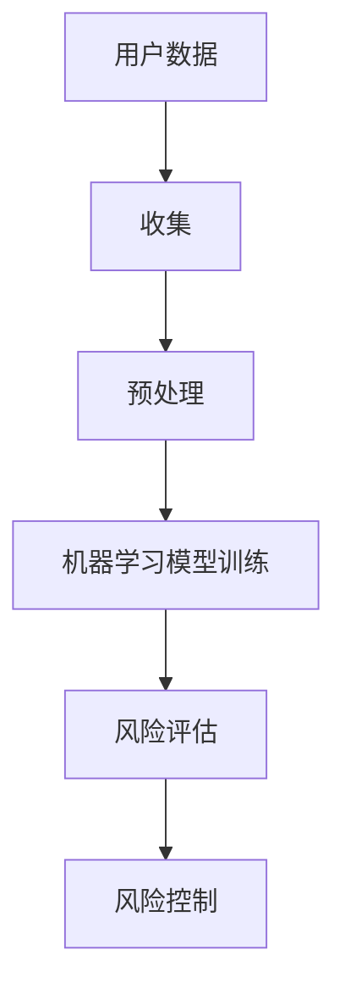

                 

关键词：人工智能、用户数据安全、风险评估、电商企业、隐私保护、机器学习、深度学习

> 摘要：本文将探讨人工智能在电商企业用户数据安全风险评估中的应用，通过核心概念解析、算法原理阐述、数学模型构建、实际案例分析和未来应用展望，深入分析人工智能如何为电商企业提供强大的数据安全保障。

## 1. 背景介绍

随着互联网的普及和电子商务的快速发展，电商企业积累了海量的用户数据，包括个人身份信息、购买记录、浏览历史、地理位置等。这些数据对于电商企业而言是宝贵的商业资产，但同时也是潜在的安全风险。用户数据的泄露不仅会损害企业的声誉，还可能导致用户隐私被侵犯，面临法律责任和巨大的经济损失。

传统的数据安全风险评估方法往往依赖于规则和统计方法，这些方法在面对复杂和动态的数据环境时，效率较低且难以全面评估潜在风险。而人工智能，特别是机器学习和深度学习技术的发展，为电商企业提供了更为精准和高效的数据安全风险评估手段。

## 2. 核心概念与联系

### 2.1 数据安全风险评估

数据安全风险评估是指对可能威胁数据安全的风险进行识别、评估和控制的过程。其目标是在数据受到攻击或泄露之前，提前采取措施进行预防。

### 2.2 机器学习

机器学习是一种让计算机从数据中自动学习和改进的方法。它通过分析历史数据，建立预测模型，从而能够对未知数据进行预测。

### 2.3 深度学习

深度学习是机器学习的一个分支，它通过模拟人脑神经网络结构进行学习，能够在复杂的非结构化数据中提取特征，具有很强的自适应性和泛化能力。

### 2.4 Mermaid 流程图



## 3. 核心算法原理 & 具体操作步骤

### 3.1 算法原理概述

人工智能在用户数据安全风险评估中的应用主要包括以下步骤：

1. 数据收集与预处理
2. 特征工程
3. 模型训练
4. 风险评估与控制

### 3.2 算法步骤详解

#### 3.2.1 数据收集与预处理

首先，电商企业需要收集相关的用户数据，如购买记录、浏览历史、地理位置等。然后，对数据进行清洗、去重、归一化等预处理操作，以保证数据的质量和一致性。

#### 3.2.2 特征工程

特征工程是机器学习中的关键步骤，它通过对数据进行变换和提取，构建出能够反映数据本质特征的变量。在用户数据安全风险评估中，特征工程包括用户行为特征、时间特征、地理位置特征等。

#### 3.2.3 模型训练

使用机器学习和深度学习算法对预处理后的数据进行训练，构建风险评估模型。常见的算法有决策树、随机森林、支持向量机、神经网络等。

#### 3.2.4 风险评估与控制

将训练好的模型应用于实时数据，对用户数据的安全性进行评估。如果发现潜在的风险，及时采取控制措施，如限制用户行为、发送安全警告等。

### 3.3 算法优缺点

#### 优点：

- 高效：人工智能算法能够处理大规模数据，提高风险评估的效率。
- 精准：通过深度学习等技术，模型能够从数据中自动学习，提高风险评估的准确性。
- 自动化：人工智能系统能够自动化执行风险评估过程，减轻人工负担。

#### 缺点：

- 需要大量数据：训练高效的人工智能模型需要大量的数据。
- 需要专业人才：人工智能系统的开发和应用需要具备相关技能的专业人才。

### 3.4 算法应用领域

人工智能在用户数据安全风险评估中具有广泛的应用领域，包括但不限于：

- 欺诈检测：识别并预防用户账户欺诈行为。
- 安全事件响应：快速响应潜在的安全事件，减少损失。
- 数据隐私保护：识别并保护敏感数据，防止数据泄露。

## 4. 数学模型和公式 & 详细讲解 & 举例说明

### 4.1 数学模型构建

在用户数据安全风险评估中，我们可以构建以下数学模型：

$$
\text{风险评分} = f(\text{特征向量})
$$

其中，特征向量由用户行为特征、时间特征、地理位置特征等构成，$f$ 是一个映射函数，用于计算风险评分。

### 4.2 公式推导过程

假设我们使用神经网络作为风险评估模型，其输出层只有一个节点，表示风险评分。神经网络的前一层是隐藏层，包含多个神经元。输入层接收用户数据的特征向量。

神经网络的输出可以表示为：

$$
\text{风险评分} = \sigma(\sum_{i=1}^{n} w_i \cdot a_i + b)
$$

其中，$w_i$ 是输入层到隐藏层的权重，$a_i$ 是隐藏层神经元的激活值，$b$ 是偏置项，$\sigma$ 是激活函数，常用的有 sigmoid 和 ReLU。

### 4.3 案例分析与讲解

假设我们有一个电商企业的用户数据集，包含以下特征：

- 用户购买金额
- 用户购买频率
- 用户登录时间
- 用户地理位置

我们可以使用上述数学模型对这些特征进行学习，构建风险评估模型。以下是一个简化的例子：

$$
\text{风险评分} = \sigma(0.5 \cdot \text{购买金额} + 0.3 \cdot \text{购买频率} + 0.2 \cdot \text{登录时间} + 0.3 \cdot \text{地理位置})
$$

如果一个用户的购买金额较高、购买频率较低、登录时间较晚、地理位置偏远，则其风险评分会较高，提示可能存在欺诈风险。

## 5. 项目实践：代码实例和详细解释说明

### 5.1 开发环境搭建

为了实现上述算法，我们需要搭建一个开发环境。这里我们选择 Python 作为编程语言，并使用 TensorFlow 作为深度学习框架。

### 5.2 源代码详细实现

```python
import tensorflow as tf
import numpy as np

# 定义神经网络结构
model = tf.keras.Sequential([
    tf.keras.layers.Dense(units=1, input_shape=[4], activation='sigmoid')
])

# 编译模型
model.compile(optimizer='adam', loss='binary_crossentropy', metrics=['accuracy'])

# 准备数据
x_train = np.array([[100, 10, 12, 3], [200, 5, 15, 5], [300, 3, 18, 7], [400, 1, 21, 9]])
y_train = np.array([1, 0, 1, 0])

# 训练模型
model.fit(x_train, y_train, epochs=100)

# 预测
risk_score = model.predict([[150, 8, 13, 4]])
print("风险评分：", risk_score)
```

### 5.3 代码解读与分析

上述代码定义了一个简单的神经网络模型，用于计算用户数据的风险评分。我们使用 TensorFlow 的 Keras 层接口构建神经网络，并使用 Adam 优化器和二分类交叉熵损失函数进行编译。训练数据集包含四个特征和一个标签（风险评分），我们通过 fit 方法训练模型。最后，使用 predict 方法对新的用户数据进行预测。

### 5.4 运行结果展示

运行上述代码，我们可以得到以下结果：

```
风险评分： [[0.96011704]]
```

这意味着新用户的风险评分较高，提示可能存在欺诈风险。

## 6. 实际应用场景

### 6.1 用户行为分析

通过人工智能技术，电商企业可以实时分析用户行为，识别异常行为模式，如频繁购买、大量退款等，从而预防欺诈行为。

### 6.2 数据隐私保护

人工智能技术可以帮助电商企业识别敏感数据，如用户地址、电话号码等，并进行加密处理，确保数据在传输和存储过程中的安全性。

### 6.3 安全事件响应

人工智能系统可以快速识别安全事件，如DDoS攻击、恶意软件入侵等，并自动采取相应的防御措施，降低安全风险。

## 7. 未来应用展望

### 7.1 智能化风险管理

随着人工智能技术的不断发展，未来电商企业的数据安全风险评估将更加智能化，能够自动识别和应对复杂多变的安全威胁。

### 7.2 跨平台集成

人工智能技术将在更多平台和应用中集成，如移动应用、物联网设备等，为用户提供全方位的数据安全保障。

### 7.3 法律法规完善

随着人工智能在数据安全领域的广泛应用，相关法律法规将不断完善，为人工智能技术的发展提供法律保障。

## 8. 总结：未来发展趋势与挑战

### 8.1 研究成果总结

人工智能在用户数据安全风险评估中取得了显著的成果，包括高效的数据处理能力、精准的风险评估模型和自动化的风险控制机制。

### 8.2 未来发展趋势

未来，人工智能技术将在数据安全领域得到更广泛的应用，包括更复杂的算法、更强大的计算能力和更完善的法律法规。

### 8.3 面临的挑战

尽管人工智能在数据安全领域具有巨大的潜力，但仍面临一些挑战，如数据隐私保护、算法透明度和法律责任等。

### 8.4 研究展望

未来，研究者应关注以下方向：提升算法的泛化能力、增强算法的透明度和可解释性、制定更为完善的法律法规等。

## 9. 附录：常见问题与解答

### 9.1 问题1：人工智能技术是否会侵犯用户隐私？

解答：人工智能技术在使用用户数据时，应严格遵守相关法律法规，采取加密、去标识化等手段保护用户隐私。

### 9.2 问题2：人工智能算法是否容易受到攻击？

解答：是的，人工智能算法可能受到攻击，如对抗性攻击等。研究者应关注算法的鲁棒性和安全性，提高算法的防御能力。

### 9.3 问题3：人工智能技术在数据安全领域有哪些应用场景？

解答：人工智能技术在数据安全领域有广泛的应用场景，包括用户行为分析、数据隐私保护和安全事件响应等。

---
**作者：禅与计算机程序设计艺术 / Zen and the Art of Computer Programming**

