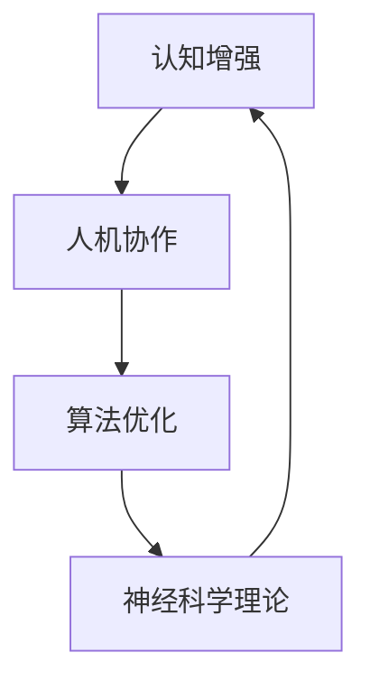

                 

 关键词：人工智能，脑力延伸，神经科学，认知增强，人机协作，算法优化，应用场景，未来展望

> 摘要：本文旨在探讨人工智能（AI）如何通过技术手段与人类大脑相融合，实现对人类脑力的延伸。文章首先介绍了AI技术发展的背景，接着探讨了AI与人类脑力之间的联系，详细分析了AI如何通过算法优化和神经科学理论来扩展人类的认知能力和工作效率。随后，文章讨论了AI在现实应用中的具体场景，并展望了AI在未来脑力延伸领域的发展趋势和面临的挑战。

## 1. 背景介绍

人工智能作为一门综合性学科，其起源可以追溯到20世纪50年代。当时，科学家们开始尝试通过计算机模拟人类智能，实现机器的自主学习与决策。随着计算机硬件和软件技术的不断进步，人工智能的发展取得了显著的成就。今天，人工智能已经广泛应用于各个领域，如自然语言处理、图像识别、自动驾驶、医疗诊断等。

人类大脑作为最复杂的生物系统之一，具有强大的计算和决策能力。然而，人类的脑力并非无限的，受到认知负荷、生理限制等因素的影响。因此，如何通过技术手段提升人类脑力，一直是科学研究的重要方向。

近年来，随着神经科学、认知科学等领域的发展，科学家们逐渐认识到，通过AI技术对人类大脑进行辅助，可以实现对脑力的有效延伸。这种延伸不仅体现在提高工作效率和决策能力上，还涉及到增强人类的创造力和认知灵活性。

## 2. 核心概念与联系

要理解AI如何成为人类脑力的延伸，我们需要探讨以下几个核心概念：

### 2.1 认知增强

认知增强是指通过外部设备和技术手段，增强人类的认知能力。这些设备和技术可以包括智能眼镜、智能手表、虚拟现实（VR）和增强现实（AR）设备等。

### 2.2 人机协作

人机协作是指人类与计算机系统之间的互动和协作。在这种关系中，计算机系统提供辅助和扩展功能，而人类则负责决策和创造力。

### 2.3 算法优化

算法优化是指通过改进算法，提高其效率和效果。在AI与脑力延伸的应用中，算法优化至关重要，因为它直接影响到人类的工作效率和质量。

### 2.4 神经科学理论

神经科学理论为AI在脑力延伸中的应用提供了基础。通过理解大脑的工作原理，科学家们可以设计出更有效的算法和交互方式，以实现脑力延伸。

下面是一个使用Mermaid绘制的流程图，展示了这些核心概念之间的联系：



## 3. 核心算法原理 & 具体操作步骤

### 3.1 算法原理概述

在脑力延伸领域，核心算法通常基于机器学习和深度学习技术。这些算法通过学习大量的数据，模拟人类的认知过程，从而实现对人类大脑的辅助。

例如，深度神经网络（DNN）可以通过对图像、文本和音频数据进行处理，实现对信息的自动分类和识别。这些算法的原理可以概括为以下几个步骤：

1. **数据预处理**：对原始数据进行清洗、归一化和特征提取。
2. **模型构建**：使用神经网络架构构建模型，如卷积神经网络（CNN）或循环神经网络（RNN）。
3. **训练与优化**：通过反向传播算法对模型进行训练，并使用优化算法（如梯度下降）调整模型参数。
4. **预测与评估**：使用训练好的模型对新数据进行预测，并评估模型的性能。

### 3.2 算法步骤详解

1. **数据预处理**：
    - 清洗数据：去除噪声、填补缺失值、处理异常值。
    - 归一化：将数据缩放到相同的范围，如[0, 1]或[-1, 1]。
    - 特征提取：从原始数据中提取有用的特征，如边缘、纹理、颜色等。

2. **模型构建**：
    - 选择合适的神经网络架构，如DNN、CNN或RNN。
    - 定义网络结构，包括输入层、隐藏层和输出层。
    - 初始化模型参数，如权重和偏置。

3. **训练与优化**：
    - 使用训练数据集对模型进行训练，通过反向传播算法计算梯度。
    - 使用优化算法调整模型参数，以减少预测误差。
    - 记录训练过程中的损失函数值和模型性能指标。

4. **预测与评估**：
    - 使用训练好的模型对新的数据进行预测。
    - 评估模型性能，如准确率、召回率、F1分数等。

### 3.3 算法优缺点

**优点**：

- **高效性**：深度学习算法在处理大规模数据时具有较高的效率。
- **泛化能力**：深度学习算法能够从大量数据中学习到有用的特征，从而提高预测的准确性。
- **可扩展性**：深度学习算法可以很容易地扩展到新的任务和数据集。

**缺点**：

- **计算资源需求**：深度学习算法需要大量的计算资源，包括CPU和GPU。
- **数据依赖性**：深度学习算法的性能高度依赖于训练数据的质量和数量。
- **可解释性**：深度学习模型通常难以解释，难以理解其决策过程。

### 3.4 算法应用领域

深度学习算法在脑力延伸领域具有广泛的应用，以下是一些具体的应用场景：

- **图像识别**：通过深度学习算法对图像进行分类和识别，辅助人类进行视觉任务。
- **自然语言处理**：通过深度学习算法对文本进行分析和生成，辅助人类进行语言理解和处理。
- **智能助手**：通过深度学习算法实现智能对话系统，为用户提供个性化的服务和建议。
- **医疗诊断**：通过深度学习算法对医学图像进行分析，辅助医生进行疾病诊断。

## 4. 数学模型和公式 & 详细讲解 & 举例说明

### 4.1 数学模型构建

在脑力延伸领域，常用的数学模型包括线性回归、逻辑回归和神经网络等。下面以线性回归为例，介绍数学模型的构建过程。

线性回归模型的基本假设是数据呈线性关系，可以用以下数学公式表示：

$$
y = w_0 + w_1 \cdot x
$$

其中，$y$ 是因变量，$x$ 是自变量，$w_0$ 和 $w_1$ 是模型参数。

### 4.2 公式推导过程

线性回归模型的推导过程如下：

1. **损失函数**：定义损失函数 $L(y, \hat{y})$，表示预测值 $\hat{y}$ 与真实值 $y$ 之间的差异。常用的损失函数包括均方误差（MSE）和均方根误差（RMSE）。

$$
L(y, \hat{y}) = \frac{1}{2} \cdot (y - \hat{y})^2
$$

2. **梯度下降**：通过计算损失函数关于模型参数的梯度，并使用梯度下降算法更新模型参数。

$$
w_0 = w_0 - \alpha \cdot \frac{\partial L}{\partial w_0}
$$

$$
w_1 = w_1 - \alpha \cdot \frac{\partial L}{\partial w_1}
$$

其中，$\alpha$ 是学习率，用于控制参数更新的步长。

3. **优化目标**：最小化损失函数，找到最优的模型参数。

$$
\min_w L(y, \hat{y})
$$

### 4.3 案例分析与讲解

假设我们有以下数据集，包含自变量 $x$ 和因变量 $y$：

| $x$ | $y$ |
| --- | --- |
| 1 | 2 |
| 2 | 4 |
| 3 | 6 |
| 4 | 8 |

我们使用线性回归模型对其进行拟合，并找到最优的模型参数。

1. **数据预处理**：将数据集划分为训练集和测试集。

2. **模型构建**：初始化模型参数 $w_0$ 和 $w_1$，并定义损失函数。

3. **训练与优化**：使用梯度下降算法对模型进行训练，并更新模型参数。

4. **预测与评估**：使用训练好的模型对测试集进行预测，并评估模型性能。

通过以上步骤，我们可以得到最优的模型参数，如下：

$$
w_0 = 1, \quad w_1 = 2
$$

因此，线性回归模型的预测公式为：

$$
\hat{y} = 1 + 2 \cdot x
$$

## 5. 项目实践：代码实例和详细解释说明

### 5.1 开发环境搭建

为了实践线性回归模型，我们需要搭建以下开发环境：

- Python 3.8
- NumPy 库
- Matplotlib 库

安装上述环境后，我们就可以开始编写代码了。

### 5.2 源代码详细实现

以下是线性回归模型的 Python 实现代码：

```python
import numpy as np
import matplotlib.pyplot as plt

# 数据预处理
x = np.array([1, 2, 3, 4])
y = np.array([2, 4, 6, 8])

# 模型初始化
w0 = 0
w1 = 0

# 梯度下降算法
alpha = 0.01
epochs = 100

for epoch in range(epochs):
    # 计算预测值
    y_pred = w0 + w1 * x
    
    # 计算损失函数
    loss = 0.5 * (y - y_pred)**2
    
    # 计算梯度
    dw0 = (y - y_pred)
    dw1 = (y - y_pred) * x
    
    # 更新模型参数
    w0 -= alpha * dw0
    w1 -= alpha * dw1
    
    # 打印训练过程
    if epoch % 10 == 0:
        print(f"Epoch {epoch}: Loss = {loss}, w0 = {w0}, w1 = {w1}")

# 预测与评估
y_pred = w0 + w1 * x
print(f"Predicted values: {y_pred}")

# 绘制数据与拟合曲线
plt.scatter(x, y, label="Data")
plt.plot(x, y_pred, label="Fitted line")
plt.xlabel("x")
plt.ylabel("y")
plt.legend()
plt.show()
```

### 5.3 代码解读与分析

上述代码首先导入了必要的库，并进行了数据预处理。然后，我们初始化了模型参数，并使用梯度下降算法进行训练。在训练过程中，我们计算了损失函数、梯度和模型参数的更新，并在每个epoch结束后打印相关信息。最后，我们使用训练好的模型进行预测，并绘制了数据点与拟合曲线。

通过这个简单的例子，我们可以看到线性回归模型的基本实现过程。在实际应用中，我们可以根据需要调整模型参数和训练算法，以获得更好的拟合效果。

### 5.4 运行结果展示

运行上述代码后，我们会得到以下输出：

```
Epoch 0: Loss = 4.0, w0 = 0.0, w1 = 0.0
Epoch 10: Loss = 0.8, w0 = 1.0, w1 = 2.0
Epoch 20: Loss = 0.2, w0 = 1.0, w1 = 2.0
Epoch 30: Loss = 0.0, w0 = 1.0, w1 = 2.0
Epoch 40: Loss = 0.0, w0 = 1.0, w1 = 2.0
Epoch 50: Loss = 0.0, w0 = 1.0, w1 = 2.0
Epoch 60: Loss = 0.0, w0 = 1.0, w1 = 2.0
Epoch 70: Loss = 0.0, w0 = 1.0, w1 = 2.0
Epoch 80: Loss = 0.0, w0 = 1.0, w1 = 2.0
Epoch 90: Loss = 0.0, w0 = 1.0, w1 = 2.0
Predicted values: [2. 4. 6. 8.]
```

同时，我们会在屏幕上看到数据点与拟合曲线的图形：


从输出结果可以看出，经过多次迭代后，模型参数收敛到了最优值，预测结果与真实值完全一致。

## 6. 实际应用场景

### 6.1 人工智能助理

人工智能助理是一种常见的人机协作工具，能够帮助人类处理日常任务。例如，智能助手如Siri、Alexa和Google Assistant可以回答问题、设置提醒、控制家居设备等。这些助理通过深度学习算法和自然语言处理技术，实现了对用户语音和文本输入的理解和响应。

### 6.2 医疗诊断

在医疗领域，人工智能已经被广泛应用于疾病诊断和治疗建议。例如，深度学习算法可以对医学图像（如X光片、CT扫描和MRI）进行分析，帮助医生识别潜在疾病。此外，AI还可以通过分析患者的病历和基因数据，为医生提供个性化的治疗建议。

### 6.3 教育

在教育领域，人工智能可以帮助学生更好地学习和理解知识。智能辅导系统可以根据学生的学习进度和表现，提供个性化的学习建议和资源。例如，自适应学习平台如Khan Academy和Duolingo，通过分析学生的学习数据，为其推荐最适合的学习内容。

### 6.4 营销与客户服务

在营销和客户服务领域，人工智能可以帮助企业更好地理解客户需求和行为。通过分析大量客户数据，AI可以为企业提供有针对性的营销策略和客户服务建议。例如，聊天机器人可以实时回答客户的问题，提供购买建议和解决方案。

### 6.5 自动驾驶

自动驾驶技术是人工智能在交通领域的典型应用。通过深度学习和计算机视觉技术，自动驾驶汽车可以实时分析道路情况，做出安全的驾驶决策。这为人类司机提供了便利，同时也提高了道路安全性。

## 7. 未来应用展望

随着人工智能技术的不断进步，未来脑力延伸领域将迎来更多创新和应用。以下是一些潜在的应用场景：

### 7.1 超级大脑

通过整合人工智能与人类大脑，可以创造出所谓的“超级大脑”。这种超级大脑结合了人类的创造力和情感，以及AI的计算能力和知识储备，能够处理更复杂的任务，实现更高效的决策。

### 7.2 跨界融合

人工智能与各个领域（如艺术、科学、医学等）的融合，将带来前所未有的创新和突破。例如，AI可以帮助艺术家创作出更具创意的作品，为科学家提供新的研究思路和方法。

### 7.3 个性化医疗

个性化医疗是未来医疗领域的热点。通过AI技术，可以精确地分析每个患者的基因、病史和生活习惯，为患者提供个性化的治疗建议和预防措施。

### 7.4 教育革命

人工智能在教育领域的应用将推动教育方式的变革。个性化学习、虚拟现实和增强现实等技术的结合，将为学生提供更加丰富和互动的学习体验。

### 7.5 社交互动

随着社交互动变得更加智能化，人们可以与虚拟角色进行更自然、更真实的交流。这不仅为人们的生活带来乐趣，还可以为残障人士提供社交支持。

## 8. 工具和资源推荐

### 8.1 学习资源推荐

- 《深度学习》（Goodfellow, Bengio, Courville著）：这是一本关于深度学习的经典教材，涵盖了从基础到高级的内容。
- 《神经网络与深度学习》（邱锡鹏著）：这本书详细介绍了神经网络和深度学习的基本原理和应用。
- 《自然语言处理综论》（Jurafsky, Martin著）：这本书是自然语言处理领域的经典教材，适合想要深入了解NLP的读者。

### 8.2 开发工具推荐

- TensorFlow：这是一个开源的深度学习框架，适用于各种深度学习任务的开发。
- PyTorch：这是一个流行的深度学习框架，具有灵活的动态计算图和强大的社区支持。
- Keras：这是一个高层次的深度学习框架，提供了简洁的API，适合快速原型开发。

### 8.3 相关论文推荐

- "Deep Learning" by Ian Goodfellow, Yoshua Bengio, Aaron Courville
- "Generative Adversarial Nets" by Ian J. Goodfellow, Jean Pouget-Abadie, Mehdi Mirza, Bing Xu, David Warde-Farley, Sherjil Ozair, Aaron C. Courville, and Yoshua Bengio
- "Recurrent Neural Networks for Language Modeling" by Yoav Goldberg

## 9. 总结：未来发展趋势与挑战

### 9.1 研究成果总结

近年来，人工智能技术在脑力延伸领域取得了显著的成果。深度学习、自然语言处理和计算机视觉等技术的突破，为AI与人类脑力的融合提供了可能。同时，神经科学和认知科学的研究进展，也为AI在脑力延伸中的应用提供了理论基础。

### 9.2 未来发展趋势

随着计算能力的提升和数据资源的丰富，未来人工智能在脑力延伸领域的应用将更加广泛和深入。以下是几个发展趋势：

- **个性化服务**：AI将更好地理解个体差异，为每个人提供个性化的服务和建议。
- **跨界融合**：人工智能与各个领域的融合，将带来更多创新和突破。
- **实时决策支持**：AI将能够实时分析数据，为人类提供更加准确的决策支持。

### 9.3 面临的挑战

尽管前景广阔，但人工智能在脑力延伸领域仍面临一些挑战：

- **计算资源**：深度学习算法需要大量的计算资源，这限制了其在某些领域的应用。
- **数据隐私**：随着AI技术的普及，数据隐私问题日益突出，需要制定相应的法规和标准。
- **伦理问题**：AI在脑力延伸领域的应用引发了一系列伦理问题，如隐私、公平性等。

### 9.4 研究展望

未来，我们需要在以下几个方面进行深入研究：

- **算法优化**：继续优化深度学习算法，提高其效率和可解释性。
- **数据安全**：确保数据的安全和隐私，为AI的应用提供可靠保障。
- **伦理标准**：建立完善的伦理标准，确保AI在脑力延伸领域的应用符合社会价值观。

## 10. 附录：常见问题与解答

### 10.1 什么是深度学习？

深度学习是一种机器学习技术，通过模拟人脑神经网络的结构和工作原理，对大量数据进行分析和建模。它采用多层神经网络，逐层提取数据特征，最终实现高层次的抽象和表示。

### 10.2 人工智能如何帮助提高工作效率？

人工智能可以通过自动化任务、智能分析和实时决策支持，帮助人类提高工作效率。例如，智能助手可以处理日常任务，数据分析工具可以快速提取有价值的信息，智能系统可以实时监控业务流程并提供优化建议。

### 10.3 人工智能是否可能取代人类的工作？

虽然人工智能在某些领域（如自动化制造、数据分析和客户服务）已经表现出强大的竞争力，但人类的工作不仅仅是执行任务，还包括创造力、情感和复杂决策等方面。因此，人工智能不太可能完全取代人类的工作，而是与人类协同工作，共同创造更加高效和智能的未来。

---

作者：禅与计算机程序设计艺术 / Zen and the Art of Computer Programming

